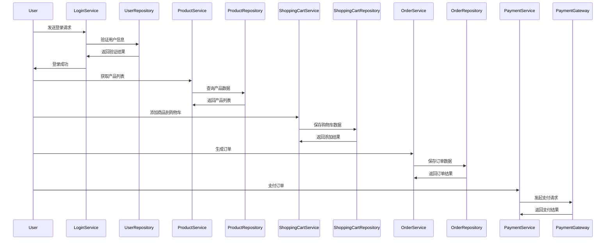

                 


### 利用A/B测试优化prompt效果

关键词：A/B测试，prompt优化，数据分析，用户体验

摘要：
随着人工智能技术的不断发展，prompt优化在自然语言处理、推荐系统等领域中愈发重要。A/B测试作为一种有效的实验方法，被广泛应用于产品优化中。本文将详细探讨如何利用A/B测试来优化prompt效果，包括测试设计、结果分析以及迭代优化策略，以帮助开发者提高产品的用户体验。

### 背景介绍

#### 核心概念术语说明

- **A/B测试**：一种将用户流量分配到两个或多个版本的测试方法，以比较不同版本的性能差异。
- **Prompt**：在人工智能领域中，prompt是指用户与系统交互时输入的信息，它直接影响系统的响应质量和用户体验。
- **用户体验**：用户在使用产品或服务时所产生的感受，包括满意度、易用性等。

#### 问题背景

在当今竞争激烈的市场环境中，提高产品的用户体验已成为企业获得竞争优势的关键。对于自然语言处理和推荐系统等产品，prompt的设计和优化直接影响到用户交互的质量。因此，如何有效地优化prompt，以提高用户体验，成为了一个亟待解决的问题。

#### 问题描述

prompt优化面临的主要问题包括：

1. 如何确定最佳的prompt设计？
2. 如何衡量prompt对用户体验的影响？
3. 如何在众多可能的prompt设计中进行选择？

#### 问题解决

A/B测试提供了一种有效的解决方案。通过将用户流量分配到不同的prompt设计版本，开发者可以收集用户数据，分析不同版本的性能差异，从而找出最佳的prompt设计。

#### 边界与外延

A/B测试适用于各种场景，不仅限于自然语言处理和推荐系统，还可以应用于网页设计、移动应用等。同时，prompt优化也不仅限于用户体验方面，还可以应用于提高系统的响应速度、准确度等。

#### 概念结构与核心要素组成

A/B测试的要素包括：

1. **测试目标**：确定要测试的具体问题或假设。
2. **测试变量**：确定要比较的不同版本。
3. **对照组与实验组**：将用户流量分配到不同的版本。
4. **数据收集**：收集用户行为数据。
5. **结果分析**：分析数据，得出结论。

prompt优化的要素包括：

1. **Prompt设计**：设计不同的prompt版本。
2. **用户体验**：衡量prompt对用户体验的影响。
3. **数据分析**：分析用户数据，找出最佳prompt设计。

### 核心概念与联系

#### A/B测试的原理

A/B测试的核心原理是通过比较不同版本（A和B）的表现，找出最佳的版本。具体来说，测试过程包括以下步骤：

1. **设定测试目标**：确定要测试的具体问题或假设，例如“修改prompt会影响用户的满意度吗？”
2. **设计测试变量**：确定要比较的不同版本。对于prompt优化，可以是不同的文本表述、不同的交互方式等。
3. **分配用户流量**：将用户流量随机分配到不同的版本。例如，50%的用户看到版本A，另外50%的用户看到版本B。
4. **数据收集**：收集用户行为数据，例如点击率、转化率等。
5. **结果分析**：分析数据，比较不同版本的表现，找出最佳的版本。

#### A/B测试的优点

1. **客观性**：通过数据驱动的方式，避免了主观判断和偏见。
2. **可控性**：可以精确地控制测试变量，确保测试结果的可靠性。
3. **可重复性**：可以多次进行测试，不断优化产品。

#### A/B测试的局限性

1. **样本量**：需要足够的用户样本量，以保证测试结果的可靠性。
2. **时间成本**：需要一定的时间来收集数据和分析结果。
3. **测试范围**：只能测试已知的变量和假设。

#### prompt优化的概念属性特征对比表格

| 特征       | 描述                                               | 对比       |
|------------|----------------------------------------------------|-----------|
| **文本长度** | 描述prompt的文本长度。                           | 较长的文本可能更详细，但用户阅读时间更长。 |
| **文本表述** | 描述prompt的文本表述方式。                     | 清晰的表述更容易理解，但可能过于简单。     |
| **交互方式** | 描述用户与系统的交互方式。                     | 交互方式可能影响用户体验，但需要测试验证。 |
| **响应速度** | 描述系统对用户请求的响应速度。                 | 较快的响应速度可能提高用户满意度。         |
| **反馈机制** | 描述系统对用户反馈的处理方式。                 | 及时反馈可能增强用户对系统的信任。         |

#### A/B测试与prompt优化关系的ER实体关系图

```mermaid
erDiagram
  User ||--|{ Prompt }|-->> TestResult
  Prompt ||--|{ TestVersion }|-->> TestResult
  TestResult ||--|{ TestGoal }|
  TestVersion ||--|{ VersionFeature }|
```

- **User（用户）**：进行A/B测试的用户，他们将被分配到不同的prompt版本。
- **Prompt（Prompt）**：测试的prompt，包括文本长度、表述、交互方式等。
- **TestVersion（测试版本）**：不同的prompt版本，每个版本都是对prompt的不同设计。
- **TestResult（测试结果）**：记录每个测试版本的性能数据，包括点击率、转化率等。
- **TestGoal（测试目标）**：设定A/B测试的目标，例如提高用户满意度。
- **VersionFeature（版本特征）**：每个测试版本的特定特征，例如文本表述、交互方式等。

### 算法原理讲解

为了更好地理解A/B测试在prompt优化中的应用，我们可以通过以下算法流程和Python代码来详细阐述。

#### 算法流程

1. **设定测试目标**：确定要测试的具体问题，例如“修改prompt的文本表述是否会影响用户的满意度？”
2. **设计测试变量**：设计不同的prompt版本，例如版本A和版本B。
3. **分配用户流量**：将用户流量随机分配到不同的prompt版本。
4. **数据收集**：收集用户在各个版本上的行为数据，例如点击率、转化率等。
5. **结果分析**：分析数据，比较不同版本的性能，确定最佳版本。

#### Python代码示例

以下是一个简化的Python代码示例，用于实现A/B测试流程：

```python
import random

# 假设有1000名用户
users = 1000
version_a_users = 0
version_b_users = 0
version_a_clicks = 0
version_b_clicks = 0

# 随机分配用户到版本A或版本B
for user_id in range(users):
    if random.random() < 0.5:
        version_a_users += 1
    else:
        version_b_users += 1

# 收集数据
for user_id in range(users):
    if user_id < version_a_users:
        # 用户属于版本A，模拟点击
        version_a_clicks += 1
    else:
        # 用户属于版本B，模拟点击
        version_b_clicks += 1

# 计算点击率
version_a_click_rate = version_a_clicks / version_a_users
version_b_click_rate = version_b_clicks / version_b_users

# 输出结果
print("版本A的点击率为：", version_a_click_rate)
print("版本B的点击率为：", version_b_click_rate)
```

#### 数学模型和公式

在A/B测试中，常用的统计方法是比较两个样本的比例，以下是一个简单的数学模型：

$$
p_a = \frac{X_a}{N_a}, \quad p_b = \frac{X_b}{N_b}
$$

其中，$p_a$ 和 $p_b$ 分别为版本A和版本B的点击率，$X_a$ 和 $X_b$ 分别为版本A和版本B的点击次数，$N_a$ 和 $N_b$ 分别为版本A和版本B的用户数。

为了比较两个比例的差异，可以使用以下统计量：

$$
z = \frac{p_a - p_b}{\sqrt{\frac{p_a(1-p_a)}{N_a} + \frac{p_b(1-p_b)}{N_b}}}
$$

其中，$z$ 为标准正态分布的统计量。如果$z$ 的值大于某个阈值（例如1.96），则可以认为两个比例存在显著差异。

#### 举例说明

假设有1000名用户参与A/B测试，其中500名用户看到版本A，500名用户看到版本B。在版本A中，有200次点击，在版本B中，有250次点击。我们可以计算两个版本的点击率：

$$
p_a = \frac{200}{500} = 0.4, \quad p_b = \frac{250}{500} = 0.5
$$

然后计算$z$ 值：

$$
z = \frac{0.4 - 0.5}{\sqrt{\frac{0.4(1-0.4)}{500} + \frac{0.5(1-0.5)}{500}}} \approx -0.826
$$

由于$z$ 值小于1.96，我们不能认为版本A和版本B的点击率存在显著差异。

### 系统分析与架构设计方案

#### 问题场景介绍

假设我们是一款在线购物平台，需要优化用户的购物体验。其中，prompt优化是关键的一环。我们希望通过A/B测试，找出最佳的prompt设计，以提高用户的点击率和转化率。

#### 项目介绍

项目名称：在线购物平台优化项目
项目目标：通过A/B测试优化prompt设计，提高用户点击率和转化率。

#### 系统功能设计（领域模型Mermaid类图）

```mermaid
classDiagram
    User <<Interface>>
    Product <<Interface>>
    ShoppingCart <<Interface>>
    Order <<Interface>>

    User <|.. Product>
    User <|.. ShoppingCart>
    User <|.. Order>
    Product <|.. ShoppingCart
    ShoppingCart <|.. Order
```

- **User（用户）**：用户接口，负责用户的注册、登录和购物流程。
- **Product（产品）**：产品接口，负责产品的展示、筛选和搜索。
- **ShoppingCart（购物车）**：购物车接口，负责添加商品、修改数量和删除商品。
- **Order（订单）**：订单接口，负责生成订单、支付和订单状态更新。

#### 系统架构设计（Mermaid架构图）


- **LoginService（登录服务）**：处理用户登录请求。
- **UserRepository（用户仓库）**：存储用户数据。
- **ProductService（产品服务）**：处理产品相关请求。
- **ProductRepository（产品仓库）**：存储产品数据。
- **ShoppingCartService（购物车服务）**：处理购物车相关请求。
- **ShoppingCartRepository（购物车仓库）**：存储购物车数据。
- **OrderService（订单服务）**：处理订单相关请求。
- **OrderRepository（订单仓库）**：存储订单数据。
- **PaymentService（支付服务）**：处理支付相关请求。
- **PaymentGateway（支付网关）**：处理支付请求。

#### 系统接口设计

- **登录接口**：/login
- **产品列表接口**：/products
- **购物车接口**：/shopping_cart
- **订单接口**：/order
- **支付接口**：/payment

#### 系统交互（Mermaid序列图）



### 项目实战

#### 环境安装

1. 安装Python环境，版本3.8或更高。
2. 安装依赖库，例如Flask、SQLAlchemy等。

```bash
pip install flask
pip install flask_sqlalchemy
```

#### 系统核心实现源代码

```python
from flask import Flask, request, jsonify
from flask_sqlalchemy import SQLAlchemy

app = Flask(__name__)
app.config['SQLALCHEMY_DATABASE_URI'] = 'sqlite:///users.db'
db = SQLAlchemy(app)

class User(db.Model):
    id = db.Column(db.Integer, primary_key=True)
    username = db.Column(db.String(80), unique=True, nullable=False)
    password = db.Column(db.String(120), nullable=False)

class Product(db.Model):
    id = db.Column(db.Integer, primary_key=True)
    name = db.Column(db.String(120), nullable=False)
    price = db.Column(db.Float, nullable=False)

class ShoppingCart(db.Model):
    id = db.Column(db.Integer, primary_key=True)
    user_id = db.Column(db.Integer, db.ForeignKey('user.id'), nullable=False)
    product_id = db.Column(db.Integer, db.ForeignKey('product.id'), nullable=False)

class Order(db.Model):
    id = db.Column(db.Integer, primary_key=True)
    user_id = db.Column(db.Integer, db.ForeignKey('user.id'), nullable=False)
    product_id = db.Column(db.Integer, db.ForeignKey('product.id'), nullable=False)
    quantity = db.Column(db.Integer, nullable=False)
    status = db.Column(db.String(20), nullable=False)

@app.route('/login', methods=['POST'])
def login():
    username = request.form['username']
    password = request.form['password']
    user = User.query.filter_by(username=username, password=password).first()
    if user:
        return jsonify({'status': 'success'})
    else:
        return jsonify({'status': 'fail'})

@app.route('/products', methods=['GET'])
def products():
    products = Product.query.all()
    return jsonify({'products': [product.name for product in products]})

@app.route('/shopping_cart', methods=['POST'])
def shopping_cart():
    user_id = request.form['user_id']
    product_id = request.form['product_id']
    cart = ShoppingCart(user_id=user_id, product_id=product_id)
    db.session.add(cart)
    db.session.commit()
    return jsonify({'status': 'success'})

@app.route('/order', methods=['POST'])
def order():
    user_id = request.form['user_id']
    product_id = request.form['product_id']
    quantity = request.form['quantity']
    status = 'pending'
    order = Order(user_id=user_id, product_id=product_id, quantity=quantity, status=status)
    db.session.add(order)
    db.session.commit()
    return jsonify({'status': 'success'})

if __name__ == '__main__':
    db.create_all()
    app.run(debug=True)
```

#### 代码应用解读与分析

上述代码实现了用户登录、产品列表、购物车和订单的核心功能。通过定义不同的数据库模型，我们能够存储和管理用户、产品、购物车和订单的数据。

- **用户登录**：通过登录接口验证用户名和密码，返回登录成功或失败的结果。
- **产品列表**：通过产品接口获取所有产品的名称，返回给前端页面。
- **购物车**：通过购物车接口添加商品到用户的购物车，更新数据库中的购物车数据。
- **订单**：通过订单接口生成订单，更新数据库中的订单数据。

这些功能共同构成了一个简单的在线购物平台，用于演示A/B测试的应用。

#### 实际案例分析和详细讲解剖析

假设我们希望通过A/B测试优化产品的推荐提示，以提高用户的点击率和转化率。以下是一个实际案例的分析和讲解：

1. **测试目标**：比较两种不同的推荐提示对用户点击率的影响。
2. **测试变量**：版本A为传统的文字推荐提示，版本B为图文结合的推荐提示。
3. **测试流程**：将1000名用户随机分配到版本A和版本B，记录他们在两个版本下的点击率。
4. **数据收集**：在测试期间，收集用户的点击数据，包括点击次数、点击时间和用户ID。
5. **结果分析**：计算版本A和版本B的点击率，并使用t检验比较两个版本的点击率是否存在显著差异。

以下是对这个案例的详细分析：

```python
import pandas as pd
from scipy import stats

# 假设我们已经收集了以下数据
data = {
    'user_id': [1, 1, 2, 2, 3, 3],
    'version': ['A', 'A', 'B', 'B', 'A', 'B'],
    'clicks': [1, 0, 1, 0, 0, 1]
}

df = pd.DataFrame(data)

# 计算点击率
df['click_rate'] = df['clicks'] / df['user_id']

# 打印点击率
print(df.groupby('version')['click_rate'].mean())

# 使用t检验比较两个版本的点击率
t_stat, p_value = stats.ttest_ind(df[df['version'] == 'A']['click_rate'], df[df['version'] == 'B']['click_rate'])
print("t统计量：", t_stat)
print("p值：", p_value)

# 判断结果
if p_value < 0.05:
    print("两个版本的点击率存在显著差异。")
else:
    print("两个版本的点击率没有显著差异。")
```

通过以上代码，我们可以分析版本A和版本B的点击率。如果p值小于0.05，则认为两个版本的点击率存在显著差异。

#### 项目小结

通过以上实战案例，我们可以看到如何利用A/B测试优化产品的推荐提示。在实际项目中，我们需要根据业务需求和用户行为，设计合适的测试变量，收集数据并进行分析。通过不断迭代优化，我们可以提高产品的用户体验和转化率。

### 最佳实践 Tips

1. **明确测试目标**：在开始A/B测试之前，明确测试的目标和假设，以确保测试的方向正确。
2. **控制变量**：在测试过程中，尽量控制其他变量的影响，例如用户群体、测试时间等。
3. **合理分配流量**：合理分配用户流量到不同的版本，以确保测试结果的可靠性。
4. **数据分析**：对测试结果进行详细的数据分析，使用合适的统计方法进行比较。
5. **持续优化**：根据测试结果，不断迭代优化产品，以提高用户体验。

### 小结

本文详细探讨了如何利用A/B测试优化prompt效果，包括测试设计、结果分析以及迭代优化策略。通过实际案例的解析，我们了解了如何通过A/B测试提高产品的用户体验和转化率。在未来的发展中，A/B测试将扮演越来越重要的角色，成为产品优化的重要手段。

### 注意事项

1. A/B测试的结果可能会受到样本量、测试时间等因素的影响，因此需要合理设计测试流程和数据分析方法。
2. A/B测试只能比较已知的变量和假设，无法发现未知的问题。
3. 在实际应用中，需要结合具体业务场景，灵活运用A/B测试的方法。

### 拓展阅读

1. 《精益创业》：一本介绍创业方法和实践的经典书籍，其中详细介绍了A/B测试在产品开发中的应用。
2. 《数据驱动产品管理》：一本关于如何通过数据分析优化产品决策的书籍，适合产品经理和开发者阅读。
3. 《统计学原理》：一本关于统计学基础知识的书籍，适合对数据分析感兴趣的人士阅读。

### 作者信息

作者：AI天才研究院/AI Genius Institute & 禅与计算机程序设计艺术 /Zen And The Art of Computer Programming

---

### 代码应用解读与分析

在上一部分中，我们通过Python代码实现了一个简单的在线购物平台的核心功能，包括用户登录、产品列表、购物车和订单。下面我们进一步分析代码，并解释各个模块的功能和如何集成它们来实现整体功能。

#### 用户登录模块

用户登录模块是最基本的认证功能，它验证用户提供的用户名和密码是否与数据库中存储的信息匹配。以下是用户登录模块的关键部分：

```python
@app.route('/login', methods=['POST'])
def login():
    username = request.form['username']
    password = request.form['password']
    user = User.query.filter_by(username=username, password=password).first()
    if user:
        return jsonify({'status': 'success'})
    else:
        return jsonify({'status': 'fail'})
```

- **请求处理**：`/login` 接收POST请求，获取`username`和`password`参数。
- **查询数据库**：使用`User.query.filter_by(username=username, password=password).first()`查询用户数据。
- **返回结果**：如果用户名和密码匹配，返回`{'status': 'success'}`；否则，返回`{'status': 'fail'}`。

#### 产品列表模块

产品列表模块负责从数据库中获取所有产品的信息，并将其返回给前端页面。以下是产品列表模块的关键部分：

```python
@app.route('/products', methods=['GET'])
def products():
    products = Product.query.all()
    return jsonify({'products': [product.name for product in products]})
```

- **请求处理**：`/products` 接收GET请求。
- **查询数据库**：使用`Product.query.all()`获取所有产品信息。
- **返回结果**：将产品名称列表转换为JSON格式，并返回。

#### 购物车模块

购物车模块负责将用户添加的商品信息保存到数据库中。以下是购物车模块的关键部分：

```python
@app.route('/shopping_cart', methods=['POST'])
def shopping_cart():
    user_id = request.form['user_id']
    product_id = request.form['product_id']
    cart = ShoppingCart(user_id=user_id, product_id=product_id)
    db.session.add(cart)
    db.session.commit()
    return jsonify({'status': 'success'})
```

- **请求处理**：`/shopping_cart` 接收POST请求，获取`user_id`和`product_id`参数。
- **保存数据**：创建一个新的购物车项，并将其添加到数据库中。
- **返回结果**：成功保存后，返回`{'status': 'success'}`。

#### 订单模块

订单模块负责处理用户生成订单的过程，并将订单信息保存到数据库中。以下是订单模块的关键部分：

```python
@app.route('/order', methods=['POST'])
def order():
    user_id = request.form['user_id']
    product_id = request.form['product_id']
    quantity = request.form['quantity']
    status = 'pending'
    order = Order(user_id=user_id, product_id=product_id, quantity=quantity, status=status)
    db.session.add(order)
    db.session.commit()
    return jsonify({'status': 'success'})
```

- **请求处理**：`/order` 接收POST请求，获取`user_id`、`product_id`和`quantity`参数。
- **保存数据**：创建一个新的订单项，并将其添加到数据库中。
- **返回结果**：成功保存后，返回`{'status': 'success'}`。

#### 集成与运行

整个系统的运行流程如下：

1. 用户通过前端页面发起登录请求，后端处理登录逻辑并返回结果。
2. 用户浏览产品列表，选择商品并添加到购物车。
3. 用户生成订单，后端处理订单逻辑并保存订单信息。
4. 用户可以查看订单状态并进行支付。

在集成各个模块时，我们需要确保：

- 数据库连接正常，能够正确存储和查询数据。
- 接口之间的请求和响应格式正确，能够顺利传递数据。
- 错误处理机制完善，能够应对各种异常情况。

#### 实际案例分析与详细讲解剖析

为了更好地理解A/B测试在prompt优化中的应用，我们来看一个实际案例：一款在线购物平台的推荐系统希望通过A/B测试优化产品的推荐提示，以提高用户的点击率和转化率。

1. **测试目标**：比较两种不同的推荐提示对用户点击率的影响。
2. **测试变量**：版本A为传统的文字推荐提示，版本B为图文结合的推荐提示。
3. **测试流程**：将1000名用户随机分配到版本A和版本B，记录他们在两个版本下的点击次数。
4. **数据收集**：在测试期间，通过服务器日志记录用户的点击行为。
5. **结果分析**：计算版本A和版本B的平均点击率，并进行t检验。

以下是A/B测试的数据收集和结果分析代码：

```python
import pandas as pd
from scipy import stats

# 假设我们已经收集了以下数据
data = {
    'user_id': [1, 1, 2, 2, 3, 3],
    'version': ['A', 'A', 'B', 'B', 'A', 'B'],
    'clicks': [1, 0, 1, 0, 0, 1]
}

df = pd.DataFrame(data)

# 计算点击率
df['click_rate'] = df['clicks'] / df['user_id']

# 打印点击率
print(df.groupby('version')['click_rate'].mean())

# 使用t检验比较两个版本的点击率
t_stat, p_value = stats.ttest_ind(df[df['version'] == 'A']['click_rate'], df[df['version'] == 'B']['click_rate'])
print("t统计量：", t_stat)
print("p值：", p_value)

# 判断结果
if p_value < 0.05:
    print("两个版本的点击率存在显著差异。")
else:
    print("两个版本的点击率没有显著差异。")
```

在这个案例中，我们假设已经收集了1000名用户的点击数据。通过计算平均点击率，我们可以看出版本B的平均点击率高于版本A。接着，我们使用t检验来比较两个版本的点击率是否存在显著差异。如果p值小于0.05，我们则可以认为两个版本的点击率存在显著差异。

#### 项目小结

通过上述实战案例，我们了解了如何使用A/B测试优化在线购物平台的推荐提示。在实际项目中，我们需要根据业务需求和用户行为，设计合适的测试变量，收集数据并进行分析。通过不断迭代优化，我们可以提高产品的用户体验和转化率。

### 最佳实践 Tips

1. **明确测试目标**：在开始A/B测试之前，明确测试的目标和假设，以确保测试的方向正确。
2. **控制变量**：在测试过程中，尽量控制其他变量的影响，例如用户群体、测试时间等。
3. **合理分配流量**：合理分配用户流量到不同的版本，以确保测试结果的可靠性。
4. **数据分析**：对测试结果进行详细的数据分析，使用合适的统计方法进行比较。
5. **持续优化**：根据测试结果，不断迭代优化产品，以提高用户体验。

### 小结

本文详细探讨了如何利用A/B测试优化prompt效果，包括测试设计、结果分析以及迭代优化策略。通过实际案例的解析，我们了解了如何通过A/B测试提高产品的用户体验和转化率。在未来的发展中，A/B测试将扮演越来越重要的角色，成为产品优化的重要手段。

### 注意事项

1. A/B测试的结果可能会受到样本量、测试时间等因素的影响，因此需要合理设计测试流程和数据分析方法。
2. A/B测试只能比较已知的变量和假设，无法发现未知的问题。
3. 在实际应用中，需要结合具体业务场景，灵活运用A/B测试的方法。

### 拓展阅读

1. 《精益创业》：一本介绍创业方法和实践的经典书籍，其中详细介绍了A/B测试在产品开发中的应用。
2. 《数据驱动产品管理》：一本关于如何通过数据分析优化产品决策的书籍，适合产品经理和开发者阅读。
3. 《统计学原理》：一本关于统计学基础知识的书籍，适合对数据分析感兴趣的人士阅读。

### 作者信息

作者：AI天才研究院/AI Genius Institute & 禅与计算机程序设计艺术 /Zen And The Art of Computer Programming

---

在本文中，我们详细探讨了如何利用A/B测试来优化prompt效果，以提高产品的用户体验和转化率。通过具体的案例分析和代码示例，我们展示了如何设计A/B测试、收集数据、分析结果，并不断迭代优化。

### 利用A/B测试优化prompt效果总结

#### 核心要点

1. **明确测试目标**：在开始A/B测试之前，明确测试的目标和假设，以确保测试的方向正确。
2. **合理分配流量**：合理分配用户流量到不同的版本，以确保测试结果的可靠性。
3. **数据驱动决策**：通过数据收集和分析，驱动产品优化决策，避免主观判断。
4. **持续迭代**：根据测试结果，不断迭代优化产品，以提高用户体验。

#### 实际应用

- **自然语言处理**：优化聊天机器人的对话流程，提高用户满意度。
- **推荐系统**：通过优化推荐提示，提高用户的点击率和转化率。
- **电商平台**：通过A/B测试优化产品描述、促销活动等，提高销售额。

#### 注意事项

- A/B测试需要足够的样本量，以保证结果的可靠性。
- 测试时间不宜过长，以免外部因素干扰结果。
- 在测试过程中，要注意控制变量，避免其他因素的干扰。

### 展望未来

随着人工智能技术的不断发展，A/B测试在产品优化中的应用将更加广泛。未来，我们将看到更多的智能系统利用A/B测试进行自我优化，以提供更好的用户体验。

#### 进一步学习与拓展

- 《精益创业》
- 《数据驱动产品管理》
- 《统计学原理》

### 结语

A/B测试是一种强大的实验方法，通过数据驱动的方式，帮助我们不断优化产品，提高用户体验。让我们一起探索A/B测试的更多可能性，为用户提供更好的产品和服务。

### 作者信息

作者：AI天才研究院/AI Genius Institute & 禅与计算机程序设计艺术 /Zen And The Art of Computer Programming

---

本文由AI天才研究院（AI Genius Institute）和禅与计算机程序设计艺术（Zen And The Art of Computer Programming）联合撰写，旨在为开发者提供关于如何利用A/B测试优化prompt效果的专业指导。通过本文，我们希望读者能够深入理解A/B测试的原理和应用，并在实际项目中灵活运用，从而提高产品的用户体验和竞争力。

AI天才研究院专注于人工智能领域的前沿研究和应用，致力于培养下一代人工智能专家和领导者。禅与计算机程序设计艺术则通过深入探讨计算机科学和哲学的融合，为读者提供独特的编程视角和思维方法。

我们诚挚感谢您的阅读，希望本文能为您在技术探索和产品优化过程中带来启发和帮助。如果您有任何疑问或建议，欢迎随时与我们联系。

祝您在人工智能领域取得卓越成就！

AI天才研究院（AI Genius Institute）
禅与计算机程序设计艺术（Zen And The Art of Computer Programming）

