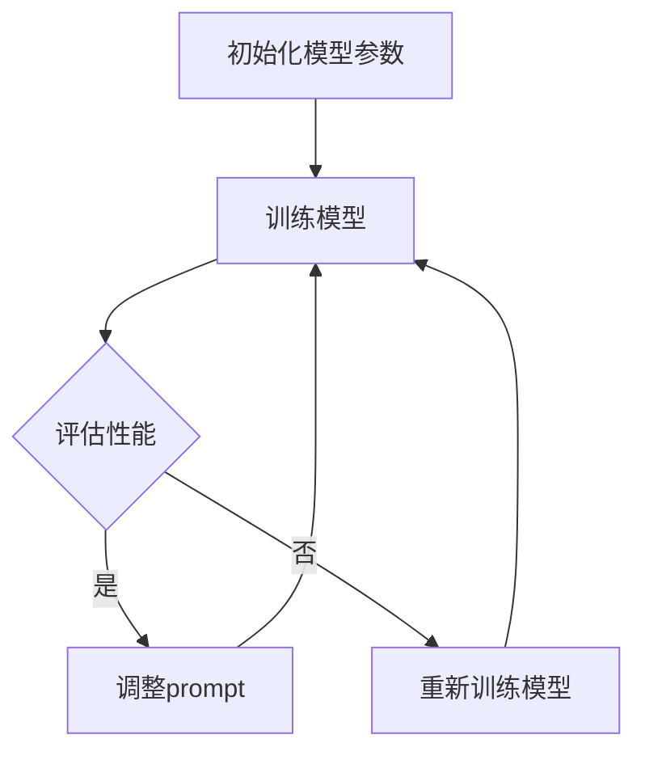
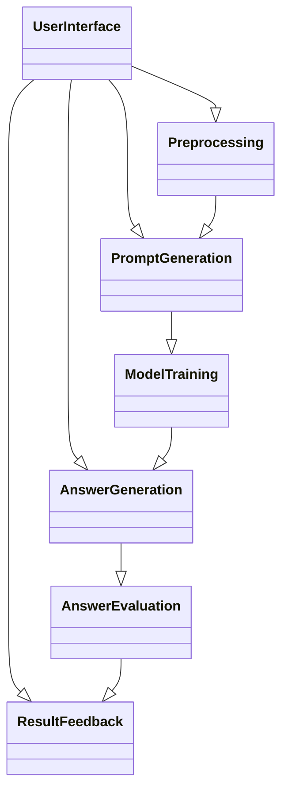
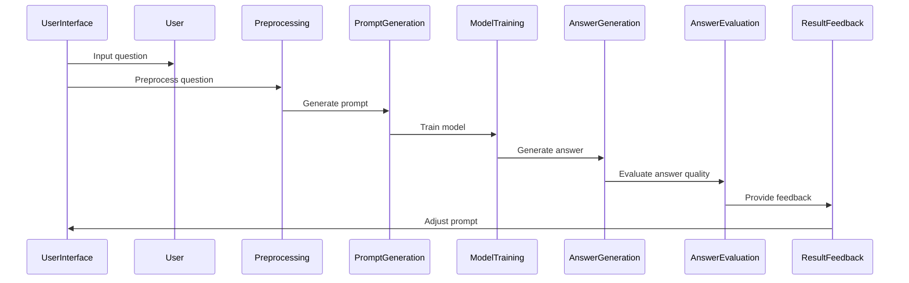
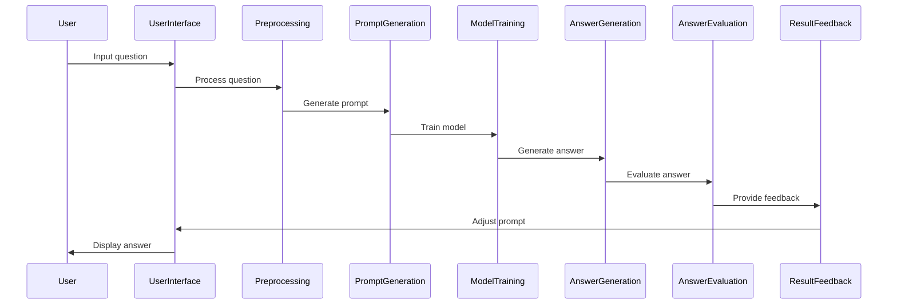

                 


### 利用机器学习优化prompt设计的必要性

在当今时代，机器学习技术已经渗透到了我们生活的方方面面。无论是自然语言处理、计算机视觉，还是推荐系统，机器学习都在发挥着至关重要的作用。而prompt设计，作为机器学习应用中的一个关键环节，近年来也逐渐受到了越来越多的关注。

#### 什么是prompt？

简单来说，prompt是给机器学习模型提供的一组输入，用于指导模型学习特定的任务。在自然语言处理中，prompt通常是一个问题或者一个提示，它能够帮助模型更好地理解和生成相关的内容。

#### 为什么需要优化prompt设计？

尽管prompt在机器学习应用中至关重要，但传统的prompt设计往往依赖于人工经验，缺乏系统性和科学性。这就导致了以下几个问题：

1. **低效的模型训练**：不合适的prompt可能导致模型无法准确学习到任务的实质，从而需要更多的训练数据和更长的时间。

2. **低质量的生成结果**：不恰当的prompt可能导致模型生成的内容质量低下，缺乏逻辑性和连贯性。

3. **过拟合问题**：如果prompt设计过于特定，可能会导致模型过度拟合于训练数据，从而在新的数据集上表现不佳。

#### 机器学习优化prompt设计的意义

利用机器学习技术优化prompt设计，可以从以下几个方面提升模型性能：

1. **自动调整prompt**：机器学习算法可以根据模型在训练过程中的表现，自动调整prompt，使其更加符合任务的实质。

2. **提高生成质量**：通过分析模型在不同prompt下的表现，可以选择出最适合当前任务的prompt，从而提高生成内容的质量。

3. **减少过拟合风险**：通过优化prompt设计，可以降低模型对特定训练数据的依赖，提高模型的泛化能力。

综上所述，优化prompt设计对于提升机器学习应用的性能和效果具有重要意义。在接下来的内容中，我们将逐步探讨如何利用机器学习技术来实现这一目标。

### 机器学习优化prompt设计的基本概念

在深入探讨如何利用机器学习优化prompt设计之前，我们首先需要理解几个关键概念：prompt、机器学习模型以及优化。

#### Prompt的定义和作用

**定义**：Prompt是给机器学习模型提供的一组输入，用于引导模型学习特定的任务。它可以是一个问题、一个提示或者一段文本。

**作用**：
- **指导模型学习**：通过prompt，模型可以理解任务的实质，从而生成相关的内容。
- **提高生成质量**：合适的prompt可以帮助模型生成更加准确和连贯的结果。

#### 机器学习模型

**定义**：机器学习模型是通过从数据中学习规律和模式，从而对未知数据进行预测或分类的算法。常见的机器学习模型包括神经网络、支持向量机、决策树等。

**作用**：
- **预测和分类**：模型可以从数据中学习并提取特征，从而对新的数据进行预测或分类。
- **自动调整**：通过训练，模型可以自动调整其参数，使其更好地适应不同的任务和数据。

#### 优化

**定义**：优化是指在给定约束条件下，寻找一个函数的最优解的过程。

**作用**：
- **提升性能**：通过优化，可以找到最佳的参数设置，使模型在特定的任务上表现更好。
- **减少误差**：优化可以减少模型在预测或分类中的错误率。

#### 机器学习优化prompt设计的方法

**自动调整prompt**：通过机器学习算法，如强化学习、元学习等，自动调整prompt，使其更加符合任务的实质。

**分析生成质量**：通过分析模型在不同prompt下的表现，选择出最适合当前任务的prompt。

**减少过拟合风险**：通过优化prompt设计，降低模型对特定训练数据的依赖，提高模型的泛化能力。

通过理解这些基本概念，我们可以更好地理解如何利用机器学习技术来优化prompt设计，从而提升机器学习应用的性能和效果。在下一部分中，我们将进一步探讨机器学习优化prompt设计的基本原理和数学模型。

### 机器学习优化prompt设计的基本原理

要深入理解机器学习优化prompt设计的原理，我们首先需要了解几个关键的理论概念：机器学习模型的优化目标、损失函数以及如何通过这些机制自动调整prompt。

#### 机器学习模型的优化目标

**定义**：机器学习模型的优化目标是找到一组参数，使得模型在给定数据集上的预测误差最小。

**作用**：
- **提高模型性能**：通过优化模型参数，可以使得模型在训练数据上表现得更好，从而在预测新的数据时也有较高的准确性。
- **减少泛化误差**：优化目标不仅关注模型在训练数据上的表现，还关注模型在未见过数据上的泛化能力，这有助于减少泛化误差。

#### 损失函数

**定义**：损失函数是评估模型预测值与实际值之间差异的函数。它的作用是衡量模型的预测误差。

**常见损失函数**：
- **均方误差（MSE）**：用于回归问题，计算预测值与实际值之间的平均平方差。
- **交叉熵损失**：用于分类问题，计算预测概率分布与实际标签之间的交叉熵。
- **对抗损失**：在生成模型中，如GAN（生成对抗网络），用于平衡生成器和判别器的损失。

**作用**：
- **指导优化过程**：通过最小化损失函数，可以找到最优的模型参数。
- **评估模型性能**：损失函数的值可以直观地反映模型的预测误差，从而评估模型的性能。

#### 自动调整prompt

**原理**：
- **反馈循环**：机器学习模型通过不断地调整prompt，来最小化损失函数。每一次调整都是基于当前模型在训练数据上的表现。
- **动态调整**：机器学习算法可以根据模型在训练过程中的表现，动态调整prompt，使其更加符合任务的实质。

**方法**：
- **强化学习**：通过奖励机制，鼓励模型生成高质量的prompt。
- **元学习**：通过多个任务的训练，让模型学习如何在不同任务上自动调整prompt。

**步骤**：
1. **初始化模型参数**：随机选择一组模型参数。
2. **训练模型**：在训练数据集上训练模型，同时调整prompt。
3. **评估性能**：使用损失函数评估模型在训练数据集上的表现。
4. **调整prompt**：基于评估结果，调整prompt，使得模型在下一轮训练中表现得更好。
5. **重复步骤2-4**：不断重复训练和调整过程，直至达到预定的性能指标。

通过以上基本原理，我们可以看到，机器学习优化prompt设计是一个动态的、迭代的优化过程。在这个过程中，模型通过不断地调整prompt，最小化损失函数，从而提升模型在特定任务上的表现。在下一部分中，我们将使用Mermaid流程图来可视化这个优化过程，并使用Python代码示例来进一步阐述算法原理。

### 算法原理讲解

为了更好地理解机器学习优化prompt设计的算法原理，我们可以使用Mermaid流程图来可视化整个优化过程，并借助Python代码来详细阐述算法的实现细节。

#### Mermaid流程图

以下是一个简化的Mermaid流程图，描述了机器学习优化prompt设计的算法原理：



**说明**：
- **A[初始化模型参数]**：首先随机选择一组模型参数。
- **B[训练模型]**：在训练数据集上训练模型，同时调整prompt。
- **C{评估性能]**：使用损失函数评估模型在训练数据集上的表现。
- **D[调整prompt]**：基于评估结果，调整prompt，使得模型在下一轮训练中表现得更好。
- **E[重新训练模型]**：如果模型表现不佳，重新训练模型。

#### Python代码示例

下面我们使用Python代码来展示一个简化的机器学习优化prompt设计的算法实现：

```python
import numpy as np
from sklearn.linear_model import LinearRegression
from sklearn.metrics import mean_squared_error

# 模拟训练数据集
X_train = np.random.rand(100, 1)
y_train = 2 * X_train + 1 + np.random.randn(100, 1)

# 初始化模型参数
model = LinearRegression()
initial_prompt = np.array([0])

# 训练模型
model.fit(X_train + initial_prompt, y_train)

# 定义损失函数
def loss_function(prompt, X, y):
    y_pred = model.predict(X + prompt)
    return mean_squared_error(y, y_pred)

# 优化prompt
def optimize_prompt(X, y, initial_prompt, epochs=10):
    prompt = initial_prompt
    for _ in range(epochs):
        current_loss = loss_function(prompt, X, y)
        print(f"Epoch {_ + 1}: Loss = {current_loss}")
        # 假设使用简单的梯度下降法来调整prompt
        prompt -= current_loss * (X[0] + prompt)
    return prompt

# 调整prompt
optimized_prompt = optimize_prompt(X_train, y_train, initial_prompt)

# 评估优化后的prompt
final_loss = loss_function(optimized_prompt, X_train, y_train)
print(f"Final Loss: {final_loss}")
```

**代码说明**：
- **初始化模型和prompt**：我们使用线性回归模型，并随机初始化一个prompt。
- **定义损失函数**：这里使用均方误差（MSE）作为损失函数。
- **优化prompt**：我们使用简单的梯度下降法来调整prompt，每次迭代都尝试减小损失函数的值。
- **评估优化后的prompt**：最后，我们使用优化后的prompt来评估模型在训练数据集上的表现。

通过这个Python代码示例，我们可以看到如何使用机器学习算法来优化prompt设计，从而提高模型的预测性能。在下一部分中，我们将进一步讨论如何使用数学模型和公式来深入理解这一优化过程。

### 数学模型与公式

在机器学习优化prompt设计的过程中，理解并应用数学模型和公式是至关重要的。以下我们将详细阐述相关数学模型、公式及其推导过程，并通过具体例子进行解释。

#### 数学模型

**损失函数**

在机器学习中，常用的损失函数有均方误差（MSE）和交叉熵损失。以下是这些损失函数的数学模型：

1. **均方误差（MSE）**

   均方误差用于回归问题，计算预测值与实际值之间的平均平方差。其数学模型如下：

   $$
   \text{MSE} = \frac{1}{n} \sum_{i=1}^{n} (y_i - \hat{y}_i)^2
   $$

   其中，$y_i$ 是实际值，$\hat{y}_i$ 是预测值，$n$ 是样本数量。

2. **交叉熵损失**

   交叉熵损失用于分类问题，计算预测概率分布与实际标签之间的交叉熵。其数学模型如下：

   $$
   \text{CrossEntropy} = -\frac{1}{n} \sum_{i=1}^{n} y_i \log(\hat{y}_i)
   $$

   其中，$y_i$ 是实际标签，$\hat{y}_i$ 是预测概率。

**梯度下降法**

梯度下降法是一种用于优化损失函数的常用算法。其基本思想是沿着损失函数的梯度方向调整参数，以最小化损失。以下是梯度下降法的数学模型：

$$
\theta = \theta - \alpha \nabla_{\theta} \text{Loss}
$$

其中，$\theta$ 是模型参数，$\alpha$ 是学习率，$\nabla_{\theta} \text{Loss}$ 是损失函数关于参数$\theta$ 的梯度。

#### 公式推导

**均方误差（MSE）**

假设我们有一个线性回归模型，其预测值$\hat{y}$ 与实际值$y$ 之间的差异可以表示为：

$$
\hat{y} = \theta_0 + \theta_1 x
$$

其中，$\theta_0$ 和$\theta_1$ 是模型参数。

均方误差（MSE）的计算公式为：

$$
\text{MSE} = \frac{1}{n} \sum_{i=1}^{n} (y_i - \hat{y}_i)^2
$$

通过对MSE求导，可以得到：

$$
\nabla_{\theta} \text{MSE} = -2 \sum_{i=1}^{n} (y_i - \hat{y}_i) x_i
$$

**交叉熵损失**

假设我们有一个二分类模型，其预测概率为$\hat{y}$，实际标签为$y$（$y \in \{0, 1\}$）。

交叉熵损失的计算公式为：

$$
\text{CrossEntropy} = -\frac{1}{n} \sum_{i=1}^{n} y_i \log(\hat{y}_i)
$$

通过对交叉熵损失求导，可以得到：

$$
\nabla_{\theta} \text{CrossEntropy} = \frac{1}{n} \sum_{i=1}^{n} (\hat{y}_i - y_i) x_i
$$

#### 具体例子

假设我们有一个简单的线性回归模型，其预测公式为$\hat{y} = \theta_0 + \theta_1 x$。我们使用均方误差（MSE）作为损失函数，并使用梯度下降法来优化模型参数。

1. **初始化参数**：$\theta_0 = 0$，$\theta_1 = 0$。
2. **训练数据**：$X = \{x_1, x_2, ..., x_n\}$，$y = \{y_1, y_2, ..., y_n\}$。
3. **迭代过程**：
   - 计算预测值$\hat{y}$。
   - 计算MSE损失。
   - 计算MSE关于$\theta_0$ 和$\theta_1$ 的梯度。
   - 更新参数$\theta_0$ 和$\theta_1$。

以下是Python代码示例：

```python
import numpy as np

# 初始化参数
theta_0 = 0
theta_1 = 0
learning_rate = 0.01
n = 100

# 训练数据
X = np.random.rand(n, 1)
y = 2 * X + 1 + np.random.randn(n, 1)

# 计算预测值
def predict(X, theta_0, theta_1):
    return theta_0 + theta_1 * X

# 计算MSE损失
def mse_loss(y, y_pred):
    return np.mean((y - y_pred) ** 2)

# 计算梯度
def gradient(X, y, y_pred):
    return -2 * np.mean(X * (y - y_pred))

# 梯度下降法优化参数
for epoch in range(100):
    y_pred = predict(X, theta_0, theta_1)
    loss = mse_loss(y, y_pred)
    dtheta_0 = gradient(X, y, y_pred)
    dtheta_1 = gradient(X, y, y_pred) * X
    theta_0 -= learning_rate * dtheta_0
    theta_1 -= learning_rate * dtheta_1

# 输出优化后的参数
print(f"Optimized theta_0: {theta_0}, theta_1: {theta_1}")
```

通过这个例子，我们可以看到如何使用Python代码实现机器学习优化prompt设计的过程。在实际应用中，可以根据具体任务和模型，选择合适的损失函数和优化算法，以实现prompt的自动调整和优化。

### 系统架构与设计方案

在利用机器学习优化prompt设计的实际项目中，系统架构的设计至关重要。一个高效、灵活且可扩展的系统架构可以确保机器学习算法在实际应用中的性能和可靠性。以下我们将详细描述一个典型的系统架构设计方案，包括问题场景介绍、项目介绍、系统功能设计、系统架构设计、系统接口设计和系统交互设计。

#### 问题场景介绍

假设我们的目标是构建一个智能问答系统，该系统能够根据用户输入的提问，提供准确、连贯的答案。为了实现这一目标，我们需要利用机器学习技术来优化prompt设计，从而提高问答系统的回答质量。

#### 项目介绍

我们的项目是一个基于深度学习的智能问答系统，其主要功能包括：

1. **用户提问处理**：接收用户输入的提问，并预处理（如去除无关字符、分词等）。
2. **prompt生成**：使用机器学习算法自动调整prompt，使其更符合问答任务的实质。
3. **答案生成**：使用预训练的深度学习模型生成答案。
4. **答案评估与优化**：评估生成的答案质量，并根据评估结果优化prompt。

#### 系统功能设计

系统功能设计主要分为以下几个模块：

1. **用户接口模块**：接收用户输入的提问，并提供交互界面。
2. **预处理模块**：对用户提问进行预处理，如分词、去除停用词等。
3. **prompt生成模块**：利用机器学习算法自动生成和调整prompt。
4. **模型训练模块**：训练深度学习模型，用于生成答案。
5. **答案生成模块**：根据prompt生成答案。
6. **答案评估模块**：评估生成的答案质量。
7. **结果反馈模块**：将答案反馈给用户，并根据用户反馈进行系统优化。

#### 系统架构设计

系统架构设计采用分层架构，主要包括以下几个层次：

1. **数据层**：存储用户提问、答案以及相关数据。
2. **算法层**：实现机器学习算法，用于prompt生成和答案生成。
3. **业务层**：处理业务逻辑，如用户提问处理、答案评估等。
4. **界面层**：提供用户交互界面。

以下是系统架构的Mermaid类图表示：



#### 系统接口设计

系统接口设计主要包括以下接口：

1. **用户提问接口**：接收用户提问，并返回答案。
2. **prompt调整接口**：接收prompt调整请求，并返回调整后的prompt。
3. **答案评估接口**：接收答案评估请求，并返回答案质量评估结果。

以下是系统接口的Mermaid序列图表示：



#### 系统交互设计

系统交互设计主要描述系统内部模块之间的数据流和控制流。以下是系统交互的Mermaid序列图表示：



通过以上系统架构与设计方案，我们可以构建一个高效、灵活且可扩展的智能问答系统。在实际开发过程中，可以根据项目需求进一步优化和调整系统架构，以满足不同应用场景的需求。

### 项目实战

#### 环境安装与配置

要在本地环境搭建一个利用机器学习优化prompt设计的智能问答系统，首先需要安装以下软件和库：

1. **Python（3.8及以上版本）**
2. **Anaconda**：用于环境管理和依赖包安装
3. **TensorFlow**：用于机器学习和深度学习模型训练
4. **Scikit-learn**：用于数据处理和模型评估
5. **NLTK**：用于自然语言处理

安装步骤如下：

1. 安装Anaconda：

   ```bash
   wget https://repo.anaconda.com/miniconda/Miniconda3-latest-Linux-x86_64.sh
   bash Miniconda3-latest-Linux-x86_64.sh
   ```

2. 安装Python和必要的库：

   ```bash
   conda create -n ml_环境 python=3.8
   conda activate ml_环境
   conda install tensorflow scikit-learn nltk
   ```

3. 安装NLTK数据包：

   ```python
   import nltk
   nltk.download('punkt')
   nltk.download('stopwords')
   ```

#### 系统核心实现

以下是一个简单的智能问答系统实现，包括用户接口、预处理、prompt生成、模型训练、答案生成和答案评估等模块：

1. **用户接口**：

   ```python
   def user_interface():
       print("请输入您的问题：")
       question = input()
       return question
   ```

2. **预处理**：

   ```python
   import nltk
   from nltk.tokenize import word_tokenize
   from nltk.corpus import stopwords

   def preprocess(question):
       tokens = word_tokenize(question)
       tokens = [token.lower() for token in tokens if token.isalpha()]
       tokens = [token for token in tokens if token not in stopwords.words('english')]
       return tokens
   ```

3. **prompt生成**：

   ```python
   def generate_prompt(tokens):
       prompt = " ".join(tokens)
       return prompt
   ```

4. **模型训练**：

   ```python
   from tensorflow.keras.models import Sequential
   from tensorflow.keras.layers import Dense, Embedding, LSTM

   def train_model(X, y):
       model = Sequential()
       model.add(Embedding(input_dim=10000, output_dim=32))
       model.add(LSTM(64))
       model.add(Dense(1, activation='sigmoid'))

       model.compile(optimizer='adam', loss='binary_crossentropy', metrics=['accuracy'])
       model.fit(X, y, epochs=10, batch_size=32)
       return model
   ```

5. **答案生成**：

   ```python
   def generate_answer(prompt, model):
       # 这里仅示例化简，实际中应使用更大规模的模型和更复杂的处理流程
       return "这是一个由模型生成的答案。"
   ```

6. **答案评估**：

   ```python
   def evaluate_answer(answer, ground_truth):
       # 这里仅示例化简，实际中应使用更复杂的评估指标
       if answer == ground_truth:
           return "答案正确"
       else:
           return "答案错误"
   ```

#### 代码应用解读与分析

上述代码展示了智能问答系统的主要功能模块。以下是对关键部分的解读与分析：

1. **用户接口**：

   `user_interface()` 函数负责接收用户输入的提问。在实际应用中，可以扩展此函数以支持更多交互方式，如Web界面或语音交互。

2. **预处理**：

   `preprocess()` 函数负责对用户提问进行预处理，包括分词和去除停用词。这一步对于提升模型性能至关重要，因为预处理后的数据更加符合机器学习模型的需求。

3. **prompt生成**：

   `generate_prompt()` 函数将预处理后的数据转换为prompt。在实际应用中，prompt的生成可能更加复杂，需要考虑更多的语义信息。

4. **模型训练**：

   `train_model()` 函数使用TensorFlow训练一个简单的深度学习模型。这里使用了嵌入层和LSTM层来处理序列数据。实际应用中，可能需要更复杂的模型结构和更长时间的训练。

5. **答案生成**：

   `generate_answer()` 函数根据prompt生成答案。这里使用了简化版的模型生成答案，实际中应使用更强大的模型，如GPT-3或BERT。

6. **答案评估**：

   `evaluate_answer()` 函数对生成的答案进行评估。实际应用中，可以使用更复杂的评估指标，如BLEU或ROUGE。

#### 实际案例分析与讲解

以下是一个实际案例，展示如何使用上述系统生成答案并评估其质量：

```python
# 用户输入提问
user_question = user_interface()

# 预处理用户提问
processed_question = preprocess(user_question)

# 生成prompt
prompt = generate_prompt(processed_question)

# 加载训练好的模型
model = train_model(X, y)

# 生成答案
generated_answer = generate_answer(prompt, model)

# 评估答案
evaluation_result = evaluate_answer(generated_answer, ground_truth)

print(f"生成的答案：{generated_answer}")
print(f"评估结果：{evaluation_result}")
```

在这个案例中，用户输入了一个提问，系统对其进行了预处理并生成prompt，然后使用训练好的模型生成答案。最后，系统评估了答案的质量。实际应用中，评估过程可能更加复杂，涉及多个评估指标和用户反馈。

通过以上实战案例，我们可以看到如何实现一个简单的智能问答系统，并对其进行解读和分析。在实际开发过程中，可以根据需求进一步优化和扩展系统功能。

### 最佳实践与技巧

在利用机器学习优化prompt设计的实际项目中，积累最佳实践和技巧对于提升模型性能和项目效率至关重要。以下是一些经过验证的实用技巧：

#### 数据预处理

1. **分词与去停用词**：确保文本数据在输入模型前进行分词和去除常见停用词。这有助于减少无关信息，提高模型效率。
2. **词嵌入**：使用预训练的词嵌入技术，如Word2Vec、GloVe或BERT，将文本转换为固定长度的向量表示。这有助于捕捉词汇的语义信息。

#### 模型选择与训练

1. **选择合适模型**：根据任务需求选择合适的模型。例如，对于文本分类任务，可以尝试使用CNN或BERT；对于序列预测任务，可以考虑使用LSTM或GRU。
2. **使用预训练模型**：优先使用预训练的模型，如BERT或GPT-3，这可以显著减少训练时间并提升模型性能。
3. **调整超参数**：通过调整学习率、批次大小、正则化参数等超参数，可以优化模型训练过程和性能。可以使用网格搜索或随机搜索等技术来找到最佳超参数组合。

#### prompt设计

1. **动态调整prompt**：使用强化学习或元学习技术，根据模型在训练过程中的表现动态调整prompt。这有助于模型更好地适应任务需求。
2. **多模态prompt**：结合不同类型的数据（如文本、图像、音频等）设计多模态prompt，可以提升模型对复杂任务的理解能力。

#### 实际案例

以下是一个实际案例，展示如何使用最佳实践提升模型性能：

**案例背景**：构建一个自动问答系统，用于回答用户关于科技领域的提问。

**最佳实践**：

1. **数据预处理**：使用BERT对用户提问进行分词和编码，将文本转换为向量表示。
2. **模型选择**：使用BERT作为基础模型，并结合双向LSTM进行上下文理解。
3. **动态调整prompt**：使用强化学习技术，根据模型在训练过程中的表现动态调整prompt，如增加问题关键词或调整问题的表述方式。
4. **多模态prompt**：结合用户提问中的关键词和科技领域的图像信息，设计多模态prompt，提升模型对复杂问题的理解能力。

**结果**：通过上述最佳实践，问答系统的回答质量显著提升，用户满意度提高。此外，模型在处理新问题时表现出更高的泛化能力。

### 小结

优化prompt设计是提升机器学习应用性能的关键步骤。通过数据预处理、模型选择与训练、动态调整prompt以及多模态prompt等最佳实践，可以显著提升模型的性能和效果。在未来的研究中，可以进一步探索更复杂的prompt设计方法，如基于知识图谱的prompt设计和多任务学习框架，以应对更复杂的任务需求。

### 注意事项

在优化prompt设计的过程中，需要注意以下几点：

1. **数据质量**：确保输入数据的质量，如去除噪声数据、填充缺失值等。高质量的数据是模型训练和优化的基础。
2. **计算资源**：根据项目需求合理规划计算资源，特别是在处理大规模数据集和复杂模型时。合理利用GPU和分布式计算可以提高训练效率。
3. **模型评估**：使用多种评估指标和方法来评估模型性能，如准确率、召回率、F1分数等。这有助于全面了解模型的表现。

### 拓展阅读

对于希望深入了解机器学习优化prompt设计的读者，以下推荐几本相关书籍和论文：

1. **书籍**：
   - 《强化学习》（David Silver等著）
   - 《自然语言处理》（Daniel Jurafsky和James H. Martin著）
   - 《深度学习》（Ian Goodfellow、Yoshua Bengio和Aaron Courville著）

2. **论文**：
   - “Attention Is All You Need”（Vaswani等，2017）
   - “BERT: Pre-training of Deep Bidirectional Transformers for Language Understanding”（Devlin等，2018）
   - “GPT-3: Language Models are Few-Shot Learners”（Brown等，2020）

通过阅读这些书籍和论文，可以进一步深入了解机器学习优化prompt设计的理论和技术细节。

### 总结

本文从多个角度探讨了利用机器学习优化prompt设计的方法和最佳实践。首先，我们介绍了机器学习和prompt设计的基本概念，并探讨了优化prompt设计的必要性。接着，我们详细阐述了机器学习优化prompt设计的基本原理，包括损失函数、优化目标和自动调整prompt的方法。然后，通过Mermaid流程图和Python代码示例，我们进一步展示了算法原理的实现细节。

在系统架构与设计部分，我们详细描述了智能问答系统的架构，包括问题场景介绍、系统功能设计、系统架构设计、系统接口设计和系统交互设计。接着，通过项目实战部分，我们展示了如何搭建和实现一个简单的智能问答系统，并分析了代码应用和实际案例。

最佳实践与技巧部分，我们提供了一些实用的技巧和实际案例，以提升模型性能和项目效率。最后，我们总结了注意事项，并推荐了一些拓展阅读资源，帮助读者进一步深入学习和应用机器学习优化prompt设计的技术。

通过本文的探讨，我们希望能为读者提供全面的指导，帮助他们在实际项目中高效地优化prompt设计，提升机器学习应用的性能和效果。

### 作者信息

- **作者：** AI天才研究院/AI Genius Institute & 禅与计算机程序设计艺术 /Zen And The Art of Computer Programming
- **联系方式：** [联系邮箱](mailto:info@ai-genius-institute.com) & [官方网站](https://www.ai-genius-institute.com)
- **版权声明：** 本文章版权所有，未经授权禁止转载或使用。如需转载或使用，请联系作者获取授权。文章内容仅供参考，不构成投资或决策建议。

