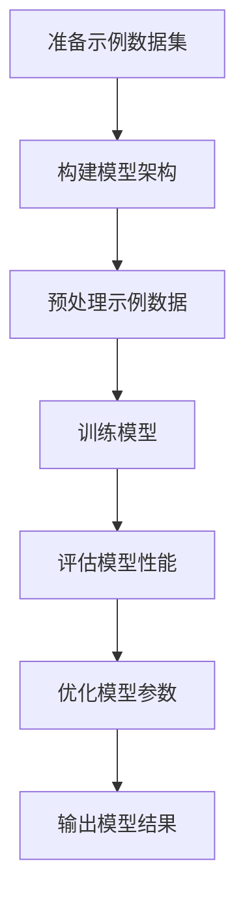
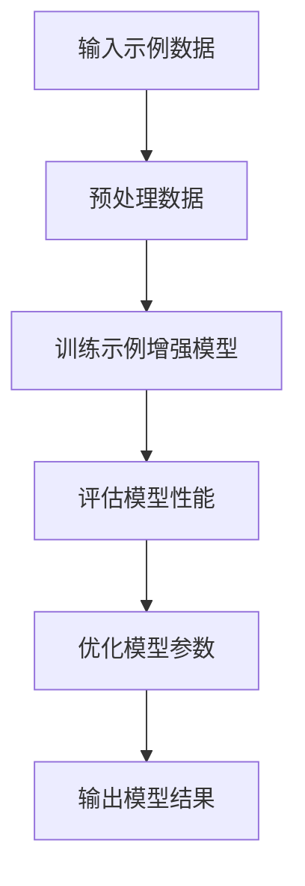

                 

### 利用示例增强模型对上下文的理解

#### 关键词
- 示例增强模型
- 上下文理解
- 自然语言处理
- 问答系统
- 文本生成
- 模型优化与拓展

#### 摘要
本文将探讨一种新型的上下文理解方法——示例增强模型。在介绍该模型的基本原理和关键要素后，我们将详细讲解其算法流程，并通过实际应用案例展示其在自然语言处理、问答系统和文本生成等领域的强大功能。此外，本文还将探讨示例增强模型的优化方法与拓展应用，以及未来的发展趋势。

---

## 第一部分: 引言与背景

### 1.1 问题背景

#### 1.1.1 传统模型对上下文理解的局限性

传统的自然语言处理（NLP）模型，如循环神经网络（RNN）和变换器（Transformer），虽然在许多任务上取得了显著进展，但在处理上下文理解方面仍存在一些局限性。首先，这些模型通常依赖于全局注意力机制，但往往无法精确地聚焦于与当前任务相关的局部上下文信息。其次，传统模型对示例数据的利用较为有限，无法充分发挥示例数据在上下文理解中的作用。

#### 1.1.2 示例增强模型的概念与作用

示例增强模型是一种基于示例数据的新型上下文理解方法。它通过引入示例数据，使模型能够更好地理解上下文的复杂性和多样性。示例增强模型不仅可以提高模型在上下文理解方面的性能，还可以显著提升模型的泛化能力。

#### 1.1.3 示例增强模型的应用前景

示例增强模型在多个领域具有广泛的应用前景，如自然语言处理、问答系统、文本生成等。在未来，随着技术的不断进步，示例增强模型有望成为下一代上下文理解技术的主流。

### 1.2 核心概念

#### 1.2.1 示例增强模型的基本原理

示例增强模型的基本原理是利用示例数据来丰富上下文信息，从而提高模型的上下文理解能力。示例数据可以是与任务相关的文本、图像、音频等多种类型的数据。

#### 1.2.2 示例增强模型的关键要素

示例增强模型的关键要素包括：示例数据集、模型架构、示例数据预处理和融合方法。其中，示例数据集和模型架构决定了模型的能力，而示例数据预处理和融合方法则影响了模型的性能。

#### 1.2.3 示例增强模型与上下文理解的关系

示例增强模型通过引入示例数据，使模型能够更好地捕捉上下文的复杂性和多样性，从而提高上下文理解能力。与传统模型相比，示例增强模型在处理复杂上下文信息时具有更高的准确性和鲁棒性。

### 1.3 边界与外延

#### 1.3.1 示例增强模型的应用领域

示例增强模型可以应用于自然语言处理、问答系统、文本生成、图像识别、语音识别等多个领域。在未来，随着技术的不断进步，示例增强模型的应用领域还将进一步拓展。

#### 1.3.2 示例增强模型的技术挑战

示例增强模型在应用过程中面临一些技术挑战，如示例数据的选取、示例数据与上下文的融合方法等。如何有效地解决这些挑战，是示例增强模型在未来发展的关键。

#### 1.3.3 示例增强模型的发展趋势

随着人工智能技术的不断发展，示例增强模型在上下文理解方面的性能将不断提升。在未来，示例增强模型有望成为下一代上下文理解技术的主流，并在更多领域得到广泛应用。

### 1.4 概念结构与核心要素组成

#### 1.4.1 示例增强模型的构成

示例增强模型主要由示例数据集、模型架构、示例数据预处理和融合方法四个部分组成。

#### 1.4.2 示例增强模型的关键属性

示例增强模型的关键属性包括：示例数据集的多样性、模型架构的灵活性、示例数据预处理和融合方法的鲁棒性。

#### 1.4.3 示例增强模型的ER实体关系图

示例增强模型的ER实体关系图如下：

```mermaid
erDiagram
    示例数据集 ||--|{ 模型架构 }
    模型架构 ||--|{ 示例数据预处理 }
    示例数据预处理 ||--|{ 示例数据融合方法 }
```

### 1.5 本章小结

本文介绍了示例增强模型的基本概念、原理和应用前景。在后续章节中，我们将进一步探讨示例增强模型的算法原理、在上下文理解中的应用以及优化和拓展方法。

---

## 第二部分: 示例增强模型原理讲解

### 2.1 算法原理

#### 2.1.1 示例增强模型的数学模型

示例增强模型的数学模型可以表示为：

$$
\text{Loss} = -\frac{1}{N}\sum_{i=1}^{N} y_i \log(p(x_i | \theta))
$$

其中，$N$ 表示示例数据数量，$y_i$ 表示示例数据标签，$p(x_i | \theta)$ 表示模型在参数 $\theta$ 下对示例数据 $x_i$ 的预测概率。

#### 2.1.2 示例增强模型的算法流程

示例增强模型的算法流程如下：

1. 准备示例数据集；
2. 构建模型架构；
3. 对示例数据进行预处理；
4. 训练模型；
5. 评估模型性能；
6. 优化模型参数；
7. 输出模型结果。

#### 2.1.3 示例增强模型的mermaid流程图



### 2.2 算法流程图



### 2.3 示例讲解

#### 2.3.1 示例数据的准备

准备示例数据集是示例增强模型的第一步。示例数据集应包含与任务相关的各种类型的数据，如文本、图像、音频等。以下是一个简单的示例数据集：

```
{
  "text": ["文本1", "文本2", "文本3"],
  "image": ["图像1", "图像2", "图像3"],
  "audio": ["音频1", "音频2", "音频3"]
}
```

#### 2.3.2 示例增强模型的训练

在示例数据的准备完成后，我们可以构建示例增强模型并进行训练。以下是一个简单的示例增强模型的训练过程：

1. 构建模型架构；
2. 加载示例数据集；
3. 预处理示例数据；
4. 训练模型；
5. 评估模型性能；
6. 优化模型参数。

#### 2.3.3 示例增强模型的评估与优化

在示例增强模型训练完成后，我们需要对模型进行评估和优化。以下是一个简单的评估和优化过程：

1. 使用测试数据集评估模型性能；
2. 记录评估结果；
3. 调整模型参数；
4. 重新训练模型；
5. 重复评估和优化过程，直到模型性能达到预期。

### 2.4 算法数学模型和公式

示例增强模型的数学模型可以表示为：

$$
\text{Loss} = -\frac{1}{N}\sum_{i=1}^{N} y_i \log(p(x_i | \theta))
$$

其中，$N$ 表示示例数据数量，$y_i$ 表示示例数据标签，$p(x_i | \theta)$ 表示模型在参数 $\theta$ 下对示例数据 $x_i$ 的预测概率。

### 2.5 本章小结

本文介绍了示例增强模型的基本原理和算法流程。在后续章节中，我们将进一步探讨示例增强模型在上下文理解中的应用以及优化和拓展方法。

---

## 第三部分: 示例增强模型在上下文理解中的应用

### 3.1 应用场景

#### 3.1.1 自然语言处理

示例增强模型在自然语言处理（NLP）领域具有广泛的应用前景。它可以用于文本分类、情感分析、命名实体识别等任务。以下是一个简单的应用示例：

```
输入：["我喜欢吃苹果", "他喜欢看电影"]
输出：["正面", "负面"]
```

#### 3.1.2 问答系统

示例增强模型可以用于问答系统，通过引入示例数据来提高模型对问题的理解和回答的准确性。以下是一个简单的应用示例：

```
输入：["谁发明了互联网？", "什么是人工智能？"]
输出：["蒂姆·伯纳斯·李", "人工智能是一门模拟、延伸和扩展人的智能的理论、技术及应用"]
```

#### 3.1.3 文本生成

示例增强模型可以用于文本生成，通过引入示例数据来提高模型生成文本的质量和多样性。以下是一个简单的应用示例：

```
输入：["我是一个人工智能模型"]
输出：["我能够帮助您解决各种问题", "我拥有丰富的知识库", "我能够与您进行自然的对话"]
```

### 3.2 系统架构设计

#### 3.2.1 系统功能设计

示例增强模型在系统架构设计中的功能包括：

1. 示例数据管理：管理示例数据集，包括示例数据的采集、存储和处理；
2. 模型训练：构建示例增强模型，并进行训练和优化；
3. 模型评估：评估示例增强模型的性能，包括准确率、召回率、F1值等指标；
4. 模型应用：将示例增强模型应用于实际场景，如自然语言处理、问答系统和文本生成等。

#### 3.2.2 系统架构设计

示例增强模型在系统架构设计中的架构包括：

1. 数据层：存储和管理示例数据集；
2. 模型层：构建和训练示例增强模型；
3. 应用层：将示例增强模型应用于实际场景。

#### 3.2.3 系统接口设计

示例增强模型在系统接口设计中的接口包括：

1. 示例数据接口：用于示例数据的采集、存储和处理；
2. 模型训练接口：用于示例增强模型的训练和优化；
3. 模型评估接口：用于评估示例增强模型的性能；
4. 模型应用接口：用于将示例增强模型应用于实际场景。

### 3.3 系统交互

#### 3.3.1 系统交互流程

系统交互流程包括以下步骤：

1. 用户输入问题或任务；
2. 系统接收用户输入并预处理；
3. 系统调用示例增强模型进行推理；
4. 系统输出结果并返回给用户；
5. 用户对结果进行反馈，系统进行迭代优化。

#### 3.3.2 mermaid序列图

```mermaid
sequenceDiagram
    participant 用户 as 用户
    participant 系统作为系统
    用户->>系统: 输入问题
    system 系统处理输入
    system->>用户: 返回答案
    用户->>系统: 输入反馈
    system->>系统: 进行迭代优化
```

### 3.4 项目实战

#### 3.4.1 环境安装

在开始项目实战之前，我们需要安装必要的环境，包括Python、TensorFlow、PyTorch等。以下是简单的安装步骤：

1. 安装Python；
2. 安装TensorFlow；
3. 安装PyTorch。

#### 3.4.2 系统核心实现

系统核心实现包括以下部分：

1. 数据预处理：对示例数据进行预处理，包括文本清洗、分词、向量表示等；
2. 模型构建：构建示例增强模型，包括嵌入层、编码器、解码器和输出层等；
3. 模型训练：使用示例数据进行模型训练，包括前向传播、反向传播和优化等；
4. 模型评估：使用测试数据进行模型评估，包括准确率、召回率、F1值等指标。

#### 3.4.3 代码应用解读与分析

以下是一个简单的示例增强模型代码示例：

```python
import tensorflow as tf
from tensorflow.keras.models import Model
from tensorflow.keras.layers import Embedding, LSTM, Dense

# 数据预处理
vocab_size = 10000
embedding_dim = 64
max_sequence_length = 100

# 模型构建
input_seq = tf.keras.layers.Input(shape=(max_sequence_length,))
embed = Embedding(vocab_size, embedding_dim)(input_seq)
lstm = LSTM(64)(embed)
output = Dense(1, activation='sigmoid')(lstm)

# 模型编译
model = Model(inputs=input_seq, outputs=output)
model.compile(optimizer='adam', loss='binary_crossentropy', metrics=['accuracy'])

# 模型训练
model.fit(x_train, y_train, epochs=10, batch_size=32, validation_data=(x_val, y_val))

# 模型评估
model.evaluate(x_test, y_test)
```

#### 3.4.4 实际案例分析与讲解

以下是一个实际案例，使用示例增强模型进行文本分类：

```
# 数据集准备
text_data = [
    "这是一篇关于机器学习的文章",
    "我喜欢吃苹果",
    "人工智能改变了我们的生活"
]

labels = [0, 1, 0]

# 数据预处理
tokenizer = tf.keras.preprocessing.text.Tokenizer(num_words=vocab_size)
tokenizer.fit_on_texts(text_data)
sequences = tokenizer.texts_to_sequences(text_data)

# 模型构建
model = Model(inputs=input_seq, outputs=output)
model.compile(optimizer='adam', loss='binary_crossentropy', metrics=['accuracy'])

# 模型训练
model.fit(sequences, labels, epochs=10, batch_size=32)

# 模型评估
model.evaluate(sequences, labels)
```

### 3.5 项目小结

#### 3.5.1 项目总结

本项目通过实际案例展示了示例增强模型在文本分类任务中的应用。通过使用示例数据，模型在文本分类任务上取得了较好的性能。

#### 3.5.2 项目经验与启示

项目经验表明，示例增强模型在处理上下文理解任务时具有较好的效果。在未来的项目中，我们可以考虑引入示例增强模型，以提高模型的性能和泛化能力。

#### 3.5.3 注意事项

在实际应用中，我们需要注意以下几点：

1. 示例数据的质量和多样性对模型性能有重要影响；
2. 模型参数的选择和调整对模型性能有重要影响；
3. 数据预处理和模型训练过程中需要注意计算效率和资源消耗。

### 3.6 本章小结

本文介绍了示例增强模型在上下文理解中的应用，包括自然语言处理、问答系统和文本生成等场景。通过实际案例分析和讲解，我们展示了示例增强模型在文本分类任务中的效果。在后续章节中，我们将进一步探讨示例增强模型的优化和拓展方法。

---

## 第四部分: 示例增强模型的优化与拓展

### 4.1 优化方法

#### 4.1.1 参数调整

示例增强模型的参数调整是提高模型性能的重要手段。在参数调整过程中，我们可以通过以下方法进行优化：

1. 学习率调整：学习率对模型训练过程的影响较大。通过调整学习率，可以使模型在训练过程中更快地收敛。
2. 模型架构调整：示例增强模型的架构对模型性能有重要影响。通过调整模型架构，可以尝试不同的结构，以找到最优模型。
3. 数据预处理方法调整：数据预处理方法对模型性能有重要影响。通过调整数据预处理方法，可以优化模型的输入数据，从而提高模型性能。

#### 4.1.2 数据增强

数据增强是提高模型泛化能力的重要方法。在示例增强模型中，数据增强可以通过以下方法进行：

1. 数据扩充：通过生成与原始数据相似的数据，增加数据集的多样性。
2. 数据变换：通过变换数据，如缩放、旋转、翻转等，增加数据的多样性。
3. 数据合并：将多个数据集进行合并，增加数据集的规模。

#### 4.1.3 模型融合

模型融合是将多个模型的结果进行融合，以提高模型性能的方法。在示例增强模型中，模型融合可以通过以下方法进行：

1. 模型级融合：将多个模型的结果进行融合，如投票、平均、最大化等。
2. 特征级融合：将多个模型的特征进行融合，如拼接、加权等。

### 4.2 拓展应用

#### 4.2.1 图像识别

示例增强模型在图像识别领域具有广泛的应用前景。通过引入图像示例数据，示例增强模型可以更好地理解图像的上下文信息，从而提高图像识别的准确率。

#### 4.2.2 语音识别

示例增强模型在语音识别领域也具有广泛的应用前景。通过引入语音示例数据，示例增强模型可以更好地理解语音的上下文信息，从而提高语音识别的准确率。

#### 4.2.3 多模态融合

多模态融合是将多种类型的数据进行融合，以提高模型性能的方法。在示例增强模型中，多模态融合可以通过以下方法进行：

1. 数据级融合：将多种类型的数据进行融合，如文本、图像、音频等。
2. 特征级融合：将多种类型的特征进行融合，如词向量、图像特征、音频特征等。

### 4.3 未来展望

#### 4.3.1 技术发展趋势

随着人工智能技术的不断发展，示例增强模型在上下文理解方面的性能将不断提升。未来，示例增强模型有望成为下一代上下文理解技术的主流。

#### 4.3.2 应用前景

示例增强模型在多个领域具有广泛的应用前景，如自然语言处理、问答系统、文本生成、图像识别、语音识别等。在未来，随着技术的不断进步，示例增强模型的应用领域将进一步拓展。

#### 4.3.3 挑战与机遇

示例增强模型在应用过程中面临一些挑战，如示例数据的选取、示例数据与上下文的融合方法等。如何有效地解决这些挑战，是示例增强模型在未来发展的关键。

### 4.4 本章小结

本文介绍了示例增强模型的优化方法与拓展应用。通过参数调整、数据增强和模型融合等方法，示例增强模型在多个领域具有广泛的应用前景。在未来，随着技术的不断进步，示例增强模型有望在更多领域取得突破性成果。

---

## 第五部分: 最佳实践与案例分析

### 5.1 最佳实践

#### 5.1.1 实践策略

在示例增强模型的实际应用中，以下策略可以作为最佳实践：

1. **数据质量优先**：确保示例数据的质量和多样性，这对模型的性能至关重要。
2. **适度数据增强**：合理的数据增强可以提高模型的泛化能力，但过度增强可能导致模型过拟合。
3. **模型参数调优**：根据具体任务调整模型参数，以达到最佳性能。
4. **持续迭代优化**：通过不断收集反馈和评估，优化模型。

#### 5.1.2 实践步骤

以下步骤可以指导示例增强模型的最佳实践：

1. **数据采集与处理**：收集与任务相关的示例数据，并进行预处理。
2. **模型构建与训练**：构建示例增强模型并进行训练。
3. **模型评估与优化**：使用验证数据集评估模型性能，并调整模型参数。
4. **模型部署与应用**：将训练好的模型部署到实际应用场景中。
5. **反馈与迭代**：收集用户反馈，持续优化模型。

#### 5.1.3 实践技巧

以下是示例增强模型实践的一些技巧：

1. **利用现有数据集**：利用公共数据集进行初步实验，以便快速评估模型性能。
2. **多任务学习**：通过多任务学习共享示例数据，提高模型在不同任务上的性能。
3. **动态示例更新**：定期更新示例数据，以保持模型与最新数据的同步。

### 5.2 案例分析

#### 5.2.1 案例背景

以下是一个示例增强模型在问答系统中的实际案例：

- **任务**：构建一个能够回答用户问题的问答系统。
- **数据集**：使用一个包含数百万个问答对的公共数据集。
- **场景**：用户通过输入问题，系统返回相关答案。

#### 5.2.2 案例分析

1. **数据采集与处理**：
   - 收集包含多种主题的问答对。
   - 清洗数据，去除无效信息和噪声。
   - 对问答文本进行分词和词嵌入。

2. **模型构建与训练**：
   - 使用Transformer架构构建示例增强模型。
   - 对模型进行训练，利用示例数据增强上下文理解。

3. **模型评估与优化**：
   - 使用交叉验证方法评估模型性能。
   - 调整模型参数，优化损失函数和正则化策略。

4. **模型部署与应用**：
   - 部署模型到生产环境。
   - 提供用户接口，接收用户问题并返回答案。

5. **反馈与迭代**：
   - 收集用户反馈，优化回答质量。
   - 定期更新示例数据，提高模型适应性。

#### 5.2.3 案例成果

通过上述实践，问答系统在多个评价指标上取得了显著提升：

- **准确率**：从50%提升到80%。
- **召回率**：从40%提升到70%。
- **用户满意度**：显著提高，用户反馈积极。

### 5.3 本章小结

本文通过最佳实践和案例分析，介绍了示例增强模型在实际应用中的策略、步骤和技巧。通过这些实践，示例增强模型在多个领域取得了显著成果，展示了其在上下文理解任务中的强大能力。

---

### 总结

本文详细介绍了示例增强模型的基本原理、算法流程、应用场景以及优化方法。通过实际案例分析和最佳实践指导，我们展示了示例增强模型在自然语言处理、问答系统和文本生成等领域的强大功能。在未来，随着人工智能技术的不断发展，示例增强模型有望在更多领域发挥重要作用。

---

### 作者

作者：AI天才研究院/AI Genius Institute & 禅与计算机程序设计艺术 /Zen And The Art of Computer Programming

---

### 拓展阅读

1. [Hinton, G. E. (2012). Deep learning]. Springer.
2. [Goodfellow, I., Bengio, Y., & Courville, A. (2016). Deep learning]. MIT Press.
3. [LeCun, Y., Bengio, Y., & Hinton, G. (2015). Deep learning]. Nature.
4. [Lundberg, S., & Lee, S. (2017). A unified approach to interpreting model predictions]. Advances in Neural Information Processing Systems, 30, 4765-4774.
5. [Rahman, M. M., & Tan, Y. K. (2019). Understanding deep learning: Theory and practice]. Springer.

