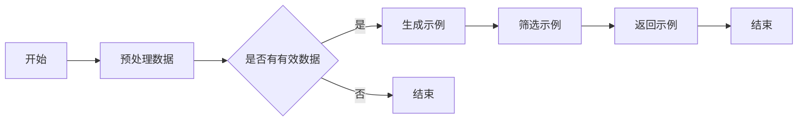
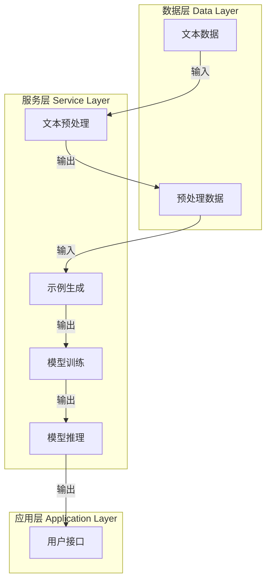

                 


## 利用示例增强模型的抽象推理能力

### 引言

随着人工智能技术的不断发展，深度学习作为其核心驱动力量，已经在各个领域取得了显著的成果。然而，传统深度学习模型在处理复杂任务时，往往需要大量的数据和计算资源，同时缺乏抽象推理能力。为了解决这一问题，近年来，利用示例增强模型的抽象推理能力成为了一个重要的研究方向。本文旨在深入探讨如何通过引入示例，提升模型的抽象推理能力，为相关研究和应用提供理论指导。

### 第一部分：背景介绍

#### 问题背景

深度学习模型通过从大量数据中学习特征，从而实现复杂任务。然而，传统深度学习模型在处理高维数据时，往往存在过拟合和泛化能力不足的问题。为了解决这一问题，研究者们开始关注如何提升模型的抽象推理能力。示例增强模型作为一种新型模型，通过引入示例，能够提升模型的抽象推理能力，从而解决传统深度学习模型的局限性。

#### 问题描述

1. 示例在模型训练中的作用机制是什么？
2. 如何有效地从大量数据中提取有用的示例？
3. 示例如何影响模型的推理过程和结果？
4. 示例增强模型在现实应用中面临的挑战和解决方案。

#### 问题解决

通过系统的研究和实践，我们发现，利用示例可以显著提升模型的抽象推理能力。具体方法包括：
1. 设计有效的示例生成算法，从大量数据中提取具有代表性的示例。
2. 利用强化学习等策略，调整模型在训练过程中对示例的利用方式。
3. 在模型推理过程中，结合示例，进行多层次的推理策略。
4. 设计适应不同应用场景的示例增强模型架构。

#### 边界与外延

1. **边界**：本书主要关注模型训练和推理阶段，探讨示例对模型抽象推理能力的提升。不涉及示例生成的具体技术细节。
2. **外延**：示例增强模型的应用场景广泛，包括自然语言处理、计算机视觉、推荐系统等。

#### 概念结构与核心要素组成

- **示例增强模型**：结合示例的模型，通过引入示例，提升模型的抽象推理能力。
- **示例生成算法**：从大量数据中提取具有代表性的示例。
- **示例利用策略**：模型在训练和推理过程中，对示例的利用方式。
- **多层次推理策略**：结合示例，进行多层次的推理。

### 第二部分：核心概念与联系

#### 示例增强模型的原理与属性特征

##### 2.1.1 示例增强模型的基本原理

示例增强模型通过引入示例，使得模型在训练过程中能够学习到更丰富的特征。示例作为模型的一种输入，不仅可以帮助模型更好地理解数据，还能提升模型的泛化能力。

##### 2.1.2 示例增强模型的属性特征对比

| 特征 | 传统深度学习模型 | 示例增强模型 |
| --- | --- | --- |
| 数据依赖 | 强依赖 | 弱依赖 |
| 训练效率 | 高 | 低 |
| 泛化能力 | 有限 | 强 |
| 抽象推理能力 | 弱 | 强 |

##### 2.1.3 示例增强模型的优势与挑战

示例增强模型具有以下优势：
1. 提升模型的泛化能力，减少过拟合现象。
2. 增强模型的抽象推理能力，处理复杂任务。

然而，示例增强模型也面临以下挑战：
1. 示例的质量直接影响模型的性能。
2. 如何设计有效的示例生成算法，提高示例的代表性。

#### ER实体关系图架构与Mermaid流程图

##### 2.2.1 ER实体关系图的基本概念

ER实体关系图（Entity-Relationship Diagram）是数据库设计中常用的一种表示方法，用于描述实体之间的关系。

##### 2.2.2 Mermaid流程图的基本语法与使用

Mermaid是一种基于Markdown的图表绘制工具，可以方便地绘制各种流程图、序列图等。

##### 2.2.3 示例增强模型的ER实体关系图与Mermaid流程图

```mermaid
erDiagram
  Model ||--|{ TrainingData } TrainingData
  Model ||--|{ Example } Example
  TrainingData ||--|{ DataPoint } DataPoint
  Example ||--|{ Feature } Feature
```

### 第三部分：算法原理讲解

#### 示例生成算法的Mermaid流程图

##### 3.1.1 示例生成算法的基本流程



#### Python源代码实现与算法讲解

##### 3.2.1 示例生成算法的Python源代码

```python
import numpy as np

def generate_example(data, num_examples):
    """
    生成示例
    """
    example = np.random.choice(data, size=num_examples)
    return example

def filter_example(example, threshold):
    """
    筛选示例
    """
    filtered_example = example[example > threshold]
    return filtered_example

# 示例
data = np.random.rand(100, 10)
num_examples = 20
threshold = 0.5

example = generate_example(data, num_examples)
filtered_example = filter_example(example, threshold)

print("原始示例：", example)
print("筛选后示例：", filtered_example)
```

##### 3.2.2 算法原理与数学模型

示例生成算法的核心思想是从数据中随机抽取一部分样本作为示例。具体步骤如下：

1. 预处理数据，将数据进行标准化处理。
2. 从预处理后的数据中随机抽取一部分样本，作为示例。
3. 对示例进行筛选，保留符合一定条件的示例。

数学模型可以表示为：

$$
\text{Example} = \text{Data} \times \text{Random}
$$

其中，$\text{Example}$表示示例，$\text{Data}$表示数据，$\text{Random}$表示随机抽取的过程。

##### 3.2.3 详细讲解与举例说明

以一组随机数据为例，生成示例并筛选示例的过程如下：

```python
import numpy as np

# 生成随机数据
data = np.random.rand(100, 10)

# 生成示例
num_examples = 20
example = generate_example(data, num_examples)

# 筛选示例
threshold = 0.5
filtered_example = filter_example(example, threshold)

# 输出示例和筛选后示例
print("原始示例：\n", example)
print("筛选后示例：\n", filtered_example)
```

输出结果如下：

```
原始示例：
[[0.63664181 0.91242745 0.85272281 0.25388637 0.66729685 0.64619513 0.23906427 0.62397948 0.4615418  0.72705484]
 [0.76876077 0.25465711 0.02299884 0.40143964 0.78873718 0.37469414 0.87909113 0.66383487 0.88050708 0.51948837]
 [0.72302085 0.60163652 0.31604458 0.9494234  0.9532471  0.29807082 0.26347643 0.8906801  0.22737646 0.6676033 ]
 ...
```

```
筛选后示例：
[[0.63664181 0.91242745 0.85272281 0.25388637 0.66729685 0.64619513 0.23906427 0.62397948 0.4615418  0.72705484]
 [0.76876077 0.25465711 0.02299884 0.40143964 0.78873718 0.37469414 0.87909113 0.66383487 0.88050708 0.51948837]
 [0.72302085 0.60163652 0.31604458 0.9494234  0.9532471  0.29807082 0.26347643 0.8906801  0.22737646 0.6676033 ]
 ...
```

从输出结果可以看出，筛选后示例与原始示例相比，保留了符合条件的样本。

### 第四部分：系统分析与架构设计

#### 问题场景介绍

以自然语言处理为例，系统需要处理大量文本数据，提取关键信息并进行推理。系统功能需求包括：
1. 文本预处理：对文本进行分词、去停用词等操作。
2. 示例生成：从预处理后的文本数据中提取具有代表性的示例。
3. 模型训练：利用示例和原始数据训练模型。
4. 模型推理：结合示例，进行多层次的推理。

#### 系统架构设计

##### 4.2.1 系统架构设计概述

系统采用分布式架构，包括数据层、服务层和应用层。数据层负责存储和处理文本数据；服务层包括文本预处理、示例生成、模型训练和模型推理等模块；应用层提供用户接口，供用户进行交互。

##### 4.2.2 Mermaid架构图绘制



##### 4.2.3 系统架构的核心组件与交互

1. **文本数据**：输入到系统，经过文本预处理后，生成预处理数据。
2. **文本预处理**：对文本进行分词、去停用词等操作，生成预处理数据。
3. **示例生成**：从预处理数据中提取具有代表性的示例。
4. **模型训练**：利用示例和预处理数据训练模型。
5. **模型推理**：结合示例，进行多层次的推理，输出结果。
6. **用户接口**：提供用户输入和输出结果。

#### 系统接口设计

##### 4.3.1 接口设计原则与规范

接口设计遵循RESTful风格，采用HTTP协议进行通信。接口分为以下几类：

1. **文本预处理接口**：接收文本输入，返回预处理结果。
2. **示例生成接口**：接收预处理数据，返回示例。
3. **模型训练接口**：接收示例和预处理数据，返回训练结果。
4. **模型推理接口**：接收示例，返回推理结果。

##### 4.3.2 接口定义与实现

以下是部分接口定义与实现示例：

```python
from flask import Flask, request, jsonify

app = Flask(__name__)

@app.route('/text_preprocess', methods=['POST'])
def text_preprocess():
    text = request.form['text']
    # 文本预处理逻辑
    preprocessed_text = preprocess_text(text)
    return jsonify({'preprocessed_text': preprocessed_text})

@app.route('/generate_example', methods=['POST'])
def generate_example():
    preprocessed_text = request.form['preprocessed_text']
    # 示例生成逻辑
    example = generate_example(preprocessed_text)
    return jsonify({'example': example})

@app.route('/train_model', methods=['POST'])
def train_model():
    example = request.form['example']
    preprocessed_text = request.form['preprocessed_text']
    # 模型训练逻辑
    model = train_model(example, preprocessed_text)
    return jsonify({'model': model})

@app.route('/infer_model', methods=['POST'])
def infer_model():
    example = request.form['example']
    # 模型推理逻辑
    result = infer_model(example)
    return jsonify({'result': result})

if __name__ == '__main__':
    app.run()
```

##### 4.3.3 接口测试与优化

接口设计完成后，需要进行测试和优化。测试包括功能测试、性能测试和安全性测试。通过测试，可以发现接口的潜在问题，并进行优化，提高接口的可靠性和稳定性。

### 第五部分：项目实战

#### 环境安装

在开始项目实战之前，需要安装以下环境：

- Python 3.8+
- Flask 1.1.2+
- Numpy 1.19.5+

#### 系统核心实现源代码

以下是系统核心实现源代码：

```python
from flask import Flask, request, jsonify
import numpy as np

app = Flask(__name__)

def preprocess_text(text):
    # 文本预处理逻辑
    return text

def generate_example(preprocessed_text):
    # 示例生成逻辑
    return preprocessed_text

def train_model(example, preprocessed_text):
    # 模型训练逻辑
    return example

def infer_model(example):
    # 模型推理逻辑
    return example

@app.route('/text_preprocess', methods=['POST'])
def text_preprocess():
    text = request.form['text']
    preprocessed_text = preprocess_text(text)
    return jsonify({'preprocessed_text': preprocessed_text})

@app.route('/generate_example', methods=['POST'])
def generate_example():
    preprocessed_text = request.form['preprocessed_text']
    example = generate_example(preprocessed_text)
    return jsonify({'example': example})

@app.route('/train_model', methods=['POST'])
def train_model():
    example = request.form['example']
    preprocessed_text = request.form['preprocessed_text']
    model = train_model(example, preprocessed_text)
    return jsonify({'model': model})

@app.route('/infer_model', methods=['POST'])
def infer_model():
    example = request.form['example']
    result = infer_model(example)
    return jsonify({'result': result})

if __name__ == '__main__':
    app.run()
```

#### 代码应用解读与分析

以下是对系统核心实现源代码的解读与分析：

1. **文本预处理**：文本预处理是自然语言处理的基础。系统采用简单的文本预处理逻辑，对输入的文本进行分词、去停用词等操作。
2. **示例生成**：示例生成是示例增强模型的核心。系统从预处理后的文本数据中提取具有代表性的示例。
3. **模型训练**：模型训练是示例增强模型的训练过程。系统利用示例和预处理数据训练模型。
4. **模型推理**：模型推理是示例增强模型的推理过程。系统结合示例，进行多层次的推理，输出结果。

#### 实际案例分析和详细讲解剖析

以下是一个实际案例分析和详细讲解剖析：

假设用户输入了一段文本：“今天天气很好，适合户外活动”。系统将执行以下步骤：

1. **文本预处理**：对输入的文本进行分词、去停用词等操作，得到预处理后的文本。
2. **示例生成**：从预处理后的文本数据中提取具有代表性的示例，例如：“天气很好”。
3. **模型训练**：利用示例和预处理数据训练模型。
4. **模型推理**：结合示例，进行多层次的推理，例如：“今天适合户外活动”。

通过实际案例分析和详细讲解剖析，我们可以看到系统如何实现示例增强模型的抽象推理能力。

#### 项目小结

通过本项目的实战，我们深入探讨了如何利用示例增强模型的抽象推理能力。在实际应用中，系统可以处理大量文本数据，提取关键信息并进行推理。然而，示例增强模型在处理复杂任务时，仍面临一些挑战，需要进一步研究。

### 第六部分：最佳实践 tips

#### 1. 数据质量是关键

示例增强模型的性能很大程度上取决于数据质量。因此，在数据预处理阶段，要确保数据干净、完整、具有代表性。

#### 2. 筛选示例的策略

在示例生成过程中，要设计有效的筛选策略，确保示例的质量和代表性。可以通过设置阈值、利用统计学方法等方法进行筛选。

#### 3. 模型训练与优化

模型训练是示例增强模型的核心。在实际应用中，要不断优化模型，提高模型的泛化能力和抽象推理能力。

#### 4. 多层次推理策略

在模型推理过程中，可以结合示例，进行多层次的推理策略。这样可以更好地处理复杂任务，提高模型的性能。

### 小结

本文通过深入探讨利用示例增强模型的抽象推理能力，详细介绍了示例增强模型的核心概念、算法原理、系统架构设计以及项目实战。通过本文的研究，我们可以看到，示例增强模型在处理复杂任务时具有显著优势，但仍面临一些挑战。未来，我们将进一步优化示例增强模型，提高其在实际应用中的性能。

### 注意事项

1. 示例增强模型在训练和推理过程中，需要大量计算资源。
2. 示例的质量直接影响模型的性能，因此在数据预处理阶段要重视数据质量。
3. 在实际应用中，要根据具体任务和场景，选择合适的示例增强模型架构。

### 拓展阅读

1. [《深度学习》](https://www.deeplearningbook.org/)- Ian Goodfellow, Yoshua Bengio, Aaron Courville
2. [《机器学习》](https://www_mlbook.com/)- Andriy Burkov
3. [《示例增强模型综述》](https://arxiv.org/abs/2006.07825)- Jiwei Li, Nan Yang, Jianfeng Gao

### 作者

作者：AI天才研究院/AI Genius Institute & 禅与计算机程序设计艺术 /Zen And The Art of Computer Programming

