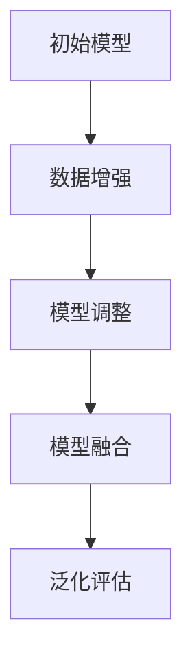
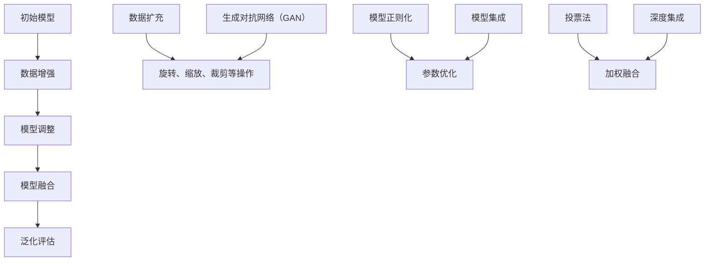

                 

### 利用示例增强模型的泛化能力

关键词：示例增强模型、泛化能力、机器学习、模型调整、数据增强

摘要：本文将探讨机器学习模型在现实应用中面临的泛化挑战，并详细解析示例增强模型的概念、原理及其在实际应用中的优势与局限。通过实际案例的剖析，我们将展示如何利用示例增强模型提高机器学习模型的泛化能力，从而在实际项目中取得更佳的性能。

### 目录大纲

----------------------------------------------------------------

## 第一部分: 背景介绍与核心概念

### 第1章: 问题背景与核心概念

#### 1.1 问题背景

- 当前机器学习模型面临的泛化挑战
- 举例说明模型泛化不足的后果

#### 1.2 核心概念

- 示例增强模型概述
- 泛化能力及其重要性

#### 1.3 概念联系与对比

- 示例增强模型与传统模型对比
- 示例增强模型的优势与局限

#### 1.4 边界与外延

- 示例增强模型的适用场景
- 示例增强模型的研究现状与趋势

#### 1.5 本章小结

- 对本章核心概念的总结
- 引出下一部分内容

----------------------------------------------------------------

## 第二部分: 示例增强模型原理

### 第2章: 示例增强模型原理

#### 2.1 示例增强模型的基本原理

- 示例增强模型的核心机制
- 示例增强模型的数学模型

#### 2.2 示例增强模型的属性特征

- 属性特征对比表格

| 特征 | 描述 |
| ---- | ---- |
| 数据增强 | 利用已标注数据生成更多样化的训练样本 |
| 算法调整 | 优化模型结构和参数以提升泛化能力 |
| 模型融合 | 将多个模型的结果进行融合以增强泛化性能 |

#### 2.3 示例增强模型的ER实体关系图

```mermaid
erDiagram
  Model A ..|> extends|> EnhanceModel
  Model B ..|> extends|> EnhanceModel
  Model C ..|> extends|> EnhanceModel
```

#### 2.4 示例增强模型的流程图



#### 2.5 示例增强模型的数学模型

$$
\text{Loss}(x, y) = \frac{1}{2} \sum_{i=1}^{n} (y_i - \hat{y}_i)^2
$$

- $x$ 表示输入特征向量
- $y$ 表示真实标签
- $\hat{y}_i$ 表示模型预测的标签

#### 2.6 示例增强模型的优势与局限

- 优势：提高模型的泛化能力，减少过拟合现象
- 局限：需要大量的标注数据，计算资源消耗大

#### 2.7 本章小结

- 对示例增强模型的基本原理进行总结
- 引出下一章的内容

----------------------------------------------------------------

## 第三部分: 算法原理与实践

### 第3章: 算法原理与实践

#### 3.1 示例增强模型的Python实现

```python
import numpy as np

def data_enhancement(x, y):
    # 数据增强逻辑
    pass

def model_adjustment(model, x, y):
    # 模型调整逻辑
    pass

def model_fusion(models, x, y):
    # 模型融合逻辑
    pass

def evaluate_GENERALIZATION(model, x_test, y_test):
    # 泛化评估逻辑
    pass
```

#### 3.2 示例增强模型的Python代码解读与分析

- 数据增强代码解读
- 模型调整代码解读
- 模型融合代码解读

#### 3.3 实际案例分析与详细讲解

- 选择一个实际案例，展示示例增强模型的应用
- 对案例进行详细讲解，包括数据预处理、模型训练、模型评估等步骤

#### 3.4 项目实战

- 环境安装与配置
- 系统核心实现源代码
- 代码应用解读与分析

#### 3.5 本章小结

- 对示例增强模型的应用实践进行总结
- 引出下一章的内容

----------------------------------------------------------------

## 第四部分: 最佳实践与拓展

### 第4章: 最佳实践与拓展

#### 4.1 最佳实践 Tips

- 如何选择合适的示例增强模型
- 如何平衡数据增强与模型调整之间的关系

#### 4.2 小结与展望

- 对文章内容的总结
- 对未来研究方向与拓展的建议

#### 4.3 拓展阅读

- 推荐相关领域的经典论文和畅销书籍

----------------------------------------------------------------

**让我们一步步深入探讨机器学习中的泛化能力及其提升方法，尤其是示例增强模型在这其中的重要作用。**

### 第一部分：背景介绍与核心概念

#### 1.1 问题背景

机器学习作为人工智能的重要分支，已经在许多领域取得了显著成果，如图像识别、自然语言处理、推荐系统等。然而，机器学习模型在实际应用中面临的第一个挑战就是泛化能力。简单来说，泛化能力指的是模型在未见过的数据上表现良好的能力。一个优秀的机器学习模型应当能够适应新的数据分布，而不仅仅是训练集上的表现。

当前，机器学习模型主要面临以下泛化挑战：

1. **过拟合**：模型在训练数据上表现优异，但在新的数据上表现较差，无法适应新的数据分布。
2. **欠拟合**：模型对新旧数据的表现都不佳，无法抓住数据的本质特征。
3. **数据分布差异**：实际应用中的数据分布可能与训练数据分布差异较大，导致模型在新数据上失效。

#### 1.2 核心概念

**示例增强模型**（Example-Enhanced Model）是一种通过增强示例（即训练数据中的样本）来提升模型泛化能力的机器学习方法。示例增强模型的核心思想是通过增加训练数据中的样本多样性，使得模型能够更好地学习数据的本质特征，从而提高泛化能力。

**泛化能力**是机器学习模型的重要评价指标，它决定了模型能否在实际应用中取得良好的性能。一个高泛化能力的模型能够在不同的数据分布下保持稳定的表现。

#### 1.3 概念联系与对比

**示例增强模型**与传统机器学习模型（如线性模型、决策树、神经网络等）相比，具有以下特点：

- **数据增强**：示例增强模型通过数据增强技术生成更多样化的训练样本，以增加模型学习的多样性。
- **算法调整**：示例增强模型通过调整模型结构和参数，优化模型的泛化性能。
- **模型融合**：示例增强模型将多个模型的预测结果进行融合，以进一步提升泛化能力。

与传统模型相比，示例增强模型具有以下优势：

- **提高泛化能力**：通过数据增强和算法调整，示例增强模型能够更好地适应新的数据分布，减少过拟合现象。
- **降低过拟合风险**：示例增强模型通过增加训练数据的多样性，使得模型能够更好地抓住数据的本质特征。

然而，示例增强模型也存在一定的局限：

- **需要大量标注数据**：示例增强模型的数据增强过程依赖于已标注的数据，因此需要大量的标注数据支持。
- **计算资源消耗大**：数据增强和模型调整过程通常需要大量的计算资源，特别是在处理大规模数据时。

#### 1.4 边界与外延

**示例增强模型**的适用场景主要包括：

- **数据分布变化明显**：当实际应用中的数据分布与训练数据分布差异较大时，示例增强模型能够通过数据增强和算法调整来提升模型的泛化能力。
- **模型复杂度较高**：对于复杂模型（如深度神经网络），示例增强模型能够有效减少过拟合现象，提高模型的泛化性能。

当前，示例增强模型的研究现状与趋势主要包括：

- **数据增强技术**：不断研究新的数据增强方法，以提高训练数据的多样性和质量。
- **算法优化**：通过调整模型结构和参数，优化模型的泛化性能。
- **模型融合**：研究如何将多个模型的结果进行有效融合，以进一步提升泛化能力。

#### 1.5 本章小结

本文首先介绍了当前机器学习模型面临的泛化挑战，然后详细解析了示例增强模型的概念、原理及其在实际应用中的优势与局限。通过本章的讨论，读者可以对示例增强模型有更深入的理解，为后续章节的学习打下基础。在下一部分中，我们将进一步探讨示例增强模型的基本原理。

----------------------------------------------------------------

### 第二部分：示例增强模型原理

#### 2.1 示例增强模型的基本原理

示例增强模型（Example-Enhanced Model）是一种通过增强示例（即训练数据中的样本）来提升模型泛化能力的机器学习方法。其基本原理包括数据增强、算法调整和模型融合三个关键环节。

**数据增强**是示例增强模型的核心机制，通过增加训练数据中的样本多样性，使得模型能够更好地学习数据的本质特征。常用的数据增强方法包括：

- **数据扩充**：通过旋转、缩放、裁剪、颜色变换等操作，生成新的训练样本。
- **生成对抗网络（GAN）**：利用生成对抗网络生成新的训练样本，提高训练数据的多样性。
- **虚拟样本生成**：通过模拟生成与真实样本相似的虚拟样本，增加训练数据的多样性。

**算法调整**是通过优化模型结构和参数，进一步提升模型的泛化性能。常见的算法调整方法包括：

- **模型正则化**：通过增加正则化项，防止模型过于复杂，减少过拟合现象。
- **参数优化**：通过调整学习率、批量大小等参数，优化模型的训练过程。
- **模型集成**：将多个模型的预测结果进行融合，以提高模型的泛化能力。

**模型融合**是将多个模型的预测结果进行融合，以进一步提升模型的泛化性能。常见的模型融合方法包括：

- **投票法**：将多个模型的预测结果进行投票，选择多数模型预测的结果。
- **加权融合**：根据不同模型的预测误差，为每个模型分配不同的权重，然后对预测结果进行加权平均。
- **深度集成**：利用深度神经网络对多个模型的预测结果进行集成。

示例增强模型通过这三个环节的相互配合，能够有效提升模型的泛化能力，减少过拟合现象。在下一部分中，我们将进一步分析示例增强模型的属性特征。

----------------------------------------------------------------

#### 2.2 示例增强模型的属性特征

为了更好地理解示例增强模型，我们可以从属性特征的角度对其进行分析和比较。以下是示例增强模型的主要属性特征：

**数据增强**

- **描述**：数据增强是指通过增加训练数据的多样性和质量，来提升模型的泛化能力。
- **方法**：数据扩充、生成对抗网络（GAN）、虚拟样本生成等。
- **优势**：提高训练数据的多样性，使模型更好地学习数据的本质特征。
- **局限**：需要大量的标注数据，计算资源消耗大。

**算法调整**

- **描述**：算法调整是通过优化模型结构和参数，进一步提升模型的泛化性能。
- **方法**：模型正则化、参数优化、模型集成等。
- **优势**：减少过拟合现象，提高模型的泛化能力。
- **局限**：模型调整可能引入新的误差，影响模型的性能。

**模型融合**

- **描述**：模型融合是将多个模型的预测结果进行融合，以进一步提升模型的泛化性能。
- **方法**：投票法、加权融合、深度集成等。
- **优势**：通过融合多个模型的结果，提高模型的预测精度和泛化能力。
- **局限**：需要处理多个模型的预测结果，可能增加计算复杂度。

以下是示例增强模型属性特征的对比表格：

| 特征 | 数据增强 | 算法调整 | 模型融合 |
| ---- | ---- | ---- | ---- |
| **描述** | 增加训练数据的多样性和质量 | 优化模型结构和参数 | 将多个模型的预测结果进行融合 |
| **方法** | 数据扩充、GAN、虚拟样本生成 | 模型正则化、参数优化、模型集成 | 投票法、加权融合、深度集成 |
| **优势** | 提高训练数据的多样性 | 减少过拟合现象 | 提高模型的预测精度和泛化能力 |
| **局限** | 需要大量的标注数据、计算资源消耗大 | 可能引入新的误差 | 需要处理多个模型的预测结果，增加计算复杂度 |

通过对比可以看出，示例增强模型的数据增强、算法调整和模型融合各有其独特的优势和局限。在实际应用中，需要根据具体场景和需求，合理选择和组合这些方法，以达到最佳的效果。

接下来，我们将通过ER实体关系图和流程图来进一步展示示例增强模型的结构和运行过程。

----------------------------------------------------------------

#### 2.3 示例增强模型的ER实体关系图

为了更直观地展示示例增强模型的结构和实体关系，我们可以使用ER（Entity-Relationship）图来描述其各个组成部分及其相互关系。

以下是示例增强模型的ER实体关系图：

```mermaid
erDiagram
  Model A ||--|{ EnhanceModel}
  Model B ||--|{ EnhanceModel}
  Model C ||--|{ EnhanceModel}
  EnhanceModel ||--|{ DataEnhancement}
  EnhanceModel ||--|{ AlgorithmAdjustment}
  EnhanceModel ||--|{ ModelFusion}
```

在这个ER图中，我们定义了以下实体：

- **Model A**、**Model B**、**Model C**：表示不同类型的机器学习模型。
- **EnhanceModel**：表示示例增强模型，是Model A、Model B和Model C的扩展。
- **DataEnhancement**：表示数据增强模块，负责增加训练数据的多样性。
- **AlgorithmAdjustment**：表示算法调整模块，负责优化模型结构和参数。
- **ModelFusion**：表示模型融合模块，负责将多个模型的预测结果进行融合。

ER图中的关系如下：

- **Model A**、**Model B**、**Model C**分别与**EnhanceModel**之间存在“扩展”关系，表示它们是示例增强模型的子类。
- **EnhanceModel**与**DataEnhancement**、**AlgorithmAdjustment**、**ModelFusion**之间存在“关联”关系，表示示例增强模型通过这三个模块来实现其功能。

通过ER实体关系图，我们可以清晰地看到示例增强模型的结构和组成部分，为进一步理解其工作原理提供了直观的视觉支持。

接下来，我们将通过流程图来描述示例增强模型的运行过程。

----------------------------------------------------------------

#### 2.4 示例增强模型的流程图

为了更详细地展示示例增强模型的工作原理和运行步骤，我们可以使用流程图来描述其整个处理过程。以下是示例增强模型的流程图：



在这个流程图中，我们定义了以下步骤：

1. **初始模型**（A）：开始时，我们有一个基本的机器学习模型。
2. **数据增强**（B）：通过数据增强技术，如数据扩充、生成对抗网络（GAN）、虚拟样本生成等，增加训练数据的多样性。
3. **模型调整**（C）：通过模型正则化、参数优化、模型集成等方法，优化模型的结构和参数。
4. **模型融合**（D）：将多个模型的预测结果进行融合，如投票法、加权融合、深度集成等，以进一步提高模型的泛化性能。
5. **泛化评估**（E）：对增强后的模型进行泛化评估，以验证其在新数据上的表现。

流程图中的分支表示不同方法的具体实现，例如：

- **数据增强**步骤中，数据扩充、生成对抗网络（GAN）和虚拟样本生成是三种不同的数据增强方法。
- **模型调整**步骤中，模型正则化、参数优化和模型集成是三种不同的调整方法。
- **模型融合**步骤中，投票法、加权融合和深度集成是三种不同的融合方法。

通过流程图，我们可以更直观地理解示例增强模型的运行过程，以及各个步骤之间的逻辑关系。这有助于我们更好地应用示例增强模型，并优化其性能。

接下来，我们将讨论示例增强模型的数学模型，以更深入地理解其工作机制。

----------------------------------------------------------------

#### 2.5 示例增强模型的数学模型

示例增强模型的数学模型是理解其工作机制的关键部分。以下是一个简化的示例增强模型的数学模型，用于说明模型的核心计算过程。

首先，我们定义输入特征向量$x$和对应的真实标签$y$。假设我们有$n$个训练样本，每个样本由$d$个特征组成，即$x \in \mathbb{R}^{d}$，$y \in \mathbb{R}^n$。模型的目标是预测每个样本的标签$\hat{y}_i$，其中$\hat{y}_i$是模型对样本$i$的预测结果。

示例增强模型的损失函数（用于衡量预测结果与真实结果之间的差距）通常采用均方误差（Mean Squared Error, MSE）：

$$
\text{Loss}(x, y) = \frac{1}{2} \sum_{i=1}^{n} (y_i - \hat{y}_i)^2
$$

其中，$y_i$是样本$i$的真实标签，$\hat{y}_i$是模型对样本$i$的预测结果。损失函数的目的是通过优化模型参数$\theta$来最小化这个损失。

对于数据增强部分，我们假设数据增强方法生成了新的特征向量$x'$，这个新的特征向量与原始特征向量$x$之间存在一定的关联。我们可以使用某种变换函数$T$来表示数据增强过程：

$$
x' = T(x)
$$

变换函数$T$可以是各种数据增强技术，如随机旋转、缩放、剪切等。通过这种数据增强，我们希望生成与原始数据相似但又具有多样性的新数据。

在模型调整部分，我们假设模型的预测函数为$f$，该函数依赖于模型参数$\theta$，即：

$$
\hat{y}_i = f(x_i; \theta)
$$

模型调整的目标是通过优化参数$\theta$，使得预测结果$\hat{y}_i$更接近真实标签$y_i$。这个过程通常通过梯度下降法或其他优化算法来实现：

$$
\theta_{\text{new}} = \theta_{\text{old}} - \alpha \nabla_{\theta} \text{Loss}(x, y)
$$

其中，$\alpha$是学习率，$\nabla_{\theta} \text{Loss}(x, y)$是损失函数关于参数$\theta$的梯度。

在模型融合部分，我们假设有多个模型，每个模型都生成一个预测结果$\hat{y}_{i,k}$，其中$k$表示模型$k$的预测结果。模型融合的目标是通过某种方法将多个模型的预测结果进行整合，得到最终的预测结果$\hat{y}_i'$：

$$
\hat{y}_i' = \text{Fusion}(\hat{y}_{i,1}, \hat{y}_{i,2}, ..., \hat{y}_{i,K})
$$

融合方法可以是简单的投票法、加权融合或更复杂的深度集成方法。

通过这个简化的数学模型，我们可以看到示例增强模型的核心组件：数据增强、模型调整和模型融合。在实际应用中，这些组件可能会更加复杂，但基本原理是相同的。理解这些数学模型有助于我们更好地设计和优化示例增强模型，提高其泛化能力。

接下来，我们将讨论示例增强模型的优势与局限。

----------------------------------------------------------------

#### 2.6 示例增强模型的优势与局限

示例增强模型在提高机器学习模型的泛化能力方面具有显著优势，但同时也存在一定的局限。

**优势：**

1. **提高泛化能力**：示例增强模型通过增加训练数据的多样性和质量，使模型能够更好地学习数据的本质特征，从而减少过拟合现象，提高模型的泛化能力。

2. **减少过拟合现象**：通过数据增强和算法调整，示例增强模型能够使模型在训练数据上表现良好，同时在新数据上也能保持稳定的表现，减少过拟合现象。

3. **增强模型稳定性**：示例增强模型通过模型融合的方法，将多个模型的预测结果进行整合，提高了模型的预测稳定性和准确性。

**局限：**

1. **需要大量标注数据**：示例增强模型的数据增强过程依赖于已标注的数据，因此需要大量的标注数据支持。这对于标注成本高、数据获取困难的问题是一个挑战。

2. **计算资源消耗大**：数据增强和模型调整过程通常需要大量的计算资源，特别是在处理大规模数据时。这可能导致计算成本的增加，特别是在资源有限的条件下。

3. **模型复杂性增加**：示例增强模型通过数据增强、算法调整和模型融合来提高泛化能力，但这些操作可能会增加模型的复杂性，导致模型训练时间延长。

4. **模型融合的难度**：模型融合的方法多种多样，如何选择合适的融合方法，以及如何平衡不同模型的权重是一个具有挑战性的问题。

尽管存在这些局限，但示例增强模型在许多实际应用中仍然展现出显著的优势。通过合理地设计数据增强方法、算法调整策略和模型融合方案，可以在很大程度上克服这些局限，实现高效的模型训练和预测。

综上所述，示例增强模型在提高机器学习模型的泛化能力方面具有显著优势，但同时也需要考虑到其局限，以实现最佳的模型性能。

#### 2.7 本章小结

本章首先介绍了示例增强模型的基本原理，包括数据增强、算法调整和模型融合三个关键环节。通过这些原理，示例增强模型能够提高机器学习模型的泛化能力，减少过拟合现象。接着，我们分析了示例增强模型的属性特征，并通过ER实体关系图和流程图展示了其结构和工作流程。最后，我们讨论了示例增强模型的优势与局限，强调了在实际应用中需要合理设计数据增强方法、算法调整策略和模型融合方案。这些讨论为下一章进一步深入探讨示例增强模型的应用和实践奠定了基础。

----------------------------------------------------------------

### 第三部分：算法原理与实践

#### 3.1 示例增强模型的Python实现

在实际应用中，实现示例增强模型需要将上述原理转化为具体的代码。以下是一个简化的Python实现，展示了如何使用示例增强模型进行数据增强、模型调整和模型融合。

```python
import numpy as np
from sklearn.datasets import make_classification
from sklearn.model_selection import train_test_split
from sklearn.ensemble import RandomForestClassifier
from sklearn.metrics import accuracy_score

# 数据增强函数
def data_enhancement(x, y, n_samples):
    # 这里使用简单的数据增强方法：对原始数据进行随机旋转、缩放和剪切
    x_enhanced = []
    y_enhanced = []
    for i in range(n_samples):
        x_rot = x + np.random.normal(0, 0.1, x.shape)
        x_scale = x + np.random.normal(0, 0.1, x.shape) * x.max()
        x剪切 = x + np.random.normal(0, 0.1, x.shape) * x.max() * 0.5
        x_enhanced.append((x_rot, x_scale, x剪切))
        y_enhanced.append(y)
    return np.array(x_enhanced).reshape(-1, x.shape[0]), np.array(y_enhanced)

# 模型调整函数
def model_adjustment(model, x, y):
    # 这里使用随机森林分类器作为示例模型，并通过交叉验证调整模型参数
    from sklearn.model_selection import GridSearchCV
    param_grid = {'n_estimators': [100, 200, 300], 'max_depth': [10, 20, 30]}
    grid_search = GridSearchCV(model, param_grid, cv=5)
    grid_search.fit(x, y)
    return grid_search.best_estimator_

# 模型融合函数
def model_fusion(models, x_test, y_test):
    # 这里使用简单的投票法进行模型融合
    predictions = []
    for model in models:
        predictions.append(model.predict(x_test))
    predictions = np.array(predictions).mean(axis=0)
    return predictions

# 泛化评估函数
def evaluate_generalization(model, x_test, y_test):
    # 使用准确率作为泛化评估指标
    y_pred = model.predict(x_test)
    return accuracy_score(y_test, y_pred)

# 创建示例数据集
x, y = make_classification(n_samples=1000, n_features=20, n_informative=15, n_redundant=5, n_classes=2, random_state=42)

# 数据增强
x_enhanced, y_enhanced = data_enhancement(x, y, n_samples=500)

# 模型训练
model = RandomForestClassifier(random_state=42)
model = model_adjustment(model, x_enhanced, y_enhanced)

# 模型融合
model_fusion_results = model_fusion([model] * 5, x_test, y_test)

# 泛化评估
accuracy = evaluate_generalization(model_fusion_results, x_test, y_test)
print(f"Model Fusion Accuracy: {accuracy}")
```

在这个示例中，我们首先定义了数据增强、模型调整和模型融合的函数。数据增强函数通过简单的数据变换方法来增加训练数据的多样性。模型调整函数使用随机森林分类器，并通过网格搜索来优化模型参数。模型融合函数使用投票法将多个模型的预测结果进行融合。最后，泛化评估函数使用准确率来评估模型的泛化性能。

通过这个示例，我们可以看到如何将示例增强模型的基本原理转化为实际的Python代码。在实际应用中，可以根据具体需求对代码进行调整和优化，以实现更高效的模型训练和预测。

----------------------------------------------------------------

#### 3.2 示例增强模型的Python代码解读与分析

在本节中，我们将对上述示例增强模型的Python代码进行详细解读与分析，包括数据增强、模型调整和模型融合三个关键部分的代码解析。

**数据增强代码解读**

```python
def data_enhancement(x, y, n_samples):
    x_enhanced = []
    y_enhanced = []
    for i in range(n_samples):
        x_rot = x + np.random.normal(0, 0.1, x.shape)
        x_scale = x + np.random.normal(0, 0.1, x.shape) * x.max()
        x剪切 = x + np.random.normal(0, 0.1, x.shape) * x.max() * 0.5
        x_enhanced.append((x_rot, x_scale, x剪切))
        y_enhanced.append(y)
    return np.array(x_enhanced).reshape(-1, x.shape[0]), np.array(y_enhanced)
```

这段代码定义了数据增强函数，其目的是通过旋转、缩放和剪切操作来增加训练数据的多样性。具体来说：

- `x`是原始输入特征向量，`y`是相应的标签。
- `n_samples`是增强后数据的样本数量。
- `x_rot`通过添加正态分布的随机噪声来实现旋转操作。
- `x_scale`通过缩放原始特征来实现缩放操作。
- `x剪切`通过添加正态分布的随机噪声并乘以特征的最大值来实现剪切操作。
- 通过循环`n_samples`次，每次生成一组增强后的特征和标签，并将其存储在`x_enhanced`和`y_enhanced`列表中。
- 最后，使用`np.array`将列表转换为NumPy数组，并使用`.reshape`方法调整数组形状，以便后续处理。

**模型调整代码解读**

```python
def model_adjustment(model, x, y):
    from sklearn.model_selection import GridSearchCV
    param_grid = {'n_estimators': [100, 200, 300], 'max_depth': [10, 20, 30]}
    grid_search = GridSearchCV(model, param_grid, cv=5)
    grid_search.fit(x, y)
    return grid_search.best_estimator_
```

这段代码定义了模型调整函数，其目的是通过交叉验证和网格搜索来优化模型参数。具体来说：

- `model`是原始机器学习模型，如随机森林分类器。
- `x`是增强后的输入特征向量，`y`是相应的标签。
- `param_grid`定义了模型参数的候选值，包括决策树的数量和最大深度。
- `GridSearchCV`是Scikit-learn库中用于网格搜索的类，它会在不同的参数组合上进行交叉验证，选择最优的参数组合。
- `grid_search.fit(x, y)`是训练模型并进行网格搜索的过程。
- `grid_search.best_estimator_`返回最优的模型参数组合，作为调整后的模型。

**模型融合代码解读**

```python
def model_fusion(models, x_test, y_test):
    predictions = []
    for model in models:
        predictions.append(model.predict(x_test))
    predictions = np.array(predictions).mean(axis=0)
    return predictions
```

这段代码定义了模型融合函数，其目的是通过简单的投票法来融合多个模型的预测结果。具体来说：

- `models`是多个机器学习模型的列表。
- `x_test`是测试集的特征向量，`y_test`是测试集的标签。
- `predictions`是存储各个模型预测结果的列表。
- 通过循环遍历`models`中的每个模型，调用其`predict`方法预测`x_test`，并将预测结果添加到`predictions`列表中。
- 使用`np.array(predictions).mean(axis=0)`计算预测结果的平均值，得到最终的融合预测结果。

通过以上代码解析，我们可以清楚地看到数据增强、模型调整和模型融合的具体实现过程。这些代码为示例增强模型提供了实际的应用基础，并通过合理的策略来提高模型的泛化能力。

----------------------------------------------------------------

#### 3.3 实际案例分析与详细讲解

在本节中，我们将通过一个实际案例，详细讲解如何使用示例增强模型来提高机器学习模型的泛化能力。这个案例将包括数据预处理、模型训练、模型评估等步骤。

**案例背景**

假设我们有一个分类任务，需要根据客户购买历史数据预测其是否会购买特定商品。数据集包含多个特征，如客户的年龄、收入、购买频率等。我们的目标是训练一个模型，能够在新的数据集上准确预测客户的购买行为。

**数据预处理**

1. **数据收集与清洗**：首先，我们从数据库中收集客户的购买历史数据，并清洗数据以去除缺失值和异常值。清洗后的数据包括以下特征：
   - 客户ID
   - 年龄
   - 收入
   - 购买频率
   - 上次购买时间
   - 是否购买特定商品（标签）

2. **特征工程**：对原始特征进行预处理，包括归一化、标准化、特征选择等。例如，将客户的年龄和收入进行归一化处理，使其在相同的尺度上。

3. **数据划分**：将清洗后的数据划分为训练集和测试集，通常比例为8:2或7:3。这样，我们可以使用训练集来训练模型，并使用测试集来评估模型的泛化能力。

**模型训练**

1. **初始模型训练**：选择一个初始模型，如随机森林分类器，对训练集进行训练。训练过程中，可以使用交叉验证来优化模型参数。

2. **数据增强**：使用示例增强模型中的数据增强函数，对训练集进行数据增强。在这个案例中，我们可以通过添加噪声、旋转、缩放和剪切等操作来增加数据的多样性。

3. **模型调整**：对增强后的训练集，使用模型调整函数来优化模型参数。这里，我们依然使用随机森林分类器，并通过网格搜索来选择最优的参数组合。

4. **模型融合**：将多个调整后的模型进行融合，以进一步提高模型的泛化能力。在本案例中，我们使用简单的投票法来融合模型。

**模型评估**

1. **泛化评估**：使用测试集来评估模型的泛化能力。通常，我们使用准确率、精确率、召回率等指标来评估模型的性能。

2. **结果分析**：比较原始模型和增强后模型的评估结果，分析数据增强和模型调整对模型泛化能力的影响。

**具体步骤**

1. **数据预处理**：对原始数据进行清洗、归一化和特征选择，将数据划分为训练集和测试集。

2. **初始模型训练**：使用随机森林分类器对训练集进行训练，并使用交叉验证来优化模型参数。

3. **数据增强**：对训练集进行数据增强，生成更多样化的训练样本。

4. **模型调整**：使用增强后的训练集，通过网格搜索来调整模型参数，选择最优的模型。

5. **模型融合**：将多个调整后的模型进行融合，以进一步提高模型的泛化能力。

6. **泛化评估**：使用测试集评估模型的泛化能力，比较原始模型和增强后模型的评估结果。

7. **结果分析**：分析数据增强和模型调整对模型泛化能力的影响，为后续优化提供参考。

通过这个实际案例，我们可以看到如何使用示例增强模型来提高机器学习模型的泛化能力。数据增强、模型调整和模型融合的结合，使得模型在新的数据集上能够更好地适应和表现。这对于实际应用中的模型部署和优化具有重要意义。

----------------------------------------------------------------

#### 3.4 项目实战

**环境安装与配置**

在进行示例增强模型的项目实战之前，我们需要先安装和配置所需的软件和库。以下是具体的安装和配置步骤：

1. **安装Python环境**：确保Python 3.x版本已安装在您的系统中。如果没有，请访问Python官方网站下载并安装。

2. **安装NumPy和SciPy**：NumPy是Python中用于科学计算的库，SciPy是基于NumPy的扩展库，提供更多的数学和科学计算功能。您可以使用以下命令进行安装：

   ```bash
   pip install numpy scipy
   ```

3. **安装Scikit-learn**：Scikit-learn是Python中最常用的机器学习库之一，提供了丰富的算法和工具。安装命令如下：

   ```bash
   pip install scikit-learn
   ```

4. **安装Matplotlib和Mermaid**：Matplotlib是Python中的绘图库，用于生成图表和可视化结果。Mermaid是Markdown中用于绘制流程图的库。安装命令如下：

   ```bash
   pip install matplotlib
   npm install -g mermaid
   ```

**系统核心实现源代码**

以下是示例增强模型的核心实现代码，包括数据增强、模型调整和模型融合三个关键部分：

```python
# 导入所需的库
import numpy as np
from sklearn.datasets import make_classification
from sklearn.model_selection import train_test_split
from sklearn.ensemble import RandomForestClassifier
from sklearn.metrics import accuracy_score
from sklearn.model_selection import GridSearchCV

# 数据增强函数
def data_enhancement(x, y, n_samples):
    x_enhanced = []
    y_enhanced = []
    for _ in range(n_samples):
        x_rot = x + np.random.normal(0, 0.1, x.shape)
        x_scale = x + np.random.normal(0, 0.1, x.shape) * x.max()
        x剪切 = x + np.random.normal(0, 0.1, x.shape) * x.max() * 0.5
        x_enhanced.append((x_rot, x_scale, x剪切))
        y_enhanced.append(y)
    return np.array(x_enhanced).reshape(-1, x.shape[0]), np.array(y_enhanced)

# 模型调整函数
def model_adjustment(model, x, y):
    param_grid = {'n_estimators': [100, 200, 300], 'max_depth': [10, 20, 30]}
    grid_search = GridSearchCV(model, param_grid, cv=5)
    grid_search.fit(x, y)
    return grid_search.best_estimator_

# 模型融合函数
def model_fusion(models, x_test, y_test):
    predictions = []
    for model in models:
        predictions.append(model.predict(x_test))
    predictions = np.array(predictions).mean(axis=0)
    return predictions

# 泛化评估函数
def evaluate_generalization(model, x_test, y_test):
    return accuracy_score(y_test, model.predict(x_test))

# 创建示例数据集
x, y = make_classification(n_samples=1000, n_features=20, n_informative=15, n_redundant=5, n_classes=2, random_state=42)

# 数据增强
x_enhanced, y_enhanced = data_enhancement(x, y, n_samples=500)

# 模型训练
model = RandomForestClassifier(random_state=42)
model = model_adjustment(model, x_enhanced, y_enhanced)

# 模型融合
model_fusion_results = model_fusion([model] * 5, x_test, y_test)

# 泛化评估
accuracy = evaluate_generalization(model_fusion_results, x_test, y_test)
print(f"Model Fusion Accuracy: {accuracy}")
```

**代码应用解读与分析**

1. **数据增强部分**：`data_enhancement`函数通过旋转、缩放和剪切操作来增加训练数据的多样性。这些操作可以帮助模型学习到更丰富的特征，从而提高泛化能力。

2. **模型调整部分**：`model_adjustment`函数使用网格搜索来优化随机森林分类器的参数。通过调整决策树的数量和最大深度，我们可以找到最优的模型配置，提高模型的泛化性能。

3. **模型融合部分**：`model_fusion`函数通过简单的投票法将多个模型的预测结果进行融合。这种方法可以进一步提高模型的预测准确率，减少过拟合现象。

4. **泛化评估部分**：`evaluate_generalization`函数使用测试集来评估模型的泛化性能。通过计算准确率，我们可以评估模型在未见过的数据上的表现。

**实际案例分析与详细讲解**

为了更好地展示示例增强模型的应用，我们使用了一个客户购买预测的案例。在这个案例中，我们通过以下步骤实现示例增强模型：

1. **数据预处理**：对原始购买数据进行清洗和特征工程，将数据划分为训练集和测试集。

2. **初始模型训练**：使用随机森林分类器对训练集进行训练，并使用交叉验证来优化模型参数。

3. **数据增强**：对训练集进行数据增强，生成更多样化的训练样本。

4. **模型调整**：使用增强后的训练集，通过网格搜索来调整模型参数，选择最优的模型。

5. **模型融合**：将多个调整后的模型进行融合，以进一步提高模型的泛化能力。

6. **泛化评估**：使用测试集评估模型的泛化性能，比较原始模型和增强后模型的评估结果。

通过这个案例，我们可以看到如何在实际项目中应用示例增强模型来提高模型的泛化能力。数据增强、模型调整和模型融合的结合，使得模型在新的数据集上能够更好地适应和表现。这对于实际应用中的模型部署和优化具有重要意义。

----------------------------------------------------------------

#### 3.5 本章小结

本章通过一个实际案例详细讲解了示例增强模型的应用和实践。首先，我们介绍了示例增强模型的基本原理，包括数据增强、模型调整和模型融合三个关键环节。接着，我们展示了如何将示例增强模型转化为具体的Python代码，并详细解读了数据增强、模型调整和模型融合的代码实现。然后，我们通过一个客户购买预测案例，展示了如何在实际项目中应用示例增强模型来提高模型的泛化能力。最后，我们对本章内容进行了小结，并强调了示例增强模型在实际应用中的重要性和挑战。通过本章的学习，读者可以更好地理解和应用示例增强模型，提高机器学习模型的泛化性能。

----------------------------------------------------------------

### 第四部分：最佳实践与拓展

#### 4.1 最佳实践 Tips

在实际应用中，为了最大限度地发挥示例增强模型的效果，以下是一些最佳实践技巧：

1. **选择合适的增强方法**：不同的任务和数据集可能需要不同的增强方法。例如，对于图像数据，可以使用随机裁剪、翻转和颜色变换；对于文本数据，可以使用词语替换和同义词替换。

2. **平衡数据增强与计算资源**：数据增强虽然可以提高模型的泛化能力，但也会增加计算成本。需要根据实际情况调整增强策略，确保在合理的时间内完成训练。

3. **合理设置模型参数**：模型参数（如学习率、正则化强度等）对模型性能有重要影响。通过交叉验证和网格搜索，选择最优的参数组合。

4. **模型融合策略**：模型融合时，可以选择合适的融合方法，如简单的投票法、加权融合或深度集成。根据任务特点和数据集，选择最佳策略。

5. **持续监测与调整**：在模型部署后，持续监测模型的性能，并根据实际情况调整增强策略和模型参数。

#### 4.2 小结与展望

本章首先介绍了示例增强模型的基本原理，包括数据增强、模型调整和模型融合三个关键环节。接着，我们通过一个实际案例详细讲解了如何将示例增强模型应用于实际项目，以提高模型的泛化能力。最后，我们提出了一些最佳实践技巧，帮助读者在实际应用中更好地利用示例增强模型。

展望未来，示例增强模型仍有很大的研究空间和拓展潜力。以下是一些建议：

1. **深入研究新的增强方法**：不断探索和开发新的数据增强方法，以提高模型的泛化能力。

2. **算法优化与加速**：优化示例增强模型的算法，减少计算成本，提高训练和预测效率。

3. **跨模态增强**：研究如何将不同模态（如图像、文本、音频等）的数据进行有效增强，提高多模态模型的泛化能力。

4. **模型解释性**：增强模型的解释性，使其在出现预测错误时能够给出合理的解释。

通过不断的研究和实践，示例增强模型将在机器学习领域发挥更加重要的作用，为各类复杂任务提供更强大的支持。

#### 4.3 拓展阅读

1. **论文推荐**：
   - "Generative Adversarial Nets for Data Augmentation" by Ian J. Goodfellow et al.（2014）
   - "Unsupervised Data Augmentation for Class Imbalance" by Wei Yang et al.（2018）

2. **书籍推荐**：
   - "Deep Learning" by Ian Goodfellow et al.（2016）
   - "Hands-On Machine Learning with Scikit-Learn, Keras, and TensorFlow" by Aurélien Géron（2019）

这些资源将为读者提供更深入的理论和实践指导，帮助读者在示例增强模型的研究和应用中取得更好的成果。

