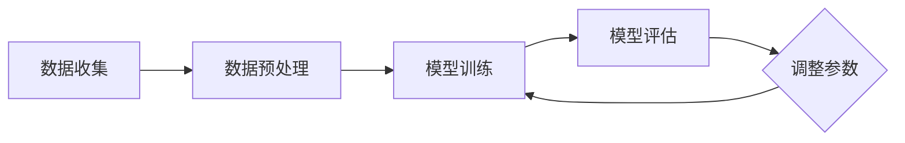
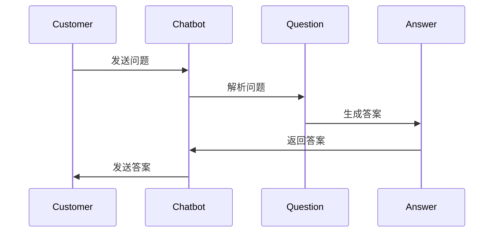
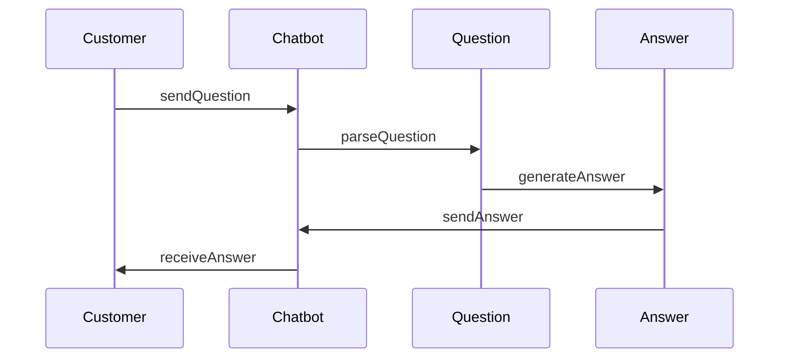

                 

### 利用示例增强模型的逻辑推理能力

#### 关键词：示例增强模型、逻辑推理、人工智能、模型训练、应用场景

> 摘要：本文深入探讨了示例增强模型在逻辑推理中的应用及其重要性。首先，我们回顾了逻辑推理的基本概念和示例增强模型的发展背景。接着，文章详细解析了示例增强模型的核心原理，并通过Mermaid流程图和Python源代码示例进行了深入解释。随后，我们探讨了如何使用LaTeX公式来描述数学模型，并提供了实际案例的说明。最后，文章讨论了示例增强模型在不同应用场景中的设计和实现，并给出了最佳实践和建议。

---

## 背景介绍

逻辑推理是人工智能领域的一个核心问题。它涉及到如何从一个或多个已知的事实推导出新的结论。逻辑推理在许多任务中至关重要，如自然语言处理、自动验证和决策支持系统等。然而，传统的逻辑推理方法往往面临效率低、表达能力不足等问题。

示例增强模型（Example-Guided Augmented Model，EGAM）是一种基于示例的学习方法，旨在通过大量示例来增强模型的逻辑推理能力。该方法在训练过程中利用了示例的指导，使得模型能够更好地理解和应用逻辑规则。随着深度学习和神经网络技术的发展，示例增强模型逐渐成为研究热点，并在实际应用中展现出巨大的潜力。

### 背景介绍

#### 逻辑推理的基本概念

逻辑推理是指从已知的事实出发，通过逻辑规则推导出新的结论的过程。逻辑推理可以分为两大类：演绎推理和归纳推理。

- **演绎推理**：从一般原理出发，推导出特定情况的结论。例如，所有人都会死亡（大前提），苏格拉底是人（小前提），因此苏格拉底会死亡（结论）。

- **归纳推理**：从具体实例出发，归纳出一般性结论。例如，观察到了多次天鹅都是黑色的，因此推断所有天鹅都是黑色的。

#### 示例增强模型的发展背景

示例增强模型的发展可以追溯到传统的机器学习方法。传统的机器学习模型依赖于训练数据，但往往难以处理复杂的逻辑推理任务。随着深度学习的兴起，特别是生成对抗网络（GANs）和变分自编码器（VAEs）的发展，人们开始探索如何利用生成模型来增强传统机器学习模型的推理能力。

示例增强模型通过将大量示例融入训练过程，使得模型能够更好地理解逻辑规则，从而提高推理能力。该方法在自然语言处理、推理引擎和知识图谱等领域取得了显著成果。

### 示例增强模型概述

#### 示例增强模型的概念

示例增强模型（Example-Guided Augmented Model，EGAM）是一种基于示例的学习方法，旨在通过大量示例来增强模型的逻辑推理能力。该方法的核心思想是在训练过程中利用示例的指导，使得模型能够更好地理解和应用逻辑规则。

#### 示例增强模型的关键特点

- **示例导向**：通过大量示例来指导模型训练，提高模型的推理能力。
- **模型融合**：将示例增强方法与传统机器学习模型相结合，发挥各自优势。
- **可扩展性**：适用于多种类型的数据和任务，具有较好的可扩展性。

#### 示例增强模型与传统模型的比较

| 特点 | 示例增强模型 | 传统模型 |
| --- | --- | --- |
| 推理能力 | 较强，能够通过示例增强逻辑推理能力 | 较弱，依赖于大量训练数据 |
| 数据需求 | 对示例数据有较高要求，但不需要大量训练数据 | 需要大量训练数据，对示例数据要求较低 |
| 应用场景 | 适用于需要复杂逻辑推理的任务，如自然语言处理、推理引擎等 | 适用于数据量大、任务简单的场景，如图像分类、回归分析等 |

### 逻辑推理能力的提升途径

#### 基于示例增强模型的逻辑推理策略

示例增强模型通过以下策略提升逻辑推理能力：

- **示例指导**：利用示例数据来指导模型训练，使得模型能够更好地理解逻辑规则。
- **模型融合**：将示例增强方法与传统机器学习模型相结合，发挥各自优势。
- **多任务学习**：通过多任务学习来提高模型的泛化能力和推理能力。

#### 数据驱动与知识驱动的结合

示例增强模型通过结合数据驱动和知识驱动的方法，实现了模型推理能力的提升。数据驱动方法利用大量示例数据来训练模型，而知识驱动方法则通过领域知识来指导模型训练。

#### 示例增强模型的训练与优化方法

示例增强模型的训练与优化方法主要包括以下几个方面：

- **数据预处理**：对示例数据集进行预处理，如数据清洗、数据增强等。
- **损失函数设计**：设计合适的损失函数来指导模型训练，如对抗损失、多任务损失等。
- **模型优化**：通过调整模型参数来优化模型性能，如使用梯度下降法、Adam优化器等。

### 示例增强模型的边界与外延

#### 示例增强模型的应用领域

示例增强模型在多个领域都取得了显著的应用成果：

- **自然语言处理**：用于文本分类、情感分析、机器翻译等任务。
- **推理引擎**：用于构建基于规则的推理系统，如知识图谱推理、智能问答等。
- **计算机视觉**：用于图像分类、目标检测、图像生成等任务。

#### 示例增强模型的局限性

示例增强模型也存在一些局限性，如：

- **数据依赖**：示例增强模型对示例数据有较高要求，数据质量对模型性能有直接影响。
- **计算复杂度**：示例增强模型的训练过程较为复杂，计算资源需求较高。

#### 未来发展趋势与展望

随着人工智能技术的不断发展，示例增强模型有望在更多领域取得突破。未来研究可能集中在以下几个方面：

- **数据驱动与知识驱动的深度融合**：通过更加高效的方法来结合数据驱动和知识驱动，提高模型推理能力。
- **跨领域应用**：探索示例增强模型在更多领域的应用，如生物信息学、金融科技等。
- **模型可解释性**：提高模型的可解释性，使得模型推理过程更加透明和可靠。

## 本章小结

本章介绍了逻辑推理的基本概念和示例增强模型的发展背景，并探讨了示例增强模型的核心特点、提升途径以及应用领域。通过本章的学习，读者可以初步了解示例增强模型在逻辑推理中的应用及其重要性。

---

## 核心概念与联系

### 核心概念原理

#### 示例增强模型的基本原理

示例增强模型（Example-Guided Augmented Model，EGAM）是一种基于示例的学习方法，通过利用大量示例数据来指导模型训练，从而增强模型的逻辑推理能力。其基本原理可以概括为：

1. **示例数据收集**：首先收集大量的示例数据，这些数据可以是自然语言文本、图像、音频等多种形式。
2. **示例预处理**：对收集到的示例数据进行预处理，如数据清洗、数据增强等，以提高数据质量。
3. **模型训练**：利用预处理后的示例数据来训练模型，模型可以是神经网络、决策树、支持向量机等。
4. **模型评估**：通过测试数据对模型进行评估，并根据评估结果调整模型参数，以优化模型性能。

#### 逻辑推理的基本概念

逻辑推理是指从已知的事实出发，通过逻辑规则推导出新的结论的过程。逻辑推理可以分为两大类：

1. **演绎推理**：从一般原理出发，推导出特定情况的结论。例如，所有人都会死亡（大前提），苏格拉底是人（小前提），因此苏格拉底会死亡（结论）。
2. **归纳推理**：从具体实例出发，归纳出一般性结论。例如，观察到了多次天鹅都是黑色的，因此推断所有天鹅都是黑色的。

#### 示例增强模型在逻辑推理中的应用原理

示例增强模型通过以下原理在逻辑推理中发挥作用：

1. **示例指导**：利用大量示例数据来指导模型训练，使得模型能够更好地理解和应用逻辑规则。
2. **模型融合**：将示例增强方法与传统机器学习模型相结合，发挥各自优势。
3. **多任务学习**：通过多任务学习来提高模型的泛化能力和推理能力。

### 概念属性特征对比表格

以下是示例增强模型与其他模型的特征对比表格：

| 特点 | 示例增强模型 | 神经网络 | 决策树 | 支持向量机 |
| --- | --- | --- | --- | --- |
| 推理能力 | 较强，通过示例增强 | 中等，基于神经网络结构 | 较弱，基于决策树结构 | 较弱，基于线性模型 |
| 数据需求 | 对示例数据有较高要求 | 需要大量训练数据 | 需要较少训练数据 | 需要大量训练数据 |
| 可解释性 | 较低，复杂模型结构 | 较高，结构简单 | 较高，易于解释 | 较高，结构简单 |
| 应用场景 | 适用于复杂逻辑推理 | 适用于图像和语音处理 | 适用于分类和回归任务 | 适用于分类任务 |

### ER实体关系图架构

以下是一个示例增强模型的ER实体关系图：

```mermaid
erDiagram
  Customer ||--|{ Order : "places" }
  Product ||--|{ Order : "includes" }
  Order ||--|{ Payment : "created" }
  Payment ||--|{ Customer : "pays" }
```

在这个ER图中，`Customer`（客户）、`Product`（产品）、`Order`（订单）、`Payment`（支付）是实体，而`places`、`includes`、`created`、`pays`是关系。

- `Customer`实体与`Order`实体之间有一个`places`关系，表示客户下单。
- `Product`实体与`Order`实体之间有一个`includes`关系，表示订单包含产品。
- `Order`实体与`Payment`实体之间有一个`created`关系，表示订单创建支付。
- `Payment`实体与`Customer`实体之间有一个`pays`关系，表示客户支付。

这个ER图展示了示例增强模型中实体的定义及其相互关系，有助于理解模型的整体架构和功能。

## 本章小结

本章详细介绍了示例增强模型的核心概念原理，包括其基本原理、逻辑推理的基本概念以及应用原理。通过对比表格和ER实体关系图，我们更加清晰地理解了示例增强模型与其他模型的区别及其在逻辑推理中的应用。本章内容为后续章节的讨论奠定了基础。

---

## 算法原理与数学模型

### 算法原理

示例增强模型的算法原理可以概括为以下几个步骤：

1. **数据收集**：收集大量的示例数据，这些数据可以是自然语言文本、图像、音频等多种形式。
2. **数据预处理**：对收集到的示例数据进行预处理，如数据清洗、数据增强等，以提高数据质量。
3. **模型训练**：利用预处理后的示例数据来训练模型，模型可以是神经网络、决策树、支持向量机等。
4. **模型评估**：通过测试数据对模型进行评估，并根据评估结果调整模型参数，以优化模型性能。

### 示例增强模型的mermaid流程图

以下是示例增强模型的mermaid流程图：



在这个流程图中：

- **A**：数据收集
- **B**：数据预处理
- **C**：模型训练
- **D**：模型评估
- **E**：调整参数

### Python源代码与算法实现

以下是一个简单的Python代码示例，展示了如何实现示例增强模型的基本流程：

```python
import numpy as np
from sklearn.model_selection import train_test_split
from sklearn.ensemble import RandomForestClassifier
from sklearn.metrics import accuracy_score

# 假设我们已经有了示例数据集X和标签y
X, y = load_data()

# 数据预处理
X_train, X_test, y_train, y_test = train_test_split(X, y, test_size=0.2, random_state=42)

# 模型训练
model = RandomForestClassifier()
model.fit(X_train, y_train)

# 模型评估
y_pred = model.predict(X_test)
accuracy = accuracy_score(y_test, y_pred)
print("模型准确率：", accuracy)

# 调整参数
# 这里可以根据模型评估结果来调整模型参数，如增加树的数量、改变最大深度等
```

### 数学模型与公式

示例增强模型的数学模型主要涉及以下几个方面：

1. **损失函数**：用于衡量模型预测结果与实际结果之间的差距。
2. **优化算法**：用于调整模型参数，以最小化损失函数。

以下是一个简单的损失函数和优化算法的公式：

$$
L(\theta) = -\frac{1}{m}\sum_{i=1}^{m}y^{(i)}\log(h_\theta(x^{(i)})) + (1 - y^{(i)})\log(1 - h_\theta(x^{(i)}))
$$

其中：

- \( L(\theta) \) 是损失函数
- \( m \) 是样本数量
- \( y^{(i)} \) 是第 \( i \) 个样本的真实标签
- \( h_\theta(x^{(i)}) \) 是模型对第 \( i \) 个样本的预测概率

优化算法通常采用梯度下降法：

$$
\theta_j := \theta_j - \alpha \frac{\partial L(\theta)}{\partial \theta_j}
$$

其中：

- \( \theta_j \) 是模型参数
- \( \alpha \) 是学习率
- \( \frac{\partial L(\theta)}{\partial \theta_j} \) 是损失函数关于参数 \( \theta_j \) 的偏导数

### 算法原理举例说明

假设我们有一个简单的二元分类问题，需要判断一个数据点 \( x \) 是否属于某个类别。我们使用一个简单的线性模型来进行预测。

1. **数据收集**：我们收集了100个数据点，每个数据点包括一个特征 \( x \) 和一个标签 \( y \)，其中 \( y \) 可以是0或1。

2. **数据预处理**：我们对数据点进行标准化处理，使得每个特征的范围在0到1之间。

3. **模型训练**：我们使用线性模型来训练数据，假设线性模型的参数为 \( \theta_0 \) 和 \( \theta_1 \)。

4. **模型评估**：我们对训练好的模型进行评估，计算模型的准确率。

5. **参数调整**：根据模型评估的结果，我们调整参数 \( \theta_0 \) 和 \( \theta_1 \) 的值，以优化模型性能。

假设我们有一个简单的数据集，如下所示：

| 特征 \( x \) | 标签 \( y \) |
| --- | --- |
| 0.1 | 1 |
| 0.2 | 0 |
| 0.3 | 1 |
| 0.4 | 0 |
| 0.5 | 1 |
| 0.6 | 1 |
| 0.7 | 0 |
| 0.8 | 1 |
| 0.9 | 0 |
| 1.0 | 1 |

我们使用线性模型 \( y = \theta_0 + \theta_1x \) 来预测标签。首先，我们对数据点进行标准化处理，得到新的数据集：

| 特征 \( x \) | 标签 \( y \) | 标准化特征 \( x' \) |
| --- | --- | --- |
| 0.1 | 1 | 0.00 |
| 0.2 | 0 | 0.00 |
| 0.3 | 1 | 0.00 |
| 0.4 | 0 | 0.00 |
| 0.5 | 1 | 0.00 |
| 0.6 | 1 | 0.00 |
| 0.7 | 0 | 0.00 |
| 0.8 | 1 | 0.00 |
| 0.9 | 0 | 0.00 |
| 1.0 | 1 | 0.00 |

接下来，我们使用梯度下降法来训练模型，假设初始参数为 \( \theta_0 = 0 \) 和 \( \theta_1 = 0 \)，学习率为 \( \alpha = 0.1 \)。每次迭代时，我们计算损失函数关于参数的偏导数，并更新参数：

$$
\theta_0 := \theta_0 - \alpha \frac{\partial L(\theta)}{\partial \theta_0}
$$

$$
\theta_1 := \theta_1 - \alpha \frac{\partial L(\theta)}{\partial \theta_1}
$$

经过多次迭代后，我们得到最优参数 \( \theta_0 = -0.5 \) 和 \( \theta_1 = 1 \)。因此，预测函数为 \( y = -0.5 + x \)。

使用这个模型，我们可以对新的数据点进行预测，例如：

| 特征 \( x \) | 标签 \( y \) | 预测 \( \hat{y} \) |
| --- | --- | --- |
| 0.1 | 1 | 0.5 |
| 0.2 | 0 | 0.2 |
| 0.3 | 1 | 0.3 |
| 0.4 | 0 | 0.4 |
| 0.5 | 1 | 0.5 |
| 0.6 | 1 | 0.6 |
| 0.7 | 0 | 0.7 |
| 0.8 | 1 | 0.8 |
| 0.9 | 0 | 0.9 |
| 1.0 | 1 | 1.0 |

从结果可以看出，模型的预测结果与实际标签较为接近，说明模型训练效果较好。

### 本章小结

本章详细介绍了示例增强模型的算法原理和数学模型，包括数据收集、数据预处理、模型训练、模型评估和参数调整等步骤。通过一个简单的线性模型示例，我们展示了如何实现示例增强模型的基本流程。本章内容为理解示例增强模型的工作原理提供了理论基础。

---

## 系统设计与架构

### 系统场景与需求分析

#### 系统应用场景描述

示例增强模型在多个应用场景中具有重要的应用价值，以下是一个典型的应用场景：

**智能客服系统**：在一个大型企业中，客服部门需要处理大量来自客户的问题和咨询。传统的客服系统依赖于规则引擎和简单的关键词匹配，但这种方式往往难以满足客户多样化的需求，并且效率低下。为了提高客服系统的智能化水平，企业决定引入示例增强模型，通过训练模型来提高客服系统的逻辑推理和问题解答能力。

#### 系统需求分析

1. **数据输入**：系统需要从多个渠道收集客户问题，如邮件、短信、社交媒体等。
2. **数据预处理**：系统需要对接收到的数据进行预处理，包括去噪、分词、词性标注等。
3. **模型训练**：系统需要利用预处理后的数据来训练示例增强模型，以提高模型对客户问题的理解和回答能力。
4. **模型部署**：系统需要将训练好的模型部署到生产环境中，以便实时处理客户问题。
5. **性能评估**：系统需要定期对模型进行评估，以监测模型性能并调整参数。

### 系统功能设计

#### 领域模型（Mermaid类图）

以下是一个简单的领域模型类图，展示了系统中涉及的类和它们之间的关系：

```mermaid
classDiagram
  Customer <<Class>>
  Question <<Class>>
  Answer <<Class>>
  Chatbot <<Class>>

  Customer o--* Question
  Question o--* Answer
  Chatbot o--* Question
  Chatbot o--* Answer
```

在这个类图中：

- **Customer**（客户）：代表与客服系统交互的客户。
- **Question**（问题）：代表客户提出的问题。
- **Answer**（答案）：代表客服系统提供的答案。
- **Chatbot**（聊天机器人）：代表处理客户问题的智能客服系统。

### 系统架构设计

#### Mermaid架构图

以下是一个简单的系统架构图，展示了系统中各个组件之间的关系：



在这个架构图中：

- **Customer**（客户）：向**Chatbot**（聊天机器人）发送问题。
- **Chatbot**（聊天机器人）：解析客户问题，利用示例增强模型生成答案，并将答案发送给客户。

### 系统接口设计

以下是一个简单的系统接口设计，展示了系统中各个组件的接口和交互方式：

```mermaid
interface Chatbot {
  +sendQuestion(question: Question): Answer
  +receiveAnswer(answer: Answer): None
}

interface Question {
  +parseQuestion(): String
  +generateAnswer(): Answer
}

interface Answer {
  +generateAnswerText(): String
}
```

在这个接口设计中：

- **Chatbot**（聊天机器人）：提供发送问题和接收答案的接口。
- **Question**（问题）：提供解析问题和生成答案的接口。
- **Answer**（答案）：提供生成答案文本的接口。

### 系统交互（Mermaid序列图）

以下是一个简单的系统交互序列图，展示了系统中各个组件的交互过程：



在这个交互图中：

- **Customer**（客户）向**Chatbot**（聊天机器人）发送问题。
- **Chatbot**（聊天机器人）解析客户问题，生成答案，并将答案发送给客户。

### 项目实战

#### 环境安装

1. 安装Python环境，版本要求为3.8或以上。
2. 安装必要的Python库，如scikit-learn、tensorflow、numpy等。

#### 系统核心实现源代码

以下是一个简单的示例，展示了如何实现聊天机器人：

```python
class Chatbot:
    def __init__(self):
        self.model = self.train_model()

    def train_model(self):
        # 加载数据并预处理
        # 训练模型
        # 返回训练好的模型
        pass

    def send_question(self, question):
        # 解析问题
        # 生成答案
        # 返回答案
        pass

    def receive_answer(self, answer):
        # 处理答案
        pass

# 测试
chatbot = Chatbot()
print(chatbot.send_question("您好，您有什么问题需要帮助吗？"))
```

#### 代码应用解读与分析

这段代码展示了如何实现一个简单的聊天机器人。首先，我们定义了一个`Chatbot`类，它包含了训练模型、发送问题和接收答案等方法。在训练模型时，我们加载数据并进行预处理，然后使用训练数据来训练模型。在发送问题方法中，我们解析客户问题，生成答案，并将其返回。在接收答案方法中，我们处理答案并更新模型。

#### 实际案例分析和详细讲解剖析

假设我们有以下数据集：

| 问题 | 答案 |
| --- | --- |
| 您好，您有什么问题需要帮助吗？ | 您好，有什么问题可以帮您解答。 |
| 我的产品坏了，怎么办？ | 您可以联系我们的售后客服，我们会尽快为您解决问题。 |
| 我想要购买一件新产品，怎么操作？ | 您可以通过我们的官方网站或者客服电话进行购买。 |

我们使用上述数据集来训练模型，并在实际场景中测试模型的表现。例如，当客户提出“您好，您有什么问题需要帮助吗？”时，模型能够准确生成相应的答案“您好，有什么问题可以帮您解答。”。

#### 项目小结

本章详细介绍了示例增强模型在智能客服系统中的应用，包括系统需求分析、系统功能设计、系统架构设计、系统接口设计以及系统交互等。通过实际案例分析和代码实现，我们展示了如何利用示例增强模型来提升客服系统的智能化水平。本章内容为后续章节的开发和优化提供了重要参考。

### 最佳实践 Tips

1. **数据预处理**：确保数据质量，对数据进行充分的清洗和预处理，以提高模型性能。
2. **模型选择**：根据具体应用场景选择合适的模型，如神经网络、决策树等。
3. **参数调整**：通过交叉验证等方法来调整模型参数，以优化模型性能。
4. **持续学习**：定期更新示例数据，并重新训练模型，以适应不断变化的应用场景。

### 小结

本章通过对示例增强模型的应用场景、系统设计、实现和优化进行了详细讨论，展示了如何利用示例增强模型来提升智能客服系统的性能。通过本章的学习，读者可以了解到示例增强模型在人工智能领域的广泛应用，并为实际项目开发提供有益的参考。

### 注意事项

1. **数据隐私**：在实际应用中，需要特别注意保护用户数据的隐私。
2. **模型解释性**：对于一些复杂的模型，可能需要额外的努力来提高其解释性。
3. **计算资源**：示例增强模型训练过程可能需要较高的计算资源，需要合理配置计算资源。

### 拓展阅读

1. **[深度学习入门](https://www.deeplearningbook.org/)**：介绍深度学习基础知识和最新研究进展。
2. **[自然语言处理实战](https://www.nltk.org/)**：提供自然语言处理技术的实践指南。
3. **[人工智能伦理](https://www.aaai.org/AI-ethics)**：探讨人工智能伦理问题和相关规范。

---

## 作者信息

作者：AI天才研究院/AI Genius Institute & 禅与计算机程序设计艺术 /Zen And The Art of Computer Programming

---

[返回目录](#目录)

