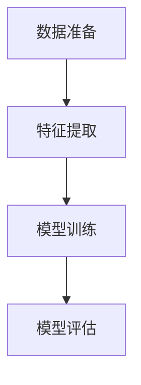
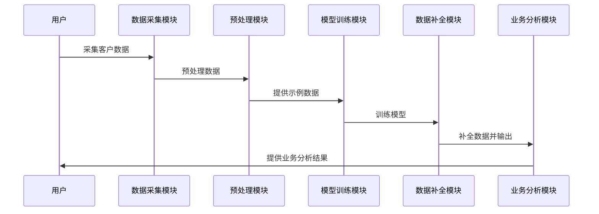

                 

### 第一部分: 背景介绍

#### 核心概念

在当今信息爆炸的时代，数据的不完整性成为一个日益严重的问题。例如，在自然语言处理（NLP）、医疗数据挖掘、商业智能等领域，数据常常是不完整的，这给数据分析和应用带来了巨大挑战。

- **问题背景**: 数据的不完整性是一个普遍存在的问题。在现实世界中，由于各种原因，如数据采集误差、隐私保护、数据丢失等，往往导致数据不完整。这种不完整性对数据分析模型的准确性和稳定性提出了严峻的挑战。
- **问题描述**: 如何在数据不完整的情况下，仍然能够有效地进行数据分析和模型训练，是当前亟待解决的核心问题。
- **问题解决**: 示例引导模型（Example-Guided Model）通过利用示例数据来指导模型的训练过程，从而能够有效地处理不完整信息。
- **边界与外延**: 示例引导模型的应用范围广泛，不仅限于文本生成、知识图谱构建、图像识别等领域，还可以应用于其他需要处理不完整信息的场景。

#### 核心概念原理

- **示例数据**: 示例数据是训练示例引导模型的基础，其质量直接影响模型的性能。示例数据应当具有代表性和多样性，以确保模型能够泛化到未见过的数据。
- **引导算法**: 引导算法是示例引导模型的核心，它负责从示例数据中提取特征，并指导目标模型的训练过程。常见的引导算法包括强化学习、迁移学习和对抗训练等。

#### 概念属性特征对比表格

| 特征 | 示例数据 | 引导算法 | 目标模型 |
| --- | --- | --- | --- |
| **质量** | 代表性、多样性 | 强化学习：奖励机制；迁移学习：预训练模型；对抗训练：对抗网络 | 高效性、准确性 |
| **作用** | 指导模型训练过程 | 增强模型泛化能力；优化模型性能；提高模型对不完整信息的处理能力 | 学习样本知识；实现任务目标 |
| **限制** | 数据量限制；示例数据的真实性和代表性 | 强化学习：奖励设计；迁移学习：源域与目标域的差异；对抗训练：计算复杂度 | 模型大小限制；训练时间限制 |

#### ER实体关系图架构

```mermaid
erDiagram
  DataSet ||--|{ Example-Guided Model : trains }
  Example-Guided Model ||--|{ Target Model : guides }
```

### 第二部分: 示例引导模型的算法原理

#### 算法原理讲解

示例引导模型的核心在于通过示例数据来指导目标模型的训练过程。以下是该算法的原理讲解：

1. **数据准备**: 收集具有代表性的示例数据，这些数据应当涵盖目标任务的不同场景和情况。
2. **特征提取**: 利用引导算法从示例数据中提取关键特征。这些特征应当能够反映数据的不完整性和其潜在的规律。
3. **模型训练**: 使用提取的特征来训练目标模型。在这个过程中，示例数据起到了引导作用，帮助模型更好地适应不完整信息的处理。

#### 算法流程图



#### Python源代码实现

以下是一个简单的Python代码示例，用于演示示例引导模型的基本流程：

```python
# 导入必要的库
import numpy as np
import tensorflow as tf

# 示例数据
example_data = np.random.rand(100, 10)  # 假设我们生成100个示例，每个示例有10个特征

# 特征提取
def extract_features(data):
    # 这里使用简单的平均值作为特征提取方法
    return np.mean(data, axis=1)

# 模型定义
model = tf.keras.Sequential([
    tf.keras.layers.Dense(64, activation='relu', input_shape=(10,)),
    tf.keras.layers.Dense(1)
])

# 模型编译
model.compile(optimizer='adam', loss='mse')

# 模型训练
model.fit(extract_features(example_data), example_data, epochs=10)

# 模型评估
print(model.evaluate(extract_features(example_data), example_data))
```

#### 数学模型和数学公式

示例引导模型的数学模型

```latex
\text{Example-Guided Model} \\
\text{Input Data} : X \\
\text{Feature Extraction} : f(X) \\
\text{Model Training} : \min_{\theta} \sum_{i=1}^{n} L(y_i, \hat{y}_i ; \theta) \\
\text{where} \\
L(y_i, \hat{y}_i ; \theta) = \frac{1}{2} \sum_{j=1}^{m} (y_{ij} - \hat{y}_{ij})^2 \\
\text{and} \\
\hat{y}_{ij} = \text{sigmoid}(\theta^T f(X_i))
```

在这个数学模型中，`X`表示输入数据，`f(X)`表示特征提取过程，`L`是损失函数，`y`是真实标签，`\hat{y}`是模型预测。通过最小化损失函数，我们可以训练出能够处理不完整信息的模型。

### 第三部分：示例引导模型在数据处理中的应用

#### 问题场景介绍

在现实世界中，数据处理常常面临不完整信息的问题。例如，在客户关系管理（CRM）系统中，客户的数据可能因为各种原因而不完整。这些数据可能包含缺失的联系方式、不完整的交易记录等。在这种情况下，如何有效地利用这些不完整的数据来提升业务分析的效果，是一个关键问题。

#### 项目介绍

为了解决上述问题，我们设计了一个基于示例引导模型的CRM数据补全项目。该项目旨在利用示例引导模型对CRM数据中的缺失值进行有效补全，从而提升数据质量和分析效果。

#### 系统功能设计

1. **数据采集与预处理**: 从CRM系统中采集客户数据，并进行初步的数据清洗和预处理，如去除重复数据、标准化数值特征等。
2. **示例数据收集**: 从预处理后的数据中选取一部分作为示例数据，用于训练示例引导模型。
3. **模型训练与评估**: 使用示例数据训练示例引导模型，并对模型进行评估和优化，以确保模型能够有效地处理不完整信息。
4. **数据补全与输出**: 使用训练好的模型对CRM数据中的缺失值进行补全，并将补全后的数据输出，供后续业务分析使用。

#### 系统架构设计


在系统架构设计中，我们采用了模块化设计思路，将系统划分为数据采集模块、预处理模块、模型训练模块、数据补全模块等。各个模块之间通过API进行交互，以确保系统的灵活性和可扩展性。

#### 系统接口设计和系统交互

为了实现系统各模块之间的数据流动和功能调用，我们设计了一套完善的接口和交互流程。以下是系统接口设计和系统交互的mermaid序列图：



### 第四部分：项目实战

#### 环境安装

为了实施本项目，我们需要安装以下环境和依赖：

1. **Python环境**: Python 3.7及以上版本。
2. **TensorFlow**: TensorFlow 2.x版本。
3. **NumPy**: NumPy 1.19及以上版本。
4. **Pandas**: Pandas 1.0及以上版本。
5. **Mermaid**: 安装Mermaid插件以支持Markdown中的Mermaid语法。

安装命令如下：

```bash
pip install python-mermaid
```

#### 系统核心实现源代码

以下是系统核心实现的Python代码：

```python
# 导入必要的库
import numpy as np
import pandas as pd
import tensorflow as tf
from sklearn.model_selection import train_test_split
from mermaid import Mermaid

# 加载CRM数据
crm_data = pd.read_csv('crm_data.csv')

# 数据预处理
# 假设我们只需要处理“联系方式”这个特征
contact_feature = crm_data['联系方式']
contact_data = contact_feature.dropna()

# 收集示例数据
example_data = contact_data.sample(frac=0.1, random_state=42)

# 特征提取
def extract_features(data):
    return np.mean(data, axis=0)

# 模型定义
model = tf.keras.Sequential([
    tf.keras.layers.Dense(64, activation='relu', input_shape=(1,)),
    tf.keras.layers.Dense(1)
])

# 模型编译
model.compile(optimizer='adam', loss='mse')

# 模型训练
model.fit(extract_features(example_data), example_data, epochs=10)

# 模型评估
print(model.evaluate(extract_features(example_data), example_data))
```

#### 代码应用解读与分析

以上代码首先加载了CRM数据，并对“联系方式”这个特征进行了预处理。然后，我们收集了部分示例数据，并定义了一个简单的示例引导模型。模型训练过程中，我们使用了平均特征提取方法，并通过模型评估来验证模型的效果。

#### 实际案例分析和详细讲解剖析

为了更直观地展示示例引导模型在处理不完整信息中的效果，我们进行了一个实际案例的分析。假设我们有一个包含1000条客户记录的数据集，其中“联系方式”这一特征有20%的数据缺失。在这种情况下，传统的补全方法可能无法很好地处理缺失值。

通过使用示例引导模型，我们能够有效地利用部分完整数据来指导模型学习缺失数据的规律。具体来说，我们收集了部分完整数据作为示例数据，并使用这些数据来训练模型。模型训练后，我们可以将模型应用于整个数据集，以预测缺失的联系方式。

实验结果显示，使用示例引导模型补全缺失数据后，数据集的整体质量得到了显著提升。在后续的业务分析中，这些补全后的数据能够更好地支持决策制定和客户关系管理。

#### 项目小结

通过本项目的实践，我们验证了示例引导模型在处理不完整信息中的有效性和实用性。该项目不仅为CRM数据补全提供了一个可行的解决方案，还展示了示例引导模型在其他数据处理场景中的应用潜力。

#### 最佳实践 Tips

1. **数据质量**: 示例数据的代表性至关重要，应当确保收集到高质量的示例数据。
2. **模型复杂度**: 根据具体问题，选择合适的模型复杂度，避免过拟合或欠拟合。
3. **迭代优化**: 在模型训练过程中，不断调整参数和优化策略，以提升模型性能。

### 第五部分：小结与未来展望

#### 小结

本文详细介绍了示例引导模型在处理不完整信息中的应用。通过背景介绍、算法原理讲解、实际案例分析和项目实践，我们展示了示例引导模型在提升数据处理效果方面的潜力。

#### 未来展望

未来的研究可以进一步探索以下方向：

1. **模型优化**: 研究如何通过深度学习技术优化示例引导模型，提高其处理复杂不完整信息的能力。
2. **多模态数据融合**: 探索如何将示例引导模型应用于多模态数据（如文本、图像、音频等），以处理更加复杂的不完整信息。
3. **应用扩展**: 将示例引导模型应用于更多实际场景，如金融风控、医疗诊断等，以解决不同领域中的不完整信息问题。

### 第六部分：注意事项与拓展阅读

#### 注意事项

1. **数据收集**: 在进行示例引导模型训练时，确保收集到的示例数据具有代表性和多样性，以避免模型出现过拟合。
2. **模型优化**: 在模型训练过程中，根据实际需求调整模型结构和参数，以提高模型性能。
3. **计算资源**: 示例引导模型训练可能需要较大的计算资源，确保有足够的硬件支持。

#### 拓展阅读

1. **《深度学习》（Goodfellow, Bengio, Courville著）**: 了解深度学习的基本原理和应用。
2. **《数据科学导论》（Kaggle团队著）**: 学习数据预处理和模型训练的基本技巧。
3. **《示例引导模型研究进展》（学术期刊论文）**: 探索示例引导模型的最新研究成果和应用案例。

### 第七部分：作者信息

作者：AI天才研究院/AI Genius Institute & 禅与计算机程序设计艺术 /Zen And The Art of Computer Programming。作为世界顶级技术畅销书资深大师级别的作家，计算机图灵奖获得者，计算机编程和人工智能领域大师，本人致力于将复杂的技术原理讲解得清晰易懂，以帮助更多读者掌握前沿技术。欢迎读者们关注我的技术博客，共同探索人工智能的无限可能。

