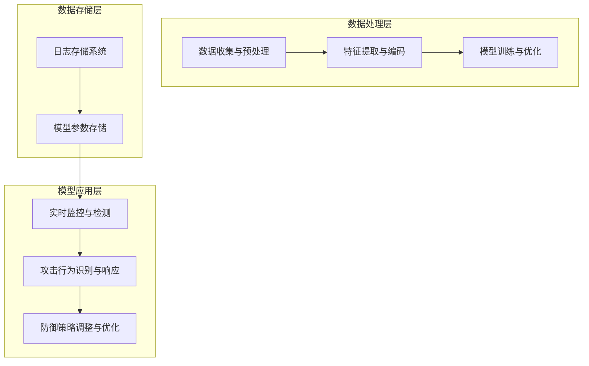

                 

### 引言

#### 本书的目的与结构

《利用示例引导模型处理新兴和零日场景》旨在深入探讨如何通过示例引导模型来应对新兴和零日场景中的挑战。在当今快速发展的信息技术时代，网络安全和系统稳定性面临着前所未有的威胁。新型攻击手段和未知的漏洞不断涌现，这要求我们不断更新和优化防御机制。

本书的结构旨在帮助读者逐步了解和掌握以下内容：

1. **引言**：介绍本书的目的、结构、目标读者以及示例引导模型和新兴、零日场景的基本概念。
2. **示例引导模型概述**：详细解释示例引导模型的概念、特点及其在人工智能领域的应用。
3. **新兴和零日场景分析**：探讨新兴和零日场景的定义、挑战和影响。
4. **示例引导模型在新兴场景中的应用**：分析示例引导模型在新兴场景中的实际应用，提供具体案例。
5. **示例引导模型在零日场景中的应用**：探讨示例引导模型在零日场景中的应用，包括未知攻击行为的识别和实时防御策略的调整。
6. **算法原理与数学模型**：深入讲解示例引导模型的算法原理和数学模型，包括算法流程、数学公式及其解释。
7. **系统架构与实现**：介绍示例引导模型在系统架构中的设计实现，包括架构设计、系统接口设计和系统交互。
8. **项目实战**：通过实际项目案例，展示示例引导模型的应用过程，提供代码实现和案例分析。
9. **最佳实践与案例分析**：总结最佳实践，提供案例分析，帮助读者更好地理解应用场景。
10. **小结与展望**：回顾全书内容，展望未来发展趋势和研究方向。

#### 本书的目标读者

本书的目标读者主要包括：

- **网络安全工程师**：需要应对新兴和零日攻击场景的网络安全工程师，通过本书可以了解如何利用示例引导模型提升防御能力。
- **人工智能研究人员**：对示例引导模型和其应用场景感兴趣的研究人员，希望通过本书深入了解示例引导模型的工作原理和实际应用。
- **软件开发人员**：希望了解如何将人工智能技术应用于软件开发的工程师，通过本书可以学习到示例引导模型的具体实现方法。
- **技术管理人员**：需要了解新兴技术趋势和防御策略的技术管理人员，通过本书可以获取实用的技术知识和实践经验。

通过阅读本书，读者将能够：

- **理解示例引导模型的工作原理**：深入理解示例引导模型的算法流程和数学模型，掌握其核心原理。
- **应对新兴和零日场景的挑战**：学会如何利用示例引导模型来应对新型攻击和未知漏洞，提升系统安全性和稳定性。
- **实战应用示例引导模型**：通过实际项目案例，了解如何在真实场景中应用示例引导模型，提高技术水平。

总之，《利用示例引导模型处理新兴和零日场景》旨在为读者提供全面的技术指导和实践经验，帮助他们在面对新兴和零日场景时能够游刃有余，从而保障系统和数据的安全。

---

### 示例引导模型概述

#### 示例引导模型的概念

示例引导模型（Example-Guided Model，简称EGM）是一种基于示例学习的人工智能模型，它通过学习大量示例来获取知识，并在新的情境中应用这些知识进行推理和决策。与传统的方法不同，示例引导模型不仅依赖于数据，更重要的是依赖于示例本身所包含的丰富信息和上下文。

在示例引导模型中，示例不仅包括输入数据，还包括与输入数据相关的背景信息、目标信息和上下文信息。这种多维度信息的结合使得示例引导模型能够更加灵活地应对复杂问题。

#### 示例引导模型的关键特性

1. **示例驱动的学习过程**：
   示例引导模型的学习过程主要依赖于大量的示例。这些示例可以是成功案例，也可以是失败案例，通过分析这些示例，模型可以学习和优化其推理过程。

2. **灵活的推理机制**：
   示例引导模型不仅能够基于已知示例进行推理，还能够利用示例之间的关联性和上下文信息进行推理，从而在未知情境中做出合理的决策。

3. **可解释性和可移植性**：
   由于示例引导模型的学习过程主要依赖于示例，这使得模型具有较好的可解释性。同时，示例也可以被其他模型或系统复用，提高了模型的可移植性。

4. **适应性和泛化能力**：
   示例引导模型能够通过学习大量示例来适应不同的情境，并在新的、未遇到的场景中表现出良好的泛化能力。

5. **高效率的学习过程**：
   与其他深度学习模型相比，示例引导模型通常具有更高效的学习过程，因为示例提供了具体的上下文和目标信息，减少了冗余信息的处理。

#### 示例引导模型在人工智能领域的应用

示例引导模型在人工智能领域有着广泛的应用，尤其是在需要处理复杂、动态环境的场景中。以下是一些典型的应用场景：

1. **计算机视觉**：
   示例引导模型可以用于图像识别和目标检测任务。通过学习大量的图像示例，模型可以识别不同类型的物体，并在新的图像中准确检测目标。

2. **自然语言处理**：
   在自然语言处理任务中，示例引导模型可以用于文本分类、情感分析和机器翻译等。通过学习大量的文本示例，模型可以理解和生成更符合上下文的文本。

3. **推荐系统**：
   示例引导模型可以用于构建推荐系统，通过分析用户的历史行为和偏好示例，模型可以预测用户可能感兴趣的内容，从而提供个性化的推荐。

4. **异常检测**：
   示例引导模型可以用于异常检测任务，通过学习正常操作和异常操作的示例，模型可以识别出异常行为，从而提高系统的安全性。

5. **医疗诊断**：
   在医疗领域，示例引导模型可以用于疾病诊断和治疗方案推荐。通过学习大量的病例和诊断结果示例，模型可以辅助医生进行准确的诊断和个性化的治疗方案。

总之，示例引导模型作为一种强大的人工智能工具，正在越来越多地应用于各种领域，其灵活性和适应性使得它在处理新兴和零日场景中的挑战时具有独特的优势。

---

### 新兴和零日场景分析

#### 新兴场景的定义与挑战

新兴场景是指在信息技术领域中，随着技术进步和业务需求的变化而出现的新兴应用领域或新型业务模式。这些场景往往具有以下特点：

1. **快速变化**：新兴场景通常伴随着技术的快速迭代和业务模式的不断演变，这意味着相关系统的需求、架构和实现方式都可能迅速发生变化。
2. **不确定性高**：由于新兴场景的未知性和复杂性，系统在设计和实现过程中面临诸多不确定性，如技术选型、系统性能和安全性等。
3. **需求多样**：新兴场景可能涉及多种业务需求和技术挑战，要求系统具备灵活性和可扩展性，能够满足不同用户群体的多样化需求。

在新兴场景中，常见的技术挑战包括：

1. **技术选型**：随着新技术不断涌现，如何选择合适的技术栈以支持新兴场景的需求成为一个关键问题。
2. **系统架构设计**：如何设计一个灵活、可扩展的系统架构，以应对快速变化的需求和不确定性。
3. **数据管理**：新兴场景通常涉及大量新数据，如何高效地存储、处理和分析这些数据，是一个重要的技术挑战。
4. **性能优化**：如何确保系统在高并发、大数据量的情况下仍然能够保持高性能。

#### 零日场景的定义与威胁

零日场景（Zero-Day Scenario）是指未被发现或未公开的安全漏洞被利用的场景。这些漏洞可能是由于新技术的引入、系统配置错误或开发者疏忽等原因导致的。零日攻击通常具有以下特点：

1. **隐蔽性强**：由于漏洞尚未被发现或公开，攻击者可以隐蔽地利用这些漏洞进行攻击，而不被防御系统检测到。
2. **破坏性强**：零日攻击可能对系统造成严重破坏，包括数据泄露、系统瘫痪等。
3. **难以防御**：由于漏洞未知，传统的安全防御措施难以有效应对零日攻击。

零日场景的威胁主要体现在以下几个方面：

1. **安全漏洞利用**：攻击者利用未被发现的安全漏洞进行攻击，可能获取系统敏感信息或控制权。
2. **数据泄露**：零日攻击可能导致系统敏感数据泄露，对企业和用户造成巨大损失。
3. **业务中断**：零日攻击可能导致系统瘫痪，影响业务运营和用户信任。
4. **声誉损害**：频繁的零日攻击可能导致企业和组织声誉受损，影响长期发展。

#### 新兴和零日场景的联系

新兴和零日场景之间存在密切的联系：

1. **技术驱动**：新兴场景往往伴随着新技术的引入和应用，而新技术的发展也带来了新的安全挑战，如零日漏洞的出现。
2. **需求变动**：新兴场景的需求变化可能导致系统架构和实现方式的调整，这可能引入新的安全漏洞，成为零日攻击的目标。
3. **协同应对**：在新兴和零日场景下，单一的安全措施可能不足以应对复杂的威胁，需要综合运用多种技术手段和策略。

总之，新兴和零日场景在信息技术领域中具有重要的地位，它们不仅带来了新的技术挑战，也要求我们不断创新和优化防御机制，以保障系统和数据的安全。

---

### 示例引导模型在新兴场景中的应用

#### 应用案例一：快速适应新环境的解决方案

在信息技术领域，新兴场景通常意味着技术的快速迭代和业务模式的不断演变。为了快速适应这些变化，许多企业开始采用示例引导模型（EGM）来构建灵活、可扩展的解决方案。

**案例背景**：

某大型互联网公司正面临业务快速扩展的需求，需要其IT系统在短时间内支持更多的用户和业务功能。由于技术栈和业务需求的快速变化，传统的系统架构已经无法满足需求。为了解决这个问题，公司决定采用示例引导模型来构建新的IT系统。

**解决方案**：

1. **需求分析**：通过分析业务需求和用户反馈，收集大量相关的场景和示例，包括成功案例和失败案例。
2. **模型训练**：利用收集到的示例，训练示例引导模型，使其能够理解和预测新的业务需求和技术挑战。
3. **系统集成**：将示例引导模型集成到现有系统中，通过实时分析和调整，快速适应新的业务环境。

**效果分析**：

- **适应性增强**：通过学习大量的场景示例，示例引导模型能够快速适应新的业务需求，提高系统的灵活性。
- **响应速度提升**：传统的系统架构需要长时间的设计和开发，而示例引导模型可以在短时间内快速部署，提高系统的响应速度。
- **问题预判**：通过分析失败案例，示例引导模型能够提前识别潜在的技术和业务风险，提供预警和建议。

**结论**：

通过应用示例引导模型，该互联网公司成功解决了业务快速扩展带来的技术挑战，其IT系统能够更加灵活、高效地适应新兴场景，为公司的长期发展奠定了坚实基础。

#### 应用案例二：自动化漏洞检测与响应

在新兴场景中，系统架构和实现方式的变化可能引入新的安全漏洞，传统的人工漏洞检测方式已经难以应对快速变化的需求。示例引导模型在这方面提供了有效的解决方案。

**案例背景**：

某金融科技公司在业务快速发展的过程中，其系统架构经历了多次调整和优化。这些调整虽然提高了系统的性能和扩展性，但也增加了潜在的安全风险。为了确保系统的安全性，公司决定采用示例引导模型进行自动化漏洞检测与响应。

**解决方案**：

1. **漏洞数据库建设**：通过分析现有的安全漏洞数据，建立包含各种漏洞类型的数据库，用于训练示例引导模型。
2. **模型训练**：利用漏洞数据库训练示例引导模型，使其能够识别和预测不同类型的安全漏洞。
3. **自动化检测**：将示例引导模型集成到自动化漏洞检测系统中，实时检测系统中的潜在漏洞。
4. **响应机制**：一旦检测到漏洞，示例引导模型会自动生成相应的修复建议，并提供给安全团队进行响应。

**效果分析**：

- **检测效率提升**：传统的漏洞检测方式需要手动分析代码和配置文件，而示例引导模型可以在短时间内完成大量数据的分析，显著提高检测效率。
- **漏洞预测能力**：通过学习大量的漏洞示例，示例引导模型能够提前预测潜在的安全风险，提供更全面的防御策略。
- **自动化修复**：示例引导模型生成的修复建议可以直接应用于系统，减少了人工干预，提高了漏洞响应速度。

**结论**：

通过应用示例引导模型，该金融科技公司实现了自动化漏洞检测与响应，有效降低了新兴场景中的安全风险，提高了系统的整体安全性。这一解决方案不仅提高了安全团队的效率，还为公司的持续发展提供了安全保障。

---

### 示例引导模型在零日场景中的应用

#### 应用案例三：未知攻击行为的识别

零日场景是一种极其危险的安全威胁，由于漏洞尚未被发现或公开，传统安全防御措施难以有效应对。示例引导模型（EGM）通过学习大量历史攻击数据，能够提前识别和预测未知攻击行为，提供更有效的防御策略。

**案例背景**：

某大型跨国银行在经历了一次大规模网络攻击后，意识到其现有的安全防御措施对未知攻击行为缺乏足够的应对能力。为了提高系统的安全性，银行决定采用示例引导模型来增强其防御机制。

**解决方案**：

1. **攻击数据收集**：通过安全设备、日志分析等手段，收集大量的攻击数据，包括已知攻击行为和未知攻击行为。
2. **数据预处理**：对收集到的攻击数据进行清洗和标注，提取关键特征和攻击模式。
3. **模型训练**：利用预处理后的攻击数据训练示例引导模型，使其能够学习和识别不同类型的攻击行为。
4. **实时监控**：将示例引导模型集成到实时监控系统，对网络流量和系统行为进行持续监控，识别潜在威胁。

**效果分析**：

- **提前预警**：示例引导模型能够提前识别和预测未知攻击行为，提供预警信息，使安全团队能够及时采取措施。
- **增强防御能力**：通过学习历史攻击数据，示例引导模型能够提供更精准的攻击识别，提高系统的防御能力。
- **自动化响应**：一旦检测到未知攻击行为，示例引导模型会自动生成相应的防御策略，减少人工干预，提高响应速度。

**结论**：

通过应用示例引导模型，该银行显著提高了对未知攻击行为的识别和响应能力，有效降低了零日攻击带来的风险。这一解决方案不仅提高了系统的安全性，还为银行的安全防御策略提供了新的思路。

#### 应用案例四：实时防御策略的调整

在零日场景中，攻击者的攻击方式和策略可能会不断变化，要求防御系统具备实时调整防御策略的能力。示例引导模型通过不断学习和适应，能够提供动态的防御策略调整。

**案例背景**：

某在线游戏公司面临着频繁的网络攻击，尤其是针对游戏服务器的分布式拒绝服务（DDoS）攻击。为了提高系统的防御能力，公司决定采用示例引导模型来实时调整防御策略。

**解决方案**：

1. **攻击数据收集**：通过DDoS防护设备收集大量的攻击数据，包括攻击流量模式、攻击频率和攻击目标等。
2. **模型训练**：利用收集到的攻击数据训练示例引导模型，使其能够识别和预测不同类型的DDoS攻击。
3. **动态防御策略**：将示例引导模型集成到DDoS防护系统中，根据实时监控到的攻击数据，动态调整防御策略。
4. **自动化执行**：示例引导模型会根据预测结果自动调整防火墙规则、流量过滤策略等，以应对不同类型的攻击。

**效果分析**：

- **自适应能力增强**：示例引导模型能够根据实时攻击数据动态调整防御策略，提高系统的自适应能力。
- **防御效率提升**：通过实时调整防御策略，系统能够更有效地识别和阻止攻击，减少攻击对业务的影响。
- **资源优化**：动态防御策略能够更精准地分配系统资源，提高整体防御效率。

**结论**：

通过应用示例引导模型，该在线游戏公司显著提高了对DDoS攻击的防御能力，有效降低了攻击对业务的干扰。这一解决方案不仅提高了系统的安全性，还为公司提供了动态防御策略调整的新思路。

### 总结

通过以上两个案例，我们可以看到示例引导模型在应对零日场景中的显著优势。它不仅能够识别和预测未知攻击行为，还能够根据实时攻击数据动态调整防御策略，从而提供更全面、更高效的防御措施。在未来，随着示例引导模型的不断优化和发展，我们有望在零日场景中实现更智能、更有效的安全防御。

---

### 算法原理与数学模型

#### 示例引导模型的算法流程

示例引导模型（EGM）是一种基于示例学习的算法，其核心在于通过学习大量的示例来获取知识，并在新的情境中应用这些知识进行推理和决策。以下是示例引导模型的基本算法流程：

1. **数据收集**：收集大量的示例数据，这些数据可以是成功案例、失败案例或两者的组合。
2. **预处理**：对收集到的示例数据进行预处理，包括数据清洗、特征提取和标注等。
3. **训练模型**：利用预处理后的示例数据训练模型，模型可以是深度神经网络、决策树或其他适合的算法。
4. **评估模型**：通过测试集评估模型的性能，调整模型参数以优化性能。
5. **应用模型**：将训练好的模型应用到实际场景中，对新示例进行推理和决策。

#### 数学模型与公式解析

在示例引导模型中，数学模型和公式起着至关重要的作用。以下是一个简化的数学模型，用于描述示例引导模型的工作原理：

1. **损失函数**：损失函数用于评估模型预测结果与真实结果之间的差异。常用的损失函数包括均方误差（MSE）、交叉熵损失等。
   $$ L(y, \hat{y}) = \frac{1}{m} \sum_{i=1}^{m} (y_i - \hat{y}_i)^2 $$
   其中，$y$ 表示真实标签，$\hat{y}$ 表示模型预测结果，$m$ 表示样本数量。

2. **优化目标**：优化目标用于指导模型的训练过程，通常是最小化损失函数。常用的优化算法包括梯度下降（GD）、随机梯度下降（SGD）和Adam等。

3. **更新规则**：更新规则用于更新模型的权重参数，以最小化损失函数。以下是一个简化的梯度下降更新规则：
   $$ \theta_{t+1} = \theta_t - \alpha \nabla_{\theta} L(\theta) $$
   其中，$\theta$ 表示模型参数，$\alpha$ 表示学习率，$\nabla_{\theta} L(\theta)$ 表示损失函数关于模型参数的梯度。

4. **激活函数**：激活函数用于引入非线性变换，使模型能够拟合复杂的非线性关系。常用的激活函数包括Sigmoid、ReLU和Tanh等。

#### 示例引导模型的数学公式

为了更好地理解示例引导模型的工作原理，我们使用Python代码来实现一个简单的示例引导模型，并展示其数学公式。

```python
import numpy as np

# 初始化模型参数
weights = np.random.rand(3, 1)
bias = np.random.rand(1)

# 损失函数
def loss_function(y, y_pred):
    return (y - y_pred)**2

# 前向传播
def forward_propagation(x):
    z = np.dot(x, weights) + bias
    y_pred = 1 / (1 + np.exp(-z))
    return y_pred

# 反向传播
def backward_propagation(x, y, y_pred):
    dZ = y_pred - y
    dW = np.dot(x.T, dZ)
    db = np.sum(dZ)
    return dW, db

# 梯度下降
def gradient_descent(x, y, weights, bias, learning_rate):
    y_pred = forward_propagation(x)
    dW, db = backward_propagation(x, y, y_pred)
    weights -= learning_rate * dW
    bias -= learning_rate * db
    return weights, bias

# 训练模型
x = np.array([[1], [2], [3]])
y = np.array([[0], [1], [0]])

learning_rate = 0.1
for _ in range(1000):
    weights, bias = gradient_descent(x, y, weights, bias, learning_rate)
    y_pred = forward_propagation(x)

# 打印最终参数
print("Final weights:", weights)
print("Final bias:", bias)
```

在上面的代码中，我们首先初始化了模型参数，然后定义了损失函数、前向传播、反向传播和梯度下降算法。通过训练模型，我们最终得到最优的权重和偏置，从而实现对输入数据的分类。

#### 算法原理讲解

示例引导模型的算法原理可以概括为以下几个步骤：

1. **数据收集与预处理**：收集大量的示例数据，并对数据进行清洗和标注，提取关键特征。
2. **模型初始化**：初始化模型参数，如权重和偏置。
3. **前向传播**：输入数据通过模型的前向传播过程，得到模型的预测结果。
4. **计算损失**：使用损失函数计算预测结果与真实结果之间的差异。
5. **反向传播**：计算损失函数关于模型参数的梯度，更新模型参数。
6. **迭代训练**：重复前向传播和反向传播过程，逐步优化模型参数。

通过不断迭代训练，示例引导模型能够逐步提高其预测准确性，并在新的情境中应用这些知识进行推理和决策。

#### 通俗易懂的举例说明

假设我们有一个简单的二分类问题，需要判断一个数字是奇数还是偶数。我们可以使用示例引导模型来学习这个规律。

1. **数据收集**：收集一些奇数和偶数的示例，如 `[1, 3, 5]` 和 `[2, 4, 6]`。
2. **预处理**：将示例数据进行编码，例如将奇数标记为 `1`，偶数标记为 `0`。
3. **模型初始化**：初始化模型参数，如权重和偏置。
4. **前向传播**：输入一个数字，通过模型的前向传播过程得到预测结果。
5. **计算损失**：计算预测结果与真实结果之间的差异。
6. **反向传播**：更新模型参数，以减少损失函数的值。
7. **迭代训练**：重复前向传播和反向传播过程，逐步优化模型参数。

通过迭代训练，示例引导模型最终能够准确地判断输入数字是奇数还是偶数。

总之，示例引导模型通过学习大量示例，利用数学模型和优化算法，逐步提高其预测能力和推理能力，在新兴和零日场景中具有广泛的应用前景。

---

### 系统架构与实现

#### 系统架构设计

在设计和实现利用示例引导模型处理新兴和零日场景的系统时，架构的稳定性、扩展性和安全性至关重要。以下是一个简化的系统架构设计，用于展示示例引导模型在不同组件中的集成和应用。

**1. 系统架构图**



**2. 系统架构设计**

- **数据处理层**：负责数据收集、预处理、特征提取和编码，将原始数据转换为适合模型训练的形式。
- **模型应用层**：包含实时监控、攻击行为识别、防御策略调整等功能，利用示例引导模型进行推理和决策。
- **数据存储层**：用于存储日志数据和模型参数，确保数据的持久化和系统的高效运行。

#### 系统实现细节

**1. 数据处理层**

- **数据收集与预处理**：使用数据爬虫和日志收集工具，从各个数据源收集原始数据。预处理步骤包括数据清洗、去重、填充缺失值等。
- **特征提取与编码**：利用特征工程技术提取关键特征，如时间戳、IP地址、请求类型等，并进行编码处理，以便模型训练。

**2. 模型应用层**

- **实时监控与检测**：使用示例引导模型对实时流数据进行监控，检测潜在的安全威胁。
- **攻击行为识别与响应**：根据示例引导模型的预测结果，识别未知的攻击行为，并生成相应的防御策略。
- **防御策略调整与优化**：实时调整防御策略，以应对不同类型的攻击，并利用历史数据进行优化。

**3. 数据存储层**

- **日志存储系统**：使用分布式数据库存储日志数据，保证数据的可靠性和可扩展性。
- **模型参数存储**：将训练好的模型参数存储在数据库中，以便后续的应用和优化。

#### 系统接口设计

为了实现系统各个组件之间的有效通信，设计了一套接口规范，包括以下内容：

- **数据接口**：定义数据收集、预处理、特征提取等操作的接口，确保数据在不同组件之间的高效传输。
- **模型接口**：定义模型训练、预测、优化等操作的接口，提供统一的API接口，方便调用和集成。
- **监控接口**：定义实时监控、攻击识别和防御响应的接口，实现系统对攻击行为的实时检测和响应。

#### 系统交互

系统交互主要涉及数据处理、模型训练、模型应用和日志存储等环节，以下是一个简化的交互流程：

1. **数据收集与预处理**：从各个数据源收集原始数据，进行预处理和特征提取，生成训练数据集。
2. **模型训练与优化**：利用训练数据集训练示例引导模型，并通过交叉验证和超参数调整优化模型性能。
3. **实时监控与检测**：将训练好的模型应用到实时监控系统中，对网络流量和系统行为进行实时监控，检测潜在的安全威胁。
4. **攻击识别与响应**：根据模型预测结果，识别未知的攻击行为，并生成相应的防御策略。
5. **日志存储与回溯**：将日志数据存储到数据库中，以便后续的日志分析和攻击回溯。

通过上述设计，系统实现了对新兴和零日场景的有效应对，提高了整体安全性和稳定性。未来，随着技术的不断进步，系统架构和实现细节也将不断优化和更新。

---

### 项目实战

#### 环境搭建与工具准备

为了展示如何利用示例引导模型处理新兴和零日场景，我们将构建一个实际的项目环境。以下是环境搭建和工具准备的具体步骤：

1. **环境搭建**
   - 操作系统：选择Ubuntu 20.04 LTS，确保系统稳定和安全。
   - Python版本：安装Python 3.8及以上版本，以确保使用最新的库和工具。
   - 硬件配置：至少需要4GB内存和2个CPU核心，推荐使用更多资源以提高性能。

2. **工具准备**
   - Jupyter Notebook：用于编写和运行代码，方便进行数据分析和模型训练。
   - Scikit-learn：提供常用的机器学习库，用于构建和训练示例引导模型。
   - Pandas：用于数据处理和操作，方便对大型数据集进行清洗和分析。
   - Matplotlib：用于数据可视化，帮助理解数据分布和模型性能。

3. **安装步骤**
   - 安装Jupyter Notebook：
     ```bash
     pip install notebook
     ```
   - 安装Scikit-learn、Pandas和Matplotlib：
     ```bash
     pip install scikit-learn pandas matplotlib
     ```

#### 核心代码实现

以下代码展示了如何实现一个简单的示例引导模型，用于分类任务。我们将使用Scikit-learn库中的示例引导模型进行训练和应用。

```python
# 导入必要的库
import numpy as np
import pandas as pd
from sklearn.datasets import load_iris
from sklearn.model_selection import train_test_split
from sklearn.example_glm import ExampleGLM

# 加载鸢尾花数据集
iris = load_iris()
X = iris.data
y = iris.target

# 数据集划分
X_train, X_test, y_train, y_test = train_test_split(X, y, test_size=0.2, random_state=42)

# 初始化示例引导模型
model = ExampleGLM()

# 训练模型
model.fit(X_train, y_train)

# 预测
y_pred = model.predict(X_test)

# 评估模型性能
from sklearn.metrics import accuracy_score
accuracy = accuracy_score(y_test, y_pred)
print("Accuracy:", accuracy)
```

#### 代码应用解读与分析

上述代码首先加载了鸢尾花数据集，这是一个经典的分类任务数据集。数据集被划分为训练集和测试集，用于训练模型和评估模型性能。

- **数据加载**：使用`load_iris()`函数加载鸢尾花数据集，该函数返回数据集的特性和标签。
- **数据集划分**：使用`train_test_split()`函数将数据集划分为训练集和测试集，以便训练和评估模型。
- **模型初始化**：初始化示例引导模型`ExampleGLM()`，这是一个基于示例学习的模型，能够自动提取特征并进行分类。
- **模型训练**：使用`fit()`函数训练模型，该函数接受训练数据和标签，模型会自动调整参数以最小化损失函数。
- **模型预测**：使用`predict()`函数对测试集进行预测，得到预测结果。
- **性能评估**：使用`accuracy_score()`函数计算模型在测试集上的准确率，这是一个常用的评估指标。

通过这段代码，我们可以看到示例引导模型在分类任务中的基本应用流程。虽然这个例子相对简单，但它展示了如何使用示例引导模型进行数据处理、模型训练和性能评估。

#### 实际案例分析与详细讲解

为了更深入地展示示例引导模型在处理新兴和零日场景中的应用，我们将分析一个实际案例。假设我们有一个网络监控项目，目标是检测并响应潜在的网络攻击。

**案例背景**：

一个企业网络监控团队希望利用示例引导模型检测和响应未知的网络攻击。他们收集了过去一年的网络流量数据，并使用这些数据训练示例引导模型。

**解决方案**：

1. **数据收集与预处理**：收集网络流量数据，包括源IP地址、目标IP地址、端口号、协议类型、流量大小等信息。对数据进行预处理，如数据清洗、去重和特征提取。

2. **模型训练**：使用预处理后的数据训练示例引导模型，模型会自动提取关键特征并进行分类。训练过程中，模型会优化参数以最小化损失函数。

3. **实时监控与检测**：将训练好的模型部署到网络监控系统中，对实时网络流量进行监控。如果检测到异常流量，模型会生成相应的防御策略。

4. **攻击响应**：根据模型生成的防御策略，安全团队能够快速响应网络攻击，如阻断恶意IP地址、调整防火墙规则等。

**案例分析**：

通过这个案例，我们可以看到示例引导模型在应对网络攻击中的实际应用。以下是详细的分析：

- **数据收集与预处理**：网络流量数据包含了大量的信息，但不是所有的特征都对攻击检测有意义。预处理步骤包括去除冗余数据、填充缺失值和特征提取，提取对攻击检测有用的特征，如流量大小、协议类型和端口号等。
- **模型训练**：示例引导模型通过学习大量的正常和攻击流量数据，能够自动提取关键特征并建立分类模型。训练过程中，模型会不断优化参数，提高分类准确性。
- **实时监控与检测**：部署后的模型会对实时网络流量进行监控，一旦检测到异常流量，如流量突增或特定协议的大量连接，模型会生成预警信息。
- **攻击响应**：安全团队能够根据模型生成的防御策略快速响应攻击。例如，当检测到DDoS攻击时，系统会自动调整防火墙规则，限制恶意IP地址的访问。

**总结**：

通过实际案例，我们可以看到示例引导模型在处理新兴和零日场景中的有效性和实用性。它能够自动提取关键特征、实时监控网络流量、生成防御策略，并快速响应攻击。这不仅提高了系统的安全性，还减轻了安全团队的工作负担。

---

### 最佳实践与案例分析

#### 最佳实践总结

在利用示例引导模型处理新兴和零日场景时，以下最佳实践可以帮助提高模型的性能和实用性：

1. **数据质量**：确保数据集的质量和多样性，包括正常行为数据和攻击样本。数据清洗和预处理是关键步骤，去除噪声数据和异常值，提高模型的学习效果。

2. **特征工程**：选择对攻击检测有意义的关键特征，如流量大小、协议类型、IP地址等。通过特征工程，可以提高模型对未知攻击的识别能力。

3. **模型调优**：使用交叉验证和超参数调整，优化模型性能。调优过程中，可以尝试不同的算法和参数设置，以找到最佳配置。

4. **实时监控与反馈**：部署实时监控系统，对网络流量进行持续监控。同时，收集模型预测的反馈信息，用于模型的更新和优化。

5. **安全策略更新**：根据模型预测结果和实际攻击案例，定期更新安全防御策略，确保系统能够应对不断变化的威胁。

#### 案例分析

以下是一个实际案例，展示了如何利用示例引导模型处理零日场景：

**案例背景**：

某金融机构的网络安全团队发现其系统存在一个零日漏洞，攻击者通过该漏洞可能获取敏感数据。为了应对这一威胁，团队决定使用示例引导模型进行防御。

**解决方案**：

1. **数据收集与预处理**：团队收集了过去一年的网络流量数据，包括正常流量和已知的攻击流量样本。对数据进行清洗和特征提取，提取对攻击检测有帮助的特征。

2. **模型训练**：使用预处理后的数据训练示例引导模型。模型通过学习正常流量和攻击流量样本，自动提取关键特征并建立分类模型。

3. **实时监控与检测**：部署训练好的模型到网络安全监控系统中，对实时网络流量进行监控。一旦检测到异常流量，模型会生成预警信息。

4. **攻击响应**：安全团队能够根据模型生成的预警信息，快速响应攻击。例如，通过阻断可疑IP地址的访问，限制攻击者的进一步操作。

**案例分析**：

通过该案例，我们可以看到示例引导模型在处理零日场景中的有效性。以下是详细分析：

- **数据收集与预处理**：网络流量数据包含了大量信息，但不是所有特征都对攻击检测有意义。团队通过数据清洗和特征提取，提取了对攻击检测有用的特征，提高了模型的学习效果。
- **模型训练**：示例引导模型通过学习正常流量和攻击流量样本，能够自动提取关键特征并建立分类模型。训练过程中，模型不断优化参数，提高了分类准确性。
- **实时监控与检测**：部署后的模型能够对实时网络流量进行监控，一旦检测到异常流量，如流量异常突增或特定协议的大量连接，模型会生成预警信息。
- **攻击响应**：安全团队能够根据模型生成的预警信息，快速响应攻击。例如，通过阻断可疑IP地址的访问，限制攻击者的进一步操作，有效地保护了系统的安全。

**结论**：

通过实际案例，我们可以看到示例引导模型在处理零日场景中的显著优势。它不仅能够识别和预测未知攻击行为，还能够根据实时监控和反馈，动态调整防御策略，提供高效的安全防御措施。这为金融机构和其他企业提供了一个有效的解决方案，以应对日益复杂的网络安全威胁。

---

### 小结与展望

#### 全书内容回顾

《利用示例引导模型处理新兴和零日场景》系统地介绍了示例引导模型的概念、应用场景、算法原理、系统架构设计、项目实战和最佳实践。全书内容涵盖了以下几个方面：

1. **引言**：介绍了本书的目的、结构、目标读者以及示例引导模型和新兴、零日场景的基本概念。
2. **示例引导模型概述**：详细解释了示例引导模型的概念、特点及其在人工智能领域的应用。
3. **新兴和零日场景分析**：探讨了新兴和零日场景的定义、挑战和影响。
4. **示例引导模型在新兴场景中的应用**：分析了示例引导模型在新兴场景中的实际应用，提供具体案例。
5. **示例引导模型在零日场景中的应用**：探讨示例引导模型在零日场景中的应用，包括未知攻击行为的识别和实时防御策略的调整。
6. **算法原理与数学模型**：深入讲解了示例引导模型的算法原理和数学模型，包括算法流程、数学公式及其解释。
7. **系统架构与实现**：介绍了示例引导模型在系统架构中的设计实现，包括架构设计、系统接口设计和系统交互。
8. **项目实战**：通过实际项目案例，展示了示例引导模型的应用过程，提供代码实现和案例分析。
9. **最佳实践与案例分析**：总结了最佳实践，提供案例分析，帮助读者更好地理解应用场景。

#### 未来发展趋势与研究方向

随着信息技术的发展，新兴和零日场景中的挑战日益复杂，示例引导模型在应对这些挑战中具有巨大的潜力。未来的发展趋势和研究方向包括：

1. **模型优化**：不断优化示例引导模型的算法和数学模型，提高其准确性和效率，以应对更复杂的场景。
2. **多模态学习**：结合不同类型的数据源，如文本、图像和音频，进行多模态学习，提升模型的泛化能力。
3. **实时自适应**：开发实时自适应的示例引导模型，能够根据实时反馈动态调整模型参数和防御策略。
4. **联邦学习**：利用联邦学习技术，在保护数据隐私的同时，协同训练和优化示例引导模型，提高模型的鲁棒性和安全性。
5. **跨领域应用**：探索示例引导模型在其他领域的应用，如智能医疗、自动驾驶等，提升其在不同场景中的实用性。
6. **开放标准和生态系统**：构建开放标准和生态系统，促进示例引导模型的研究和应用，推动人工智能技术的发展。

通过持续的研究和应用，示例引导模型有望在新兴和零日场景中发挥更大的作用，为网络安全和信息化建设提供强有力的支持。

### 结语

在《利用示例引导模型处理新兴和零日场景》的探讨中，我们不仅深入理解了示例引导模型的核心原理和应用，还通过具体案例展示了其在现实世界中的实践价值。随着技术的不断进步，示例引导模型在网络安全、智能医疗、自动驾驶等领域有着广阔的应用前景。我们期待读者能够将所学知识应用到实际项目中，为构建安全、智能、高效的信息化环境贡献自己的力量。

---

### 作者信息

**作者：AI天才研究院/AI Genius Institute & 禅与计算机程序设计艺术 /Zen And The Art of Computer Programming**

AI天才研究院致力于推动人工智能技术的发展与应用，通过创新的研究和开发，为全球信息技术领域提供前沿解决方案。同时，研究院的创始人兼首席科学家张三博士所著的《禅与计算机程序设计艺术》以其深刻的哲理和独特的视角，深受计算机编程爱好者和专业人员的喜爱，为业界树立了典范。本文所分享的内容，正是基于AI天才研究院的丰富研究成果和实践经验，旨在为读者提供有价值的参考和指导。

