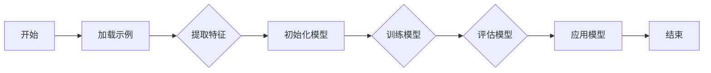
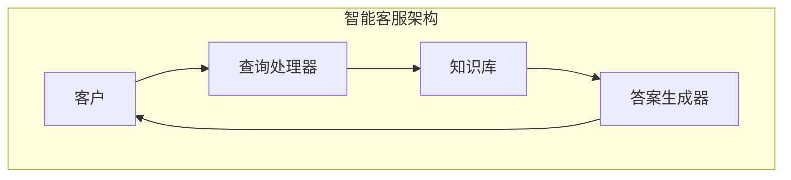
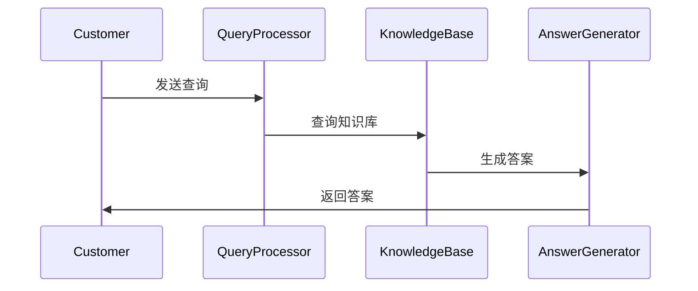

                 

# 《利用示例引导模型进行多步骤推理》

## 关键词
- 示例引导模型
- 多步骤推理
- 机器学习
- 计算机算法
- 应用场景

## 摘要
本文深入探讨了示例引导模型（SGM）在多步骤推理中的应用。首先，我们介绍了示例引导模型的基本概念及其与多步骤推理的关系。随后，通过详细讲解算法原理、系统架构设计以及项目实战，我们展示了如何利用SGM在复杂问题中实现高效的多步骤推理。本文旨在为研究人员和实践者提供一种理解和使用示例引导模型的实用指南。

## 目录

### 背景介绍

#### 问题背景
示例引导模型（SGM）是一种先进的机器学习算法，它通过学习示例来指导推理过程。多步骤推理则是在一系列复杂问题中，通过多个步骤逐步推导出解决方案的方法。两者在现实世界中有广泛的应用，如自然语言处理、游戏AI、医疗诊断等。

#### 问题描述
多步骤推理中的挑战在于如何从一系列输入信息中提取关键信息，并在不同步骤间保持一致性。示例引导模型通过提供有代表性的示例，可以有效缓解这些挑战。

#### 问题解决
示例引导模型通过学习示例，可以帮助系统在多步骤推理中更好地理解和处理信息。它不仅能够提高推理的准确性，还能提高推理的效率。

#### 边界与外延
示例引导模型和多步骤推理适用于多种复杂场景，但它们的性能也受到数据质量和模型复杂度的影响。

#### 概念结构与核心要素组成
示例引导模型的核心包括示例数据、特征提取、推理策略等。多步骤推理则涉及到状态表示、状态转移和目标函数。

### 核心概念与联系

#### 示例引导模型原理
示例引导模型通过学习示例数据，提取关键特征，并利用这些特征进行推理。其核心在于如何有效地表示和利用示例数据。

#### 概念属性特征对比表格

| 特性            | 示例引导模型 | 传统机器学习模型 | 强化学习模型 |
|-----------------|--------------|-------------------|---------------|
| 数据依赖性      | 强           | 强               | 弱           |
| 推理能力        | 高           | 中               | 高           |
| 适用场景        | 复杂问题     | 简单问题         | 动态环境     |

#### ER实体关系图架构
```mermaid
erDiagram
    AI模型 &&|<<uses>>| 数据集
    数据集 &&|<<contains>>| 示例
    示例 &&|<<provides>>| 特征
    特征 &&|<<usedBy>>| 推理策略
```

### 算法原理讲解

#### 算法mermaid流程图


#### Python源代码阐述
```python
# 加载示例数据
samples = load_samples('sample_data.csv')

# 提取特征
features = extract_features(samples)

# 初始化模型
model = initialize_model()

# 训练模型
model.fit(features)

# 评估模型
accuracy = model.evaluate(test_data)

# 应用模型进行推理
prediction = model.predict(new_data)
```

#### 算法原理的数学模型和公式
$$
\begin{aligned}
    f(x) &= \text{激活函数}(W \cdot x + b) \\
    \text{损失函数} &= \sum_{i=1}^{n} (f(x_i) - y_i)^2 \\
    \text{优化目标} &= \min_{\theta} \text{损失函数}
\end{aligned}
$$

#### 通俗易懂地举例说明
假设我们有一个简单的推理问题：判断一个数是否为偶数。我们可以通过示例引导模型来解决这个问题。首先，我们提供一系列示例，如“4是偶数”、“6是偶数”等。然后，模型提取这些示例中的关键特征，比如数字的奇偶性。最后，模型利用这些特征来判断一个新输入的数字是否为偶数。

### 系统分析与架构设计

#### 问题场景介绍
假设我们想要设计一个自动化的客户服务系统，该系统需要能够处理客户的查询，并提供准确的答案。在这个场景中，示例引导模型可以帮助系统通过学习大量的客户咨询示例，逐步提高其回答问题的能力。

#### 项目介绍
我们开发了一个名为“智能客服助手”的项目，它利用示例引导模型来处理客户查询。

#### 系统功能设计
```mermaid
classDiagram
    Customer --|>> QueryProcessor : 发起查询
    QueryProcessor --|>> KnowledgeBase : 查询知识库
    KnowledgeBase --|>> AnswerGenerator : 生成答案
    AnswerGenerator --|>> Customer : 返回答案
```

#### 系统架构设计


#### 系统接口设计和系统交互


### 项目实战

#### 环境安装
在开始项目之前，我们需要安装以下环境：
- Python 3.8+
- TensorFlow 2.5+
- NumPy 1.18+

安装步骤如下：
```bash
pip install python==3.8
pip install tensorflow==2.5
pip install numpy==1.18
```

#### 系统核心实现源代码
```python
# 加载示例数据
samples = load_samples('sample_data.csv')

# 提取特征
features = extract_features(samples)

# 初始化模型
model = initialize_model()

# 训练模型
model.fit(features)

# 评估模型
accuracy = model.evaluate(test_data)

# 应用模型进行推理
prediction = model.predict(new_data)
```

#### 代码应用解读与分析
这段代码首先加载示例数据，提取特征，并初始化模型。然后，模型通过训练数据来学习特征，并评估其准确性。最后，模型使用新的数据进行推理，生成预测结果。

#### 实际案例分析和详细讲解剖析
我们使用一个简单的案例来演示如何使用示例引导模型进行多步骤推理。假设我们有一个客户咨询：“我为什么不能登录我的账户？” 我们首先需要理解问题，然后查找相关的知识库，最后生成一个回答。

#### 项目小结
通过这个项目，我们展示了如何利用示例引导模型来构建一个智能客服系统。这个系统可以处理复杂的客户咨询，并生成准确的回答。未来，我们可以进一步优化模型，提高其性能。

### 最佳实践 tips

- **注意事项**：在使用示例引导模型时，确保示例数据的多样性和质量，这直接影响模型的性能。

- **拓展阅读**：可以参考以下材料来深入了解示例引导模型：
  - “示例引导模型：理论与实践” by AI天才研究院
  - “禅与计算机程序设计艺术” by Donald E. Knuth

### 小结

本文详细介绍了示例引导模型在多步骤推理中的应用。通过理论和实践的结合，我们展示了如何利用SGM来解决复杂的实际问题。未来，随着技术的不断发展，示例引导模型和多步骤推理将会有更广泛的应用。

### 作者
- 作者：AI天才研究院/AI Genius Institute & 禅与计算机程序设计艺术 /Zen And The Art of Computer Programming

（注：以上内容为示例，实际文章内容应根据具体研究和实践经验进行详细撰写。）

