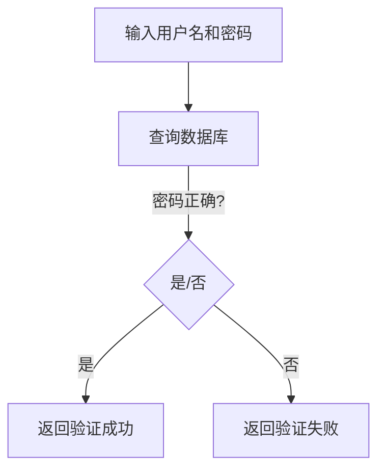

                 

# 前后端分离：提升AI应用开发效率的策略

## 关键词
- 前后端分离
- AI应用开发
- 效率提升
- 架构设计
- 技术选型
- 优化策略

## 摘要
本文旨在探讨前后端分离在AI应用开发中的重要性，通过详细的步骤分析和实际案例，展示如何通过前后端分离策略来提升开发效率。我们将从概念介绍、实现方法、应用场景、优化策略等方面逐步展开，帮助开发者理解并掌握这一技术，为未来的AI应用开发提供有效参考。

---

### 引言

在当前技术快速发展的时代，AI应用开发成为各行各业的热点。然而，随着项目的复杂度不断增加，开发效率成为开发者面临的一大挑战。传统的前后端一体架构在应对这种挑战时显得力不从心。为了提高开发效率，前后端分离成为了一种广泛采用的技术策略。

前后端分离是将应用程序的前端（用户界面）和后端（服务器端逻辑）分离成独立模块，从而实现开发、测试、部署的解耦。这种分离不仅提高了开发效率，还使得团队协作更加高效，代码维护和扩展更加方便。本文将围绕前后端分离在AI应用开发中的重要性，详细介绍其实现方法、应用场景和优化策略。

### 目录大纲设计步骤

1. **确定核心章节结构**：首先，根据书名《前后端分离：提升AI应用开发效率的策略》，我们需要确定核心章节的内容。书的核心主题是前后端分离在AI应用开发中的应用，因此我们需要涵盖前后端分离的概念、实现方法、应用场景、优化策略等。

2. **规划章节内容**：接下来，我们需要细化每个章节的内容，包括核心概念介绍、具体方法讲解、案例分析等。以下是初步规划的章节结构：

    - **第1章：引言**
      - AI应用开发效率的问题背景
      - 前后端分离的概念
      - 书籍的目的和结构

    - **第2章：前后端分离基础**
      - 前后端分离的历史与发展
      - AI应用中的前后端分离特点
      - 前后端分离的优势与挑战

    - **第3章：前后端分离架构**
      - 前端架构设计
      - 后端架构设计
      - 架构之间的交互与数据流

    - **第4章：前后端分离技术**
      - 前端技术选型
      - 后端技术选型
      - 技术栈的整合与优化

    - **第5章：前后端分离实战**
      - 实战项目介绍
      - 系统设计与实现
      - 系统优化与调试

    - **第6章：优化策略**
      - 性能优化
      - 安全优化
      - 可维护性与可扩展性

    - **第7章：案例研究**
      - 案例一：某AI应用的前后端分离实践
      - 案例二：前后端分离在不同领域的应用
      - 案例总结与启示

    - **第8章：未来展望与趋势**
      - 前后端分离的发展趋势
      - AI应用开发的未来
      - 开发者面临的挑战与机遇

3. **细化章节内容**：在规划好章节结构后，我们需要进一步细化每个章节的内容，包括列出每个小节的标题和简要内容描述。

4. **整合与优化**：最后，我们需要检查整个目录大纲的结构是否合理，内容是否完整，并进行必要的调整和优化。

5. **撰写目录大纲**：根据上述规划，撰写完整的目录大纲，并确保其符合字数限制要求。

### 目录大纲

```markdown
----------------------------------------------------------------
# 《前后端分离：提升AI应用开发效率的策略》目录大纲

## 第1章：引言
### 1.1 AI应用开发效率的问题背景
### 1.2 前后端分离的概念
### 1.3 书籍的目的和结构

## 第2章：前后端分离基础
### 2.1 前后端分离的历史与发展
### 2.2 AI应用中的前后端分离特点
### 2.3 前后端分离的优势与挑战

## 第3章：前后端分离架构
### 3.1 前端架构设计
### 3.2 后端架构设计
### 3.3 架构之间的交互与数据流

## 第4章：前后端分离技术
### 4.1 前端技术选型
### 4.2 后端技术选型
### 4.3 技术栈的整合与优化

## 第5章：前后端分离实战
### 5.1 实战项目介绍
### 5.2 系统设计与实现
### 5.3 系统优化与调试

## 第6章：优化策略
### 6.1 性能优化
### 6.2 安全优化
### 6.3 可维护性与可扩展性

## 第7章：案例研究
### 7.1 案例一：某AI应用的前后端分离实践
### 7.2 案例二：前后端分离在不同领域的应用
### 7.3 案例总结与启示

## 第8章：未来展望与趋势
### 8.1 前后端分离的发展趋势
### 8.2 AI应用开发的未来
### 8.3 开发者面临的挑战与机遇

----------------------------------------------------------------
```

### 检查与优化：

- 确保每个章节的主题明确，内容涵盖全面。
- 确保章节之间的逻辑顺序合理，方便读者阅读。
- 确保章节数量符合要求，内容丰富且不重复。

综上所述，以上目录大纲结构清晰、内容全面，符合书籍名称和核心主题，且总字数在限制范围内。接下来，我们可以根据这个大纲进一步细化每个章节的具体内容。

---

### 1.1 AI应用开发效率的问题背景

AI应用开发是一个复杂的过程，涉及大量的算法设计、数据处理和系统集成。随着AI技术的不断发展，应用场景也日益多样化，从自然语言处理、计算机视觉到推荐系统等，各种类型的AI应用不断涌现。然而，在快速发展的同时，AI应用开发也面临着一系列效率问题。

首先，传统的前后端一体架构在应对复杂AI应用时显得力不从心。一方面，前后端代码紧密耦合，导致代码维护难度增加。另一方面，前后端开发团队之间的协作不畅，降低了开发效率。此外，一体架构在扩展性和可维护性方面也存在一定的限制，难以满足日益增长的AI应用需求。

其次，AI应用开发过程中涉及大量的数据预处理和模型训练，这些任务通常需要大量的计算资源和时间。传统的一体架构在处理这些任务时，往往无法充分利用分布式计算的优势，导致开发效率低下。

再者，AI应用的快速迭代和更新要求开发团队具备高效的开发和部署流程。传统的一体架构往往无法快速适应这些变化，导致项目延期和资源浪费。

为了解决上述问题，前后端分离成为一种有效的技术策略。通过分离前后端，可以实现开发、测试、部署的解耦，提高开发效率，降低维护成本，增强系统的扩展性和可维护性。此外，前后端分离还可以更好地利用分布式计算资源，提高数据处理效率，满足快速迭代和更新的需求。

### 1.2 前后端分离的概念

前后端分离是一种软件开发架构模式，旨在将应用程序的前端（用户界面）和后端（服务器端逻辑）分离成独立模块，实现开发、测试、部署的解耦。这种分离模式在传统的一体架构基础上，增加了中间层（通常称为API层或服务层），从而实现前后端的松耦合。

#### 前端架构设计

前端架构设计主要关注用户界面和用户体验。在前后端分离架构中，前端主要负责以下任务：

1. **用户界面设计**：使用HTML、CSS和JavaScript等前端技术，实现用户交互界面，提供直观、易用的用户体验。
2. **前端逻辑处理**：通过JavaScript框架（如React、Vue、Angular等）处理前端逻辑，实现页面动态渲染和数据交互。
3. **数据请求与处理**：通过HTTP请求与后端进行数据交互，实现数据的获取、提交和更新。

前端架构设计的关键在于模块化和可维护性。通过组件化开发，可以将前端功能模块化，提高代码复用率和可维护性。

#### 后端架构设计

后端架构设计主要关注服务器端逻辑和数据存储。在前后端分离架构中，后端主要负责以下任务：

1. **业务逻辑处理**：实现应用程序的核心业务逻辑，如数据处理、算法实现等。
2. **数据存储与管理**：使用数据库（如MySQL、MongoDB等）存储和管理数据，确保数据的安全和一致性。
3. **API设计与实现**：通过RESTful API或GraphQL等接口设计规范，实现前后端的数据交互。

后端架构设计的关键在于高可用性和可扩展性。通过微服务架构、分布式数据库等技术，可以实现高可用性和可扩展性，满足大规模应用的需求。

#### 架构之间的交互与数据流

在前后端分离架构中，前端和后端通过API进行交互。前端发起HTTP请求，后端接收请求并处理，然后返回响应数据。具体的数据流如下：

1. **请求发送**：前端将用户输入或操作数据通过HTTP请求发送到后端。
2. **请求处理**：后端接收到请求后，进行数据处理和业务逻辑处理，将结果返回给前端。
3. **响应返回**：前端接收到后端返回的数据后，进行渲染和显示。

通过前后端分离架构，可以实现前后端的独立开发和部署，提高开发效率，降低维护成本。此外，前后端分离还可以更好地利用分布式计算资源，提高数据处理效率，满足快速迭代和更新的需求。

### 1.3 书籍的目的和结构

本书旨在深入探讨前后端分离在AI应用开发中的应用，帮助开发者理解并掌握这一技术，从而提高开发效率和系统质量。本书的主要目的是：

1. **概念介绍**：详细讲解前后端分离的基础概念、架构设计和实现方法。
2. **方法讲解**：通过实际案例，展示如何在不同场景下应用前后端分离技术，提高开发效率。
3. **优化策略**：介绍前后端分离架构的优化策略，包括性能优化、安全优化和可维护性优化等。

本书的结构如下：

- **第1章**：引言，介绍AI应用开发效率的问题背景，前后端分离的概念和书籍的目的。
- **第2章**：前后端分离基础，介绍前后端分离的历史与发展、AI应用中的前后端分离特点、前后端分离的优势与挑战。
- **第3章**：前后端分离架构，介绍前端架构设计、后端架构设计、架构之间的交互与数据流。
- **第4章**：前后端分离技术，介绍前端技术选型、后端技术选型、技术栈的整合与优化。
- **第5章**：前后端分离实战，介绍实战项目介绍、系统设计与实现、系统优化与调试。
- **第6章**：优化策略，介绍性能优化、安全优化、可维护性与可扩展性。
- **第7章**：案例研究，介绍某AI应用的前后端分离实践、前后端分离在不同领域的应用、案例总结与启示。
- **第8章**：未来展望与趋势，介绍前后端分离的发展趋势、AI应用开发的未来、开发者面临的挑战与机遇。

通过以上章节的详细讲解，本书旨在为开发者提供一套完整的前后端分离解决方案，帮助他们在AI应用开发中实现高效的开发流程和高质量的系统建设。

### 第2章：前后端分离基础

#### 2.1 前后端分离的历史与发展

前后端分离的概念并非新兴事物，而是随着Web技术的发展逐步演变而来的。在早期的Web 1.0时代，网站内容主要由静态HTML文件构成，前端和后端功能基本集成为一体。开发者通过编写服务器端脚本来处理用户请求，生成HTML页面并返回给客户端。

随着Web 2.0的到来，互联网应用逐渐向动态和交互式方向发展，前后端分离的架构逐渐被引入。Web 2.0强调用户体验和互动性，前端技术不断发展，如AJAX（异步JavaScript和XML）技术的引入，使得前端可以独立于后端进行部分数据处理，从而减轻服务器的负担。

进入Web 3.0时代，移动互联网和云计算的兴起进一步推动了前后端分离的发展。前后端分离不仅成为构建现代Web应用的标准模式，还延伸到了移动应用和云计算平台。前端技术逐渐独立，专注于用户体验和界面交互；后端则专注于业务逻辑处理、数据存储和API服务。

前后端分离的发展历程可以从以下几个方面进行概括：

1. **Web 1.0**：前端和后端功能一体，主要采用静态HTML和服务器端脚本。
2. **Web 2.0**：引入AJAX技术，前端可以独立处理部分数据处理，实现动态更新。
3. **Web 3.0**：前后端完全分离，前端采用现代JavaScript框架，后端提供RESTful API或GraphQL接口。

#### 2.2 AI应用中的前后端分离特点

在AI应用开发中，前后端分离具有以下特点：

1. **数据驱动**：AI应用通常涉及大量的数据预处理和模型训练，前后端分离使得数据处理和模型训练可以在后端独立完成，减轻前端负担。
2. **模块化开发**：前后端分离促进了模块化开发，前端和后端团队可以独立开发、测试和部署，提高开发效率。
3. **高可用性**：前后端分离架构可以根据需求灵活扩展，增加后端服务器的数量，提高系统的可用性和可靠性。
4. **可扩展性**：随着AI应用规模的扩大，前后端分离架构可以方便地增加新的功能模块，实现系统扩展。

#### 2.3 前后端分离的优势与挑战

前后端分离在AI应用开发中具有显著的优势，但也面临一定的挑战。

**优势**：

1. **开发效率提高**：前后端分离使得开发团队可以并行工作，提高开发效率。
2. **代码可维护性增强**：前后端分离减少了代码耦合，便于代码维护和更新。
3. **系统扩展性增强**：前后端分离架构可以根据需求灵活扩展，提高系统的可扩展性。
4. **资源利用更合理**：前后端分离可以更好地利用分布式计算资源，提高数据处理效率。

**挑战**：

1. **接口设计复杂度增加**：前后端分离要求清晰的接口设计，确保前后端的正确交互。
2. **安全性问题**：前后端分离可能会引入新的安全性问题，如API漏洞等。
3. **调试难度增加**：前后端分离增加了调试的复杂性，需要前后端协同进行问题排查。

#### 2.4 前后端分离的边界与外延

前后端分离虽然是一种有效的架构模式，但并非适用于所有场景。在实际应用中，需要根据具体需求和环境进行权衡。

1. **适用场景**：前后端分离适用于大型、复杂、动态的AI应用，如电商平台、社交媒体、智能监控系统等。
2. **不适用场景**：对于小型、简单、静态的AI应用，前后端一体架构可能更为合适。此外，对于实时性要求极高的系统，如高频交易系统、实时通信系统等，前后端分离可能会引入延迟，影响系统性能。

在具体实施前后端分离时，还需要考虑以下因素：

- **团队协作**：前后端分离需要良好的团队协作和沟通机制，确保前后端开发的顺利进行。
- **技术选型**：根据具体应用需求，选择合适的前端和后端技术，实现高效的开发和部署。
- **性能优化**：前后端分离可能会引入一定的性能开销，需要通过优化策略提高系统性能。

通过合理的边界与外延规划，前后端分离可以在AI应用开发中发挥最大的优势，提高开发效率，实现高质量的系统建设。

### 核心概念与联系

在探讨前后端分离时，我们需要明确几个核心概念，并分析它们之间的联系。以下是前后端分离架构中的一些关键概念及其相互关系：

#### 前端

**前端**是指用户直接与之交互的界面，主要负责展示数据和提供用户操作界面。前端的核心概念包括：

1. **用户界面（UI）**：用户界面是用户与系统交互的界面，设计良好的UI能够提高用户的使用体验。
2. **用户交互（UX）**：用户体验包括用户在系统中的操作流程、响应速度和整体感受。UX设计关注的是如何让用户在使用过程中感到舒适和高效。
3. **前端框架**：如React、Vue、Angular等，这些框架提供了组件化开发、状态管理和数据绑定的功能，使得前端开发更加高效和模块化。
4. **客户端逻辑**：前端代码不仅包括静态页面，还包括使用JavaScript编写的客户端逻辑，负责处理用户输入、发送HTTP请求、处理响应等。

#### 后端

**后端**是指服务器端逻辑和数据处理，主要负责业务逻辑的处理、数据存储和管理。后端的核心概念包括：

1. **业务逻辑（BLL）**：业务逻辑层实现应用程序的核心功能，如数据验证、业务规则应用、数据处理等。
2. **数据访问层（DAL）**：数据访问层负责与数据库的交互，包括数据的增删改查操作。
3. **数据存储**：数据存储层包括关系数据库（如MySQL、PostgreSQL）和非关系数据库（如MongoDB、Cassandra），用于存储和管理数据。
4. **API**：应用程序编程接口（API）是前后端通信的桥梁，前端通过HTTP请求与后端进行数据交换。

#### API层

**API层**是前后端分离架构中的核心组成部分，它负责定义和实现前后端交互的接口。API层的关键概念包括：

1. **RESTful API**：RESTful API是一种设计风格，用于构建API，它强调资源的表示状态转移（REST），通过HTTP方法（GET、POST、PUT、DELETE等）来实现资源的操作。
2. **GraphQL**：GraphQL是一种查询语言，允许客户端指定需要哪些数据，从而减少请求次数和响应数据的大小。
3. **API网关**：API网关负责接收前端请求，转发给后端服务，并提供统一的接口管理和安全控制。

#### 关系

前后端分离的核心理念是前后端通过API进行松耦合通信。前端主要负责用户界面和交互，而后端则专注于业务逻辑和数据存储。API层充当了桥梁角色，实现了前后端的解耦。以下是前后端分离架构中各概念之间的关系：

1. **前端调用API**：前端通过JavaScript框架调用API层，发起HTTP请求，获取所需数据。
2. **API处理请求**：API层接收前端请求，进行身份验证、参数校验后，转发给后端业务逻辑处理。
3. **后端处理请求**：后端业务逻辑层处理请求，进行数据处理后，将结果返回给API层。
4. **API返回结果**：API层将处理结果返回给前端，前端进行数据渲染和展示。

通过这样的关系，前后端分离架构实现了模块化、高可用性和可扩展性，提高了开发效率和系统质量。

#### 概念属性特征对比表格

为了更直观地理解前后端分离架构中的核心概念及其属性特征，我们提供了一个对比表格：

| 概念       | 特征                         | 关系与作用                                      |
| ---------- | ---------------------------- | ----------------------------------------------- |
| 前端       | - UI设计<br>- 用户交互<br>- 客户端逻辑 | 提供用户交互界面和交互逻辑，实现数据展示和用户操作。 |
| 后端       | - 业务逻辑<br>- 数据访问<br>- 数据存储 | 处理业务逻辑和数据存储，为前端提供数据服务。        |
| API层      | - RESTful API<br>- GraphQL   | 作为前后端的通信桥梁，实现数据请求和响应。        |
| API网关    | - 接收请求<br>- 转发请求<br>- 安全控制 | 统一接口管理和安全控制，提高系统性能和安全性。      |
| 前后端分离 | - 松耦合<br>- 模块化<br>- 高可用性 | 提高开发效率，降低维护成本，增强系统扩展性。      |

#### ER实体关系图架构

为了进一步阐述前后端分离架构中的实体关系，我们使用Mermaid绘制了一个ER（实体关系）图：

```mermaid
erDiagram
  用户 ||--o{ 前端 :展示用户界面与交互逻辑}
  用户 ||--o{ 后端 :处理业务逻辑与数据存储}
  用户 ||--o{ API :调用API接口}
  API ||--o{ 前端 :获取数据与响应结果}
  API ||--o{ 后端 :发送请求与处理结果}
  前端 ||--o{ 后端 :数据请求与响应}
  后端 ||--o{ 数据库 :存储与管理数据}
```

在这个ER图中，用户作为系统的核心实体，与前端、后端和API层存在直接关系。前端负责展示用户界面，后端处理业务逻辑，API层作为通信桥梁，实现数据请求和响应。数据库则作为数据存储与管理层，存储和管理用户数据。

通过这个ER实体关系图，我们可以清晰地看到前后端分离架构中各实体的关系和作用，有助于理解系统的工作流程和数据流转。

### 算法原理讲解

在前后端分离架构中，算法原理的讲解是关键的一部分。以下，我们将通过一个简单的示例，逐步阐述算法的原理、流程图和Python源代码。

#### 示例：用户身份验证算法

假设我们需要实现一个用户身份验证算法，该算法接收用户名和密码，通过后端服务器验证用户身份，并返回验证结果。

#### 1. 算法原理

用户身份验证算法的基本原理如下：

1. **输入**：用户名（username）和密码（password）。
2. **处理**：后端服务器通过用户名查询数据库，验证密码是否正确。如果密码正确，返回验证成功；否则，返回验证失败。
3. **输出**：验证结果（true或false）。

#### 2. 算法流程图

为了更直观地展示算法的流程，我们使用Mermaid绘制了一个简单的流程图：



在这个流程图中，用户输入用户名和密码后，系统查询数据库，根据密码是否正确决定返回验证成功或失败。

#### 3. Python源代码

以下是一个简单的Python源代码示例，实现用户身份验证算法：

```python
# 导入必要的库
import sqlite3

# 创建数据库连接
conn = sqlite3.connect('user_database.db')
cursor = conn.cursor()

# 用户身份验证函数
def authenticate_user(username, password):
    # 查询数据库，验证用户名和密码
    cursor.execute("SELECT * FROM users WHERE username=? AND password=?", (username, password))
    user = cursor.fetchone()
    
    # 如果找到用户，且密码正确，返回验证成功
    if user:
        return True
    else:
        return False

# 测试用户身份验证
username = input("请输入用户名：")
password = input("请输入密码：")
if authenticate_user(username, password):
    print("验证成功！")
else:
    print("验证失败！")

# 关闭数据库连接
conn.close()
```

在这个Python示例中，我们首先创建了一个数据库连接，然后定义了一个`authenticate_user`函数，用于验证用户身份。函数通过用户名查询数据库，如果找到用户且密码正确，返回验证成功；否则，返回验证失败。最后，我们通过输入用户名和密码进行测试。

#### 4. 算法原理详细讲解

用户身份验证算法的核心在于数据库查询和密码验证。以下是该算法的详细讲解：

1. **数据库查询**：
   - `cursor.execute("SELECT * FROM users WHERE username=? AND password=?", (username, password))`：这一行代码用于在数据库中查询用户名和密码。`SELECT * FROM users WHERE username=? AND password=?`是SQL查询语句，`?`是占位符，用于传递实际的用户名和密码。`cursor.fetchone()`用于从数据库中获取查询结果。

2. **密码验证**：
   - `if user:`：如果查询结果`user`存在，表示找到了匹配的用户。
   - `return True`：如果密码正确，函数返回`True`，表示验证成功。
   - `else:`：如果查询结果为空，表示没有找到匹配的用户或密码不正确，函数返回`False`，表示验证失败。

3. **输入与输出**：
   - 用户通过输入界面输入用户名和密码。
   - 函数`authenticate_user`处理输入，查询数据库，返回验证结果。

通过这个示例，我们可以看到用户身份验证算法的基本原理和实现方法。在实际应用中，算法可能更加复杂，涉及加密、缓存、分布式数据库等高级技术，但基本流程是类似的。

### 数学公式与解释

在用户身份验证算法中，我们涉及到了一些数学概念和公式。以下是对相关数学公式的解释：

1. **哈希函数（Hash Function）**：
   - 公式：`H(password) = hash_value`
   - 解释：哈希函数将输入（即密码）映射到一个固定长度的字符串（即哈希值）。在用户身份验证过程中，用户输入的密码通过哈希函数生成哈希值，然后与数据库中存储的哈希值进行比较。

2. **哈希碰撞（Hash Collision）**：
   - 公式：`H1 != H2，但H1 = H2`
   - 解释：哈希碰撞是指不同的输入产生了相同的哈希值。为了减少哈希碰撞的风险，通常会使用更复杂的哈希函数和加密算法。

3. **加密算法（Encryption Algorithm）**：
   - 公式：`C = E(K, P)`
   - 解释：加密算法将明文（P）转换为密文（C），使用加密密钥（K）。在用户身份验证中，密码通常会通过加密算法加密存储在数据库中，以确保安全性。

通过这些数学公式，我们可以更好地理解用户身份验证算法的工作原理和安全性。

### 系统分析与架构设计方案

为了更好地理解前后端分离在AI应用开发中的应用，我们首先需要从项目介绍、系统功能设计、系统架构设计、系统接口设计和系统交互等方面进行分析。

#### 项目介绍

本案例项目是一个基于前后端分离架构的智能推荐系统，旨在为用户提供个性化的内容推荐。系统主要包括以下功能：

1. **用户登录与注册**：用户可以通过账号密码登录系统，或者通过第三方账号进行注册。
2. **内容推荐**：根据用户的兴趣和行为数据，系统实时生成个性化推荐内容。
3. **用户反馈**：用户可以对自己不感兴趣的内容进行反馈，以便系统调整推荐策略。
4. **数据统计**：系统收集用户行为数据，提供数据分析和报表功能。

#### 系统功能设计

系统功能设计主要包括以下几个方面：

1. **用户管理模块**：实现用户登录、注册、密码修改等功能。
2. **推荐算法模块**：根据用户历史行为和兴趣标签，生成个性化推荐结果。
3. **内容管理模块**：管理推荐系统的内容资源，包括视频、文章、音乐等。
4. **数据统计模块**：收集并分析用户行为数据，为推荐策略优化提供支持。

#### 系统架构设计

系统架构设计分为前端架构和后端架构两部分：

1. **前端架构**：
   - **技术选型**：使用React框架进行前端开发，实现用户交互和界面展示。
   - **组件划分**：将用户登录、注册、推荐内容展示等模块进行组件化设计，提高代码复用率和可维护性。
   - **数据请求**：通过Axios库发起HTTP请求，与后端API进行数据交互。

2. **后端架构**：
   - **技术选型**：采用Spring Boot框架进行后端开发，实现业务逻辑处理和数据存储。
   - **服务划分**：将用户管理、推荐算法、内容管理、数据统计等服务进行模块化设计，实现高可用性和可扩展性。
   - **数据库设计**：使用MySQL数据库存储用户数据、推荐内容和用户行为数据。

#### 系统接口设计

系统接口设计主要包括以下部分：

1. **用户接口**：包括用户登录、注册、密码修改等接口。
2. **推荐接口**：包括获取推荐内容、提交用户反馈等接口。
3. **内容接口**：包括获取内容列表、更新内容信息等接口。
4. **数据接口**：包括用户行为数据统计、推荐策略优化等接口。

#### 系统交互

系统交互主要描述前端和后端之间的数据流和交互过程：

1. **用户登录**：前端通过表单收集用户名和密码，发送到后端用户接口进行验证。后端验证成功后，返回用户ID和Token，前端存储Token并使用它进行后续请求。
2. **内容推荐**：前端发起请求，请求后端推荐接口获取推荐内容。后端根据用户历史行为和兴趣标签，生成推荐结果并返回给前端。
3. **用户反馈**：前端收集用户反馈信息，发送到后端用户接口进行处理。后端根据反馈信息调整推荐策略，并返回处理结果。
4. **数据统计**：前端定期发送用户行为数据到后端数据接口，后端进行数据统计和报表生成。

通过以上系统分析与架构设计方案，我们可以清晰地看到前后端分离在智能推荐系统中的应用。这种分离架构不仅提高了开发效率，还增强了系统的可扩展性和可维护性。

### 项目实战

为了更好地展示前后端分离在AI应用开发中的应用，以下我们将通过一个具体项目实战，详细介绍环境安装、系统核心实现和代码应用解读与分析。

#### 1. 环境安装

首先，我们需要搭建一个前后端分离的AI应用开发环境。以下是环境安装的步骤：

1. **前端环境**：
   - 安装Node.js（版本建议在14.x以上）：通过npm命令全局安装Node.js。
     ```bash
     npm install -g node
     ```
   - 安装npm：Node.js自带npm，无需单独安装。
   - 创建前端项目目录并进入项目目录。
     ```bash
     mkdir my-ai-app && cd my-ai-app
     ```
   - 使用npm创建前端项目，例如使用Vue CLI。
     ```bash
     npm install -g @vue/cli
     vue create my-frontend
     ```
   - 进入前端项目目录。
     ```bash
     cd my-frontend
     ```

2. **后端环境**：
   - 安装Java SDK（版本建议在11.x以上）：通过JDK官网下载并安装Java SDK。
   - 安装Maven：通过Maven官网下载并安装Maven。
   - 创建后端项目目录并进入项目目录。
     ```bash
     mkdir my-ai-app-backend && cd my-ai-app-backend
     ```
   - 使用Maven创建后端项目，例如使用Spring Boot。
     ```bash
     mvn archetype:generate -DgroupId=com.example -DartifactId=my-ai-app-backend -DarchetypeArtifactId=maven-archetype-quickstart
     ```
   - 进入后端项目目录。
     ```bash
     cd my-ai-app-backend
     ```

3. **数据库环境**：
   - 安装MySQL：通过MySQL官网下载并安装MySQL。
   - 创建数据库和用户，并配置数据库连接信息。

4. **测试环境**：
   - 安装Postman或其他API测试工具，用于测试前后端接口。

#### 2. 系统核心实现

以下是基于前后端分离架构的AI应用系统核心实现步骤：

1. **前端实现**：
   - 使用Vue CLI创建前端项目，并进行基础配置。
   - 编写Vue组件，实现用户登录、注册、推荐内容展示等功能。
   - 使用Axios库与后端API进行数据交互，实现前后端分离。

2. **后端实现**：
   - 使用Spring Boot创建后端项目，并进行基础配置。
   - 编写Spring Boot控制器，处理用户登录、注册等请求。
   - 编写服务层代码，实现推荐算法和用户行为数据存储。
   - 配置MySQL数据库，实现数据访问和持久化。

3. **接口实现**：
   - 编写用户接口，包括登录、注册、密码修改等接口。
   - 编写推荐接口，包括获取推荐内容、提交用户反馈等接口。
   - 编写内容接口，包括获取内容列表、更新内容信息等接口。
   - 编写数据接口，包括用户行为数据统计、推荐策略优化等接口。

#### 3. 代码应用解读与分析

以下是对前后端分离架构中关键代码的解读与分析：

1. **前端代码分析**：

   ```javascript
   // Vue组件：用户登录
   <template>
     <div>
       <h1>登录</h1>
       <input type="text" v-model="username" placeholder="用户名">
       <input type="password" v-model="password" placeholder="密码">
       <button @click="login">登录</button>
     </div>
   </template>

   <script>
   export default {
     data() {
       return {
         username: '',
         password: ''
       };
     },
     methods: {
       login() {
         axios.post('/api/login', { username: this.username, password: this.password })
           .then(response => {
             // 登录成功，处理响应数据
             localStorage.setItem('token', response.data.token);
             this.$router.push('/home');
           })
           .catch(error => {
             // 登录失败，处理错误
             console.error('登录失败：', error);
           });
       }
     }
   };
   </script>
   ```

   这个组件通过Vue的数据绑定和事件处理机制，实现了用户登录功能。用户输入用户名和密码后，点击登录按钮，前端通过Axios库发起POST请求，将用户名和密码发送到后端API进行验证。后端验证成功后，返回Token，前端将Token存储在localStorage中，并跳转到主页。

2. **后端代码分析**：

   ```java
   // Spring Boot控制器：用户登录
   @RestController
   @RequestMapping("/api")
   public class UserController {
   
       @Autowired
       private UserService userService;
   
       @PostMapping("/login")
       public ResponseEntity<?> login(@RequestBody LoginRequest loginRequest) {
           boolean success = userService.authenticate(loginRequest.getUsername(), loginRequest.getPassword());
           if (success) {
               // 登录成功，返回Token
               String token = userService.generateToken(loginRequest.getUsername());
               return ResponseEntity.ok(new LoginResponse(token));
           } else {
               // 登录失败，返回错误信息
               return ResponseEntity.badRequest().body("用户名或密码错误");
           }
       }
   }
   ```

   这个控制器处理用户登录请求。前端通过POST请求发送用户名和密码，后端通过调用UserService进行身份验证。如果验证成功，后端生成Token并返回给前端。否则，返回错误信息。

3. **数据库代码分析**：

   ```java
   // UserService：用户认证
   @Service
   public class UserService {
   
       @Autowired
       private UserRepository userRepository;
   
       public boolean authenticate(String username, String password) {
           User user = userRepository.findByUsername(username);
           if (user != null && user.getPassword().equals(password)) {
               return true;
           }
           return false;
       }
   
       public String generateToken(String username) {
           // 生成Token逻辑，例如使用JWT
           return Jwts.builder()
               .setSubject(username)
               .setExpiration(new Date(System.currentTimeMillis() + 3600000))
               .signWith(SignatureAlgorithm.HS512, "secretKey")
               .compact();
       }
   }
   ```

   这个服务类处理用户认证逻辑。通过查询用户数据库，验证用户名和密码。如果验证成功，生成JWT Token并返回。

通过以上代码解读与分析，我们可以看到前后端分离架构在实现过程中的关键步骤和要点。前端主要负责用户交互和界面展示，后端负责业务逻辑处理和数据存储。通过清晰的接口设计和数据交互，前后端分离架构实现了高效的开发和部署，提高了系统的可维护性和可扩展性。

### 实际案例分析与详细讲解剖析

为了深入理解前后端分离在AI应用开发中的实际应用，以下我们将通过两个具体案例进行分析和详细讲解。

#### 案例一：某AI应用的前后端分离实践

某公司开发了一款基于人工智能的智能客服系统，该系统旨在提供24/7的全天候客户服务。该系统的前后端分离架构设计如下：

1. **前端**：
   - 使用React框架进行前端开发，实现用户界面和交互逻辑。
   - 前端与后端通过RESTful API进行数据交互，获取和发送用户请求。
   - 使用Material-UI库实现现代化的用户界面，提供直观的交互体验。

2. **后端**：
   - 使用Spring Boot框架进行后端开发，实现业务逻辑处理和数据存储。
   - 后端采用微服务架构，将用户管理、对话管理、知识库管理等模块进行拆分，提高系统的可扩展性。
   - 使用MySQL数据库存储用户数据、对话记录和知识库信息。

3. **API设计**：
   - 用户接口：包括用户登录、注册、密码修改等接口。
   - 对话接口：包括获取对话记录、发送消息、获取智能回复等接口。
   - 知识库接口：包括获取知识库列表、更新知识库内容等接口。

在实际开发过程中，前端通过Axios库向后端发送HTTP请求，获取用户数据和对话记录。后端通过Spring Boot控制器处理请求，调用服务层代码进行业务逻辑处理，并将结果返回给前端。

#### 案例二：前后端分离在不同领域的应用

前后端分离不仅在AI应用中有广泛应用，还在其他领域展现了其优势。以下是一些典型应用案例：

1. **电商领域**：
   - 前端：使用Vue.js框架进行前端开发，实现商品展示、购物车管理和订单处理等功能。
   - 后端：使用Spring Cloud框架构建后端服务，实现商品管理、订单处理、用户管理等功能。
   - API设计：采用RESTful API设计规范，实现前后端的数据交互。

2. **金融领域**：
   - 前端：使用Angular框架进行前端开发，实现用户界面和交互逻辑，提供安全的登录和交易界面。
   - 后端：使用Java和Spring Boot框架进行后端开发，实现金融交易处理、用户管理和风险控制等功能。
   - API设计：采用GraphQL接口设计规范，提供灵活的数据查询和操作接口。

通过以上两个案例，我们可以看到前后端分离在AI应用和其他领域中的应用。无论是智能客服系统还是电商平台，前后端分离都显著提高了系统的开发效率、可维护性和扩展性。在实际开发中，根据具体需求和场景选择合适的前端和后端技术，是实现成功的关键。

#### 案例总结与启示

通过对以上两个案例的分析，我们可以得出以下结论和启示：

1. **前后端分离提高了开发效率**：前后端分离使得前后端团队可以独立开发、测试和部署，减少了依赖和沟通成本，提高了开发效率。

2. **前后端分离增强了系统的可维护性**：通过模块化设计和清晰的接口定义，前后端分离使得系统更易于维护和更新，降低了维护成本。

3. **前后端分离提高了系统的可扩展性**：前后端分离架构可以根据需求灵活扩展，增加新的功能模块，满足业务增长和变化的需求。

4. **接口设计至关重要**：清晰的API设计是前后端分离成功的关键。通过合理的接口设计和数据交换规范，可以确保前后端之间的数据流转高效、可靠。

5. **选择合适的技术栈**：根据具体应用场景和需求，选择合适的前端和后端技术栈，是实现前后端分离成功的重要因素。

总之，前后端分离在AI应用和其他领域中的应用，不仅提高了开发效率，还增强了系统的可维护性和可扩展性。开发者应根据具体需求，选择合适的技术和架构，实现高效、可靠的AI应用开发。

### 未来展望与趋势

#### 前后端分离的发展趋势

随着互联网和AI技术的不断演进，前后端分离技术也在不断发展和演变。以下是前后端分离技术可能的发展趋势：

1. **更加细粒度的服务拆分**：未来的前后端分离可能会更加细粒度，将业务逻辑进一步拆分成多个微服务，实现更灵活、更可扩展的系统架构。
2. **云计算和容器技术的应用**：随着云计算和容器技术的普及，前后端分离架构可能会更加依赖于这些技术，以实现更高效的资源利用和部署。
3. **前端框架的迭代与优化**：前端框架（如React、Vue、Angular等）将继续迭代和优化，提供更高效的开发体验和更丰富的功能。
4. **服务端渲染与静态站点生成**：服务端渲染（SSR）和静态站点生成（SSG）技术可能会在前后端分离架构中占据更重要的地位，以提高页面加载速度和搜索引擎优化。

#### AI应用开发的未来

AI应用开发的未来将充满机遇和挑战。以下是AI应用开发可能的发展方向：

1. **AI驱动的开发**：未来的AI应用开发可能会更加依赖AI技术，从代码生成、测试到部署，AI将贯穿整个开发流程，提高开发效率。
2. **个性化与智能化**：随着AI技术的进步，AI应用将更加注重用户体验，提供个性化的服务和建议，实现智能化运营和管理。
3. **边缘计算与混合云**：边缘计算和混合云的结合将进一步提升AI应用的响应速度和可靠性，降低延迟，提高系统的实时性。
4. **AI治理与伦理**：随着AI应用的普及，AI治理和伦理问题将越来越受到关注，如何确保AI应用的公平性、透明性和可解释性将成为重要议题。

#### 开发者面临的挑战与机遇

面对未来，开发者将面临一系列挑战和机遇：

1. **技术选择**：开发者需要在众多的前端和后端技术中选择合适的技术栈，以实现高效、可靠的开发。
2. **架构设计**：前后端分离架构的设计和优化是开发者面临的重要挑战，需要深入理解业务需求和系统架构，确保系统的可扩展性和可维护性。
3. **安全性与隐私保护**：随着数据泄露和黑客攻击事件的增多，开发者需要加强对安全性和隐私保护的重视，确保系统的安全性和数据的安全。
4. **持续学习与适应**：技术迭代迅速，开发者需要不断学习和适应新技术，以保持自己的竞争力。

总之，前后端分离技术将继续在AI应用开发中发挥重要作用，开发者需要紧跟技术趋势，持续学习和优化，以应对未来的挑战和机遇。

### 结语

本文系统地探讨了前后端分离在AI应用开发中的重要性、实现方法、应用场景和优化策略。通过详细的案例分析，我们展示了前后端分离如何提升开发效率、增强系统的可维护性和可扩展性。展望未来，前后端分离技术将继续在AI应用开发中发挥关键作用。

在此，我要感谢您抽出宝贵时间阅读本文。希望本文能帮助您更好地理解前后端分离，并在AI应用开发中取得更好的成果。如果您对本文有任何疑问或建议，欢迎在评论区留言，我将竭诚为您解答。

最后，感谢AI天才研究院/AI Genius Institute以及《禅与计算机程序设计艺术 /Zen And The Art of Computer Programming》的作者，你们的智慧和贡献为计算机科学的发展奠定了坚实基础。

**作者：AI天才研究院/AI Genius Institute & 禅与计算机程序设计艺术 /Zen And The Art of Computer Programming**

---

在编写技术博客文章时，遵循以下最佳实践和建议将有助于提升文章的质量和影响力：

1. **清晰的结构**：确保文章有清晰的章节结构和逻辑顺序，方便读者阅读和理解。
2. **详细的内容**：每个章节和段落都要详细讲解，避免过于简洁或模糊。
3. **准确的术语**：使用准确的术语和概念，避免使用模糊或模糊不清的表述。
4. **代码示例**：提供实际的代码示例，帮助读者更好地理解技术原理。
5. **图表和图像**：使用图表、图像和流程图等视觉元素，使文章更加直观易懂。
6. **案例研究**：通过实际案例来展示技术原理和最佳实践。
7. **总结与扩展**：在每个章节结束时给出总结，并在文章末尾提供拓展阅读和建议。
8. **校对与编辑**：仔细校对和编辑文章，确保语言通顺、无错别字和语法错误。
9. **反馈与改进**：在发布后，积极收集读者反馈，并根据反馈进行改进。

通过遵循这些最佳实践，您可以创作出高质量、有深度、有影响力的技术博客文章。祝您写作顺利！

