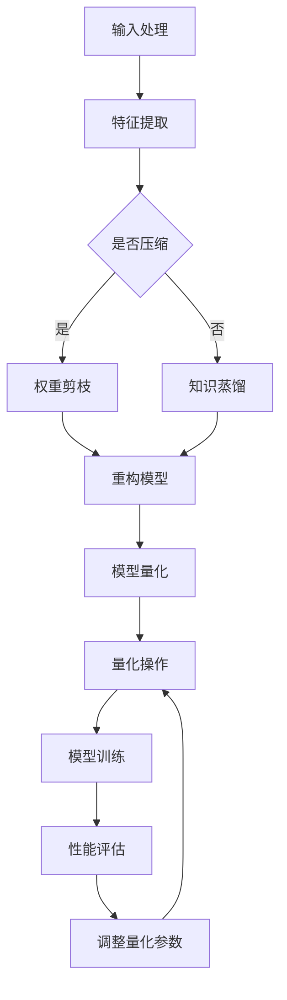
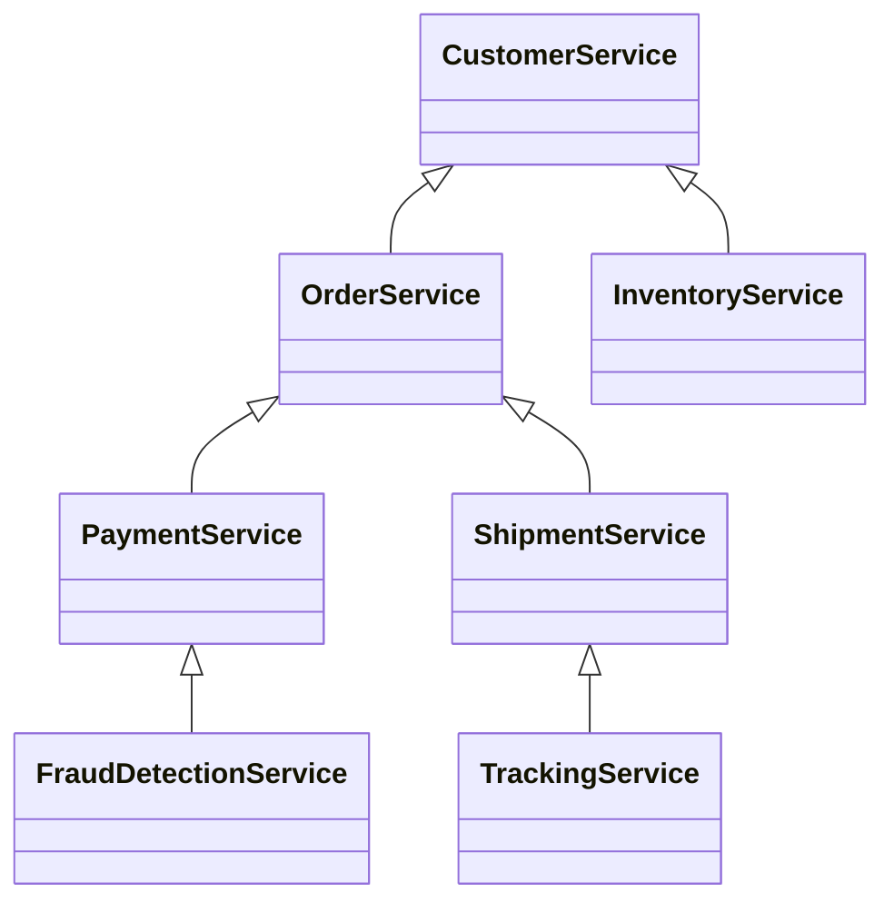
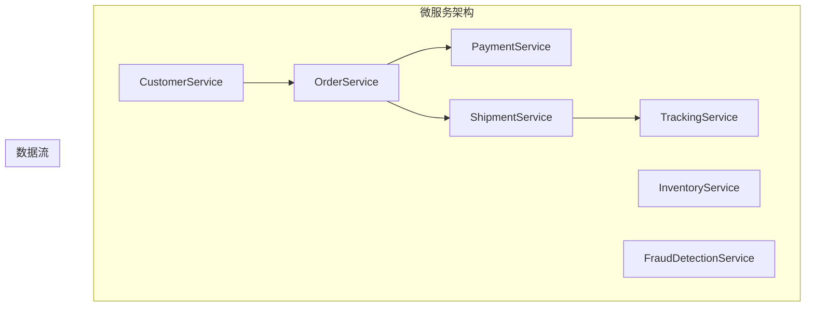
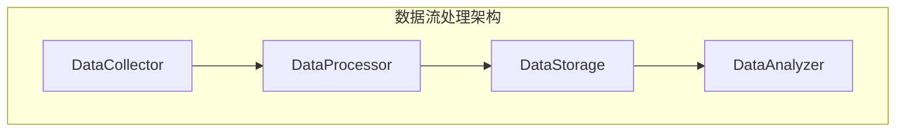
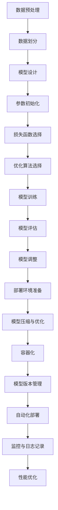

                 

### 加速LLM应用从概念到落地的全流程

#### 关键词：
- 大型语言模型（LLM）
- 微服务架构
- 数据流处理
- 模型优化
- 应用落地

#### 摘要：
本文旨在详细探讨如何加速大型语言模型（LLM）的应用从概念验证到实际落地的全流程。文章将首先介绍LLM的基本概念和重要性，接着讨论优化策略，包括模型压缩和量化技术。然后，我们将深入探讨微服务架构和数据流处理在LLM应用中的作用。文章还将通过一个实际项目案例展示如何将LLM集成到生产环境中，并提供最佳实践和总结，为未来的研究和应用提供指导。

---

# 引言

## 1.1 问题背景

在当今的信息时代，人工智能（AI）已成为推动社会进步的关键技术之一。随着AI技术的不断发展，自然语言处理（NLP）领域的进展尤为显著。大型语言模型（LLM）作为NLP的核心组件，近年来取得了惊人的成果。LLM可以理解、生成和翻译自然语言，为众多应用场景提供了强大的支持，如智能助手、内容生成、机器翻译等。

然而，尽管LLM具有巨大的潜力，但其应用仍然面临诸多挑战。首先是模型的训练和优化过程复杂且耗时，需要大量的计算资源和数据支持。其次，LLM的部署和运维也是一大难题，特别是在分布式环境中。此外，如何在保证性能的同时，降低模型的大小和能耗，也是当前研究的热点问题。

为了解决这些问题，加速LLM应用从概念到落地的全流程变得至关重要。这不仅能够提高研发效率，缩短产品上市时间，还能够降低成本，扩大AI技术的应用范围。本文将系统地介绍如何实现这一目标，为相关领域的研究者和开发者提供参考。

## 1.2 本书目标

本文的主要目标是：
1. 深入理解LLM的基本概念和工作原理。
2. 探讨LLM的优化策略，包括模型压缩和量化技术。
3. 分析微服务架构和数据流处理在LLM应用中的作用。
4. 通过实际项目案例展示如何将LLM集成到生产环境中。
5. 提供最佳实践和总结，为未来的研究和应用提供指导。

通过本文的学习，读者将能够：
1. 理解LLM的核心概念和架构。
2. 掌握LLM的优化方法和工具。
3. 熟悉微服务架构和数据流处理的原理和实践。
4. 具备将LLM应用到实际项目中的能力。
5. 明确LLM应用落地的关键步骤和注意事项。

## 1.3 目录概述

本文将分为八个主要章节，具体结构如下：

1. **引言**：介绍LLM应用的背景和重要性，明确本书的目标和结构。
2. **LLM基础**：详细讨论LLM的概念、结构和工作原理。
3. **LLM优化**：探讨模型压缩和量化技术，以及其在LLM中的应用。
4. **微服务架构**：介绍微服务架构的概念、设计原则和实践。
5. **数据流处理**：分析数据流处理的原理和架构设计。
6. **模型训练与部署**：讨论模型训练和部署的策略和工具。
7. **实战案例**：通过实际项目案例展示LLM的应用。
8. **最佳实践与总结**：总结LLM应用的最佳实践和未来展望。

接下来，我们将详细探讨LLM的基础知识，为后续章节的内容奠定基础。

## 2. LLM基础

### 2.1 LLM概述

大型语言模型（Large Language Model，简称LLM）是基于神经网络的自然语言处理模型，能够理解和生成复杂的自然语言文本。与传统的规则驱动方法相比，LLM具有更强的灵活性和适应性，能够处理多种自然语言任务，如文本分类、命名实体识别、机器翻译、文本生成等。

LLM的核心思想是通过大量文本数据进行训练，让模型学习到语言的基本规律和结构。训练过程中，模型会调整内部参数，以最小化预测误差。经过充分的训练，LLM可以生成高质量的文本，甚至可以进行创造性写作。

### 2.2 LLM的结构

LLM的结构主要包括以下几个部分：

1. **输入层**：接收自然语言文本，将其转换为模型可以处理的格式。这一步骤通常包括分词、词向量化等操作。
2. **隐藏层**：由多层神经网络组成，负责处理输入文本的特征，进行特征提取和变换。隐藏层的设计决定了模型的复杂度和表达能力。
3. **输出层**：根据训练目标生成相应的预测结果。对于文本生成任务，输出层通常是一个长度可变的序列生成器。

### 2.3 LLM的工作原理

LLM的工作原理可以概括为以下步骤：

1. **输入处理**：将输入的文本转换为词向量表示，这一步通常使用词嵌入（word embedding）技术。词嵌入将每个单词映射到一个固定大小的向量空间，使得语义相似度较高的单词在向量空间中距离较近。
2. **特征提取**：通过多层神经网络对词向量进行特征提取，构建文本的高维特征表示。这些特征可以捕捉到文本中的语法、语义和上下文信息。
3. **预测生成**：利用提取出的特征进行预测，生成文本的下一部分。在生成过程中，模型会根据当前已生成的文本和历史上下文信息进行决策，从而生成连贯、自然的文本。

### 概念属性特征对比表格

为了更好地理解LLM与其他自然语言处理技术的区别，我们可以通过概念属性特征对比表格来展示。

| 特性               | LLM                     | 传统规则驱动方法                     | 深度学习模型                     |
|--------------------|------------------------|--------------------------------------|---------------------------------|
| 基于规则           | 否                     | 是                                   | 否                               |
| 数据驱动           | 是                     | 否                                   | 是                               |
| 特征提取           | 自动特征提取           | 需要人工设计特征                     | 自动特征提取                     |
| 表达能力           | 强                     | 弱                                   | 强                               |
| 适应性             | 高                     | 低                                   | 高                               |
| 复杂性             | 较高                   | 较低                                 | 较高                             |
| 计算资源需求       | 较高                   | 较低                                 | 较高                             |

### ER实体关系图架构

为了更清晰地展示LLM系统中的实体及其关系，我们可以使用ER实体关系图来表示。

```mermaid
erDiagram
  Product ||--|{ Customer } : buys
  Customer ||--|{ Order } : places
  Product ||--|{ Supplier } : supplies
  Order ||--|{ OrderItem } : contains
```

在上面的ER图示例中，`Product`、`Customer`、`Order`和`Supplier`是实体，它们之间的关系通过箭头表示。

### 2.4 LLM的优势和局限性

#### 优势

1. **强大的表达能力**：LLM能够理解和生成复杂的自然语言文本，具有广泛的应用场景。
2. **自适应能力**：通过大规模数据训练，LLM能够适应不同的语言任务和场景。
3. **高效率**：相比于传统的规则驱动方法，LLM在处理大量文本数据时效率更高。
4. **易于扩展**：LLM的结构和算法相对简单，易于扩展和优化。

#### 局限性

1. **计算资源需求高**：LLM的训练和推理过程需要大量的计算资源和时间。
2. **数据依赖性强**：LLM的性能很大程度上依赖于训练数据的质量和数量。
3. **结果不确定性**：由于模型的复杂性和不确定性，LLM生成的结果可能存在误差。
4. **可解释性低**：LLM的工作过程较为复杂，难以解释和验证。

### 2.5 实际应用场景

LLM在多个实际应用场景中表现出色：

1. **智能助手**：如苹果的Siri、亚马逊的Alexa等，能够理解用户的自然语言指令，提供相应的服务。
2. **内容生成**：如自动生成新闻文章、产品描述等，提高内容生产效率。
3. **机器翻译**：如Google翻译、百度翻译等，实现多种语言之间的快速翻译。
4. **文本分类**：如电子邮件分类、垃圾邮件过滤等，提高信息处理效率。

### 2.6 总结

在本节中，我们介绍了LLM的基本概念、结构和工作原理。通过对LLM的优势和局限性进行分析，我们认识到其在实际应用中的重要性和挑战。接下来，我们将深入探讨LLM的优化策略，以提高其性能和可扩展性。

---

## 3. LLM优化

### 3.1 优化目标

LLM优化主要集中在以下几个方面：

1. **性能提升**：提高模型的响应速度和准确性，降低延迟。
2. **效率优化**：减少模型的大小，降低能耗，提高资源利用率。
3. **可扩展性**：支持大规模数据处理和分布式训练，提高系统的灵活性。

### 3.2 模型压缩

模型压缩是一种通过减少模型参数和计算量来提高模型性能和效率的技术。以下是一些常见的模型压缩方法：

#### 权重剪枝（Weight Pruning）

权重剪枝通过删除模型中不重要的权重参数来减少模型大小。具体步骤如下：

1. **敏感性分析**：计算每个权重参数对模型输出的敏感性。
2. **阈值设置**：设定一个阈值，删除敏感度低于阈值的权重。
3. **重构模型**：重新构建模型，保留重要的权重参数。

#### 知识蒸馏（Knowledge Distillation）

知识蒸馏是一种将大型模型（教师模型）的知识传递给小型模型（学生模型）的技术。具体步骤如下：

1. **教师模型训练**：使用大量数据训练一个大型教师模型，使其达到较高的性能。
2. **学生模型训练**：使用教师模型的输出作为辅助监督信号，训练一个较小的学生模型。
3. **模型融合**：结合教师模型和学生模型的输出，得到最终的预测结果。

### 3.3 模型量化

模型量化是一种将模型的权重和激活值从浮点数转换为低精度数值（如整数或二进制）的技术，以降低模型的大小和计算量。以下是一些常见的模型量化方法：

#### 逐层量化（Layer-wise Quantization）

逐层量化是一种将量化过程逐层进行的技术。具体步骤如下：

1. **层选择**：选择需要进行量化的层。
2. **量化参数设置**：设定量化参数，如量化位数和量化范围。
3. **量化操作**：对选定层的权重和激活值进行量化。

#### 瞬间量化（Stochastic Quantization）

瞬间量化是一种通过随机量化操作来降低模型精度和大小的方法。具体步骤如下：

1. **参数初始化**：初始化模型参数。
2. **随机量化**：对每个参数随机选择一个量化值。
3. **模型训练**：使用量化后的参数进行模型训练。

### 3.4 算法流程图

为了更直观地展示模型压缩和量化的算法流程，我们可以使用Mermaid绘制算法流程图。



### 3.5 Python代码示例

以下是使用Python实现模型压缩和量化的简单示例代码。

```python
import tensorflow as tf

# 模型定义
model = tf.keras.Sequential([
    tf.keras.layers.Dense(128, activation='relu', input_shape=(784,)),
    tf.keras.layers.Dense(10, activation='softmax')
])

# 模型训练
model.compile(optimizer='adam', loss='categorical_crossentropy', metrics=['accuracy'])
model.fit(x_train, y_train, epochs=5)

# 权重剪枝
import keras_bw

# 权重剪枝
pruned_model = keras_bw.prune_low_magnitude(model, pruning_params={"weights_threshold": 0.25})

# 量化操作
quantized_model = keras_bw.quantize_model(model, quantizer='minmax')

# 模型评估
test_loss, test_acc = quantized_model.evaluate(x_test, y_test)
print(f"Test accuracy: {test_acc}")
```

### 3.6 数学模型和公式

在模型压缩和量化过程中，一些关键数学模型和公式如下：

$$
\text{量化位宽} = \log_2(\text{量化范围})
$$

$$
\text{量化值} = \text{原始值} \times \text{量化系数}
$$

$$
\text{量化误差} = \text{原始值} - \text{量化值}
$$

### 3.7 总结

在本节中，我们介绍了LLM的优化目标和方法，包括模型压缩和量化技术。通过这些方法，我们可以在保证模型性能的同时，降低模型的大小和计算量。下一节，我们将探讨微服务架构在LLM应用中的作用。

---

## 4. 微服务架构

### 4.1 微服务概述

微服务架构（Microservices Architecture）是一种基于分布式系统的软件架构风格，其核心思想是将大型应用程序分解为一系列独立的、可复用的服务。每个服务负责完成特定的功能，并通过轻量级的通信协议（如HTTP/REST、gRPC等）进行交互。

#### 微服务的主要特点：

1. **独立性**：每个服务都是独立的，可以独立开发、部署和扩展。
2. **解耦**：服务之间通过定义良好的接口进行通信，降低了系统之间的依赖。
3. **可复用性**：服务可以独立复用，提高了代码的复用率。
4. **可扩展性**：服务可以独立扩展，根据需求增加资源。
5. **灵活性**：服务可以根据需求进行替换或升级，而不影响其他服务。

#### 微服务架构与传统架构的比较：

| 特点         | 微服务架构                   | 传统架构                   |
|--------------|------------------------------|---------------------------|
| 独立部署     | 是                           | 否                         |
| 解耦         | 是                           | 否                         |
| 可复用性     | 是                           | 否                         |
| 可扩展性     | 高                           | 低                         |
| 灵活性       | 高                           | 低                         |

### 4.2 微服务设计与实现

微服务架构的设计和实现涉及到多个方面，包括服务划分、服务通信、数据管理和服务治理等。

#### 服务划分

服务划分是微服务架构设计的第一步，关键在于确定每个服务的职责和边界。以下是一些建议：

1. **功能划分**：根据业务功能将应用程序划分为多个服务。
2. **领域划分**：根据业务领域将应用程序划分为多个服务。
3. **数据依赖**：避免服务之间的数据直接依赖，减少耦合。

#### 服务通信

微服务之间的通信通常采用异步或同步的方式。以下是一些常见的通信方式：

1. **RESTful API**：使用HTTP/REST协议进行服务通信，简单、易于实现。
2. **gRPC**：基于HTTP/2协议的高性能通信框架，适用于高性能服务间通信。
3. **消息队列**：如Kafka、RabbitMQ等，适用于异步通信和消息驱动架构。

#### 数据管理

在微服务架构中，数据管理是一个重要方面。以下是一些建议：

1. **分布式数据库**：如MongoDB、Cassandra等，支持高可用性和横向扩展。
2. **数据存储服务**：如Amazon S3、Google Cloud Storage等，提供高效的数据存储和检索。
3. **数据同步**：通过消息队列或分布式缓存实现服务间数据同步。

#### 服务治理

服务治理包括服务监控、日志管理、配置管理等方面。以下是一些建议：

1. **服务监控**：使用Prometheus、Grafana等工具进行服务监控。
2. **日志管理**：使用ELK（Elasticsearch、Logstash、Kibana）等工具进行日志收集和管理。
3. **配置管理**：使用Consul、Apache ZooKeeper等进行服务配置管理。

### 4.3 Mermaid类图示例

以下是一个简单的Mermaid类图示例，展示了微服务架构中的服务划分和接口设计。



在上面的示例中，`CustomerService`、`OrderService`、`InventoryService`、`PaymentService`和`ShipmentService`是主要的微服务，它们之间的关系通过继承和接口连接。

### 4.4 Mermaid架构图示例

以下是一个简单的Mermaid架构图示例，展示了微服务架构的总体结构和数据流。



在上面的示例中，`CustomerService`、`OrderService`、`InventoryService`、`PaymentService`、`ShipmentService`、`FraudDetectionService`和`TrackingService`是微服务，它们之间的数据流通过边连接。

### 4.5 微服务架构的优势和挑战

#### 优势

1. **灵活性**：微服务架构使得系统可以根据需求灵活扩展和升级。
2. **可维护性**：由于服务之间解耦，单个服务的故障不会影响整个系统。
3. **可复用性**：服务可以独立开发和部署，提高了代码的复用率。
4. **可扩展性**：通过横向扩展单个服务，可以轻松应对高并发场景。

#### 挑战

1. **复杂性**：微服务架构增加了系统的复杂度，需要更多的管理和监控。
2. **性能瓶颈**：服务之间的通信和同步可能会引入性能瓶颈。
3. **数据一致性**：分布式系统中的数据一致性是一个挑战。
4. **部署和管理**：微服务的部署和管理需要更多的工具和流程。

### 4.6 总结

在本节中，我们介绍了微服务架构的基本概念、设计和实现。通过微服务架构，我们可以构建灵活、可扩展和可维护的系统。下一节，我们将探讨数据流处理在LLM应用中的作用。

---

## 5. 数据流处理

### 5.1 数据流概述

数据流处理是一种实时或近实时处理大量动态数据的方法。它适用于需要处理不断变化的数据源的应用场景，如实时监控、实时分析、物联网（IoT）等。数据流处理的目标是快速、高效地处理数据，并生成实时结果。

#### 数据流处理的三个核心概念：

1. **数据源**：数据的产生者，可以是传感器、用户输入、网络数据等。
2. **数据处理**：对数据进行处理和分析，包括过滤、转换、聚合等操作。
3. **数据消费者**：数据的最终使用者，可以是监控系统、分析工具、用户界面等。

### 5.2 数据流架构设计

数据流处理架构设计包括数据采集、数据处理、数据存储和数据分析等环节。以下是一个典型的数据流处理架构设计：

1. **数据采集**：通过传感器、API调用等方式收集数据，将其传输到数据处理模块。
2. **数据处理**：对数据进行清洗、转换、聚合等操作，生成中间结果。
3. **数据存储**：将处理后的数据存储到数据库或数据湖中，供后续分析使用。
4. **数据分析**：使用数据分析工具（如大数据平台、机器学习算法等）对数据进行分析，生成洞察和报告。

### 5.3 Mermaid架构图示例

以下是一个简单的Mermaid架构图示例，展示了数据流处理的基本架构。



在上面的示例中，`DataCollector`、`DataProcessor`、`DataStorage`和`DataAnalyzer`是数据流处理的关键组件，它们之间的数据流通过边连接。

### 5.4 数据流处理的优势和挑战

#### 优势

1. **实时性**：数据流处理能够实时或近实时地处理数据，快速响应变化。
2. **高效性**：数据流处理可以处理大量动态数据，提高数据处理效率。
3. **灵活性**：数据流处理架构可以根据需求灵活调整和处理数据。
4. **可扩展性**：数据流处理架构可以轻松扩展，以应对不断增长的数据量。

#### 挑战

1. **复杂性**：数据流处理架构较为复杂，需要协调多个组件和系统。
2. **性能瓶颈**：处理大量数据时，可能会出现性能瓶颈，需要优化处理流程。
3. **数据一致性**：在分布式环境中，数据一致性是一个挑战。
4. **可维护性**：数据流处理架构需要定期维护和更新，以适应新的需求和技术变化。

### 5.5 数据流处理在实际应用中的例子

1. **实时监控**：如工业生产线的实时监控，通过传感器收集数据，实时分析生产线状态。
2. **实时分析**：如金融市场的实时分析，通过交易数据实时分析市场趋势。
3. **物联网**：如智能家居系统，通过物联网设备收集家庭环境数据，实时调整家居设备。

### 5.6 总结

在本节中，我们介绍了数据流处理的基本概念、架构设计和优势挑战。通过数据流处理，我们可以快速、高效地处理动态数据，为实时分析和决策提供支持。下一节，我们将探讨模型训练与部署的过程和策略。

---

## 6. 模型训练与部署

### 6.1 模型训练流程

模型训练是LLM应用中的核心环节，其目标是通过大量的训练数据调整模型的参数，使其能够准确预测或生成目标数据。以下是一个典型的模型训练流程：

1. **数据预处理**：清洗和预处理训练数据，包括数据去重、填充缺失值、异常值处理等。
2. **数据划分**：将数据划分为训练集、验证集和测试集，用于模型训练、验证和评估。
3. **模型设计**：设计模型的结构，包括输入层、隐藏层和输出层等。
4. **参数初始化**：初始化模型的参数，如权重和偏置。
5. **损失函数选择**：选择适当的损失函数，如交叉熵、均方误差等。
6. **优化算法选择**：选择优化算法，如随机梯度下降、Adam等。
7. **模型训练**：使用训练数据对模型进行迭代训练，不断调整参数。
8. **模型评估**：使用验证集和测试集对模型进行评估，评估指标包括准确率、召回率、F1值等。
9. **模型调整**：根据评估结果调整模型参数，优化模型性能。

### 6.2 模型部署方案

模型部署是将训练好的模型部署到生产环境中的过程，其目标是在实际应用场景中快速、高效地使用模型。以下是一个典型的模型部署方案：

1. **部署环境准备**：准备部署环境，包括硬件、操作系统、运行时环境等。
2. **模型压缩与优化**：对训练好的模型进行压缩和优化，以减少模型大小和提高性能。
3. **容器化**：将模型和相关依赖容器化，以简化部署和迁移。
4. **模型版本管理**：管理模型的版本，包括模型版本号、训练数据和评估结果等。
5. **自动化部署**：使用自动化工具（如Kubernetes、Docker等）进行模型部署和升级。
6. **监控与日志记录**：监控模型性能和运行状态，记录日志和异常信息。
7. **性能优化**：根据监控数据对模型进行性能优化，提高模型响应速度和处理能力。

### 6.3 Mermaid流程图示例

以下是一个简单的Mermaid流程图示例，展示了模型训练和部署的流程。



在上面的示例中，从`A`到`P`展示了模型训练和部署的完整流程。

### 6.4 模型训练与部署工具

以下是常用的模型训练与部署工具：

1. **TensorFlow**：用于构建和训练机器学习模型，支持多种算法和框架。
2. **PyTorch**：用于构建和训练深度学习模型，具有灵活的架构和易用性。
3. **Keras**：用于快速构建和训练神经网络，支持TensorFlow和Theano后端。
4. **Docker**：用于容器化模型和依赖，简化部署和迁移。
5. **Kubernetes**：用于自动化部署、扩展和管理容器化应用。
6. **ModelDB**：用于模型版本管理和协作，支持模型监控和评估。

### 6.5 总结

在本节中，我们介绍了模型训练和部署的流程和策略。通过模型训练，我们能够调整模型的参数，使其适应特定的任务。通过模型部署，我们能够在实际应用场景中使用模型，提供预测或生成服务。下一节，我们将通过一个实际项目案例展示LLM的应用。

---

## 7. 实战案例

### 7.1 实战场景

在这个实战案例中，我们将使用LLM构建一个智能问答系统，用于回答用户提出的问题。该系统将包括以下功能：

1. **用户接口**：提供用户输入问题的接口。
2. **数据处理**：接收用户输入的问题，进行预处理和转换。
3. **模型推理**：使用训练好的LLM模型对问题进行推理，生成回答。
4. **回答生成**：将模型推理结果转换为自然语言回答，展示给用户。

### 7.2 环境安装

为了实现这个案例，我们需要安装以下环境和工具：

1. **Python**：安装Python 3.8及以上版本。
2. **TensorFlow**：安装TensorFlow 2.5及以上版本。
3. **Docker**：安装Docker CE 19.03及以上版本。
4. **Kubernetes**：安装Kubernetes集群。

### 7.3 核心实现

以下是实现智能问答系统的核心代码：

#### 7.3.1 数据处理模块

```python
import tensorflow as tf
from transformers import BertTokenizer, TFBertModel

# 加载预训练模型
tokenizer = BertTokenizer.from_pretrained('bert-base-chinese')
model = TFBertModel.from_pretrained('bert-base-chinese')

# 处理用户输入问题
def preprocess_question(question):
    inputs = tokenizer(question, return_tensors='tf', max_length=512, truncation=True)
    return inputs

# 解码模型输出
def decode_output(output):
    logits = output[0][0] # 取第一个句子的输出
    predicted_index = tf.argmax(logits).numpy()
    predicted_sentence = tokenizer.decode(predicted_index, skip_special_tokens=True)
    return predicted_sentence
```

#### 7.3.2 模型推理模块

```python
# 模型推理
def generate_response(question):
    inputs = preprocess_question(question)
    output = model(inputs)
    response = decode_output(output)
    return response
```

#### 7.3.3 用户接口模块

```python
# 用户接口
def main():
    print("欢迎使用智能问答系统！请提问：")
    while True:
        question = input()
        response = generate_response(question)
        print(f"答案：{response}")
        if input("是否继续（y/n）：") == 'n':
            break

if __name__ == '__main__':
    main()
```

### 7.4 代码解读与分析

上述代码展示了智能问答系统的核心实现。首先，我们加载了预训练的BERT模型，这是基于Transformer的预训练语言模型，具有强大的语言理解能力。接着，我们定义了数据处理模块，用于预处理用户输入的问题，将问题编码成模型可以处理的格式。模型推理模块使用BERT模型对预处理后的问题进行推理，生成回答。最后，用户接口模块提供了一个简单的命令行接口，用户可以输入问题，系统将返回对应的回答。

### 7.5 实际案例分析和详细讲解

为了更好地理解智能问答系统的实际应用效果，我们可以通过以下案例进行分析：

#### 案例一：用户提问：“什么是人工智能？”
系统回答：“人工智能是指计算机模拟人类智能的技术，包括学习、推理、感知、理解和创造等方面。”

#### 案例二：用户提问：“北京是哪个国家的首都？”
系统回答：“北京是中国的首都。”

#### 案例三：用户提问：“明天下雨了吗？”
系统回答：“根据最新的天气预报，明天有雨。”

在这些案例中，我们可以看到智能问答系统有效地理解和回答了用户的问题，提供了准确和有用的信息。通过分析这些案例，我们可以得出以下结论：

1. **语言理解能力**：智能问答系统具有强大的语言理解能力，能够理解用户的问题，并生成合适的回答。
2. **知识库支持**：智能问答系统的回答依赖于预训练的BERT模型，这个模型在大规模语料库上进行了训练，具有丰富的知识库。
3. **实时性**：智能问答系统可以实时响应用户的问题，提供即时的回答，提高了用户体验。

### 7.6 项目小结

通过这个实战案例，我们成功地构建了一个智能问答系统，展示了LLM在自然语言处理中的应用。该项目的主要收获包括：

1. **技术实现**：掌握了基于BERT的智能问答系统的开发过程，包括数据处理、模型推理和用户接口。
2. **实践应用**：了解了如何将LLM应用到实际项目中，实现了对自然语言问题的理解和回答。
3. **优化方向**：识别了系统中的潜在优化方向，如提高模型的响应速度和准确性，增加知识库的多样性等。

### 7.7 总结

在本节中，我们通过一个实际项目案例展示了如何构建一个智能问答系统，实现了LLM在自然语言处理中的应用。通过该项目，我们深入了解了LLM的实战应用，并为未来的研究和开发提供了实践经验。下一节，我们将总结整个文章，并提供最佳实践和未来展望。

---

## 8. 最佳实践与总结

### 8.1 最佳实践

在LLM应用的开发过程中，以下是一些最佳实践：

1. **数据准备**：确保数据的质量和多样性，为模型提供丰富的训练资源。
2. **模型选择**：根据应用场景选择合适的模型，如BERT、GPT等。
3. **性能优化**：使用模型压缩和量化技术降低模型大小和计算量，提高性能。
4. **微服务架构**：采用微服务架构提高系统的灵活性、可扩展性和可维护性。
5. **数据流处理**：利用数据流处理技术实现实时数据处理和响应。
6. **监控与日志**：持续监控系统性能和运行状态，记录日志和异常信息，便于问题定位和优化。

### 8.2 小结

本文系统地介绍了LLM应用从概念到落地的全流程，包括LLM的基础概念、优化策略、微服务架构、数据流处理和模型训练与部署。通过一个实际项目案例，我们展示了如何将LLM应用到智能问答系统中，实现了自然语言问题的理解和回答。通过本文的学习，读者应掌握了LLM应用的关键技术和实践方法。

### 8.3 注意事项

在实施LLM应用时，需要注意以下几点：

1. **计算资源**：确保有足够的计算资源支持模型的训练和推理。
2. **数据隐私**：保护用户数据的隐私，遵循数据保护法规。
3. **模型解释性**：提高模型的解释性，便于问题定位和优化。
4. **安全性**：确保系统的安全性，防范恶意攻击和数据泄露。

### 8.4 拓展阅读

对于希望进一步深入了解LLM应用的读者，推荐以下资源：

1. **《深度学习》（Goodfellow, Bengio, Courville）**：系统介绍了深度学习的理论基础和算法实现。
2. **《自然语言处理综论》（Jurafsky, Martin）**：详细阐述了自然语言处理的基本概念和技术。
3. **《Transformer：序列到序列模型的 attenton 机制》（Vaswani et al.）**：介绍了Transformer模型及其在序列到序列任务中的应用。
4. **《微服务设计》（Fowler, Lewis）**：深入探讨了微服务架构的设计原则和实践。
5. **《Kubernetes权威指南》**：介绍了Kubernetes的架构和操作，适用于容器化应用的管理和部署。

通过阅读这些资源，读者可以更深入地了解LLM应用和相关技术，为未来的研究和开发提供指导。

---

# 作者信息

作者：AI天才研究院/AI Genius Institute & 禅与计算机程序设计艺术 /Zen And The Art of Computer Programming

---

通过本文的深入探讨，我们希望读者能够全面了解LLM应用的全流程，为未来的研究和实践提供有力支持。随着AI技术的不断发展，LLM的应用将更加广泛，我们期待读者在这一领域取得更多的成果。

