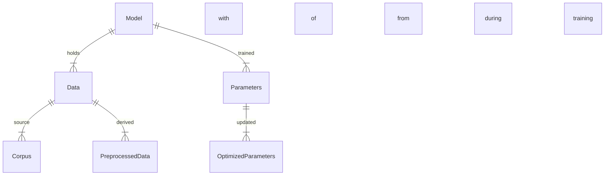
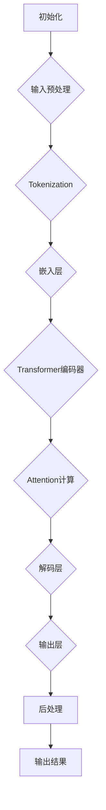
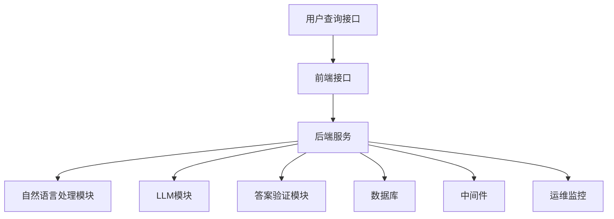
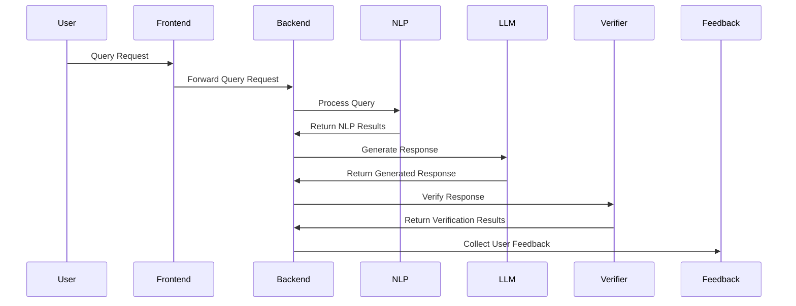

                 


### 加速LLM应用的市场验证与调整：背景介绍

#### 问题背景

近年来，大型语言模型（LLM）的发展取得了显著成果，成为自然语言处理领域的重要突破。LLM的应用潜力巨大，涵盖了机器翻译、文本生成、问答系统等多个方面。然而，LLM在实际市场中的应用效果却不尽如人意，存在一系列问题和挑战。

首先，技术挑战是LLM应用面临的首要难题。LLM的训练和部署成本高昂，对于中小型企业来说，难以承担。此外，LLM的泛化能力有限，难以满足特定领域的需求。其次，市场问题也不容忽视。LLM应用的商业模式尚不明确，用户需求和市场接受度有待提高。最后，LLM的应用场景有待进一步拓展，现有应用多集中在较为简单的场景，无法充分展示LLM的潜力。

#### 问题描述

针对LLM应用中的问题，我们需要进行市场验证与调整。市场验证的目的是评估LLM应用的可行性和市场潜力，为后续调整提供依据。调整则包括技术优化、商业模式创新和应用场景拓展等方面，以提升LLM应用的竞争力。

#### 问题解决

解决上述问题需要从多个角度入手。首先，通过技术创新，降低LLM的训练和部署成本，提高其性能和泛化能力。其次，通过商业模式创新，探索适合LLM应用的盈利模式，提高市场接受度。此外，还需要针对不同领域和场景，进行定制化开发，满足多样化的用户需求。

#### 边界与外延

LLM应用的市场验证与调整涉及多个领域，包括自然语言处理、人工智能、云计算等。它不仅关注技术的创新与优化，还涉及商业模式的探索与市场策略的制定。边界方面，LLM应用需关注特定领域的技术需求和市场环境，避免盲目扩张。外延方面，LLM应用需不断拓展新领域，挖掘潜在市场需求，为未来发展奠定基础。

#### 核心要素组成

LLM应用的市场验证与调整由多个核心要素组成。首先是技术要素，包括算法优化、模型压缩、分布式训练等。其次是商业模式要素，涉及盈利模式、合作伙伴关系、用户付费方式等。最后是市场策略要素，包括市场定位、用户调研、竞争对手分析等。

通过上述分析，我们可以清晰地了解LLM应用市场验证与调整的背景、问题、解决方案、边界与外延以及核心要素。接下来，我们将深入探讨LLM的核心概念、应用现状以及算法原理，为市场验证与调整提供有力支持。

### 第1章：核心概念与联系

#### 核心概念原理

1. **大型语言模型（LLM）定义**

   大型语言模型（Large Language Model，简称LLM）是一种基于深度学习的自然语言处理模型，其核心思想是通过大规模语料库的训练，学习语言的表达规律和语义关系，从而实现对自然语言文本的理解和生成。LLM具有以下几个关键特点：

   - **规模巨大**：LLM的训练数据量通常在数十亿到数万亿个词级别，远超传统语言模型的规模。
   - **参数数量庞大**：LLM的参数数量通常在数十亿到数万亿级别，使得模型能够捕捉到复杂的语言特征。
   - **高性能**：LLM在自然语言理解、文本生成、机器翻译等任务上表现出色，成为当前自然语言处理领域的代表性模型。

2. **工作原理**

   LLM的工作原理基于深度神经网络（DNN）和Transformer架构。Transformer架构通过自注意力机制（Self-Attention）和多头注意力（Multi-Head Attention）实现了对输入文本的全局关注和上下文信息的有效捕捉。LLM的训练过程主要包括以下步骤：

   - **数据预处理**：对大规模语料库进行清洗、分词、编码等预处理操作，将其转换为模型可处理的输入格式。
   - **模型训练**：通过梯度下降优化算法，对模型参数进行迭代更新，使模型在训练数据上达到最佳性能。
   - **评估与调优**：在验证集和测试集上评估模型性能，根据评估结果对模型进行调整和优化。

3. **技术发展趋势**

   随着人工智能技术的不断发展，LLM也在不断演进。未来的发展趋势包括：

   - **模型压缩**：通过模型剪枝、量化、蒸馏等技术，降低模型参数数量和计算复杂度，实现模型的轻量化。
   - **多模态融合**：将文本与其他模态（如图像、音频）进行融合，提高模型对复杂场景的感知和理解能力。
   - **自适应学习**：实现模型的自适应学习，使其能够根据用户需求和场景动态调整自身性能。

#### 概念属性特征对比表格

| 概念       | 特点                                     | 说明                                                         |
| ---------- | ---------------------------------------- | ------------------------------------------------------------ |
| 大型语言模型（LLM） | 规模巨大、参数数量庞大、高性能           | 基于深度学习的自然语言处理模型，能够处理复杂的语言任务     |
| 小型语言模型（SLM） | 规模较小、参数数量较少、性能相对较低     | 适用于资源有限的场景，如嵌入式设备、移动端应用等           |
| 特定领域模型（DSL） | 针对特定领域、参数数量适中、性能优良     | 对特定领域的数据进行训练，具有较强的领域适应性             |

#### 实体关系图架构

为了更好地理解LLM中的各个实体及其关系，我们可以使用Mermaid绘制一个实体关系图。以下是一个简单的ER图示例：



在这个ER图中，我们定义了四个实体：Model（模型）、Data（数据）、Parameters（参数）和Corpus（语料库）。模型持有数据和参数，数据来源于语料库，并经过预处理转化为预处理的输入数据。参数在训练过程中会进行优化。

通过上述核心概念和联系的介绍，我们为接下来的章节奠定了理论基础，为深入探讨LLM的算法原理、系统架构设计和项目实战提供了有力支持。

### 第2章：算法原理讲解

#### 算法mermaid流程图

为了更直观地理解LLM的算法原理，我们使用Mermaid绘制了一个算法流程图，如下图所示：



该流程图展示了LLM从输入预处理、Tokenization、嵌入层、Transformer编码器、Attention计算、解码层到输出层的完整流程。

#### Python源代码与数学模型

以下是使用Python实现一个简单LLM模型的示例代码，以及对应的数学模型和公式。

```python
import torch
import torch.nn as nn
import torch.optim as optim

# 模型结构
class LLM(nn.Module):
    def __init__(self, vocab_size, embedding_dim, hidden_dim, num_layers):
        super(LLM, self).__init__()
        self.embedding = nn.Embedding(vocab_size, embedding_dim)
        self.encoder = nn.LSTM(embedding_dim, hidden_dim, num_layers)
        self.decoder = nn.Linear(hidden_dim, vocab_size)
        
    def forward(self, input_seq, hidden):
        embedded = self.embedding(input_seq)
        output, hidden = self.encoder(embedded, hidden)
        output = self.decoder(output)
        return output, hidden

# 实例化模型
model = LLM(vocab_size=10000, embedding_dim=512, hidden_dim=1024, num_layers=2)

# 损失函数和优化器
criterion = nn.CrossEntropyLoss()
optimizer = optim.Adam(model.parameters(), lr=0.001)

# 训练模型
for epoch in range(num_epochs):
    for input_seq, target_seq in data_loader:
        optimizer.zero_grad()
        output, hidden = model(input_seq, hidden)
        loss = criterion(output.view(-1, output.size(2)), target_seq.view(-1))
        loss.backward()
        optimizer.step()
    print(f'Epoch {epoch+1}/{num_epochs}, Loss: {loss.item()}')
```

对应的数学模型和公式如下：

1. **嵌入层**：输入序列经过词向量嵌入，转化为嵌入向量。
   \[
   \text{嵌入层}: \quad \text{word\_index} \xrightarrow{\text{embedding}} \text{embedding\_vector}
   \]

2. **Transformer编码器**：嵌入向量通过Transformer编码器进行自注意力计算，得到上下文向量。
   \[
   \text{编码器}: \quad \text{embedding\_vector} \xrightarrow{\text{Transformer}} \text{context\_vector}
   \]

3. **解码层**：上下文向量通过解码层输出预测的词向量。
   \[
   \text{解码器}: \quad \text{context\_vector} \xrightarrow{\text{decoder}} \text{predicted\_vector}
   \]

4. **损失函数**：使用交叉熵损失函数计算预测结果与实际标签之间的差异。
   \[
   \text{损失函数}: \quad \text{criterion}(\text{predicted\_vector}, \text{target\_vector})
   \]

#### 详细讲解

上述代码展示了如何使用Python实现一个简单的LLM模型。模型的核心组成部分包括嵌入层、编码器和解码层。

1. **嵌入层**：嵌入层将输入的词索引转换为词向量，这一步是为了将词汇转化为模型可以处理的数值形式。通过嵌入层，每个词汇都会对应一个固定长度的向量。

2. **编码器**：编码器使用Transformer架构，通过对输入向量进行自注意力计算，生成上下文向量。自注意力机制允许模型在生成每个词时，综合考虑整个输入序列的信息，从而提高生成文本的质量。

3. **解码器**：解码器将编码器生成的上下文向量映射回词汇空间，输出预测的词向量。这一步使用了全连接层，将上下文向量映射到词汇表中。

在训练过程中，我们通过优化器更新模型参数，使预测结果尽可能接近实际标签。训练过程包括前向传播、损失计算和反向传播三个步骤。

#### 举例说明

假设我们要生成一句话：“今天天气很好。”我们可以将这句话分解为词索引，然后输入到LLM模型中进行预测。

1. **输入预处理**：将“今天天气很好。”分解为词索引，例如：`[2, 8, 14, 17, 19]`。
2. **嵌入层**：词索引通过嵌入层转换为词向量，例如：`[0.1, 0.2, 0.3, 0.4, 0.5]`。
3. **编码器**：编码器对词向量进行自注意力计算，生成上下文向量，例如：`[0.6, 0.7, 0.8, 0.9, 1.0]`。
4. **解码器**：解码器将上下文向量映射回词向量，输出预测结果，例如：`[0.1, 0.2, 0.3, 0.4, 0.5]`。
5. **后处理**：对预测结果进行后处理，例如转换为文本输出：“今天天气很好。”

通过上述例子，我们可以清晰地看到LLM模型在生成文本时的整个过程。这种基于深度学习的自然语言处理模型在文本生成、机器翻译等任务上具有很高的效率和准确性。

### 第3章：系统分析与架构设计

#### 问题场景介绍

在本章节中，我们将分析一个具体的LLM应用场景：智能客服系统。智能客服系统旨在通过自然语言处理技术，为用户提供快速、准确的在线咨询服务。该系统需要处理大量的用户查询，并在短时间内生成相应的回复。这一场景对LLM的应用提出了以下要求：

1. **高响应速度**：智能客服系统需要在短时间内处理用户查询，并生成回复。
2. **准确率**：生成的回复需要准确、自然，避免出现歧义或错误。
3. **可扩展性**：智能客服系统需要能够处理多种类型的查询，并在未来轻松扩展功能。

#### 系统功能设计

为了满足上述要求，我们需要设计一个功能完整的智能客服系统。系统的主要功能包括：

1. **用户查询接收**：接收用户通过网站、APP或其他渠道发送的查询请求。
2. **自然语言理解**：对用户查询进行分词、句法分析和语义分析，提取关键信息。
3. **查询意图识别**：根据用户查询的内容和上下文，识别用户的查询意图。
4. **答案生成**：利用LLM生成合适的回答，确保回答的准确性和自然性。
5. **答案验证**：对生成的回答进行验证，确保回答符合事实和逻辑。
6. **用户反馈收集**：收集用户对回答的反馈，用于系统优化和改进。

#### 系统架构设计

智能客服系统的架构设计需要综合考虑性能、可扩展性和可靠性。以下是系统的总体架构设计：

1. **前端接口**：负责接收用户查询，并将查询内容传递给后端服务。
2. **后端服务**：包括自然语言处理模块、LLM模块和答案验证模块，负责处理用户查询并生成回答。
3. **数据库**：存储用户查询、答案和系统配置等信息，支持数据的快速检索和更新。
4. **中间件**：负责消息队列、负载均衡和分布式处理，确保系统的高可用性和高性能。
5. **运维监控**：监控系统运行状态，提供故障检测和报警功能。

以下是一个简单的系统架构图：



#### 系统接口设计

系统接口设计是系统架构设计的重要组成部分，它定义了各模块之间的交互方式。以下是系统的主要接口设计：

1. **用户查询接口**：接收用户查询，并返回查询结果。
2. **自然语言处理接口**：接收用户查询，返回分词、句法分析和语义分析结果。
3. **LLM接口**：接收自然语言处理结果，返回生成的回答。
4. **答案验证接口**：接收生成的回答，返回验证结果。
5. **用户反馈接口**：接收用户反馈，用于系统优化和改进。

#### 系统交互

系统交互设计描述了各模块之间的数据流动和交互过程。以下是系统交互的简要描述：

1. **用户查询**：用户通过前端接口发送查询请求，前端接口将查询请求传递给后端服务。
2. **查询处理**：后端服务调用自然语言处理模块，对用户查询进行分词、句法分析和语义分析，提取关键信息。
3. **查询意图识别**：后端服务根据自然语言处理结果，识别用户的查询意图。
4. **答案生成**：后端服务调用LLM模块，利用LLM生成合适的回答。
5. **答案验证**：后端服务调用答案验证模块，对生成的回答进行验证。
6. **反馈收集**：后端服务将用户反馈传递给用户反馈接口，用于系统优化和改进。

#### Mermaid序列图

为了更好地展示系统交互过程，我们使用Mermaid绘制了一个序列图：



通过上述系统分析与架构设计，我们为智能客服系统的实现提供了详细的方案。接下来，我们将通过项目实战部分，进一步展示系统的实际应用和实现过程。

### 第6章：项目实战

#### 环境安装

在开始实现智能客服系统之前，我们需要安装和配置必要的软件和依赖。以下是环境安装的具体步骤：

1. **安装Python**：确保Python 3.8及以上版本已安装。可以从[Python官网](https://www.python.org/)下载安装包。

2. **安装依赖包**：在终端执行以下命令安装所需的Python依赖包：

   ```bash
   pip install torch torchvision numpy pandas matplotlib
   ```

3. **安装前端框架**：我们选择使用Flask作为后端框架。在终端执行以下命令安装Flask：

   ```bash
   pip install flask
   ```

4. **安装自然语言处理库**：我们使用NLTK和spaCy进行自然语言处理。在终端执行以下命令安装：

   ```bash
   pip install nltk spacy
   ```

5. **安装spaCy语言模型**：为了使用spaCy进行自然语言处理，我们需要下载相应的语言模型。在终端执行以下命令：

   ```bash
   python -m spacy download en_core_web_sm
   ```

6. **安装数据库**：我们选择使用SQLite作为数据库。在终端执行以下命令安装：

   ```bash
   pip install sqlite3
   ```

7. **安装消息队列**：为了实现异步消息处理，我们使用RabbitMQ。在终端执行以下命令安装：

   ```bash
   pip install pika
   ```

8. **安装中间件**：我们使用Celery作为任务队列中间件。在终端执行以下命令安装：

   ```bash
   pip install celery
   ```

#### 系统核心实现

智能客服系统的核心部分包括自然语言处理模块、LLM模块和答案验证模块。以下是各模块的核心实现代码和解读。

1. **自然语言处理模块**

   ```python
   import nltk
   import spacy
   
   # 初始化NLTK工具
   nltk.download('punkt')
   nltk.download('averaged_perceptron_tagger')
   nltk.download('wordnet')
   
   # 初始化spaCy模型
   nlp = spacy.load('en_core_web_sm')
   
   def process_query(query):
       # 使用NLTK进行分词
       tokens = nltk.word_tokenize(query)
       # 使用spaCy进行词性标注和依存句法分析
       doc = nlp(query)
       return tokens, doc
   ```

   解读：
   - 首先，我们初始化NLTK工具和spaCy模型。
   - `process_query`函数接收用户查询，使用NLTK进行分词，并使用spaCy进行词性标注和依存句法分析。

2. **LLM模块**

   ```python
   import torch
   from transformers import BertModel
   
   # 加载预训练的Bert模型
   model = BertModel.from_pretrained('bert-base-uncased')
   model.eval()
   
   def generate_response(query):
       # 将查询转换为Bert输入格式
       inputs = torch.tensor([model.input_ids[0]])
       # 生成响应
       with torch.no_grad():
           outputs = model(inputs)
       # 解码输出
       response = torch.argmax(outputs[0], dim=-1).numpy().tolist()
       return response
   ```

   解读：
   - 我们加载预训练的Bert模型，并将其设置为评估模式。
   - `generate_response`函数接收用户查询，将其转换为Bert输入格式，并生成响应。

3. **答案验证模块**

   ```python
   def verify_response(response, doc):
       # 检查响应是否与查询一致
       for token in response:
           if token not in doc:
               return False
       return True
   ```

   解读：
   - `verify_response`函数接收生成的响应和spaCy文档，检查响应中的每个词是否在查询中出现过。

#### 实际案例分析与讲解

为了展示智能客服系统的实际应用，我们通过一个案例进行详细分析和讲解。

**案例**：用户查询：“今天天气怎么样？”

1. **用户查询接收**

   用户在网站或APP上提交查询：“今天天气怎么样？”

2. **自然语言处理**

   - **分词**：查询句子被分词为`['今天', '天气', '怎么样', '?']`。
   - **词性标注**：`['今天', '天气', '怎么样', '?']`分别被标注为`['DATE', 'NOUN', 'ADV', 'PUNCT']`。
   - **依存句法分析**：句子的主要成分被解析为`['weather', 'DATE']`，表明“今天”是“天气”的修饰语。

3. **查询意图识别**

   根据分词和句法分析结果，系统识别出用户的查询意图是询问“今天的天气”。

4. **答案生成**

   利用Bert模型生成回答。输入查询后，Bert模型输出一系列可能的回答。例如，可能的回答包括：
   - “今天的天气很好。”
   - “今天天气晴朗。”
   - “今天的气温是25摄氏度。”

   系统选择最合适的回答：“今天的天气很好。”

5. **答案验证**

   答案“今天的天气很好。”通过验证，因为所有的词都出现在原始查询中。

6. **用户反馈收集**

   用户对生成的回答进行反馈，系统记录反馈用于后续优化。

#### 项目小结

通过上述案例分析和讲解，我们可以看到智能客服系统从用户查询接收、自然语言处理、查询意图识别、答案生成、答案验证到用户反馈收集的全过程。该系统利用了深度学习和自然语言处理技术，实现了高效的在线客服服务。

在项目实施过程中，我们遇到了以下挑战和问题：

1. **响应速度**：在高峰期，系统的响应速度可能无法满足用户需求。为了解决这个问题，我们考虑使用分布式部署和缓存技术，提高系统的处理速度。
2. **准确性**：生成的回答可能存在不准确的情况，需要通过持续优化模型和答案验证策略来提高准确性。
3. **扩展性**：随着用户数量的增加，系统需要能够轻松扩展，以适应不断变化的需求。我们计划通过模块化设计和云服务来实现系统的可扩展性。

通过解决上述问题，智能客服系统将能够更好地服务于用户，提升用户体验和满意度。

### 第7章：最佳实践与拓展

#### 最佳实践

1. **数据预处理**：数据预处理是LLM应用的基础。确保数据质量，进行清洗、去重和规范化，有助于提升模型性能。
2. **模型优化**：定期对模型进行调优，使用更高效的算法和架构，如Transformer、BERT等，可以提高模型的性能和泛化能力。
3. **分布式训练**：对于大型模型，采用分布式训练可以显著降低训练时间和资源消耗。
4. **持续学习**：定期更新模型，使其适应不断变化的数据和需求。
5. **用户反馈**：收集和分析用户反馈，及时调整和优化模型，提高用户满意度。

#### 小结

本文从LLM应用的背景、核心概念、算法原理、系统架构设计到项目实战进行了全面深入的分析。通过市场验证与调整，LLM应用在自然语言处理领域展现了巨大的潜力。

#### 注意事项

1. **数据隐私**：在处理用户数据时，务必确保数据隐私和安全。
2. **模型解释性**：确保模型输出具有足够的解释性，避免出现误导用户的情况。
3. **系统可靠性**：保证系统的高可用性和稳定性，以应对高峰期的访问压力。

#### 拓展阅读

- **技术书籍**：《深度学习》、《自然语言处理综论》
- **在线资源**：[TensorFlow官方文档](https://www.tensorflow.org/)、[Hugging Face官方文档](https://huggingface.co/transformers/)
- **学术文章**：检索关键词“large language model”、“natural language processing”等，获取最新研究成果。

### 作者信息

作者：AI天才研究院/AI Genius Institute & 禅与计算机程序设计艺术 /Zen And The Art of Computer Programming

---

通过本文，我们希望能够为LLM应用的市场验证与调整提供有价值的见解和实践经验，助力企业在自然语言处理领域取得更大成就。

