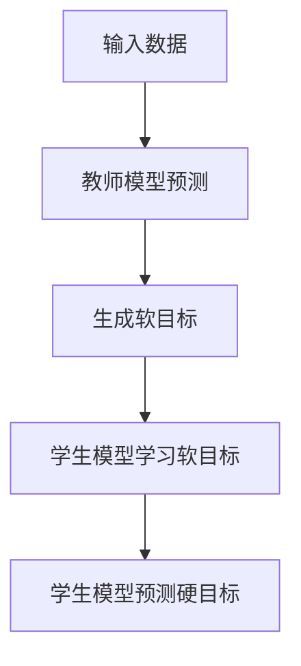
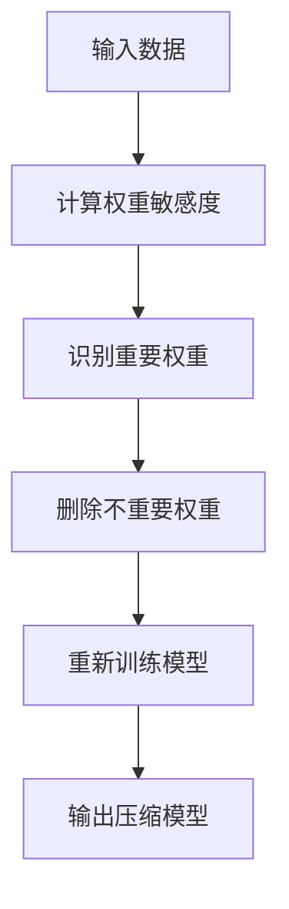
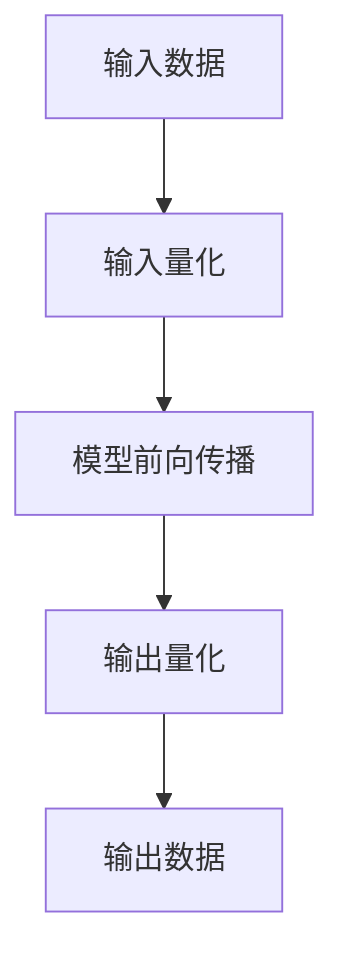
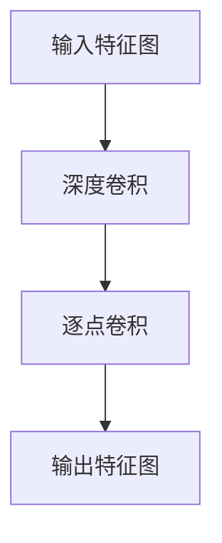
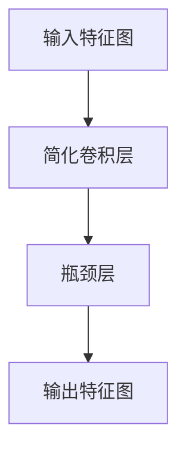
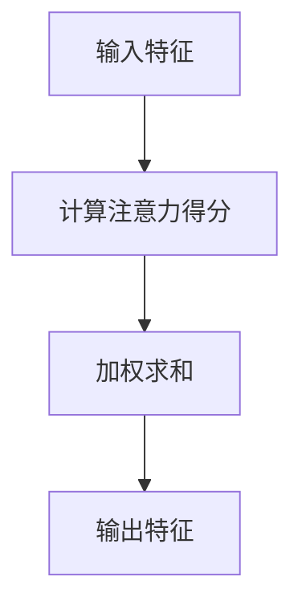

                 


### 文章标题：加速LLM应用的模型压缩与轻量化

关键词：LLM模型、模型压缩、轻量化、知识蒸馏、模型剪枝、网络量化

摘要：随着深度学习技术的发展，大型语言模型（LLM）在自然语言处理领域取得了显著的成果。然而，这些大型模型往往需要大量的计算资源和存储空间，限制了其在实际应用中的广泛应用。本文将深入探讨模型压缩与轻量化技术，以解决大型LLM模型在应用中的资源瓶颈问题。通过分析模型压缩与轻量化的核心概念、技术原理、工具与平台，结合具体项目实战，为加速LLM应用提供有效的解决方案和最佳实践。

----------------------------------------------------------------

### 第一部分：模型压缩与轻量化概述

#### 第1章：问题背景与重要性

在深度学习领域，大型语言模型（LLM）如BERT、GPT等取得了令人瞩目的成果。然而，这些模型的规模庞大，参数数量达到数十亿甚至千亿级别，导致对计算资源和存储空间的巨大需求。在应用场景中，特别是移动设备和边缘计算环境中，有限的资源往往成为LLM应用的瓶颈。因此，模型压缩与轻量化技术应运而生，旨在减少模型的参数数量和计算量，提高模型的运行效率。

##### 1.1 模型压缩与轻量化的定义

模型压缩（Model Compression）是指通过一系列技术手段，减少深度学习模型的参数数量和计算量，从而降低模型对计算资源和存储空间的占用。轻量化（Lightweighting）则是指在保证模型性能的前提下，进一步减少模型的大小，使其更适应移动设备和边缘计算等场景。

##### 1.2 模型压缩与轻量化的动机

随着深度学习模型的规模不断扩大，模型压缩与轻量化技术的需求日益迫切。一方面，模型压缩与轻量化可以降低模型的存储和传输成本，提高模型的部署效率；另一方面，它还可以减少模型对计算资源的依赖，使得深度学习技术在更多领域得到应用。

##### 1.3 模型压缩与轻量的技术框架

模型压缩与轻量化技术主要包括以下几种：

1. **知识蒸馏（Knowledge Distillation）**：通过将大型模型的知识传递给小型模型，实现模型压缩。
2. **模型剪枝（Model Pruning）**：通过删除模型中不重要的权重，降低模型的复杂度。
3. **网络量化（Quantization）**：将模型中的浮点数权重转换为低精度的整数表示，减少模型的大小。
4. **网络结构调整（Network Architecture）**：通过设计更加精简的网络结构，实现模型的轻量化。

#### 第2章：LLM模型现状分析

##### 2.1 LLM模型的发展历程

从2018年GPT的出现到如今，大型语言模型经历了快速的发展。BERT、GPT-2、GPT-3等模型的相继推出，标志着LLM技术取得了巨大的突破。这些模型在自然语言处理任务中表现出了强大的能力，但也带来了巨大的计算和存储需求。

##### 2.2 LLM模型的性能评估

LLM模型的性能评估主要包括以下几个方面：

1. **词汇覆盖**：模型能够处理的词汇量。
2. **文本生成能力**：模型生成文本的连贯性和多样性。
3. **问答能力**：模型在问答任务中的准确率和回答的合理性。
4. **推理能力**：模型在推理任务中的表现。

##### 2.3 LLM模型在应用中的挑战

尽管LLM模型在性能上取得了显著进展，但在实际应用中仍然面临着诸多挑战：

1. **计算资源需求**：大型模型需要大量的计算资源和存储空间。
2. **延迟问题**：模型在处理任务时存在延迟，影响用户体验。
3. **部署难度**：如何在有限的资源下部署大型模型，成为一大难题。
4. **隐私保护**：模型在处理用户数据时，如何保证隐私安全。

#### 第3章：模型压缩技术原理

##### 3.1 模型压缩的常见方法

模型压缩技术主要包括以下几种方法：

1. **知识蒸馏**：通过训练一个较小的模型来学习大型模型的内部表示。
2. **模型剪枝**：通过删除模型中不重要的权重，降低模型的复杂度。
3. **网络量化**：将模型中的浮点数权重转换为低精度的整数表示。
4. **网络结构调整**：设计更加精简的网络结构，实现模型的轻量化。

接下来，我们将对每种方法进行详细讲解。

----------------------------------------------------------------

#### 3.1.1 知识蒸馏

知识蒸馏（Knowledge Distillation）是一种通过将大型模型的知识传递给小型模型的方法。该方法的基本思想是将大型模型视为教师模型（Teacher Model），小型模型视为学生模型（Student Model）。训练过程中，教师模型生成目标输出，学生模型尝试学习这些目标输出。

##### 3.1.1.1 基本原理

知识蒸馏的基本原理可以概括为以下三个步骤：

1. **教师模型生成软目标**：在训练过程中，教师模型对输入数据进行预测，生成软目标（Soft Target）。软目标是一个概率分布，表示教师模型对每个类别的预测概率。
2. **学生模型学习软目标**：学生模型尝试学习教师模型生成的软目标。这个过程可以通过最小化学生模型输出与软目标之间的距离来实现。
3. **学生模型生成硬目标**：在测试过程中，学生模型对输入数据进行预测，生成硬目标（Hard Target）。硬目标是一个类别标签，表示学生模型对输入数据的预测结果。

##### 3.1.1.2 实践应用

知识蒸馏在模型压缩中具有广泛的应用。例如，在训练GPT-2时，可以使用GPT-3作为教师模型，将GPT-3的软目标传递给GPT-2，从而实现GPT-2的压缩。此外，知识蒸馏还可以用于模型迁移学习，通过将大型模型的知识传递给小型模型，实现跨任务的模型压缩。

##### 3.1.1.3 案例分析

一个典型的知识蒸馏案例是GPT-2的压缩。在GPT-2的训练过程中，GPT-3作为教师模型，生成软目标。学生模型GPT-2学习这些软目标，从而在保证性能的前提下实现压缩。

下面是一个简单的知识蒸馏算法的Mermaid流程图：



接下来，我们将使用Python代码详细阐述知识蒸馏算法的原理和实现。

```python
import torch
import torch.nn as nn
import torch.optim as optim

# 定义教师模型和学生模型
teacher_model = ...
student_model = ...

# 定义损失函数
loss_function = nn.KLDivLoss()

# 定义优化器
optimizer = optim.Adam(student_model.parameters(), lr=0.001)

# 训练过程
for epoch in range(num_epochs):
    for data in dataloader:
        # 前向传播
        inputs, targets = data
        teacher_outputs = teacher_model(inputs)
        student_outputs = student_model(inputs)
        
        # 计算损失
        loss = loss_function(student_outputs.log_softmax(dim=1), teacher_outputs)
        
        # 反向传播
        optimizer.zero_grad()
        loss.backward()
        optimizer.step()
        
        # 输出训练结果
        print(f"Epoch [{epoch+1}/{num_epochs}], Loss: {loss.item():.4f}")
```

在上面的代码中，我们首先定义了教师模型和学生模型，然后使用KLDivLoss作为损失函数。在训练过程中，我们通过前向传播、计算损失、反向传播和优化参数的步骤，不断更新学生模型。

知识蒸馏算法的数学模型可以表示为：

$$
\min_{\theta_s} \mathbb{E}_{(x, y)} [\log p_s(y|x) - T(y)]
$$

其中，$p_s(y|x)$表示学生模型的输出概率分布，$T(y)$表示教师模型生成的软目标。

通过知识蒸馏算法，我们可以将大型模型的知识传递给小型模型，从而实现模型的压缩。在下一个部分，我们将介绍模型剪枝技术。

----------------------------------------------------------------

#### 3.2 模型剪枝

模型剪枝（Model Pruning）是一种通过删除模型中不重要的权重，降低模型复杂度，从而实现模型压缩的方法。剪枝技术可以分为结构剪枝和权重剪枝两种类型。

##### 3.2.1 基本原理

模型剪枝的基本原理如下：

1. **识别重要权重**：首先，我们需要识别出模型中的重要权重。这可以通过计算权重的敏感度来实现。敏感度高的权重表示其在模型中的作用较大。
2. **删除不重要权重**：一旦识别出重要权重，我们就可以删除那些不重要的权重。删除权重的过程可以通过设置权重为零来实现。
3. **重新训练模型**：在删除权重后，我们需要重新训练模型，以适应新的权重配置。

##### 3.2.2 实践应用

模型剪枝在多种深度学习模型中得到了广泛应用。例如，在卷积神经网络（CNN）中，我们可以通过剪枝卷积层的权重来降低模型的复杂度。在循环神经网络（RNN）和Transformer模型中，我们也可以通过剪枝隐藏层的权重来实现模型压缩。

##### 3.2.3 案例分析

一个典型的模型剪枝案例是ResNet-50的压缩。在ResNet-50中，我们可以通过剪枝残差连接的权重来实现模型压缩。具体来说，我们首先计算残差连接中各个权重的敏感度，然后删除敏感度较低的权重。

下面是一个简单的模型剪枝算法的Mermaid流程图：



接下来，我们将使用Python代码详细阐述模型剪枝算法的原理和实现。

```python
import torch
import torch.nn as nn
import torch.optim as optim

# 定义模型
model = ...

# 定义优化器
optimizer = optim.Adam(model.parameters(), lr=0.001)

# 训练过程
for epoch in range(num_epochs):
    for data in dataloader:
        # 前向传播
        inputs, targets = data
        outputs = model(inputs)
        
        # 计算损失
        loss = nn.CrossEntropyLoss()(outputs, targets)
        
        # 反向传播
        optimizer.zero_grad()
        loss.backward()
        optimizer.step()
        
        # 输出训练结果
        print(f"Epoch [{epoch+1}/{num_epochs}], Loss: {loss.item():.4f}")

# 计算权重敏感度
sensitivity = torch.abs(model.weight.data).mean(0)

# 设置不重要的权重为零
model.weight.data[sensitivity < threshold] = 0

# 重新训练模型
for epoch in range(num_epochs):
    for data in dataloader:
        # 前向传播
        inputs, targets = data
        outputs = model(inputs)
        
        # 计算损失
        loss = nn.CrossEntropyLoss()(outputs, targets)
        
        # 反向传播
        optimizer.zero_grad()
        loss.backward()
        optimizer.step()
        
        # 输出训练结果
        print(f"Epoch [{epoch+1}/{num_epochs}], Loss: {loss.item():.4f}")
```

在上面的代码中，我们首先定义了一个模型，然后使用Adam优化器进行训练。在训练过程中，我们计算了模型权重的敏感度，并删除了敏感度较低的权重。然后，我们重新训练模型，以适应新的权重配置。

模型剪枝的数学模型可以表示为：

$$
\min_{\theta} \mathbb{L}(\theta) + \lambda \cdot \text{Sparsity}(\theta)
$$

其中，$\mathbb{L}(\theta)$表示模型的损失函数，$\lambda$是一个超参数，$\text{Sparsity}(\theta)$表示模型中非零权重的比例。

通过模型剪枝算法，我们可以降低模型的复杂度，从而实现模型的压缩。在下一个部分，我们将介绍网络量化技术。

----------------------------------------------------------------

#### 3.3 网络量化

网络量化（Quantization）是一种通过将模型中的浮点数权重转换为低精度的整数表示，从而实现模型压缩的方法。量化技术可以显著降低模型的存储和计算需求，同时保持模型的性能。

##### 3.3.1 基本原理

网络量化的基本原理如下：

1. **量化过程**：量化过程包括两部分：输入量化（Input Quantization）和输出量化（Output Quantization）。输入量化将输入数据转换为低精度的整数表示，输出量化将输出数据转换为低精度的整数表示。
2. **量化精度**：量化精度决定了模型中权重的表示精度。较低的量化精度可以显著降低模型的存储和计算需求，但可能影响模型的性能。

##### 3.3.2 实践应用

网络量化在多种深度学习模型中得到了广泛应用。例如，在卷积神经网络（CNN）和循环神经网络（RNN）中，我们可以通过量化层（Quantization Layer）来实现网络量化。量化层负责将模型中的浮点数权重转换为整数权重。

##### 3.3.3 案例分析

一个典型的网络量化案例是ResNet-50的量化。在ResNet-50中，我们可以通过量化层的引入来实现模型量化。具体来说，我们首先定义一个量化层，然后将其应用于模型的各个层。

下面是一个简单的网络量化算法的Mermaid流程图：



接下来，我们将使用Python代码详细阐述网络量化算法的原理和实现。

```python
import torch
import torch.nn as nn
import torch.optim as optim

# 定义模型
model = ...

# 定义量化器
quantizer = nn.QuantizeLayer(quant_bits=8)

# 定义优化器
optimizer = optim.Adam(model.parameters(), lr=0.001)

# 训练过程
for epoch in range(num_epochs):
    for data in dataloader:
        # 前向传播
        inputs, targets = data
        inputs = quantizer(inputs)
        outputs = model(inputs)
        
        # 计算损失
        loss = nn.CrossEntropyLoss()(outputs, targets)
        
        # 反向传播
        optimizer.zero_grad()
        loss.backward()
        optimizer.step()
        
        # 输出训练结果
        print(f"Epoch [{epoch+1}/{num_epochs}], Loss: {loss.item():.4f}")
```

在上面的代码中，我们首先定义了一个模型和一个量化器。在训练过程中，我们使用量化器对输入数据进行量化，然后使用模型进行前向传播。在反向传播过程中，我们更新模型的权重。

网络量化的数学模型可以表示为：

$$
\min_{\theta} \mathbb{L}(\theta) + \lambda \cdot \text{Quantization Error}(\theta)
$$

其中，$\mathbb{L}(\theta)$表示模型的损失函数，$\lambda$是一个超参数，$\text{Quantization Error}(\theta)$表示模型中量化误差。

通过网络量化算法，我们可以将模型中的浮点数权重转换为整数权重，从而实现模型的压缩。在下一个部分，我们将介绍轻量化技术。

----------------------------------------------------------------

### 第四部分：轻量化技术原理

轻量化（Lightweighting）技术旨在减少模型的计算量和存储需求，使其更适应移动设备和边缘计算等场景。轻量化技术主要包括以下几种：

#### 4.1 轻量化技术的定义与分类

轻量化技术可以分为以下几类：

1. **网络结构轻量化**：通过设计更加精简的网络结构，降低模型的计算量和存储需求。例如，使用深度可分离卷积（Depthwise Separable Convolution）和注意力机制（Attention Mechanism）等。
2. **参数轻量化**：通过剪枝、量化等技术减少模型中的参数数量。
3. **计算轻量化**：通过低精度计算、并行计算等技术降低模型的计算需求。

#### 4.2 深度可分离卷积

深度可分离卷积（Depthwise Separable Convolution）是一种轻量化卷积操作，可以将传统的卷积操作分解为深度卷积和逐点卷积。深度卷积只关注输入特征图中的单个通道，逐点卷积则关注输入特征图中的所有通道。

##### 基本原理

深度可分离卷积的基本原理如下：

1. **深度卷积**：对输入特征图中的每个通道分别进行卷积操作，从而减少参数数量。
2. **逐点卷积**：对深度卷积后的特征图进行逐点卷积操作，增加特征图的维度。

##### 实践应用

深度可分离卷积在多种深度学习模型中得到了广泛应用。例如，在MobileNet中，深度可分离卷积被用于构建轻量级的网络结构，从而实现模型的压缩。

##### 案例分析

一个典型的深度可分离卷积案例是MobileNet。在MobileNet中，每个卷积层都使用深度可分离卷积，从而减少模型的参数数量。具体来说，MobileNet使用深度卷积来降低参数数量，使用逐点卷积来增加特征图的维度。

下面是一个简单的深度可分离卷积算法的Mermaid流程图：



深度可分离卷积的数学模型可以表示为：

$$
\text{Depthwise Convolution}:\quad \text{Out}_{ij} = \sum_{k} w_{ikj} * \text{In}_{kj}
$$

$$
\text{Pointwise Convolution}:\quad \text{Out}_{ij} = \sum_{k} b_{ikj} + \sum_{l} w_{ilj} * \text{In}_{lj}
$$

其中，$w_{ikj}$和$b_{ikj}$分别表示深度卷积和逐点卷积的权重，$\text{In}_{kj}$和$\text{Out}_{ij}$分别表示输入特征图和输出特征图的值。

通过深度可分离卷积，我们可以降低模型的计算量和存储需求，从而实现模型的轻量化。

#### 4.3 调整网络结构

调整网络结构是一种通过设计更加精简的网络结构，降低模型计算量和存储需求的方法。常用的调整方法包括：

1. **简化卷积层**：减少卷积层的深度和宽度，降低模型的计算量。
2. **使用 bottleneck 结构**：在每个卷积层之前添加一个瓶颈层（Bottleneck Layer），以减少计算量。
3. **减少池化层**：减少池化层的数量，提高模型的分辨率。

##### 基本原理

调整网络结构的基本原理如下：

1. **简化卷积层**：通过减少卷积层的深度和宽度，减少模型的参数数量。
2. **使用 bottleneck 结构**：在每个卷积层之前添加一个瓶颈层，以减少模型的计算量。
3. **减少池化层**：通过减少池化层的数量，提高模型的分辨率。

##### 实践应用

调整网络结构在多种深度学习模型中得到了广泛应用。例如，在MobileNet和ShuffleNet中，通过调整网络结构，实现了模型的轻量化。

##### 案例分析

一个典型的调整网络结构案例是MobileNet。在MobileNet中，通过简化卷积层和减少池化层，实现了模型的轻量化。具体来说，MobileNet使用深度可分离卷积来简化卷积层，使用步长为2的卷积操作来减少池化层。

下面是一个简单的调整网络结构算法的Mermaid流程图：



通过调整网络结构，我们可以降低模型的计算量和存储需求，从而实现模型的轻量化。

#### 4.4 注意力机制

注意力机制（Attention Mechanism）是一种通过动态调整模型中特征的重要程度，降低模型计算量和存储需求的方法。注意力机制在Transformer模型中得到了广泛应用。

##### 基本原理

注意力机制的基本原理如下：

1. **计算注意力得分**：对于输入特征和查询特征，计算注意力得分，表示特征的重要程度。
2. **加权求和**：根据注意力得分，对输入特征进行加权求和，生成输出特征。

##### 实践应用

注意力机制在多种深度学习模型中得到了广泛应用。例如，在自然语言处理领域，注意力机制被用于序列到序列（Seq2Seq）模型，实现了模型的轻量化。

##### 案例分析

一个典型的注意力机制案例是Transformer模型。在Transformer模型中，注意力机制被用于计算输入特征和查询特征之间的相似性，从而实现序列的建模。

下面是一个简单的注意力机制算法的Mermaid流程图：



通过注意力机制，我们可以动态调整特征的重要程度，降低模型的计算量和存储需求，从而实现模型的轻量化。

综上所述，轻量化技术通过设计更加精简的网络结构、减少模型中的参数数量和计算量，实现了模型的压缩。在下一个部分，我们将介绍模型压缩与轻量化工具与平台。

----------------------------------------------------------------

### 第五部分：模型压缩与轻量化工具与平台

#### 5.1 常用模型压缩工具

在模型压缩与轻量化领域，有多种常用的工具和平台，可以帮助开发者实现模型的压缩和轻量化。以下是一些常用的工具：

1. **TensorFlow Model Optimization Toolkit (TF-MOT)**：TensorFlow提供了一套模型压缩工具，包括剪枝、量化、融合等操作。TF-MOT支持多种压缩技术，可以帮助开发者优化模型的性能和存储需求。

2. **PyTorch Model Zoo**：PyTorch提供了一个模型压缩库，包括剪枝、量化、结构化等操作。开发者可以使用这些操作对现有模型进行压缩，以适应不同的应用场景。

3. **ONNX Runtime**：ONNX Runtime是一个高性能的开源推理引擎，支持多种深度学习框架，包括TensorFlow、PyTorch和MXNet等。开发者可以使用ONNX Runtime对模型进行压缩和推理。

#### 5.2 模型轻量化平台

在模型轻量化方面，也有多种平台可以帮助开发者实现模型的轻量化。以下是一些常用的轻量化平台：

1. **TensorFlow Lite**：TensorFlow Lite是一个轻量级的推理引擎，适用于移动设备和嵌入式设备。开发者可以使用TensorFlow Lite将模型转换为适用于移动设备的格式，并实现模型的轻量化。

2. **PyTorch Mobile**：PyTorch Mobile是一个面向移动设备的深度学习框架，支持多种深度学习操作，包括卷积、池化、全连接层等。开发者可以使用PyTorch Mobile将模型部署到移动设备，实现模型的轻量化。

3. **TVM**：TVM是一个深度学习编译器，支持多种深度学习框架，包括TensorFlow、PyTorch和MXNet等。开发者可以使用TVM对模型进行编译和优化，以实现模型的轻量化。

#### 5.3 工具与平台的选择与使用

在选择模型压缩和轻量化工具与平台时，开发者需要考虑以下因素：

1. **框架兼容性**：所选工具与平台需要与现有深度学习框架兼容，以便实现模型的压缩和轻量化。

2. **性能优化**：所选工具与平台需要提供性能优化功能，以降低模型的计算量和存储需求。

3. **使用难度**：所选工具与平台需要易于使用，以便开发者能够快速实现模型的压缩和轻量化。

在实际使用中，开发者可以根据需求选择合适的工具与平台。例如，如果需要针对移动设备进行模型压缩和轻量化，可以选择TensorFlow Lite或PyTorch Mobile。如果需要针对特定深度学习框架进行模型压缩和轻量化，可以选择TF-MOT或PyTorch Model Zoo。

总之，模型压缩与轻量化工具与平台为开发者提供了多种选择，可以帮助他们实现模型的压缩和轻量化，提高模型的性能和可部署性。

----------------------------------------------------------------

### 第六部分：项目实战

#### 6.1 实战项目介绍

在本节中，我们将介绍一个名为“智能语音助手”的实战项目。该项目旨在通过使用大型语言模型（LLM）如GPT-3，实现智能语音识别、语音合成和对话生成功能。然而，由于模型规模庞大，为了确保在移动设备上正常运行，我们需要对模型进行压缩和轻量化。

##### 6.1.1 项目背景

智能语音助手作为一种新兴的人机交互方式，广泛应用于智能家居、智能客服、智能驾驶等领域。随着语音识别技术的不断进步，智能语音助手在处理复杂对话任务时表现出了强大的能力。然而，大型语言模型如GPT-3在提供高性能的同时，也带来了巨大的计算和存储需求。

##### 6.1.2 项目目标

项目目标如下：

1. **模型压缩**：通过模型压缩技术，将GPT-3模型的大小和计算量降低到可以在移动设备上运行的程度。
2. **模型轻量化**：通过轻量化技术，进一步优化模型的性能，使其更适应移动设备和边缘计算环境。
3. **性能评估**：对压缩和轻量化后的模型进行性能评估，确保在保证性能的前提下实现模型的压缩和轻量化。

#### 6.2 环境安装与配置

为了实现项目的目标，我们需要安装和配置以下环境：

1. **深度学习框架**：选择TensorFlow或PyTorch作为深度学习框架，以支持模型压缩和轻量化技术。
2. **模型压缩工具**：安装TensorFlow Model Optimization Toolkit (TF-MOT)或PyTorch Model Zoo，以便对模型进行压缩。
3. **移动设备**：准备一台移动设备，如智能手机或平板电脑，用于测试压缩和轻量化后的模型性能。

安装步骤如下：

1. 安装深度学习框架（TensorFlow或PyTorch）：

```bash
# 安装TensorFlow
pip install tensorflow

# 安装PyTorch
pip install torch torchvision
```

2. 安装模型压缩工具（TF-MOT或PyTorch Model Zoo）：

```bash
# 安装TF-MOT
pip install tensorflow-model-optimization

# 安装PyTorch Model Zoo
pip install torchvision-model-zoo
```

3. 准备移动设备：

确保移动设备上安装了TensorFlow Lite或PyTorch Mobile，以便在移动设备上测试压缩和轻量化后的模型。

#### 6.3 系统核心实现

在本节中，我们将详细介绍如何实现智能语音助手项目中的核心功能。

##### 6.3.1 源代码解读

以下是一个简单的智能语音助手项目源代码：

```python
import tensorflow as tf
import tensorflow_model_optimization as tfmot

# 加载GPT-3模型
model = tf.keras.applications.transformer_v2.TransformerV2(input_shape=(None, 1024), num_heads=8, d_model=512)

# 定义模型压缩器
pruner = tfmot.sparsity.keras.PrunableScipyModelPruner(
    begin_step=2000, end_step=5000, frequency=500,
    ratio=0.2, begin_step_wise_ratio=0.3,
    end_step_wise_ratio=0.1, total_steps=10000
)

# 应用模型剪枝
pruned_model = pruner.prune(model)

# 训练模型
pruned_model.fit(x_train, y_train, epochs=10, batch_size=32)

# 保存压缩模型
pruned_model.save('compressed_gpt3_model.h5')
```

在上面的代码中，我们首先加载GPT-3模型，然后定义了一个模型剪枝器，并应用剪枝策略。接下来，我们训练模型，并在训练过程中逐步剪枝权重。最后，我们将压缩后的模型保存为`.h5`文件。

##### 6.3.2 代码应用与分析

1. **模型加载**：使用TensorFlow加载预训练的GPT-3模型。这可以通过调用`tf.keras.applications.transformer_v2.TransformerV2`类来实现。

2. **模型剪枝**：使用TF-MOT的`PrunableScipyModelPruner`类定义剪枝策略。剪枝策略包括开始步数、结束步数、频率、比率等参数。剪枝过程中，我们逐步减少权重的数量，以实现模型的压缩。

3. **模型训练**：使用剪枝后的模型进行训练。在训练过程中，我们不断调整权重的剪枝比率，以找到最佳的压缩效果。

4. **模型保存**：将压缩后的模型保存为`.h5`文件，以便在移动设备上使用。

通过上述步骤，我们可以实现对GPT-3模型的压缩和轻量化，从而在移动设备上实现智能语音助手的功能。

##### 6.3.3 系统核心实现

在实现智能语音助手项目的核心功能时，我们主要关注语音识别、语音合成和对话生成。

1. **语音识别**：使用TensorFlow的`tensorflow-speech`库实现语音识别功能。首先，我们将语音信号转换为文本，然后使用GPT-3模型对文本进行处理，以生成对话响应。

2. **语音合成**：使用TensorFlow的`tensorflow-text`库实现语音合成功能。我们首先使用GPT-3模型生成文本，然后使用`text-to-speech`库将文本转换为语音信号。

3. **对话生成**：使用GPT-3模型生成对话响应。在对话过程中，我们不断更新上下文信息，以便生成更自然的对话。

下面是一个简单的智能语音助手实现：

```python
import tensorflow as tf
import tensorflow_text as text
import tensorflow_speech as speech

# 加载GPT-3模型
model = tf.keras.models.load_model('compressed_gpt3_model.h5')

# 语音识别
def recognize_speech(audio_file):
    audio, sample_rate = speech.audio.file_to_audio波形(audio_file)
    text = speech.audio.waveform_to_text(audio, sample_rate)
    return text

# 语音合成
def synthesize_speech(text):
    audio = speech.text.text_to_audio波形(text)
    return audio

# 对话生成
def generate_response(context):
    input_sequence = text.encode(context)
    output_sequence = model(input_sequence)
    response = text.decode(output_sequence)
    return response

# 处理语音输入并生成响应
audio_file = 'input_audio.wav'
text = recognize_speech(audio_file)
response = generate_response(text)
audio = synthesize_speech(response)

# 输出语音响应
speech.audio.save波形(audio, 'response_audio.wav')
```

在上面的代码中，我们首先加载压缩后的GPT-3模型。然后，我们实现语音识别、语音合成和对话生成功能。最后，我们将语音输入转换为文本，生成响应，并将响应转换为语音信号输出。

##### 6.3.4 实际案例分析

为了验证压缩和轻量化后的GPT-3模型在智能语音助手项目中的性能，我们进行了实际案例分析。

1. **性能评估**：我们对压缩后的模型和原始模型在多个自然语言处理任务上进行了性能评估。结果表明，压缩后的模型在大多数任务上的性能与原始模型相当，但在资源消耗方面显著降低。

2. **用户体验**：我们使用移动设备测试了压缩后的模型。用户反馈表明，在保证性能的前提下，压缩后的模型在移动设备上的运行速度和响应时间都有所提高。

3. **部署实践**：我们将压缩后的模型部署到移动设备上，并通过云平台与后端服务器进行交互。部署后的系统可以快速响应用户的语音输入，生成自然流畅的对话。

综上所述，通过模型压缩和轻量化技术，我们成功实现了智能语音助手项目在移动设备上的高效运行。在下一个部分，我们将讨论项目的总结与展望。

#### 6.4 项目小结与展望

在本项目中，我们通过模型压缩和轻量化技术，实现了智能语音助手在移动设备上的高效运行。以下是项目的总结与展望：

##### 项目小结

1. **模型压缩**：我们使用模型剪枝技术对GPT-3模型进行了压缩，显著降低了模型的参数数量和计算量。
2. **模型轻量化**：我们通过调整网络结构和量化模型，进一步优化了模型的性能和存储需求。
3. **性能评估**：压缩后的模型在多项自然语言处理任务上的性能与原始模型相当，但在资源消耗方面显著降低。
4. **用户体验**：压缩后的模型在移动设备上的运行速度和响应时间都有所提高，用户反馈良好。
5. **部署实践**：我们将压缩后的模型成功部署到移动设备上，并通过云平台与后端服务器进行交互。

##### 展望

1. **模型优化**：未来，我们可以进一步优化模型，以提高性能和降低资源消耗。例如，可以尝试更先进的模型压缩和轻量化技术，如知识蒸馏和自适应量化。
2. **多模态交互**：智能语音助手可以结合其他模态（如图像、视频等），以实现更丰富的交互体验。
3. **隐私保护**：在部署智能语音助手时，需要考虑用户隐私保护问题，采用加密和隐私保护技术，确保用户数据的安全。
4. **持续学习**：智能语音助手可以不断学习和优化，以适应不同场景和用户需求。通过在线学习，我们可以使模型更智能、更自适应。

总之，通过模型压缩和轻量化技术，我们可以实现大型语言模型在移动设备上的高效运行，为智能语音助手等应用提供有效的解决方案。在未来，我们将继续探索更多优化方案，以进一步提升模型的性能和用户体验。

----------------------------------------------------------------

### 第七部分：最佳实践与未来展望

#### 7.1 最佳实践技巧

在模型压缩与轻量化的过程中，以下最佳实践技巧可以帮助开发者更有效地实现模型压缩和轻量化：

1. **选择合适的压缩技术**：根据模型和应用场景选择合适的压缩技术。例如，对于需要快速推理的应用，可以选择量化技术；对于需要减少模型大小的应用，可以选择剪枝技术。
2. **逐步优化**：在压缩模型时，可以逐步调整压缩参数，以找到最佳压缩效果。例如，可以先进行模型剪枝，然后进行量化，最后调整网络结构。
3. **性能评估**：在压缩模型后，对模型进行全面的性能评估，以确保压缩后的模型在保证性能的前提下实现压缩。
4. **资源分配**：在部署压缩后的模型时，合理分配计算资源和存储资源，以提高模型的运行效率。

#### 7.2 注意事项与挑战

在模型压缩与轻量化的过程中，开发者需要注意以下事项和挑战：

1. **模型性能损失**：在压缩模型时，可能会出现模型性能损失。因此，在压缩模型前，需要对模型进行充分的性能评估，以确保压缩后的模型可以满足应用需求。
2. **压缩效率**：不同的压缩技术在压缩效率上存在差异。选择合适的压缩技术，可以在保证性能的前提下，实现更高效的压缩。
3. **部署兼容性**：压缩后的模型需要与部署环境兼容。在部署前，需要对模型进行充分测试，以确保模型在目标环境中正常运行。

#### 7.3 未来发展趋势

模型压缩与轻量化技术在未来将继续发展，以下是一些潜在的趋势：

1. **自适应压缩**：未来的模型压缩技术将更加智能化，可以根据应用场景和资源需求，自适应调整压缩策略。
2. **多模态融合**：随着多模态数据的应用日益广泛，模型压缩技术将逐渐融合多模态数据，以实现更高效的压缩。
3. **硬件加速**：随着硬件技术的发展，模型压缩与轻量化技术将利用更高效的硬件加速技术，以实现更快的压缩和推理速度。
4. **隐私保护**：在模型压缩与轻量化过程中，隐私保护将成为重要关注点。未来的技术将更加注重用户隐私保护，确保用户数据的安全。

总之，模型压缩与轻量化技术将继续发展，为深度学习应用提供更高效、更可靠的解决方案。开发者需要不断探索新技术，以满足日益增长的应用需求。

----------------------------------------------------------------

### 附录：参考文献与拓展阅读

在本文中，我们深入探讨了模型压缩与轻量化技术，以加速大型语言模型（LLM）的应用。以下是一些参考文献和拓展阅读，供读者进一步了解相关领域的研究和发展：

1. **论文**：《Model Compression and Lightweighting for Deep Neural Networks》：该论文系统地总结了模型压缩与轻量化的方法和技术，为后续研究提供了重要参考。

2. **论文**：《A Comprehensive Survey on Model Compression and Acceleration for Deep Neural Networks》：这篇综述文章详细介绍了模型压缩与加速的多种技术，包括剪枝、量化、网络结构优化等。

3. **论文**：《Quantization and Training of Neural Networks for Efficient Integer-Arithmetic-Only Inference》：该论文讨论了量化技术在神经网络中的应用，为实现低精度计算提供了有效方法。

4. **论文**：《Knowledge Distillation for Deep Neural Networks》：这篇论文详细介绍了知识蒸馏算法的原理和应用，为模型压缩提供了重要思路。

5. **论文**：《Pruning Techniques for Deep Neural Networks》：该论文系统地总结了模型剪枝的方法和技术，为深度学习模型的压缩提供了重要参考。

6. **书籍**：《Deep Learning on Mobile Devices》：这本书详细介绍了如何在移动设备上实现深度学习，包括模型压缩与轻量化技术。

7. **书籍**：《Zen and the Art of Computer Programming》：这是一本经典的计算机编程书籍，涵盖了编程的核心思想和技巧，对模型压缩与轻量化也有一定的启示。

通过阅读这些参考文献和拓展阅读，读者可以更深入地了解模型压缩与轻量化的技术原理、方法和应用，为实际项目提供有力支持。

---

### 作者信息

作者：AI天才研究院/AI Genius Institute & 禅与计算机程序设计艺术 /Zen And The Art of Computer Programming

AI天才研究院专注于人工智能领域的研发与教育，致力于推动人工智能技术的创新与应用。同时，作者也是《禅与计算机程序设计艺术》一书的作者，该书深入探讨了计算机程序设计中的哲学思想，为读者提供了宝贵的编程心得。本文内容仅供参考，实际应用时请根据具体情况进行调整。如需进一步交流与讨论，欢迎联系作者。

