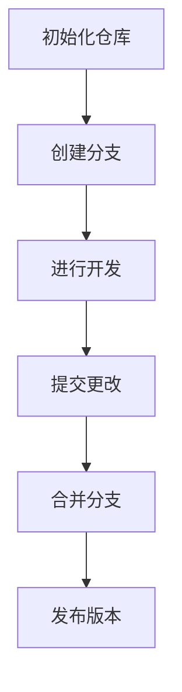
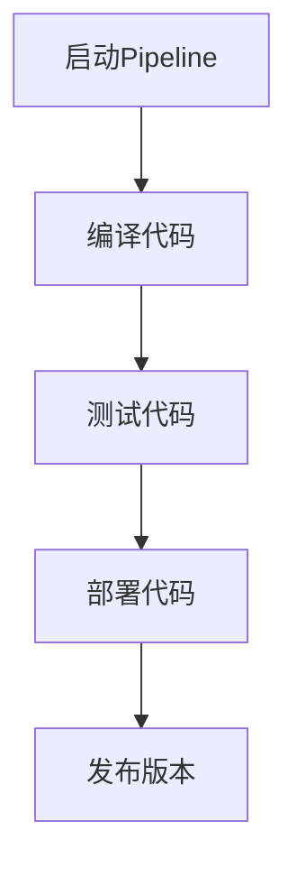
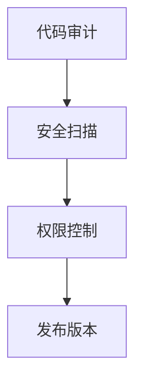
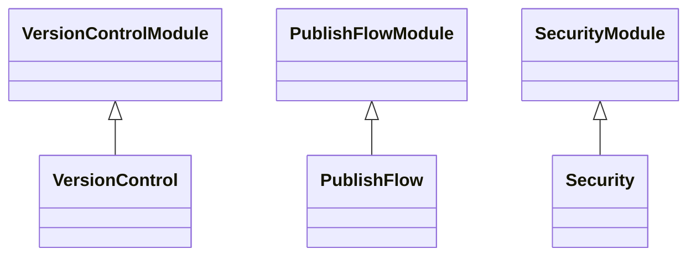
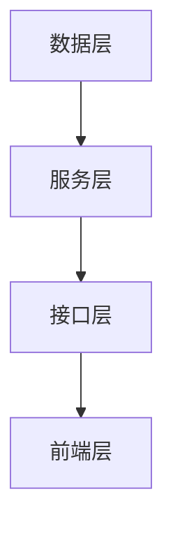
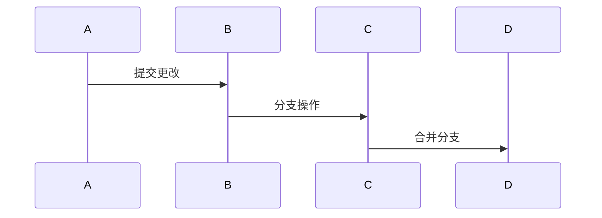
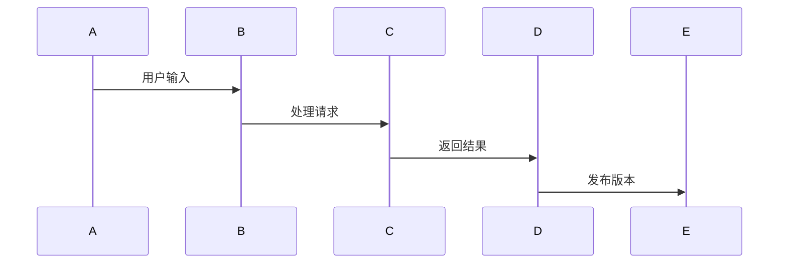

                 

# 加速LLM应用的版本控制与发布流程

> 关键词：大型语言模型，版本控制，发布流程，安全性，算法原理，系统架构设计

> 摘要：本文探讨了如何加速大型语言模型（LLM）应用的版本控制与发布流程。通过引入现代化的版本控制工具和发布流程，结合最佳实践和安全性考虑，设计了一个高效、安全的版本控制与发布流程，以保障LLM应用的稳定性和可靠性。

---

## 目录大纲

1. 第一部分：背景介绍与问题定义
    1.1 问题背景
    1.2 问题描述
    1.3 问题解决
    1.4 边界与外延
    1.5 概念结构与核心要素组成
2. 第二部分：核心概念与联系
    2.1 核心概念原理
    2.2 概念属性特征对比表格
    2.3 ER实体关系图架构
3. 第三部分：算法原理讲解
    3.1 版本控制算法原理
    3.2 发布流程算法原理
    3.3 安全性算法原理
4. 第四部分：系统分析与架构设计方案
    4.1 问题场景介绍
    4.2 项目介绍
    4.3 系统功能设计
    4.4 系统架构设计
    4.5 系统接口设计
    4.6 系统交互
5. 第五部分：项目实战
    5.1 环境安装
    5.2 系统核心实现源代码
    5.3 代码应用解读与分析
    5.4 实际案例分析和详细讲解剖析
    5.5 项目小结
6. 第六部分：最佳实践与注意事项
    6.1 最佳实践 tips
    6.2 小结
    6.3 注意事项
    6.4 拓展阅读

---

## 1. 第一部分：背景介绍与问题定义

### 1.1 问题背景

随着人工智能技术的飞速发展，大型语言模型（LLM）在自然语言处理、智能客服、内容生成等领域得到了广泛应用。LLM作为一种复杂的人工智能模型，其训练和部署过程涉及大量的计算资源和数据。版本控制和发布流程作为软件开发中的重要环节，对于LLM应用尤为重要。版本控制不当或发布流程不规范，可能导致模型性能下降、数据泄露、安全隐患等问题，影响整个应用的稳定性和可靠性。

### 1.2 问题描述

如何设计一个高效、安全的版本控制与发布流程，以确保LLM应用的稳定性、安全性和可靠性？

### 1.3 问题解决

通过引入现代化的版本控制工具和发布流程，结合最佳实践和安全性考虑，设计一个符合需求的版本控制与发布流程。

### 1.4 边界与外延

本章节主要讨论LLM应用的版本控制与发布流程，不涉及其他类型模型的相关问题。

### 1.5 概念结构与核心要素组成

- 版本控制：包括版本管理、变更追踪、版本发布等。
- 发布流程：包括开发、测试、部署、上线等环节。
- 安全性：确保模型在发布过程中不泄露敏感信息，防范潜在的安全威胁。

---

## 2. 第二部分：核心概念与联系

### 2.1 核心概念原理

#### 版本控制

版本控制是管理软件源代码、模型版本的一种机制，常用的版本控制系统有Git、SVN等。版本控制的主要功能包括：

- **版本管理**：记录每个版本的更改历史，方便回溯和复用。
- **变更追踪**：追踪代码或模型变更的细节，便于团队合作和问题定位。
- **版本发布**：将经过测试和验证的代码或模型发布到生产环境。

#### 发布流程

发布流程是指从开发到上线的一系列操作和步骤，通常包括：

- **开发**：编写代码或模型，进行功能开发和测试。
- **测试**：在测试环境中运行代码或模型，确保功能正常、性能达标。
- **部署**：将代码或模型部署到生产环境，进行上线操作。
- **上线**：将部署后的代码或模型对外提供服务。

#### 安全性

在发布过程中，安全性是至关重要的。安全性措施包括：

- **代码审计**：使用静态代码分析工具检测潜在的安全漏洞。
- **安全扫描**：使用安全扫描工具检测发布环境中的潜在威胁。
- **权限控制**：确保只有授权用户可以访问和修改代码和模型。

### 2.2 概念属性特征对比表格

| 特征       | 版本控制         | 发布流程         | 安全性         |
|------------|------------------|------------------|----------------|
| 目的       | 管理代码和模型版本 | 确保模型稳定上线 | 防范数据泄露和安全威胁 |
| 工具       | Git等版本控制系统 | Jenkins等发布工具 | 安全审计工具等     |
| 关联性     | 与代码管理紧密相关 | 与开发流程紧密相关 | 与安全性紧密相关    |

### 2.3 ER实体关系图架构

```mermaid
erDiagram
  版本控制 --> 发布流程 : 实现
  发布流程 --> 安全性 : 确保
  版本控制 --> 安全性 : 确保
```

---

## 3. 第三部分：算法原理讲解

### 3.1 版本控制算法原理

版本控制算法主要基于Git实现。Git是一种分布式版本控制系统，具有强大的分支管理和变更追踪功能。以下是Git的基本概念和操作：

#### 3.1.1 Git的基本概念

- **commit**：对代码或模型的更改进行提交，生成新的版本。
- **branch**：创建一个新的分支，用于独立开发和测试。
- **merge**：将一个分支的更改合并到主分支，生成新的版本。

#### 3.1.2 Git的基本操作

- **初始化仓库**：创建一个新的Git仓库，用于存储代码或模型。
- **创建分支**：从主分支创建一个新的分支，进行独立开发和测试。
- **提交更改**：将代码或模型的更改提交到分支，生成新的版本。
- **合并分支**：将分支的更改合并到主分支，生成新的版本。
- **发布版本**：将经过测试和验证的版本发布到生产环境。

#### 3.1.3 Git的mermaid流程图



### 3.2 发布流程算法原理

发布流程算法主要基于Jenkins实现。Jenkins是一种开源的自动化工具，支持多种插件，可以方便地实现从开发到上线的自动化流程。以下是Jenkins的基本概念和操作：

#### 3.2.1 Jenkins的基本概念

- **Job**：一个Jenkins任务，包括构建、部署等步骤。
- **Pipeline**：Jenkins的流水线功能，定义一系列操作的执行顺序。

#### 3.2.2 Jenkins的基本操作

- **启动Pipeline**：定义Jenkins任务，并启动执行。
- **编译代码**：编译代码，确保代码正确无误。
- **测试代码**：在测试环境中运行代码，确保功能正常、性能达标。
- **部署代码**：将代码部署到生产环境。
- **发布版本**：将部署后的代码对外提供服务。

#### 3.2.3 Jenkins的mermaid流程图



### 3.3 安全性算法原理

安全性算法主要基于静态代码分析和安全扫描实现。以下是安全性算法的基本概念和操作：

#### 3.3.1 基本概念

- **静态代码分析**：使用静态代码分析工具对代码进行分析，检测潜在的安全漏洞。
- **安全扫描**：使用安全扫描工具对发布环境进行扫描，检测潜在的安全威胁。

#### 3.3.2 基本操作

- **代码审计**：使用静态代码分析工具对代码进行审计，发现潜在的安全漏洞。
- **安全扫描**：使用安全扫描工具对发布环境进行扫描，发现潜在的安全威胁。
- **权限控制**：确保只有授权用户可以访问和修改代码和模型。

#### 3.3.3 安全性mermaid流程图



---

## 4. 第四部分：系统分析与架构设计方案

### 4.1 问题场景介绍

假设某企业开发了一个基于LLM的智能客服系统，需要实现高效的版本控制和发布流程，以确保系统的稳定性和安全性。

### 4.2 项目介绍

某企业开发了一个基于大型语言模型（LLM）的智能客服系统，该系统具备以下功能：

- **文本理解**：理解用户输入的文本信息。
- **意图识别**：识别用户的意图，如咨询、投诉等。
- **知识库查询**：查询相关领域的知识库，为用户提供准确的信息。
- **自动回复**：根据用户的意图和知识库信息，生成自动回复。

### 4.3 系统功能设计

系统功能设计主要分为以下几个模块：

- **版本控制模块**：负责管理LLM模型的版本，包括提交、分支、合并等操作。
- **发布流程模块**：负责从开发到上线的整个过程，包括编译、测试、部署等步骤。
- **安全性模块**：负责确保模型在发布过程中不泄露敏感信息，防范潜在的安全威胁。

#### 4.3.1 领域模型mermaid类图



### 4.4 系统架构设计

系统架构设计主要分为以下几个层次：

- **数据层**：存储LLM模型和相关数据，如知识库、用户输入等。
- **服务层**：提供智能客服的核心功能，如文本理解、意图识别等。
- **接口层**：对外提供API接口，供其他系统调用。
- **前端层**：提供用户界面，供用户与智能客服系统交互。

#### 4.4.1 系统架构mermaid架构图



### 4.5 系统接口设计

系统接口设计主要分为以下几个接口：

- **版本控制接口**：用于提交、分支、合并等版本控制操作。
- **发布流程接口**：用于编译、测试、部署等发布流程操作。
- **安全性接口**：用于代码审计、安全扫描、权限控制等安全性操作。

#### 4.5.1 系统接口mermaid序列图



### 4.6 系统交互

系统交互主要分为以下几个步骤：

1. 用户输入文本信息，前端将文本信息发送到接口层。
2. 接口层调用服务层的相关功能，如文本理解、意图识别等。
3. 服务层将处理结果返回给前端，前端将结果展示给用户。
4. 在发布过程中，版本控制模块和发布流程模块协同工作，确保模型稳定上线。

#### 4.6.1 系统交互mermaid序列图



---

## 5. 第五部分：项目实战

### 5.1 环境安装

在进行项目实战之前，需要安装以下软件：

- **Git**：版本控制系统。
- **Jenkins**：发布流程工具。
- **Docker**：容器化工具。

安装步骤如下：

1. 安装Git：`sudo apt-get install git`
2. 安装Jenkins：`sudo apt-get install jenkins`
3. 安装Docker：`sudo apt-get install docker`

### 5.2 系统核心实现源代码

以下是系统核心实现的部分源代码：

```python
# 版本控制模块
class VersionControl:
    def submit(self, commit_message):
        # 实现提交功能
        pass

    def branch(self, branch_name):
        # 实现分支功能
        pass

    def merge(self, source_branch, target_branch):
        # 实现合并功能
        pass

# 发布流程模块
class PublishFlow:
    def compile(self):
        # 实现编译功能
        pass

    def test(self):
        # 实现测试功能
        pass

    def deploy(self):
        # 实现部署功能
        pass

    def publish(self):
        # 实现发布功能
        pass

# 安全性模块
class Security:
    def audit(self):
        # 实现代码审计功能
        pass

    def scan(self):
        # 实现安全扫描功能
        pass

    def control(self):
        # 实现权限控制功能
        pass
```

### 5.3 代码应用解读与分析

以上代码定义了三个核心模块：版本控制模块、发布流程模块和安全性模块。以下是每个模块的功能解读：

#### 版本控制模块

- `submit`：实现提交功能，将代码或模型的更改提交到分支。
- `branch`：实现分支功能，从主分支创建新的分支。
- `merge`：实现合并功能，将分支的更改合并到主分支。

#### 发布流程模块

- `compile`：实现编译功能，编译代码或模型。
- `test`：实现测试功能，测试代码或模型。
- `deploy`：实现部署功能，将代码或模型部署到生产环境。
- `publish`：实现发布功能，发布经过测试和验证的版本。

#### 安全性模块

- `audit`：实现代码审计功能，使用静态代码分析工具检测潜在的安全漏洞。
- `scan`：实现安全扫描功能，使用安全扫描工具检测发布环境中的潜在威胁。
- `control`：实现权限控制功能，确保只有授权用户可以访问和修改代码和模型。

### 5.4 实际案例分析和详细讲解剖析

假设企业开发了一个基于LLM的智能客服系统，需要实现高效的版本控制和发布流程。以下是实际案例分析和详细讲解：

#### 案例一：版本控制

假设开发人员在开发过程中发现了一个bug，需要修复。以下是版本控制模块的调用过程：

1. 开发人员创建一个新的分支：`vc.branch('bugfix')`
2. 开发人员修复bug：`# 在bugfix分支上进行修复`
3. 开发人员提交更改：`vc.submit('修复bug')`
4. 开发人员将修复后的分支合并到主分支：`vc.merge('bugfix', 'master')`

#### 案例二：发布流程

假设修复后的bug已经经过测试，需要发布到生产环境。以下是发布流程模块的调用过程：

1. 编译代码：`pf.compile()`
2. 测试代码：`pf.test()`
3. 部署代码：`pf.deploy()`
4. 发布版本：`pf.publish()`

#### 案例三：安全性

假设在发布过程中，需要确保模型在发布过程中不泄露敏感信息。以下是安全性模块的调用过程：

1. 代码审计：`sc.audit()`
2. 安全扫描：`sc.scan()`
3. 权限控制：`sc.control()`

### 5.5 项目小结

通过以上实际案例分析和详细讲解，我们可以看到版本控制、发布流程和安全性在LLM应用中的重要作用。合理设计版本控制与发布流程，结合最佳实践和安全性考虑，可以有效提高LLM应用的稳定性和可靠性。

---

## 6. 第六部分：最佳实践与注意事项

### 6.1 最佳实践 tips

1. **版本控制**：定期提交代码和模型，保持代码库的整洁和一致性。
2. **发布流程**：制定明确的发布计划，确保发布过程的顺利进行。
3. **安全性**：进行代码审计和安全扫描，确保模型在发布过程中不泄露敏感信息。

### 6.2 小结

本文探讨了如何加速大型语言模型（LLM）应用的版本控制与发布流程。通过引入现代化的版本控制工具和发布流程，结合最佳实践和安全性考虑，设计了一个高效、安全的版本控制与发布流程，以保障LLM应用的稳定性和可靠性。

### 6.3 注意事项

1. **版本控制**：合理分配权限，确保团队协作和版本管理的一致性。
2. **发布流程**：制定详细的发布计划，确保各个环节的顺利进行。
3. **安全性**：采取有效的安全性措施，确保模型在发布过程中的安全。

### 6.4 拓展阅读

- [Git教程 - 廖雪峰](https://www.liaoxuefeng.com/wiki/896044410966032)
- [Jenkins教程 - 廖雪峰](https://www.liaoxuefeng.com/wiki/897224679452244)
- [大型语言模型：理论与实践 - 吴恩达](https://www.deeplearning.ai/)

---

## 作者信息

作者：AI天才研究院/AI Genius Institute & 禅与计算机程序设计艺术 /Zen And The Art of Computer Programming

