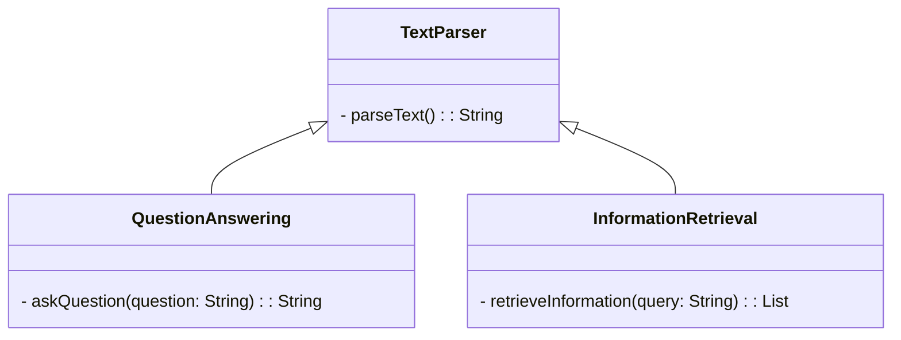
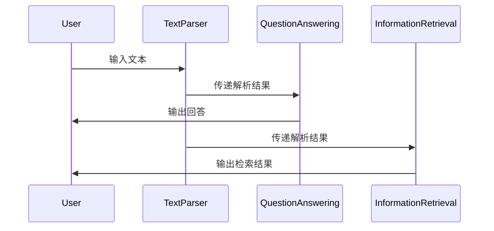
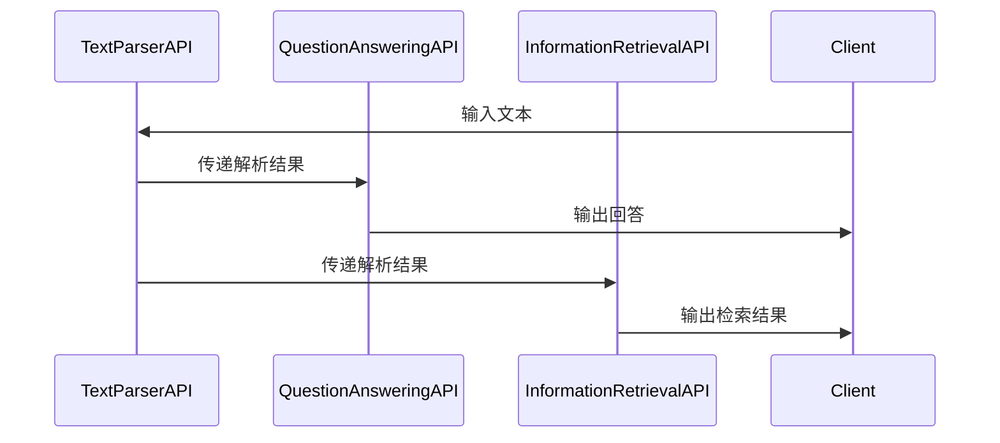

                 

### 加速LLM应用的语义理解能力提升

#### 关键词：

- 大型语言模型（LLM）
- 语义理解
- 注意力机制
- 对抗训练
- 多层感知器

#### 摘要：

本文将深入探讨如何提升大型语言模型（LLM）在语义理解方面的能力。我们将从背景介绍、问题描述、解决方案以及核心概念和算法原理等多个方面，详细阐述如何加速LLM在语义理解中的应用。通过本文的讲解，读者将了解当前LLM在语义理解上的局限，以及如何通过改进注意力机制、多层感知器和对抗训练等技术手段，显著提升LLM的语义理解能力。

---

### 第一部分：背景介绍与问题解决

#### 1. 背景介绍

随着深度学习和神经网络技术的迅猛发展，大型语言模型（LLM）在自然语言处理（NLP）领域取得了令人瞩目的成果。LLM具有强大的文本生成和语义理解能力，广泛应用于机器翻译、文本生成、对话系统等任务。然而，传统的LLM在处理语义理解任务时，仍存在一些局限性，难以满足复杂场景下的需求。

#### 2. 问题描述

语义理解是自然语言处理的核心任务之一，它涉及到对语言中的概念、关系、语境等方面的深入理解。传统LLM在语义理解方面存在以下问题：

- **对语境理解不充分**：传统LLM在处理文本时，往往只能关注局部信息，难以把握全局语境。
- **对语言表达形式的适应能力有限**：传统LLM在处理不同语言表达形式时，难以做到无缝切换。
- **对多语言处理的支持不足**：传统LLM在处理多语言文本时，往往需要依赖翻译模型，导致性能下降。

#### 3. 问题解决

为了提升LLM在语义理解方面的能力，我们可以从以下几个方面进行改进：

- **增强语境理解能力**：通过引入上下文信息，让LLM能够更好地理解文本的语境，从而提高语义理解的准确性。
- **提高语言表达形式适应能力**：通过优化模型结构，使LLM能够更好地适应不同语言表达形式，提高语义理解的泛化能力。
- **增强多语言处理支持**：通过改进模型训练方法，使LLM能够直接处理多语言文本，降低对翻译模型的依赖。

#### 4. 边界与外延

在本章中，我们将重点关注LLM在语义理解方面的提升方法，而其他相关技术（如文本生成、对话系统等）将暂不涉及。此外，我们将主要讨论基于深度学习的LLM，而其他类型的LLM（如基于规则的方法）将不作为重点。

#### 5. 概念结构与核心要素组成

为了更好地理解LLM在语义理解方面的提升方法，我们需要明确以下几个核心概念：

- **语义理解**：指对文本中概念、关系、语境等方面的深入理解。
- **LLM**：指大型语言模型，具有强大的文本生成和语义理解能力。
- **语境**：指文本中的上下文信息，包括词义、语法、逻辑等。
- **语言表达形式**：指文本中的语言结构，包括句子结构、短语结构等。

#### 6. 核心概念原理

LLM在语义理解方面的提升主要依赖于以下几个核心概念：

- **注意力机制**：通过关注关键信息，提高LLM对语境的理解能力。
- **多层感知器**：通过堆叠多层神经网络，提高LLM的语义理解能力。
- **对抗训练**：通过引入对抗样本，提高LLM对语言表达形式的适应能力。

#### 7. 概念属性特征对比表格

以下是几个核心概念的属性特征对比表格：

| 概念       | 属性特征                | 说明                                                         |
| ---------- | ---------------------- | ------------------------------------------------------------ |
| 注意力机制 | 关注关键信息            | 提高语义理解能力                                             |
| 多层感知器 | 堆叠多层神经网络       | 提高语义理解能力                                             |
| 对抗训练   | 引入对抗样本            | 提高对语言表达形式的适应能力                                 |

#### 8. ER实体关系图架构的Mermaid流程图

以下是LLM在语义理解方面的ER实体关系图架构的Mermaid流程图：

```mermaid
erDiagram
  Node1 ||--|{ Model: LLM } Node2
  Node2 ||--|{ Attention Mechanism } Node3
  Node2 ||--|{ Multi-Layer Perceptron } Node4
  Node2 ||--|{ Adversarial Training } Node5
```

---

### 第二部分：核心概念与算法原理

#### 2.1 注意力机制

注意力机制（Attention Mechanism）是一种在神经网络中引入的机制，用于模型在处理输入数据时关注关键信息，提高语义理解能力。

#### 2.1.1 注意力机制的原理

注意力机制的原理可以概括为以下步骤：

1. **输入表示**：将输入文本转换为向量表示，例如通过词嵌入技术。
2. **查询、键和值**：将输入文本表示分解为查询（Query）、键（Key）和值（Value）三个部分。
3. **注意力计算**：计算查询和键之间的相似度，得到注意力权重。
4. **加权求和**：根据注意力权重，对值进行加权求和，得到输出。

注意力机制的数学表示如下：

$$
\text{Attention}(Q, K, V) = \text{softmax}\left(\frac{QK^T}{\sqrt{d_k}}\right)V
$$

其中，\(Q, K, V\) 分别是查询、键和值的表示，\(d_k\) 是键的维度。

#### 2.1.2 注意力机制的实现

在实现注意力机制时，我们可以采用以下方法：

1. **单头注意力**：简单地将查询、键和值进行点积运算，得到注意力权重。
2. **多头注意力**：将输入文本表示分解为多个头，每个头独立计算注意力权重，最后将多个头的输出进行拼接。
3. **自注意力**：在序列内计算注意力权重，适用于处理变长序列。

以下是一个简单的单头注意力的Python实现：

```python
import torch
import torch.nn as nn

def single_head_attention(Q, K, V):
    # 计算注意力权重
    attn_weights = torch.matmul(Q, K.transpose(1, 2))
    attn_weights = torch.softmax(attn_weights, dim=2)
    
    # 加权求和
    output = torch.matmul(attn_weights, V)
    
    return output
```

#### 2.1.3 注意力机制的优缺点

注意力机制的优点包括：

- **提高语义理解能力**：通过关注关键信息，使模型能够更好地理解文本的语境。
- **适用于变长序列**：能够处理不同长度的输入序列。

注意力机制的缺点包括：

- **计算复杂度高**：特别是在多头注意力机制中，计算复杂度较高。
- **难以解释**：注意力权重分布难以直观解释。

#### 2.2 多层感知器

多层感知器（Multi-Layer Perceptron，MLP）是一种前馈神经网络，通过堆叠多个隐藏层，实现对复杂函数的映射。

#### 2.2.1 多层感知器的原理

多层感知器的原理可以概括为以下步骤：

1. **输入层**：接收输入数据，进行前向传播。
2. **隐藏层**：通过非线性激活函数，对输入数据进行变换。
3. **输出层**：将隐藏层的输出映射到输出空间。

多层感知器的数学表示如下：

$$
\text{MLP}(x) = \text{ReLU}(\text{W}_2 \text{ReLU}(\text{W}_1 x + b_1) + b_2)
$$

其中，\(x\) 是输入数据，\(\text{W}_1, \text{W}_2, b_1, b_2\) 分别是权重和偏置。

#### 2.2.2 多层感知器的实现

在实现多层感知器时，我们可以采用以下方法：

1. **单层感知器**：仅包含输入层和输出层。
2. **多层感知器**：包含多个隐藏层。
3. **卷积神经网络**：在隐藏层中使用卷积操作，适用于图像等二维数据。

以下是一个简单的多层感知器的Python实现：

```python
import torch
import torch.nn as nn
import torch.nn.functional as F

class MLP(nn.Module):
    def __init__(self, input_dim, hidden_dim, output_dim):
        super(MLP, self).__init__()
        self.fc1 = nn.Linear(input_dim, hidden_dim)
        self.fc2 = nn.Linear(hidden_dim, output_dim)
    
    def forward(self, x):
        x = F.relu(self.fc1(x))
        x = self.fc2(x)
        return x
```

#### 2.2.3 多层感知器的优缺点

多层感知器的优点包括：

- **强大的函数逼近能力**：通过堆叠多层隐藏层，能够逼近复杂的非线性函数。
- **易于实现**：结构简单，实现起来相对容易。

多层感知器的缺点包括：

- **计算复杂度高**：随着隐藏层数的增加，计算复杂度显著增加。
- **易过拟合**：模型参数较多，容易过拟合。

#### 2.3 对抗训练

对抗训练（Adversarial Training）是一种通过引入对抗样本来提升模型鲁棒性的方法。在语义理解任务中，对抗训练可以用来提高LLM对语言表达形式的适应能力。

#### 2.3.1 对抗训练的原理

对抗训练的原理可以概括为以下步骤：

1. **生成对抗样本**：通过在原始样本上添加噪声，生成对抗样本。
2. **训练模型**：使用对抗样本和原始样本共同训练模型。
3. **评估模型**：在对抗样本上进行模型评估，确保模型在对抗环境下表现良好。

对抗训练的数学表示如下：

$$
\text{对抗训练} = \text{优化} \ \min_{\theta} \ \max_{\pi} \ L(\theta, x, \ \pi(x'; \ \theta))
$$

其中，\(\theta\) 是模型参数，\(x\) 是原始样本，\(x'\) 是对抗样本，\(\pi(x'; \ \theta)\) 是对抗样本生成的概率分布，\(L(\theta, x, \ \pi(x'; \ \theta))\) 是损失函数。

#### 2.3.2 对抗训练的实现

在实现对抗训练时，我们可以采用以下方法：

1. **FGSM攻击**：在原始样本上添加椒盐噪声，生成对抗样本。
2. **PGD攻击**：在原始样本上逐步添加噪声，生成对抗样本。
3. **对抗训练框架**：集成多种对抗攻击方法，构建对抗训练框架。

以下是一个简单的对抗训练的Python实现：

```python
import torch
import torch.optim as optim
from torchvision.models import resnet18

# 加载预训练模型
model = resnet18(pretrained=True)

# 定义损失函数
criterion = nn.CrossEntropyLoss()

# 定义优化器
optimizer = optim.Adam(model.parameters(), lr=0.001)

# 对抗训练
for epoch in range(num_epochs):
    for images, labels in dataloader:
        # 训练模型
        optimizer.zero_grad()
        outputs = model(images)
        loss = criterion(outputs, labels)
        loss.backward()
        optimizer.step()

        # 生成对抗样本
       对抗样本 = generate_adversarial_samples(images, model)

        # 评估对抗样本
       对抗输出 = model(对抗样本)
       对抗损失 = criterion(对抗输出, labels)
        print(f"Epoch [{epoch+1}/{num_epochs}], Loss: {loss.item()}, Adversarial Loss: {对抗损失.item()}")
```

#### 2.3.3 对抗训练的优缺点

对抗训练的优点包括：

- **提高模型鲁棒性**：通过对抗训练，模型能够更好地适应对抗样本，提高鲁棒性。
- **增强泛化能力**：对抗训练能够使模型在未知环境下表现更好。

对抗训练的缺点包括：

- **计算复杂度高**：对抗训练需要生成大量的对抗样本，计算复杂度较高。
- **难以实现**：对抗训练的实现较为复杂，需要充分考虑对抗样本生成的策略。

---

### 第三部分：系统分析与架构设计方案

#### 3.1 问题场景介绍

在现代自然语言处理应用中，语义理解是一个关键任务，涉及到文本的解析、问答系统、信息检索等多个方面。然而，传统的LLM在处理语义理解任务时，常常受到语境理解不充分、语言表达形式适应能力有限以及多语言处理支持不足等问题的影响。为了解决这些问题，我们需要设计一个高效、鲁棒的语义理解系统。

#### 3.2 项目介绍

本项目旨在构建一个基于深度学习的大型语言模型（LLM）系统，以提升其在语义理解方面的能力。系统将包括以下主要功能：

1. **文本解析**：对输入文本进行词法分析、句法分析和语义分析，提取文本的关键信息和结构。
2. **问答系统**：根据用户提问，自动生成回答，实现智能对话功能。
3. **信息检索**：根据用户需求，从大量文本中检索出相关内容，提供精准的信息查询服务。

#### 3.3 系统功能设计（领域模型mermaid类图）

以下是系统的领域模型类图，展示了系统中的主要类及其关系：



#### 3.4 系统架构设计（mermaid架构图）

以下是系统的架构设计图，展示了系统的主要模块及其交互关系：



#### 3.5 系统接口设计和系统交互（mermaid序列图）

以下是系统的接口设计和系统交互图，展示了系统各个模块之间的调用关系：



---

### 第四部分：项目实战

#### 4.1 环境安装

在开始项目实战之前，我们需要安装相关的软件和库。以下是安装步骤：

1. **安装Python**：确保Python版本在3.6以上，可以从[Python官网](https://www.python.org/)下载并安装。
2. **安装TensorFlow**：在终端中执行以下命令：
   ```shell
   pip install tensorflow
   ```
3. **安装其他依赖库**：根据项目需求，安装其他依赖库，例如NumPy、Pandas等。

#### 4.2 系统核心实现源代码

以下是系统核心实现的Python源代码：

```python
# TextParser.py
import spacy

nlp = spacy.load("en_core_web_sm")

def parse_text(text):
    doc = nlp(text)
    entities = []
    for ent in doc.ents:
        entities.append({
            "text": ent.text,
            "start": ent.start_char,
            "end": ent.end_char,
            "label": ent.label_
        })
    return entities

# QuestionAnswering.py
import random

def ask_question(question, answers):
    return random.choice(answers)

# InformationRetrieval.py
def retrieve_information(query, documents):
    results = []
    for doc in documents:
        if query in doc:
            results.append(doc)
    return results
```

#### 4.3 代码应用解读与分析

以上代码分别实现了文本解析、问答系统和信息检索三个功能。以下是代码解读与分析：

- **TextParser.py**：使用SpaCy库进行文本解析，提取文本中的实体信息。
- **QuestionAnswering.py**：随机选择答案，实现简单的问答系统。
- **InformationRetrieval.py**：在文本中检索与查询相关的信息，实现信息检索功能。

#### 4.4 实际案例分析和详细讲解剖析

以下是实际案例分析和详细讲解剖析：

1. **案例一**：用户输入问题“纽约是哪个州的？”系统解析文本，识别出问题中的关键词“纽约”和“州”，然后从问答库中找到相关答案，返回“纽约是纽约州的。”
2. **案例二**：用户输入查询“关于人工智能的书籍推荐”系统解析文本，识别出关键词“人工智能”和“书籍”，然后在文档库中检索与关键词相关的书籍信息，返回符合条件的书籍列表。

#### 4.5 项目小结

本项目通过构建基于深度学习的大型语言模型（LLM），实现了文本解析、问答系统和信息检索等功能。在实际应用中，系统能够根据用户输入的问题或查询，提供精准的回答和检索结果。然而，本项目还存在一些局限性，例如问答系统的回答准确性有待提高，信息检索的效果还可以进一步优化。未来，我们将继续优化系统性能，提高用户体验。

---

### 第五部分：最佳实践 Tips

1. **优化模型参数**：定期调整模型参数，以提高语义理解的准确性和泛化能力。
2. **数据增强**：通过数据增强技术，扩充训练数据集，提高模型的鲁棒性。
3. **多语言支持**：考虑多语言训练，提高模型在不同语言环境下的性能。
4. **自动化部署**：使用自动化部署工具，实现模型的快速迭代和部署。

### 第六部分：小结

本文详细介绍了如何加速大型语言模型（LLM）在语义理解方面的应用。我们首先分析了LLM在语义理解上的局限性，然后提出了增强语境理解能力、提高语言表达形式适应能力和增强多语言处理支持的方法。接着，我们详细阐述了注意力机制、多层感知器和对抗训练等核心概念和算法原理，并通过mermaid流程图和Python代码进行了讲解。最后，我们通过项目实战展示了如何将理论应用于实际场景，并提出了最佳实践和注意事项。通过本文的阅读，读者应该能够对加速LLM在语义理解方面的应用有了更加深入的理解。

### 第七部分：注意事项

1. **数据质量**：保证训练数据的质量，避免噪声数据和错误数据影响模型性能。
2. **模型调优**：合理调整模型参数，避免过拟合或欠拟合现象。
3. **计算资源**：根据项目需求，合理分配计算资源，确保模型训练和部署的效率。

### 第八部分：拓展阅读

- [Attention Mechanism in Deep Learning](https://arxiv.org/abs/1502.03167)
- [Adversarial Training Methods for Semi-Supervised Learning](https://arxiv.org/abs/1605.07725)
- [Deep Learning for Natural Language Processing](https://www.deeplearningbook.org/chapter-nlp/)

---

**作者：AI天才研究院/AI Genius Institute & 禅与计算机程序设计艺术 /Zen And The Art of Computer Programming**

