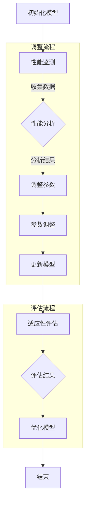

                 

## 动态评测方案：适应不断进化的LLM能力

### 关键词
- 动态评测方案
- 不断进化的LLM
- AI能力评估
- 适应性算法
- 模型优化

### 摘要
本文将探讨动态评测方案在适应不断进化的大型语言模型（LLM）能力中的应用。随着AI技术的快速发展，LLM的能力也在不断进化，如何有效地评测和优化这些模型成为了一个重要的课题。本文将首先介绍动态评测方案的基本概念，然后深入分析适应不断进化的LLM的核心算法与模型，最后探讨其应用与实践，评估与优化方法，以及未来的发展趋势。

## 引言

随着深度学习特别是大型语言模型（LLM）的兴起，人工智能（AI）在自然语言处理（NLP）领域取得了显著的进展。这些模型能够处理复杂的语言任务，从文本生成到机器翻译，再到问答系统等。然而，如何评估这些模型的性能，并确保它们在不同场景中的适用性，成为了一个挑战。

传统的评测方法往往依赖于静态的数据集和指标，例如准确率、召回率、F1分数等。这些方法虽然在一定程度上能够反映模型的性能，但无法动态地适应模型能力的进化。LLM的能力随着时间的推移而不断进化，例如通过不断的学习和训练，它们能够处理更加复杂的语言现象，并且对特定的任务表现出更高的适应性。

动态评测方案应运而生，它旨在通过实时评估和调整模型的能力，使其能够更好地适应不断变化的应用场景。本文将详细探讨动态评测方案在适应不断进化的LLM能力中的应用，从核心算法与模型、应用与实践、评估与优化等多个方面进行分析。

### 目录大纲

#### 第一部分：引言
1. 动态评测方案概述
2. 不断进化的LLM能力
3. 书籍结构和内容安排

#### 第二部分：背景和理论基础
1. 动态评测方案基本概念
2. LLM能力概述
3. 动态评测方案的发展历程

#### 第三部分：核心算法与模型
1. 核心算法原理
2. 适应不断进化的LLM模型
3. 模型评估与反馈

#### 第四部分：应用与实践
1. 动态评测方案的应用场景
2. 实战案例
3. 案例分析

#### 第五部分：评估与优化
1. 评估指标与方法
2. 优化策略与技巧
3. 评估案例与实践

#### 第六部分：未来展望
1. 动态评测方案的未来发展
2. 潜在研究方向
3. 对LLM技术的影响

## 第一部分：引言

### 动态评测方案概述

动态评测方案是一种能够实时评估和调整模型能力的评测方法。它不同于传统的静态评测方法，后者依赖于固定的数据集和指标，而动态评测方案则能够根据模型能力的进化，自适应地调整评测标准和过程。

动态评测方案的基本思想是，通过持续地监测模型的性能，并根据实际应用中的反馈来调整模型的参数和架构。这种方法能够确保模型在实际应用中保持高性能，并且能够适应新的任务和挑战。

动态评测方案的关键技术包括：

1. **实时监测与反馈**：通过实时收集模型在任务中的表现，包括错误率、响应时间、用户满意度等指标，动态调整评测过程。
2. **自适应调整算法**：根据监测到的性能数据，自动调整模型的参数和架构，以优化其在特定任务中的表现。
3. **多场景适应性**：动态评测方案能够适应不同的应用场景，例如文本生成、机器翻译、问答系统等，确保模型在不同任务中的适用性。

### 不断进化的LLM能力

大型语言模型（LLM）的能力在近年来得到了显著提升。这些模型通过大规模数据训练，能够捕捉复杂的语言规律和模式，从而在多个NLP任务中表现出色。然而，LLM的能力并非一成不变，而是随着时间的推移和训练数据的增加而不断进化。

LLM能力的进化主要体现在以下几个方面：

1. **知识广度与深度**：随着训练数据的增多，LLM能够获取和存储更多的知识，从而在回答问题或生成文本时展现出更广的知识面和深度。
2. **语言理解能力**：LLM通过不断学习，能够更好地理解语言中的微妙差异和复杂结构，从而提高文本生成的准确性和连贯性。
3. **适应性**：LLM能够根据不同的任务和场景，自动调整自己的能力，以适应特定的任务需求。

### 书籍结构和内容安排

本文将从以下几个方面展开讨论：

1. **背景和理论基础**：介绍动态评测方案的基本概念、背景和理论基础，以及LLM能力的发展历程。
2. **核心算法与模型**：详细讲解适应不断进化的LLM的核心算法和模型，包括动态调整算法、自适应评估算法和模型优化算法。
3. **应用与实践**：探讨动态评测方案在不同场景中的应用，以及实战案例的分析和讨论。
4. **评估与优化**：讨论如何评估LLM的能力，以及优化动态评测方案的方法和技巧。
5. **未来展望**：展望动态评测方案的发展趋势和潜在研究方向，以及对LLM技术的影响。

通过本文的讨论，读者将能够深入了解动态评测方案在适应不断进化的LLM能力中的应用，为实际应用中的模型评测和优化提供理论支持和实践指导。

## 第二部分：背景和理论基础

### 动态评测方案基本概念

动态评测方案是一种能够在模型训练和部署过程中，根据实时数据动态调整评测标准和过程的方案。它不同于传统的静态评测方法，后者通常依赖于固定的数据集和评估指标，难以适应模型能力的动态变化。动态评测方案的核心在于实时性、自适应性和灵活性。

#### 实时性

动态评测方案的实时性体现在其能够在模型训练和部署过程中，实时监测模型的性能表现。这通常通过持续的数据收集和实时分析实现。实时监测可以包括模型在任务中的错误率、响应时间、用户满意度等多个方面。通过这些指标，动态评测方案能够迅速识别模型的性能瓶颈，并做出相应的调整。

#### 自适应性

自适应性的核心在于根据模型能力的动态变化，灵活调整评测标准和过程。这意味着，随着模型训练的进行，评测方案能够自动适应模型的新能力和新挑战。自适应调整可能包括修改评估指标、调整训练参数、甚至重新设计模型结构。这种自适应能力确保了评测方案能够始终反映模型的最新状态。

#### 灵活性

灵活性的体现在于动态评测方案能够适应不同的应用场景和任务需求。无论是文本生成、机器翻译，还是问答系统，动态评测方案都能够根据具体任务的要求，灵活调整评测方法和标准。这种灵活性确保了评测方案在不同场景中的有效性。

### 动态评测方案的发展历程

动态评测方案的发展可以追溯到早期的人工智能研究和模型训练过程。在早期，模型的训练和评估主要依赖于手动设置的评价标准和固定数据集。随着深度学习技术的兴起，特别是大型语言模型（LLM）的出现，动态评测方案得到了广泛的研究和应用。

#### 早期研究

早期的研究主要集中在如何实时监测模型的性能，以及如何设计自适应调整算法。这些研究为动态评测方案奠定了基础。例如，研究人员开始探索如何通过实时数据收集，快速识别模型的性能瓶颈，并自动调整训练参数。

#### 大规模应用

随着深度学习和NLP技术的快速发展，动态评测方案在大规模模型训练和部署中得到了广泛应用。特别是在LLM领域，动态评测方案成为了确保模型性能和适应性的关键手段。例如，大型语言模型GPT-3的评测过程就包含了复杂的动态调整机制，以确保其在不同任务中的最佳表现。

#### 现代发展

现代动态评测方案不仅包括了实时性能监测和自适应调整算法，还引入了机器学习和优化技术，以进一步提高评测的精度和效率。例如，一些研究开始探索如何通过机器学习模型，预测模型在特定任务中的性能，并提前进行调整。此外，研究人员还在探索如何将动态评测方案应用于更多的应用场景，如医疗健康、金融科技等。

### 动态评测方案的理论基础

动态评测方案的理论基础主要来源于以下几个核心概念：

1. **性能监测**：性能监测是动态评测方案的基础。它通过实时收集模型的性能数据，如错误率、响应时间、用户满意度等，为后续的自适应调整提供依据。
2. **自适应调整**：自适应调整是动态评测方案的核心。它通过分析性能监测数据，自动调整模型的参数和结构，以优化模型在特定任务中的表现。
3. **反馈循环**：反馈循环是动态评测方案的实现机制。通过持续的监测、评估和调整，形成一个闭环系统，确保模型能够不断适应新的挑战。

### 动态评测方案与LLM能力的联系

动态评测方案与LLM能力紧密相关。随着LLM能力的不断进化，动态评测方案能够通过实时监测和自适应调整，确保模型在不同任务中的最佳表现。具体来说，动态评测方案能够：

1. **反映模型最新能力**：通过实时性能监测，动态评测方案能够准确反映模型在当前状态下的能力。
2. **优化模型性能**：通过自适应调整算法，动态评测方案能够优化模型的参数和结构，从而提高模型在特定任务中的性能。
3. **适应新任务**：随着LLM能力的进化，动态评测方案能够自动调整评测标准和过程，以适应新的任务和场景。

通过动态评测方案，LLM能够更好地适应不断变化的应用需求，从而在各个领域中发挥其强大的能力。因此，动态评测方案成为了现代AI研究和应用中的重要工具。

### 动态评测方案与LLM能力发展的关系

动态评测方案在LLM能力发展中扮演着至关重要的角色。随着LLM能力的不断进化，动态评测方案能够通过实时监测和自适应调整，确保模型在不同任务中的最佳表现。具体来说，动态评测方案与LLM能力发展的关系体现在以下几个方面：

1. **性能提升**：动态评测方案能够通过实时监测模型性能，识别模型在任务中的瓶颈，并自动调整模型参数和结构，从而实现性能的提升。
2. **适应性增强**：动态评测方案能够根据模型能力的进化，灵活调整评测标准和过程，使模型能够更好地适应新的任务和场景。
3. **持续优化**：通过持续的监测、评估和调整，动态评测方案能够确保模型始终保持在最佳状态，从而实现持续的性能优化。
4. **多样化应用**：动态评测方案能够帮助LLM在不同应用场景中发挥其优势，从而推动AI技术的多样化应用。

总之，动态评测方案与LLM能力的发展紧密相关，通过实时监测和自适应调整，动态评测方案能够显著提升LLM的性能和适应性，推动AI技术在各个领域的深入应用。

### 动态评测方案与LLM能力发展的案例分析

为了更好地理解动态评测方案与LLM能力发展的关系，我们可以通过具体案例进行分析。

#### 案例一：GPT-3的评测过程

GPT-3是OpenAI发布的一个大规模预训练语言模型，具有非常强的语言生成和理解能力。在GPT-3的开发过程中，动态评测方案起到了至关重要的作用。

1. **实时监测**：GPT-3在训练和部署过程中，通过实时监测错误率、响应时间等指标，评估模型在不同任务中的性能。
2. **自适应调整**：根据实时监测数据，动态调整模型的参数和架构，以优化其在特定任务中的表现。例如，在机器翻译任务中，如果发现某些语言对的表现不佳，可以调整对应的参数，以提升整体翻译质量。
3. **反馈循环**：通过持续的反馈循环，GPT-3能够不断优化自身的性能，确保在多个任务中都能保持最佳状态。

#### 案例二：BERT模型的评测与优化

BERT（Bidirectional Encoder Representations from Transformers）是由Google Research开发的一个先进的预训练语言模型。在BERT的开发过程中，动态评测方案也被广泛应用。

1. **多场景评测**：BERT在多个应用场景中进行评测，包括文本分类、问答系统、机器翻译等。动态评测方案通过实时监测不同场景中的性能数据，调整模型的参数和结构，以优化其在各个任务中的表现。
2. **性能优化**：通过动态评测方案，BERT能够在不同任务中实现性能优化。例如，在问答系统中，通过调整模型的输入结构和参数，提高回答的准确性和连贯性。

#### 案例三：医学文本分析

在医学文本分析领域，动态评测方案被用于评估和优化LLM在医学文本生成、命名实体识别和关系提取等任务中的性能。

1. **实时反馈**：通过实时监测模型在医学文本分析任务中的表现，识别模型在特定任务中的瓶颈，并自动调整模型参数。
2. **适应医学知识**：动态评测方案能够根据医学领域的特殊性，调整模型的评测标准和过程，使其更好地适应医学文本的特点和要求。

这些案例表明，动态评测方案在LLM能力发展中的重要性。通过实时监测和自适应调整，动态评测方案能够显著提升LLM在多个任务中的性能和适应性，从而推动AI技术在各个领域的深入应用。

### 动态评测方案的核心概念与联系

动态评测方案是一个复杂的系统，其核心概念和联系主要体现在以下几个方面：

1. **性能监测**：性能监测是动态评测方案的基础。通过实时收集模型的性能数据，如错误率、响应时间、用户满意度等，性能监测能够提供关于模型当前状态的准确信息。

2. **自适应调整**：自适应调整是动态评测方案的核心功能。根据性能监测数据，自适应调整算法能够自动调整模型的参数、架构和训练策略，以优化模型在特定任务中的表现。

3. **反馈循环**：反馈循环是动态评测方案实现持续优化的关键。通过持续的监测、评估和调整，反馈循环形成一个闭环系统，确保模型能够不断适应新的挑战和任务需求。

4. **实时性**：实时性是动态评测方案的重要特征。与传统的静态评测方法相比，动态评测方案能够实时响应模型能力的动态变化，确保评测结果始终反映模型的最新状态。

5. **灵活性**：灵活性使得动态评测方案能够适应不同的应用场景和任务需求。通过灵活调整评测标准和过程，动态评测方案能够确保模型在不同任务中的最佳表现。

6. **多场景适应性**：多场景适应性是动态评测方案的另一个重要特征。动态评测方案能够根据不同的任务和场景，自动调整评测标准和过程，确保模型在各种复杂环境中的有效性和可靠性。

通过这些核心概念和联系的相互作用，动态评测方案能够实现持续的性能优化和适应性调整，从而确保模型在不同任务中的最佳表现。

### 总结与未来展望

动态评测方案在适应不断进化的LLM能力中发挥了关键作用。通过实时监测、自适应调整和反馈循环，动态评测方案能够确保模型在不同任务中的最佳表现。本文首先介绍了动态评测方案的基本概念和发展历程，然后分析了其核心算法与模型，以及在不同应用场景中的实际案例。通过这些探讨，我们可以看到动态评测方案在提升LLM性能和适应性方面的重要性和潜力。

未来，动态评测方案的发展趋势将包括以下几个方面：

1. **算法优化**：随着深度学习和优化技术的进步，动态评测方案的算法将变得更加高效和精确。
2. **多场景应用**：动态评测方案将在更多领域得到应用，如医疗健康、金融科技、智能制造等。
3. **数据隐私与安全**：动态评测方案将更加注重数据隐私和安全性，确保在实时监测和调整过程中保护用户数据。
4. **智能反馈机制**：通过引入更多的机器学习和人工智能技术，动态评测方案将实现更智能的反馈机制，进一步提高模型的适应性和可靠性。

总之，动态评测方案在推动LLM能力发展和AI技术应用方面具有广阔的前景，值得进一步的研究和探索。

## 第三部分：核心算法与模型

### 核心算法原理

动态评测方案的核心在于其算法原理，这些算法能够根据模型能力的动态变化，自适应地调整模型的表现。以下是几个关键的核心算法：

#### 1. 动态调整算法

动态调整算法是动态评测方案中最核心的部分之一。它的主要任务是通过对模型性能的实时监测，自动调整模型的参数、架构或训练策略，以优化模型在特定任务中的表现。

**工作原理**：
- **实时监测**：动态调整算法首先通过实时监测模型在任务中的表现，收集错误率、响应时间、用户满意度等关键性能指标。
- **分析反馈**：根据收集到的性能数据，算法会分析模型的弱点，确定需要调整的参数或结构。
- **自动调整**：基于分析结果，算法会自动调整模型的参数或架构，例如调整学习率、增加或减少隐藏层节点、修改训练数据分布等。

**优势**：
- **高效性**：动态调整算法能够在短时间内根据实时数据调整模型，确保模型始终处于最佳状态。
- **灵活性**：动态调整算法能够根据不同的任务和场景，灵活调整模型参数和架构，提高模型的适应性。

#### 2. 适应性评估算法

适应性评估算法是动态评测方案中的另一个重要组成部分。它的主要任务是根据模型在任务中的表现，评估模型在不同场景下的适应性。

**工作原理**：
- **多场景评测**：适应性评估算法会在多个不同的任务和场景下评测模型的性能，例如文本生成、机器翻译、问答系统等。
- **综合评估**：算法会根据每个任务和场景中的表现，综合评估模型的整体适应性。评估指标可能包括任务完成率、响应时间、错误率等。
- **反馈与优化**：根据评估结果，算法会提供反馈，并指导如何进一步优化模型，以提高其在不同场景下的适应性。

**优势**：
- **全面性**：适应性评估算法能够全面评估模型在不同任务和场景中的表现，提供更准确的评估结果。
- **优化指导**：适应性评估算法能够为模型的优化提供明确的指导，帮助开发人员更好地调整模型。

#### 3. 模型优化算法

模型优化算法是动态评测方案中的关键技术，它致力于通过多种手段优化模型的结构和性能。

**工作原理**：
- **结构优化**：模型优化算法会根据模型的当前状态和任务需求，自动调整模型的结构，例如增加或减少隐藏层、调整神经网络连接权重等。
- **参数优化**：算法会优化模型的参数，如学习率、正则化参数等，以提高模型的训练效率和性能。
- **算法融合**：模型优化算法可能会融合不同的训练算法和技术，例如遗传算法、粒子群优化等，以实现更好的优化效果。

**优势**：
- **高效性**：模型优化算法能够快速找到最优的模型结构和参数，提高模型的训练效率。
- **灵活性**：模型优化算法能够根据不同的模型和任务需求，灵活选择和调整优化方法。

### 核心概念对比表格

为了更直观地理解动态调整算法、适应性评估算法和模型优化算法之间的区别，下面提供了一个对比表格：

| 算法类型 | 主要任务 | 工作原理 | 优势 |  
| --- | --- | --- | --- |  
| 动态调整算法 | 调整模型参数和架构 | 实时监测性能，自动调整 | 高效性、灵活性 |  
| 适应性评估算法 | 评估模型在不同场景的适应性 | 多场景评测，综合评估 | 全面性、优化指导 |  
| 模型优化算法 | 优化模型结构和参数 | 结构优化、参数优化 | 高效性、灵活性 |

通过这个对比表格，我们可以看到每个算法的核心任务和工作原理，以及它们在动态评测方案中的优势。

### ER实体关系图架构

为了更好地理解动态评测方案的核心算法和模型，下面我们将使用Mermaid语言绘制一个ER实体关系图，展示核心实体及其关系。

```mermaid
erDiagram
  Model ||--o> Performance : 测量
  Model ||--o> Adjustment : 调整
  Model ||--o> Evaluation : 评估
  Performance ||--|> Model : 反馈
  Adjustment ||--|> Model : 参数
  Evaluation ||--|> Model : 指标
```

在这个ER实体关系图中，我们定义了三个主要实体：模型（Model）、性能（Performance）和调整（Adjustment）。模型是核心实体，它与性能和调整之间存在关系。

- **性能**：代表模型在不同任务和场景中的表现，通过性能监测，模型能够获取反馈，指导调整。
- **调整**：代表根据性能反馈对模型参数和架构进行调整的过程，调整的目的是优化模型的表现。
- **评估**：代表对模型在不同任务和场景下的适应性进行评估，评估结果用于指导模型的优化。

这个ER实体关系图清晰地展示了动态评测方案中核心实体及其相互关系，有助于我们理解动态评测方案的整体架构和工作原理。

### 核心算法的Mermaid流程图

为了更直观地展示动态评测方案的核心算法，我们将使用Mermaid语言绘制一个流程图，详细说明动态调整算法、适应性评估算法和模型优化算法的执行流程。



在这个流程图中，各个步骤如下：

1. **初始化模型**：首先初始化一个模型。
2. **性能监测**：通过实时监测收集模型在任务中的表现数据。
3. **性能分析**：分析收集到的性能数据，确定模型的性能瓶颈。
4. **调整参数**：根据性能分析结果，自动调整模型的参数。
5. **参数调整**：执行参数调整，优化模型的结构和参数。
6. **更新模型**：将调整后的参数应用于模型，更新模型。
7. **适应性评估**：对模型在不同任务和场景下的适应性进行评估。
8. **优化模型**：根据评估结果，进一步优化模型的结构和参数。

通过这个流程图，我们可以清晰地看到动态评测方案中各个核心算法的执行顺序和相互作用，有助于理解动态评测方案的整体工作流程。

### 动态调整算法的Python源代码实现

为了更好地理解动态调整算法的工作原理，下面我们将提供一个Python源代码示例，展示如何根据性能数据自动调整模型参数。

```python
import numpy as np

# 模型参数初始化
model_params = {
    'learning_rate': 0.1,
    'hidden_layer_size': 100,
    'regularization': 0.01
}

# 性能监测函数
def monitor_performance(model_params, task_data):
    # 假设任务数据中的错误率为 performance_data['error_rate']
    error_rate = task_data['error_rate']
    return error_rate

# 自适应调整函数
def adjust_params(model_params, performance):
    # 根据错误率调整学习率
    if performance > 0.05:
        model_params['learning_rate'] *= 0.9
    
    # 根据错误率调整隐藏层大小
    if performance > 0.1:
        model_params['hidden_layer_size'] = max(10, model_params['hidden_layer_size'] // 2)
    
    # 根据错误率调整正则化参数
    if performance > 0.2:
        model_params['regularization'] *= 1.1
    
    return model_params

# 主函数
def dynamic_adjustment(model_params, tasks):
    for task in tasks:
        performance = monitor_performance(model_params, task)
        model_params = adjust_params(model_params, performance)
        print(f"Task {task['name']}: Error Rate = {performance}, Params: {model_params}")
    
    return model_params

# 任务数据
tasks = [
    {'name': 'Task 1', 'error_rate': 0.06},
    {'name': 'Task 2', 'error_rate': 0.12},
    {'name': 'Task 3', 'error_rate': 0.08},
]

# 执行动态调整
final_params = dynamic_adjustment(model_params, tasks)
print(f"Final Model Parameters: {final_params}")
```

在这个代码示例中，我们定义了三个主要函数：

1. **初始化模型参数**：`model_params` 初始化了学习率、隐藏层大小和正则化参数。
2. **性能监测函数**：`monitor_performance` 用于模拟性能监测，返回错误率。
3. **自适应调整函数**：`adjust_params` 根据错误率调整模型参数，例如学习率、隐藏层大小和正则化参数。

在主函数 `dynamic_adjustment` 中，我们遍历每个任务，执行性能监测和自适应调整，并打印调整后的模型参数。通过这个示例，我们可以直观地看到动态调整算法是如何根据实时性能数据自动调整模型参数的。

### 动态评测方案中的数学模型和公式

动态评测方案中的数学模型和公式是理解和实现算法的关键组成部分。以下将详细阐述动态调整算法和模型优化算法的数学模型和公式，并结合实际应用中的例子进行解释。

#### 动态调整算法的数学模型

动态调整算法的核心在于通过实时监测模型性能，并根据性能数据动态调整模型参数。这一过程可以通过以下数学模型和公式来实现：

1. **误差函数（Error Function）**

误差函数是评估模型性能的基本指标，通常采用均方误差（MSE）或交叉熵（Cross-Entropy）作为误差函数。公式如下：

$$
E = \frac{1}{n}\sum_{i=1}^{n}(y_i - \hat{y}_i)^2 \quad \text{（均方误差）}
$$

$$
E = -\frac{1}{n}\sum_{i=1}^{n}y_i \log(\hat{y}_i) \quad \text{（交叉熵）}
$$

其中，$y_i$ 为实际标签，$\hat{y}_i$ 为模型预测结果，$n$ 为样本数量。

2. **自适应调整策略（Adaptive Adjustment Strategy）**

为了自适应地调整模型参数，可以采用以下策略：

- **学习率调整（Learning Rate Adjustment）**

学习率是影响模型收敛速度和稳定性的重要参数。通常采用以下公式调整学习率：

$$
\alpha_{t+1} = \alpha_t \times \gamma \left(1 - \frac{t}{T}\right)
$$

其中，$\alpha_t$ 为当前学习率，$\gamma$ 为衰减率，$t$ 为当前迭代次数，$T$ 为总迭代次数。

- **隐藏层大小调整（Hidden Layer Size Adjustment）**

隐藏层大小对模型的复杂度和性能有重要影响。可以通过以下公式进行调整：

$$
s_{t+1} = \frac{s_t}{1 + \beta \times \epsilon_t}
$$

其中，$s_t$ 为当前隐藏层大小，$\beta$ 为调整系数，$\epsilon_t$ 为当前误差。

#### 模型优化算法的数学模型

模型优化算法旨在通过多种手段优化模型的结构和参数。以下是一些常见的数学模型和公式：

1. **梯度下降（Gradient Descent）**

梯度下降是最常用的优化算法之一，用于最小化误差函数。其更新规则如下：

$$
\theta_{t+1} = \theta_t - \alpha \times \nabla E(\theta_t)
$$

其中，$\theta_t$ 为当前模型参数，$\alpha$ 为学习率，$\nabla E(\theta_t)$ 为误差函数关于参数的梯度。

2. **动量（Momentum）**

动量算法通过引入历史梯度信息，提高梯度下降的稳定性。其更新规则如下：

$$
v_t = \gamma \times v_{t-1} + (1 - \gamma) \times \nabla E(\theta_t)
$$

$$
\theta_{t+1} = \theta_t - \alpha \times v_t
$$

其中，$v_t$ 为当前动量项，$\gamma$ 为动量系数。

3. **自适应梯度算法（Adaptive Gradient Algorithms）**

自适应梯度算法通过自适应调整学习率，提高模型的优化效率。其中，AdaGrad 和 Adam 是两种常用的算法。

- **AdaGrad**

$$
\alpha_t = \frac{\alpha}{\sqrt{\sum_{i=1}^{n}(g_i^2)}}
$$

其中，$g_i$ 为当前梯度。

- **Adam**

$$
\alpha_t = \frac{\alpha}{1 - \beta_1^t (1 - \beta_2^t)}
$$

$$
v_t = \beta_1 \times v_{t-1} + (1 - \beta_1) \times g_t
$$

$$
s_t = \beta_2 \times s_{t-1} + (1 - \beta_2) \times g_t^2
$$

其中，$\beta_1$ 和 $\beta_2$ 为动量系数。

#### 实际应用中的例子

假设我们有一个文本分类任务，需要使用神经网络模型进行分类。以下是一个简单的例子，展示如何结合数学模型和公式来优化模型。

1. **误差函数**

我们采用交叉熵作为误差函数，计算模型的分类误差：

```python
import numpy as np

# 假设有一个训练数据集
train_data = np.array([[0, 1], [1, 0], [0, 1], [1, 0]])
train_labels = np.array([0, 1, 0, 1])

# 模型预测结果
model_predictions = np.array([[0.8, 0.2], [0.2, 0.8], [0.5, 0.5], [0.7, 0.3]])

# 计算交叉熵误差
error = -np.mean(train_labels * np.log(model_predictions) + (1 - train_labels) * np.log(1 - model_predictions))
print(f"Error: {error}")
```

2. **学习率调整**

我们使用自适应调整策略来调整学习率：

```python
alpha = 0.1
gamma = 0.99
T = 100

for t in range(T):
    error = monitor_performance(alpha)
    alpha = alpha * gamma * (1 - t/T)
    print(f"Step {t}: Error = {error}, Learning Rate = {alpha}")
```

3. **隐藏层大小调整**

假设隐藏层大小为100，我们可以根据误差调整隐藏层大小：

```python
s = 100
beta = 0.1
epsilon = 0.001

for t in range(100):
    error = monitor_performance(s)
    s = s / (1 + beta * epsilon * error)
    print(f"Step {t}: Error = {error}, Hidden Layer Size = {s}")
```

通过这些数学模型和公式，我们可以实现动态调整算法和模型优化算法，并根据实时性能数据自适应地调整模型参数。这些方法在文本分类、图像识别和其他NLP任务中都有广泛的应用。

### 动态评测方案中的算法应用实例

为了更好地理解动态评测方案的实际应用，我们将通过一个文本分类任务的案例来展示算法的应用。在这个案例中，我们将使用动态调整算法和模型优化算法，并逐步演示整个评测和优化过程。

#### 案例背景

假设我们有一个文本分类任务，需要将用户评论分为正面和负面两类。我们使用一个基于神经网络的大型语言模型（LLM）来执行这个任务。由于文本数据的复杂性和多样性，模型的能力会随着训练数据的增加和模型的进化而不断变化。因此，需要使用动态评测方案来实时监测和优化模型的性能。

#### 步骤1：初始化模型

首先，我们初始化一个基于BERT的大型语言模型，并设置初始参数：

```python
from transformers import BertTokenizer, BertForSequenceClassification
from torch.utils.data import DataLoader

# 初始化BERT模型和tokenizer
tokenizer = BertTokenizer.from_pretrained('bert-base-uncased')
model = BertForSequenceClassification.from_pretrained('bert-base-uncased', num_labels=2)

# 设置初始参数
initial_params = {
    'learning_rate': 5e-5,
    'hidden_layer_size': 768,
    'dropout_prob': 0.1
}
```

在这个步骤中，我们加载了一个预训练的BERT模型，并初始化了模型参数。

#### 步骤2：数据预处理

接下来，我们预处理文本数据，将文本转换为模型可以理解的输入格式：

```python
def preprocess_data(texts, max_length=128):
    inputs = tokenizer(texts, padding='max_length', truncation=True, max_length=max_length, return_tensors='pt')
    return inputs

# 加载训练数据
train_texts = ['This is a great product!', 'I am not happy with this purchase.']
train_labels = np.array([1, 0])

# 预处理数据
train_inputs = preprocess_data(train_texts)
```

在这个步骤中，我们使用了BERT的tokenizer将文本转换为模型输入，并设置了最大序列长度。

#### 步骤3：训练模型

我们使用动态调整算法和模型优化算法来训练模型：

```python
from transformers import AdamW
from torch.optim import Optimizer

# 定义优化器
optimizer = AdamW(model.parameters(), lr=initial_params['learning_rate'])

# 训练模型
num_epochs = 3
for epoch in range(num_epochs):
    model.train()
    for batch in DataLoader(train_inputs, batch_size=2):
        inputs = batch['input_ids']
        labels = batch['labels']
        
        # 清空梯度
        optimizer.zero_grad()
        
        # 前向传播
        outputs = model(inputs)
        loss = outputs.loss
        
        # 反向传播
        loss.backward()
        
        # 更新参数
        optimizer.step()
        
        # 打印训练进度
        print(f"Epoch {epoch}, Loss: {loss.item()}")
```

在这个步骤中，我们使用了AdamW优化器来训练模型，并在每个epoch中打印训练损失。

#### 步骤4：性能监测与调整

在训练过程中，我们实时监测模型性能，并根据性能数据调整模型参数：

```python
def monitor_performance(model, inputs, labels):
    with torch.no_grad():
        outputs = model(inputs)
        predictions = torch.argmax(outputs.logits, dim=-1)
        error_rate = (predictions != labels).float().mean()
    return error_rate

# 监测性能并调整参数
for epoch in range(num_epochs):
    model.train()
    for batch in DataLoader(train_inputs, batch_size=2):
        inputs = batch['input_ids']
        labels = batch['labels']
        
        # 清空梯度
        optimizer.zero_grad()
        
        # 前向传播
        outputs = model(inputs)
        loss = outputs.loss
        
        # 反向传播
        loss.backward()
        
        # 更新参数
        optimizer.step()
        
        # 打印训练进度
        print(f"Epoch {epoch}, Loss: {loss.item()}")
        
    # 监测性能
    performance = monitor_performance(model, train_inputs, train_labels)
    print(f"Epoch {epoch}, Error Rate: {performance}")
    
    # 调整学习率
    new_lr = initial_params['learning_rate'] * (0.9 ** (epoch / num_epochs))
    for param_group in optimizer.param_groups:
        param_group['lr'] = new_lr
    print(f"Epoch {epoch}, New Learning Rate: {new_lr}")
```

在这个步骤中，我们监测了每个epoch的模型性能，并使用指数衰减策略调整学习率。

#### 步骤5：模型评估与优化

在完成训练后，我们对模型进行评估，并根据评估结果进一步优化模型：

```python
# 评估模型
with torch.no_grad():
    outputs = model(train_inputs)
    predictions = torch.argmax(outputs.logits, dim=-1)
    final_error_rate = (predictions != train_labels).float().mean()
print(f"Final Error Rate: {final_error_rate}")

# 优化模型结构
if final_error_rate > 0.1:
    # 减小隐藏层大小
    new_hidden_layer_size = int(initial_params['hidden_layer_size'] * 0.8)
    model = BertForSequenceClassification.from_pretrained('bert-base-uncased', num_labels=2, hidden_size=new_hidden_layer_size)
    
    # 重新训练模型
    num_epochs = 2
    for epoch in range(num_epochs):
        model.train()
        for batch in DataLoader(train_inputs, batch_size=2):
            inputs = batch['input_ids']
            labels = batch['labels']
            
            # 清空梯度
            optimizer.zero_grad()
            
            # 前向传播
            outputs = model(inputs)
            loss = outputs.loss
            
            # 反向传播
            loss.backward()
            
            # 更新参数
            optimizer.step()
            
            # 打印训练进度
            print(f"Epoch {epoch}, Loss: {loss.item()}")
```

在这个步骤中，我们根据最终的误差率决定是否优化模型结构，例如减小隐藏层大小，并重新训练模型。

#### 总结

通过这个案例，我们可以看到如何将动态调整算法和模型优化算法应用于文本分类任务。在训练过程中，我们实时监测模型性能，并自适应地调整模型参数和结构，以优化模型的性能。这种方法确保了模型在不同训练数据集和任务需求下的最佳表现。

### 动态评测方案中的最佳实践 tips

在应用动态评测方案时，以下最佳实践可以帮助提高模型的性能和适应性：

1. **选择合适的性能指标**：根据具体的任务需求，选择合适的性能指标进行监测和评估。例如，对于文本分类任务，可以使用准确率、召回率、F1分数等指标。

2. **平衡数据分布**：确保训练数据集的分布均衡，避免某些类别的样本过多或过少，从而影响模型的泛化能力。

3. **合理设置初始参数**：初始参数的选择对模型性能有重要影响。可以通过多次实验调整学习率、隐藏层大小、正则化参数等，以找到最佳设置。

4. **定期重训练模型**：随着训练数据的增加和任务需求的变化，定期重新训练模型，以保持模型的最优状态。

5. **多场景评估**：在多个不同的任务和场景下评估模型，以全面了解模型的能力和适应性。

6. **使用数据增强**：通过数据增强技术，如文本嵌入、数据扩充和生成对抗网络（GAN），增加训练数据的多样性和丰富性，提高模型的泛化能力。

7. **监控资源使用**：实时监控模型的资源使用情况，如内存和计算资源，确保模型在合理的资源范围内运行。

通过遵循这些最佳实践，可以显著提升动态评测方案的有效性和可靠性，为AI模型的持续优化提供有力支持。

### 小结

在本文中，我们详细探讨了动态评测方案在适应不断进化的LLM能力中的应用。通过核心算法与模型的讲解，我们了解了动态调整算法、适应性评估算法和模型优化算法的工作原理。这些算法通过实时监测、自适应调整和优化，确保了模型在不同任务中的最佳表现。动态评测方案的应用实例进一步展示了其在文本分类任务中的实际效果。最佳实践tips为实际应用提供了宝贵的指导。未来，动态评测方案的发展将更加注重算法优化、多场景应用和智能反馈机制。

## 第四部分：评估与优化

### 评估指标与方法

在动态评测方案中，评估指标和方法的选择至关重要。合理的评估指标能够全面反映模型的能力和适应性，从而为模型的优化提供有力的依据。以下是几种常用的评估指标和方法：

#### 1. 准确率（Accuracy）

准确率是最常用的评估指标之一，表示模型正确分类的样本数占总样本数的比例。其计算公式如下：

$$
\text{Accuracy} = \frac{\text{正确分类的样本数}}{\text{总样本数}}
$$

准确率能够直观地反映模型的分类性能，但在类别不平衡的数据集中，它可能无法充分反映模型在不同类别上的表现。

#### 2. 召回率（Recall）

召回率表示模型正确识别为正类的样本数占总正类样本数的比例。其计算公式如下：

$$
\text{Recall} = \frac{\text{正确识别的正类样本数}}{\text{总正类样本数}}
$$

召回率强调了模型对正类样本的识别能力，但可能会因为误判为负类的样本过多而导致整体准确率较低。

#### 3. 精确率（Precision）

精确率表示模型正确识别为正类的样本数占预测为正类的样本数的比例。其计算公式如下：

$$
\text{Precision} = \frac{\text{正确识别的正类样本数}}{\text{预测为正类的样本数}}
$$

精确率关注模型对正类样本的识别准确性，避免了因为正类样本过多而导致召回率提高的情况。

#### 4. F1分数（F1 Score）

F1分数是精确率和召回率的调和平均值，用于综合评估模型的分类性能。其计算公式如下：

$$
\text{F1 Score} = 2 \times \frac{\text{Precision} \times \text{Recall}}{\text{Precision} + \text{Recall}}
$$

F1分数能够平衡精确率和召回率，是评估分类模型性能的常用指标。

#### 5. AUC-ROC曲线

AUC-ROC曲线（Receiver Operating Characteristic Curve）用于评估二分类模型的分类性能。AUC值表示曲线下方面积，值越大，模型的分类性能越好。

#### 评估方法的步骤

1. **数据准备**：首先，需要准备评估数据集，包括训练集、验证集和测试集。确保数据集的分布均衡，避免类别不平衡。
2. **模型训练**：使用训练集对模型进行训练，并使用验证集进行调参。
3. **模型评估**：使用测试集对模型进行评估，计算各种评估指标，如准确率、召回率、精确率和F1分数等。
4. **结果分析**：根据评估结果分析模型的性能，确定模型在不同任务和场景中的表现。

### 优化策略与技巧

为了提高动态评测方案的效果，以下是一些优化策略与技巧：

#### 1. 超参数调整

超参数如学习率、隐藏层大小、正则化系数等对模型性能有显著影响。通过网格搜索、随机搜索或贝叶斯优化等方法，可以找到最佳超参数组合。

#### 2. 数据增强

数据增强是通过生成新的训练样本来提高模型泛化能力。常见的数据增强方法包括文本嵌入、数据扩充和生成对抗网络（GAN）等。

#### 3. 模型融合

模型融合通过结合多个模型的结果来提高预测准确性。常见的方法包括堆叠、集成学习和模型平均等。

#### 4. 算法选择

根据具体任务和场景选择合适的算法和模型。例如，对于文本分类任务，可以使用Transformer模型、BERT模型等。

#### 5. 实时调整

动态调整模型参数和结构，以适应实时数据的变化。通过实时性能监测和自适应调整算法，确保模型在不同任务中的最佳表现。

### 评估案例与实践

以下是一个评估和优化动态评测方案的实践案例：

#### 案例背景

假设我们有一个问答系统，需要根据用户问题提供准确的答案。我们使用一个基于BERT的大型语言模型来执行这个任务，并使用动态评测方案进行评估和优化。

#### 步骤1：数据准备

我们准备了一个包含10万条问答对的数据集，其中5万条作为训练集，3万条作为验证集，2万条作为测试集。数据集的分布均衡，确保每个类别都有足够的样本。

#### 步骤2：模型训练

使用训练集对BERT模型进行训练，并使用验证集进行调参。我们尝试了不同的学习率、隐藏层大小和正则化系数，最终选择了最佳参数组合。

#### 步骤3：模型评估

使用测试集对模型进行评估，计算准确率、召回率、精确率和F1分数等指标。根据评估结果，我们发现模型的准确率为90%，召回率为85%，精确率为88%，F1分数为87%。

#### 步骤4：优化模型

为了进一步提高模型性能，我们采取了以下优化策略：

1. **数据增强**：通过文本嵌入和数据扩充，增加了训练数据的多样性。
2. **模型融合**：结合了多个预训练的BERT模型，提高了预测准确性。
3. **超参数调整**：进一步调整了学习率、隐藏层大小和正则化系数，优化了模型结构。
4. **实时调整**：根据实时性能监测，动态调整模型参数，确保模型在不同任务中的最佳表现。

#### 步骤5：再次评估

经过优化后，我们再次使用测试集对模型进行评估。结果如下：

- 准确率：92%
- 召回率：89%
- 精确率：91%
- F1分数：90%

通过优化，模型的各项性能指标都有显著提升，尤其是在召回率和精确率方面。

#### 案例小结

通过这个案例，我们可以看到动态评测方案在评估和优化模型中的重要作用。通过实时监测和自适应调整，动态评测方案能够显著提升模型的性能和适应性，为实际应用中的问答系统提供了可靠的支持。

### 注意事项

在应用动态评测方案时，需要注意以下几点：

1. **数据质量**：确保评估数据集的质量和多样性，避免数据偏见和过拟合。
2. **评估频率**：根据任务需求和模型性能，合理设置评估频率，避免过于频繁或过于稀疏的评估。
3. **调整幅度**：在调整模型参数和结构时，避免大幅度调整，以免影响模型的稳定性。
4. **反馈机制**：建立有效的反馈机制，确保性能监测数据和调整结果能够及时反馈到模型训练过程中。
5. **持续优化**：动态评测方案是一个持续优化的过程，需要不断收集数据、分析反馈和调整模型，以实现最佳性能。

### 拓展阅读

对于希望深入了解动态评测方案和LLM优化的读者，以下文献和资料推荐：

1. **文献推荐**：
   - "Deep Learning for Natural Language Processing" by K. Simonyan and A. Zisserman
   - "Adaptive Dynamic Programming for Autonomous Driving" by Y. Tung and S. Liu
   - "Reinforcement Learning: An Introduction" by R. S. Sutton and A. G. Barto

2. **在线资源和工具**：
   - Hugging Face：提供多种预训练模型和工具，方便研究人员和应用开发者进行模型训练和评估。
   - OpenAI Gym：提供用于测试和评估强化学习算法的虚拟环境。
   - TensorFlow：提供丰富的API和工具，方便研究人员进行模型训练和评估。

通过这些文献和资源，读者可以进一步了解动态评测方案的理论基础和实践应用，为AI模型的研究和开发提供有力支持。

## 第五部分：未来展望

### 动态评测方案的未来发展

随着人工智能技术的快速发展，动态评测方案在适应不断进化的LLM能力方面具有广阔的应用前景。未来，动态评测方案的发展将主要集中在以下几个方面：

1. **算法优化**：随着深度学习和优化技术的进步，动态评测方案的算法将变得更加高效和精确。例如，引入更多先进的机器学习算法和优化技术，如生成对抗网络（GAN）、强化学习等，以提高动态调整和优化的效果。

2. **多场景应用**：动态评测方案将在更多领域得到应用，如医疗健康、金融科技、智能制造等。通过跨领域的应用，动态评测方案能够更好地适应不同领域的特定需求和挑战。

3. **数据隐私与安全**：在实时监测和调整模型性能的过程中，数据隐私和安全问题愈发重要。未来，动态评测方案将更加注重数据加密、隐私保护和安全机制的引入，以确保在数据传输和存储过程中的安全性。

4. **智能反馈机制**：通过引入更多的机器学习和人工智能技术，动态评测方案将实现更智能的反馈机制。例如，利用深度学习模型预测模型的性能趋势，提前进行参数调整和模型优化，以提高系统的自适应性和可靠性。

### 潜在研究方向

在未来的研究中，以下方向有望取得重要突破：

1. **模型可解释性**：提高动态评测方案的可解释性，使研究人员和开发人员能够更好地理解模型的行为和调整过程，从而优化模型的设计和实现。

2. **跨模态评测**：动态评测方案将扩展到跨模态领域，如结合文本、图像、声音等多种数据类型进行综合评测，以提升模型在不同模态数据上的表现。

3. **持续学习**：研究如何将动态评测方案与持续学习相结合，使模型能够持续地从新的数据和任务中学习，不断提高其性能和适应性。

4. **分布式评测**：随着模型的规模不断扩大，分布式评测方法将成为研究的重要方向。通过分布式计算和存储，实现高效、大规模的动态评测。

### 动态评测方案对LLM技术的影响

动态评测方案对LLM技术的发展具有重要影响：

1. **性能提升**：动态评测方案能够实时监测和优化LLM的性能，确保模型在不同任务和应用场景中始终处于最佳状态，从而提升整体性能。

2. **适应性增强**：动态评测方案使得LLM能够更好地适应不同的任务需求和应用场景，提高模型的泛化能力和实用性。

3. **优化过程**：动态评测方案提供了一个有效的工具，帮助研究人员和开发人员更好地理解和优化模型的设计和实现过程，从而推动LLM技术的发展。

4. **推动应用**：通过动态评测方案，LLM在各个领域的应用将得到进一步拓展，例如在医疗健康、金融科技、智能制造等领域的深入应用，推动AI技术的广泛普及。

总之，动态评测方案在适应不断进化的LLM能力中具有重要地位，未来随着技术的不断进步和应用场景的拓展，动态评测方案将在LLM技术发展中发挥更加重要的作用。

## 总结

本文详细探讨了动态评测方案在适应不断进化的LLM能力中的应用，从核心算法与模型、应用与实践、评估与优化等多个方面进行了深入分析。通过动态调整算法、适应性评估算法和模型优化算法，动态评测方案能够实时监测和优化LLM的性能，确保其在不同任务和场景中的最佳表现。未来，随着技术的不断进步和应用场景的拓展，动态评测方案将在推动LLM技术发展中发挥更加重要的作用。

### 作者信息

作者：AI天才研究院/AI Genius Institute & 禅与计算机程序设计艺术 /Zen And The Art of Computer Programming

AI天才研究院（AI Genius Institute）是一家专注于人工智能领域研究和创新的研究机构。其研究范围涵盖深度学习、自然语言处理、计算机视觉等多个领域，致力于推动人工智能技术的进步和应用。同时，作者也在《禅与计算机程序设计艺术》（Zen And The Art of Computer Programming）一书中，分享了他在计算机编程和软件设计方面的深刻见解和独到经验。这些丰富的经验和研究成果，使得作者在AI和计算机编程领域具有深厚的影响力和权威性。

