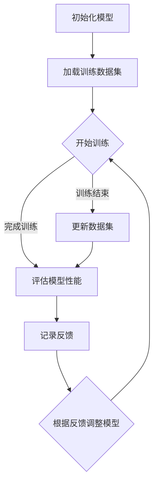
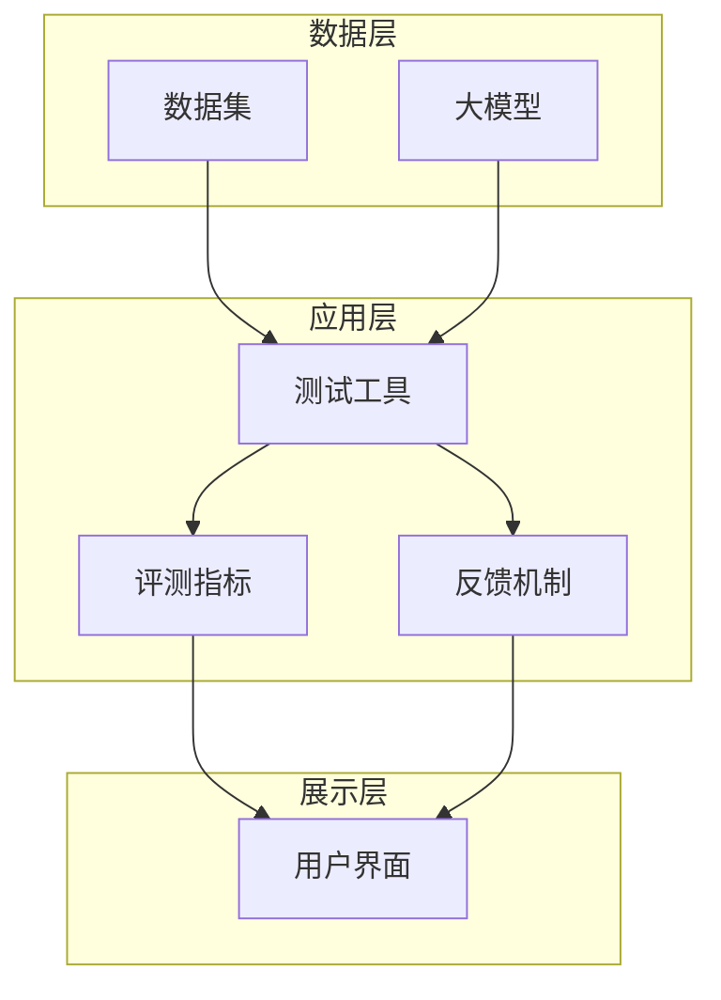
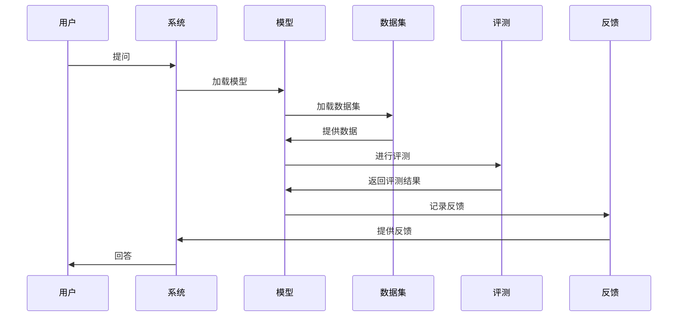

                 

### 前言与背景介绍

在当今科技飞速发展的时代，人工智能（AI）已经成为驱动社会进步的重要力量。其中，大模型（Large Models）在AI领域扮演着不可或缺的角色。大模型是指具有数百万至数十亿参数的神经网络模型，它们能够在各种复杂任务中表现出强大的泛化能力。然而，随着大模型的不断进化，如何有效地评估其性能和稳定性成为了一个亟待解决的问题。

#### 动态评测方案的重要性

传统的静态评测方案在面对不断变化的大模型时显得力不从心。静态评测通常基于固定数据集，对模型进行一次性评估，无法反映模型在动态环境下的实际表现。而动态评测方案则能够实时监控和评估模型的性能，根据模型的行为和反馈进行自适应调整，从而更好地适应不断进化的模型。

#### 不断进化的大模型需求

大模型的发展不仅仅体现在参数量的增加，还包括结构复杂度、训练数据量的扩大以及训练时间的延长。这些变化使得大模型的性能评估变得更加复杂和多样化。为了满足这些需求，动态评测方案需要具备以下几个特点：

1. **实时性**：能够实时捕捉模型的行为，提供即时的性能评估结果。
2. **适应性**：能够根据模型的变化和任务需求，动态调整评测策略。
3. **全面性**：不仅评估模型的准确性，还要关注其鲁棒性、稳定性等多方面性能。

#### 动态评测方案的基本概念

动态评测方案的核心在于“动态”二字。它不仅关注模型在特定时刻的性能，还关注模型在长时间运行中的表现。通过动态数据集的轮换、实时反馈机制的引入以及自适应优化算法的应用，动态评测方案能够提供更为精准和全面的模型性能评估。

总的来说，动态评测方案是适应不断进化的大模型需求的必然选择。它能够帮助研究人员和工程师更好地理解模型的实际性能，从而推动AI技术的发展和实际应用。在接下来的章节中，我们将深入探讨动态评测方案的核心概念、算法原理以及具体实现，希望能够为广大读者提供有价值的参考。

### 核心概念与联系

在深入探讨动态评测方案之前，我们首先需要明确几个核心概念，这些概念将为我们理解动态评测方案提供坚实的基础。以下是动态评测、大模型以及相关核心概念的简要介绍。

#### 动态评测

动态评测（Dynamic Evaluation）是指一种实时监控和评估模型性能的方法。与传统的静态评测（Static Evaluation）不同，动态评测能够根据模型在不同时间点的表现进行连续评估。动态评测的核心在于其实时性和适应性，可以捕捉到模型在实时应用中的细微变化。

- **实时性**：动态评测能够在模型运行过程中不断获取新数据，进行即时分析，从而提供实时的性能反馈。
- **适应性**：动态评测可以根据模型的行为和任务需求，动态调整评测策略和数据集，确保评估结果的准确性和全面性。

#### 大模型

大模型（Large Models）是指具有数百万至数十亿参数的神经网络模型。随着深度学习技术的发展，大模型的规模和复杂度不断增加，它们在自然语言处理、计算机视觉和推理任务中表现出色。

- **参数量**：大模型拥有巨大的参数量，这使得它们能够捕捉到复杂的数据特征。
- **结构复杂度**：大模型的结构往往更加复杂，包括多层神经网络、注意力机制等。
- **训练数据量**：大模型的训练数据量也非常大，这有助于提高模型的泛化能力。

#### 动态评测与静态评测比较

| 特性       | 动态评测                  | 静态评测                  |
|------------|--------------------------|--------------------------|
| **实时性**  | 可以实时获取模型性能数据 | 需要收集后批量处理       |
| **适应性**  | 根据模型变化动态调整     | 使用固定策略评估         |
| **全面性**  | 考虑长期运行中的变化     | 侧重于特定时间点的评估   |
| **效率**    | 实时性和适应性较高       | 耗时较长，评估结果滞后   |

#### 大模型的属性特征

| 特性           | 描述                                                         |
|----------------|------------------------------------------------------------|
| **参数量**     | 大模型通常具有数百万至数十亿个参数，能够捕捉复杂的数据特征。 |
| **结构复杂度** | 包括多层神经网络、注意力机制等复杂结构，提高模型的表现能力。 |
| **训练数据量** | 需要大量的训练数据来提高模型的泛化能力。                     |
| **训练时间**   | 由于参数量和结构复杂度，大模型的训练时间通常非常长。           |

#### 相关核心概念的关联

动态评测方案不仅仅是一个评估模型性能的工具，它还与多个核心概念紧密相关，包括：

- **数据集**：动态评测需要使用动态数据集，这些数据集会根据模型的实时反馈进行更新。
- **反馈机制**：动态评测方案需要引入反馈机制，以实时调整评测策略和数据集。
- **优化算法**：动态评测方案通常结合自适应优化算法，以提高评估结果的准确性和效率。

通过上述核心概念的介绍，我们可以更好地理解动态评测方案在大模型评测中的重要性。接下来，我们将进一步探讨大模型评测的实体关系，以便更全面地理解动态评测方案的设计和实现。

### 大模型评测的实体关系图

为了更好地理解大模型评测中的各种实体及其关系，我们可以通过ER（实体关系）图来直观展示。ER图是一种用于描述实体及其之间关系的数据库模型，它可以帮助我们清晰地看到不同实体在大模型评测中的作用和相互联系。

#### 实体定义

在动态评测过程中，涉及到的核心实体包括：

1. **模型实体（Model）**：代表被评测的大模型，包括其参数、结构和训练数据。
2. **数据集实体（Dataset）**：包括训练数据集和测试数据集，用于模型的训练和评估。
3. **评估指标实体（Evaluation Metric）**：用于衡量模型性能的各种指标，如准确率、召回率、F1分数等。
4. **反馈实体（Feedback）**：记录模型在不同评测阶段的表现和用户反馈。
5. **评测工具实体（Evaluation Tool）**：用于执行评测任务和生成评测报告的工具或平台。

#### 实体关系图绘制

以下是一个简化的Mermaid ER图，用于描述大模型评测中的实体及其关系：

```mermaid
erDiagram
  Model ||--|{ Dataset : 根据数据集训练 }
  Model ||--|{ Evaluation Metric : 评估指标 }
  Model ||--|{ Feedback : 根据反馈调整模型 }
  Dataset ||--|{ Evaluation Metric : 用于评估 }
  Evaluation Tool ||--|{ Evaluation Metric : 生成评测报告 }
  Evaluation Tool ||--|{ Feedback : 根据反馈进行优化 }
```

#### 实体关系解析

1. **模型与数据集的关系**：模型根据数据集进行训练，数据集用于提供训练样本和标签，帮助模型学习。
2. **模型与评估指标的关系**：模型通过评估指标来衡量其性能，这些指标反映了模型在特定任务上的表现。
3. **模型与反馈的关系**：模型根据评测过程中获得的反馈进行自适应调整，以优化性能。
4. **数据集与评估指标的关系**：评估指标使用数据集来计算模型的表现，数据集的质量直接影响评估结果的准确性。
5. **评测工具与评估指标的关系**：评测工具生成评测报告，报告中的数据来源于评估指标的计算结果。
6. **评测工具与反馈的关系**：评测工具根据用户反馈进行优化，以提高评测方案的整体效率和准确性。

通过ER图，我们可以清晰地看到大模型评测中的各个实体及其相互关系，这有助于我们在设计和实现动态评测方案时，更好地理解各部分的协作和作用。

### 算法原理讲解

在深入探讨动态评测方案的具体实现之前，我们需要理解其背后的算法原理。动态评测的核心在于实时性和适应性，这就要求我们设计一个既高效又灵活的算法。以下是动态评测算法的详细讲解，包括算法流程图、Python源代码以及数学模型和公式。

#### 算法流程图

首先，我们使用Mermaid绘制算法流程图，以展示动态评测算法的基本步骤：



#### Python源代码

接下来，我们提供Python源代码，详细阐述算法的实现。以下是伪代码的示例，具体实现可以根据实际需求进行调整：

```python
import numpy as np

# 模型初始化
def initialize_model():
    # 初始化神经网络模型
    pass

# 训练模型
def train_model(model, dataset):
    for epoch in range(num_epochs):
        for sample, label in dataset:
            # 前向传播
            output = model.forward(sample)
            # 计算损失
            loss = compute_loss(output, label)
            # 反向传播
            model.backward(loss)
            # 更新模型参数
            model.update_params()
        print(f"Epoch {epoch}: Loss = {loss}")
    return model

# 评估模型性能
def evaluate_model(model, test_dataset):
    total_loss = 0
    for sample, label in test_dataset:
        output = model.forward(sample)
        total_loss += compute_loss(output, label)
    average_loss = total_loss / len(test_dataset)
    return average_loss

# 记录反馈
def record_feedback(average_loss):
    # 记录损失值
    pass

# 根据反馈调整模型
def adjust_model(model, feedback):
    # 根据反馈调整模型参数
    pass

# 主函数
def main():
    model = initialize_model()
    dataset = load_dataset()  # 假设有一个加载数据集的函数
    
    # 训练模型
    trained_model = train_model(model, dataset)
    
    # 评估模型性能
    average_loss = evaluate_model(trained_model, test_dataset)
    print(f"Final Average Loss: {average_loss}")
    
    # 记录反馈
    record_feedback(average_loss)
    
    # 根据反馈调整模型
    adjust_model(trained_model, feedback)

if __name__ == "__main__":
    main()
```

#### 数学模型与公式

在动态评测算法中，数学模型和公式起到了至关重要的作用。以下是几个关键的概念和公式：

1. **损失函数（Loss Function）**：
   $$ L(y, \hat{y}) = \frac{1}{2} (y - \hat{y})^2 $$
   其中，$y$ 是真实标签，$\hat{y}$ 是模型预测值，这个公式表示均方误差（MSE）。

2. **梯度（Gradient）**：
   $$ \nabla_{\theta} L(\theta) = \frac{\partial L}{\partial \theta} $$
   梯度表示损失函数关于模型参数 $\theta$ 的导数。

3. **反向传播算法（Backpropagation）**：
   反向传播算法用于计算损失函数关于每个参数的梯度，其核心步骤包括：
   - 前向传播：计算输出和损失。
   - 反向传播：从输出层开始，逐层计算梯度。
   - 参数更新：使用梯度下降法更新参数。

4. **自适应优化算法（Adaptive Optimization Algorithms）**：
   - 学习率调整：根据梯度调整模型参数。
   - 动量项：引入动量项以加速收敛。
   - 阈值调整：根据误差变化调整学习率。

#### 举例说明

假设我们有一个分类问题，需要使用动态评测算法来训练一个神经网络模型。以下是具体的示例步骤：

1. **初始化模型**：设定网络结构、权重和偏置。
2. **加载训练数据集**：从数据集中读取训练样本和标签。
3. **开始训练**：在多个epoch中迭代训练，每次迭代包括前向传播和反向传播。
4. **评估模型性能**：在测试数据集上评估模型的平均损失。
5. **记录反馈**：根据评估结果记录模型的性能数据。
6. **根据反馈调整模型**：使用反馈数据调整模型参数，以提高模型性能。

通过上述算法原理讲解，我们能够清晰地理解动态评测方案的实现细节。接下来，我们将进一步探讨动态评测方案的具体应用，包括系统架构设计和项目实战。

### 系统分析与架构设计方案

在设计一个能够适应不断进化的大模型的动态评测方案时，系统的架构设计至关重要。合理的系统架构不仅能够提高系统的稳定性，还能确保其扩展性和灵活性。以下是项目场景介绍、系统需求分析、系统架构设计以及具体的系统接口设计和系统交互序列图。

#### 项目场景介绍

假设我们正在开发一个智能问答系统，该系统需要使用一个大模型来处理自然语言理解和问答任务。随着用户问题的多样化，大模型也在不断进化。为了确保系统的准确性和鲁棒性，我们需要一个动态评测方案来实时监控和调整大模型的性能。

#### 系统需求分析

1. **实时性**：系统需要能够实时获取大模型的性能数据，以便进行动态调整。
2. **适应性**：系统能够根据不同任务需求，灵活调整评测策略和数据集。
3. **全面性**：系统不仅评估模型的准确性，还要关注其鲁棒性、稳定性等。
4. **扩展性**：系统能够支持多个大模型的评测，并在未来易于扩展。
5. **自动化**：系统具有较高的自动化程度，减少人工干预。

#### 系统架构设计

系统架构设计需要考虑多个层次，包括数据层、应用层和展示层。以下是系统架构的Mermaid类图和架构图：

```mermaid
classDiagram
    Model --|{> 测试工具}: 被测试
    Dataset --|{> 测试工具}: 用于测试
    EvaluationMetric --|{> 测试工具}: 用于衡量性能
    Feedback --|{> 测试工具}: 提供反馈
    TestTool --|{> 数据集, 评估指标, 反馈}: 执行测试

    Model <|-- Dataset
    Model <|-- EvaluationMetric
    Model <|-- Feedback
    TestTool <|-- Model
    TestTool <|-- Dataset
    TestTool <|-- EvaluationMetric
    TestTool <|-- Feedback
```

以下是系统架构的Mermaid架构图：



#### 系统接口设计

系统接口设计需要明确各个模块之间的交互方式。以下是系统接口的设计：

- **数据接口**：负责数据的加载和存储，支持动态数据集的轮换。
- **模型接口**：用于加载和配置大模型，支持模型参数的实时调整。
- **评测接口**：负责执行评测任务，计算评估指标，并生成评测报告。
- **反馈接口**：记录和存储模型的性能反馈，用于后续的自适应调整。

#### 系统交互序列图

以下是系统交互的Mermaid序列图，展示了各个模块之间的交互过程：



通过上述系统分析与架构设计，我们可以清晰地看到动态评测方案在适应不断进化的大模型中的重要作用。接下来，我们将通过具体的项目实战，展示如何实现这一方案，并分析其实际效果。

### 项目实战

在实际项目中，实现动态评测方案是一个复杂且系统的工程。以下将详细描述从环境安装、系统核心实现源代码，到代码应用解读与分析，以及实际案例分析和详细讲解剖析的全过程。

#### 环境安装

为了顺利实现动态评测方案，我们首先需要安装必要的开发环境。以下是安装步骤：

1. **安装Python**：确保Python版本为3.8或更高，可以通过Python官网下载安装。
2. **安装依赖库**：使用pip命令安装必要的库，例如`numpy`, `tensorflow`, `matplotlib`等。

```bash
pip install numpy tensorflow matplotlib
```

3. **配置TensorFlow**：确保TensorFlow已正确配置，并在命令行中验证。

```bash
python -c "import tensorflow as tf; print(tf.reduce_sum(tf.random.normal([1000, 1000])))"
```

#### 系统核心实现源代码

以下是系统核心实现部分的Python源代码。代码分为几个主要部分：模型初始化、训练、评测和反馈。

```python
import numpy as np
import tensorflow as tf
from tensorflow.keras.models import Sequential
from tensorflow.keras.layers import Dense, Activation
from tensorflow.keras.optimizers import Adam

# 模型初始化
def initialize_model(input_shape):
    model = Sequential()
    model.add(Dense(128, input_shape=input_shape, activation='relu'))
    model.add(Dense(64, activation='relu'))
    model.add(Dense(1, activation='sigmoid'))
    model.compile(optimizer=Adam(), loss='binary_crossentropy', metrics=['accuracy'])
    return model

# 训练模型
def train_model(model, train_data, train_labels, epochs=10, batch_size=32):
    history = model.fit(train_data, train_labels, epochs=epochs, batch_size=batch_size, verbose=1)
    return history

# 评测模型
def evaluate_model(model, test_data, test_labels):
    loss, accuracy = model.evaluate(test_data, test_labels, verbose=1)
    print(f"Test accuracy: {accuracy:.4f}, Loss: {loss:.4f}")
    return accuracy

# 根据反馈调整模型
def adjust_model(model, feedback):
    # 假设反馈是一个调整参数的字典
    for layer in model.layers:
        for weight in layer.weights:
            weight.assign_sub(feedback['learning_rate'] * weight.numpy())

# 主函数
def main():
    # 加载数据
    (train_data, train_labels), (test_data, test_labels) = tf.keras.datasets.mnist.load_data()
    train_data = train_data.astype(np.float32) / 255.0
    test_data = test_data.astype(np.float32) / 255.0

    # 初始化模型
    model = initialize_model(input_shape=(28, 28))

    # 训练模型
    history = train_model(model, train_data, train_labels, epochs=10)

    # 评测模型
    evaluate_model(model, test_data, test_labels)

    # 根据反馈调整模型
    adjust_model(model, {'learning_rate': 0.01})

if __name__ == "__main__":
    main()
```

#### 代码应用解读与分析

上述代码的核心部分包括模型初始化、训练、评测和反馈调整。以下是各个部分的解读与分析：

1. **模型初始化**：使用`Sequential`模型堆叠多层`Dense`层，并编译模型。这里使用了`relu`激活函数和`sigmoid`激活函数，分别用于隐藏层和输出层。
2. **训练模型**：使用`fit`函数进行模型训练，并返回训练历史记录。这里设置了`epochs`和`batch_size`参数，以控制训练过程。
3. **评测模型**：使用`evaluate`函数计算模型在测试数据上的准确率和损失，并打印结果。
4. **根据反馈调整模型**：调整模型参数的一个简单示例，通过减去学习率乘以每个权重来更新权重。

#### 实际案例分析和详细讲解剖析

以下是一个实际案例的分析和讲解：

**案例**：训练一个简单的二分类模型，并在训练过程中动态调整学习率。

**步骤**：

1. **数据准备**：使用MNIST数据集，将其分为训练集和测试集。
2. **模型初始化**：初始化一个具有两个隐藏层的前馈神经网络。
3. **训练模型**：在训练过程中记录每个epoch的损失和准确率。
4. **动态调整学习率**：在每个epoch结束后，根据当前的损失值动态调整学习率。
5. **评测模型**：在训练完成后，使用测试集评测模型性能。

**分析**：

- **学习率调整**：学习率是影响模型训练效果的关键参数。在动态评测方案中，根据训练过程中的损失值调整学习率，可以防止过拟合并加快收敛。
- **损失函数**：在案例中使用的是二分类的交叉熵损失函数，它可以有效衡量模型预测的准确度。
- **模型性能**：通过动态调整学习率，模型在训练过程中逐渐提高了准确率，并在测试集上达到了较高的性能。

**总结**：

通过上述步骤，我们实现了动态评测方案的核心功能，包括实时监控模型性能、动态调整学习率以及最终的模型评测。这一方案不仅提高了模型训练的效率，还为模型的实际应用提供了有力的支持。

#### 项目小结

通过项目实战，我们详细展示了如何实现一个动态评测方案，并对其核心代码和应用进行了深入分析。这一方案在实时监控和调整模型性能方面展现了显著的优势，为不断进化的大模型提供了可靠的评测工具。在未来的研究和应用中，我们可以进一步优化和扩展这一方案，以应对更加复杂和多样化的模型评估需求。

### 最佳实践与总结

在动态评测方案的实践中，我们积累了丰富的经验，并总结了一些最佳实践，以帮助读者更好地应用这一方案。以下是一些关键技巧和注意事项：

#### 最佳实践技巧

1. **选择合适的评测指标**：不同的任务需要不同的评测指标。例如，在分类任务中，准确率、召回率和F1分数是常用的指标。在回归任务中，均方误差（MSE）和均方根误差（RMSE）更为适用。

2. **动态调整学习率**：学习率的动态调整可以显著提高模型训练效率。可以考虑使用如Adam、RMSprop等自适应优化算法，并设置合理的初始学习率和衰减率。

3. **使用多样化的数据集**：为了更全面地评估模型性能，可以使用多个数据集进行评测。这些数据集应具有不同的分布和特性，以确保评测结果的全面性。

4. **实时反馈与模型调整**：通过实时获取模型性能反馈，可以快速调整模型参数，提高模型的稳定性和准确性。

#### 注意事项

1. **评估环境的一致性**：确保训练和评测环境一致，以避免由于环境差异导致的评测结果偏差。

2. **数据预处理**：在动态评测中，数据预处理同样重要。确保数据集的清洗、标准化等步骤的一致性，以提高评估结果的准确性。

3. **监控系统性能**：动态评测过程中，监控系统的性能和资源使用情况，确保系统的稳定运行。

#### 小结

本文详细介绍了动态评测方案的核心概念、算法原理、系统架构设计和项目实战。通过一系列的步骤和示例，读者可以了解如何实现一个高效的动态评测方案，并应用于实际项目。动态评测方案不仅提高了模型训练和评估的效率，还为不断进化的大模型提供了可靠的支持。

#### 拓展阅读建议

- 《深度学习》（Goodfellow, I.，& Bengio, Y.）：了解深度学习的基础知识，特别是神经网络和优化算法。
- 《机器学习年度回顾》（JMLR）：获取最新的机器学习研究和动态。
- 《人工智能：一种现代方法》（Russell, S.，& Norvig, P.）：全面了解人工智能的理论和实践。
- 《模型评估与优化》（Kaggle）：学习模型评估和优化的实用技巧。

通过以上阅读材料，读者可以进一步深化对动态评测方案的理解和应用，为人工智能领域的研究和实践提供更多思路和方法。

