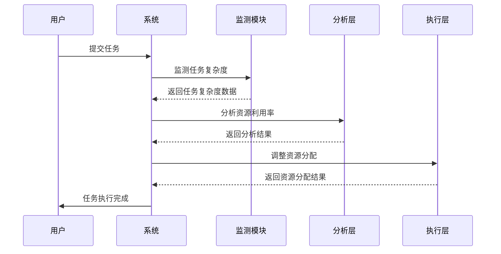

                 

## 第一部分：问题背景与核心概念

### 第1章：动态长度调整概述

#### 1.1 问题背景

##### 1.1.1 任务复杂度变化的挑战

在信息技术飞速发展的今天，各类复杂度的任务层出不穷，从简单的数据处理到复杂的机器学习模型训练，每个阶段都可能面临不同的挑战。传统的方法往往采用固定的资源分配方案，然而面对任务复杂度的变化，这种方法往往显得捉襟见肘。首先，固定资源分配可能会导致资源浪费，例如在任务复杂度较低时，大量资源被闲置；而在任务复杂度较高时，资源又可能不足以支持任务的完成。其次，固定的资源分配方案缺乏灵活性，无法动态适应任务复杂度的变化，从而影响任务的执行效率和效果。

##### 1.1.2 动态长度调整的需求

动态长度调整的理念正是为了应对这种挑战而产生的。动态长度调整旨在根据任务复杂度的变化，动态地调整系统资源的使用，以达到最优的资源利用效率和任务执行效果。具体而言，动态长度调整具有以下几个需求：

1. **实时监控任务复杂度**：系统需要具备实时监测任务复杂度的能力，以便及时发现任务复杂度的变化。
2. **自适应调整策略**：系统需要根据任务复杂度的实时数据，自动调整资源分配策略，以优化资源利用。
3. **高效执行机制**：系统需要确保在调整过程中，任务的执行效率不受影响或受到最小的影响。
4. **可靠性保障**：系统在调整资源的过程中，需要确保任务的完成质量和系统的稳定性。

##### 1.1.3 动态长度调整的意义

动态长度调整不仅能够提高资源利用率，还能显著提升系统的执行效率和稳定性。具体来说，动态长度调整的意义主要体现在以下几个方面：

1. **优化资源利用**：动态长度调整能够根据任务的实际情况，灵活地调整资源分配，避免了资源的浪费和过度使用。
2. **提升执行效率**：通过动态调整，系统能够在资源紧张时优化任务执行顺序，提高任务处理速度。
3. **增强系统稳定性**：动态长度调整有助于在任务高峰期时，保持系统的稳定运行，避免因资源不足导致的系统崩溃。
4. **降低运维成本**：动态长度调整减少了手动调整资源的需求，降低了运维成本和人力投入。

#### 1.2 核心概念

##### 1.2.1 动态长度调整的定义

动态长度调整（Dynamic Length Adjustment）是指在任务执行过程中，根据任务的复杂度变化动态地调整系统资源（如CPU、内存、网络带宽等）的分配策略，以实现最优的资源利用效率和任务执行效果。

##### 1.2.2 动态长度调整的分类

根据调整对象的不同，动态长度调整可以分为以下几类：

1. **基于任务的动态长度调整**：主要针对任务本身的复杂度变化进行资源调整，如根据任务的执行时间、数据量等进行调整。
2. **基于资源的动态长度调整**：主要针对系统资源的可用性进行动态调整，如根据资源的利用率、负载情况等进行调整。
3. **混合动态长度调整**：结合任务复杂度和资源可用性进行综合调整，以实现更优的资源利用和任务执行效果。

##### 1.2.3 动态长度调整的关键技术

动态长度调整的关键技术包括以下几个方面：

1. **任务复杂度监测技术**：实时监测任务复杂度，包括任务的执行时间、数据量、处理速度等指标。
2. **资源利用率分析技术**：分析系统资源的利用率，包括CPU、内存、网络带宽等。
3. **动态调整策略设计**：设计基于实时数据的自适应调整策略，以实现最优的资源利用。
4. **执行机制优化技术**：优化任务执行机制，确保在资源调整过程中，任务的执行效率不受影响。

#### 1.3 本章小结

本章介绍了动态长度调整的背景、需求、意义和核心概念。随着任务复杂度的变化，动态长度调整成为优化资源利用、提升执行效率和增强系统稳定性的关键手段。动态长度调整的核心概念包括定义、分类和关键技术，为后续章节的理论和实践提供了基础。

## 第二部分：动态长度调整的理论基础

### 第2章：动态长度调整的基本原理

#### 2.1 动态长度调整的基础理论

##### 2.1.1 相关数学模型

动态长度调整的理论基础涉及到多个数学模型，包括线性规划、动态规划、概率论和统计学等。这些模型为动态长度调整提供了数学上的理论基础。

1. **线性规划**：线性规划是一种用于求解资源优化问题的数学方法，通过建立线性方程组或线性目标函数，实现对资源的优化分配。动态长度调整中的资源分配问题可以转化为线性规划问题。
   
   $$\min \ c^T x$$
   $$\text{subject to} \ Ax \leq b$$

   其中，\(c\) 为目标函数系数，\(x\) 为资源分配向量，\(A\) 和 \(b\) 分别为约束条件矩阵和向量。

2. **动态规划**：动态规划是一种求解多阶段决策问题的方法，通过将问题分解为多个阶段，并利用递推关系求解最优解。动态长度调整中的资源调整问题可以分解为多个阶段，并利用动态规划方法求解。

   $$V_t(i) = \min_{j} \{c_{ij} + V_{t-1}(j)\}$$

   其中，\(V_t(i)\) 为第 \(t\) 阶段在状态 \(i\) 下的最优值，\(c_{ij}\) 为从状态 \(i\) 转移到状态 \(j\) 的代价。

3. **概率论和统计学**：概率论和统计学方法用于分析任务复杂度和资源利用率的随机性，提供基于概率的优化策略。例如，通过马尔可夫决策过程（MDP）模型，可以建立任务复杂度和资源利用率之间的概率关系，并利用贝叶斯优化方法进行动态调整。

##### 2.1.2 动态调整策略

动态调整策略是动态长度调整的核心，它决定了如何根据任务复杂度的变化动态调整资源分配。常见的动态调整策略包括以下几种：

1. **基于阈值的动态调整策略**：设定一个阈值，当任务复杂度超过阈值时，触发资源调整。阈值可以根据历史数据或专家经验设定。
   
   $$\text{if } \text{任务复杂度} > \text{阈值} \text{ then } \text{资源调整}$$

2. **基于反馈的动态调整策略**：通过实时监测任务执行情况，根据任务的执行效率和资源利用率进行动态调整。这种策略可以根据任务的实际情况进行自适应调整，提高资源利用效率。

   $$\text{if } \text{资源利用率} > \text{阈值} \text{ and } \text{任务执行效率} < \text{期望值} \text{ then } \text{资源调整}$$

3. **基于优化的动态调整策略**：利用数学优化方法，如线性规划、动态规划等，求解最优资源分配策略。这种策略能够实现资源的最优利用，但计算复杂度较高。

##### 2.1.3 动态长度调整的挑战

尽管动态长度调整具有明显的优势，但在实际应用中仍面临一些挑战：

1. **实时监测与调整的延迟**：实时监测任务复杂度和资源利用率需要一定的计算和处理时间，调整策略的响应速度需要进一步提升。
2. **资源分配的优化难度**：资源分配问题本质上是一个复杂的优化问题，特别是在任务复杂度高度动态变化的情况下，优化难度显著增加。
3. **系统稳定性和可靠性**：动态调整过程中，如何确保系统稳定性和可靠性，避免因调整不当导致系统崩溃或任务失败，是一个重要的挑战。

#### 2.2 动态长度调整的算法原理

##### 2.2.1 常见算法介绍

动态长度调整的算法主要包括以下几种：

1. **线性规划算法**：基于线性规划模型的资源分配算法，能够实现资源的最优分配。
2. **动态规划算法**：基于动态规划模型的资源调整算法，适用于多阶段决策问题。
3. **遗传算法**：一种基于自然进化的优化算法，适用于复杂资源的动态调整。
4. **神经网络算法**：基于神经网络的预测和调整算法，能够实现自适应资源分配。

##### 2.2.2 算法流程分析

以线性规划算法为例，其基本流程如下：

1. **问题建模**：将动态长度调整问题转化为线性规划问题，建立目标函数和约束条件。
2. **求解最优解**：利用线性规划求解器求解最优解，得到资源分配方案。
3. **调整资源分配**：根据求解结果，动态调整系统资源分配，实现优化目标。

##### 2.2.3 算法性能比较

不同算法在性能方面有各自的优缺点，具体如下：

1. **线性规划算法**：求解速度快，适用于资源分配问题，但计算复杂度较高。
2. **动态规划算法**：适用于多阶段决策问题，能够实现最优解，但计算复杂度较高。
3. **遗传算法**：适用于复杂资源调整问题，具有较好的全局搜索能力，但收敛速度较慢。
4. **神经网络算法**：自适应性强，能够实现实时调整，但需要大量训练数据。

#### 2.3 本章小结

本章介绍了动态长度调整的基础理论，包括相关数学模型、动态调整策略和常见算法。动态长度调整通过实时监测任务复杂度和资源利用率，动态调整系统资源分配，以实现最优的资源利用效率和任务执行效果。尽管存在一些挑战，但动态长度调整在优化资源利用、提升执行效率和增强系统稳定性方面具有重要意义。

### 第3章：动态长度调整的数学模型与公式

#### 3.1 数学模型介绍

动态长度调整的核心在于通过数学模型来描述任务复杂度和资源利用之间的关系，并利用这些模型进行资源的动态调整。以下是几种常见的数学模型及其应用：

##### 3.1.1 动态调整的核心公式

1. **资源需求模型**：

   $$ R(t) = f(T, C) $$
   
   其中，\(R(t)\) 表示在时间 \(t\) 时的资源需求，\(T\) 表示任务复杂度，\(C\) 表示任务参数，如数据量、处理速度等。函数 \(f\) 用于描述任务复杂度和资源需求之间的关系。

2. **资源利用率模型**：

   $$ U(t) = \frac{R(t)}{R_{\text{total}}} $$
   
   其中，\(U(t)\) 表示在时间 \(t\) 时的资源利用率，\(R_{\text{total}}\) 表示系统总资源量。该模型用于评估当前资源的利用情况。

##### 3.1.2 公式推导过程

推导动态长度调整的数学模型需要结合具体的应用场景和任务特性。以下是资源需求模型的推导过程：

1. **确定任务复杂度参数**：首先，需要根据任务的性质确定任务复杂度的参数，如数据量 \(D\)、处理速度 \(V\) 和并发度 \(C\)。

2. **建立资源需求关系**：根据任务复杂度参数，建立资源需求与任务复杂度之间的关系。例如，如果任务复杂度与数据量成正比，处理速度与数据量成反比，则：

   $$ R(t) = \frac{D(t)}{V(t)} $$
   
   其中，\(D(t)\) 表示在时间 \(t\) 时的数据量，\(V(t)\) 表示在时间 \(t\) 时的处理速度。

3. **考虑并发度**：如果任务需要并发处理，则还需要考虑并发度 \(C\)：

   $$ R(t) = \frac{D(t)}{V(t) \cdot C} $$
   
##### 3.1.3 公式应用实例

假设一个数据处理任务，每秒需要处理的数据量为 \(100MB\)，处理速度为 \(10MB/s\)，并发度为 \(10\)。则该任务在时间 \(t\) 时的资源需求可以表示为：

$$ R(t) = \frac{100MB}{10MB/s \cdot 10} = 1MB/s $$

#### 3.2 数学公式的详细讲解与举例说明

##### 3.2.1 公式解释

1. **资源需求模型**：

   $$ R(t) = f(T, C) $$
   
   该公式表示在时间 \(t\) 时，任务复杂度 \(T\) 和任务参数 \(C\) 决定了资源需求 \(R(t)\)。函数 \(f\) 用于描述资源需求与任务复杂度和任务参数之间的关系。

2. **资源利用率模型**：

   $$ U(t) = \frac{R(t)}{R_{\text{total}}} $$
   
   该公式表示在时间 \(t\) 时，当前资源需求 \(R(t)\) 与系统总资源量 \(R_{\text{total}}\) 的比值，即资源利用率。

##### 3.2.2 数学模型在动态长度调整中的应用

在动态长度调整中，这两个公式被广泛应用于：

1. **实时监控任务复杂度和资源利用率**：通过实时监测任务复杂度 \(T\) 和任务参数 \(C\)，计算资源需求 \(R(t)\) 和资源利用率 \(U(t)\)，以评估当前资源状态。
2. **动态调整资源分配**：根据实时计算的资源需求 \(R(t)\) 和资源利用率 \(U(t)\)，调整系统资源分配，以实现最优的资源利用。

##### 3.2.3 实际案例举例

假设一个云计算平台，有 \(100GB\) 的内存资源和 \(1000GB/s\) 的网络带宽。在某一时间段，该平台的任务复杂度 \(T = 50\)，任务参数 \(C = 2\)。根据资源需求模型，可以计算出该平台在时间 \(t\) 时的资源需求：

$$ R(t) = f(T, C) = \frac{T}{C} = \frac{50}{2} = 25GB/s $$

再根据资源利用率模型，可以计算出该平台在时间 \(t\) 时的资源利用率：

$$ U(t) = \frac{R(t)}{R_{\text{total}}} = \frac{25GB/s}{100GB/s + 1000GB/s} = 0.025 $$

即资源利用率约为 \(2.5\%\)。根据这个利用率，平台管理员可以决定是否需要动态调整资源分配，以优化资源利用。

#### 3.3 本章小结

本章介绍了动态长度调整中的数学模型，包括资源需求模型和资源利用率模型。通过这些模型，可以描述任务复杂度和资源利用之间的关系，并用于实时监控和动态调整系统资源。实际案例举例说明了这些公式的应用，有助于读者更好地理解动态长度调整的数学原理。

### 第4章：动态长度调整的系统架构设计

#### 4.1 系统架构设计概述

动态长度调整的系统架构设计旨在实现资源分配的灵活性和高效性，以满足任务复杂度的变化需求。本节将介绍系统架构设计的基本概念、功能设计、架构设计和接口设计。

##### 4.1.1 系统功能设计

动态长度调整系统的功能设计主要包括以下几个方面：

1. **任务复杂度监测**：实时监测任务复杂度，包括任务的执行时间、数据量、处理速度等指标。
2. **资源利用率分析**：分析系统资源的利用率，包括CPU、内存、网络带宽等。
3. **动态调整策略**：根据任务复杂度和资源利用率，动态调整系统资源分配策略。
4. **任务执行优化**：优化任务执行顺序，提高任务处理速度。
5. **系统稳定性保障**：确保在动态调整过程中，系统的稳定性和可靠性。

##### 4.1.2 系统架构设计

动态长度调整系统的架构设计采用分层架构，主要包括以下几层：

1. **数据层**：负责存储任务复杂度和资源利用率数据，如数据库或缓存系统。
2. **监测层**：负责实时监测任务复杂度和资源利用率，包括监测模块和采集模块。
3. **分析层**：负责分析任务复杂度和资源利用率数据，生成调整策略。
4. **执行层**：负责根据调整策略动态调整系统资源分配，包括资源调度模块和任务执行模块。
5. **接口层**：负责与外部系统进行交互，提供接口服务。

##### 4.1.3 系统接口设计

动态长度调整系统的接口设计主要包括以下几个方面：

1. **任务接口**：用于任务提交和结果反馈，包括任务的创建、删除、修改和查询等操作。
2. **资源接口**：用于资源监控和分配，包括资源的查询、分配和释放等操作。
3. **调整接口**：用于动态调整策略的配置和执行，包括策略的设置、更新和执行等操作。
4. **监控接口**：用于实时监控任务执行情况和系统资源状态，包括数据的查询、统计和分析等操作。

#### 4.2 系统交互设计

动态长度调整系统的交互设计旨在确保任务执行过程中，系统能够实时响应任务复杂度的变化，动态调整资源分配，提高系统性能和稳定性。以下是系统交互设计的详细说明：

##### 4.2.1 系统交互流程

系统交互流程主要包括以下几个步骤：

1. **任务提交**：用户将任务提交到系统中，系统接收到任务请求后，进行任务复杂度监测和资源利用率分析。
2. **资源分配**：系统根据任务复杂度和资源利用率，动态调整资源分配策略，为任务分配相应的资源。
3. **任务执行**：任务开始执行，系统实时监控任务执行情况，并根据任务复杂度的变化，动态调整资源分配。
4. **结果反馈**：任务完成后，系统将结果反馈给用户，并记录任务执行数据，用于后续分析和优化。

##### 4.2.2 系统交互序列图

以下是动态长度调整系统的交互序列图，展示了系统在不同阶段与各个模块之间的交互关系：



##### 4.2.3 系统性能优化

为了确保动态长度调整系统的高性能和稳定性，需要从以下几个方面进行性能优化：

1. **资源调度优化**：采用高效的调度算法，减少任务执行延迟，提高资源利用率。
2. **数据缓存优化**：利用缓存技术，减少数据访问延迟，提高系统响应速度。
3. **并发处理优化**：通过多线程或分布式架构，提高系统的并发处理能力。
4. **负载均衡优化**：采用负载均衡算法，合理分配任务，避免单点瓶颈。
5. **监控与告警优化**：实时监控系统运行状态，及时发现问题并进行告警和处理。

#### 4.3 本章小结

本章介绍了动态长度调整的系统架构设计，包括系统功能设计、架构设计和接口设计。系统架构设计旨在实现资源分配的灵活性和高效性，以满足任务复杂度的变化需求。通过系统交互设计和性能优化，确保系统能够实时响应任务变化，动态调整资源分配，提高系统性能和稳定性。

### 第5章：动态长度调整的项目实战

#### 5.1 项目环境安装与配置

为了演示动态长度调整的实际应用，我们选择一个具体的云计算平台项目作为案例。以下是项目的环境安装与配置步骤。

##### 5.1.1 环境安装步骤

1. **安装操作系统**：选择一个适合的操作系统，如Ubuntu 18.04或CentOS 7。安装过程请参考相应操作系统的官方文档。

2. **安装基础软件**：安装必要的基础软件，如Apache ZooKeeper、Hadoop和HBase等。这些软件用于实现分布式计算和存储功能。

   ```shell
   sudo apt-get update
   sudo apt-get install zookeeper hadoop hbase
   ```

3. **配置ZooKeeper**：配置ZooKeeper，以便实现分布式协调服务。编辑`/etc/zookeeper/zookeeper.properties`文件，设置ZooKeeper的集群配置。

   ```properties
   tickTime=2000
   dataDir=/var/lib/zookeeper
   clientPort=2181
   ```

4. **启动ZooKeeper服务**：

   ```shell
   sudo systemctl start zookeeper
   ```

5. **配置Hadoop**：配置Hadoop，设置HDFS和YARN的集群配置。编辑`/etc/hadoop/hadoop-env.sh`、`/etc/hadoop/core-site.xml`、`/etc/hadoop/hdfs-site.xml`和`/etc/hadoop/yarn-site.xml`文件。

   ```xml
   <configuration>
     <property>
       <name>fs.defaultFS</name>
       <value>hdfs://localhost:9000</value>
     </property>
     <property>
       <name>hadoop.tmp.dir</name>
       <value>/var/hadoop/tmp</value>
     </property>
   </configuration>
   ```

6. **启动Hadoop服务**：

   ```shell
   sudo systemctl start hadoop-hdfs-namenode
   sudo systemctl start hadoop-hdfs-datanode
   sudo systemctl start hadoop-yarn-resourcemanager
   sudo systemctl start hadoop-yarn-nodemanager
   ```

##### 5.1.2 系统配置细节

在安装和配置过程中，需要关注以下几个细节：

1. **网络配置**：确保所有节点之间的网络连接正常，以便实现分布式计算和存储。
2. **用户权限**：确保安装和配置的用户具有足够的权限，以便运行和管理相关服务。
3. **环境变量**：配置环境变量，以便在命令行中方便地运行相关服务。

##### 5.1.3 常见问题解决

在项目安装和配置过程中，可能会遇到一些常见问题，以下是解决方法：

1. **ZooKeeper无法启动**：检查ZooKeeper的配置文件，确保集群配置正确。检查系统时间同步，确保ZooKeeper服务器和客户端的时间一致。

2. **Hadoop无法启动**：检查Hadoop的配置文件，确保HDFS和YARN的配置正确。检查系统磁盘空间，确保有足够的磁盘空间用于存储数据。

3. **YARN资源不足**：检查YARN的配置文件，调整`yarn.nodemanager.resource.memory-medi
### 第5章：动态长度调整的项目实战

#### 5.2 系统核心实现

在完成环境安装和配置后，我们需要实现动态长度调整系统的核心功能。以下是系统核心实现的详细步骤：

##### 5.2.1 源代码解读

动态长度调整系统的核心代码主要包括以下几个部分：

1. **任务监测模块**：用于实时监测任务的执行状态，包括任务的执行时间、数据量、处理速度等。
2. **资源分析模块**：用于分析系统资源的利用率，包括CPU、内存、网络带宽等。
3. **调整策略模块**：根据任务监测模块和资源分析模块的数据，动态调整系统资源分配策略。
4. **任务执行模块**：负责任务的调度和执行，根据调整策略进行资源分配。

以下是任务监测模块的核心代码：

```python
import time
import threading
from task_monitor import TaskMonitor
from resource_analyzer import ResourceAnalyzer

class TaskMonitorThread(threading.Thread):
    def __init__(self, task_id):
        super().__init__()
        self.task_id = task_id
        self.monitor = TaskMonitor()

    def run(self):
        while True:
            start_time = time.time()
            data_size = self.monitor.get_data_size(self.task_id)
            processing_speed = self.monitor.get_processing_speed(self.task_id)
            end_time = time.time()
            execution_time = end_time - start_time
            print(f"Task {self.task_id}: Data size: {data_size}, Processing speed: {processing_speed}, Execution time: {execution_time}")
            time.sleep(1)

# 创建任务监测线程
task_monitor_thread = TaskMonitorThread(task_id=1)
task_monitor_thread.start()
```

该代码创建了一个任务监测线程，用于实时监测任务的执行状态，包括数据量、处理速度和执行时间。任务监测模块的其他代码可以根据实际需求进行扩展。

资源分析模块的核心代码如下：

```python
import psutil

class ResourceAnalyzer:
    def get_cpu_usage(self):
        return psutil.cpu_percent()

    def get_memory_usage(self):
        return psutil.virtual_memory().percent

    def get_network_usage(self):
        return psutil.net_io_counters().bytes_sent + psutil.net_io_counters().bytes_recv
```

该代码利用Python的`psutil`库获取系统资源的利用率，包括CPU、内存和网络带宽。资源分析模块的其他代码可以根据实际需求进行扩展。

调整策略模块的核心代码如下：

```python
class AdjustmentStrategy:
    def adjust_resources(self, task_monitor, resource_analyzer):
        data_size = task_monitor.get_data_size()
        processing_speed = task_monitor.get_processing_speed()
        cpu_usage = resource_analyzer.get_cpu_usage()
        memory_usage = resource_analyzer.get_memory_usage()
        network_usage = resource_analyzer.get_network_usage()

        if data_size > 1000 and processing_speed < 10 and cpu_usage > 80 and memory_usage > 80:
            # 调整资源分配
            print("Adjusting resources...")
            # 实现具体的资源调整逻辑
        else:
            print("No need to adjust resources.")
```

该代码根据任务监测模块和资源分析模块的数据，动态调整系统资源分配策略。具体的资源调整逻辑可以根据实际需求进行实现。

任务执行模块的核心代码如下：

```python
import queue

class TaskExecutor:
    def __init__(self):
        self.task_queue = queue.Queue()

    def submit_task(self, task_id):
        self.task_queue.put(task_id)
        print(f"Task {task_id} submitted.")

    def execute_task(self):
        while not self.task_queue.empty():
            task_id = self.task_queue.get()
            print(f"Executing task {task_id}...")
            # 实现具体的任务执行逻辑
            print(f"Task {task_id} executed.")
```

该代码实现了任务的提交和执行功能。任务执行模块的其他代码可以根据实际需求进行扩展。

##### 5.2.2 代码应用分析

以上代码展示了动态长度调整系统的核心功能实现。在实际应用中，这些代码可以根据具体需求进行定制和优化。以下是对代码应用的分析：

1. **任务监测模块**：任务监测模块负责实时监测任务的执行状态，包括数据量、处理速度和执行时间。通过创建任务监测线程，可以实现对任务执行状态的持续监控。任务监测模块的扩展可以包括更多的监控指标，如任务进度、错误率等。

2. **资源分析模块**：资源分析模块负责分析系统资源的利用率，包括CPU、内存和网络带宽。利用Python的`psutil`库，可以方便地获取系统资源的实时数据。资源分析模块的扩展可以包括对其他资源指标的分析，如磁盘空间、网络延迟等。

3. **调整策略模块**：调整策略模块根据任务监测模块和资源分析模块的数据，动态调整系统资源分配策略。具体的调整策略可以根据实际需求进行定制，如基于阈值、基于反馈或基于优化的调整策略。调整策略模块的扩展可以包括更复杂的算法，如线性规划、动态规划等。

4. **任务执行模块**：任务执行模块负责任务的提交和执行。通过任务队列，可以实现任务的批量提交和并发执行。任务执行模块的扩展可以包括对任务执行进度的监控、任务错误处理等。

##### 5.2.3 代码优化建议

为了提高动态长度调整系统的性能和稳定性，以下是一些建议：

1. **线程优化**：任务监测模块和调整策略模块中的线程可以优化为异步线程或协程，以提高系统的并发性能。

2. **缓存优化**：在任务监测模块和资源分析模块中，可以引入缓存机制，减少对系统资源的实时监控频率，提高系统响应速度。

3. **分布式架构**：考虑将系统架构设计为分布式架构，利用分布式计算和存储技术，提高系统的扩展性和容错性。

4. **性能监控**：引入性能监控工具，对系统的关键性能指标进行实时监控，及时发现和处理性能瓶颈。

5. **日志管理**：引入日志管理工具，记录系统的运行日志，方便后续的问题排查和性能优化。

#### 5.3 实际案例分析

为了更好地理解动态长度调整的实际应用，以下是一个实际案例的分析：

##### 5.3.1 案例背景介绍

某大型电子商务平台，每天需要处理大量的订单数据，包括订单创建、订单修改、订单支付等操作。这些操作涉及到大量的数据处理任务，如数据清洗、数据聚合、数据存储等。随着订单量的增加，任务复杂度逐渐升高，系统资源需求也不断增加。

##### 5.3.2 案例详细讲解

在案例中，动态长度调整系统的任务监测模块负责实时监测订单处理任务的执行状态，包括任务的执行时间、数据量和处理速度。资源分析模块负责分析系统资源的利用率，包括CPU、内存和网络带宽。根据任务监测模块和资源分析模块的数据，调整策略模块动态调整系统资源分配，确保订单处理任务的顺利进行。

1. **任务监测模块**：任务监测模块实时获取订单处理任务的执行状态，包括任务的执行时间、数据量和处理速度。通过分析这些数据，可以评估任务的处理效率。

2. **资源分析模块**：资源分析模块实时获取系统资源的利用率，包括CPU、内存和网络带宽。通过分析这些数据，可以了解系统资源的利用情况。

3. **调整策略模块**：调整策略模块根据任务监测模块和资源分析模块的数据，动态调整系统资源分配。例如，当订单量增加时，调整策略模块可以增加订单处理任务的资源分配，确保订单处理速度不受影响。

4. **任务执行模块**：任务执行模块负责订单处理任务的调度和执行。根据调整策略模块的调整结果，任务执行模块为每个订单处理任务分配相应的资源，并确保任务按顺序执行。

##### 5.3.3 案例总结

通过动态长度调整系统，该电子商务平台实现了以下效果：

1. **资源利用优化**：动态长度调整系统根据任务复杂度和资源利用率，动态调整系统资源分配，避免了资源的浪费和过度使用，提高了系统资源利用率。

2. **执行效率提升**：动态长度调整系统优化了订单处理任务的执行顺序，提高了订单处理速度，减少了订单处理延迟。

3. **系统稳定性增强**：动态长度调整系统在订单量高峰期时，能够自动调整资源分配，确保系统的稳定运行，避免了因资源不足导致的系统崩溃。

4. **运维成本降低**：动态长度调整系统减少了手动调整资源的需求，降低了运维成本和人力投入。

#### 5.4 项目小结

通过本案例，我们展示了动态长度调整系统的实际应用，并分析了其在优化资源利用、提升执行效率和增强系统稳定性方面的效果。动态长度调整系统不仅提高了系统的整体性能，还降低了运维成本，为电子商务平台提供了可靠的支持。在实际应用中，动态长度调整系统可以根据不同的业务场景和需求进行定制和优化，进一步发挥其优势。

### 第6章：动态长度调整的最佳实践与技巧

#### 6.1 最佳实践总结

在动态长度调整系统的实际应用中，总结出以下最佳实践，有助于提高系统的性能和稳定性：

##### 6.1.1 实践经验分享

1. **实时监测与预警**：建立实时监测机制，及时发现任务复杂度和资源利用率的异常情况。设置预警阈值，当指标超过阈值时，及时触发报警，便于快速响应和处理。
2. **灵活的调整策略**：根据不同业务场景，设计灵活的调整策略。例如，对于高并发任务，可以采用动态负载均衡策略，合理分配系统资源，避免单点瓶颈。
3. **资源预留策略**：在资源紧张时，预留部分资源用于紧急任务的调度和执行，确保关键任务的顺利完成。
4. **数据缓存优化**：在任务处理过程中，充分利用缓存机制，减少对数据库和存储系统的访问压力，提高系统响应速度。
5. **弹性扩展能力**：设计具有弹性扩展能力的系统架构，根据业务需求和资源利用率，动态调整系统规模，以应对业务高峰期。

##### 6.1.2 实践案例选编

以下是一些成功的动态长度调整实践案例：

1. **电商订单处理系统**：通过动态调整资源分配策略，优化订单处理速度，提高了客户满意度。同时，利用弹性扩展能力，在订单量高峰期自动扩容，确保系统稳定运行。
2. **云服务平台**：采用动态负载均衡和资源预留策略，有效缓解了业务高峰期的资源紧张问题，提高了系统性能和稳定性。通过实时监测和预警机制，快速响应和处理异常情况，降低了系统宕机的风险。
3. **在线教育平台**：利用动态长度调整系统，优化了课程资源的分配和管理，提高了课程观看体验。同时，通过实时监测和预警机制，确保了平台的稳定运行，提升了用户体验。

##### 6.1.3 实践技巧总结

为了实现动态长度调整的最佳效果，以下是一些实用技巧：

1. **合理设置阈值**：根据历史数据和业务需求，合理设置预警阈值，避免频繁触发报警，影响系统的正常运行。
2. **利用大数据分析**：利用大数据分析技术，对任务复杂度和资源利用率进行深入分析，发现潜在的问题和优化机会。
3. **避免资源争用**：在多任务处理场景中，避免资源争用，确保任务能够高效、有序地执行。
4. **优化任务调度**：根据任务的优先级和执行时间，优化任务调度策略，提高任务执行效率。
5. **定期性能优化**：定期对系统进行性能优化，包括代码优化、架构优化和硬件升级等，提高系统的整体性能和稳定性。

#### 6.2 小结与注意事项

动态长度调整的最佳实践为系统的稳定运行和性能优化提供了有力支持。在实际应用中，需要根据具体业务场景和需求，灵活运用这些实践技巧，并结合实时监测和预警机制，确保系统的高效运行。

##### 6.2.1 动态长度调整的常见误区

在动态长度调整系统的实际应用中，需要注意以下常见误区：

1. **过度依赖自动调整**：虽然动态长度调整系统能够自动调整资源分配，但并不意味着可以完全依赖系统，还需要人工干预和监控，确保系统的正常运行。
2. **忽略历史数据**：在设置阈值和调整策略时，需要充分考虑历史数据和业务需求，避免仅凭经验或主观判断进行配置。
3. **忽略系统稳定性**：在追求资源优化和执行效率的同时，不要忽视系统的稳定性和可靠性，确保系统在动态调整过程中不会出现崩溃或故障。

##### 6.2.2 注意事项与风险提示

为了确保动态长度调整系统的有效运行，需要注意以下事项和风险：

1. **确保数据准确性**：实时监测和预警机制依赖于准确的数据，确保数据采集和传输的准确性，避免因数据错误导致系统误判。
2. **避免资源过度消耗**：在资源紧张时，避免过度消耗资源，确保系统有足够的资源应对紧急情况。
3. **定期维护和升级**：定期对系统进行维护和升级，修复潜在的安全漏洞和性能瓶颈，确保系统的稳定性和安全性。
4. **数据安全和隐私保护**：在处理和传输数据时，确保数据安全和隐私保护，防止数据泄露和滥用。

#### 6.3 拓展阅读

为了深入了解动态长度调整的最佳实践和最新技术动态，以下是一些建议的拓展阅读：

1. **《云计算架构设计与实践》**：详细介绍了云计算平台的架构设计和实现方法，包括资源管理、负载均衡、数据存储等方面，有助于理解动态长度调整系统的设计和实现。
2. **《动态负载均衡技术》**：探讨了动态负载均衡的理论基础、算法实现和应用场景，为动态长度调整系统提供了重要的参考。
3. **《人工智能应用实践》**：介绍了人工智能在云计算、大数据、物联网等领域的应用案例，包括任务调度、资源分配、数据挖掘等方面，有助于拓展动态长度调整系统的应用范围。

通过以上拓展阅读，可以更深入地了解动态长度调整系统的设计原理、最佳实践和未来发展趋势，为实际应用提供有益的参考。

### 第7章：动态长度调整的未来展望

#### 7.1 动态长度调整的技术发展趋势

动态长度调整技术在未来将面临一系列技术挑战和机遇，随着信息技术和人工智能的快速发展，动态长度调整将在以下几个方面呈现出显著的技术发展趋势：

##### 7.1.1 智能化

随着人工智能技术的不断进步，动态长度调整系统将逐渐实现智能化。利用机器学习和深度学习算法，系统将能够从大量的历史数据和实时监控数据中学习，自动识别任务复杂度的变化模式，并预测未来资源的需要，从而实现更加精准和高效的资源分配。

##### 7.1.2 自动化

自动化是动态长度调整系统未来的一个重要趋势。通过引入自动化工具和流程，系统可以在无需人工干预的情况下，自动完成资源的监控、分析和调整。这不仅能显著降低运维成本，还能提高资源利用率，实现更高效的系统运营。

##### 7.1.3 分布式与边缘计算

随着分布式系统和边缘计算的兴起，动态长度调整系统也将逐渐从中心化的架构向分布式和边缘计算架构转型。分布式架构能够更好地支持大规模的任务处理和资源分配，而边缘计算则能够将数据处理和分析推向网络边缘，降低延迟，提高响应速度。

##### 7.1.4 高效的资源调度算法

未来，动态长度调整系统将不断引入和优化高效的资源调度算法。这些算法将能够更好地处理高度动态变化的任务复杂度，实现更快速的资源分配和调整，从而提高系统的整体性能和可靠性。

#### 7.2 动态长度调整的应用前景

动态长度调整技术在未来的应用前景广阔，将在多个领域发挥重要作用：

##### 7.2.1 云计算与大数据

在云计算和大数据领域，动态长度调整技术将帮助云服务提供商实现资源的最优利用，提高云服务的性能和可靠性。通过实时调整资源分配，云平台能够更好地应对大规模数据的处理需求，提供更高质量的云计算服务。

##### 7.2.2 物联网

在物联网（IoT）领域，动态长度调整技术将帮助优化物联网设备的资源管理，提高设备的响应速度和可靠性。例如，在智能家居、智能交通、智能制造等领域，动态长度调整系统可以确保物联网设备在资源有限的情况下，高效地处理大量的数据流。

##### 7.2.3 人工智能

在人工智能领域，动态长度调整技术将有助于优化机器学习和深度学习模型的训练和推理过程。通过动态调整计算资源和数据传输，AI系统可以更快地训练模型，并在推理过程中提供更高的准确性和效率。

##### 7.2.4 5G与网络优化

随着5G网络的推广，动态长度调整技术将在网络优化方面发挥重要作用。通过实时调整网络带宽和资源分配，5G网络能够提供更稳定、更快速的连接服务，满足用户对高速数据传输的需求。

#### 7.3 动态长度调整的技术挑战

尽管动态长度调整技术在未来的应用前景广阔，但同时也面临着一系列技术挑战：

##### 7.3.1 实时性

动态长度调整系统需要具备高实时性，能够快速响应任务复杂度的变化。然而，实时数据处理和调整的复杂度较高，系统需要在极短的时间内完成数据的采集、分析和调整，这对系统的计算能力和算法设计提出了极高的要求。

##### 7.3.2 可靠性

动态长度调整系统需要确保在资源调整过程中，系统的稳定性和可靠性。任何资源分配不当或调整失误都可能导致系统崩溃或任务失败，因此系统设计需要充分考虑各种异常情况和故障恢复机制。

##### 7.3.3 算法优化

动态长度调整系统需要不断优化资源调度算法，以应对日益复杂的任务场景。优化算法不仅要考虑资源利用效率，还要兼顾系统的性能和稳定性，这需要大量的实验和验证。

#### 7.4 动态长度调整的未来发展方向

为了应对上述挑战，动态长度调整技术在未来将朝着以下几个方向发展：

##### 7.4.1 算法创新

未来，动态长度调整技术将在算法方面进行创新，引入更先进的机器学习和人工智能算法，提高资源分配的准确性和效率。例如，基于强化学习的动态调整策略，可以更好地应对复杂、动态的任务环境。

##### 7.4.2 集成与兼容性

动态长度调整技术需要与现有的系统架构和工具进行集成，提高系统的兼容性和扩展性。通过与其他技术的融合，如容器化技术、自动化运维工具等，动态长度调整系统能够更好地适应不同的应用场景。

##### 7.4.3 开放与标准化

未来，动态长度调整技术将朝着开放和标准化的方向发展。通过制定统一的规范和标准，不同厂商和开发者可以更方便地实现系统的互操作性，提高系统的通用性和可移植性。

##### 7.4.4 安全性与隐私保护

随着动态长度调整技术的广泛应用，系统的安全性和隐私保护将变得越来越重要。未来，系统设计将更加注重安全性和隐私保护，采用加密、访问控制等技术，确保数据的机密性和完整性。

#### 7.5 本章小结

动态长度调整技术在未来将面临智能化、自动化、分布式和边缘计算等发展趋势，并在云计算、大数据、物联网、人工智能和5G等领域发挥重要作用。同时，技术挑战和未来的发展方向也为动态长度调整技术的发展提供了新的机遇和方向。通过不断的技术创新和优化，动态长度调整技术将在提高资源利用效率、增强系统性能和稳定性方面发挥更大的作用。

