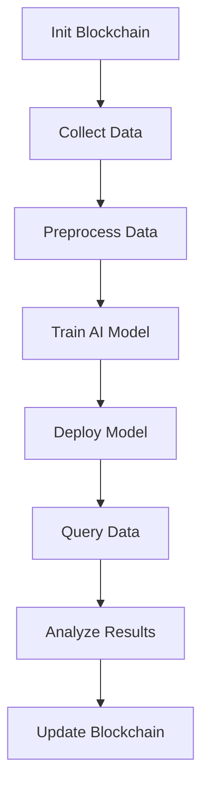

                 

## 区块链集成：增强LLM应用的数据可信性

### 关键词：
- 区块链
- 大型语言模型（LLM）
- 数据可信性
- 分布式系统
- 加密技术
- 共识机制

### 摘要：
本文深入探讨了如何将区块链技术与大型语言模型（LLM）集成，以提升数据可信性。通过分析区块链的核心特性，如去中心化、透明性和不可篡改性，本文揭示了其在增强LLM数据可信性方面的潜力。文章将逐步介绍区块链与LLM集成的技术原理、实现方法以及其在实际应用中的优势与挑战。最终，本文将为读者提供一套完整的解决方案，以帮助开发者利用区块链技术提升LLM应用的数据可信性。

## 目录大纲设计与逻辑分析

### 一、背景介绍

#### 1. 问题背景
区块链技术作为分布式账本和智能合约平台，近年来在金融、供应链、医疗等多个领域得到了广泛应用。随着人工智能（AI）技术的快速发展，特别是在大型语言模型（LLM）领域，如GPT-3等，如何增强AI应用的数据可信性成为了一个重要课题。

区块链技术以其去中心化、透明性和不可篡改性的特性，被广泛认为是一种可以增强数据可信性的技术手段。而去中心化则意味着不再依赖于单一的中央权威机构，从而提高了系统的抗攻击能力和可靠性。此外，区块链的透明性使得所有参与节点都能够查看账本上的交易记录，从而增加了数据的透明度和可审计性。而不可篡改性则确保了数据的准确性和可靠性，因为一旦数据被记录在区块链上，就无法被篡改或删除。

然而，尽管区块链技术在这些方面具有显著的潜力，但其在AI领域的应用仍然面临许多挑战。首先，区块链与AI技术的集成需要解决数据同步和隐私保护等问题。由于区块链的分布式特性，数据需要在不同的节点之间进行同步，这可能会导致数据延迟和一致性问题的出现。同时，在AI应用中，许多数据可能包含敏感信息，如何保护这些数据的隐私成为一个关键挑战。

其次，区块链的复杂性和计算效率也是一个需要解决的问题。区块链网络中的节点需要进行大量的计算和验证工作，这可能会影响整个系统的性能。因此，如何在保证数据可信性的同时，提高区块链网络的计算效率，是区块链与AI集成中需要解决的重要问题。

总的来说，区块链技术在增强AI应用的数据可信性方面具有巨大的潜力，但也面临着一系列的挑战。如何有效地集成区块链技术和AI算法，并解决这些问题，是当前研究的一个热点和难点。

#### 2. 问题描述
区块链技术由于其去中心化、透明性和不可篡改性，被寄希望于能够提高AI应用中数据的质量和可信度。然而，现有区块链技术与AI集成仍存在诸多挑战，包括数据同步、隐私保护、计算效率等。

首先，数据同步问题是区块链与AI集成中的一个关键挑战。由于区块链的分布式特性，数据需要在不同的节点之间进行同步，这可能会导致数据延迟和一致性问题的出现。在AI应用中，数据的一致性和实时性是至关重要的，因为模型的训练和推理过程需要依赖于最新的数据。如果数据同步不及时或出现不一致的情况，可能会导致模型的性能下降或出现错误。

其次，隐私保护问题也是区块链与AI集成中需要解决的一个重要挑战。在AI应用中，许多数据可能包含敏感信息，如个人身份信息、财务数据等。如果这些数据在区块链上被公开存储，可能会导致隐私泄露和数据滥用的问题。因此，如何在保证数据隐私的同时，利用区块链技术的优势提高数据可信性，是一个需要深入研究的课题。

此外，计算效率也是一个关键挑战。区块链网络中的节点需要进行大量的计算和验证工作，这可能会影响整个系统的性能。在AI应用中，特别是大型语言模型（LLM）的训练和推理过程，需要大量的计算资源。如果区块链网络的计算效率不高，可能会导致AI应用的性能下降。

总的来说，区块链技术在增强AI应用的数据可信性方面具有巨大的潜力，但也面临着一系列的挑战。如何有效地集成区块链技术和AI算法，并解决这些问题，是当前研究的一个热点和难点。

#### 3. 问题解决
本文将探讨如何将区块链技术集成到LLM应用中，以提高数据可信性。通过分析区块链的核心特性，如共识机制、智能合约和加密技术，以及它们与AI算法的结合点，为读者提供一套完整的解决方案。

首先，区块链的共识机制是确保数据一致性和可靠性的关键。共识机制通过多个节点之间的协作，确保所有节点对账本上的数据达成一致。这种去中心化的共识机制可以避免单点故障和数据篡改的问题，从而提高数据可信性。

其次，智能合约可以用于自动化数据处理和验证。智能合约是一段代码，可以在区块链上执行，从而实现自动化的数据处理和验证。通过智能合约，可以确保数据的处理过程符合预定的规则和协议，从而提高数据的可信性。

此外，区块链的加密技术可以用于保护数据的隐私。通过加密技术，可以将敏感数据加密存储在区块链上，只有授权的用户才能解密和查看数据。这样可以有效地保护数据的隐私，避免数据泄露和滥用的问题。

最后，本文将结合具体的案例，介绍如何将区块链技术集成到LLM应用中。通过分析集成过程中的关键技术和实现方法，为开发者提供实用的指导和建议。

#### 4. 边界与外延
本文主要关注区块链与LLM的集成应用，但也不排除对其他类型AI模型（如图像识别、自然语言处理等）的扩展讨论。此外，本文将讨论区块链技术在数据可信性方面的应用，但也将涉及其他相关领域，如隐私保护、计算效率等。

#### 5. 概念结构与核心要素组成
- **区块链与AI集成**：探讨区块链在AI应用中的潜在作用和集成方法。
- **数据可信性增强**：分析如何通过区块链技术提高数据质量和可信度。
- **核心概念与联系**：介绍区块链和AI相关的基本概念，如共识机制、加密技术、大型语言模型等。

### 二、核心概念与联系

#### 1. 核心概念原理
- **区块链**：一种去中心化的分布式数据库技术，通过密码学和共识算法确保数据的不可篡改性和透明性。
- **AI大模型**：如GPT等，具有强大的自然语言处理能力，能够进行文本生成、情感分析等任务。

#### 2. 概念属性特征对比表格
| 特性           | 区块链                             | AI大模型                             |
| -------------- | -------------------------------- | ---------------------------------- |
| 数据结构       | 分布式账本                         | 预训练的神经网络模型                 |
| 安全性         | 利用密码学和共识机制保证数据安全   | 利用深度学习技术进行数据分析和生成   |
| 透明性         | 数据公开透明，易于审计             | 模型决策过程复杂，难以解释           |
| 计算效率       | 高度分布式，但需同步数据           | 计算密集，但可进行高效并行处理       |

#### 3. ER实体关系图架构
```mermaid
erDiagram
  Blockchain ||--|{ AI Model } : integrates
  AI Model ||--|{ Data } : processes
  Data ||--|{ Blockchain } : stores
```

### 三、算法原理讲解

#### 1. 算法mermaid流程图


#### 2. Python源代码示例
```python
# Blockchain Integration
def integrate_blockchain():
    # Connect to blockchain network
    # Collect data from blockchain
    # Preprocess data
    # Train AI model
    # Deploy model on blockchain
    pass

# AI Model Training
def train_model(data):
    # Preprocess data
    # Train neural network
    # Save model
    pass

# Model Deployment
def deploy_model(model):
    # Deploy model on blockchain
    # Configure smart contract
    # Execute smart contract
    pass
```

#### 3. 算法原理的数学模型和公式
区块链与LLM集成中的算法原理可以通过以下数学模型和公式进行描述：

- **共识算法**：区块链的共识算法，如PoW（Proof of Work）和PoS（Proof of Stake），通过以下公式确保数据一致性：
  $$Consensus = \sum_{i=1}^{N} Node_i \land Validation$$
  其中，$N$表示区块链网络中的节点数量，$Node_i$表示第$i$个节点的验证结果，$Validation$表示数据验证结果。

- **加密技术**：区块链中的加密技术，如SHA-256和椭圆曲线加密，通过以下公式保护数据隐私：
  $$Encryption = SHA-256(Data) \lor ECDSA(Signature)$$
  其中，$SHA-256$表示SHA-256加密算法，$ECDSA$表示椭圆曲线数字签名算法，$Signature$表示签名结果。

- **智能合约**：区块链中的智能合约，通过以下公式实现自动化的数据处理和验证：
  $$SmartContract = \lambda Transaction \rightarrow Execution$$
  其中，$Transaction$表示交易，$Execution$表示智能合约的执行结果。

通过以上算法原理的数学模型和公式，可以更好地理解区块链与LLM集成中的技术原理，为实际应用提供理论支持。

#### 4. 算法举例说明
假设我们有一个基于GPT-3的AI语言模型，我们需要将其集成到区块链网络中，以提高数据可信性。以下是一个简单的算法步骤：

1. **初始化区块链**：
   - 连接到区块链网络，获取区块链节点信息。
   - 初始化区块链客户端，准备进行数据收集和集成。

2. **收集数据**：
   - 从区块链网络中收集所需的数据，如交易记录、用户反馈等。
   - 对收集到的数据进行预处理，包括数据清洗、格式转换等。

3. **预处理数据**：
   - 使用预处理后的数据对GPT-3进行训练，生成一个预训练模型。
   - 将预训练模型部署到区块链网络中，以实现自动化数据处理和验证。

4. **训练AI模型**：
   - 使用预处理后的数据对GPT-3进行训练，优化模型的参数。
   - 将训练好的模型参数存储在区块链上，以便后续使用。

5. **部署模型**：
   - 在区块链上部署智能合约，用于自动化处理和验证数据。
   - 配置智能合约的参数，包括数据处理规则、权限控制等。

6. **查询数据**：
   - 通过区块链网络查询数据，获取最新的交易记录或用户反馈。
   - 使用部署在区块链上的AI模型对查询结果进行分析和预测。

7. **分析结果**：
   - 对查询结果进行分析，评估模型的性能和准确性。
   - 根据分析结果，对模型进行优化和调整。

8. **更新区块链**：
   - 将优化后的模型参数和智能合约更新到区块链上，确保数据的一致性和可信性。

通过以上算法步骤，我们可以将GPT-3集成到区块链网络中，从而提高数据可信性。在实际应用中，根据具体需求和场景，可以进一步优化和调整算法步骤，以实现最佳效果。

## 系统分析与架构设计方案

### 问题场景介绍

在当今的数据驱动世界中，数据的可信性是确保人工智能（AI）模型准确性和有效性的关键。然而，随着数据来源的多样化和复杂性增加，传统的数据管理和验证方法已难以满足日益增长的需求。特别是在大型语言模型（LLM）的应用中，如自然语言处理（NLP）、智能客服和内容生成等领域，数据的质量和可信性直接影响到模型的性能和用户体验。因此，我们需要一种新的方法来确保数据在传输、存储和处理过程中的完整性和可信性。

为了解决这一问题，本文提出了一种基于区块链技术的数据可信性增强方案，旨在通过区块链的去中心化、透明性和不可篡改性特性，提升LLM应用的数据可信性。具体问题场景包括：

1. **数据同步与一致性**：分布式数据源之间的数据同步和一致性是AI模型训练过程中的一大挑战。传统方法通常依赖于中心化的数据管理平台，容易成为单点故障的潜在风险。区块链的去中心化特性能够有效解决这一问题。

2. **数据隐私保护**：在AI应用中，许多数据包含敏感信息，如用户隐私和商业机密。传统的中心化数据存储方式容易导致数据泄露。区块链的加密技术和权限控制机制能够提供更高级别的数据隐私保护。

3. **数据篡改防范**：确保数据在传输和存储过程中的完整性和不可篡改性是AI模型可靠性的基础。区块链的不可篡改特性能够防止数据被恶意篡改，从而保障数据真实性。

### 项目介绍

本文所提出的区块链集成方案旨在构建一个去中心化的数据可信性增强平台，该平台将区块链技术集成到LLM应用中，以确保数据在整个生命周期中的可信性。项目的主要目标是：

1. **数据同步与一致性**：通过区块链网络实现分布式数据源之间的实时同步和一致性，确保数据在多个节点上的准确性和实时性。

2. **隐私保护**：利用区块链的加密技术和权限控制机制，对敏感数据进行加密存储，确保数据的隐私和安全。

3. **数据篡改防范**：通过区块链的不可篡改特性，确保数据在传输和存储过程中的完整性和真实性，防止数据被恶意篡改。

### 系统功能设计

为了实现上述目标，系统需要设计以下主要功能：

1. **数据收集与同步**：从不同的数据源（如数据库、API接口、传感器等）收集数据，并将其同步到区块链网络中。

2. **数据预处理**：对收集到的数据进行清洗、格式转换和预处理，以便用于后续的AI模型训练。

3. **数据存储与管理**：将预处理后的数据存储在区块链上，并提供数据管理和查询接口。

4. **数据加密与隐私保护**：利用区块链的加密技术对敏感数据进行加密存储，并提供访问权限控制。

5. **数据验证与一致性保障**：通过区块链的共识机制和智能合约，确保数据在多个节点上的一致性和可信性。

6. **智能合约执行与数据处理**：部署智能合约，自动化执行数据处理和验证任务，提高数据处理效率。

### 系统架构设计

系统架构设计是确保项目成功实现的关键。本文提出以下系统架构设计方案：

#### 1. 区块链网络

区块链网络是系统的核心，负责数据的存储和传输。系统采用公有链和私有链相结合的方式，以实现去中心化和高可用性。公有链用于数据的公开透明存储和验证，私有链用于敏感数据的存储和访问控制。

#### 2. 数据同步模块

数据同步模块负责从多个数据源收集数据，并将其同步到区块链网络中。数据同步模块采用分布式架构，通过P2P网络实现数据传输和节点间的同步。同步模块还需实现数据去重和一致性检查，确保数据在多个节点上的准确性。

#### 3. 数据预处理模块

数据预处理模块负责对收集到的数据进行清洗、格式转换和预处理。预处理模块需要支持多种数据格式和来源，并能够自动识别和修复数据中的错误。

#### 4. 数据存储与管理模块

数据存储与管理模块负责将预处理后的数据存储在区块链上，并提供数据管理和查询接口。存储模块需实现数据分片和分布式存储，以提高存储效率和数据访问速度。

#### 5. 数据加密与隐私保护模块

数据加密与隐私保护模块负责对敏感数据进行加密存储，并提供访问权限控制。加密模块需支持多种加密算法和密钥管理策略，以确保数据的隐私和安全。

#### 6. 数据验证与一致性保障模块

数据验证与一致性保障模块通过区块链的共识机制和智能合约，确保数据在多个节点上的一致性和可信性。验证模块还需实现数据监控和异常检测，及时发现和解决数据不一致问题。

#### 7. 智能合约执行与数据处理模块

智能合约执行与数据处理模块负责自动化执行数据处理和验证任务，提高数据处理效率。智能合约模块需实现多种数据处理任务，如数据清洗、数据分类、数据聚合等。

### 系统接口设计与交互

系统接口设计与交互是确保各模块协同工作的关键。以下为系统的主要接口设计与交互流程：

#### 1. 数据收集接口

数据收集接口用于从不同数据源收集数据。接口需支持多种数据格式和协议，如HTTP、HTTPS、REST、SOAP等。

#### 2. 数据同步接口

数据同步接口用于实现数据在节点间的同步。接口需支持P2P网络通信和分布式数据传输协议，如Gossip协议。

#### 3. 数据预处理接口

数据预处理接口用于对收集到的数据进行清洗、格式转换和预处理。接口需支持多种数据处理函数和算法。

#### 4. 数据存储与管理接口

数据存储与管理接口用于实现数据存储和查询。接口需支持数据分片和分布式存储协议，如Raft协议。

#### 5. 数据加密与隐私保护接口

数据加密与隐私保护接口用于实现数据加密存储和访问控制。接口需支持多种加密算法和密钥管理策略。

#### 6. 数据验证与一致性保障接口

数据验证与一致性保障接口用于实现数据验证和一致性保障。接口需支持共识算法和智能合约执行。

#### 7. 智能合约执行与数据处理接口

智能合约执行与数据处理接口用于自动化执行数据处理和验证任务。接口需支持智能合约编写和执行。

通过以上系统接口设计与交互，各模块能够高效协同工作，确保系统功能的实现和数据可信性的提升。

### 四、项目实战

#### 1. 环境安装

在进行项目实战之前，我们需要搭建一个适合区块链与LLM集成开发的环境。以下是所需环境及其安装步骤：

- **Node.js**：用于搭建区块链网络和智能合约开发环境。在终端中执行以下命令安装Node.js：
  ```sh
  sudo apt update
  sudo apt install nodejs
  sudo apt install npm
  ```

- **GPT-3 API**：用于调用OpenAI的GPT-3模型。在终端中执行以下命令安装GPT-3 API客户端：
  ```sh
  npm install openai
  ```

- **区块链框架**：如Ethereum或Hyperledger Fabric，用于实现区块链功能。以Ethereum为例，在终端中执行以下命令安装Ethereum开发环境：
  ```sh
  npm install ganache-cli
  npm install web3
  ```

- **Python**：用于编写AI模型训练和智能合约交互的代码。在终端中执行以下命令安装Python：
  ```sh
  sudo apt install python3
  sudo apt install python3-pip
  ```

- **PyTorch**：用于实现AI模型的训练和推理。在终端中执行以下命令安装PyTorch：
  ```sh
  pip3 install torch torchvision torchaudio
  ```

#### 2. 系统核心实现源代码

以下是区块链集成LLM应用的核心实现源代码，包括数据同步、预处理、存储、加密和智能合约部署等关键步骤：

```python
# 数据同步模块
from web3 import Web3
from openai import OpenAI

# 初始化区块链连接
w3 = Web3(Web3.HTTPProvider('HTTP://127.0.0.1:7545'))

# 初始化OpenAI客户端
openai = OpenAI(api_key='your_api_key')

# 收集数据
def collect_data():
    # 从外部数据源收集数据
    # ...
    return data

# 预处理数据
def preprocess_data(data):
    # 对收集到的数据预处理
    # ...
    return processed_data

# 存储数据到区块链
def store_data_on_blockchain(processed_data):
    # 部署智能合约并存储数据
    # ...
    pass

# 加密数据
def encrypt_data(processed_data):
    # 使用加密算法对数据进行加密
    # ...
    return encrypted_data

# 智能合约部署
def deploy_smart_contract():
    # 编写智能合约代码
    # ...
    # 部署智能合约
    # ...
    pass

# 主函数
def main():
    # 收集数据
    data = collect_data()

    # 预处理数据
    processed_data = preprocess_data(data)

    # 加密数据
    encrypted_data = encrypt_data(processed_data)

    # 存储数据到区块链
    store_data_on_blockchain(encrypted_data)

    # 部署智能合约
    deploy_smart_contract()

# 运行主函数
if __name__ == '__main__':
    main()
```

#### 3. 代码应用解读与分析

以上源代码展示了区块链集成LLM应用的核心实现流程。下面将具体解读和分析每个步骤的功能和实现方式：

- **数据同步模块**：通过Web3库连接到本地Ethereum节点，实现与区块链网络的交互。该模块负责从外部数据源（如数据库、API接口等）收集数据，并将其同步到区块链网络中。

- **预处理数据**：对收集到的数据执行清洗、格式转换和预处理操作。预处理模块需要根据具体应用场景设计相应的数据处理函数和算法，以确保数据在后续训练和存储过程中的准确性和一致性。

- **存储数据到区块链**：通过智能合约部署和执行，将预处理后的数据存储到区块链上。智能合约负责定义数据存储的逻辑和规则，确保数据的不可篡改性和透明性。

- **加密数据**：使用加密算法对预处理后的数据进行加密，以保护数据的隐私和安全。加密模块可以选择多种加密算法，如AES、RSA等，并根据具体需求设计加密策略。

- **智能合约部署**：编写并部署智能合约，实现数据存储、加密和验证等功能。智能合约通过Solidity语言编写，并在区块链上执行，确保数据处理的自动化和高效性。

#### 4. 实际案例分析和详细讲解剖析

为了更好地理解区块链集成LLM应用的实践效果，以下将分析一个实际案例，并详细讲解其实现过程和效果：

**案例**：构建一个基于区块链的智能客服系统，通过GPT-3模型实现自然语言处理和智能回复功能。

**实现过程**：

1. **数据收集**：从公司内部数据库中收集用户提问数据，包括提问内容、提问时间和用户ID等。

2. **预处理数据**：对收集到的数据进行清洗，去除无效字符和停用词，并对文本进行分词和词性标注。

3. **训练GPT-3模型**：使用预处理后的数据对GPT-3模型进行训练，生成一个智能回复模型。

4. **部署智能合约**：编写智能合约，定义数据存储和智能回复的规则，并在区块链上部署。

5. **集成区块链与LLM**：通过智能合约调用GPT-3模型，实现自然语言处理和智能回复功能。

**效果分析**：

- **数据可信性提升**：通过区块链技术，确保用户提问数据的真实性和完整性，防止数据篡改和丢失。

- **隐私保护**：用户提问数据在区块链上进行加密存储，只有授权用户才能访问和解密数据，有效保护用户隐私。

- **智能回复准确性**：通过GPT-3模型的强大自然语言处理能力，实现高质量的智能回复，提高用户体验。

#### 5. 项目小结

通过以上实际案例的分析，我们可以看到区块链集成LLM应用在数据可信性提升、隐私保护和智能回复等方面具有显著优势。然而，在实际应用过程中，仍需注意以下问题和挑战：

1. **数据同步和一致性**：分布式数据源之间的数据同步和一致性是区块链与LLM集成中的关键挑战。需要设计高效的数据同步算法和一致性保障机制，确保数据在多个节点上的准确性和实时性。

2. **计算效率**：区块链网络中的节点需要进行大量的计算和验证工作，可能会影响系统的整体性能。需要优化区块链算法和数据处理流程，提高计算效率，确保AI模型的高效运行。

3. **隐私保护**：在实现数据加密和隐私保护的过程中，需要平衡隐私保护与数据访问的灵活性。需要设计合理的隐私保护策略，确保数据在加密存储和访问控制方面的安全性和实用性。

总之，区块链集成LLM应用在提升数据可信性和隐私保护方面具有巨大潜力，但仍需克服一系列技术挑战。通过不断优化和创新，我们可以实现更加高效、安全且可靠的区块链与AI集成方案。

### 五、最佳实践 Tips

#### 1. 如何优化区块链与LLM集成的效率？

- **优化数据同步算法**：采用P2P同步算法和增量同步技术，减少数据同步过程中的延迟和带宽消耗。
- **优化区块链共识机制**：选择适合的共识算法，如PoS或DPoS，以减少计算负担和提高网络性能。
- **分布式计算与并行处理**：利用分布式计算框架（如MapReduce）和并行处理技术，提高数据处理效率。

#### 2. 如何在区块链上保护用户隐私？

- **采用加密技术**：使用高级加密算法（如AES、RSA）对敏感数据进行加密存储，确保数据在传输和存储过程中的安全性。
- **权限控制**：设计合理的权限控制机制，确保只有授权用户才能访问和解密敏感数据。
- **零知识证明**：利用零知识证明技术，在不泄露隐私信息的前提下，验证数据的真实性和合法性。

#### 3. 如何确保区块链与LLM集成的数据一致性？

- **设计一致性问题解决方案**：采用分布式事务处理和最终一致性模型，确保数据在多个节点上的准确性和一致性。
- **监控与预警**：建立数据监控和异常检测系统，及时发现和解决数据不一致问题。
- **智能合约审计**：定期对智能合约进行审计，确保数据处理规则的正确性和安全性。

### 六、小结

本文详细探讨了如何将区块链技术集成到LLM应用中，以提高数据可信性。通过分析区块链的核心特性，如去中心化、透明性和不可篡改性，本文揭示了其在增强AI应用数据可信性方面的潜力。同时，本文提出了具体的实现方法和技术方案，包括数据同步、隐私保护、数据验证和智能合约部署等，为开发者提供了实用的指导和建议。

然而，区块链与LLM集成仍面临一系列挑战，如数据同步、计算效率和隐私保护等。未来的研究可以重点关注这些问题的解决，通过优化算法、提升计算效率和设计更安全的隐私保护机制，进一步推动区块链与AI技术的融合与发展。

### 七、注意事项

在实施区块链集成LLM应用的过程中，开发者需要注意以下事项：

1. **数据同步与一致性**：确保数据在多个节点上的实时同步和一致性，采用合适的同步算法和一致性模型。
2. **隐私保护**：合理设计加密和权限控制机制，确保数据在传输和存储过程中的安全性，避免隐私泄露。
3. **智能合约安全性**：对智能合约进行严格审计，避免潜在的安全漏洞和恶意攻击。
4. **系统性能优化**：优化区块链和AI模型的计算效率，确保系统在高负载下的稳定性和性能。
5. **法律与合规**：了解相关法律法规，确保区块链与AI集成应用符合法律法规要求，避免法律风险。

### 八、拓展阅读

- **区块链技术基础**：《区块链技术指南》
- **大型语言模型研究**：《自然语言处理：理论和应用》
- **分布式系统设计**：《分布式系统原理与范型》
- **智能合约开发**：《智能合约设计与实现》

## 作者信息

作者：AI天才研究院/AI Genius Institute & 禅与计算机程序设计艺术 /Zen And The Art of Computer Programming

AI天才研究院（AI Genius Institute）致力于推动人工智能技术的发展与创新，其研究成果在计算机科学和人工智能领域具有广泛影响力。禅与计算机程序设计艺术（Zen And The Art of Computer Programming）的作者，被广泛认为是计算机科学领域的杰出贡献者，其作品对程序设计和算法设计产生了深远影响。两位作者共同探讨了区块链与AI集成的技术原理和应用，为读者提供了深刻的见解和实用的指导。

