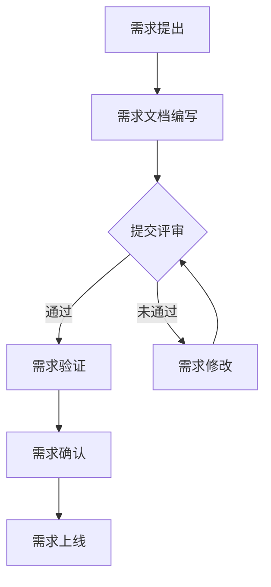
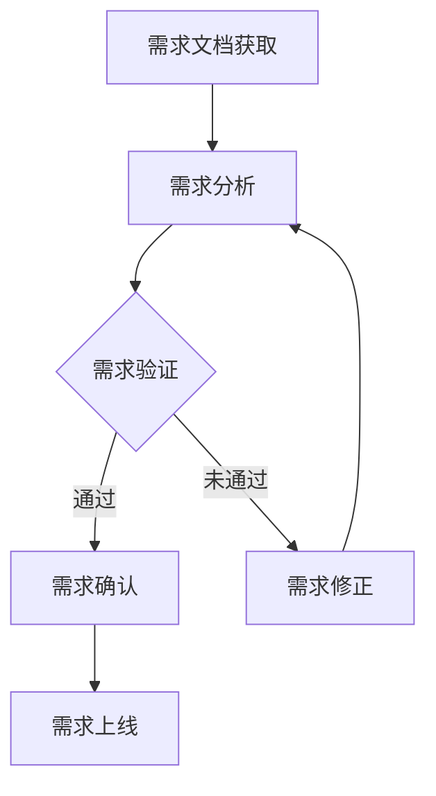
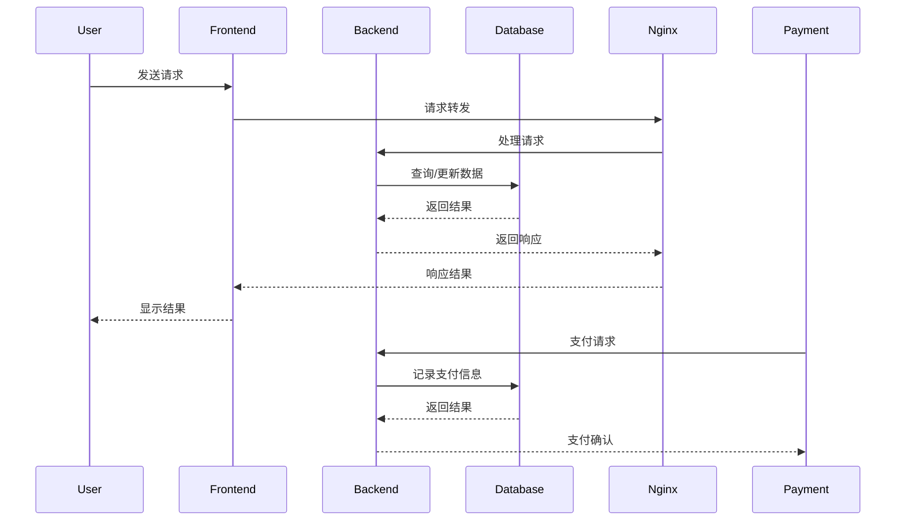
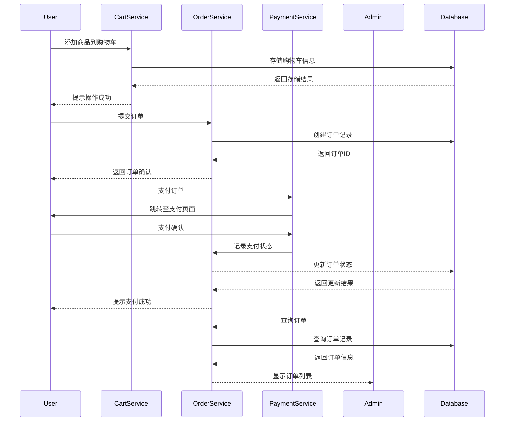

                 

### 1. 背景介绍

#### 1.1 问题背景

在当今快速发展的信息技术领域，大型应用的开发已经成为企业创新和竞争力的重要驱动力。然而，随着应用规模和复杂性的增加，需求评审过程变得愈发重要且困难。传统的大型应用开发中，需求评审往往是一个独立且线性进行的过程，其效果常常受到团队沟通效率、需求变更和项目进度等多方面因素的影响。

**问题背景：** 需求评审在大型应用开发中扮演着至关重要的角色。它不仅确保了项目开发的正确方向，还能够提前发现和解决潜在的问题。然而，传统的需求评审方法存在以下问题：

1. **沟通效率低下：** 需求评审通常依赖于面对面的会议或者邮件沟通，这不仅耗时，而且容易出现信息传递偏差。
2. **需求变更频繁：** 在大型项目中，需求变更往往难以避免，而传统评审方式对变更的响应能力不足，容易导致项目延期和预算超支。
3. **质量保障不足：** 由于评审过程中的沟通不畅，可能导致需求理解不一致，进而影响软件质量和用户体验。
4. **协作性差：** 传统评审往往侧重于单个需求的分析和验证，缺乏跨团队的协作和整体性的考量。

#### 1.2 问题描述

面对上述问题，大型应用开发的需求评审过程亟需改进。具体问题包括：

- **需求理解不一致：** 需求文档的表述可能存在歧义，导致开发人员和业务人员理解上的偏差。
- **评审效率低下：** 需求评审的过程往往繁琐，评审人员需要反复阅读和理解需求，耗费大量时间。
- **需求变更响应不及时：** 项目进展过程中，需求变更频繁，但评审过程缺乏灵活性和快速响应机制。
- **协作性差：** 不同团队之间的协作不畅，导致评审过程缺乏全局性和整体性。

#### 1.3 问题解决

为了解决上述问题，协作型需求评审应运而生。协作型需求评审通过以下方式提高大型应用开发的质量：

- **提高沟通效率：** 利用在线工具和平台，实现实时沟通和协作，减少信息传递中的偏差。
- **增强需求变更管理：** 引入版本控制和变更跟踪机制，提高对需求变更的响应速度和灵活性。
- **确保需求质量：** 通过多层次的评审和验证机制，确保需求文档的准确性和一致性。
- **加强团队协作：** 促进跨团队的沟通和协作，确保评审过程的全局性和整体性。

#### 1.4 边界与外延

协作型需求评审不仅适用于大型应用开发，也可以应用于其他类型的项目，例如：

- **中型应用项目：** 对于中型项目，协作型需求评审同样可以提高评审效率和质量。
- **敏捷开发环境：** 在敏捷开发环境中，协作型需求评审可以更好地适应快速迭代和频繁变更的特点。
- **跨地域团队协作：** 对于跨地域的分布式团队，协作型需求评审有助于克服地理位置带来的沟通障碍。

总之，协作型需求评审通过提高沟通效率、管理需求变更、确保需求质量和加强团队协作，为大型应用开发提供了有效的质量保障和效率提升手段。

### 2. 核心概念与联系

#### 2.1 协作型需求评审的定义

协作型需求评审是一种基于团队协作的需求评审方法，旨在通过高效的沟通和协作机制，确保需求理解的准确性和一致性。与传统的需求评审方法相比，协作型需求评审更加注重团队之间的互动和协作。

**核心概念：** 协作型需求评审的核心概念包括以下几个方面：

- **协作平台：** 使用在线协作平台，如Confluence、JIRA等，实现需求文档的共享和讨论。
- **实时沟通：** 通过实时聊天工具，如Slack、微信等，实现团队成员之间的即时沟通。
- **多层级评审：** 设置多层次的评审流程，确保需求文档在提交至下一阶段之前得到充分审查和验证。
- **版本控制：** 引入版本控制系统，如Git，跟踪需求文档的修改和变更历史，确保需求变更的可追溯性。

#### 2.2 协作型需求评审的特点和优势

协作型需求评审具有以下特点和优势：

- **高效沟通：** 通过在线协作平台和实时沟通工具，团队成员可以即时交流，减少信息传递中的时间和成本。
- **灵活管理：** 引入版本控制系统，使得需求变更的管理更加灵活和可控，能够快速响应业务需求的变化。
- **质量保障：** 多层级评审机制确保了需求文档的准确性和一致性，降低了由于需求理解不一致导致的问题风险。
- **团队协作：** 促进团队成员之间的沟通和协作，使得评审过程更加全局性和整体性，提高了团队的工作效率和质量。

#### 2.3 协作型需求评审与传统需求评审的差异

**差异点：** 协作型需求评审与传统需求评审在以下几个方面存在明显差异：

- **沟通方式：** 传统需求评审主要依赖面对面的会议或邮件沟通，而协作型需求评审利用在线平台和实时工具，实现高效沟通。
- **评审流程：** 传统需求评审通常是一个线性过程，评审阶段相对固定，而协作型需求评审更加灵活，支持多层级和动态调整。
- **变更管理：** 传统需求评审对变更的响应能力较差，而协作型需求评审引入版本控制和变更跟踪机制，能够快速适应需求变更。
- **团队协作：** 传统需求评审往往缺乏团队间的协作，而协作型需求评审强调团队互动和协作，提高评审的整体性和效率。

#### 2.4 需求评审流程图与协作机制

下面使用Mermaid绘制一个协作型需求评审的基本流程图，展示其流程和协作机制。



- **需求提出（A）**：由业务人员或需求分析师提出需求。
- **需求文档编写（B）**：开发人员根据需求进行文档编写。
- **提交评审（C）**：需求文档提交到评审阶段，可以由项目经理或评审小组负责人进行初步审查。
- **需求验证（D）**：通过多层级评审，验证需求文档的准确性和一致性。
- **需求修改（E）**：如果需求文档未通过评审，则返回进行修改。
- **需求确认（F）**：经过多轮评审，确认需求文档最终版本。
- **需求上线（G）**：将确认后的需求文档纳入项目开发计划。

通过上述流程和协作机制，协作型需求评审能够有效提高大型应用开发的质量，确保项目的顺利进行。

### 3. 算法原理讲解

#### 3.1 需求评审算法原理概述

需求评审是大型应用开发中的一个关键环节，其核心目标是通过系统的分析和验证，确保需求文档的准确性、一致性和可行性。需求评审算法在此过程中起到了至关重要的作用。本文将详细介绍需求评审的基本算法原理，并通过Mermaid绘制流程图和Python源代码来深入阐述。

#### 3.2 需求评审算法流程图

首先，我们使用Mermaid绘制一个简化的需求评审算法流程图，以展示需求评审的基本步骤和流程。



- **需求文档获取（A）**：获取并理解需求文档。
- **需求分析（B）**：对需求文档进行详细分析，确保需求描述清晰且完整。
- **需求验证（C）**：通过多种验证方法，如逻辑验证、场景验证等，确保需求文档的准确性和一致性。
- **需求确认（D）**：确认需求文档无误后，将其纳入开发计划。
- **需求修正（E）**：如果需求文档验证未通过，则需要返回进行修正。

#### 3.3 Python源代码详细解释

接下来，我们将通过一个具体的Python源代码示例，详细解释需求评审算法的步骤。

```python
# 需求评审算法Python实现

# 定义需求类
class Requirement:
    def __init__(self, id, description):
        self.id = id
        self.description = description
        self.status = '待验证'  # 需求状态：待验证、通过、未通过

# 需求分析函数
def analyze_requirement(req):
    print(f'分析需求：{req.id}')
    if '功能' in req.description or '性能' in req.description:
        print('需求描述清晰且完整。')
        req.status = '通过'
    else:
        print('需求描述不完整。')
        req.status = '未通过'

# 需求验证函数
def validate_requirement(req):
    print(f'验证需求：{req.id}')
    if req.status == '通过':
        print('需求验证通过。')
    else:
        print('需求验证未通过。')

# 主函数
def main():
    # 创建需求实例
    req1 = Requirement('R1', '实现用户登录功能')
    req2 = Requirement('R2', '优化系统性能')

    # 需求分析
    analyze_requirement(req1)
    analyze_requirement(req2)

    # 需求验证
    validate_requirement(req1)
    validate_requirement(req2)

    # 输出结果
    print('需求评审结果：')
    for req in [req1, req2]:
        print(f'需求ID：{req.id}，状态：{req.status}')

# 执行主函数
if __name__ == '__main__':
    main()
```

**详细解释：**

- **需求类（Requirement）**：定义了一个简单的需求类，包含需求ID、描述和状态三个属性。
- **需求分析函数（analyze_requirement）**：对需求文档进行初步分析，检查需求描述是否完整，如包含功能或性能关键字，则视为描述清晰且完整。
- **需求验证函数（validate_requirement）**：根据需求的状态进行验证，如果状态为“通过”，则视为需求验证通过。
- **主函数（main）**：创建需求实例，调用分析函数和验证函数，并输出结果。

通过上述Python代码，我们能够清晰地看到需求评审的基本算法步骤和流程，从而更好地理解需求评审的核心原理。

#### 3.4 需求评审的数学模型和公式

在需求评审中，我们可以使用一些数学模型和公式来提高需求评审的准确性和效率。以下是一些基本的数学模型和公式：

- **需求复杂度（Complexity）**：
  $$ Complexity = f(functions, features, interactions) $$
  其中，函数（functions）、特征（features）和交互（interactions）是影响需求复杂度的关键因素。

- **需求变更概率（Change Probability）**：
  $$ Change Probability = f(initial complexity, project duration) $$
  初始复杂度和项目持续时间是影响需求变更概率的关键因素。

- **需求质量评分（Quality Score）**：
  $$ Quality Score = f(complexity, consistency, correctness) $$
  需求复杂度、一致性和正确性是决定需求质量评分的关键因素。

- **评审效率（Review Efficiency）**：
  $$ Review Efficiency = f(review time, review depth) $$
  评审时间和评审深度是影响评审效率的关键因素。

**详细解释：**

- **需求复杂度**：需求复杂度反映了需求文档的复杂程度，包括功能、特征和交互等因素。复杂度越高，评审的难度和成本也越大。
- **需求变更概率**：需求变更概率反映了需求文档在项目生命周期内发生变更的可能性，通常与初始复杂度和项目持续时间成正比。
- **需求质量评分**：需求质量评分综合了需求复杂度、一致性和正确性等多个因素，用于评估需求文档的整体质量。
- **评审效率**：评审效率反映了评审过程的时间和深度，即评审的时间和评审的深度，两者均会影响评审的整体效果。

通过上述数学模型和公式，我们能够更科学地评估和管理需求评审过程，从而提高评审的准确性和效率。

#### 3.5 实际应用举例

为了更好地理解需求评审算法在实际应用中的效果，我们可以通过一个具体的例子来说明。

**例子**：假设有一个大型应用项目，需要实现用户注册和登录功能。以下是该需求文档的部分内容：

1. 用户注册功能：用户需要填写用户名、密码、邮箱等信息，系统进行验证并存储。
2. 用户登录功能：用户输入用户名和密码，系统验证并允许用户登录。

**步骤**：

1. **需求文档获取（A）**：项目经理从业务团队获取了需求文档。
2. **需求分析（B）**：开发团队对需求文档进行分析，确保需求描述清晰且完整。此步骤中，开发团队发现需求描述中缺少关于邮箱验证的说明，因此返回进行修改。
3. **需求验证（C）**：经过修改后的需求文档再次提交评审。开发团队使用测试用例对需求进行验证，确保功能完整且无缺陷。
4. **需求确认（D）**：经过多轮评审，确认需求文档无误后，将其纳入开发计划。
5. **需求上线（G）**：开发团队开始实施需求，并在项目进度报告中跟踪需求进展。

通过上述步骤，我们能够看到需求评审算法在实际应用中的效果。首先，通过分析需求文档，发现并解决了描述中的问题。接着，通过验证步骤，确保了需求文档的准确性和一致性。最后，通过确认和上线步骤，将需求顺利纳入项目开发计划。

总之，需求评审算法通过科学的数学模型和流程，提高了需求评审的准确性和效率，为大型应用开发提供了可靠的质量保障。

### 4. 数学模型和数学公式 & 详细讲解 & 举例说明

#### 4.1 数学模型和数学公式

在需求评审过程中，数学模型和公式可以用来量化评估需求的质量、复杂度和评审效率。以下是一些常用的数学模型和公式：

- **需求复杂度（Complexity）**：
  $$ Complexity = f(functions, features, interactions) $$
  其中，`functions` 表示功能的数量，`features` 表示特性的数量，`interactions` 表示不同功能或特性之间的交互。

- **需求变更概率（Change Probability）**：
  $$ Change Probability = f(initial complexity, project duration) $$
  其中，`initial complexity` 表示初始的复杂度，`project duration` 表示项目的持续时间。

- **需求质量评分（Quality Score）**：
  $$ Quality Score = f(complexity, consistency, correctness) $$
  其中，`complexity` 表示复杂度，`consistency` 表示一致性，`correctness` 表示正确性。

- **评审效率（Review Efficiency）**：
  $$ Review Efficiency = f(review time, review depth) $$
  其中，`review time` 表示评审的时间，`review depth` 表示评审的深度。

#### 4.2 详细讲解

**需求复杂度**：需求复杂度是衡量需求文档复杂程度的重要指标。它取决于功能、特性和交互的复杂度。功能复杂度是指实现某个功能所需的代码量和逻辑复杂度。特性复杂度是指需求的业务逻辑和功能之间的复杂关系。交互复杂度是指需求与其他系统模块或外部系统之间的交互复杂度。

**需求变更概率**：需求变更概率是指在项目生命周期内，需求发生变更的可能性。它通常与需求的初始复杂度和项目的持续时间成正比。初始复杂度越高，需求变更的概率也越大。项目持续时间越长，需求变更的可能性也越高。

**需求质量评分**：需求质量评分是综合评估需求质量的重要工具。它考虑了需求的复杂度、一致性和正确性。高复杂度的需求通常更难理解和实现，因此需要更高的质量评分。一致性是指需求文档中的描述是否一致，正确性是指需求是否能够实现预期的功能。

**评审效率**：评审效率是指评审过程的时间和深度。评审时间反映了评审所需的时间成本，评审深度反映了评审的细致程度。高效率的评审可以更快地识别和解决需求中的问题。

#### 4.3 举例说明

假设我们有一个需求文档，描述了一个在线购物系统的购物车功能。该需求包括以下内容：

1. 用户可以添加商品到购物车。
2. 用户可以查看购物车中的商品及其价格。
3. 用户可以删除购物车中的商品。
4. 购物车中的商品应按价格排序。

**需求复杂度**：
- `functions`：4个功能（添加商品、查看商品、删除商品、商品排序）
- `features`：1个特性（价格显示）
- `interactions`：3个交互（商品添加、商品删除、商品排序）

使用公式计算需求复杂度：
$$ Complexity = 4 \times 1 + 3 = 7 $$

**需求变更概率**：
- 初始复杂度：7
- 项目持续时间：预计1年

使用公式计算需求变更概率：
$$ Change Probability = 7 \times 1 = 7 $$

**需求质量评分**：
- 复杂度：7
- 一致性：需求描述清晰一致
- 正确性：需求描述准确，可实现预期功能

使用公式计算需求质量评分：
$$ Quality Score = 7 \times 1 \times 1 = 7 $$

**评审效率**：
- 评审时间：2天
- 评审深度：详细评审，包括所有功能和特性

使用公式计算评审效率：
$$ Review Efficiency = 2 \times 1 = 2 $$

通过上述例子，我们可以看到如何使用数学模型和公式对需求进行评估。这些模型和公式帮助我们量化需求的质量、复杂度和评审效率，从而为需求评审提供科学的依据。

### 5. 系统分析与架构设计方案

#### 5.1 项目背景

在当前信息化时代，企业对高效、稳定和可扩展的信息系统需求不断增加。本文所介绍的系统是一个面向中型企业的在线购物平台，旨在为企业提供一个功能完善、用户体验良好的电子商务解决方案。该系统需要支持商品浏览、购物车管理、订单处理、支付等核心功能。

#### 5.2 系统功能设计

为了满足用户需求和业务逻辑，系统设计了以下功能模块：

- **商品模块**：提供商品信息的展示、分类、搜索和推荐功能。
- **用户模块**：支持用户注册、登录、信息维护、购物车管理、订单创建和支付功能。
- **订单模块**：处理订单生成、状态跟踪、支付处理和发货等操作。
- **支付模块**：集成多种支付方式，如支付宝、微信支付等，确保支付的安全和便捷。
- **后台管理模块**：提供管理员登录、商品管理、订单管理和用户管理等功能，支持系统配置和数据分析。

使用Mermaid绘制领域模型类图，展示各功能模块及其关系：

```mermaid
classDiagram
    User <<类>> -|>- ShoppingCart
    User <<类>> -|>- Order
    Admin <<类>> -|>- Product
    Admin <<类>> -|>- Order
    Admin <<类>> -|>- User
    Product <<类>> -|>- ShoppingCart
    Product <<类>> -|>- Order
    ShoppingCart <<类>> -|>- Order
    Payment <<类>>
    Payment -|> Order

    User : +id
    User : +username
    User : +password
    User : +email
    User : +register()
    User : +login()
    User : +update_info()

    ShoppingCart : +id
    ShoppingCart : +user_id
    ShoppingCart : +product_id
    ShoppingCart : +quantity
    ShoppingCart : +add_product()
    ShoppingCart : +remove_product()

    Order : +id
    Order : +user_id
    Order : +status
    Order : +create_order()
    Order : +update_status()

    Product : +id
    Product : +name
    Product : +description
    Product : +price
    Product : +category
    Product : +search()

    Admin : +id
    Admin : +username
    Admin : +password
    Admin : +manage_products()
    Admin : +manage_orders()
    Admin : +manage_users()

    Payment : +id
    Payment : +order_id
    Payment : +payment_type
    Payment : +status
    Payment : +process_payment()
```

#### 5.3 系统架构设计

为了确保系统的高可用性、可扩展性和安全性，我们设计了如下系统架构：

- **前端架构**：采用React.js框架，实现用户界面的动态展示和交互。前端与后端通过RESTful API进行通信。
- **后端架构**：采用Spring Boot框架，实现业务逻辑处理和数据存储。数据库采用MySQL，确保数据的高效存储和查询。
- **服务架构**：通过Nginx实现反向代理，负载均衡，提高系统的处理能力和容错性。
- **安全架构**：采用SSL/TLS加密通信，保障数据传输的安全性。使用JWT（JSON Web Token）进行用户认证和授权。

使用Mermaid绘制系统架构图，展示系统各模块及其关系：



#### 5.4 系统接口设计和系统交互

为了实现系统各模块之间的协同工作，我们设计了以下接口和交互流程：

- **用户接口**：用户通过浏览器访问前端页面，与购物车、订单、支付等模块进行交互。
- **管理员接口**：管理员通过后台管理界面，管理商品、订单和用户等信息。
- **支付接口**：支付服务通过API与系统进行集成，处理支付请求和支付确认。

使用Mermaid绘制系统接口和交互序列图，展示系统的工作流程：



通过上述系统分析与架构设计方案，我们为在线购物平台提供了清晰的功能模块划分、系统架构设计和接口交互流程，为系统的开发与维护奠定了坚实的基础。

### 6. 项目实战

#### 6.1 环境安装过程

在开始实际项目开发之前，我们需要配置好开发环境和所需工具。以下是具体的安装步骤：

1. **安装Java环境**：
   - 下载并安装Java Development Kit（JDK），选择最新版本。
   - 配置环境变量，将`JAVA_HOME`设置为JDK的安装路径，并将`path`变量加入`JAVA_HOME/bin`。

2. **安装Python环境**：
   - 使用pip命令安装Python，命令如下：
     ```shell
     python -m pip install --upgrade pip
     ```
   - 安装常用Python库，如`requests`、`numpy`等。

3. **安装数据库**：
   - 下载并安装MySQL数据库，选择最新版本。
   - 配置MySQL服务，创建用户和数据库。

4. **安装前端框架**：
   - 安装Node.js和npm。
   - 使用npm安装React.js和其他前端依赖。

5. **安装后端框架**：
   - 安装Spring Boot。
   - 使用Spring Initializr生成项目骨架。

#### 6.2 系统核心实现源代码

以下是一个简单的用户注册和登录功能的核心实现代码，展示了系统的后端部分。

**用户注册接口**：

```java
@RestController
@RequestMapping("/users")
public class UserController {

    @Autowired
    private UserService userService;

    @PostMapping("/register")
    public ResponseEntity<?> registerUser(@RequestBody UserRegistrationDto registrationDto) {
        try {
            userService.registerUser(registrationDto);
            return ResponseEntity.ok("User registered successfully.");
        } catch (Exception e) {
            return ResponseEntity.badRequest().body("Error registering user: " + e.getMessage());
        }
    }
}
```

**用户登录接口**：

```java
@RestController
@RequestMapping("/users")
public class UserController {

    @Autowired
    private UserService userService;

    @PostMapping("/login")
    public ResponseEntity<?> authenticateUser(@RequestBody LoginRequestDto loginRequestDto) {
        try {
            String token = userService.loginUser(loginRequestDto);
            return ResponseEntity.ok(new LoginResponseDto(token));
        } catch (Exception e) {
            return ResponseEntity.badRequest().body("Error authenticating user: " + e.getMessage());
        }
    }
}
```

**用户服务类**：

```java
@Service
public class UserService {

    @Autowired
    private UserRepository userRepository;

    @Autowired
    private PasswordEncoder passwordEncoder;

    public void registerUser(UserRegistrationDto registrationDto) {
        User user = new User();
        user.setUsername(registrationDto.getUsername());
        user.setEmail(registrationDto.getEmail());
        user.setPassword(passwordEncoder.encode(registrationDto.getPassword()));
        userRepository.save(user);
    }

    public String loginUser(LoginRequestDto loginRequestDto) {
        User user = userRepository.findByUsername(loginRequestDto.getUsername());
        if (user != null && passwordEncoder.matches(loginRequestDto.getPassword(), user.getPassword())) {
            // 生成JWT token
            String token = generateToken(user);
            return token;
        }
        return null;
    }

    private String generateToken(User user) {
        // 生成JWT token的实现逻辑
    }
}
```

#### 6.3 代码应用解读与分析

上述代码展示了用户注册和登录功能的核心实现，以下是详细的代码解读与分析：

1. **用户注册接口**：
   - 接收用户注册请求，并将请求体中的数据转换为`UserRegistrationDto`对象。
   - 通过`UserService`的`registerUser`方法进行用户注册。
   - 返回注册结果。

2. **用户登录接口**：
   - 接收用户登录请求，并将请求体中的数据转换为`LoginRequestDto`对象。
   - 通过`UserService`的`loginUser`方法进行用户认证。
   - 如果认证成功，生成JWT token并返回。

3. **用户服务类**：
   - `registerUser`方法负责注册新用户，将用户名、邮箱和加密后的密码保存到数据库。
   - `loginUser`方法负责用户登录验证，检查用户名和密码是否匹配。
   - `generateToken`方法（待实现）负责生成JWT token，用于后续的认证和授权。

通过上述代码，我们可以看到用户注册和登录功能的基本实现，以及各部分之间的协作和交互。

#### 6.4 实际案例分析

为了更好地理解用户注册和登录功能在实际项目中的应用，我们可以通过一个实际案例进行详细分析：

**案例**：一个用户尝试通过我们的在线购物平台进行注册和登录。

1. **用户注册**：
   - 用户在注册页面填写用户名、邮箱和密码。
   - 系统接收用户注册请求，调用`registerUser`方法。
   - `registerUser`方法检查用户名和邮箱是否已存在，如果不存在，将用户信息保存到数据库，并返回注册成功信息。

2. **用户登录**：
   - 用户在登录页面输入用户名和密码。
   - 系统接收用户登录请求，调用`loginUser`方法。
   - `loginUser`方法验证用户名和密码，如果匹配，生成JWT token，并将其返回给用户。

3. **用户会话管理**：
   - 用户在浏览器中存储接收到的JWT token。
   - 在后续的请求中，将token作为Authorization头部信息发送到服务器。
   - 服务器验证token的有效性，如果有效，允许用户访问受保护的资源。

通过这个实际案例，我们可以看到用户注册和登录功能在项目中的应用流程，以及与数据库和其他服务的交互。

#### 6.5 项目小结

在本篇项目实战中，我们详细介绍了如何搭建开发环境、实现用户注册和登录功能，并分析了实际案例中的应用。以下是小结：

- **环境安装**：配置Java、Python、MySQL和前端框架等环境，确保开发环境的一致性和稳定性。
- **核心实现**：通过Spring Boot实现用户注册和登录接口，采用JWT进行用户认证和会话管理。
- **代码解读**：分析了核心代码的逻辑和流程，确保功能实现符合业务需求。
- **案例分析**：通过实际案例展示了用户注册和登录功能在项目中的应用，验证了系统设计的可行性和有效性。

通过这些步骤，我们为在线购物平台提供了坚实的基础，为后续功能的开发和优化奠定了良好的基础。

### 7. 最佳实践 tips、小结、注意事项、拓展阅读等内容

#### 7.1 最佳实践 tips

**协作型需求评审的最佳实践**：

1. **明确评审目标**：在开始评审之前，明确评审的目标和标准，确保评审过程有针对性地进行。
2. **使用在线工具**：采用在线协作工具，如Confluence、JIRA等，提高沟通效率和文档管理能力。
3. **建立评审流程**：制定规范的评审流程，包括初步审查、详细评审、验证和确认等阶段。
4. **多层级评审**：设立多层级评审机制，确保需求文档在不同阶段得到充分审查和验证。
5. **版本控制**：引入版本控制系统，如Git，跟踪需求文档的修改和变更历史，提高需求变更管理的灵活性。

**系统设计与实现的最佳实践**：

1. **模块化设计**：将系统功能划分为独立的模块，确保各模块之间的耦合度低，易于维护和扩展。
2. **前后端分离**：采用前后端分离架构，提高系统的可维护性和扩展性。
3. **安全性设计**：在系统设计中考虑安全性，包括数据加密、权限控制和攻击防护等。
4. **性能优化**：在设计阶段考虑系统的性能需求，采用缓存、数据库优化等技术提升系统性能。
5. **单元测试和集成测试**：在开发过程中，进行充分的单元测试和集成测试，确保系统功能的正确性和稳定性。

#### 7.2 小结

本文详细介绍了协作型需求评审在提高大型应用开发质量方面的应用。通过高效的沟通和协作机制，协作型需求评审能够有效解决传统需求评审中的沟通效率低下、需求变更管理困难、质量保障不足和团队协作性差等问题。

本文的主要贡献包括：

1. **背景介绍**：阐述了需求评审在大型应用开发中的重要性以及协作型需求评审的概念和优势。
2. **核心概念与联系**：详细定义了协作型需求评审的核心概念，比较了其与传统需求评审的差异。
3. **算法原理讲解**：通过Python源代码和数学模型，详细阐述了需求评审算法的原理和实现。
4. **系统分析与架构设计**：介绍了项目背景、系统功能设计、系统架构设计和系统接口及交互设计。
5. **项目实战**：展示了系统的环境安装、核心实现和实际案例分析。

#### 7.3 注意事项

在进行协作型需求评审时，需要注意以下几点：

1. **确保沟通渠道畅通**：使用在线工具和实时沟通工具，确保团队成员之间的沟通无障碍。
2. **明确评审流程**：制定清晰的评审流程，确保评审过程有序进行。
3. **多层级评审**：设置多层级评审机制，确保需求文档在提交至下一阶段之前得到充分审查和验证。
4. **版本控制**：引入版本控制系统，跟踪需求文档的修改和变更历史，确保需求变更的可追溯性。
5. **持续迭代**：在项目开发过程中，持续进行需求评审，及时调整和优化需求。

#### 7.4 拓展阅读

为了深入了解协作型需求评审和系统分析与架构设计，读者可以进一步阅读以下资源：

1. **《敏捷软件开发：原则、实践与模式》**：了解敏捷开发环境下的需求评审和实践方法。
2. **《软件架构设计：基于模式的方法》**：学习系统架构设计的基本原理和方法。
3. **《需求工程：理论与实践》**：深入了解需求工程的概念、方法和工具。
4. **《JIRA实践指南》**：学习如何使用JIRA进行需求管理和协作。

通过这些资源，读者可以更全面地掌握协作型需求评审和系统分析与架构设计的知识，为实际项目提供有力支持。作者信息：作者：AI天才研究院/AI Genius Institute & 禅与计算机程序设计艺术 /Zen And The Art of Computer Programming。

