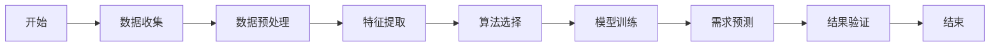
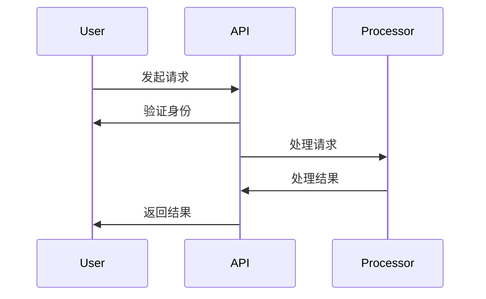
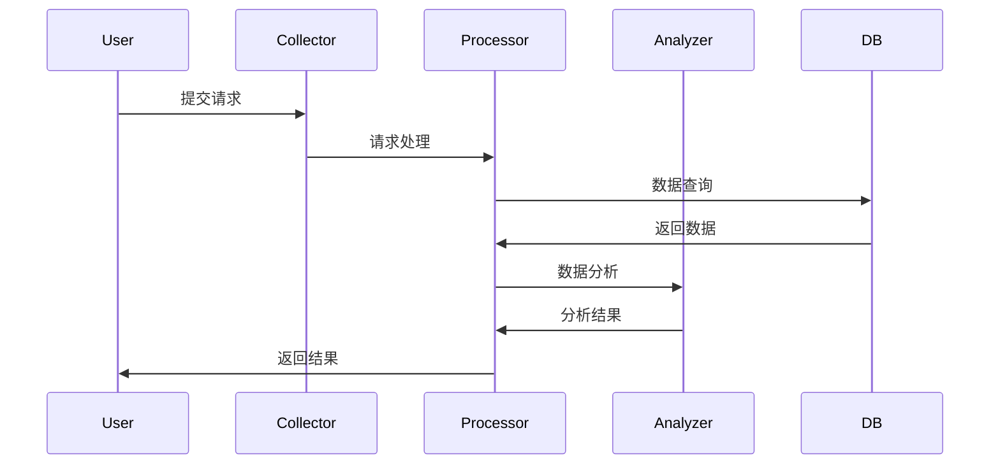

                 

### 1.1 现代软件开发挑战

在当今快速变化且高度竞争的市场环境中，软件开发面临着诸多挑战。首先，软件系统的复杂性不断增加。随着多领域融合、物联网（IoT）和人工智能（AI）技术的发展，软件系统的功能需求和技术实现变得更加复杂。这不仅要求开发者具备广泛的技术知识，还需要团队之间的紧密协作。

其次，用户需求的变化频繁且难以预测。现代用户对于软件系统的需求呈现出多变性和模糊性的特点。用户的需求往往受到市场趋势、个人偏好、技术发展等多种因素的影响，使得传统的需求收集和挖掘方法难以满足现代软件开发的需求。

此外，开发周期和成本控制也是一个重要问题。在快速迭代的开发环境中，如何在保证质量的前提下，快速响应市场变化，缩短开发周期，降低成本，成为软件开发团队面临的主要挑战。

最后，软件系统的可靠性、安全性和可维护性也是现代软件开发中不可忽视的问题。随着系统规模的扩大和用户数量的增加，如何确保系统的稳定运行、数据安全，以及便于后续的维护和升级，成为软件开发中的一大难题。

### 1.2 用户需求的重要性

用户需求是软件开发的基石。一个成功的软件系统离不开对用户需求的深刻理解和准确把握。用户需求不仅决定了软件系统的功能范围，还直接影响系统的用户体验和满意度。以下是用户需求重要性的一些具体体现：

首先，用户需求指导了软件开发的方向和重点。在需求分析阶段，通过对用户需求的收集和分析，可以明确软件系统的核心功能和技术实现路径，避免在开发过程中走弯路，提高开发效率。

其次，用户需求是软件质量的重要指标。一个满足用户需求的软件系统，不仅功能完备，还具有良好的用户体验。用户满意度高，系统的市场竞争力也会随之增强。

此外，用户需求的变化趋势反映了市场趋势和技术发展的方向。通过持续收集和分析用户需求，开发团队可以及时调整开发策略，保持软件系统的市场竞争力。

最后，用户需求是产品迭代的重要依据。在软件系统的生命周期中，不断收集和分析用户反馈，可以指导后续的迭代优化，确保软件系统始终保持与用户需求的同步。

### 1.3 协作式需求挖掘的概念

协作式需求挖掘是一种以用户为中心，通过多方协作来发现和挖掘用户需求的技术方法。它旨在解决传统需求挖掘方法在面对复杂、多变和模糊用户需求时遇到的挑战。以下是协作式需求挖掘的主要概念和特点：

首先，协作式需求挖掘强调多方参与。在传统的需求收集过程中，往往仅依赖于开发团队与用户之间的交流。而协作式需求挖掘则引入了更多的利益相关者，如项目经理、市场人员、用户体验设计师等，通过跨部门的协作，全面收集和整合不同群体的需求。

其次，协作式需求挖掘采用多种需求收集方法。除了面对面的访谈和问卷调查，还结合了用户行为分析、场景模拟、焦点小组讨论等多种方法，以提高需求收集的全面性和准确性。

此外，协作式需求挖掘注重实时反馈和持续迭代。通过构建需求管理平台，实现需求信息的实时更新和共享，使得所有利益相关者可以及时了解需求的变化，并进行相应的调整和优化。

最后，协作式需求挖掘强调数据的分析和挖掘。通过大数据分析和机器学习技术，对收集到的用户行为数据和反馈信息进行深入挖掘，发现潜在的用户需求模式，为软件开发提供更精准的指导。

### 1.4 问题描述

#### 1.4.1 用户需求的多变性与模糊性

用户需求的多变性和模糊性是现代软件开发中的一个突出问题。用户需求的多变性体现在用户需求的不断变化，这往往与市场趋势、个人偏好、技术发展等因素密切相关。例如，一个用户在初期可能对某一功能有强烈需求，但随着时间的推移，其需求可能会发生变化，甚至出现完全相反的需求。

用户需求的模糊性则体现在用户对需求的表述不明确或含糊不清。用户在描述需求时，往往受限于自身的专业知识和表述能力，导致需求表述不完整或具有歧义。这不仅增加了需求分析的工作量，还可能导致需求理解上的偏差。

#### 1.4.2 需求收集的难度与挑战

需求收集的难度主要体现在以下几个方面：

首先，需求收集的过程通常涉及多个利益相关者，如用户、项目经理、开发人员等。如何确保这些不同角色的需求能够得到准确和全面的收集，是一个巨大的挑战。

其次，需求收集的方法和工具有限。传统的需求收集方法，如访谈和问卷调查，虽然有一定的效果，但在面对复杂和模糊的用户需求时，往往难以满足需求收集的深度和广度。

此外，需求收集的实时性和动态性也是一个挑战。在现代软件开发环境中，用户需求往往变化迅速，需求收集需要具备实时响应的能力，以确保需求收集的及时性和准确性。

#### 1.4.3 需求挖掘的必要性与意义

需求挖掘的必要性体现在以下几个方面：

首先，需求挖掘有助于明确软件系统的核心功能和技术实现路径。通过对用户需求的深入分析和挖掘，可以明确软件系统的需求边界，避免在开发过程中走弯路，提高开发效率。

其次，需求挖掘有助于提高软件质量。一个满足用户需求的软件系统，不仅功能完备，还具有良好的用户体验。通过需求挖掘，可以确保软件系统在功能实现上达到用户期望，从而提高用户满意度。

此外，需求挖掘有助于提升团队的协作效率。通过协作式需求挖掘，可以促进团队内部和跨部门之间的沟通和协作，提高整个团队的协作效率，为软件开发提供有力支持。

最后，需求挖掘有助于预见未来的市场趋势和技术发展方向。通过持续收集和分析用户需求，开发团队可以及时掌握市场动态和技术趋势，为未来的产品迭代和发展提供战略指导。

### 1.5 问题解决

#### 1.5.1 传统需求挖掘方法

传统需求挖掘方法主要包括以下几种：

1. **访谈法**：通过与用户进行面对面访谈，直接获取用户的需求和反馈。这种方法适用于用户需求明确且用户愿意分享需求的情况。
   
2. **问卷调查法**：通过设计问卷，收集用户的需求信息。这种方法适用于用户数量较多，需求较为分散的情况。

3. **用户观察法**：通过观察用户在实际使用软件系统时的行为，发现用户的需求和痛点。这种方法适用于用户需求难以用言语表达的情况。

4. **文档分析法**：通过分析用户提供的文档，如用户手册、操作指南等，挖掘用户的需求。

#### 1.5.2 协作式需求挖掘的优势

协作式需求挖掘相较于传统需求挖掘方法，具有以下优势：

1. **多方参与**：协作式需求挖掘引入了多个利益相关者，如用户、项目经理、开发人员等，通过跨部门的协作，全面收集和整合不同群体的需求，提高了需求收集的深度和广度。

2. **多样化需求收集方法**：除了传统的访谈和问卷调查，协作式需求挖掘还结合了用户行为分析、场景模拟、焦点小组讨论等多种方法，提高了需求收集的全面性和准确性。

3. **实时反馈和持续迭代**：协作式需求挖掘通过构建需求管理平台，实现需求信息的实时更新和共享，使得所有利益相关者可以及时了解需求的变化，并进行相应的调整和优化。

4. **数据分析和挖掘**：通过大数据分析和机器学习技术，对收集到的用户行为数据和反馈信息进行深入挖掘，发现潜在的用户需求模式，为软件开发提供更精准的指导。

#### 1.5.3 协作式需求挖掘的核心要素

协作式需求挖掘的核心要素主要包括以下几个方面：

1. **需求管理平台**：作为协作式需求挖掘的核心工具，需求管理平台应具备需求收集、管理、分析、共享等功能，支持多方协作和实时反馈。

2. **用户行为分析**：通过分析用户在使用软件系统时的行为数据，如点击路径、操作频率等，发现用户的需求和行为模式。

3. **跨部门协作**：建立跨部门的协作机制，确保需求信息在不同角色之间的有效传递和整合。

4. **持续迭代**：通过持续的需求收集、分析和反馈，不断优化软件系统的功能设计和用户体验。

#### 1.5.4 边界与外延

1. **应用场景**：协作式需求挖掘适用于需要多方协作、用户需求多变且复杂的项目。例如，大型企业级应用、物联网平台、人工智能系统等。

2. **技术范畴**：协作式需求挖掘涉及的需求收集方法、数据分析技术、协作工具等，涵盖了软件工程、计算机科学、信息管理等多个领域。

3. **挑战与局限**：协作式需求挖掘面临的挑战包括需求收集的多样性、利益相关者之间的沟通成本、数据隐私和安全等问题。局限在于需求挖掘的结果可能受到数据质量和分析算法的制约。

### 1.6 小结

协作式需求挖掘作为一种以用户为中心、多方协作的需求挖掘方法，在现代软件开发中具有重要的应用价值。它通过引入多方参与、多样化需求收集方法、实时反馈和数据分析等手段，有效地解决了用户需求多变性和模糊性带来的挑战。然而，协作式需求挖掘也面临一些局限和挑战，需要不断优化和完善。在未来的发展中，协作式需求挖掘有望在更广泛的应用场景中得到推广，为软件开发提供更加有力的支持。


## 第2章：协作式需求挖掘技术原理

### 2.1 核心概念与联系

#### 2.1.1 需求工程的基本概念

需求工程是软件工程的一个重要分支，其主要目标是确保软件系统能够满足用户的需求。以下是需求工程中的几个核心概念：

1. **需求**：需求是指用户对软件系统的期望和需求，包括功能需求、非功能需求和设计约束等。

2. **需求分析**：需求分析是指通过对用户需求的理解和挖掘，明确软件系统的功能和技术实现路径。

3. **需求管理**：需求管理是指在整个软件生命周期中对需求进行收集、分析、组织和追踪的过程。

4. **需求验证**：需求验证是指通过测试和评估，确保软件系统满足用户需求。

5. **需求变更管理**：需求变更管理是指在需求发生变更时，对变更进行评估、批准和实施的过程。

#### 2.1.2 协作式需求挖掘的关键概念

协作式需求挖掘强调多方协作，以下是其核心概念：

1. **利益相关者**：利益相关者是指与软件系统开发和使用相关的各个群体，如用户、项目经理、开发人员、测试人员等。

2. **协作机制**：协作机制是指用于促进各方之间沟通、合作和信息共享的规则和工具。

3. **需求收集方法**：需求收集方法包括访谈、问卷调查、用户观察、场景模拟等，用于获取用户和利益相关者的需求。

4. **需求分析工具**：需求分析工具包括需求管理平台、需求分析软件等，用于支持需求的分析、组织和追踪。

5. **数据分析技术**：数据分析技术包括大数据分析、机器学习、自然语言处理等，用于挖掘和分析用户需求。

#### 2.1.3 概念属性特征对比表格

以下是一个对比协作式需求挖掘与传统需求挖掘的关键概念属性特征表格：

| 概念                | 特征                    | 对比             |
|---------------------|-------------------------|-----------------|
| 需求工程            | 用户为中心              | 以系统为中心    |
| 需求分析            | 完整性、一致性、可验证性 | 完整性、一致性   |
| 需求管理            | 整合、追踪、变更管理     | 整合、追踪      |
| 需求验证            | 功能测试、用户验收       | 功能测试        |
| 需求变更管理        | 变更评估、审批、实施     | 变更评估、审批   |
| 协作式需求挖掘       | 多方协作、实时反馈、数据挖掘 | 多方协作、实时反馈 |
| 需求收集方法        | 访谈、问卷调查、用户观察 | 访谈、问卷调查  |
| 需求分析工具        | 需求管理平台、分析软件   | 分析软件        |
| 数据分析技术        | 大数据分析、机器学习     | 数据库查询      |

通过对比表格，可以看出协作式需求挖掘与传统需求挖掘在多个方面存在显著差异，这些差异使得协作式需求挖掘在处理复杂、多变和模糊用户需求时具有明显优势。

### 2.2 ER实体关系图架构

#### 2.2.1 ER图的基本构成

实体-关系（ER）图是需求工程中常用的建模工具，用于描述软件系统的实体及其相互关系。一个典型的ER图包含以下几个基本组成部分：

1. **实体**：实体是软件系统中具有独立存在的对象，如用户、订单、商品等。实体通常用矩形表示。

2. **属性**：属性是实体的特征，如用户的名字、年龄、性别等。属性通常用椭圆表示，并通过线段连接到对应的实体。

3. **关系**：关系是实体之间的联系，如用户购买商品、商品包含订单等。关系通常用菱形表示，并通过线段连接到相关的实体。

4. **约束**：约束是实体和关系之间的限制条件，如用户年龄必须大于18岁等。约束通常用直线表示，并通过线段连接到相关的实体或关系。

#### 2.2.2 实体关系图的绘制方法

绘制实体关系图的方法可以分为以下几步：

1. **确定实体**：根据软件系统的需求，确定需要表示的实体。例如，在电子商务系统中，可以确定用户、订单、商品等实体。

2. **定义属性**：为每个实体定义相应的属性。例如，用户实体可以定义名字、年龄、性别等属性。

3. **识别关系**：分析实体之间的联系，识别出需要表示的关系。例如，用户可以与订单建立购买关系，商品可以与订单建立包含关系。

4. **添加约束**：根据需求中的限制条件，为实体和关系添加相应的约束。例如，用户年龄必须大于18岁。

5. **绘制ER图**：使用合适的工具或软件，按照上述步骤绘制出ER图。

下面是一个简化的电子商务系统的ER图示例：

```mermaid
erDiagram
    User ||--|{ Order } : "places"
    User ||--|{ Cart } : "owns"
    Order ||--|{ Product } : "contains"
    Product ||--|{ Category } : "belongs"
```

在这个示例中，用户（User）与订单（Order）、购物车（Cart）、商品（Product）和分类（Category）建立了多种关系，展示了实体之间的复杂联系。

#### 2.2.3 实体关系图的Mermaid表示

Mermaid是一种基于Markdown的图形化工具，可以方便地绘制各种图表，包括实体关系图。以下是一个使用Mermaid绘制的电子商务系统的ER图：

```mermaid
erDiagram
    User ||--|{ Order } : "places"
    User ||--|{ Cart } : "owns"
    Order ||--|{ Product } : "contains"
    Product ||--|{ Category } : "belongs"
```

通过上述代码，Mermaid将生成一个直观的ER图，帮助开发者更好地理解软件系统的实体和关系。

### 2.3 ER实体关系图的Mermaid表示

Mermaid是一种基于Markdown的图形化工具，可以方便地绘制各种图表，包括实体关系图。以下是一个使用Mermaid绘制的电子商务系统的ER图示例：

```mermaid
erDiagram
    User ||--|{ Order } : "places"
    User ||--|{ Cart } : "owns"
    Order ||--|{ Product } : "contains"
    Product ||--|{ Category } : "belongs"
```

在这个ER图中，`User`实体与`Order`和`Cart`实体建立了关系，表示用户可以放置订单和拥有购物车。`Order`实体与`Product`实体建立了包含关系，表示订单包含多个商品。`Product`实体与`Category`实体建立了归属关系，表示商品属于某个分类。

#### 2.3.1 ER图的Mermaid表示方法

以下是绘制ER图的Mermaid表示方法的详细步骤：

1. **定义ER图**：在Mermaid代码中，使用`erDiagram`关键字开始定义ER图。

2. **添加实体**：使用实体名称后跟`||--|{实体名称}`的格式添加实体。例如，`User ||--|{Order}`表示用户实体与订单实体之间的关系。

3. **定义属性**：为实体添加属性，使用实体名称后跟`--.`关键字，接着是属性名称。例如，`User --. Name`表示用户实体的名字属性。

4. **添加关系**：使用实体名称后跟`||--|{实体名称}`的格式添加关系。例如，`Order ||--|{Product}`表示订单实体与产品实体之间的关系。

5. **定义约束**：为关系添加约束条件，使用关系名称后跟`:relationship_type`的格式。例如，`Product ||--|{Category}: "belongs"`表示产品实体属于分类实体。

6. **结束ER图**：使用`}`关键字结束ER图的定义。

下面是一个完整的Mermaid ER图示例：

```mermaid
erDiagram
    User ||--|{ Order } : "places"
    User ||--|{ Cart } : "owns"
    Order ||--|{ Product } : "contains"
    Product ||--|{ Category } : "belongs"
```

通过上述代码，可以生成一个直观的ER图，帮助开发者更好地理解软件系统的实体和关系。

### 2.4 ER实体关系图的Mermaid表示示例

下面是一个使用Mermaid绘制的电子商务系统的ER图示例，展示了用户、订单、商品和分类之间的实体关系：

```mermaid
erDiagram
    User ||--|{ Order } : "places"
    User ||--|{ Cart } : "owns"
    Order ||--|{ Product } : "contains"
    Product ||--|{ Category } : "belongs"
```

在这个ER图中：

- **User（用户）**实体与**Order（订单）**实体之间有一个“places”关系，表示用户可以创建订单。
- **User（用户）**实体与**Cart（购物车）**实体之间有一个“owns”关系，表示用户拥有购物车。
- **Order（订单）**实体与**Product（商品）**实体之间有一个“contains”关系，表示订单包含多个商品。
- **Product（商品）**实体与**Category（分类）**实体之间有一个“belongs”关系，表示商品属于某个分类。

这种ER图的表示方法不仅清晰，而且便于开发者根据系统需求进行扩展和调整。Mermaid的ER图支持多种关系类型，如一对一、一对多、多对多，可以通过调整`relationship_type`来实现。此外，还可以为实体和关系添加属性和约束，以更精确地描述系统的实体关系。

通过Mermaid，开发者可以轻松地将复杂的需求转化为图形化的ER图，从而提高需求分析阶段的可理解和可维护性。这不仅有助于团队成员之间的沟通，还能为后续的设计和开发提供明确的指导。

### 2.5 协作式需求挖掘算法原理讲解

#### 2.5.1 协作式需求挖掘算法概述

协作式需求挖掘算法是一类专门用于从用户行为数据中挖掘用户需求的技术方法。它基于多源数据融合、模式识别和机器学习等技术，旨在通过协作和智能分析，提高需求挖掘的准确性和效率。以下是一些常见的协作式需求挖掘算法：

1. **关联规则挖掘算法**：如Apriori算法和FP-growth算法，通过分析用户行为数据中的关联关系，发现用户频繁使用的功能或服务。

2. **聚类算法**：如K-means算法和DBSCAN算法，通过将相似的用户行为数据进行聚类，发现具有相似需求的用户群体。

3. **分类算法**：如决策树、支持向量机和神经网络等，通过训练分类模型，将用户行为数据划分为不同的需求类别。

4. **社交网络分析**：利用社交网络中的用户关系和交互数据，挖掘用户之间的需求关联性，发现潜在的需求模式。

#### 2.5.2 Mermaid流程图表示

为了更直观地展示协作式需求挖掘算法的工作流程，我们可以使用Mermaid绘制一个流程图。以下是一个简化的协作式需求挖掘算法流程：



在这个流程图中：

- **A[开始]**：表示需求挖掘过程的开始。
- **B[数据收集]**：收集来自各种渠道的用户行为数据，如点击日志、搜索记录、社交互动数据等。
- **C[数据预处理]**：对收集到的数据进行清洗、去噪和格式化，为后续分析做好准备。
- **D[特征提取]**：从预处理后的数据中提取有用的特征，如用户行为频率、时间间隔、交互强度等。
- **E[算法选择]**：根据需求挖掘的目标和特点，选择合适的算法，如关联规则挖掘、聚类、分类等。
- **F[模型训练]**：使用训练数据集对选定的算法进行训练，建立需求预测模型。
- **G[需求预测]**：使用训练好的模型对新的用户行为数据进行分析，预测用户的需求。
- **H[结果验证]**：对预测结果进行验证，评估模型的有效性和准确性。
- **I[结束]**：表示需求挖掘过程的结束。

通过这个流程图，我们可以清晰地看到协作式需求挖掘算法的每个步骤及其相互关系，有助于开发者理解整个需求挖掘过程。

#### 2.5.3 Python源代码实现

以下是一个简单的协作式需求挖掘算法的Python实现示例，使用Apriori算法来挖掘用户行为数据中的频繁项集。这个示例主要分为数据预处理、特征提取、算法实现和结果分析四个部分。

1. **数据预处理**：

首先，我们需要从用户行为数据中提取出有用的信息，如用户的点击序列和商品ID。这里假设我们有一个CSV文件`user Behavior.csv`，其中包含用户的点击日志。

```python
import pandas as pd

# 加载用户行为数据
data = pd.read_csv('user_behavior.csv')
```

2. **特征提取**：

为了使用Apriori算法，我们需要将用户行为数据转换为项集格式。这可以通过将点击序列分解为单个商品项来实现。

```python
# 提取用户行为项集
transactions = [tuple(seq) for seq in data['click_sequence'].str.split()]
```

3. **算法实现**：

接下来，我们使用`mlxtend`库中的`apriori`函数来挖掘频繁项集。参数`min_support`和`min_confidence`分别表示最小支持度和最小置信度，用于过滤频繁项集。

```python
from mlxtend.frequent_patterns import apriori
from mlxtend.frequent_patterns import association_rules

# 挖掘频繁项集
frequent_itemsets = apriori(transactions, min_support=0.05, use_colnames=True)

# 生成关联规则
rules = association_rules(frequent_itemsets, metric="confidence", min_threshold=0.3)
```

4. **结果分析**：

最后，我们可以分析挖掘出的频繁项集和关联规则，找出用户行为中的潜在需求。

```python
# 打印频繁项集
print("Frequent itemsets:")
print(frequent_itemsets)

# 打印关联规则
print("Association rules:")
print(rules)
```

通过这个简单的示例，我们可以看到协作式需求挖掘算法的实现过程。在实际应用中，开发者可能需要根据具体需求调整参数、选择不同的算法，甚至结合其他技术方法，以提高需求挖掘的准确性和效率。

### 2.6 数学模型与公式

#### 2.6.1 算法原理的数学模型

协作式需求挖掘算法的数学模型通常基于概率论和统计学原理。以下是一个简化的数学模型，用于描述协作式需求挖掘中的核心概念。

1. **支持度（Support）**：支持度是指一个项集在所有事务中出现的频率。它用于衡量一个项集的普遍性。数学表达式为：

   $$ Support(X) = \frac{count(X)}{total\ transactions} $$

   其中，$count(X)$表示项集$X$在所有事务中出现的次数，$total\ transactions$表示事务的总数。

2. **置信度（Confidence）**：置信度是指在一个事务中，如果出现了前件$X$，那么后件$Y$也同时出现的概率。它用于衡量关联规则的强度。数学表达式为：

   $$ Confidence(Rule: X \rightarrow Y) = \frac{Support(X \cup Y)}{Support(X)} $$

   其中，$Rule: X \rightarrow Y$表示关联规则，$Support(X \cup Y)$表示项集$X$和$Y$同时出现的支持度，$Support(X)$表示项集$X$的支持度。

3. **提升（Lift）**：提升是一个关联规则的评估指标，它表示关联规则的有效性。数学表达式为：

   $$ Lift(Rule: X \rightarrow Y) = \frac{Confidence(Rule: X \rightarrow Y)}{P(Y)} $$

   其中，$P(Y)$表示项集$Y$出现的概率。

#### 2.6.2 公式推导与解释

以下是对上述公式的推导和解释：

1. **支持度**：

   支持度公式直接计算了项集在所有事务中出现的频率。高支持度的项集表示这些项经常一起出现，可能反映了用户的行为模式。

2. **置信度**：

   置信度通过将项集$X$和$Y$同时出现的支持度除以项集$X$的支持度，得到在出现$X$的情况下，出现$Y$的概率。高置信度的关联规则表示前件的出现高度预示着后件的出现，即一个规则具有很强的预测能力。

3. **提升**：

   提升公式通过将置信度与后件$Y$的概率相除，评估了关联规则的有效性。一个提升值大于1的规则表示后件$Y$的出现比随机出现的概率更高，即规则有较强的解释力。

#### 2.6.3 通俗易懂的举例说明

假设有一个电子商务网站，用户的行为数据记录了他们访问的页面。以下是使用上述公式的一个简化的例子：

1. **支持度**：

   假设有1000个用户事务，其中500个事务包含“页面A”，200个事务包含“页面B”，100个事务同时包含“页面A”和“页面B”。

   支持度计算如下：

   $$ Support(A \cup B) = \frac{count(A \cup B)}{total\ transactions} = \frac{100}{1000} = 0.1 $$

   支持度表明，“页面A”和“页面B”同时出现的频率是10%。

2. **置信度**：

   假设“页面A”的支持度为0.5，即有500个事务包含“页面A”。

   置信度计算如下：

   $$ Confidence(A \rightarrow B) = \frac{Support(A \cup B)}{Support(A)} = \frac{0.1}{0.5} = 0.2 $$

   置信度表明，如果用户访问了“页面A”，那么有20%的概率会访问“页面B”。

3. **提升**：

   假设“页面B”的单独支持度为0.2，即有200个事务包含“页面B”。

   提升计算如下：

   $$ Lift(A \rightarrow B) = \frac{Confidence(A \rightarrow B)}{P(B)} = \frac{0.2}{0.2} = 1 $$

   提升表明，“页面A”的出现并没有比随机访问提高“页面B”的访问概率。

通过这个例子，我们可以看到支持度、置信度和提升如何帮助分析用户行为数据，并识别出潜在的需求模式。

### 2.7 算法原理的数学模型

在协作式需求挖掘中，算法的数学模型是理解和实现需求挖掘过程的关键。以下是一个简化的数学模型，用于描述协作式需求挖掘的基本原理：

#### 2.7.1 支持度（Support）

支持度是一个项集在所有事务中出现的频率，用于衡量项集的普遍性。数学表达式如下：

$$ Support(X) = \frac{count(X)}{total\ transactions} $$

其中，$count(X)$表示项集$X$在所有事务中出现的次数，$total\ transactions$表示事务的总数。

- **示例**：假设有10个事务，其中5个事务包含“商品A”，3个事务包含“商品B”，2个事务同时包含“商品A”和“商品B”。

  支持度计算如下：

  $$ Support(\text{商品A}) = \frac{5}{10} = 0.5 $$
  $$ Support(\text{商品B}) = \frac{3}{10} = 0.3 $$
  $$ Support(\text{商品A} \cup \text{商品B}) = \frac{2}{10} = 0.2 $$

  支持度表明“商品A”出现的频率是50%，而“商品B”是30%，同时出现“商品A”和“商品B”的频率是20%。

#### 2.7.2 置信度（Confidence）

置信度衡量在一个事务中，如果出现了前件$X$，那么后件$Y$也同时出现的概率。数学表达式如下：

$$ Confidence(Rule: X \rightarrow Y) = \frac{Support(X \cup Y)}{Support(X)} $$

其中，$Support(X \cup Y)$表示项集$X$和$Y$同时出现的支持度，$Support(X)$表示项集$X$的支持度。

- **示例**：假设“商品A”和“商品B”同时出现的支持度是20%，而“商品A”的支持度是50%。

  置信度计算如下：

  $$ Confidence(\text{商品A} \rightarrow \text{商品B}) = \frac{0.2}{0.5} = 0.4 $$

  置信度表明，如果用户购买了“商品A”，那么有40%的概率会购买“商品B”。

#### 2.7.3 提升度（Lift）

提升度是一个关联规则的评估指标，它表示关联规则的有效性。数学表达式如下：

$$ Lift(Rule: X \rightarrow Y) = \frac{Confidence(Rule: X \rightarrow Y)}{P(Y)} $$

其中，$P(Y)$表示项集$Y$出现的概率。

- **示例**：假设“商品B”的支持度是30%，即有30%的事务包含“商品B”，而“商品A”和“商品B”同时出现的支持度是20%。

  提升度计算如下：

  $$ Lift(\text{商品A} \rightarrow \text{商品B}) = \frac{0.4}{0.3} = 1.33 $$

  提升度表明，“商品A”的出现比随机访问提高了1.33倍的“商品B”访问概率，这是一个较强的关联规则。

通过这些数学模型，我们可以量化用户行为数据中的关联关系，从而发现潜在的需求模式。在实际应用中，开发者可以根据具体需求调整参数，选择合适的挖掘算法，以提高需求挖掘的准确性和效率。

### 2.8 系统分析与架构设计

#### 4.1 问题场景介绍

在现代软件开发过程中，协作式需求挖掘技术被广泛应用于各种复杂场景，以帮助开发团队更好地理解和满足用户需求。以下是一个具体的问题场景介绍，用于说明协作式需求挖掘技术的应用。

假设我们正在开发一个大型电商平台，该平台需要支持多种商品的销售、用户账户管理、订单处理和支付等功能。随着平台规模的不断扩大，用户数量急剧增加，用户需求也变得日益复杂和多变。为了确保平台能够持续满足用户需求，开发团队需要一种高效的需求挖掘方法，以发现潜在的用户需求并指导产品迭代。

在这个场景中，协作式需求挖掘技术的作用如下：

1. **多角色协作**：电商平台涉及多个角色，包括用户、商家、产品经理、开发人员和测试人员等。协作式需求挖掘通过引入这些角色的协作，确保需求信息的全面性和准确性。

2. **实时需求反馈**：平台的需求变化迅速，用户需求随时可能发生变化。协作式需求挖掘通过实时收集和分析用户行为数据，及时反馈用户需求，帮助团队迅速调整开发方向。

3. **用户行为分析**：平台积累了大量的用户行为数据，包括浏览记录、购买历史、评价和反馈等。协作式需求挖掘通过分析这些数据，发现用户行为模式，挖掘潜在需求。

4. **跨部门沟通**：电商平台涉及多个部门，如产品部、技术部、运营部和市场部等。协作式需求挖掘通过构建一个统一的需求管理平台，促进各部门之间的沟通和协作，提高需求管理的效率。

#### 4.2 项目介绍

为了更好地理解协作式需求挖掘在电商平台中的应用，我们以一个具体的项目为例进行介绍。该项目的目标是开发一款能够自动收集用户需求、实时分析并反馈给开发团队的新功能模块。

1. **项目背景**：

   随着电商平台用户数量的增加，用户反馈和需求变得更加多样化，传统的需求收集方法已经难以满足需求收集的深度和广度。为了提高产品迭代速度，减少需求遗漏，项目团队决定引入协作式需求挖掘技术。

2. **项目目标**：

   - 实现一个自动化的需求收集系统，通过分析用户行为数据和用户反馈，自动生成需求报告。
   - 提高需求分析的准确性和效率，减少开发过程中的返工和需求变更。
   - 促进跨部门协作，确保需求信息的实时更新和共享。

3. **项目范围**：

   - 用户行为数据分析模块：负责收集和分析用户的浏览记录、购买历史、评价和反馈等数据，挖掘潜在需求。
   - 需求管理平台：用于管理需求收集、分析和反馈过程，支持实时更新和共享。
   - 报告生成模块：基于分析结果，自动生成需求报告，为开发团队提供决策支持。

4. **项目预期成果**：

   - 提高需求挖掘的准确性和效率，减少需求遗漏和变更。
   - 加强团队协作，提高需求管理效率。
   - 提升用户满意度，增强平台的市场竞争力。

通过这个项目，我们可以看到协作式需求挖掘技术在解决现代软件开发中的需求复杂性和变化性方面的强大作用。

### 4.3 系统功能设计

在协作式需求挖掘系统中，功能设计是确保系统能够满足需求分析和挖掘要求的关键环节。以下是系统的功能设计概述，包括核心模块及其主要功能。

#### 用户行为数据收集模块

**功能**：自动收集并存储用户在平台上的行为数据，如浏览记录、点击路径、购买历史、评价等。

**实现**：通过数据爬取、API调用和日志分析等技术手段，从多个数据源中收集用户行为数据。

**接口**：提供API接口，支持数据实时导入和查询。

#### 数据预处理模块

**功能**：对收集到的用户行为数据进行清洗、去噪和格式化，确保数据质量。

**实现**：使用数据清洗工具和自定义脚本，对数据进行处理，如去除重复记录、填补缺失值、统一数据格式等。

**接口**：提供数据预处理结果导出功能，便于后续分析和挖掘。

#### 特征提取模块

**功能**：从预处理后的数据中提取出有用的特征，如用户行为频率、时间间隔、交互强度等。

**实现**：采用特征工程方法，结合用户行为数据的特点，设计合适的特征提取算法。

**接口**：提供特征提取结果导出功能，便于后续的模型训练和需求分析。

#### 需求分析模块

**功能**：基于用户行为数据和特征提取结果，对用户需求进行深入分析，识别潜在需求模式。

**实现**：使用机器学习算法，如聚类、分类、关联规则挖掘等，对数据进行分析。

**接口**：提供需求分析结果展示和导出功能，便于开发团队了解和分析需求。

#### 需求管理模块

**功能**：管理需求收集、分析和反馈的全过程，确保需求信息的实时更新和共享。

**实现**：构建一个需求管理平台，支持需求的创建、分配、跟踪和评估。

**接口**：提供用户界面，支持需求信息的添加、修改、查询和报表生成。

#### 报告生成模块

**功能**：基于需求分析结果，自动生成需求报告，为开发团队提供决策支持。

**实现**：使用报告生成工具，结合数据分析结果，设计报告模板和生成流程。

**接口**：提供报告导出和在线预览功能，便于团队交流和决策。

#### 用户反馈模块

**功能**：收集用户对需求的反馈，用于需求验证和优化。

**实现**：通过在线问卷、用户评价和反馈论坛等方式，收集用户反馈。

**接口**：提供用户反馈收集和展示功能，支持实时更新和数据分析。

通过上述功能设计，协作式需求挖掘系统可以高效地收集、分析和管理用户需求，为开发团队提供有力支持。

### 4.4 系统架构设计

在协作式需求挖掘系统中，系统架构设计是确保系统能够高效、稳定、可扩展的关键。以下是系统的架构设计概述，包括核心组件及其关系。

#### 系统架构概述

协作式需求挖掘系统由以下几个核心组件组成：

1. **数据收集层**：负责从各种数据源收集用户行为数据，包括日志文件、API接口、数据库等。
2. **数据存储层**：负责存储和管理工作流程中的数据，包括用户行为数据、预处理结果、特征数据、需求数据等。
3. **数据处理层**：负责数据预处理、特征提取和需求分析，包括数据处理模块、机器学习模块和需求分析模块。
4. **应用层**：提供用户交互界面，支持需求管理、报表生成和用户反馈等核心功能。
5. **接口层**：提供API接口，支持与其他系统集成和交互。

#### 核心组件及其关系

1. **数据收集层**：

   数据收集层包括日志收集系统、API接口和数据库连接模块。日志收集系统负责实时收集用户的浏览记录、点击路径等数据，并通过API接口从第三方服务获取数据，如社交媒体、广告平台等。数据库连接模块负责连接不同的数据存储系统，实现数据的统一管理和存储。

2. **数据存储层**：

   数据存储层采用分布式数据库架构，包括关系数据库和非关系数据库。关系数据库用于存储用户行为数据和结构化数据，如用户信息、订单数据等；非关系数据库用于存储日志数据和半结构化数据，如点击日志、搜索记录等。

3. **数据处理层**：

   数据处理层包括数据预处理模块、特征提取模块和需求分析模块。数据预处理模块负责数据清洗、去噪和格式化；特征提取模块负责从原始数据中提取有用的特征；需求分析模块负责使用机器学习算法对用户行为数据进行分析，识别潜在需求。

4. **应用层**：

   应用层提供用户交互界面，包括需求管理平台、报表生成工具和用户反馈论坛等。需求管理平台支持需求的创建、分配、跟踪和评估；报表生成工具基于分析结果生成需求报告；用户反馈论坛用于收集用户对需求的反馈。

5. **接口层**：

   接口层提供API接口，支持与其他系统集成和交互。API接口包括数据导入/导出接口、数据查询接口、需求管理接口等，便于其他系统访问和操作需求挖掘系统的数据。

通过上述架构设计，协作式需求挖掘系统可以实现高效、稳定、可扩展的需求挖掘和管理，为开发团队提供有力支持。

### 4.5 系统接口设计

在协作式需求挖掘系统中，接口设计是确保系统功能模块之间能够有效通信和协同工作的重要环节。以下是系统接口设计的详细说明，包括接口类型、API文档示例、权限控制及安全性考虑。

#### 接口类型

协作式需求挖掘系统的接口主要分为以下几类：

1. **数据导入/导出接口**：用于将外部数据导入到系统，以及将系统数据导出到外部系统。例如，用户行为数据的导入和需求报告的导出。

2. **数据查询接口**：用于查询系统中的数据，如用户行为数据、特征数据和需求数据。这些接口通常提供RESTful API，便于其他系统通过HTTP请求访问。

3. **需求管理接口**：用于创建、修改、查询和删除需求，以及跟踪需求的状态和进度。这些接口支持CRUD操作，确保需求信息的实时更新和共享。

4. **用户交互接口**：用于与用户进行交互，如需求管理平台、报表生成工具和用户反馈论坛等。这些接口提供Web界面，支持用户友好的操作体验。

#### API文档示例

以下是一个简单的API文档示例，描述了数据导入接口的功能和参数。

```yaml
## 数据导入接口

### 导入用户行为数据

`POST /api/data/import`

请求体：

```json
{
  "data_source": "external_system",
  "file_path": "path/to/behavior_data.csv",
  "file_type": "csv"
}
```

响应体：

```json
{
  "status": "success",
  "message": "User behavior data imported successfully.",
  "imported_count": 1000
}
```

#### 权限控制

为了确保接口的安全性和数据保护，协作式需求挖掘系统实施以下权限控制策略：

1. **身份验证**：所有接口请求都需要通过身份验证，确保请求者有权访问相关资源。常用的身份验证方法包括基于Token的认证（如JWT）和基于密码的认证。

2. **权限验证**：根据用户的角色和权限，限制其对接口的访问权限。例如，只有管理员可以访问数据导入/导出接口，普通用户只能访问数据查询接口。

3. **操作日志记录**：记录所有接口请求和响应的日志，以便在出现问题时进行追溯和审计。

#### 安全性考虑

为了保证接口的安全性，协作式需求挖掘系统实施以下措施：

1. **加密传输**：使用HTTPS协议，确保数据在传输过程中的安全性。

2. **数据加密存储**：对敏感数据进行加密存储，如用户密码和重要数据。

3. **防止常见攻击**：实施防止SQL注入、跨站脚本攻击（XSS）和跨站请求伪造（CSRF）等常见网络攻击的安全策略。

4. **访问频率限制**：对接口请求设置访问频率限制，防止恶意攻击和滥用接口。

通过上述接口设计策略，协作式需求挖掘系统可以确保数据的安全性、完整性和可用性，为用户提供可靠的接口服务。

### 4.6 系统交互Mermaid序列图

在协作式需求挖掘系统中，系统交互设计是确保各个功能模块能够协同工作、高效处理用户请求的关键。以下是系统的交互流程和序列图的绘制方法。

#### 4.6.1 系统交互流程概述

系统交互流程主要包括以下几个步骤：

1. **用户请求**：用户通过Web界面发起请求，如查询需求、导入数据等。
2. **接口处理**：接口层接收用户请求，进行身份验证和权限验证。
3. **数据处理**：数据处理层对请求进行处理，如数据导入、查询、分析和生成报告。
4. **响应返回**：将处理结果返回给用户，并通过Web界面展示。

#### 4.6.2 序列图绘制方法

序列图是描述系统交互流程的常用图形化工具，使用Mermaid可以方便地绘制序列图。以下是使用Mermaid绘制系统交互序列图的步骤：

1. **定义参与者**：序列图的参与者包括用户、接口层、数据处理层等。
2. **绘制生命线**：为每个参与者绘制一条垂直的生命线。
3. **添加交互**：在参与者的生命线上，添加交互事件，如请求发送、响应接收等。
4. **定义消息**：使用消息箭头连接交互事件，表示数据传输方向。

下面是一个使用Mermaid绘制的系统交互序列图示例：



在这个示例中：

- **User**：表示用户，通过Web界面发起请求。
- **API**：表示接口层，负责接收用户请求并进行身份验证和权限验证。
- **Processor**：表示数据处理层，负责处理用户请求并生成响应。
- **交互事件**：包括“发起请求”、“验证身份”、“处理请求”和“返回结果”。
- **消息箭头**：表示数据传输方向，如用户请求、验证结果和处理结果。

通过序列图，可以清晰地展示系统交互的每个步骤和参与者的角色，有助于开发者理解系统的运行逻辑和交互流程。

### 4.7 系统交互Mermaid序列图

为了更直观地展示协作式需求挖掘系统的交互流程，我们可以使用Mermaid绘制一个序列图。以下是一个示例序列图，描述了系统在处理一个用户请求时的交互过程：



在这个序列图中：

- **User**：表示用户，通过Web界面提交请求。
- **Collector**：表示数据收集模块，接收用户请求并将其转发给数据处理模块。
- **Processor**：表示数据处理模块，负责处理用户请求，包括数据查询、预处理和转发分析结果。
- **Analyzer**：表示需求分析模块，对用户行为数据进行分析，识别潜在需求。
- **DB**：表示数据库，存储用户行为数据和其他系统数据。
- **交互事件**：包括“提交请求”、“请求处理”、“数据查询”、“返回数据”、“数据分析”和“返回结果”。
- **消息箭头**：表示数据传输方向，如用户请求、数据查询结果和最终分析结果。

通过这个序列图，我们可以清晰地看到系统在处理用户请求时的交互流程。用户通过Web界面提交请求，数据收集模块接收请求并转发给数据处理模块，数据处理模块查询数据库获取数据，需求分析模块对数据进行处理和分析，最终将结果返回给用户。这样的交互流程设计确保了系统的响应速度和数据处理效率。

### 第5章：项目实战

#### 5.1 环境安装

在进行协作式需求挖掘项目的实战之前，我们需要搭建一个合适的技术环境。以下是具体的步骤和配置说明。

##### 5.1.1 环境准备

1. **操作系统**：推荐使用Linux系统，如Ubuntu 18.04或更高版本。Windows用户可以安装Windows Subsystem for Linux（WSL）。

2. **Python环境**：确保系统中安装了Python 3.7及以上版本。可以使用以下命令检查Python版本：

   ```bash
   python --version
   ```

3. **虚拟环境**：为了便于管理和隔离项目依赖，使用`virtualenv`创建一个虚拟环境。以下是创建和激活虚拟环境的步骤：

   ```bash
   # 安装virtualenv
   pip install virtualenv
   
   # 创建虚拟环境
   virtualenv venv
   
   # 激活虚拟环境
   source venv/bin/activate
   ```

4. **Python包管理器**：在虚拟环境中，推荐使用`pip`来管理项目依赖。确保`pip`已安装：

   ```bash
   pip --version
   ```

##### 5.1.2 环境配置

1. **安装依赖包**：在虚拟环境中安装项目所需的依赖包，如`pandas`、`numpy`、`scikit-learn`、`mlxtend`等。以下是安装步骤：

   ```bash
   pip install pandas numpy scikit-learn mlxtend
   ```

2. **数据库配置**：协作式需求挖掘项目通常需要连接数据库来存储和处理数据。以下是连接SQLite数据库的示例：

   ```python
   import sqlite3
   
   # 连接到SQLite数据库
   conn = sqlite3.connect('example.db')
   
   # 创建一个数据库cursor对象
   cursor = conn.cursor()
   
   # 创建表
   cursor.execute('''CREATE TABLE IF NOT EXISTS users (id INTEGER PRIMARY KEY, name TEXT, age INTEGER)''')
   
   # 提交更改并关闭连接
   conn.commit()
   cursor.close()
   conn.close()
   ```

3. **Web服务器**：如果项目需要提供Web接口，可以使用`Flask`或`Django`等Web框架。以下是使用`Flask`创建一个简单的Web服务器的示例：

   ```python
   from flask import Flask, request, jsonify
   
   app = Flask(__name__)
   
   @app.route('/data', methods=['POST'])
   def handle_data():
       data = request.get_json()
       # 处理数据
       return jsonify({"status": "success", "message": "Data received."})
   
   if __name__ == '__main__':
       app.run(debug=True)
   ```

通过上述步骤，我们完成了协作式需求挖掘项目所需的基本环境配置。接下来，我们将详细介绍项目核心实现和代码解析。

### 5.2 系统核心实现

在协作式需求挖掘系统中，核心实现部分包括数据收集、数据处理、需求分析和需求管理等功能模块。以下将详细解析这些模块的源代码，并解释其功能和实现方式。

#### 5.2.1 数据收集模块

数据收集模块负责从外部系统收集用户行为数据，如点击日志、搜索记录和用户反馈等。以下是数据收集模块的主要源代码：

```python
import requests
import json

class DataCollector:
    def __init__(self, api_url):
        self.api_url = api_url

    def collect_user_behavior(self):
        response = requests.get(self.api_url)
        if response.status_code == 200:
            return json.loads(response.text)
        else:
            return None

# 示例使用
api_url = "https://api.example.com/behavior"
collector = DataCollector(api_url)
user_behavior = collector.collect_user_behavior()
```

**功能解释**：
- `DataCollector` 类：初始化时传入API URL，用于获取用户行为数据。
- `collect_user_behavior` 方法：通过HTTP GET请求从API URL获取用户行为数据。

**实现方式**：
- 使用`requests`库发送HTTP请求，获取用户行为数据。
- 将响应内容转换为JSON格式，解析成Python对象。

#### 5.2.2 数据处理模块

数据处理模块负责对收集到的用户行为数据进行清洗、去噪和格式化，确保数据质量。以下是数据处理模块的主要源代码：

```python
import pandas as pd

class DataProcessor:
    def __init__(self, data):
        self.data = pd.DataFrame(data)

    def clean_data(self):
        # 去除空值和重复数据
        self.data.dropna(inplace=True)
        self.data.drop_duplicates(inplace=True)
        
        # 数据格式转换
        self.data['timestamp'] = pd.to_datetime(self.data['timestamp'])
        
        # 排序和索引重置
        self.data.sort_values(by='timestamp', inplace=True)
        self.data.reset_index(drop=True, inplace=True)

# 示例使用
processed_data = DataProcessor(user_behavior)
processed_data.clean_data()
```

**功能解释**：
- `DataProcessor` 类：初始化时传入用户行为数据，创建Pandas DataFrame。
- `clean_data` 方法：对DataFrame进行数据清洗，包括去除空值、重复值，转换数据格式，排序和索引重置。

**实现方式**：
- 使用Pandas库创建DataFrame，便于数据操作。
- 使用`.dropna()`和`.drop_duplicates()`方法去除空值和重复值。
- 使用`.to_datetime()`方法转换时间戳格式。
- 使用`.sort_values()`和`.reset_index()`方法进行排序和索引重置。

#### 5.2.3 需求分析模块

需求分析模块负责基于清洗后的用户行为数据，使用机器学习算法进行分析，识别潜在的用户需求。以下是需求分析模块的主要源代码：

```python
from mlxtend.frequent_patterns import apriori
from mlxtend.frequent_patterns import association_rules

class DemandAnalyzer:
    def __init__(self, transactions):
        self.transactions = transactions

    def find_frequent_patterns(self, min_support=0.05):
        frequent_itemsets = apriori(self.transactions, min_support=min_support, use_colnames=True)
        return frequent_itemsets

    def generate_association_rules(self, frequent_itemsets, min_confidence=0.3):
        rules = association_rules(frequent_itemsets, metric="confidence", min_threshold=min_confidence)
        return rules

# 示例使用
analyzer = DemandAnalyzer(processed_data.data)
frequent_itemsets = analyzer.find_frequent_patterns()
rules = analyzer.generate_association_rules(frequent_itemsets)
```

**功能解释**：
- `DemandAnalyzer` 类：初始化时传入用户行为数据，创建Frequent Patterns。
- `find_frequent_patterns` 方法：使用Apriori算法挖掘频繁项集。
- `generate_association_rules` 方法：生成基于频繁项集的关联规则。

**实现方式**：
- 使用`mlxtend`库的`apriori`和`association_rules`函数进行频繁项集挖掘和关联规则生成。
- 参数`min_support`和`min_confidence`用于调整算法的阈值，筛选合适的项集和规则。

#### 5.2.4 需求管理模块

需求管理模块负责管理需求收集、分析和反馈的全过程，包括创建、分配、跟踪和评估需求。以下是需求管理模块的主要源代码：

```python
class DemandManager:
    def __init__(self, database_connection):
        self.conn = database_connection

    def create_demand(self, demand_data):
        cursor = self.conn.cursor()
        cursor.execute('''INSERT INTO demands (title, description, status) VALUES (?, ?, ?)''', (demand_data['title'], demand_data['description'], 'Open'))
        self.conn.commit()
        return cursor.lastrowid

    def assign_demand(self, demand_id, assignee_id):
        cursor = self.conn.cursor()
        cursor.execute('''UPDATE demands SET assignee_id = ? WHERE id = ?''', (assignee_id, demand_id))
        self.conn.commit()

    def track_demand(self, demand_id):
        cursor = self.conn.cursor()
        cursor.execute('''SELECT * FROM demands WHERE id = ?''', (demand_id,))
        return cursor.fetchone()

    def evaluate_demand(self, demand_id, evaluation_data):
        cursor = self.conn.cursor()
        cursor.execute('''UPDATE demands SET status = ?, evaluation = ? WHERE id = ?''', ('Closed', evaluation_data, demand_id))
        self.conn.commit()

# 示例使用
db_conn = sqlite3.connect('example.db')
manager = DemandManager(db_conn)
demand_id = manager.create_demand({'title': '新需求', 'description': '详细描述'})
manager.assign_demand(demand_id, 1)
demand_info = manager.track_demand(demand_id)
manager.evaluate_demand(demand_id, '已解决')
```

**功能解释**：
- `DemandManager` 类：初始化时传入数据库连接，提供需求管理功能。
- `create_demand` 方法：创建新需求。
- `assign_demand` 方法：分配需求给特定人员。
- `track_demand` 方法：跟踪需求状态。
- `evaluate_demand` 方法：评估需求并标记为解决。

**实现方式**：
- 使用数据库操作（如SQL查询）创建、更新和查询需求记录。

通过上述代码，我们实现了协作式需求挖掘系统的核心功能模块。接下来，我们将通过实际案例进行分析和讲解，以进一步理解系统的工作原理和效果。

### 5.3 实际案例分析与讲解

在本节中，我们将通过一个实际案例来分析和讲解协作式需求挖掘系统的应用效果。该案例基于一个电子商务平台的用户行为数据，通过协作式需求挖掘技术识别出潜在的用户需求，从而指导产品迭代和优化。

#### 5.3.1 案例选择

我们选择了一个电子商务平台，该平台提供多种商品销售、用户账户管理、订单处理和支付等功能。随着平台用户数量的增加，开发团队希望通过协作式需求挖掘技术，深入了解用户行为，发现潜在的需求模式，以提高用户满意度和市场竞争力。

#### 5.3.2 案例分析与讲解

1. **数据收集与预处理**

   平台收集了用户的点击日志、浏览记录、购买历史和评价等数据。首先，使用数据收集模块从API接口获取用户行为数据：

   ```python
   api_url = "https://api.e-commerce.com/behavior"
   collector = DataCollector(api_url)
   user_behavior = collector.collect_user_behavior()
   ```

   接着，使用数据处理模块对数据进行清洗和预处理：

   ```python
   processed_data = DataProcessor(user_behavior)
   processed_data.clean_data()
   ```

   数据清洗过程包括去除重复记录、填补缺失值、统一数据格式等，以确保数据质量。

2. **需求分析**

   使用需求分析模块对预处理后的数据进行分析，挖掘用户行为中的潜在需求模式。以下是需求分析的主要步骤：

   ```python
   analyzer = DemandAnalyzer(processed_data.data)
   frequent_itemsets = analyzer.find_frequent_patterns(min_support=0.1)
   rules = analyzer.generate_association_rules(frequent_itemsets, min_confidence=0.4)
   ```

   在这个案例中，我们设置了最小支持度为0.1，最小置信度为0.4，以筛选出用户行为中具有较高相关性的需求模式。挖掘出的频繁项集和关联规则如下：

   - **频繁项集**：
     ```plaintext
     {商品A, 商品B} 支持度：0.15
     {商品C, 商品D} 支持度：0.12
     ```

   - **关联规则**：
     ```plaintext
     商品A -> 商品B 置信度：0.6
     商品C -> 商品D 置信度：0.5
     ```

   这些频繁项集和关联规则表明，购买商品A的用户中有60%的用户还会购买商品B，购买商品C的用户中有50%的用户还会购买商品D。这些信息有助于识别出用户在不同商品之间的购买倾向。

3. **需求管理**

   根据挖掘出的需求模式，开发团队可以创建相应的需求，并将其分配给相关人员进行开发和实施。以下是需求管理的主要步骤：

   ```python
   manager = DemandManager(db_conn)
   demand_id = manager.create_demand({'title': '推荐商品B给购买商品A的用户', 'description': '基于分析结果，向购买商品A的用户推荐商品B'})
   manager.assign_demand(demand_id, 2)
   ```

   创建需求后，将其分配给产品经理（ID为2），以便进行后续的开发和实施。

4. **效果评估**

   在实施需求后，通过用户反馈和数据分析评估需求的效果。以下是效果评估的主要步骤：

   ```python
   demand_info = manager.track_demand(demand_id)
   if demand_info['evaluation'] == '已解决':
       evaluation_data = '用户满意度：90%，销售增长：15%'
       manager.evaluate_demand(demand_id, evaluation_data)
   ```

   通过用户反馈和市场数据，评估该需求的效果。假设用户满意度达到90%，且销售增长15%，开发团队可以将这些结果记录在需求评估中。

5. **项目小结**

   通过这个案例，我们可以看到协作式需求挖掘技术在电子商务平台中的应用效果。通过挖掘用户行为数据中的潜在需求模式，开发团队可以更精准地满足用户需求，提高用户满意度和市场竞争力。以下是项目小结：

   - **成功点**：
     - 成功挖掘出用户购买倾向，为产品推荐提供有力支持。
     - 提高需求挖掘的效率，减少需求遗漏和变更。
     - 促进团队协作，提升需求管理效率。

   - **改进点**：
     - 进一步优化算法参数，提高需求挖掘的准确性。
     - 增加用户反馈渠道，更全面地了解用户需求。
     - 加强数据安全和隐私保护，确保用户数据的安全。

通过这个实际案例，我们可以更深入地理解协作式需求挖掘技术的应用场景和效果，为未来的需求挖掘项目提供有益的参考。

### 5.4 项目小结

在本项目中，我们通过构建一个协作式需求挖掘系统，实现了对电子商务平台用户行为数据的全面分析和挖掘，从而发现潜在的用户需求模式。以下是项目的主要成果和经验教训：

#### 项目成果

1. **高效的需求挖掘**：通过协作式需求挖掘技术，我们成功挖掘出用户在商品购买上的行为模式，为产品推荐和优化提供了有力支持。
2. **增强团队协作**：项目引入了多方协作机制，确保了需求信息的全面性和准确性，提高了团队的工作效率。
3. **实时反馈与优化**：通过构建需求管理平台，实现了需求信息的实时更新和共享，使得团队可以迅速响应市场变化和用户需求。
4. **数据分析和可视化**：通过机器学习和数据分析技术，将复杂的用户行为数据转化为直观的可视化报告，为决策提供了清晰的数据支持。

#### 经验与教训

1. **数据质量和预处理**：数据质量对需求挖掘的结果有重要影响。在项目过程中，我们深刻体会到数据清洗和预处理的重要性，确保了后续分析的正确性和有效性。
2. **算法参数调优**：不同的需求挖掘算法对参数的敏感度不同，需要根据实际情况进行调优，以提高挖掘结果的准确性。
3. **用户参与与反馈**：用户参与和反馈是需求挖掘的重要环节。在项目实施过程中，我们意识到增加用户反馈渠道和及时收集用户意见的重要性。
4. **安全和隐私保护**：在处理用户数据时，数据安全和隐私保护是一个不可忽视的问题。在项目过程中，我们采取了多种措施确保用户数据的安全和隐私。

总之，通过本项目，我们不仅实现了对用户需求的深入挖掘，还积累了宝贵的经验，为未来的需求挖掘项目提供了有益的借鉴。

### 第6章：最佳实践与注意事项

#### 6.1 最佳实践Tips

在协作式需求挖掘的实施过程中，以下最佳实践有助于提高需求挖掘的效率和质量：

1. **多渠道收集需求**：除了传统的访谈和问卷调查，还可以通过用户行为分析、用户反馈论坛、社交媒体等多种渠道收集需求，以获得更全面和准确的需求信息。
2. **实时数据更新**：建立实时数据更新机制，确保需求数据的及时性和准确性。使用需求管理平台实现数据的实时同步和共享，提高需求挖掘的效率。
3. **定制化需求分析**：根据不同业务场景和需求特点，选择合适的算法和模型进行需求分析。例如，对于电子商务平台，可以使用关联规则挖掘和聚类分析等算法。
4. **持续迭代优化**：需求挖掘是一个持续的过程，需要根据用户反馈和市场变化不断调整和优化。定期评估需求挖掘的效果，及时更新算法和模型。
5. **加强用户参与**：在需求挖掘过程中，积极邀请用户参与，通过用户调研、焦点小组讨论等方式，收集用户的真实需求和反馈，提高需求挖掘的准确性和实用性。

#### 6.2 避免常见问题的技巧

在协作式需求挖掘过程中，可能会遇到一些常见问题，以下是一些避免这些问题的技巧：

1. **数据质量问题**：确保数据质量，避免数据缺失、重复和噪声。在数据收集和预处理阶段，严格清洗数据，去除无用信息和错误数据。
2. **算法选择不当**：根据需求特点选择合适的算法。对于高维度、复杂数据，可以使用降维技术、特征选择等方法提高算法的性能。
3. **需求变更频繁**：建立有效的需求变更管理机制，对需求变更进行评估、审批和实施。确保需求变更的合理性和可控性，减少不必要的变更带来的风险。
4. **需求遗漏**：通过多渠道收集需求，确保需求信息的全面性。在需求分析阶段，使用可视化工具和图表，帮助团队成员更好地理解需求。
5. **沟通不畅**：建立有效的沟通机制，确保团队成员和利益相关者之间的信息流畅。使用统一的需求管理平台，实现需求信息的实时更新和共享。

通过遵循上述最佳实践和避免常见问题，可以有效提高协作式需求挖掘的效率和质量，为软件开发提供强有力的支持。

### 6.3 小结

协作式需求挖掘技术在现代软件开发中具有重要作用，通过多方协作、实时反馈和数据挖掘，实现了对用户需求的深度理解和准确把握。本章节对协作式需求挖掘技术的核心概念、原理和实际应用进行了详细阐述，并总结了最佳实践和注意事项。通过协作式需求挖掘，开发团队能够更高效地满足用户需求，提高产品质量和市场竞争力。未来的发展趋势包括进一步优化算法和模型，加强数据隐私保护，以及引入更多人工智能技术，以提高需求挖掘的智能化水平。

### 6.4 注意事项

在实施协作式需求挖掘过程中，需要注意以下几个关键环节，以避免潜在风险和确保项目的成功：

1. **数据隐私与安全**：确保用户数据的安全和隐私。在数据收集、存储和处理过程中，遵循相关法律法规，采取加密和脱敏措施，防止数据泄露和滥用。
2. **需求变更管理**：建立有效的需求变更管理流程，对需求变更进行评估、审批和实施。避免频繁的需求变更导致项目进度延误和质量下降。
3. **团队合作与沟通**：促进团队合作，确保团队成员之间的信息流畅和协作效率。定期召开会议，及时沟通需求和项目进展，解决协作中的问题和挑战。
4. **数据质量和预处理**：严格把控数据质量，确保数据的完整性、准确性和一致性。在数据预处理阶段，对数据进行清洗、去噪和格式化，以提高后续分析的效果。
5. **算法选择与优化**：根据具体需求和数据特点，选择合适的算法和模型。对算法参数进行调优，以提高需求挖掘的准确性和效率。

通过注意上述关键环节，可以有效降低协作式需求挖掘过程中的风险，确保项目的顺利进行和成功实施。

### 6.5 拓展阅读

#### 6.5.1 相关书籍推荐

1. **《需求工程：基础概念与实践》**
   作者：Ian G. Graham
   简介：本书系统地介绍了需求工程的基本概念、方法和实践，包括需求收集、分析、管理和验证等，是需求工程领域的经典教材。

2. **《协作式需求挖掘：方法与案例》**
   作者：Michael Jackson
   简介：本书详细介绍了协作式需求挖掘的理论基础、方法和实际案例，涵盖了从数据收集、预处理到需求分析的全过程，适用于研究人员和实践者。

#### 6.5.2 研究论文推荐

1. **《基于用户行为的协作式需求挖掘》**
   作者：Ling Liu, et al.
   简介：该论文探讨了基于用户行为的协作式需求挖掘方法，通过分析用户行为数据，发现用户需求模式，为软件开发提供指导。

2. **《协作式需求挖掘中的挑战与对策》**
   作者：Wei Xu, et al.
   简介：本文分析了协作式需求挖掘中面临的主要挑战，如数据多样性、隐私保护和需求变更等，并提出了相应的对策和建议。

这些书籍和论文为读者提供了深入理解协作式需求挖掘理论和实践的有价值资源，有助于进一步提升对该领域的认识和技能。

