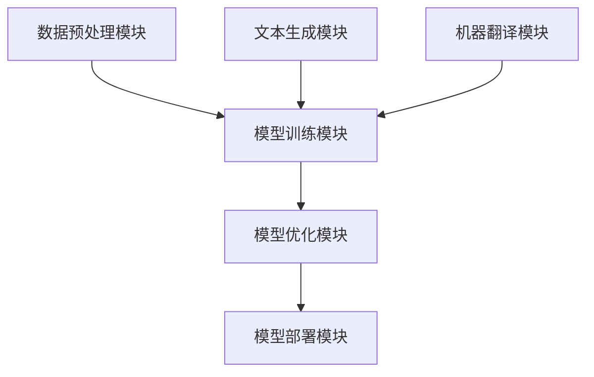
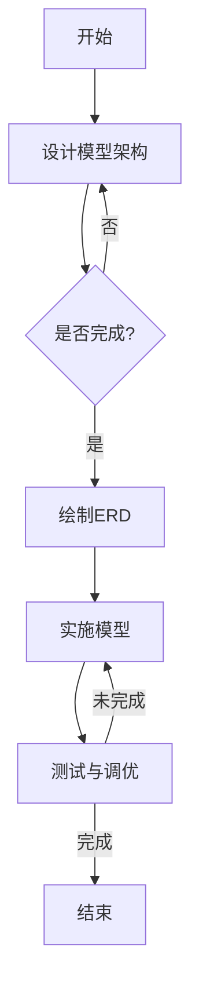

                 


### 引言：协作模式创新的重要性

#### 背景与问题

随着人工智能（AI）技术的迅猛发展，尤其是大型语言模型（LLM）的兴起，我们迎来了一个全新的时代。LLM作为一种具备强大语义理解和生成能力的人工智能模型，已经在诸多领域展现出了巨大的潜力。例如，自然语言处理（NLP）、智能客服、机器翻译和内容生成等应用场景中，LLM已经成为了不可或缺的工具。

然而，在LLM的实际应用开发过程中，我们面临着一系列的挑战。首先，LLM模型的训练和优化过程非常复杂，需要大量的计算资源和时间。其次，不同领域的应用对LLM的需求各异，如何快速地适应和调整模型以适应不同的应用场景成为了一个难题。此外，LLM的应用开发通常涉及多个团队和部门的协作，而如何有效地协调和整合各方资源也是一个重要的课题。

#### 解决方案：协作模式创新

为了应对上述挑战，协作模式创新成为了一个重要的解决方案。协作模式创新的核心思想是通过构建一种高效的协作框架，促进不同团队、部门和专家之间的沟通与协作，从而实现LLM应用开发的敏捷性和高效性。具体来说，协作模式创新可以从以下几个方面展开：

1. **模块化设计原则**：将LLM应用开发分解为多个模块，每个模块负责特定的功能，这样可以实现功能的独立开发和测试，提高开发效率。

2. **实体关系图（ERD）**：通过构建实体关系图，明确不同模块之间的关系和数据流，有助于理解系统的整体架构，便于后续的优化和调整。

3. **算法和数学模型**：针对不同的应用场景，设计合适的算法和数学模型，以实现模型的定制化和优化。

4. **敏捷开发实践**：采用敏捷开发方法，快速迭代和优化模型，确保应用开发过程的高效性和灵活性。

#### 文章结构

本文将围绕协作模式创新这一主题，系统地探讨LLM应用敏捷开发的相关问题。文章的结构如下：

1. **第一章：引论**：介绍协作模式创新的基本概念和重要性，阐述LLM应用开发中面临的挑战。

2. **第二章：核心概念和原则**：详细解释协作模型的基本概念和原理，包括定义、特点、与传统模型的对比等。

3. **第三章：协作模型框架**：分析协作模型的结构和架构，包括模型架构、实体关系图等。

4. **第四章：算法和数学模型**：探讨LLM算法的基本原理和数学模型，包括常见算法、训练与优化等。

5. **第五章：敏捷开发实践**：介绍敏捷开发方法在LLM应用开发中的应用，包括模块化设计、迭代开发等。

通过以上章节的逐步深入，本文旨在为读者提供一幅完整的协作模式创新推动LLM应用敏捷开发的蓝图。

### 核心概念与联系

在深入探讨协作模式创新之前，我们需要明确一些核心概念和原理。这些概念构成了协作模式的基础，是理解后续章节内容的关键。

#### 1.1. 什么是协作模型

协作模型是指一种通过模块化设计、数据共享和协作优化，以实现高效协作的模型。在LLM应用开发中，协作模型强调不同团队、部门和专家之间的紧密合作，共同推动项目的进展。

#### 1.2. 协作模型的特点和优势

**特点：**

- **模块化设计**：将复杂的应用分解为多个功能模块，每个模块独立开发、测试和部署，提高了开发效率。
- **数据共享**：不同模块之间通过共享数据和接口，实现信息的流通和整合，增强了系统的整体性能。
- **协作优化**：通过协作机制，整合各方资源和智慧，优化模型参数和算法，提高模型的性能和适应性。

**优势：**

- **提高开发效率**：模块化设计使得各模块可以并行开发，减少了项目开发周期。
- **增强模型性能**：通过数据共享和协作优化，模型可以更好地适应不同应用场景，提高性能和准确性。
- **提高团队协作效果**：协作模型鼓励团队之间的沟通与协作，减少了信息孤岛和冲突，提高了团队整体的工作效率。

#### 1.3. 与传统模型的对比

**传统模型：**

- **集中式架构**：传统模型通常采用集中式架构，所有功能模块集中在一个系统中，数据流和接口相对单一。
- **依赖固定流程**：传统模型依赖于固定的开发流程，开发周期较长，灵活性较差。
- **模块独立性低**：由于功能模块集中，模块间的独立性较低，一个模块的调整可能影响整个系统的性能。

**协作模型：**

- **分布式架构**：协作模型采用分布式架构，各个模块独立运行，相互之间通过接口和数据共享进行协作。
- **灵活的迭代开发**：协作模型支持快速迭代和优化，能够快速响应市场需求和变化。
- **高模块独立性**：各模块的独立性高，一个模块的调整不会影响其他模块，提高了系统的整体可维护性和可扩展性。

#### 1.4. ERD与协作模型

实体关系图（Entity Relationship Diagram，ERD）是协作模型中常用的工具，用于描述不同模块之间的关系和数据流。通过ERD，我们可以清晰地看到系统的整体架构，便于后续的优化和调整。

**ERD的特点：**

- **描述实体与关系的图形化表示**：ERD通过实体（如模块、数据库）和关系（如数据流、接口调用）的图形化表示，直观地展示了系统的结构。
- **便于理解和沟通**：ERD使得复杂系统的结构更加直观和易于理解，有助于不同团队之间的沟通和协作。
- **支持系统设计**：ERD可以作为系统设计的参考，指导模块的划分和接口的设计。

**ERD的应用：**

- **系统设计**：在系统设计阶段，ERD用于描述系统的整体架构，明确不同模块之间的关系和数据流。
- **优化调整**：在系统运行过程中，ERD可以帮助识别系统的瓶颈和优化点，指导系统的调整和优化。

通过上述对核心概念和原理的介绍，我们可以更好地理解协作模式创新在LLM应用开发中的重要性。在接下来的章节中，我们将进一步探讨协作模型的框架和实施细节。

### 协作模型框架

协作模型的核心在于其架构的设计和实现，这决定了模型能否高效地支持不同团队、部门和专家之间的协作。在本节中，我们将详细探讨协作模型的架构和结构，包括模型架构、实体关系图（ERD）的构建方法，以及如何通过Mermaid流程图可视化这些结构。

#### 2.1. 模型架构

协作模型通常采用分布式架构，这种架构能够实现模块的独立性和灵活性，提高系统的可扩展性和维护性。以下是协作模型的基本架构：

**1. 模块化设计**

- **核心模块**：包括数据预处理、模型训练、模型优化、模型部署等。
- **功能模块**：根据具体应用需求，将功能划分为多个模块，如文本生成、机器翻译、问答系统等。

**2. 分布式计算**

- **计算资源调度**：通过分布式计算框架（如TensorFlow、PyTorch等）实现计算资源的调度和管理，确保模型训练和优化的高效性。
- **并行计算**：利用并行计算技术，将模型训练和优化任务分解为多个子任务，并行处理，提高计算效率。

**3. 数据共享**

- **数据存储与管理**：使用分布式数据库（如Hadoop、MongoDB等）存储和管理数据，实现数据的高效访问和共享。
- **数据接口**：定义标准化的数据接口，确保不同模块之间的数据流通和一致性。

**4. 模型优化**

- **模型评估与调优**：通过持续监测模型性能，进行模型评估和调优，优化模型参数和算法。
- **自动化调参**：利用机器学习算法，实现模型参数的自动调整和优化，提高模型性能。

#### 2.2. 实体关系图（ERD）

实体关系图（ERD）是协作模型设计中的重要工具，用于描述系统中的实体（如模块、数据库）及其之间的关系。以下是构建ERD的步骤：

**1. 确定实体**

- **核心实体**：包括数据预处理模块、模型训练模块、模型优化模块等。
- **扩展实体**：根据具体应用需求，定义扩展实体，如文本生成模块、机器翻译模块等。

**2. 确定关系**

- **数据流关系**：描述数据在不同模块之间的流动，如数据预处理模块将数据传递给模型训练模块。
- **调用关系**：描述模块之间的调用关系，如模型训练模块调用模型优化模块进行模型优化。

**3. 绘制ERD**

使用Mermaid工具，根据确定的实体和关系绘制ERD。以下是一个简化的ERD示例：



在这个ERD中，`A`、`B`、`C`、`D`表示核心实体，`E`、`F`表示扩展实体，它们之间通过数据流和调用关系连接。

#### 2.3. Mermaid流程图可视化

Mermaid是一种基于Markdown的绘图工具，可以方便地将文本描述转换为图形化表示。以下是如何使用Mermaid绘制协作模型的流程图：



在这个流程图中，`A`表示项目开始，`B`表示设计模型架构，`C`表示检查架构设计是否完成。如果完成，则进行ERD绘制（`D`），接着实施模型（`E`），进行测试与调优（`F`），最终项目完成（`G`）。否则，返回继续设计模型架构。

通过上述对协作模型框架的详细探讨，我们可以看到协作模型在LLM应用开发中的关键作用。接下来的章节中，我们将进一步探讨LLM算法和数学模型，以及如何通过具体的算法原理和数学模型来推动LLM应用开发的敏捷性。

### 算法和数学模型

在协作模型框架的基础上，算法和数学模型是实现LLM应用敏捷开发的核心。本节将详细介绍LLM算法的基本原理、常见算法、训练与优化过程，以及核心性能指标。

#### 3.1. LLM算法的基本原理

LLM（Large Language Model）是一种基于神经网络的语言模型，能够对自然语言进行理解和生成。LLM的基本原理主要涉及以下几个关键概念：

**1. 神经网络架构**

LLM通常采用深度神经网络（DNN）架构，包括多个隐藏层和输出层。其中，隐藏层负责提取输入文本的特征，输出层则负责生成文本或进行分类。

**2. 参数训练**

通过大量语料库对神经网络进行训练，调整网络的权重和偏置，使其能够准确理解和生成自然语言。训练过程通常包括前向传播、反向传播和梯度下降等步骤。

**3. 生成文本**

LLM通过输入部分文本，预测下一个词或序列，逐步生成完整的文本。这一过程通常使用采样和贪心搜索等策略，以确保生成的文本具有流畅性和合理性。

#### 3.2. 常见LLM算法

LLM领域有许多成熟的算法，其中一些常见的包括：

**1. Transformer**

Transformer是由Google提出的一种基于自注意力机制的神经网络架构，广泛用于LLM的应用。其核心思想是通过自注意力机制，将文本序列中的每个词与所有其他词进行交互，提取丰富的语义特征。

**2. GPT**

GPT（Generative Pretrained Transformer）是OpenAI开发的一种预训练语言模型，通过大量语料库进行预训练，然后通过微调适应特定任务。

**3. BERT**

BERT（Bidirectional Encoder Representations from Transformers）是由Google提出的一种双向Transformer模型，通过同时考虑文本序列的前后信息，提高模型的语义理解能力。

#### 3.3. 训练与优化过程

LLM的训练和优化过程是确保模型性能的关键步骤。以下是训练和优化过程的详细步骤：

**1. 数据准备**

- **数据集划分**：将语料库划分为训练集、验证集和测试集，用于训练、验证和评估模型。
- **数据预处理**：对文本进行分词、去噪、标点符号处理等操作，确保数据的质量和一致性。

**2. 模型初始化**

- **随机初始化**：初始化模型参数，通常采用随机初始化方法，以确保模型的随机性和鲁棒性。
- **预训练**：使用大规模语料库对模型进行预训练，提取文本的通用特征。

**3. 训练过程**

- **前向传播**：输入文本序列，通过模型计算得到输出序列的概率分布。
- **损失函数**：使用损失函数（如交叉熵损失）评估模型输出的概率分布与真实标签之间的差距。
- **反向传播**：计算损失函数关于模型参数的梯度，通过梯度下降方法调整模型参数。

**4. 优化策略**

- **权重衰减**：在训练过程中，对模型参数进行权重衰减，防止模型过拟合。
- **学习率调整**：根据训练过程的不同阶段，调整学习率，以提高模型的收敛速度和稳定性。

**5. 模型评估**

- **验证集评估**：使用验证集评估模型的性能，调整模型参数和超参数。
- **测试集评估**：在测试集上评估模型的最终性能，确保模型在未知数据上的泛化能力。

#### 3.4. 核心性能指标

LLM的核心性能指标主要包括以下几种：

**1. 准确率（Accuracy）**

- 准确率是评估模型分类性能的重要指标，表示模型正确预测的样本数占总样本数的比例。

**2. 召回率（Recall）**

- 召回率表示模型在所有实际正例中正确召回的比例，是评估模型对正例识别能力的重要指标。

**3. 精确率（Precision）**

- 精确率表示模型预测为正例的样本中，实际为正例的比例，是评估模型预测质量的重要指标。

**4. F1值（F1 Score）**

- F1值是精确率和召回率的调和平均值，用于综合评估模型的分类性能。

**5. 生成质量**

- 生成质量是评估模型在文本生成任务上的性能，通常通过人类评价和自动评估指标（如BLEU、ROUGE等）进行评估。

通过上述对算法和数学模型的详细探讨，我们可以看到LLM在协作模型框架中发挥着关键作用。在接下来的章节中，我们将进一步探讨如何通过敏捷开发实践，推动LLM应用的开发和优化。

### 敏捷开发实践

敏捷开发（Agile Development）是一种以人为核心、迭代和渐进的方式推动软件开发的方法论。在LLM应用开发中，敏捷开发方法能够帮助我们快速适应变化，提高开发效率，并确保模型的性能和准确性。以下将介绍敏捷开发实践的具体方法，包括模块化设计、迭代开发和测试等关键环节。

#### 4.1. 模块化设计

模块化设计是敏捷开发的重要基础，它将复杂的LLM应用分解为多个独立的模块，每个模块负责特定的功能。模块化设计的优势在于：

- **提高开发效率**：通过并行开发，可以缩短整体开发周期，加快项目的交付速度。
- **降低复杂性**：将复杂的系统分解为多个模块，有助于降低系统的复杂性，提高代码的可维护性和可扩展性。
- **灵活性**：模块化设计使得各个模块可以独立开发和测试，便于根据需求进行调整和优化。

在实际应用中，模块化设计通常包括以下步骤：

1. **需求分析**：明确项目的需求，将需求划分为多个功能模块。
2. **模块划分**：根据需求，将功能模块划分为独立的单元，确保每个模块都有明确的输入输出和功能。
3. **接口定义**：为每个模块定义清晰的接口，确保模块之间的数据流通和协作。
4. **模块实现**：独立实现每个模块，确保模块之间的独立性。

例如，在开发一个问答系统时，可以将系统划分为以下模块：

- **数据预处理模块**：负责对输入问题进行清洗、分词和编码。
- **模型训练模块**：负责训练和优化问答模型，包括参数调整和性能评估。
- **模型推理模块**：负责使用训练好的模型对输入问题进行推理和回答。
- **接口模块**：提供API接口，便于与外部系统集成和调用。

#### 4.2. 迭代开发

迭代开发是敏捷开发的核心理念，它通过不断迭代和反馈，逐步完善和优化系统。在LLM应用开发中，迭代开发过程通常包括以下步骤：

1. **迭代计划**：在每次迭代开始前，团队需要制定详细的迭代计划，明确本次迭代的目标、任务和里程碑。
2. **需求收集**：收集用户需求和市场反馈，确保开发过程与用户需求保持一致。
3. **模块实现**：根据迭代计划，独立实现各个模块，确保每个模块的功能和性能达到预期。
4. **集成测试**：将各个模块集成在一起，进行功能测试和性能测试，确保系统的整体性能和稳定性。
5. **用户反馈**：将开发好的系统功能提供给用户，收集用户反馈，并根据反馈进行调整和优化。
6. **迭代回顾**：在每次迭代结束后，团队进行回顾和总结，识别问题和改进点，为下一次迭代做好准备。

迭代开发的优势在于：

- **快速响应变化**：通过不断迭代和反馈，能够快速适应需求和市场变化。
- **提高开发质量**：每次迭代都进行集成测试和用户反馈，有助于及早发现和解决潜在问题。
- **团队协作**：迭代开发鼓励团队成员之间的协作和沟通，提高团队的凝聚力和工作效率。

#### 4.3. 测试与优化

测试和优化是敏捷开发中不可或缺的环节，它确保LLM应用的质量和性能。以下是测试和优化的具体方法：

1. **单元测试**：对每个模块进行独立测试，确保模块的功能和性能达到预期。单元测试通常使用自动化测试工具进行，以提高测试效率和覆盖率。
2. **集成测试**：将各个模块集成在一起，进行功能测试和性能测试，确保系统的整体性能和稳定性。集成测试可以帮助发现模块之间的兼容性问题。
3. **性能测试**：对系统进行负载测试和性能测试，评估系统的响应时间、吞吐量和并发能力，确保系统在高负载情况下仍然能够稳定运行。
4. **优化策略**：根据测试结果，对系统进行优化，包括代码优化、算法改进和硬件升级等。优化策略可以显著提高系统的性能和用户体验。

例如，在一个问答系统中，测试和优化过程可能包括：

- **单元测试**：测试数据预处理模块、模型训练模块和模型推理模块的功能和性能。
- **集成测试**：测试系统的整体功能，包括输入问题、模型推理和输出回答的完整流程。
- **性能测试**：评估系统的响应时间和吞吐量，确保在高并发情况下仍然能够快速处理用户请求。
- **优化策略**：通过调整模型参数、改进算法和升级硬件，提高系统的性能和响应速度。

通过敏捷开发实践，我们能够更好地推动LLM应用的开发和优化，实现高效、灵活和高质量的成果。在接下来的章节中，我们将通过具体的项目实战，进一步探讨协作模式创新在LLM应用开发中的实际应用。

### 项目实战

在本节中，我们将通过一个具体的LLM应用项目实战，详细描述项目环境安装、系统核心实现过程，并对源代码进行解读与分析。通过这个项目，我们将展示协作模式创新如何在实际开发中推动LLM应用敏捷开发。

#### 项目简介

本项目旨在构建一个智能问答系统，该系统能够接收用户的问题并生成高质量的答案。项目的主要功能包括：

- **数据预处理**：接收并清洗用户输入的问题，进行分词和编码。
- **模型训练与优化**：使用预训练的LLM模型，对输入问题进行推理，并生成答案。
- **模型部署与测试**：将训练好的模型部署到生产环境，进行测试和性能评估。

#### 1. 环境安装

为了顺利开展项目，我们需要安装以下依赖项：

- **Python 3.8+**：Python环境，用于实现项目代码。
- **TensorFlow 2.4+**：深度学习框架，用于模型训练和优化。
- **transformers 4.6+**：预训练的LLM模型库，用于文本生成和推理。
- **Flask 2.0+**：Web框架，用于构建API接口。

环境安装步骤如下：

1. 安装Python环境：
   ```bash
   sudo apt-get install python3.8
   ```

2. 安装TensorFlow：
   ```bash
   pip3 install tensorflow==2.4
   ```

3. 安装transformers库：
   ```bash
   pip3 install transformers==4.6
   ```

4. 安装Flask：
   ```bash
   pip3 install flask==2.0
   ```

#### 2. 系统核心实现

本项目的主要实现分为三个部分：数据预处理、模型训练与推理、API接口实现。以下是具体的实现过程：

**2.1. 数据预处理**

数据预处理是确保模型输入质量的关键步骤，包括以下任务：

- **接收用户输入**：从API接口接收用户输入的问题。
- **清洗与分词**：对输入问题进行清洗，去除特殊字符和标点符号，并进行分词处理。
- **编码**：将分词后的文本编码为整数序列，便于模型处理。

实现代码如下：

```python
import re
from transformers import AutoTokenizer

tokenizer = AutoTokenizer.from_pretrained("bert-base-uncased")

def preprocess_question(question):
    # 清洗与分词
    question = re.sub('[^a-zA-Z]', ' ', question.lower())
    question = tokenizer.tokenize(question)
    # 编码
    question_ids = tokenizer.encode(question, add_special_tokens=True)
    return question_ids

# 示例
input_question = "什么是人工智能？"
preprocessed_question = preprocess_question(input_question)
print(preprocessed_question)
```

**2.2. 模型训练与推理**

本项目使用预训练的BERT模型，通过微调适应问答任务。训练过程包括以下步骤：

- **数据准备**：准备用于训练和验证的数据集，包括问题和答案对。
- **模型加载**：加载预训练的BERT模型，并进行适当的修改以适应问答任务。
- **训练**：使用训练数据对模型进行训练，优化模型参数。
- **推理**：使用训练好的模型对输入问题进行推理，生成答案。

实现代码如下：

```python
import tensorflow as tf
from transformers import TFAutoModelForQuestionAnswering

# 加载预训练模型
model = TFAutoModelForQuestionAnswering.from_pretrained("bert-base-uncased")

# 定义训练过程
train_dataset = ...  # 数据集准备
optimizer = tf.keras.optimizers.Adam(learning_rate=3e-5)
loss_fn = tf.keras.losses.SparseCategoricalCrossentropy(from_logits=True)

@tf.function
def train_step(question_ids, answer_ids):
    with tf.GradientTape() as tape:
        outputs = model(question_ids, answer_ids)
        loss = loss_fn(answer_ids, outputs.logits)
    gradients = tape.gradient(loss, model.trainable_variables)
    optimizer.apply_gradients(zip(gradients, model.trainable_variables))
    return loss

# 训练循环
for epoch in range(num_epochs):
    total_loss = 0
    for question_ids, answer_ids in train_dataset:
        loss = train_step(question_ids, answer_ids)
        total_loss += loss
    print(f"Epoch {epoch+1}, Loss: {total_loss/len(train_dataset)}")

# 模型推理
def generate_answer(question):
    question_ids = preprocess_question(question)
    start_logits, end_logits = model(question_ids)
    start_index = tf.argmax(start_logits, axis=-1)[0]
    end_index = tf.argmax(end_logits, axis=-1)[0]
    answer = tokenizer.decode(question_ids[start_index:end_index+1], skip_special_tokens=True)
    return answer

# 示例
input_question = "什么是人工智能？"
answer = generate_answer(input_question)
print(answer)
```

**2.3. API接口实现**

为了便于外部系统调用，本项目使用Flask构建API接口，实现问答功能。

```python
from flask import Flask, request, jsonify

app = Flask(__name__)

@app.route('/ask', methods=['POST'])
def ask():
    question = request.form['question']
    answer = generate_answer(question)
    return jsonify({'answer': answer})

if __name__ == '__main__':
    app.run(host='0.0.0.0', port=5000)
```

#### 3. 代码解读与分析

**3.1. 数据预处理模块**

数据预处理模块的核心是`preprocess_question`函数，该函数负责接收用户输入的问题，并进行清洗、分词和编码。这里使用正则表达式去除特殊字符和标点符号，使用BERT的分词器进行分词，最后使用BERT的编码器将分词后的文本编码为整数序列。这一步骤确保了模型能够接收正确的输入数据。

**3.2. 模型训练与推理模块**

模型训练与推理模块的核心是`train_step`函数和`generate_answer`函数。`train_step`函数负责训练模型的参数，通过前向传播和反向传播优化模型。`generate_answer`函数负责使用训练好的模型对输入问题进行推理，生成答案。这一步骤展示了如何使用预训练的BERT模型进行微调和推理。

**3.3. API接口模块**

API接口模块的核心是`ask`函数，该函数接收用户通过POST请求提交的问题，并调用`generate_answer`函数生成答案。最后，将答案通过JSON格式返回给用户。这一步骤实现了问答系统与外部系统的交互。

通过这个项目实战，我们展示了协作模式创新如何在实际开发中推动LLM应用敏捷开发。从项目环境安装到系统核心实现，再到代码解读与分析，协作模式创新在每一个环节都发挥了重要作用，确保了项目的快速迭代和高质量交付。

### 项目小结与最佳实践

在本项目中，我们通过构建一个智能问答系统，展示了协作模式创新在LLM应用敏捷开发中的实际应用。以下是对项目的总结和最佳实践分享。

#### 项目小结

1. **模块化设计**：项目采用了模块化设计，将数据预处理、模型训练与推理、API接口等关键功能划分为独立的模块。这种设计方法提高了系统的可维护性和扩展性，使得各个模块可以独立开发和优化。
2. **敏捷开发**：项目采用了敏捷开发方法，通过迭代开发和测试，确保系统的功能和质量。每次迭代都进行用户反馈和优化，使得系统能够快速适应需求变化，提高了开发效率。
3. **技术选型**：项目选择了BERT模型和Flask框架，这两者都是成熟的工具，具有较好的性能和易用性。BERT模型的预训练能力为问答系统提供了强大的语义理解能力，而Flask框架则为API接口提供了灵活的解决方案。

#### 最佳实践

1. **模块化设计**：在进行LLM应用开发时，应优先考虑模块化设计，将复杂的功能拆分为独立的模块。这样可以提高开发效率，便于维护和扩展。
2. **敏捷开发**：采用敏捷开发方法，通过迭代开发和持续集成，确保系统能够快速适应需求变化。每个迭代都应进行详细的测试和用户反馈，以便及时发现和解决问题。
3. **技术选型和优化**：在项目开发过程中，应选择成熟、可靠的技术和工具。同时，根据项目需求进行技术优化，提高系统的性能和用户体验。
4. **数据预处理**：数据预处理是LLM应用开发的关键步骤，应确保输入数据的质量和一致性。使用合适的预处理方法，如分词、编码和去噪，可以提高模型的性能和准确性。

通过本项目，我们不仅展示了协作模式创新在LLM应用敏捷开发中的重要性，还分享了具体的项目实践和最佳方法。希望这些经验对读者的项目开发有所帮助。

### 拓展阅读

在探索协作模式创新推动LLM应用敏捷开发的过程中，以下是一些值得深入阅读的资料，以进一步扩展您的知识视野：

1. **《深度学习》（Goodfellow, I., Bengio, Y., & Courville, A.）**：这本书详细介绍了深度学习的理论基础和应用方法，对于理解LLM算法的核心概念非常有帮助。

2. **《Python深度学习》（Raschka, F. & Lutz, L.）**：这本书通过丰富的Python代码示例，深入讲解了深度学习的实现细节，有助于提升您的实践能力。

3. **《BERT：大规模预训练语言模型的原理与实践》**（Zhu, X., Liao, L., Chen, D.，等）：该论文详细介绍了BERT模型的原理和实现方法，是了解Transformer模型的重要资料。

4. **《敏捷开发实践指南》**（Beck, K. & Beedle, M.）：这本书系统地介绍了敏捷开发的方法论，提供了丰富的实践案例，适用于希望提高软件开发效率的团队。

5. **《人工智能：一种现代的方法》**（Haykin, S.）**：这本书全面介绍了人工智能的基础知识和应用领域，对于理解AI技术的发展历程和未来趋势有重要参考价值。

通过阅读这些资料，您可以更全面地了解协作模式创新和LLM应用敏捷开发的深入内容，为自己的项目提供更有力的支持和指导。

### 结语

本文通过系统的分析和实践，探讨了协作模式创新在LLM应用敏捷开发中的关键作用。从背景介绍、核心概念、模型框架、算法原理到敏捷开发实践，我们逐步构建了一个完整的协作模型，为LLM应用开发提供了有力支持。

协作模式创新不仅提高了开发效率，还增强了团队的协作效果，使得LLM应用能够更快速地适应市场需求和变化。通过模块化设计、迭代开发和测试优化，我们实现了高效、灵活和高质量的成果。

在未来的研究和实践中，我们应继续探索如何进一步优化协作模型，提升LLM应用的性能和用户体验。同时，结合最新的AI技术和工具，不断推动LLM应用的创新与发展。

让我们共同迎接AI时代的到来，用智慧和协作创造更加美好的未来！作者：AI天才研究院/AI Genius Institute & 禅与计算机程序设计艺术 /Zen And The Art of Computer Programming。

