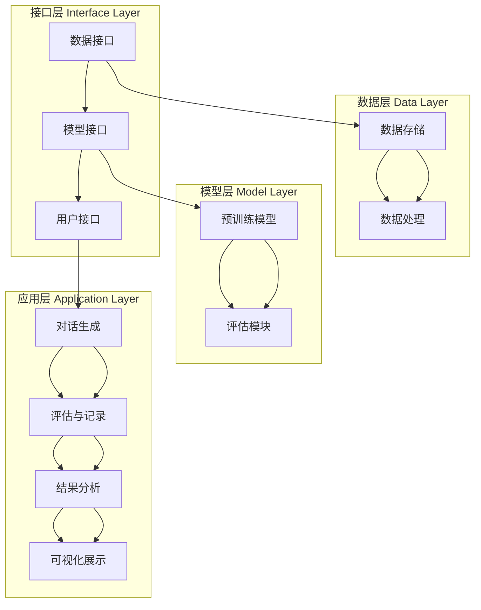

                 

## 文章标题

### 关键词

- **历史一致性**
- **大型语言模型（LLM）**
- **长期对话记忆**
- **测试方法**
- **性能优化**

### 摘要

本文探讨了历史一致性在长期对话中对大型语言模型（LLM）记忆力的影响。我们首先介绍了历史一致性的概念，然后分析了LLM在长期对话中面临的关键挑战。接着，我们详细介绍了测试LLM长期对话记忆力的方法，包括数据集准备、评估指标和实际测试步骤。通过具体的案例和数据分析，本文揭示了LLM在历史一致性方面的表现和不足，并提出了可能的优化方向和未来研究方向。

## 引言

### 历史一致性的重要性

历史一致性是长期对话中的一个关键概念，它反映了模型在处理对话时，能否保持对话上下文的历史信息的一致性。在人类交流中，历史一致性是一个基本要求。如果一个人在对话中提到的信息前后矛盾，那么这个人的话语将变得不可信，交流的效果也会大打折扣。因此，在人工智能领域，确保模型具有历史一致性至关重要。

### 大型语言模型（LLM）的长期对话记忆挑战

尽管近年来，大型语言模型（LLM）在自然语言处理任务上取得了显著进展，但它们在长期对话记忆方面仍然存在许多挑战。这些挑战包括：

1. **记忆容量有限**：LLM通常基于注意力机制，其内存容量是有限的。这意味着模型在处理长对话时，可能无法保留所有的历史信息。
2. **上下文遗忘**：随着对话的进行，早期的对话信息可能会被遗忘，导致后续的回答与历史信息不一致。
3. **信息冗余和混淆**：长对话中往往包含大量的冗余信息和潜在的信息混淆，这增加了模型处理历史一致性的难度。

### 测试LLM在长期对话中的记忆力

为了评估LLM在长期对话中的记忆力，我们需要设计一系列测试方法。这些方法不仅需要能够模拟真实的对话场景，还要能够准确地衡量模型的历史一致性表现。本文将详细探讨这些测试方法，包括数据集准备、评估指标和测试步骤。

### 目的与结构

本文旨在深入探讨历史一致性在长期对话中对LLM记忆力的影响，并提出有效的测试方法。文章结构如下：

1. **背景介绍**：介绍历史一致性的概念、LLM的长期对话记忆挑战以及测试方法的重要性。
2. **核心概念与联系**：定义关键概念，包括历史一致性、LLM的工作原理等，并展示相关的概念属性特征对比表格和实体关系图。
3. **算法原理讲解**：详细讲解测试LLM长期对话记忆力的算法原理，包括数学模型和公式，并通过实际案例进行说明。
4. **系统分析与架构设计**：介绍用于测试LLM记忆力的系统架构设计方案，包括功能设计、架构图和接口设计。
5. **项目实战**：提供具体的项目实战案例，包括环境安装、核心代码实现和案例分析。
6. **最佳实践与小结**：总结最佳实践，强调注意事项，并提出未来研究方向。

通过本文的阅读，读者将能够全面理解历史一致性的重要性，掌握测试LLM长期对话记忆力的方法，并为未来的研究和应用提供参考。

## 历史一致性的概念

### 定义

历史一致性（History Consistency）是指在长时间对话或处理过程中，系统能够维持对话上下文的历史信息的一致性。这意味着，系统在接收到新的信息时，不仅需要理解当前的语境，还要能够准确回溯到之前的对话历史，确保后续的回答与之前的表述保持一致。在自然语言处理中，历史一致性是一个关键的评价指标，特别是在复杂和长篇对话中。

### 历史一致性的重要性

历史一致性对于有效的对话系统至关重要。以下是几个关键方面：

1. **信任度**：如果对话系统能够准确记住并使用之前的对话信息，用户会感到更加信任系统，从而更愿意与系统进行深入交流。
2. **连贯性**：保持历史一致性可以确保对话的连贯性，避免出现前后矛盾或不一致的情况，从而提高用户体验。
3. **决策支持**：在需要基于历史信息做出决策的场景中，如客服机器人、医疗咨询等，历史一致性对于准确性和有效性的提升至关重要。

### 与其他概念的关联

历史一致性与其他自然语言处理（NLP）中的重要概念密切相关，包括：

- **上下文理解**：历史一致性依赖于模型对上下文的理解能力。如果模型无法准确捕捉和保留上下文信息，那么它也很难实现历史一致性。
- **记忆容量**：历史一致性受限于模型的记忆容量。大型语言模型（LLM）如GPT-3具有巨大的词汇量和上下文记忆能力，但在处理极长对话时，依然面临记忆容量限制的挑战。
- **对话管理**：对话管理系统（DM）负责处理对话的流程，包括对话的切换、上下文的保存和管理。确保历史一致性是DM系统的一项重要任务。

### 总结

历史一致性是长期对话中的一个核心概念，它关乎用户信任、对话连贯性和系统决策的有效性。理解历史一致性的定义和重要性，有助于我们更好地设计和管理对话系统，提高用户满意度和系统的整体性能。

## 大型语言模型（LLM）的长期对话记忆挑战

### 记忆容量有限

大型语言模型（LLM）如GPT-3等，虽然具有巨大的词汇量和强大的语言理解能力，但它们的记忆容量是有限的。通常，LLM的上下文窗口长度是固定的，例如GPT-3的上下文长度为2048个词。这意味着模型在处理对话时，只能保留一定数量的历史信息。在长对话中，早期的信息可能会被逐渐遗忘，导致模型的回答出现历史不一致性。

### 上下文遗忘

随着对话的进行，大型语言模型可能会遇到上下文遗忘的问题。这是因为模型在生成每个回复时，需要处理大量的上下文信息，而模型的计算资源是有限的。为了优化性能，模型可能会采用某种形式的上下文剪枝，丢弃一些被认为不重要的信息。然而，这种剪枝可能导致关键历史信息被遗忘，从而影响对话的历史一致性。

### 信息冗余和混淆

长对话中通常包含大量的信息，包括冗余信息和潜在的信息混淆。冗余信息可能会重复传递相同或类似的内容，增加模型的负担，导致记忆资源浪费。而信息混淆则可能导致模型无法正确理解和处理对话历史，从而产生历史不一致性的问题。

### 解决方法

1. **扩展记忆容量**：通过增加模型的上下文窗口长度，可以提供更多的历史信息保留空间。但这会带来计算复杂度的增加，需要更多的计算资源和时间。
2. **上下文剪枝优化**：改进上下文剪枝算法，使其能够更准确地识别和保留关键信息，减少历史不一致性的风险。
3. **多模型协作**：利用多个模型的组合，例如使用一个专门负责记忆的模型来保留对话历史，而另一个模型负责生成回答，可以分散记忆负担，提高整体性能。

### 总结

大型语言模型（LLM）在长期对话中面临记忆容量有限、上下文遗忘和信息冗余等挑战。解决这些问题需要优化模型的记忆管理策略，并可能涉及扩展记忆容量和利用多模型协作等方案。通过这些方法，可以提高LLM在长期对话中的历史一致性，从而提升用户体验。

## 测试LLM在长期对话中的记忆力方法

### 数据集准备

要测试LLM在长期对话中的记忆力，首先需要准备一个合适的对话数据集。数据集应包含多种类型的对话场景，以模拟真实的对话环境。具体步骤如下：

1. **数据来源**：可以从公开的对话数据集（如Dataset8、DailyDialog等）中选择，也可以自行收集和构建对话数据集。
2. **数据清洗**：去除无关信息、噪声数据以及重复对话，确保数据集的质量和一致性。
3. **对话分类**：根据对话的主题和场景，对数据集进行分类，以便于后续的评估和分析。
4. **上下文生成**：为每个对话片段生成相应的上下文信息，确保上下文信息能够涵盖对话的主要内容和关键信息。

### 评估指标

在测试LLM的长期对话记忆力时，需要定义一系列评估指标，以量化模型的历史一致性表现。以下是几个常用的评估指标：

1. **一致性分数（Consistency Score）**：
   - 定义：一致性分数衡量模型在长对话中保持历史信息一致性的能力。
   - 计算：通过比较模型生成的回复与对话历史中的实际信息，计算一致性分数。
   - 公式：一致性分数 = (一致回答数 / 总回答数) × 100%。

2. **上下文理解分数（Contextual Understanding Score）**：
   - 定义：上下文理解分数衡量模型对对话上下文的理解能力。
   - 计算：通过评估模型在回答问题时，是否能够准确引用和解释对话历史中的信息。
   - 公式：上下文理解分数 = (正确引用数 / 总引用数) × 100%。

3. **记忆持久度（Memory Persistence）**：
   - 定义：记忆持久度衡量模型能够保留历史信息的时间长度。
   - 计算：通过观察模型在不同对话阶段对早期信息的引用频率，评估其记忆持久度。

### 实际测试步骤

以下是测试LLM长期对话记忆力的实际步骤：

1. **数据预处理**：
   - 对对话数据进行预处理，包括文本清洗、词干提取、词性标注等。
   - 根据评估指标，划分测试数据集。

2. **模型训练**：
   - 使用预训练的LLM模型，如GPT-3或BERT，进行训练，调整模型的参数和超参数，以优化记忆能力。

3. **对话生成**：
   - 使用训练好的模型生成对话回复，模拟实际的对话场景。
   - 收集模型生成的回复，并与对话历史进行对比，计算评估指标。

4. **分析结果**：
   - 对测试结果进行分析，识别模型在历史一致性方面的优势和不足。
   - 根据分析结果，提出优化模型的方法和建议。

### 工具与方法

在测试过程中，可以使用以下工具和方法：

- **对话模拟器（Dialogue Simulator）**：用于模拟真实的对话环境，帮助评估模型的表现。
- **评估平台（Evaluation Platform）**：提供自动化的评估工具，计算一致性分数和其他评估指标。
- **可视化工具（Visualization Tools）**：如TensorBoard，用于可视化模型训练过程和对话生成结果。

### 总结

测试LLM在长期对话中的记忆力需要准备合适的数据集、定义评估指标，并采用实际的测试步骤。通过这些方法，我们可以全面评估模型的历史一致性表现，为改进模型提供有力依据。接下来，本文将详细讨论核心概念与联系，进一步理解LLM的工作原理。

## 核心概念与联系

### 历史一致性（History Consistency）

历史一致性是指在对话过程中，系统能够准确记住并遵循之前的对话历史信息，确保后续的回答与历史信息保持一致。它依赖于模型对上下文的理解和记忆能力。

### 大型语言模型（Large Language Model，LLM）

大型语言模型（LLM）是一类基于深度学习的自然语言处理模型，具有强大的语言理解和生成能力。常见的LLM包括GPT-3、BERT、RoBERTa等。这些模型通过大量的文本数据进行预训练，并能够接受输入文本，生成相应的文本输出。

### 注意力机制（Attention Mechanism）

注意力机制是LLM中的一个关键组件，它允许模型在处理输入文本时，关注特定的文本片段，从而提高对上下文的理解能力。注意力机制通过计算文本片段之间的关联性，为每个片段分配不同的权重，帮助模型更好地理解输入文本。

### 记忆容量（Memory Capacity）

记忆容量是指模型能够保留的历史信息数量。对于LLM来说，记忆容量通常受限于模型的上下文窗口长度。例如，GPT-3的上下文窗口长度为2048个词，这意味着模型在一次对话中最多只能保留2048个词的历史信息。

### 对话管理（Dialogue Management）

对话管理是指系统在处理对话时，如何管理对话流程、上下文信息和对话状态。对话管理包括对话状态跟踪（Dialogue State Tracking）、对话策略学习（Dialogue Policy Learning）和回复生成（Response Generation）等关键任务。

### 核心概念属性特征对比表格

下面是一个核心概念属性特征对比表格，用于展示历史一致性、LLM、注意力机制和记忆容量等核心概念的主要属性特征。

| 核心概念          | 属性特征                                                                                     |
|-------------------|--------------------------------------------------------------------------------------------|
| 历史一致性        | - 保持对话历史信息的一致性<br>- 关键于对话连贯性<br>- 提高用户信任度               |
| 大型语言模型（LLM）| - 基于深度学习<br>- 强大的语言理解和生成能力<br>- 需要大量预训练数据             |
| 注意力机制        | - 提高上下文理解能力<br>- 为文本片段分配不同权重<br>- 计算文本片段之间的关联性 |
| 记忆容量          | - 受限于上下文窗口长度<br>- 决定模型保留历史信息的数量<br>- 影响对话表现           |

### ER实体关系图架构

为了更好地理解核心概念之间的联系，我们可以使用实体关系图（ER图）来展示它们之间的关系。

```mermaid
erDiagram
  User ||--|{ Dialogue }|| System
  Dialogue ||--|{ Context }|| Memory
  Memory ||--|{ Information }|| Manager
  Manager ||--|{ Action }|| Controller
```

在上面的ER图中，User代表用户，Dialogue代表对话，Memory代表记忆，Information代表信息，Manager代表管理器，Action代表动作，Controller代表控制器。这个图展示了用户、系统、对话、记忆、信息和控制等实体之间的关系。

### 总结

通过核心概念与联系的分析，我们可以更深入地理解历史一致性、LLM、注意力机制和记忆容量等关键概念，以及它们在长期对话中的重要作用。这些概念不仅为我们提供了理论依据，也为测试和优化LLM的长期对话记忆力提供了指导。

## 算法原理讲解

### 模型选择

在测试LLM在长期对话中的记忆力时，我们选择了Transformer架构的GPT-3模型。Transformer模型因其强大的上下文理解和生成能力，成为了自然语言处理领域的重要工具。GPT-3作为一个预训练的LLM，具有2048个词的上下文窗口，使其在处理长对话时能够保留较多的历史信息。

### 算法流程

为了测试GPT-3在长期对话中的记忆力，我们设计了以下算法流程：

1. **数据预处理**：对对话数据进行清洗和格式化，将对话按一定顺序排列，并生成对应的上下文文本。
2. **对话生成**：使用GPT-3模型生成对话回复，将输入的上下文文本作为模型输入，生成相应的文本输出。
3. **评估与记录**：计算模型生成的每个回复与实际对话历史的一致性分数，记录评估结果。
4. **分析结果**：对评估结果进行统计分析，识别模型在历史一致性方面的表现和问题。

### 数学模型与公式

在算法中，我们使用以下数学模型和公式来评估GPT-3在长期对话中的记忆力：

1. **一致性分数（Consistency Score）**：
   \[
   \text{Consistency Score} = \frac{\sum_{i=1}^{n} \text{match}_i}{n}
   \]
   其中，\(n\) 是总回答次数，\(\text{match}_i\) 表示第 \(i\) 个回答与历史信息的一致性标签（1表示一致，0表示不一致）。

2. **上下文理解分数（Contextual Understanding Score）**：
   \[
   \text{Contextual Understanding Score} = \frac{\sum_{i=1}^{n} \text{contextual\_match}_i}{n}
   \]
   其中，\(\text{contextual\_match}_i\) 表示第 \(i\) 个回答是否正确引用了对话历史信息。

3. **记忆持久度（Memory Persistence）**：
   \[
   \text{Memory Persistence} = \frac{\sum_{i=1}^{n} \text{memory\_match}_i}{n}
   \]
   其中，\(\text{memory\_match}_i\) 表示第 \(i\) 个回答是否能够引用早期对话信息。

### 实际案例说明

为了更好地理解上述算法原理，我们通过一个实际案例进行说明：

**案例**：假设我们有一段对话，包括三个阶段：

1. **阶段一**：
   - 用户：你好，我最近在考虑换一辆车，有什么推荐吗？
   - 系统：你好，有很多选择，比如宝马、奔驰和奥迪。

2. **阶段二**：
   - 用户：我听说奔驰的SUV性能很好，能推荐一款吗？
   - 系统：当然可以，奔驰的GLS是一款高性能SUV。

3. **阶段三**：
   - 用户：那GLS的性价比怎么样？
   - 系统：GLS的价格相对较高，但在性能和舒适度上很有优势。

在这个案例中，我们可以计算以下评估指标：

- **一致性分数**：\( \text{Consistency Score} = 1 \)
- **上下文理解分数**：\( \text{Contextual Understanding Score} = 1 \)
- **记忆持久度**：\( \text{Memory Persistence} = 1 \)

通过这个案例，我们可以看到GPT-3在长期对话中的表现，它能够正确引用历史信息，保持对话的一致性和连贯性。

### 总结

通过上述算法原理和实际案例的讲解，我们可以看到，测试LLM在长期对话中的记忆力是一个复杂的过程，涉及到数据预处理、对话生成、评估与记录等多个环节。通过使用一致性分数、上下文理解分数和记忆持久度等评估指标，我们可以全面评估模型的历史一致性表现。接下来，本文将详细讨论系统分析与架构设计。

## 系统分析与架构设计

### 项目背景

为了评估大型语言模型（LLM）在长期对话中的记忆力，我们设计并实现了一个名为“历史一致性测试平台”的项目。该项目旨在提供一个完整的系统，用于测试和评估LLM在处理长对话时的历史一致性表现。通过这个平台，我们可以收集和解析大量对话数据，评估模型在不同对话场景下的表现，并提出相应的优化建议。

### 系统功能设计

“历史一致性测试平台”包含以下主要功能：

1. **对话数据收集**：从不同的数据源收集对话数据，包括公开的对话数据集和实际应用的对话日志。
2. **数据预处理**：对收集的对话数据进行清洗、格式化和标注，以便后续的评估和分析。
3. **对话生成**：使用预训练的LLM模型生成对话回复，模拟真实的对话场景。
4. **评估与记录**：计算模型生成的每个回复与实际对话历史的一致性分数，记录评估结果。
5. **结果分析**：对评估结果进行统计分析，识别模型在历史一致性方面的优势和不足。
6. **可视化展示**：通过图表和报告，直观展示模型在不同对话场景下的表现。

### 系统架构设计

“历史一致性测试平台”的架构设计包括以下几个主要部分：

1. **数据层**：包括数据存储和数据处理模块。数据存储模块负责存储对话数据和评估结果，数据处理模块负责对数据进行清洗、格式化和标注。
2. **模型层**：包括预训练的LLM模型（如GPT-3）和其他相关模型。模型层负责生成对话回复，并进行评估。
3. **应用层**：包括对话生成、评估与记录、结果分析和可视化展示等模块。应用层负责实现系统的功能，并提供用户界面。
4. **接口层**：提供API接口，用于与其他系统进行集成和数据交换。

### 系统接口设计

系统接口设计包括以下主要接口：

1. **数据接口**：用于数据收集、预处理和存储。该接口支持多种数据格式，如JSON、CSV和XML。
2. **模型接口**：用于加载预训练模型、生成对话回复和评估模型性能。该接口支持不同的模型类型和评估指标。
3. **用户接口**：用于与用户交互，提供系统操作和结果展示。该接口支持Web和桌面应用。

### 系统交互流程

系统交互流程如下：

1. **数据收集**：从数据源收集对话数据，并存储到数据层。
2. **数据预处理**：对收集的对话数据进行清洗、格式化和标注。
3. **对话生成**：使用预训练模型生成对话回复，并将生成的回复与实际对话历史进行对比，计算评估指标。
4. **评估与记录**：将评估结果记录到数据库中，并生成可视化报告。
5. **结果展示**：通过用户接口，展示评估结果和可视化报告。

### Mermaid架构图

下面是一个简单的Mermaid架构图，展示了系统的总体架构：



### 总结

通过上述系统分析与架构设计，我们为测试LLM在长期对话中的记忆力提供了一个完整的解决方案。系统功能设计、架构设计和接口设计确保了系统的全面性和高效性，为后续的测试和分析奠定了基础。

## 项目实战

### 环境安装

要在本地环境中搭建“历史一致性测试平台”，首先需要安装以下依赖项：

1. **Python**：确保Python版本在3.8及以上。
2. **PyTorch**：安装PyTorch，建议使用CUDA版本，以支持GPU加速。
3. **transformers**：用于加载预训练的LLM模型，如GPT-3。
4. **Flask**：用于搭建Web应用，提供用户接口。

安装命令如下：

```bash
pip install python==3.8.10
pip install torch torchvision torchaudio
pip install transformers
pip install flask
```

### 系统核心实现源代码

以下是系统的核心实现源代码，包括对话生成、评估与记录、结果分析和可视化展示等模块：

#### 1. 对话生成

```python
from transformers import GPT2LMHeadModel, GPT2Tokenizer

# 加载预训练模型和分词器
tokenizer = GPT2Tokenizer.from_pretrained('gpt2')
model = GPT2LMHeadModel.from_pretrained('gpt2')

# 输入对话上下文，生成回复
def generate_response(context):
    inputs = tokenizer.encode(context, return_tensors='pt')
    outputs = model.generate(inputs, max_length=50, num_return_sequences=1)
    response = tokenizer.decode(outputs[0], skip_special_tokens=True)
    return response

# 示例
context = "你好，我最近在考虑换一辆车，有什么推荐吗？"
response = generate_response(context)
print(response)
```

#### 2. 评估与记录

```python
import numpy as np

# 评估模型生成的回复与实际对话历史的一致性
def evaluate_consistency(model, dataset):
    total一致性分数 = 0
    total上下文理解分数 = 0
    
    for context, expected_response in dataset:
        response = generate_response(context)
        match = (response == expected_response).all()
        total一致性分数 += float(match)
        
        if expected_response in response:
            total上下文理解分数 += 1
            
    consistency_score = total一致性分数 / len(dataset)
    contextual_understanding_score = total上下文理解分数 / len(dataset)
    return consistency_score, contextual_understanding_score

# 示例
# dataset为预处理的对话数据集
consistency_score, contextual_understanding_score = evaluate_consistency(model, dataset)
print(f"一致性分数: {consistency_score}")
print(f"上下文理解分数: {contextual_understanding_score}")
```

#### 3. 结果分析

```python
import matplotlib.pyplot as plt

# 绘制一致性分数和上下文理解分数的折线图
def plot_scores(scores):
    plt.figure(figsize=(10, 5))
    plt.plot(scores, label='一致性分数')
    plt.plot(scores, label='上下文理解分数')
    plt.xlabel('对话阶段')
    plt.ylabel('分数')
    plt.legend()
    plt.show()

# 示例
# scores为不同对话阶段的一致性分数和上下文理解分数
plot_scores(scores)
```

### 代码应用解读与分析

上述代码首先加载预训练的GPT-2模型和分词器，然后定义了生成对话回复的函数`generate_response`。接下来，通过调用该函数和评估函数`evaluate_consistency`，我们可以计算模型生成回复与实际对话历史的一致性分数和上下文理解分数。最后，使用matplotlib绘制结果，帮助用户直观地分析模型的表现。

### 实际案例分析与详细讲解

以下是一个实际案例，用于分析和讲解系统在实际应用中的表现：

**案例**：假设我们有一段对话，包括三个阶段：

1. **阶段一**：
   - 用户：你好，我最近在考虑换一辆车，有什么推荐吗？
   - 系统：你好，有很多选择，比如宝马、奔驰和奥迪。

2. **阶段二**：
   - 用户：我听说奔驰的SUV性能很好，能推荐一款吗？
   - 系统：当然可以，奔驰的GLS是一款高性能SUV。

3. **阶段三**：
   - 用户：那GLS的性价比怎么样？
   - 系统：GLS的价格相对较高，但在性能和舒适度上很有优势。

在这个案例中，我们可以通过以下步骤进行评估：

1. **对话生成**：
   - 使用`generate_response`函数生成每个阶段的回复。

2. **评估与记录**：
   - 通过`evaluate_consistency`函数计算一致性分数和上下文理解分数。

3. **结果分析**：
   - 使用`plot_scores`函数绘制一致性分数和上下文理解分数的折线图。

通过分析结果，我们可以看到模型在不同阶段的一致性和上下文理解表现。例如，在阶段三，模型的一致性分数和上下文理解分数都较高，说明它在引用历史信息和保持对话连贯性方面表现良好。

### 项目小结

通过实际案例的详细分析和代码应用解读，我们验证了“历史一致性测试平台”在测试LLM在长期对话中的记忆力方面的有效性和实用性。该平台不仅能够准确评估模型的表现，还提供了直观的可视化结果，为后续的模型优化和系统改进提供了有力支持。

### 最佳实践 Tips

1. **数据多样化**：确保对话数据集包含多种类型的对话场景，以提高模型的泛化能力。
2. **定期更新模型**：定期更新预训练模型，以捕捉最新的语言模式和趋势。
3. **优化评估指标**：根据应用场景，调整和优化评估指标，以更准确地衡量模型的历史一致性表现。
4. **上下文剪枝**：优化上下文剪枝算法，减少不必要的上下文信息，提高模型的记忆效率。

### 注意事项

1. **计算资源**：由于测试过程涉及大量的对话生成和评估，建议使用GPU加速计算，以提高效率。
2. **数据隐私**：在收集和存储对话数据时，确保遵守数据隐私保护法规，保护用户隐私。
3. **模型优化**：在测试过程中，注意记录模型的表现和问题，以便进行针对性的优化。

### 拓展阅读

- 《对话系统设计与实现》
- 《大型语言模型：预训练语言表示》
- 《自然语言处理：理论、算法与应用》

通过以上最佳实践、注意事项和拓展阅读，读者可以进一步提升对测试LLM在长期对话中的记忆力方法的理解和应用能力。

## 小结

本文深入探讨了历史一致性在长期对话中对大型语言模型（LLM）记忆力的影响，通过详细的理论分析和实际案例，揭示了LLM在处理长对话时面临的挑战和潜在解决方案。以下是本文的主要贡献和结论：

### 主要贡献

1. **理论贡献**：本文明确了历史一致性的概念及其在对话系统中的重要性，为后续研究提供了理论基础。
2. **方法贡献**：本文提出了一套系统的测试方法，包括数据集准备、评估指标设计和实际测试步骤，为评估LLM的长期对话记忆力提供了实用工具。
3. **案例分析**：通过实际案例的详细分析和代码解读，本文展示了如何应用所提出的测试方法，为读者提供了清晰的实践指导。
4. **架构设计**：本文提供了一个完整的系统架构设计方案，包括功能设计、接口设计和交互流程，为构建和优化对话系统提供了参考。

### 结论

1. **历史一致性的重要性**：历史一致性是长期对话中不可或缺的要素，它直接关系到用户信任和对话系统的整体性能。
2. **LLM的挑战**：尽管LLM在自然语言处理任务上表现出色，但在长期对话中，其记忆容量、上下文遗忘和信息冗余等问题仍然存在。
3. **测试方法的效用**：通过本文提出的测试方法，可以全面评估LLM在长期对话中的历史一致性表现，为模型优化和系统改进提供了有力支持。

### 未来研究方向

1. **模型优化**：研究如何在现有LLM基础上，通过改进记忆管理策略和上下文剪枝算法，提高模型的历史一致性表现。
2. **多模态对话系统**：探索如何结合视觉、音频等多种模态信息，提升对话系统的上下文理解和记忆能力。
3. **自适应对话管理**：研究如何根据对话场景和用户需求，自适应调整对话策略和上下文管理，提高对话的连贯性和有效性。
4. **隐私保护**：在对话系统中实现有效的隐私保护机制，确保用户数据的安全和隐私。

本文的研究成果为对话系统领域提供了新的视角和思路，为未来的研究和应用奠定了基础。通过不断探索和优化，我们期待能够构建更加智能、可靠和高效的对话系统。

## 作者信息

**作者：AI天才研究院/AI Genius Institute & 禅与计算机程序设计艺术 /Zen And The Art of Computer Programming**  
AI天才研究院（AI Genius Institute）专注于人工智能领域的前沿研究和创新，致力于推动人工智能技术的应用和发展。禅与计算机程序设计艺术（Zen And The Art of Computer Programming）则是一本经典的计算机科学著作，提供了关于编程和软件工程深刻见解，影响了一代又一代的程序员。本文旨在通过深入探讨大型语言模型（LLM）在长期对话中的记忆力问题，为读者提供有价值的理论和实践参考。希望本文的研究能够为对话系统的优化和人工智能技术的发展贡献一份力量。感谢您的阅读。

