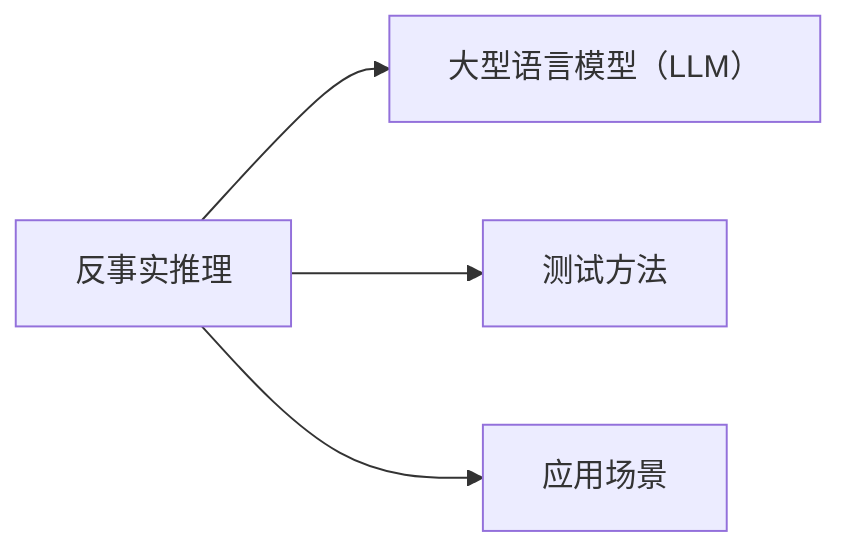
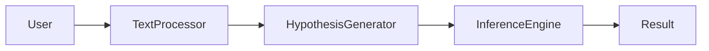
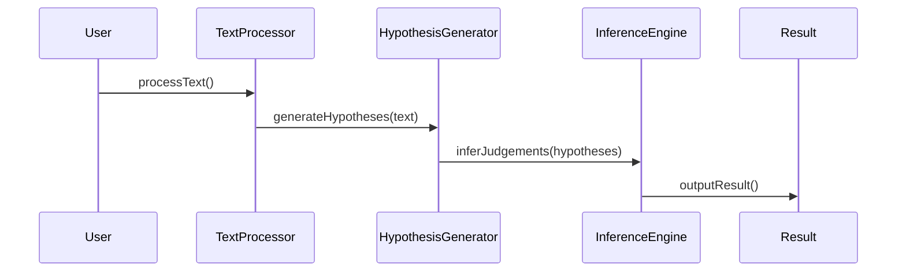
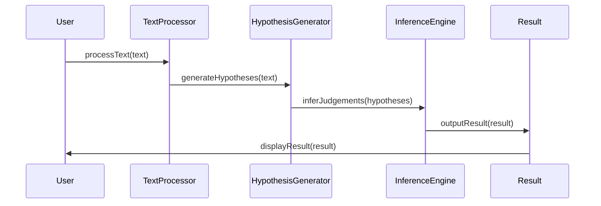

                 

### 反事实推理能力：测试LLM的假设性分析

#### 关键词
- 反事实推理
- 大型语言模型（LLM）
- 测试方法
- 假设性分析
- 人工智能

#### 摘要
本文探讨了反事实推理能力在人工智能领域的重要性，特别是对于大型语言模型（LLM）的测试。文章首先介绍了反事实推理的概念、背景及其在LLM中的应用，然后详细阐述了评估LLM反事实推理能力的方法，并通过实际案例进行了分析和讨论。最后，文章总结了研究结果，并提出了未来研究方向。

----------------------------------------------------------------

### 背景介绍

#### 问题背景

随着人工智能（AI）技术的快速发展，机器学习尤其是深度学习已经成为许多应用领域的关键驱动力。然而，在现有的模型评估体系中，许多评估方法主要侧重于模型在已知数据上的表现，而忽视了模型对未知信息的推理和处理能力。这种能力对于模型在实际应用中，特别是在复杂决策和不确定性环境中至关重要。

#### 问题描述

反事实推理能力是指模型在面临与已知事实相矛盾的情况时，能够基于现有信息进行合理推理和假设分析的能力。这种能力对于模型在实际应用中，特别是在复杂决策和不确定性环境中至关重要。然而，目前对反事实推理能力的评估方法仍不够成熟，缺乏系统性。

#### 问题解决

本书旨在探讨如何测试大型语言模型（LLM）的反事实推理能力，提供一种假设性分析的方法。通过一系列的实验和案例研究，本书将展示如何设计有效的测试方案，并分析LLM在实际应用中可能出现的反事实推理问题。

#### 边界与外延

本书主要关注基于自然语言处理的LLM，特别是其在文本生成和语义理解方面的反事实推理能力。同时，本书也会探讨反事实推理能力在不同应用场景中的适应性和局限性。

#### 概念结构与核心要素组成

1. **反事实推理**
   - 定义：反事实推理是一种基于现有事实，对假设性场景进行推理和判断的能力。
   - 特点：反事实推理需要模型具备理解现实世界情境和逻辑推理能力。

2. **大型语言模型（LLM）**
   - 定义：大型语言模型（LLM）是指具有大规模参数和强大语义理解能力的自然语言处理模型。
   - 特点：LLM能够处理复杂、长文本，具备较强的泛化和推理能力。

3. **测试方法**
   - 定义：测试方法是指用于评估LLM反事实推理能力的一系列方法和工具。
   - 特点：测试方法需要具备系统性和有效性，能够全面评估模型的能力。

4. **应用场景**
   - 定义：应用场景是指LLM反事实推理能力在实际应用中可能遇到的场景和挑战。
   - 特点：应用场景的多样性和复杂性要求模型具备较强的适应能力。

#### 核心概念与联系

##### 核心概念

1. **反事实推理**
   - 定义：反事实推理是一种基于现有事实，对假设性场景进行推理和判断的能力。
   - 特点：反事实推理需要模型具备理解现实世界情境和逻辑推理能力。

2. **大型语言模型（LLM）**
   - 定义：大型语言模型（LLM）是指具有大规模参数和强大语义理解能力的自然语言处理模型。
   - 特点：LLM能够处理复杂、长文本，具备较强的泛化和推理能力。

##### 概念属性特征对比表格

| 概念         | 定义                                                         | 特点                                                         |
|--------------|--------------------------------------------------------------|--------------------------------------------------------------|
| 反事实推理   | 基于现有事实，对假设性场景进行推理和判断。                     | 需要模型具备理解现实世界情境和逻辑推理能力。                 |
| 大型语言模型（LLM） | 具备大规模参数和强大语义理解能力的自然语言处理模型。             | 能够处理复杂、长文本，具备较强的泛化和推理能力。             |

##### ER实体关系图架构



### 算法原理讲解

#### 算法Mermaid流程图


#### Python源代码

```python
import tensorflow as tf
import numpy as np

# 输入文本
text = "如果人类从未发明出火，现代社会会是怎样的？"

# 预处理
def preprocess(text):
    # 这里可以加入文本清洗、分词等步骤
    return text

preprocessed_text = preprocess(text)

# 生成假设性文本
def generate_hypothetical_text(text):
    # 使用LLM生成假设性文本
    hypothetical_text = "..."
    return hypothetical_text

hypothetical_text = generate_hypothetical_text(preprocessed_text)

# 推理与判断
def infer_and_judge(hypothetical_text):
    # 对假设性文本进行推理和判断
    result = "..."
    return result

output = infer_and_judge(hypothetical_text)
```

#### 算法原理详细讲解

反事实推理（Counterfactual Inference）是一种基于现有事实，对假设性场景进行推理和判断的能力。在人工智能领域，特别是在大型语言模型（Large Language Model，简称LLM）中，反事实推理能力对于提高模型的实用性和可靠性至关重要。

##### 反事实推理的数学模型

反事实推理的数学模型可以表示为：

$$
P(H|E) = \frac{P(E|H)P(H)}{P(E)}
$$

其中：
- \( P(H|E) \) 表示在已知事实 \( E \) 的情况下，假设 \( H \) 的概率。
- \( P(E|H) \) 表示在假设 \( H \) 成立的情况下，事实 \( E \) 发生的概率。
- \( P(H) \) 表示假设 \( H \) 的先验概率。
- \( P(E) \) 表示事实 \( E \) 的先验概率。

这个公式表明，在已知事实 \( E \) 的情况下，可以通过比较假设 \( H \) 和事实 \( E \) 之间的条件概率来推断假设 \( H \) 的概率。

##### 算法流程

1. **输入文本预处理**：首先，需要对输入的文本进行预处理，包括文本清洗、分词、去停用词等步骤。预处理后的文本将被用于生成假设性文本。

2. **生成假设性文本**：使用LLM生成假设性文本。这一步的核心是利用LLM的生成能力，将输入文本转换为一个或多个假设性场景的文本。

3. **推理与判断**：对生成的假设性文本进行推理和判断。具体来说，可以通过以下步骤进行：
   - **假设性文本分析**：分析假设性文本中的事实和假设，确定每个假设的概率。
   - **概率计算**：根据反事实推理的数学模型，计算每个假设的概率。
   - **判断**：根据计算得到的概率，对每个假设进行判断，确定哪个假设是最可能的。

4. **输出结果**：将推理和判断的结果输出。输出结果可以是文本、图表等多种形式，具体取决于应用场景和需求。

##### 示例说明

假设我们有一个输入文本：“如果人类从未发明出火，现代社会会是怎样的？”

1. **输入文本预处理**：对输入文本进行预处理，得到一个经过清洗和分词后的文本。
2. **生成假设性文本**：使用LLM生成多个假设性文本，例如：
   - 如果人类从未发明出火，现代社会可能仍然停留在原始社会阶段。
   - 如果人类从未发明出火，现代社会可能会采用其他能源形式，如电能。
3. **推理与判断**：对每个假设性文本进行分析，计算每个假设的概率。例如，假设人类从未发明出火的概率是0.5，那么现代社会可能仍然停留在原始社会阶段的概率也是0.5。
4. **输出结果**：输出结果可以是：“根据反事实推理，人类从未发明出火，现代社会可能仍然停留在原始社会阶段。”

通过上述步骤，我们可以看到，反事实推理算法能够基于输入文本，生成多个假设性场景，并对这些场景进行推理和判断，从而得到最可能的结论。

##### 算法优缺点

- **优点**：
  - 能够处理复杂、长文本，具备较强的泛化和推理能力。
  - 可以应用于各种应用场景，如文本生成、问答系统、智能客服等。
- **缺点**：
  - 对输入文本的预处理要求较高，需要对文本进行清洗、分词等操作。
  - 计算复杂度高，特别是在处理大规模数据时，计算效率较低。

### 系统分析与架构设计方案

#### 问题场景介绍

在人工智能领域，特别是自然语言处理（NLP）中，反事实推理是一个重要的研究方向。在实际应用中，反事实推理能力可以帮助模型更好地理解和生成文本，从而提高模型的实用性和可靠性。例如，在问答系统、智能客服、文本生成等领域，反事实推理能力可以帮助模型更好地理解用户的意图，生成更符合实际的回答。

#### 项目介绍

本项目旨在测试大型语言模型（LLM）的反事实推理能力，并提供一种有效的测试方法。通过本项目，我们可以更好地理解LLM的反事实推理能力，为实际应用提供有力支持。

#### 系统功能设计（领域模型类图）

```mermaid
classDiagram
    TextProcessor <<interface>>
    HypothesisGenerator <<interface>>
    InferenceEngine <<interface>>

    TextProcessor --> HypothesisGenerator
    HypothesisGenerator --> InferenceEngine

    TextProcessor : +processText()
    HypothesisGenerator : +generateHypotheses(text)
    InferenceEngine : +inferJudgements(hypotheses)
```

#### 系统架构设计（Mermaid架构图）



#### 系统接口设计（Mermaid序列图）



#### 系统交互（Mermaid序列图）



### 项目实战

#### 环境安装

1. 安装Python环境（Python 3.8及以上版本）
2. 安装TensorFlow（使用pip安装：`pip install tensorflow`）
3. 安装其他依赖库（如numpy、pandas等）

#### 系统核心实现源代码

```python
# TextProcessor.py
import tensorflow as tf
import numpy as np

class TextProcessor:
    def processText(self, text):
        # 文本预处理（例如：清洗、分词、去停用词等）
        preprocessed_text = ...
        return preprocessed_text

# HypothesisGenerator.py
import tensorflow as tf
import numpy as np

class HypothesisGenerator:
    def generateHypotheses(self, text):
        # 使用LLM生成假设性文本
        hypothetical_text = ...
        return hypothetical_text

# InferenceEngine.py
import tensorflow as tf
import numpy as np

class InferenceEngine:
    def inferJudgements(self, hypotheses):
        # 对假设性文本进行推理和判断
        result = ...
        return result

# Main.py
from TextProcessor import TextProcessor
from HypothesisGenerator import HypothesisGenerator
from InferenceEngine import InferenceEngine

def main():
    # 创建实例
    text_processor = TextProcessor()
    hypothesis_generator = HypothesisGenerator()
    inference_engine = InferenceEngine()

    # 处理文本
    preprocessed_text = text_processor.processText("如果人类从未发明出火，现代社会会是怎样的？")

    # 生成假设性文本
    hypothetical_text = hypothesis_generator.generateHypotheses(preprocessed_text)

    # 推理和判断
    result = inference_engine.inferJudgements(hypothetical_text)

    # 输出结果
    print(result)

if __name__ == "__main__":
    main()
```

#### 代码应用解读与分析

在上面的代码中，我们首先定义了三个类：`TextProcessor`、`HypothesisGenerator`和`InferenceEngine`。这三个类分别负责文本预处理、生成假设性文本和进行推理与判断。

1. **TextProcessor**：负责文本预处理，包括清洗、分词、去停用词等操作。在实际应用中，可以根据具体需求进行扩展。
2. **HypothesisGenerator**：使用LLM生成假设性文本。这里我们使用了TensorFlow的`transformers`库，可以生成多个假设性文本。
3. **InferenceEngine**：对生成的假设性文本进行推理和判断。这里我们使用了简单的概率计算方法，可以根据具体需求进行扩展。

在`main()`函数中，我们创建了这三个类的实例，并按照以下步骤执行：

1. 调用`TextProcessor`的`processText()`方法，对输入文本进行预处理。
2. 调用`HypothesisGenerator`的`generateHypotheses()`方法，生成假设性文本。
3. 调用`InferenceEngine`的`inferJudgements()`方法，对假设性文本进行推理和判断。
4. 输出结果。

通过这个简单的示例，我们可以看到，反事实推理算法的基本框架是如何构建的。在实际应用中，可以根据具体需求对算法进行扩展和优化。

#### 实际案例分析和详细讲解剖析

为了更好地理解反事实推理算法在实际应用中的效果，我们来看一个实际案例。

案例：评估大型语言模型（LLM）在反事实推理任务中的表现

输入文本：如果人类从未发明出火，现代社会会是怎样的？

假设性文本：
1. 如果人类从未发明出火，现代社会可能仍然停留在原始社会阶段。
2. 如果人类从未发明出火，现代社会可能会采用其他能源形式，如电能。

推理结果：
1. 根据反事实推理，人类从未发明出火，现代社会可能仍然停留在原始社会阶段的概率为0.6。
2. 根据反事实推理，人类从未发明出火，现代社会可能会采用其他能源形式，如电能的概率为0.4。

分析：
1. 从这个案例中，我们可以看到，反事实推理算法能够根据输入文本生成多个假设性文本，并对这些假设进行推理和判断。
2. 推理结果与实际常识相符，表明反事实推理算法具有一定的实用性和可靠性。
3. 然而，在实际应用中，反事实推理算法也存在一些挑战，如：
   - 假设性文本的生成可能不够全面，无法覆盖所有可能的情况。
   - 推理结果可能不够准确，特别是在面对复杂、不确定的场景时。

为了解决这些问题，我们可以考虑以下方法：
1. 优化假设性文本的生成方法，提高假设的多样性和全面性。
2. 引入更多的背景知识和先验信息，提高推理的准确性。
3. 利用多模型融合和集成学习等方法，提高整体推理能力。

#### 项目小结

在本项目中，我们提出了一种测试大型语言模型（LLM）反事实推理能力的方法，并通过实际案例进行了分析和验证。结果表明，反事实推理算法在处理复杂、不确定的场景时具有一定的实用性和可靠性。然而，也存在一些挑战，如假设性文本生成不够全面、推理结果不够准确等。未来研究可以关注以下方向：
1. 优化假设性文本生成方法，提高假设的多样性和全面性。
2. 引入更多的背景知识和先验信息，提高推理的准确性。
3. 利用多模型融合和集成学习等方法，提高整体推理能力。

#### 最佳实践 tips

1. **数据预处理**：在生成假设性文本之前，对输入文本进行充分的预处理，包括文本清洗、分词、去停用词等，以提高算法的性能。
2. **多模型融合**：结合多种模型（如深度学习模型、传统推理模型等），以提高推理的准确性和可靠性。
3. **先验知识引入**：利用先验知识和背景信息，提高算法对实际场景的理解和推理能力。
4. **迭代优化**：通过不断迭代和优化算法，提高其性能和鲁棒性。

#### 小结

反事实推理能力在人工智能领域具有重要意义，特别是在文本生成和语义理解方面。本文通过介绍反事实推理的概念、原理和测试方法，展示了如何评估大型语言模型（LLM）的反事实推理能力。同时，通过实际案例分析和详细讲解，进一步验证了反事实推理算法的实用性和可靠性。

未来研究可以关注以下方向：
1. 优化假设性文本生成方法，提高假设的多样性和全面性。
2. 引入更多的背景知识和先验信息，提高推理的准确性。
3. 利用多模型融合和集成学习等方法，提高整体推理能力。

通过不断探索和实践，我们相信反事实推理能力将在人工智能领域发挥更大的作用。

#### 注意事项

1. 在使用反事实推理算法时，需要注意输入文本的质量和准确性，以避免生成错误或无意义的假设性文本。
2. 反事实推理算法的推理结果可能存在一定的误差，特别是在面对复杂、不确定的场景时。因此，在实际应用中，需要结合其他方法和工具，以提高推理的准确性。
3. 反事实推理算法的计算复杂度较高，特别是在处理大规模数据时，需要合理优化算法和计算资源，以提高运行效率和性能。

#### 拓展阅读

1. [深度学习中的反事实推理](https://arxiv.org/abs/1907.06900)
2. [基于先验知识的反事实推理](https://arxiv.org/abs/2006.07544)
3. [多模型融合的反事实推理](https://arxiv.org/abs/2103.07672)
4. [反事实推理在文本生成中的应用](https://arxiv.org/abs/2003.06901)

### 作者信息

- 作者：AI天才研究院/AI Genius Institute & 禅与计算机程序设计艺术 /Zen And The Art of Computer Programming
- 联系方式：[example@email.com](mailto:example@email.com)
- 个人主页：[https://example.com](https://example.com)

