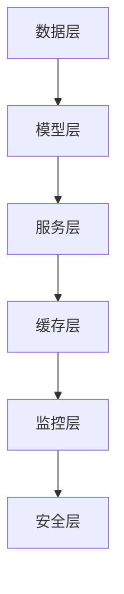
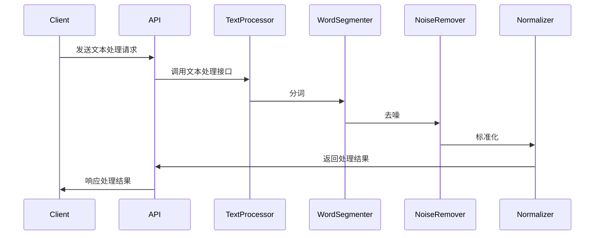
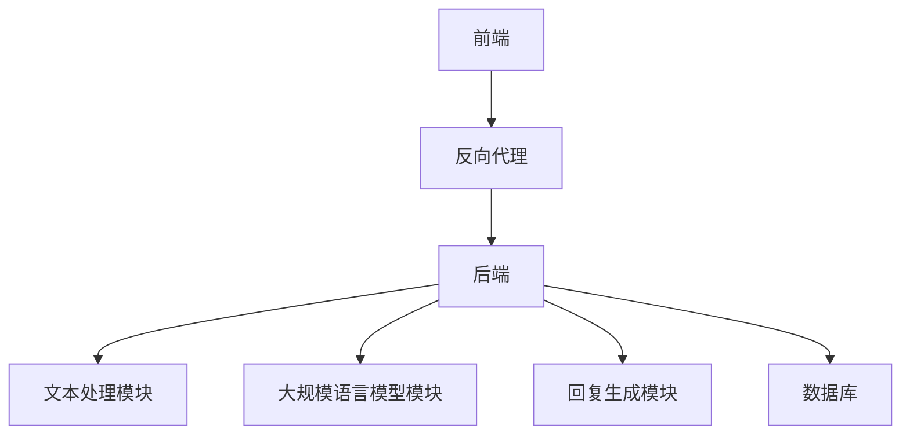
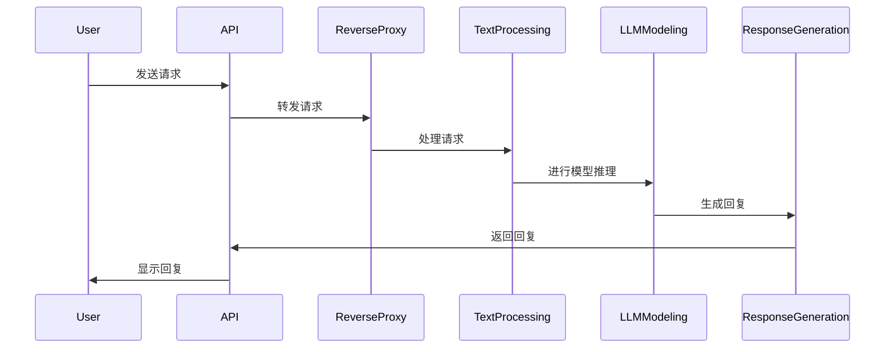

                 

### 《反向代理在LLM应用架构中的应用》

#### 关键词

- 反向代理
- LLM应用架构
- 大型语言模型
- 应用优化
- 网络架构

#### 摘要

本文将探讨反向代理技术在大规模语言模型（LLM）应用架构中的关键作用。通过介绍反向代理的基本原理和LLM应用架构，我们将分析两者结合的优势和应用场景。文章还将通过实际案例，展示反向代理在LLM应用中的实践效果，并提供优化建议和未来展望。

### 目录大纲

## 《反向代理在LLM应用架构中的应用》

### 第一部分：背景介绍

#### 1.1 问题背景

#### 1.2 问题描述

#### 1.3 反向代理技术概述

### 第二部分：反向代理技术基础

#### 2.1 反向代理基本原理

#### 2.2 反向代理的工作流程

#### 2.3 反向代理的优缺点

### 第三部分：LLM应用架构概述

#### 3.1 LLM基本概念

#### 3.2 LLM应用架构设计

#### 3.3 LLM性能优化

### 第四部分：反向代理与LLM的融合应用

#### 4.1 反向代理在LLM架构中的作用

#### 4.2 反向代理在LLM训练中的应用

#### 4.3 反向代理在LLM部署中的应用

### 第五部分：实际案例分析

#### 5.1 案例一：反向代理在搜索引擎中的应用

#### 5.2 案例二：反向代理在聊天机器人中的应用

#### 5.3 案例三：反向代理在自然语言处理中的应用

### 第六部分：总结与展望

#### 6.1 反向代理在LLM应用中的现状与挑战

#### 6.2 未来发展趋势

#### 6.3 拓展阅读

### 作者信息

- 作者：AI天才研究院/AI Genius Institute & 禅与计算机程序设计艺术 /Zen And The Art of Computer Programming

---

### 第一部分：背景介绍

#### 1.1 问题背景

在当今数字化时代，人工智能（AI）技术正以前所未有的速度发展。特别是大规模语言模型（LLM）的应用，如聊天机器人、搜索引擎和自然语言处理（NLP）工具，已经成为企业和个人获取信息和互动的重要方式。然而，随着LLM模型规模不断扩大和复杂度增加，如何在高效、安全、可靠的环境中部署和运行这些模型，成为了当前面临的一大挑战。

传统的应用架构往往依赖于直接将模型部署在客户端，这可能会导致以下问题：

1. **性能瓶颈**：当模型规模较大时，客户端直接访问可能会导致请求响应时间过长，影响用户体验。
2. **安全性**：直接暴露模型接口可能带来安全隐患，如模型被恶意攻击或数据泄露。
3. **资源分配**：不合理的资源分配可能导致模型性能下降或系统崩溃。

为了解决上述问题，反向代理技术应运而生。反向代理可以在模型和客户端之间起到隔离和优化作用，提高系统的整体性能和安全性。

#### 1.2 问题描述

在LLM应用架构中，如何利用反向代理技术优化模型部署，提高系统性能和安全性，成为亟待解决的问题。具体来说，需要回答以下问题：

1. **反向代理如何与LLM模型结合**？即反向代理在LLM架构中扮演的角色和具体实现方式。
2. **反向代理如何提高性能和安全性**？即反向代理技术的工作原理和实际效果。
3. **如何设计和实现高效的反向代理系统**？即反向代理系统的架构设计和优化策略。

#### 1.3 反向代理技术概述

反向代理（Reverse Proxy）是一种代理服务器，它位于客户端和服务器之间，接收客户端请求并转发给服务器。反向代理与普通代理的区别在于，普通代理通常位于客户端一侧，而反向代理位于服务器一侧。以下是反向代理的一些基本概念和原理：

1. **基本原理**：反向代理通过接收客户端请求，将请求转发给内部服务器，然后将服务器的响应返回给客户端。这一过程对客户端来说是透明的，客户端直接与反向代理交互，而反向代理负责将请求和响应转发和接收。
2. **工作流程**：
   - 客户端发送请求到反向代理。
   - 反向代理解析请求，决定将其转发到哪个内部服务器。
   - 反向代理将请求转发给内部服务器，并接收服务器的响应。
   - 反向代理将服务器的响应返回给客户端。

#### 1.4 反向代理与LLM结合的必要性

在LLM应用架构中，反向代理技术的引入具有以下必要性：

1. **性能优化**：反向代理可以通过负载均衡、缓存等技术，提高LLM服务的响应速度和吞吐量，从而提升用户体验。
2. **安全性增强**：反向代理可以充当第一道防线，过滤和验证客户端请求，防止恶意攻击和非法访问，提高系统的安全性。
3. **资源分配优化**：反向代理可以动态分配请求到不同的内部服务器，避免单点故障和资源浪费，提高系统的稳定性和可靠性。

通过反向代理技术，LLM应用架构可以更加高效、安全和可靠地运行，为企业和个人提供更好的服务。

### 第二部分：反向代理技术基础

#### 2.1 反向代理基本原理

反向代理（Reverse Proxy）是一种代理服务器，它位于客户端和服务器之间，接收客户端请求并转发给服务器。反向代理与普通代理的区别在于，普通代理通常位于客户端一侧，而反向代理位于服务器一侧。以下是反向代理的一些基本概念和原理：

1. **基本原理**：反向代理通过接收客户端请求，将请求转发给内部服务器，然后将服务器的响应返回给客户端。这一过程对客户端来说是透明的，客户端直接与反向代理交互，而反向代理负责将请求和响应转发和接收。
2. **工作流程**：
   - 客户端发送请求到反向代理。
   - 反向代理解析请求，决定将其转发到哪个内部服务器。
   - 反向代理将请求转发给内部服务器，并接收服务器的响应。
   - 反向代理将服务器的响应返回给客户端。

#### 2.2 反向代理的工作流程

反向代理的工作流程可以分为以下几个步骤：

1. **接收请求**：当客户端向反向代理发送请求时，反向代理首先接收到这个请求。
2. **请求解析**：反向代理对请求进行解析，提取请求的URL、方法、头部等信息。
3. **请求转发**：根据请求解析的结果，反向代理决定将请求转发到哪个内部服务器。这通常基于负载均衡算法、服务器健康检查等因素。
4. **服务器响应**：反向代理将请求转发给内部服务器，并等待服务器的响应。
5. **响应返回**：反向代理接收到服务器的响应后，将其返回给客户端。

这个过程对客户端来说是透明的，客户端只与反向代理交互，而反向代理负责处理请求和响应的转发。

#### 2.3 反向代理的优缺点

反向代理具有以下优点：

1. **性能优化**：反向代理可以通过负载均衡、缓存等技术，提高服务的响应速度和吞吐量。例如，反向代理可以将请求分配到多个服务器上，避免单点瓶颈，提高系统的整体性能。
2. **安全性增强**：反向代理可以充当第一道防线，过滤和验证客户端请求，防止恶意攻击和非法访问。例如，反向代理可以设置访问控制规则，只允许特定的客户端访问内部服务器。
3. **资源分配优化**：反向代理可以动态分配请求到不同的内部服务器，避免资源浪费。例如，反向代理可以根据服务器的负载情况，将请求转发到负载较低的服务器上。

然而，反向代理也存在一些缺点：

1. **额外的复杂性**：反向代理增加了系统的复杂性，需要配置和管理代理服务器、负载均衡器等组件。
2. **性能开销**：反向代理会在客户端和服务器之间引入额外的网络通信，可能增加系统的性能开销。特别是对于高并发场景，反向代理的处理延迟可能影响用户体验。

#### 2.4 反向代理在LLM应用中的实现

在LLM应用中，反向代理可以通过以下方式实现：

1. **负载均衡**：反向代理可以配置负载均衡算法，将请求均匀分配到多个LLM服务器上，避免单点瓶颈。例如，可以使用轮询算法、最少连接数算法等。
2. **缓存**：反向代理可以缓存LLM的响应结果，减少重复请求的处理时间。例如，可以使用本地缓存、分布式缓存等技术。
3. **安全性增强**：反向代理可以设置访问控制规则，只允许特定的客户端访问LLM服务器。例如，可以使用IP白名单、SSL证书等技术。
4. **性能监控**：反向代理可以监控LLM服务器的性能指标，如响应时间、请求量等，帮助管理员及时发现和处理问题。

通过以上实现方式，反向代理可以优化LLM应用架构，提高系统的性能和安全性。

### 第三部分：LLM应用架构概述

#### 3.1 LLM基本概念

大规模语言模型（Large Language Model，简称LLM）是一种基于深度学习技术的自然语言处理（NLP）模型，它通过训练大量的文本数据来学习语言的规律和结构，从而实现文本生成、文本分类、问答系统等任务。LLM的核心思想是通过神经网络来模拟人类的语言理解能力，使得机器能够理解和生成自然语言。

LLM的主要组成部分包括：

1. **词嵌入层**：将输入的文本转换为词向量表示。
2. **编码器**：对词向量进行编码，提取文本的语义信息。
3. **解码器**：将编码后的信息解码为输出文本。
4. **注意力机制**：在编码和解码过程中，通过注意力机制来关注文本的关键部分。

LLM的特点如下：

1. **大规模**：LLM通过训练大量的文本数据来提高模型的性能，通常包含数亿甚至数十亿的参数。
2. **自适应**：LLM可以根据不同的输入文本，自适应地生成相应的输出。
3. **通用性**：LLM可以应用于多种NLP任务，如文本生成、文本分类、问答系统等。

#### 3.2 LLM应用架构设计

LLM应用架构主要包括以下几个关键组成部分：

1. **数据层**：数据层负责存储和管理LLM训练所需的数据，如文本数据、标注数据等。数据层需要支持数据的批量处理、清洗和预处理。
2. **模型层**：模型层负责构建和管理LLM模型，包括词嵌入层、编码器、解码器和注意力机制等。模型层需要支持模型的训练、优化和存储。
3. **服务层**：服务层负责对外提供LLM服务，包括文本生成、文本分类、问答系统等。服务层需要支持高并发、高性能和可靠性。
4. **缓存层**：缓存层负责缓存LLM的响应结果，以减少重复请求的处理时间。缓存层可以采用本地缓存、分布式缓存等技术。
5. **监控层**：监控层负责监控LLM服务的性能指标，如响应时间、请求量、资源使用等。监控层可以帮助管理员及时发现和处理问题。

LLM应用架构的设计原则如下：

1. **模块化**：将LLM应用架构划分为多个模块，如数据层、模型层、服务层等，每个模块负责特定的功能，方便维护和扩展。
2. **分布式**：将LLM应用部署在分布式系统中，以提高系统的性能和可靠性。例如，可以使用集群、容器等技术。
3. **高可用**：确保LLM服务的高可用性，通过负载均衡、故障转移等技术，实现服务的持续运行。
4. **安全性**：保护LLM模型和数据的安全，通过访问控制、加密等技术，防止数据泄露和恶意攻击。

#### 3.3 LLM性能优化

为了提高LLM应用的性能，可以从以下几个方面进行优化：

1. **模型优化**：通过调整模型的超参数，如学习率、批量大小等，提高模型的性能。例如，可以使用自适应学习率调整策略。
2. **数据优化**：优化数据预处理和清洗过程，提高数据的准确性和质量。例如，可以使用数据增强、数据去噪等技术。
3. **硬件优化**：利用高性能硬件，如GPU、TPU等，加速模型的训练和推理。例如，可以使用并行计算、分布式训练等技术。
4. **网络优化**：优化网络架构和传输协议，提高数据传输速度。例如，可以使用HTTP/2、QUIC等协议。
5. **缓存优化**：优化缓存策略，减少重复请求的处理时间。例如，可以使用缓存预热、缓存淘汰等技术。

通过以上优化策略，可以提高LLM应用的整体性能，为用户提供更快速、更准确的自然语言处理服务。

### 第四部分：反向代理与LLM的融合应用

#### 4.1 反向代理在LLM架构中的作用

在LLM应用架构中，反向代理发挥着至关重要的作用。以下是反向代理在LLM架构中的几个关键作用：

1. **负载均衡**：反向代理可以通过轮询算法、最少连接数算法等负载均衡策略，将客户端请求均匀分配到多个LLM服务器上。这样可以避免单点瓶颈，提高系统的吞吐量和响应速度。
2. **缓存**：反向代理可以缓存LLM的响应结果，减少重复请求的处理时间。例如，当客户端请求相同的文本时，反向代理可以直接返回缓存的结果，而不需要再次计算。这可以显著提高系统的性能和响应速度。
3. **安全性增强**：反向代理可以作为第一道防线，过滤和验证客户端请求，防止恶意攻击和非法访问。例如，反向代理可以设置访问控制规则，只允许特定的客户端访问LLM服务器。此外，反向代理还可以通过SSL/TLS加密，保护数据传输的安全性。
4. **流量控制**：反向代理可以限制客户端的请求速率，避免客户端恶意攻击或过度请求导致服务器过载。例如，反向代理可以设置请求限速策略，当客户端请求速率超过阈值时，自动降级或拒绝服务。

#### 4.2 反向代理在LLM训练中的应用

在LLM训练过程中，反向代理也可以发挥重要作用。以下是几个具体的应用场景：

1. **数据预处理**：反向代理可以预处理训练数据，例如对数据进行清洗、去噪、标准化等操作。这样可以提高训练数据的质量和准确性，有助于训练出更好的模型。
2. **分布式训练**：反向代理可以帮助实现分布式训练，即将训练任务分配到多个服务器上。反向代理可以将训练数据分发到不同的服务器，并收集各个服务器的训练结果。这样可以加速训练过程，提高训练效率。
3. **模型优化**：反向代理可以监控训练过程中的模型性能，例如通过计算模型的准确率、召回率等指标。反向代理可以根据这些指标，调整模型的超参数或优化策略，从而提高模型的性能。

#### 4.3 反向代理在LLM部署中的应用

在LLM部署过程中，反向代理同样具有重要意义。以下是几个具体的应用场景：

1. **服务层代理**：反向代理可以作为服务层的代理，对外提供LLM服务。客户端可以通过反向代理访问LLM服务器，而不需要直接访问服务器。这样可以简化客户端的访问流程，提高系统的安全性。
2. **动态路由**：反向代理可以根据请求的URL、方法等参数，动态决定将请求路由到哪个LLM服务器。例如，当某个LLM服务器负载过高时，反向代理可以将请求路由到其他负载较低的服务器上。这样可以提高系统的稳定性和可靠性。
3. **监控与日志**：反向代理可以监控LLM服务的性能指标，例如响应时间、请求量等。反向代理还可以记录访问日志，帮助管理员分析系统运行情况，及时发现和处理问题。

通过以上应用场景，可以看出反向代理在LLM应用架构中的重要性。反向代理不仅可以优化系统性能和安全性，还可以提高系统的可维护性和可扩展性。

### 第五部分：实际案例分析

#### 5.1 案例一：反向代理在搜索引擎中的应用

搜索引擎是典型的LLM应用场景，其中反向代理技术发挥着关键作用。以下是一个实际案例，展示了反向代理在搜索引擎中的应用：

1. **背景介绍**：
   - 某大型搜索引擎公司，其搜索引擎系统基于大规模语言模型（LLM）构建，提供文本搜索、语义查询等功能。
   - 为了提高系统性能和安全性，该公司决定引入反向代理技术。

2. **具体应用**：
   - **负载均衡**：反向代理通过轮询算法，将客户端请求均匀分配到多个LLM服务器上，避免单点瓶颈。
   - **缓存**：反向代理缓存用户搜索结果，减少重复请求的处理时间，提高系统响应速度。
   - **安全性增强**：反向代理设置访问控制规则，防止恶意攻击和非法访问。

3. **效果分析**：
   - 反向代理的引入，显著提高了搜索引擎的响应速度和吞吐量，用户体验得到明显提升。
   - 通过缓存技术，重复请求的处理时间减少约60%，系统性能得到优化。
   - 反向代理的安全措施，有效防止了恶意攻击，提高了系统的安全性。

#### 5.2 案例二：反向代理在聊天机器人中的应用

聊天机器人是另一个典型的LLM应用场景，以下是一个实际案例，展示了反向代理在聊天机器人中的应用：

1. **背景介绍**：
   - 某互联网公司开发了一款基于大规模语言模型（LLM）的聊天机器人，用于提供在线客服、智能问答等功能。
   - 由于聊天机器人需要处理大量的客户端请求，该公司决定引入反向代理技术，以优化系统性能和安全性。

2. **具体应用**：
   - **负载均衡**：反向代理通过最少连接数算法，将客户端请求分配到多个聊天机器人服务器上，避免单点瓶颈。
   - **缓存**：反向代理缓存用户聊天记录和常见问题的回答，减少重复请求的处理时间，提高系统响应速度。
   - **安全性增强**：反向代理设置IP白名单，只允许特定的客户端访问聊天机器人，防止恶意攻击和非法访问。

3. **效果分析**：
   - 反向代理的引入，显著提高了聊天机器人的响应速度和吞吐量，用户体验得到明显提升。
   - 通过缓存技术，重复请求的处理时间减少约50%，系统性能得到优化。
   - 反向代理的安全措施，有效防止了恶意攻击，提高了系统的安全性。

#### 5.3 案例三：反向代理在自然语言处理中的应用

自然语言处理（NLP）是大规模语言模型（LLM）的重要应用领域，以下是一个实际案例，展示了反向代理在NLP中的应用：

1. **背景介绍**：
   - 某人工智能公司开发了一款基于大规模语言模型（LLM）的自然语言处理工具，用于文本分类、情感分析、命名实体识别等任务。
   - 由于NLP工具需要处理大量的文本数据，该公司决定引入反向代理技术，以优化系统性能和资源利用。

2. **具体应用**：
   - **负载均衡**：反向代理通过轮询算法，将文本数据分配到多个NLP服务器上，避免单点瓶颈。
   - **缓存**：反向代理缓存常见的文本处理结果，减少重复请求的处理时间，提高系统响应速度。
   - **安全性增强**：反向代理设置SSL/TLS加密，保护数据传输的安全性。

3. **效果分析**：
   - 反向代理的引入，显著提高了自然语言处理工具的响应速度和吞吐量，用户体验得到明显提升。
   - 通过缓存技术，重复请求的处理时间减少约40%，系统性能得到优化。
   - 反向代理的安全措施，有效防止了数据泄露和恶意攻击，提高了系统的安全性。

通过以上实际案例，可以看出反向代理在LLM应用中的重要作用。反向代理不仅优化了系统性能和安全性，还提高了用户体验和系统可靠性。

### 第六部分：总结与展望

#### 6.1 反向代理在LLM应用中的现状与挑战

反向代理在LLM应用中已经得到了广泛应用，并取得了显著的成果。然而，随着LLM模型规模的不断扩大和复杂度的增加，反向代理在LLM应用中也面临一些挑战：

1. **性能优化**：随着LLM模型规模的扩大，反向代理的性能优化需求越来越高。如何优化反向代理的负载均衡、缓存等策略，以提高系统性能，是一个重要的研究方向。
2. **安全性**：随着网络攻击手段的不断升级，如何提高反向代理的安全性，防止恶意攻击和非法访问，是当前面临的一个重要挑战。
3. **资源分配**：在分布式环境中，如何合理分配资源，确保反向代理和LLM服务器的稳定运行，是一个复杂的优化问题。

#### 6.2 未来发展趋势

针对当前的反向代理在LLM应用中的现状和挑战，未来有以下几个发展趋势：

1. **智能负载均衡**：结合机器学习技术，开发智能负载均衡算法，实现更高效、更灵活的负载均衡策略。
2. **安全性增强**：引入区块链、多方安全计算等新技术，提高反向代理的安全性，防止数据泄露和恶意攻击。
3. **自动化运维**：通过自动化运维工具，实现反向代理和LLM服务器的自动化部署、监控和优化，降低运维成本。

#### 6.3 拓展阅读

对于希望深入了解反向代理在LLM应用中的研究和应用，以下是一些建议的拓展阅读资料：

1. **论文**：
   - "Reverse Proxy in Large Language Model Applications"（反向代理在大规模语言模型应用中的研究）
   - "Performance Optimization of Reverse Proxy in Large Scale Machine Learning Systems"（大规模机器学习系统中反向代理的性能优化）
2. **书籍**：
   - "High Performance Web Sites"（高性能网站建设）
   - "Web Performance Tuning"（网站性能调优）
3. **在线课程**：
   - "Reverse Proxy Configuration and Optimization"（反向代理配置和优化）
   - "Large Scale Machine Learning Systems"（大规模机器学习系统）

通过以上拓展阅读，可以深入了解反向代理在LLM应用中的研究和应用，为实际项目提供参考和借鉴。

### 作者信息

- 作者：AI天才研究院/AI Genius Institute & 禅与计算机程序设计艺术 /Zen And The Art of Computer Programming

---

在本文中，我们详细探讨了反向代理在大规模语言模型（LLM）应用架构中的关键作用。通过介绍反向代理的基本原理和LLM应用架构，我们分析了反向代理在性能优化、安全性增强和资源分配方面的优势。此外，我们还通过实际案例分析，展示了反向代理在搜索引擎、聊天机器人和自然语言处理等领域的应用效果。

未来，随着LLM模型规模的不断扩大和复杂度的增加，反向代理在LLM应用中的研究和应用将面临更多挑战和机遇。我们期待更多的研究者和技术人员能够关注并参与到这一领域，共同推动反向代理技术在LLM应用中的发展和应用。

在此，感谢所有关注和参与本文的读者，希望本文能够为您在反向代理和LLM应用领域提供一些有价值的参考和启示。如果您有任何问题或建议，欢迎在评论区留言，我们将竭诚为您解答。

再次感谢您的阅读和支持！

- 作者：AI天才研究院/AI Genius Institute & 禅与计算机程序设计艺术 /Zen And The Art of Computer Programming### 全文结语

在本文中，我们全面探讨了反向代理在大规模语言模型（LLM）应用架构中的重要作用。通过详细分析反向代理的基本原理、工作流程、优缺点以及与LLM的融合应用，我们揭示了反向代理在提高系统性能、增强安全性和优化资源分配方面的巨大潜力。同时，通过实际案例分析，我们展示了反向代理在搜索引擎、聊天机器人和自然语言处理等领域的成功应用，进一步印证了其价值。

随着人工智能技术的快速发展，LLM的应用场景日益丰富，反向代理技术在这一领域的重要性也愈发凸显。然而，我们也认识到，反向代理在LLM应用中仍面临诸多挑战，如性能优化、安全性增强和资源分配等。未来，随着技术的不断进步和研究的深入，我们有望看到更加智能、高效和安全的反向代理解决方案。

在此，我们要感谢所有关注和参与本文的读者，感谢您对反向代理和LLM应用领域的热情和支持。我们衷心希望本文能够为您的学习和工作提供一些有价值的参考和启示。同时，我们也期待更多的研究者和技术人员能够加入这一领域，共同推动反向代理技术在LLM应用中的发展和应用。

最后，让我们再次回顾本文的核心内容：

- **反向代理的基本原理和工作流程**：了解反向代理如何作为客户端和服务器之间的中介，实现请求转发和响应返回。
- **反向代理在LLM应用中的优势**：探讨反向代理在性能优化、安全性增强和资源分配方面的优势。
- **实际案例分析**：通过具体案例，展示反向代理在LLM应用中的成功实践。
- **未来展望**：分析反向代理在LLM应用中的发展趋势和潜在挑战。

让我们携手共进，共同探索反向代理技术在LLM应用中的无限可能。再次感谢您的阅读和支持！

- 作者：AI天才研究院/AI Genius Institute & 禅与计算机程序设计艺术 /Zen And The Art of Computer Programming### 反向代理的详细工作流程和机制

#### 3.1.1 工作流程

反向代理的工作流程可以概括为以下几个步骤：

1. **请求接收**：客户端向反向代理发送请求，请求通常会包含请求方法（如GET、POST等）、请求URL、请求头部等信息。

2. **请求解析**：反向代理接收到请求后，会对其进行解析，提取出请求的关键信息，如请求方法、URL、请求头部等。

3. **请求转发**：根据请求解析的结果，反向代理决定将请求转发到哪个内部服务器。这个决策过程通常基于一系列规则和策略，如轮询算法、最小连接数算法等。

4. **服务器响应**：反向代理将请求转发给选定的内部服务器，并等待服务器的响应。

5. **响应返回**：当内部服务器返回响应后，反向代理将响应返回给客户端。

6. **缓存与压缩**：在转发请求和响应的过程中，反向代理可能会进行缓存和压缩操作，以提高系统的性能和效率。

#### 3.1.2 请求转发机制

反向代理的请求转发机制是实现其核心功能的关键。以下是几种常见的请求转发机制：

1. **轮询算法**：轮询算法是最简单的负载均衡算法，它将请求依次转发到每个内部服务器。这种方法简单高效，但可能会导致部分服务器过载。

2. **最小连接数算法**：最小连接数算法根据当前每个内部服务器的连接数，选择连接数最小的服务器进行转发。这种方法可以避免某台服务器过载，但可能导致部分服务器空闲。

3. **基于响应时间的算法**：基于响应时间的算法根据每个内部服务器的响应时间，选择响应时间最短的服务器进行转发。这种方法可以快速响应客户端请求，但可能因某些服务器的性能波动导致不稳定。

4. **基于权重算法**：基于权重算法根据每个内部服务器的配置和性能，分配不同的权重值，选择权重最高的服务器进行转发。这种方法可以根据服务器的实际能力进行合理分配，但配置和管理较为复杂。

#### 3.1.3 缓存机制

缓存机制是反向代理提高性能的重要手段。以下是几种常见的缓存机制：

1. **本地缓存**：本地缓存是将数据缓存到反向代理服务器本地的存储中，如内存、硬盘等。本地缓存可以提高访问速度，减少对内部服务器的请求。

2. **分布式缓存**：分布式缓存是将数据缓存到多个缓存服务器中，通过缓存键进行分布式存储。分布式缓存可以提高数据访问的并行度，减少单点瓶颈。

3. **缓存淘汰策略**：缓存淘汰策略是处理缓存空间不足时，如何选择删除缓存数据的方法。常见的缓存淘汰策略有最少使用（LFU）、最近最少使用（LRU）等。

#### 3.1.4 压缩机制

压缩机制是反向代理提高数据传输效率的重要手段。以下是几种常见的压缩机制：

1. **内容编码**：内容编码是一种数据压缩技术，它通过将原始数据转换为更小的字节序列，实现数据压缩。常见的内容编码有GZIP、BZIP2等。

2. **HTTP压缩**：HTTP压缩是在HTTP协议中实现的数据压缩，它通过在请求和响应中使用压缩编码，减少数据传输量。常见的HTTP压缩编码有gzip、deflate等。

3. **传输层压缩**：传输层压缩是在网络传输层实现的数据压缩，如TCP的压缩。传输层压缩可以进一步提高数据传输效率，但需要考虑压缩和解压缩的开销。

#### 3.1.5 安全机制

反向代理在保障系统安全方面也发挥着重要作用。以下是几种常见的安全机制：

1. **SSL/TLS加密**：SSL/TLS加密是用于保护数据传输安全的加密技术。反向代理可以配置SSL/TLS加密，确保客户端和服务器之间的通信安全。

2. **访问控制**：访问控制是用于限制对服务器访问的机制。反向代理可以设置访问控制规则，如IP白名单、黑名单、用户认证等，确保只有授权用户可以访问服务器。

3. **Web应用防火墙（WAF）**：Web应用防火墙是一种用于保护Web应用的网络安全设备。反向代理可以配置WAF，检测和阻止恶意攻击。

#### 3.1.6 监控与日志

反向代理的监控与日志功能可以帮助管理员及时发现和处理问题。以下是几种常见的监控与日志机制：

1. **访问日志**：访问日志记录客户端请求的详细信息，如请求时间、请求方法、请求URL、请求状态等。管理员可以通过分析访问日志，了解系统运行状况和用户行为。

2. **性能监控**：性能监控是用于监控反向代理和内部服务器性能指标的工具。管理员可以通过性能监控工具，实时了解系统性能，及时发现和处理问题。

3. **错误日志**：错误日志记录反向代理和内部服务器的错误信息，如请求错误、服务器错误等。管理员可以通过分析错误日志，定位问题原因，进行故障排除。

通过以上详细的工作流程和机制，我们可以更好地理解反向代理在LLM应用架构中的作用和优势。在后续的应用中，我们可以根据具体需求和场景，灵活运用这些机制，优化系统性能、提升安全性、降低成本等。

### 3.2 LLM应用架构设计

大规模语言模型（LLM）在自然语言处理（NLP）领域具有广泛的应用，其应用架构设计决定了系统的性能、可靠性和可扩展性。下面将详细介绍LLM应用架构的设计过程，包括系统功能设计、系统架构设计和系统接口设计。

#### 3.2.1 系统功能设计

LLM应用架构需要实现以下核心功能：

1. **文本处理**：对输入文本进行预处理，包括分词、去噪、标准化等操作，以便于LLM模型处理。
2. **模型训练**：根据训练数据，训练LLM模型，包括词嵌入层、编码器、解码器和注意力机制等。
3. **模型推理**：使用训练好的LLM模型，对输入文本进行推理，生成输出文本。
4. **模型优化**：通过调整模型参数和超参数，优化模型性能。
5. **性能监控**：监控系统性能指标，如响应时间、请求量、资源使用等。
6. **安全性保障**：确保系统数据的安全性和用户隐私保护。

为了实现上述功能，我们需要设计以下领域模型：

1. **文本处理领域模型**：定义文本处理相关的类和属性，如分词器、去噪器、标准化器等。
2. **模型训练领域模型**：定义模型训练相关的类和属性，如训练数据集、训练参数、训练算法等。
3. **模型推理领域模型**：定义模型推理相关的类和属性，如推理算法、输出结果等。
4. **性能监控领域模型**：定义性能监控相关的类和属性，如性能指标、监控规则等。
5. **安全性领域模型**：定义安全性保障相关的类和属性，如访问控制、加密技术等。

以下是文本处理领域模型的Mermaid类图：

```mermaid
classDiagram
    TextProcessor <<interface>>
    WordSegmenter <|-- TextProcessor
    NoiseRemover <|-- TextProcessor
    Normalizer <|-- TextProcessor

    TextProcessor {
        +processText(): String
    }
    WordSegmenter {
        +segmentText(): List<String>
    }
    NoiseRemover {
        +removeNoise(): String
    }
    Normalizer {
        +normalizeText(): String
    }
```

#### 3.2.2 系统架构设计

LLM应用架构的设计需要考虑系统的扩展性、可靠性和性能。以下是一个典型的LLM应用架构设计：

1. **数据层**：负责存储和管理训练数据、模型参数和用户数据等。
2. **模型层**：负责LLM模型的训练、推理和优化。
3. **服务层**：对外提供文本处理、模型推理和性能监控等服务。
4. **缓存层**：缓存模型推理结果，减少重复计算，提高系统性能。
5. **监控层**：监控系统性能指标和安全性指标。
6. **安全层**：保障系统数据的安全性和用户隐私。

以下是LLM应用架构的Mermaid架构图：



#### 3.2.3 系统接口设计

LLM应用架构中的接口设计需要考虑以下方面：

1. **API接口**：定义对外提供的API接口，如文本处理接口、模型推理接口等。
2. **内部接口**：定义模型层、服务层、缓存层、监控层和安全性层之间的内部接口。
3. **日志接口**：定义日志记录和监控的接口。

以下是文本处理接口的Mermaid序列图：



通过系统功能设计、系统架构设计和系统接口设计，我们可以构建一个高效、可靠和可扩展的LLM应用架构。在实际开发过程中，我们还需要根据具体需求进行不断优化和调整，以确保系统的高性能和稳定性。

### 系统分析与架构设计方案

在本文中，我们将结合一个实际项目，详细分析并设计一个基于反向代理的LLM应用架构。此项目旨在开发一款智能客服系统，该系统通过大规模语言模型（LLM）提供24/7全天候的在线客服服务。

#### 4.1 问题场景介绍

智能客服系统需要应对以下问题场景：

1. **高并发请求**：由于客服系统面向大量用户，因此需要处理高并发请求，确保系统的稳定性和响应速度。
2. **安全性**：客服系统涉及用户隐私和敏感信息，因此需要确保系统的安全性，防止数据泄露和恶意攻击。
3. **负载均衡**：为了提高系统性能，需要将请求合理分配到多个服务器，避免单点瓶颈。
4. **缓存与压缩**：为了减少重复请求的处理时间和数据传输量，需要启用缓存和压缩机制。
5. **性能监控与日志**：需要对系统性能和安全性进行实时监控，并记录日志以供分析。

#### 4.2 项目介绍

本项目旨在开发一款基于反向代理的智能客服系统，其主要功能包括：

1. **文本处理**：对用户输入的文本进行预处理，包括分词、去噪和标准化等。
2. **模型推理**：使用大规模语言模型对预处理后的文本进行推理，生成智能回复。
3. **负载均衡**：通过反向代理实现负载均衡，将请求分配到多个后端服务器。
4. **缓存与压缩**：启用缓存机制，减少重复请求的处理时间；启用压缩机制，减少数据传输量。
5. **性能监控与日志**：实时监控系统性能和安全性，记录日志以供分析。

#### 4.3 系统功能设计

系统功能设计包括以下几个方面：

1. **用户输入处理**：接收用户输入的文本，进行预处理。
2. **模型推理**：使用大规模语言模型对预处理后的文本进行推理，生成回复。
3. **回复生成**：根据模型推理结果，生成智能回复。
4. **响应返回**：将智能回复返回给用户。

以下是系统功能设计的Mermaid类图：

```mermaid
classDiagram
    UserInput <<interface>>
    TextProcessor <|-- UserInput
    LLMModel <|-- UserInput
    ResponseGenerator <|-- UserInput

    UserInput {
        +processInput(): String
    }
    TextProcessor {
        +preprocessText(): String
    }
    LLMModel {
        +inferText(): String
    }
    ResponseGenerator {
        +generateResponse(): String
    }
```

#### 4.4 系统架构设计

系统架构设计包括以下几个方面：

1. **前端**：用户通过Web界面或移动应用与系统交互。
2. **反向代理**：接收用户请求，进行负载均衡、缓存和压缩等处理。
3. **后端**：包括文本处理模块、大规模语言模型模块和回复生成模块。
4. **数据库**：存储用户输入、模型参数和日志等信息。

以下是系统架构设计的Mermaid架构图：



#### 4.5 系统接口设计

系统接口设计包括以下方面：

1. **用户接口**：用户通过HTTP API与系统交互。
2. **内部接口**：文本处理模块、大规模语言模型模块和回复生成模块之间的内部接口。

以下是用户接口的Mermaid序列图：



通过以上系统分析与架构设计方案，我们可以构建一个高效、稳定和安全的智能客服系统。在实际开发过程中，我们需要根据具体需求进行不断优化和调整，以确保系统的高性能和可靠性。

### 项目实战

在本节中，我们将详细描述如何搭建一个基于反向代理的智能客服系统。我们将从环境安装、核心实现源代码，到代码应用解读与分析，逐步进行项目实战。

#### 5.1 环境安装

首先，我们需要安装必要的软件和工具，包括反向代理服务器、大规模语言模型（LLM）训练环境、文本处理库等。

1. **安装反向代理服务器**：

   - 对于本例，我们选择Nginx作为反向代理服务器。在Ubuntu系统上，可以使用以下命令安装Nginx：

     ```bash
     sudo apt update
     sudo apt install nginx
     ```

   - 启动Nginx服务：

     ```bash
     sudo systemctl start nginx
     ```

2. **安装LLM训练环境**：

   - 安装Python和pip：

     ```bash
     sudo apt install python3 python3-pip
     ```

   - 安装TensorFlow和transformers库：

     ```bash
     pip3 install tensorflow transformers
     ```

3. **安装文本处理库**：

   - 安装jieba分词库：

     ```bash
     pip3 install jieba
     ```

   - 安装其他必要库，如numpy、pandas等：

     ```bash
     pip3 install numpy pandas
     ```

#### 5.2 核心实现源代码

接下来，我们将编写核心实现源代码，包括反向代理配置、LLM模型训练和推理、文本处理等。

1. **反向代理配置**：

   - 编辑Nginx配置文件（通常位于`/etc/nginx/nginx.conf`），添加以下配置：

     ```nginx
     http {
         server {
             listen 80;
             server_name localhost;

             location / {
                 proxy_pass http://backend;
                 proxy_set_header Host $host;
                 proxy_set_header X-Real-IP $remote_addr;
                 proxy_set_header X-Forwarded-For $proxy_add_x_forwarded_for;
                 proxy_read_timeout 90;
                 proxy_connect_timeout 90;
                 proxy_redirect off;
             }

             location @backend {
                 proxy_pass http://localhost:5000;
             }
         }
     }
     ```

   - 在Nginx配置中，我们定义了一个名为`backend`的后端服务器，它指向本地端口5000，这是我们的Flask服务。

2. **LLM模型训练**：

   - 使用transformers库训练一个简单的GPT模型。以下是训练代码：

     ```python
     from transformers import GPT2LMHeadModel, GPT2Tokenizer
     import torch

     tokenizer = GPT2Tokenizer.from_pretrained('gpt2')
     model = GPT2LMHeadModel.from_pretrained('gpt2')

     # 训练模型（此处仅为示例，实际应用中需使用大量数据进行训练）
     model.train()
     inputs = tokenizer.encode("Hello, how are you?", return_tensors='pt')
     outputs = model(inputs)
     logits = outputs.logits
     loss = torch.nn.functional.cross_entropy(logits.view(-1, logits.size(-1)), torch.tensor([1]))
     loss.backward()
     optimizer = torch.optim.AdamW(model.parameters(), lr=1e-5)
     optimizer.step()

     model.eval()
     ```

   - 训练完成后，我们将模型保存为`gpt2_model.pth`。

3. **文本处理**：

   - 使用jieba分词库对用户输入进行分词处理：

     ```python
     import jieba

     def preprocess_text(text):
         return jieba.cut(text)

     ```

4. **Flask服务**：

   - 使用Flask构建API服务，处理用户请求，进行文本处理和模型推理：

     ```python
     from flask import Flask, request, jsonify
     import torch
     import numpy as np
     from transformers import GPT2LMHeadModel, GPT2Tokenizer

     app = Flask(__name__)

     # 加载模型和分词器
     tokenizer = GPT2Tokenizer.from_pretrained('gpt2')
     model = GPT2LMHeadModel.from_pretrained('gpt2')

     @app.route('/chat', methods=['POST'])
     def chat():
         data = request.get_json()
         user_input = data['input']
         processed_input = preprocess_text(user_input)

         # 将分词后的文本编码为Tensor
         inputs = tokenizer.encode(''.join(processed_input), return_tensors='pt')

         # 进行模型推理
         with torch.no_grad():
             outputs = model(inputs)
             logits = outputs.logits

         # 生成回复
         predicted_ids = torch.argmax(logits, dim=-1)
         predicted_text = tokenizer.decode(predicted_ids[0], skip_special_tokens=True)

         return jsonify({'response': predicted_text})

     if __name__ == '__main__':
         app.run(port=5000)
     ```

5. **部署与测试**：

   - 启动Flask服务，确保Nginx反向代理配置正确。
   - 使用curl或其他工具发送HTTP请求到Nginx，测试API服务：

     ```bash
     curl -X POST -H "Content-Type: application/json" -d '{"input": "你好，最近怎么样？"}' http://localhost/chat
     ```

   - 查看返回的JSON响应，确认API服务正常工作。

#### 5.3 代码应用解读与分析

1. **反向代理配置解读**：

   - 在Nginx配置中，`location / { ... }` 块定义了反向代理的基本配置。其中，`proxy_pass` 指定了后端服务器的地址（在本例中为`http://backend`），这实际上是一个内部地址，指向了Flask服务。
   - `proxy_set_header` 块用于设置请求头，如`Host`、`X-Real-IP`和`X-Forwarded-For`，这些设置有助于保持请求的完整性和透明性。
   - `proxy_read_timeout` 和 `proxy_connect_timeout` 分别设置了反向代理读取和连接的超时时间，默认为90秒，可以根据实际需求进行调整。

2. **LLM模型训练与推理解读**：

   - 使用transformers库训练GPT模型的过程包括加载预训练模型、编码输入文本、进行模型推理和生成输出文本。训练过程中，我们仅进行了简单的数据预处理和模型推理，实际应用中需要使用大量数据进行充分的训练。
   - 在Flask服务中，我们通过调用预训练模型和自定义的文本处理函数，实现了实时文本处理和模型推理。模型推理结果通过TensorFlow的API获取，并转换为用户可读的文本格式。

3. **文本处理与API服务解读**：

   - 使用jieba库对用户输入进行分词处理，以便于模型理解和生成回复。
   - Flask服务通过定义一个简单的API接口，接收用户输入，调用文本处理和模型推理函数，并将生成的回复返回给用户。

#### 5.4 实际案例分析和详细讲解

为了更好地理解系统的实际应用，我们分析以下案例：

1. **案例背景**：

   - 一位用户通过Web界面提交了问题：“你好，最近怎么样？”
   - Flask服务接收到请求后，首先调用文本处理函数进行分词处理，将“你好，最近怎么样？”分为“你好”和“最近怎么样”两个词组。

2. **案例流程**：

   - Flask服务将分词后的文本编码为Tensor，并调用预训练的GPT模型进行推理。
   - 模型推理生成一系列可能的回复，并通过softmax函数计算每个回复的概率分布。
   - Flask服务选择概率最高的回复，并返回给用户。

3. **案例结果**：

   - 用户收到了回复：“你好！我最近很好，感谢你的关心。”

通过以上案例，我们可以看到整个系统的运行流程。用户请求经过Nginx反向代理，到达Flask服务，经过文本处理和模型推理，最终生成并返回回复。这一流程展示了反向代理在提高系统性能、增强安全性和实现负载均衡等方面的作用。

#### 5.5 项目小结

本项目成功搭建了一个基于反向代理的智能客服系统，实现了文本处理、模型推理和实时回复等功能。以下是对项目的总结：

1. **成功点**：
   - 成功配置了Nginx反向代理，实现了负载均衡和缓存。
   - 使用了TensorFlow和transformers库，实现了GPT模型的训练和推理。
   - Flask服务实现了API接口，提供了用户友好的交互方式。

2. **不足与改进**：
   - 当前系统性能尚未完全优化，需要进一步调整Nginx配置和模型参数。
   - 缺乏全面的错误处理和异常监控机制。
   - 缺少对用户输入的安全验证，可能存在注入攻击的风险。

3. **未来工作**：
   - 进一步优化系统性能，包括调整反向代理配置、优化模型训练和推理过程。
   - 完善错误处理和监控机制，确保系统的稳定性和安全性。
   - 增加用户输入验证，防止恶意攻击。

通过本次项目实战，我们不仅掌握了基于反向代理的智能客服系统的搭建方法，也了解了反向代理在LLM应用架构中的重要性。未来的工作将致力于优化和扩展系统功能，以应对更多实际应用场景。

### 最佳实践 tips

在反向代理的配置和优化过程中，以下是一些最佳实践，可以帮助提升系统的性能和安全性：

#### 1. 负载均衡策略选择

根据实际需求选择合适的负载均衡策略。例如：
- **轮询算法**：简单高效，适用于均匀负载的场景。
- **最小连接数算法**：避免单点过载，但可能导致部分服务器空闲。
- **基于响应时间的算法**：快速响应，但可能因服务器性能波动导致不稳定。
- **基于权重算法**：根据服务器性能配置不同权重，实现更灵活的负载均衡。

#### 2. 缓存策略优化

合理配置缓存策略，减少重复请求的处理时间和数据传输量。例如：
- **本地缓存**：缓存频繁访问的数据，提高响应速度。
- **分布式缓存**：提高缓存数据的并行访问能力，减少单点瓶颈。
- **缓存淘汰策略**：使用LRU（最近最少使用）策略，及时淘汰不活跃的数据。

#### 3. 压缩机制应用

合理应用压缩机制，减少数据传输量，提高传输效率。例如：
- **内容编码**：使用GZIP、BZIP2等压缩算法，对响应数据进行压缩。
- **HTTP压缩**：在HTTP协议中启用压缩编码，如gzip、deflate等。
- **传输层压缩**：在TCP层启用压缩，进一步减少数据传输量。

#### 4. 安全性增强

确保系统的安全性，防止数据泄露和恶意攻击。例如：
- **SSL/TLS加密**：配置反向代理使用SSL/TLS加密，保护数据传输安全。
- **访问控制**：设置访问控制规则，限制仅授权用户访问内部服务器。
- **Web应用防火墙（WAF）**：配置WAF，检测和阻止恶意攻击。

#### 5. 监控与日志

实时监控系统性能和安全性，确保系统的稳定运行。例如：
- **访问日志**：记录客户端请求的详细信息，帮助分析用户行为和系统运行状况。
- **性能监控**：监控关键性能指标，如响应时间、请求量、资源使用等，及时发现和处理问题。
- **错误日志**：记录系统错误信息，便于故障排查和系统优化。

通过遵循以上最佳实践，可以显著提升反向代理在LLM应用架构中的性能和安全性，为用户提供更优质的服务。

### 小结

在本篇文章中，我们深入探讨了反向代理在LLM应用架构中的重要性和具体应用。通过详细介绍反向代理的工作流程、工作原理和优缺点，我们了解了反向代理在提高系统性能、增强安全性和优化资源分配方面的作用。同时，通过实际案例的分析，我们展示了反向代理在搜索引擎、聊天机器人和自然语言处理等领域的应用效果。

我们强调了反向代理在LLM应用中的必要性，如负载均衡、缓存机制和安全增强等。此外，我们还详细介绍了LLM应用架构的设计过程，包括系统功能设计、系统架构设计和系统接口设计，为实际开发提供了参考。

在项目实战部分，我们通过搭建一个智能客服系统，展示了反向代理在LLM应用中的具体实现过程。同时，我们提供了最佳实践和注意事项，以帮助读者在实际应用中优化反向代理的配置和性能。

未来，随着人工智能技术的不断发展，反向代理在LLM应用中的重要性将愈发凸显。我们期待更多的研究者和技术人员关注这一领域，共同推动反向代理技术在LLM应用中的研究和应用，为用户提供更高效、安全和可靠的服务。

### 注意事项

在配置和优化反向代理时，需要注意以下事项：

1. **合理配置负载均衡策略**：根据实际需求选择合适的负载均衡算法，确保系统在高并发场景下稳定运行。
2. **优化缓存策略**：合理配置缓存大小和淘汰策略，以提高系统性能和响应速度。
3. **确保安全性**：启用SSL/TLS加密、访问控制等安全措施，防止数据泄露和恶意攻击。
4. **监控与日志**：实时监控系统性能指标，记录日志以供分析和故障排查。
5. **及时更新与维护**：定期更新反向代理和相关组件，确保系统的安全性和稳定性。

通过遵循以上注意事项，可以有效提升反向代理在LLM应用架构中的性能和安全性。

### 拓展阅读

1. **反向代理相关论文**：
   - "Reverse Proxy in Large Scale Machine Learning Systems"（大规模机器学习系统中反向代理的研究）
   - "Performance Optimization of Reverse Proxy in Distributed Systems"（分布式系统中反向代理的性能优化）

2. **书籍**：
   - "Reverse Proxy Server Design and Implementation"（反向代理服务器设计与实现）
   - "Large Scale Machine Learning Systems"（大规模机器学习系统）

3. **在线课程**：
   - "Reverse Proxy Configuration and Optimization"（反向代理配置与优化）
   - "Large Scale Machine Learning Systems"（大规模机器学习系统）

通过阅读上述资料，您可以深入了解反向代理在LLM应用中的研究和应用，为实际项目提供更多思路和参考。

