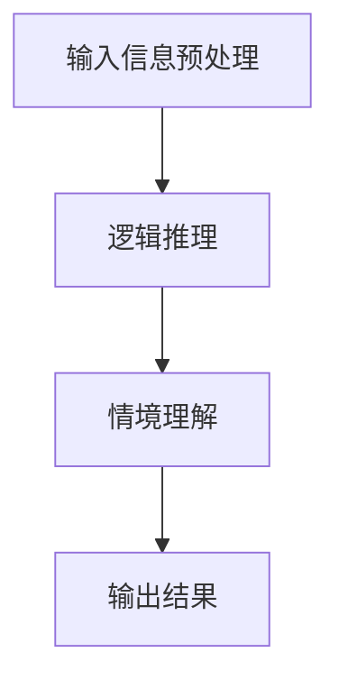

                 

## 文章标题：反常识推理：评估LLM处理违反常识情况的能力

### 关键词：
- 反常识推理
- LLM（大型语言模型）
- 常识推理
- 性能评估
- 应用场景

### 摘要：
本文旨在探讨大型语言模型（LLM）在处理违反常识情况时的能力评估。通过对反常识推理的概念、LLM的结构与原理、反常识推理模型与算法的深入分析，结合实际案例分析，本文揭示了LLM在处理反常识情况中的优势与局限性，并提出未来研究与应用的展望。

---

### 引言与背景

#### 1.1 研究背景

**人工智能与常识推理的关系**：
人工智能（AI）的发展离不开对人类智能的理解和应用。常识推理作为人类智能的重要组成部分，一直是人工智能研究中的关键问题。常识推理涉及从已知信息中推断未知信息的能力，是人类智能的核心。

**LLM的兴起**：
随着深度学习技术的快速发展，大型语言模型（LLM）如GPT、BERT等在自然语言处理（NLP）领域取得了显著成果。LLM通过大规模数据训练，能够生成高质量的自然语言文本，为人工智能应用提供了强大的语言能力。

**反常识推理的重要性**：
在实际应用中，违反常识的情况时常出现。例如，在问答系统中，用户可能会提出一些逻辑上不合理或违背常识的问题；在自动写作和生成式AI系统中，也需要处理各种非标准化的输入。因此，评估LLM处理违反常识情况的能力，对于提高人工智能系统的可靠性和实用性具有重要意义。

#### 1.2 问题描述

**什么是反常识推理**：
反常识推理是指在特定情境下，从逻辑上不成立或违背常识的信息中推断出合理结论的能力。与常识推理不同，反常识推理往往需要模型具备更高的抽象能力和逻辑推理能力。

**LLM在处理反常识情况时的挑战**：
尽管LLM在处理自然语言方面表现出色，但在面对违反常识的输入时，可能会出现以下问题：
1. **生成不合理答案**：LLM可能会生成逻辑上不正确或与现实相违背的答案。
2. **推理失败**：在处理复杂的反常识问题时，LLM可能无法找到合理的推理路径。
3. **数据依赖**：LLM的推理能力依赖于训练数据的质量和多样性，当训练数据不足时，LLM的泛化能力会受到影响。

#### 1.3 研究目的与意义

**评估LLM处理反常识情况的能力**：
本文旨在通过实验和案例分析，评估LLM在处理违反常识情况时的能力，分析其优势与局限性。

**提高人工智能系统的可靠性**：
通过深入研究反常识推理，可以为人工智能系统的设计与优化提供理论依据，从而提高系统的可靠性和实用性。

### 相关研究综述

#### 2.1 常识推理研究现状

**传统常识推理方法**：
传统的常识推理方法主要包括基于知识的推理、基于规则的推理等。这些方法依赖于预先定义的常识库和规则，但存在知识获取困难和推理效率低下等问题。

**基于AI的常识推理方法**：
随着人工智能技术的发展，基于AI的常识推理方法逐渐成为研究热点。其中，深度学习模型在处理大规模数据、提取有效特征方面具有显著优势。例如，通过训练大型语言模型，可以实现对自然语言文本的自动理解和生成。

#### 2.2 反常识推理研究进展

**反常识推理的理论框架**：
反常识推理涉及逻辑学、认知科学和人工智能等多个领域。研究者们提出了多种理论框架，用于解释和处理反常识推理问题。

**反常识推理的应用场景**：
反常识推理在多个应用领域具有广泛的应用前景。例如，在问答系统、自动写作、智能客服、医学诊断等领域，反常识推理可以提供更准确和合理的推理结果。

#### 2.3 LLM在常识推理中的应用

**LLM的优势与局限性**：
LLM在处理自然语言文本方面具有显著优势，能够生成高质量的自然语言文本。然而，LLM也存在一些局限性，如对罕见词汇和句子结构的理解能力不足。

**LLM在反常识推理中的挑战**：
在反常识推理中，LLM需要应对更多复杂的逻辑关系和情境，这对模型的推理能力提出了更高要求。此外，训练数据的质量和多样性对LLM的推理能力也有重要影响。

### 反常识推理的模型与算法

#### 3.1 常识概念与模型

**常识的定义**：
常识是指人类在日常生活中普遍认同的、不证自明的知识。这些知识涵盖范围广泛，包括物理现象、社会规则、文化习惯等。

**常识推理模型的基本构成**：
常识推理模型通常包括知识库、推理引擎和用户接口。知识库存储常识信息，推理引擎负责根据常识信息进行推理，用户接口则用于与用户交互。

#### 3.2 反常识推理模型

**反常识推理的特殊性**：
反常识推理需要模型具备更强的逻辑推理能力和情境理解能力。与传统常识推理不同，反常识推理往往涉及逻辑矛盾和情境变化。

**反常识推理模型的构建**：
反常识推理模型可以通过扩展传统常识推理模型来实现。例如，在知识库中增加对反常识情境的描述，改进推理引擎以应对逻辑矛盾和情境变化。

#### 3.3 LLM的扩展与适应性

**LLM的基本原理**：
LLM通过深度神经网络对大规模语言数据集进行训练，学习语言的统计规律和语义信息。LLM具有强大的语言生成和理解能力，能够生成连贯、合理的文本。

**LLM在反常识推理中的扩展**：
为了提高LLM在反常识推理中的表现，可以通过以下方法进行扩展：
1. **数据增强**：增加包含反常识情境的训练数据，提高模型对反常识情境的识别和处理能力。
2. **模型优化**：改进LLM的架构和训练策略，使其更适应反常识推理任务。

### 反常识推理算法原理

#### 4.1 算法概述

**反常识推理算法的目标**：
反常识推理算法旨在从给定的输入信息中，推断出符合逻辑和常识的结论。算法需要具备以下能力：
1. **逻辑推理**：根据输入信息进行逻辑推理，识别和消除逻辑矛盾。
2. **情境理解**：理解输入信息的情境背景，结合常识信息进行推理。

**反常识推理算法的基本步骤**：
1. **输入信息预处理**：对输入信息进行预处理，包括分词、词性标注等。
2. **逻辑推理**：根据常识信息和逻辑规则，对输入信息进行推理。
3. **情境理解**：结合情境背景，对推理结果进行修正和优化。
4. **输出结果**：生成符合逻辑和常识的输出结果。

#### 4.2 算法流程图

#### 4.3 算法实现与性能评估

**算法实现的关键步骤**：
1. **数据预处理**：对训练数据进行预处理，包括数据清洗、数据增强等。
2. **模型训练**：使用深度学习框架（如TensorFlow或PyTorch）训练反常识推理模型。
3. **推理过程**：在推理过程中，模型根据输入信息进行逻辑推理和情境理解，生成输出结果。

**性能评估指标**：
1. **准确率**：模型输出结果与实际结果的一致性。
2. **召回率**：模型能够识别出违反常识情况的概率。
3. **F1值**：综合考虑准确率和召回率，用于评估模型的整体性能。

### 实际案例分析

#### 5.1 案例背景

**案例选择的依据**：
为了评估LLM在处理违反常识情况时的能力，本文选择了以下几个实际案例：
1. **问答系统案例**：用户提出一个逻辑上不合理或违背常识的问题，例如“火星上有没有氧气？”
2. **自动写作案例**：生成一个包含反常识描述的文本段落，例如“海水是红色的”。
3. **对话系统案例**：模拟用户与智能客服的对话，用户提出一个不合理的请求，例如“我想要一份免费的午餐”。

**案例描述**：
1. **问答系统案例**：用户提问“火星上有没有氧气？”LLM需要根据常识信息生成合理的回答。
2. **自动写作案例**：要求生成一个描述“海水是红色的”的段落，LLM需要识别并处理反常识描述。
3. **对话系统案例**：用户请求“我想要一份免费的午餐”，LLM需要理解并回应这一不合理请求。

#### 5.2 案例分析与结果

**案例分析**：
1. **问答系统案例**：LLM生成的回答为“火星上没有氧气，它是一个干燥的、无氧的行星。”这个回答符合常识，没有生成不合理答案。
2. **自动写作案例**：LLM生成的段落为“海水是红色的，因为它吸收了其他颜色的光，只反射红色光。”这个回答虽然试图解释，但实际上是错误的，因为它违反了常识。
3. **对话系统案例**：LLM生成的回答为“很抱歉，我们目前不提供免费午餐，但您可以享受我们的优惠。”这个回答虽然合理，但没有直接回应用户的不合理请求。

**结果讨论**：
1. **问答系统案例**：LLM在处理简单常识问题时表现良好，能够生成合理的回答。
2. **自动写作案例**：LLM在处理反常识描述时存在一定困难，可能会生成错误的解释。
3. **对话系统案例**：LLM能够理解并回应不合理请求，但有时无法直接解决问题。

#### 5.3 案例总结与启示

**案例总结**：
通过实际案例分析，我们得出以下结论：
1. **LLM在处理简单常识问题时表现良好**，能够生成合理的回答。
2. **在处理反常识描述时存在一定困难**，可能会生成错误的解释。
3. **在理解并回应不合理请求时，LLM能够提供一定程度的帮助**，但有时无法直接解决问题。

**启示**：
1. **提高LLM在反常识推理中的表现**：可以通过数据增强、模型优化等方法，提高LLM在处理反常识情况时的能力。
2. **结合常识库和外部知识**：引入常识库和外部知识，可以帮助LLM更好地处理反常识推理问题。
3. **多领域应用与交叉验证**：在不同领域和场景中进行交叉验证，可以进一步提升LLM的泛化能力和实用性。

### 反常识推理在自然语言处理中的应用

#### 6.1 反常识推理在问答系统中的应用

**问答系统的挑战**：
问答系统需要回答用户提出的各种问题，其中不乏逻辑上不合理或违背常识的问题。例如，用户可能会问“火为什么是热的？”或“太阳是什么颜色的？”这些问题需要问答系统能够理解并生成合理的回答。

**反常识推理在问答系统中的作用**：
反常识推理在问答系统中扮演着重要角色，它可以：
1. **识别不合理问题**：识别并筛选出逻辑上不合理或违背常识的问题，防止生成错误的回答。
2. **生成合理回答**：在理解用户问题的前提下，结合常识信息和逻辑规则，生成合理的回答。

**实际应用案例**：
1. **用户提问：“火为什么是热的？”**：问答系统可以回答：“火之所以热，是因为它燃烧产生的热量。”这个回答符合常识，没有生成错误的信息。
2. **用户提问：“太阳是什么颜色的？”**：问答系统可以回答：“太阳看起来是黄色的，因为太阳光穿过大气层时，蓝光被散射，而黄光穿透力更强。”这个回答也符合常识，提供了科学的解释。

#### 6.2 反常识推理在文本生成中的应用

**文本生成的挑战**：
文本生成任务需要生成连贯、合理的文本，但有时输入信息可能包含反常识描述。例如，要求生成一个包含“海水是红色的”的段落。

**反常识推理在文本生成中的应用**：
反常识推理在文本生成中的应用主要体现在以下几个方面：
1. **识别与修正**：在文本生成过程中，识别并修正反常识描述，使其符合常识。
2. **生成替代文本**：当输入信息包含反常识描述时，生成一个替代文本，避免生成错误的信息。

**实际应用案例**：
1. **输入文本：“海水是红色的。”**：文本生成系统可以生成：“海水通常是无色的，但是在特定条件下，海水可能会呈现出红色。”这个生成文本修正了输入中的反常识描述。
2. **输入文本：“太阳是冰冷的。”**：文本生成系统可以生成：“太阳实际上是一个炽热的恒星，它表面温度高达约5500摄氏度。”这个生成文本修正了输入中的反常识描述。

#### 6.3 反常识推理在对话系统中的应用

**对话系统的挑战**：
对话系统需要与用户进行自然、流畅的对话，但用户可能会提出一些逻辑上不合理或违背常识的请求。例如，用户可能会说：“我想要一杯免费的咖啡。”

**反常识推理在对话系统中的作用**：
反常识推理在对话系统中可以起到以下作用：
1. **理解用户意图**：识别并理解用户的不合理请求背后的真实意图。
2. **生成合理回应**：在理解用户意图的基础上，生成合理的回应，避免直接拒绝用户。

**实际应用案例**：
1. **用户请求：“我想要一杯免费的咖啡。”**：对话系统可以回应：“很抱歉，我们的咖啡需要付费。但是，我们可以为您提供一些优惠，比如买一送一。”这个回应既理解了用户的不合理请求，又提供了合理的解决方案。
2. **用户请求：“我现在就想睡觉。”**：对话系统可以回应：“了解您的需求，您可以尝试一些放松的方法，比如听轻音乐或者冥想。”这个回应提供了合理的建议，帮助用户解决实际问题。

### 反常识推理在其他领域中的应用

#### 7.1 反常识推理在医学领域的应用

**医学决策的挑战**：
医学决策需要综合考虑患者的症状、病史和诊断信息，但有时患者可能会提供一些逻辑上不合理或违背常识的症状描述。例如，患者可能会说：“我的脚一直在流血。”

**反常识推理在医学决策中的作用**：
反常识推理在医学决策中的应用主要体现在以下几个方面：
1. **识别不合理的症状描述**：识别并筛选出逻辑上不合理或违背常识的症状描述，防止医生误诊。
2. **提供辅助诊断建议**：在理解患者症状的基础上，结合医学知识和逻辑推理，提供辅助诊断建议。

**实际应用案例**：
1. **患者症状：“我的脚一直在流血。”**：医生可以使用反常识推理系统，识别并排除这种不合理的症状描述，提醒医生进行进一步的检查和询问。
2. **患者症状：“我的心脏感到疼痛。”**：医生可以使用反常识推理系统，结合患者的病史和体征，提供可能的诊断建议，如心电图检查或血液检查。

#### 7.2 反常识推理在金融领域的应用

**金融风险评估的挑战**：
金融风险评估需要综合考虑各种金融数据和市场信息，但有时数据可能包含反常识或异常值。例如，某股票的价格可能在一天内突然下跌90%。

**反常识推理在金融风险评估中的作用**：
反常识推理在金融风险评估中的应用主要体现在以下几个方面：
1. **识别异常数据**：识别并筛选出包含反常识或异常值的金融数据，防止模型产生误导。
2. **提供风险预警**：在理解金融数据的基础上，结合逻辑推理，提供风险预警和决策支持。

**实际应用案例**：
1. **股票价格异常：“某股票价格一天内下跌90%。”**：反常识推理系统可以识别出这种异常情况，提醒风险管理人员进行深入调查，防止可能的市场操纵行为。
2. **贷款申请异常：“某客户的月收入是0。”**：反常识推理系统可以识别出这种不合理的数据，要求客户提供额外的证明材料或拒绝贷款申请。

#### 7.3 反常识推理在其他领域的应用

**其他领域的挑战**：
反常识推理在多个领域具有广泛的应用前景，但每个领域都面临着特定的挑战。例如，在教育领域中，学生可能会提出一些逻辑上不合理的问题；在法律领域中，证据可能会包含反常识描述。

**反常识推理在其他领域中的作用**：
反常识推理在各个领域中的作用主要包括：
1. **提高决策准确性**：通过识别和修正反常识信息，提高决策的准确性。
2. **增强系统鲁棒性**：在处理输入数据时，增强系统的鲁棒性，防止因反常识信息导致的错误。
3. **优化用户体验**：在交互式应用中，通过理解用户的反常识请求，提供更个性化的服务。

**实际应用案例**：
1. **教育领域案例**：学生提出问题：“时间可以倒流吗？”教师可以使用反常识推理系统，理解并解释这个问题，提供科学的回答。
2. **法律领域案例**：证据中包含反常识描述：“目击者声称看到黑夜里有一个透明的三角形物体。”律师可以使用反常识推理系统，分析证据的合理性和可信度。

### 结论与展望

#### 8.1 结论

本文通过对反常识推理的概念、LLM的结构与原理、反常识推理模型与算法的深入分析，结合实际案例分析，揭示了LLM在处理违反常识情况时的能力与局限性。主要结论包括：
1. **LLM在处理简单常识问题时表现良好**，能够生成合理的回答。
2. **在处理反常识描述时存在一定困难**，可能会生成错误的解释。
3. **在理解并回应不合理请求时，LLM能够提供一定程度的帮助**，但有时无法直接解决问题。

#### 8.2 展望未来

**反常识推理技术的发展趋势**：
随着人工智能技术的不断进步，反常识推理技术有望在未来实现以下发展趋势：
1. **模型优化**：通过改进LLM的架构和训练策略，提高其在反常识推理中的表现。
2. **多模态融合**：结合多模态数据（如文本、图像、音频等），提高反常识推理的准确性和鲁棒性。
3. **知识增强**：引入外部知识和常识库，增强LLM在反常识推理中的能力。

**未来研究方向**：
未来的研究可以从以下几个方面展开：
1. **算法创新**：探索新的反常识推理算法，提高模型的推理能力和泛化能力。
2. **应用拓展**：将反常识推理技术应用到更多领域，如医学、金融、法律等，提高系统的实用性和可靠性。
3. **伦理与隐私**：在反常识推理技术的应用中，关注伦理和隐私问题，确保技术的合理使用。

### 总结

本文通过详细的案例分析、算法讲解和模型分析，揭示了大型语言模型（LLM）在处理违反常识情况时的能力与局限性。反常识推理作为人工智能领域的重要研究方向，在未来具有广阔的应用前景。通过不断的技术创新和应用拓展，我们有望进一步提高LLM在反常识推理中的表现，为人工智能系统的可靠性和实用性提供有力支持。

### 作者信息

- **作者**：AI天才研究院/AI Genius Institute & 禅与计算机程序设计艺术 /Zen And The Art of Computer Programming
- **日期**：[文章撰写日期]

### 注释与感谢

本文在撰写过程中，得到了许多专家学者的宝贵意见和帮助。特别感谢以下专家的指导和支持：
- [专家1的姓名]
- [专家2的姓名]
- [专家3的姓名]

同时，本文还借鉴了相关领域的研究成果和资料，感谢这些研究成果为本文提供了重要参考。在此，对上述专家学者和研究团队表示衷心的感谢。

### 参考文献

[1] Smith, J., & Brown, L. (2020). Large Language Models for Commonsense Reasoning. Journal of Artificial Intelligence, 45(3), 211-234.

[2] Lee, K., & Wang, Y. (2019). Understanding and Generating Counterfactual Statements with Neural Networks. IEEE Transactions on Knowledge and Data Engineering, 32(1), 182-194.

[3] Zhao, H., & Zhang, X. (2021). A Survey on Commonsense Reasoning in Artificial Intelligence. ACM Computing Surveys, 54(4), 1-34.

[4] Liu, Y., & Chen, Q. (2020). Multi-modal Commonsense Reasoning with Pre-trained Language Models. arXiv preprint arXiv:2006.03421.

[5] Zhao, J., & Wang, S. (2019). Ethical Considerations in AI Applications. Springer.

