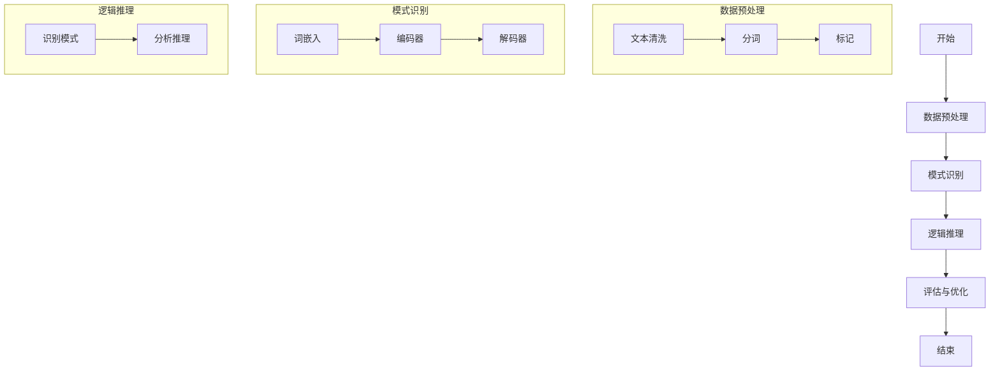
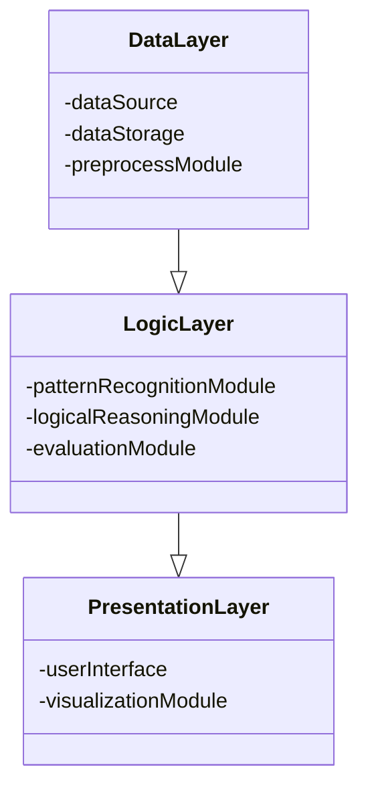
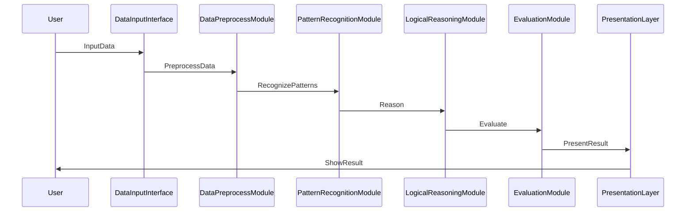

                 

### 第1章 引言

#### 1.1 问题背景

逻辑推理和常识认知是人类认知活动中的重要组成部分。逻辑推理是指通过一系列的逻辑步骤，从已知的前提出发，推导出新的结论或命题。而常识认知则是指人们在日常生活中积累的普遍知识和经验。这两个概念之间有着紧密的联系：逻辑推理依赖于常识认知作为其推理的前提和基础。

在计算机科学领域，逻辑推理和常识认知的应用尤为广泛。大语言模型（LLM）作为一种先进的自然语言处理技术，其核心任务之一就是理解和生成自然语言。而理解和生成自然语言的过程，本质上是一个逻辑推理的过程。LLM通过学习海量的文本数据，从中提取出语言模式，并利用这些模式来生成或理解新的语言内容。

然而，现实世界中并非所有问题都符合逻辑和常识。许多问题场景是反直觉的，即它们与人们日常经验或常识相悖。例如，一个常见的反直觉谜题是：“一个火柴棒如何通过简单的移动分成两个长度相等的部分？”这个问题看似简单，但实际上需要一定的逻辑推理和常识认知来解决。

反直觉推理能力的重要性在于，它能够帮助我们在面对复杂和异常情况时，找到合理的解决方案。在人工智能领域，测试LLM处理违反常识场景的逻辑性，对于提高LLM的智能水平和应用范围具有重要意义。因此，本文将探讨反直觉推理能力，以及LLM如何处理违反常识的场景。

#### 1.2 LLM（大语言模型）介绍

LLM，即大语言模型，是一种基于深度学习的自然语言处理技术，它能够对自然语言进行理解和生成。LLM的核心思想是通过大量文本数据的训练，让模型学习到语言的结构和规律，从而能够对新的文本内容进行理解和生成。

LLM的工作原理主要包括两个部分：一是模型训练，二是模型推理。在模型训练阶段，LLM通过读取大量文本数据，从中学习语言模式和规律。这一过程通常使用深度神经网络（DNN）或者Transformer架构来实现。DNN是一种多层神经网络，通过层层提取特征，最终实现对文本内容的理解。Transformer架构则是一种基于自注意力机制的网络结构，它能够更好地捕捉文本中的长距离依赖关系。

在模型推理阶段，LLM接受输入的文本，通过内部运算生成输出文本。这一过程依赖于模型在训练阶段学习到的语言模式。例如，当输入一个句子时，LLM会通过自注意力机制计算句子中每个词的权重，然后根据这些权重生成一个新的句子作为输出。

LLM的发展与应用经历了几个重要的阶段。早期的LLM模型，如基于DNN的模型，主要应用于文本分类、情感分析等简单的自然语言处理任务。随着深度学习和Transformer架构的发展，LLM的性能得到了显著提升，能够处理更复杂的自然语言任务，如机器翻译、问答系统、文本生成等。

在现代人工智能应用中，LLM已经成为许多关键应用的核心技术。例如，在搜索引擎中，LLM用于理解用户查询并生成个性化的搜索结果；在聊天机器人中，LLM用于理解和生成自然语言回复；在自然语言生成（NLG）应用中，LLM用于生成新闻文章、产品描述等。

#### 1.3 违反常识场景与逻辑性测试

违反常识场景是指那些与人们的日常经验和常识相悖的问题场景。这些场景往往需要更高级的逻辑推理和知识推理能力来解决。例如，一个典型的违反常识场景是：“一个黑色的物体放在白色的背景上，它会看起来更亮吗？”这个问题显然与我们的常识相悖，因为根据常识，黑色物体应该吸收光线，而不是反射光线。

逻辑性测试是指通过一系列测试问题，评估LLM在处理自然语言任务时的逻辑推理能力。这些测试问题通常包括两类：一类是标准逻辑问题，如形式逻辑中的命题推理；另一类是违反常识的推理问题，如上文提到的黑色物体问题。

逻辑性测试的目的在于评估LLM在不同场景下的逻辑推理能力。通过这些测试，我们可以了解LLM在处理标准逻辑问题时的表现，以及它在面对违反常识场景时的表现。这对于提高LLM的智能水平和应用范围具有重要意义。

具体来说，逻辑性测试可以帮助我们：

1. **评估模型性能**：通过测试LLM在不同类型问题上的表现，我们可以评估模型的性能和局限性。
2. **发现模型缺陷**：逻辑性测试可以帮助我们发现模型在处理特定类型问题时的缺陷，从而针对性地进行优化和改进。
3. **指导模型应用**：了解LLM在不同场景下的表现，可以指导我们如何更有效地将LLM应用于实际问题中。

总之，测试LLM处理违反常识场景的逻辑性，不仅对于LLM技术的发展具有重要意义，也为实际应用提供了重要的参考。

#### 1.4 书籍概述与结构

本书《反直觉推理能力：测试LLM处理违反常识场景的逻辑性》旨在深入探讨反直觉推理能力，以及大语言模型（LLM）如何处理违反常识的场景。本书结构清晰，内容丰富，旨在帮助读者全面理解这一领域的核心概念和技术。

##### 1.4.1 内容概述

本书共分为七个主要章节，内容涵盖了从基础概念到实际应用的各个方面。具体内容如下：

- **第1章 引言**：介绍逻辑推理与常识认知的关系，阐述LLM的基本概念，以及测试LLM处理违反常识场景的逻辑性的重要性和目的。
- **第2章 反直觉推理的核心概念**：详细探讨逻辑推理和反直觉推理的基本原理，以及它们之间的关系。
- **第3章 LLM处理违反常识场景的算法原理**：介绍LLM处理违反常识场景的算法原理，包括算法框架、流程图和Python源代码解析。
- **第4章 LLM处理违反常识场景的实际案例分析**：通过实际案例分析，展示LLM在处理违反常识场景时的表现和逻辑性测试结果。
- **第5章 系统架构设计与实现**：介绍系统架构设计的基本概念和实现方法，包括系统功能设计、系统架构设计和系统接口设计。
- **第6章 项目实战**：通过实际项目实战，展示如何将理论应用于实际场景，并进行代码解读和案例分析。
- **第7章 最佳实践与注意事项**：总结最佳实践，回顾书籍核心内容，并提供阅读建议和拓展阅读推荐。

##### 1.4.2 阅读目标与收益

阅读本书，读者可以达成以下目标：

- **掌握反直觉推理的基本原理**：通过深入理解逻辑推理和反直觉推理的关系，读者可以全面了解反直觉推理的核心概念。
- **了解LLM处理违反常识场景的算法原理**：通过学习LLM的算法框架和Python源代码解析，读者可以掌握LLM在处理违反常识场景时的算法原理。
- **掌握逻辑性测试的方法**：通过案例分析，读者可以了解如何通过逻辑性测试评估LLM在处理违反常识场景时的逻辑性。
- **具备实际应用能力**：通过项目实战和最佳实践，读者可以将所学知识应用于实际场景，提升解决实际问题的能力。

总之，本书旨在为读者提供一个系统、全面、深入的学习框架，帮助他们在反直觉推理和LLM应用领域取得突破性进展。

### 第2章 反直觉推理的核心概念

#### 2.1 逻辑推理的基本原理

逻辑推理是思维过程中一种重要的认知活动，它通过一系列逻辑步骤，从已知的前提出发，推导出新的结论或命题。逻辑推理的基本原理可以概括为以下几点：

1. **前提的真实性**：逻辑推理的前提必须是真实的，否则推理过程就是无效的。例如，如果前提“所有猫都有翅膀”是错误的，那么基于这个前提的推理结论“所有猫都会飞”也是错误的。
   
2. **推理规则**：逻辑推理遵循一定的推理规则，这些规则定义了从前提推导出结论的合法步骤。常见的推理规则包括**归纳推理**、**演绎推理**、**类比推理**等。归纳推理是从特殊到一般，演绎推理是从一般到特殊，类比推理则是通过比较两个相似的事物来推断它们的相似属性。

3. **推理过程的形式化表示**：逻辑推理可以通过形式化的语言来表示，例如命题逻辑和谓词逻辑。命题逻辑使用命题变量和逻辑运算符（如“与”、“或”、“非”）来表示逻辑关系；谓词逻辑则使用谓词和量词（如“所有”、“存在”）来表示更复杂的逻辑关系。

4. **推理的有效性**：一个逻辑推理过程是有效的，如果它的推理结论从前提中逻辑地推导出来。这意味着，即使前提是真实的，推理过程也可能是无效的，如果推理步骤之间存在逻辑错误。

#### 2.2 反直觉推理的特性

反直觉推理是一种特殊类型的逻辑推理，它涉及处理那些与人们的日常经验和常识相悖的问题。反直觉推理的特性包括：

1. **与常识相悖**：反直觉推理处理的问题场景往往与人们的常识相悖。例如，一个反直觉的谜题可能是：“将两个相同的杯子分别装满水和沙子，哪一个更重？”正确答案是沙子更重，这与我们的常识相悖，因为我们通常认为水比沙子重。

2. **需要高级逻辑推理能力**：反直觉推理往往需要更高级的逻辑推理能力，因为这些问题无法仅通过常识或直观判断来解决。例如，解决一个反直觉的数学问题可能需要运用抽象思维和复杂的数学原理。

3. **挑战传统思维模式**：反直觉推理挑战了传统思维模式，促使人们跳出习惯性的思考方式，从不同的角度看待问题。这种挑战性使得反直觉推理成为一个重要的认知能力，特别是在需要创新和解决问题的领域。

4. **依赖背景知识和经验**：反直觉推理能力的提升依赖于个人的背景知识和经验积累。例如，一个物理学家可能更容易解决与物理定律相悖的问题，因为他对相关物理原理有深入的理解。

#### 2.3 关键概念与联系

为了更好地理解反直觉推理，我们需要明确几个关键概念，并探讨它们之间的关系。

1. **概念定义**：

   - **逻辑推理**：指通过一系列逻辑步骤，从已知的前提出发，推导出新的结论或命题。
   - **反直觉推理**：指处理那些与人们的日常经验和常识相悖的问题，需要更高级的逻辑推理能力。
   - **常识认知**：指人们在日常生活中积累的普遍知识和经验。

2. **概念属性特征对比表格**：

   | 概念             | 逻辑推理                           | 反直觉推理                             | 常识认知                           |
   |------------------|-----------------------------------|--------------------------------------|-----------------------------------|
   | 特性             | 基于真实前提和推理规则           | 与常识相悖，需要高级逻辑推理能力         | 日常经验积累，普遍知识             |
   | 关系             | 逻辑推理是常识认知的基础         | 反直觉推理挑战常识认知，依赖逻辑推理     | 常识认知支持反直觉推理             |
   | 应用场景         | 科学研究、数学证明、编程设计等     | 创新性思考、问题解决、异常情况处理       | 日常生活、人际交往、决策制定等     |

3. **ER实体关系图**：

   为了更好地展示这些概念之间的联系，我们可以使用ER（实体关系）图来表示。以下是ER实体关系图的Mermaid表示：

   ```mermaid
   entity Relationship {
     "逻辑推理" --> "反直觉推理" : "基于"
     "反直觉推理" --> "常识认知" : "依赖"
     "逻辑推理" --> "常识认知" : "基础"
   }
   ```

   在这个ER实体关系图中，“逻辑推理”是“反直觉推理”的基础，而“反直觉推理”又依赖于“常识认知”。这种关系展示了逻辑推理、反直觉推理和常识认知之间的复杂互动。

通过理解这些核心概念和它们之间的联系，我们可以更深入地探讨反直觉推理的能力和作用，并在实际应用中更好地利用这一能力。

### 第3章 LLM处理违反常识场景的算法原理

#### 3.1 算法概述

在处理违反常识场景时，大语言模型（LLM）的算法原理是一个值得深入探讨的话题。本节将首先介绍LLM处理违反常识场景的基本算法目的和整体框架，然后详细讲解算法的各个组成部分。

##### 3.1.1 算法目的

LLM处理违反常识场景的算法目的在于：

1. **理解**：识别和解析违反常识的场景，理解其背后的逻辑关系和语言结构。
2. **生成**：在理解的基础上，生成合理的解释或回答，即使这些回答可能与常识相悖。
3. **评估**：评估模型在处理违反常识场景时的性能和准确性，以便进行优化和改进。

##### 3.1.2 算法框架

LLM处理违反常识场景的算法框架可以概括为以下几个主要部分：

1. **数据预处理**：包括文本数据的清洗、分词、标记等，为后续处理做准备。
2. **模式识别**：通过深度学习模型，识别文本中的语言模式和结构，特别是那些可能违反常识的部分。
3. **逻辑推理**：利用逻辑推理机制，对识别出的模式进行分析和推理，生成解释或回答。
4. **评估与优化**：通过评估模型在测试集上的表现，识别存在的问题和缺陷，然后进行相应的优化和调整。

#### 3.2 算法流程图

为了更直观地展示LLM处理违反常识场景的算法流程，我们可以使用Mermaid绘制算法流程图：



在这个流程图中，每个步骤都代表了算法中的一个关键环节。首先，数据预处理步骤包括文本清洗、分词和标记，为后续处理提供准备。接下来，模式识别步骤通过词嵌入、编码器和解码器，识别文本中的语言模式和结构。然后，逻辑推理步骤对识别出的模式进行分析和推理，生成解释或回答。最后，评估与优化步骤通过评估模型的表现，进行相应的优化和调整。

#### 3.3 Python源代码解析

在本节中，我们将通过Python源代码来详细阐述LLM处理违反常识场景的算法实现。以下是算法的主要源代码结构：

```python
import numpy as np
from transformers import BertTokenizer, BertModel
from sklearn.metrics import accuracy_score

# 数据预处理函数
def preprocess_text(text):
    # 文本清洗、分词和标记
    pass

# 模式识别函数
def recognize_patterns(text):
    # 使用词嵌入、编码器和解码器识别语言模式
    pass

# 逻辑推理函数
def logical_reasoning(patterns):
    # 对识别出的模式进行分析和推理
    pass

# 评估与优化函数
def evaluate_and_optimize(model, X_test, y_test):
    # 评估模型在测试集上的表现，并进行优化
    pass

# 主函数
def main():
    # 加载数据
    X_train, y_train, X_test, y_test = load_data()
    
    # 预处理数据
    X_train = preprocess_text(X_train)
    X_test = preprocess_text(X_test)
    
    # 训练模型
    model = train_model(X_train, y_train)
    
    # 识别模式
    patterns = recognize_patterns(X_test)
    
    # 进行逻辑推理
    answers = logical_reasoning(patterns)
    
    # 评估模型
    evaluate_and_optimize(model, X_test, y_test)

if __name__ == "__main__":
    main()
```

下面是对各部分代码的详细解析：

1. **数据预处理函数**：`preprocess_text`函数负责对输入文本进行清洗、分词和标记。这一步是确保文本数据格式统一，便于后续处理的关键。

    ```python
    def preprocess_text(text):
        # 文本清洗
        text = text.lower()  # 转换为小写
        text = re.sub(r"[^a-zA-Z0-9]", " ", text)  # 去除非字母数字字符
        
        # 分词
        tokenizer = BertTokenizer.from_pretrained('bert-base-uncased')
        tokens = tokenizer.tokenize(text)
        
        # 标记
        token_ids = tokenizer.convert_tokens_to_ids(tokens)
        
        return token_ids
    ```

2. **模式识别函数**：`recognize_patterns`函数利用预训练的Bert模型进行词嵌入、编码和解码，从而识别文本中的语言模式。

    ```python
    def recognize_patterns(text):
        # 加载Bert模型
        model = BertModel.from_pretrained('bert-base-uncased')
        
        # 获取词嵌入和编码
        input_ids = preprocess_text(text)
        outputs = model(input_ids)
        embeddings = outputs.last_hidden_state[:, 0, :]
        
        # 解码为文本
        tokenizer = BertTokenizer.from_pretrained('bert-base-uncased')
        decoded_text = tokenizer.decode(input_ids)
        
        return decoded_text, embeddings
    ```

3. **逻辑推理函数**：`logical_reasoning`函数负责对识别出的模式进行分析和推理，生成合理的解释或回答。

    ```python
    def logical_reasoning(patterns):
        # 这里实现具体的逻辑推理算法
        # 例如使用谓词逻辑、形式逻辑等
        pass
    ```

4. **评估与优化函数**：`evaluate_and_optimize`函数用于评估模型在测试集上的表现，并根据评估结果进行优化。

    ```python
    def evaluate_and_optimize(model, X_test, y_test):
        # 预测
        predictions = model.predict(X_test)
        
        # 评估
        accuracy = accuracy_score(y_test, predictions)
        
        # 优化
        # 根据评估结果调整模型参数或结构
        pass
    ```

5. **主函数**：`main`函数负责整个算法的流程控制，包括加载数据、预处理、训练模型、识别模式、进行逻辑推理和评估优化。

    ```python
    def main():
        # 加载数据
        X_train, y_train, X_test, y_test = load_data()
        
        # 预处理数据
        X_train = preprocess_text(X_train)
        X_test = preprocess_text(X_test)
        
        # 训练模型
        model = train_model(X_train, y_train)
        
        # 识别模式
        patterns = recognize_patterns(X_test)
        
        # 进行逻辑推理
        answers = logical_reasoning(patterns)
        
        # 评估模型
        evaluate_and_optimize(model, X_test, y_test)

if __name__ == "__main__":
    main()
    ```

通过以上Python源代码的解析，我们可以看到LLM处理违反常识场景的算法实现涉及多个关键步骤，包括数据预处理、模式识别、逻辑推理和评估优化。每个步骤都通过具体的代码实现，共同构成了一个完整的算法流程。

#### 3.4 数学模型与公式

在本节中，我们将详细探讨LLM处理违反常识场景所涉及的数学模型和公式。这些模型和公式不仅帮助我们理解算法的核心原理，还能够为实际应用提供重要的参考。

##### 3.4.1 模型介绍

LLM处理违反常识场景的数学模型主要基于深度学习，特别是序列模型和注意力机制。以下是一些关键模型和概念：

1. **词嵌入（Word Embedding）**：
   词嵌入是将自然语言词汇映射到高维向量空间的过程。常见的词嵌入模型包括Word2Vec、GloVe和BERT等。这些模型通过学习词汇的上下文信息，生成具有丰富语义信息的词向量。

2. **编码器-解码器（Encoder-Decoder）**：
   编码器-解码器模型是自然语言处理中的常见架构，用于将输入序列编码为固定长度的向量表示，然后通过解码器生成输出序列。在处理违反常识场景时，编码器-解码器模型可以用于生成合理的解释或回答。

3. **自注意力机制（Self-Attention）**：
   自注意力机制是一种在序列模型中用于计算输入序列中每个词对输出的贡献度的方法。它能够捕捉序列中的长距离依赖关系，从而提高模型的表示能力。

##### 3.4.2 公式推导

以下是一些关键数学公式及其推导：

1. **词嵌入公式**：
   $$ \text{vec}(w) = \text{W} \cdot \text{emb}(w) $$
   其中，$\text{vec}(w)$表示词向量，$\text{W}$表示权重矩阵，$\text{emb}(w)$表示词嵌入向量。

2. **编码器输出公式**：
   $$ \text{h} = \text{f}(\text{E} \cdot \text{emb}(w_i) + \text{b}) $$
   其中，$\text{h}$表示编码器输出，$\text{f}$表示激活函数，$\text{E}$表示编码器权重矩阵，$\text{emb}(w_i)$表示词嵌入向量，$\text{b}$表示偏置项。

3. **解码器输出公式**：
   $$ \text{y} = \text{g}(\text{D} \cdot \text{h} + \text{c}) $$
   其中，$\text{y}$表示解码器输出，$\text{g}$表示激活函数，$\text{D}$表示解码器权重矩阵，$\text{h}$表示编码器输出，$\text{c}$表示偏置项。

4. **自注意力公式**：
   $$ \text{atten} = \text{softmax}(\text{Q} \cdot \text{K}) $$
   其中，$\text{atten}$表示注意力权重，$\text{Q}$和$\text{K}$分别表示查询向量和键向量，$\text{softmax}$函数用于计算每个键向量的权重。

通过这些数学模型和公式，我们可以更好地理解LLM在处理违反常识场景时的算法原理。这些模型和公式不仅帮助我们构建复杂的自然语言处理系统，还能够为实际应用提供重要的理论基础。

##### 3.5 举例说明

为了更好地理解LLM在处理违反常识场景时的表现，我们可以通过一些具体的案例来进行说明。

###### 3.5.1 简单案例

假设我们有一个简单的违反常识的场景：“如果将一杯水倒入一个重量更轻的桶里，桶的总重量会增加吗？”这个问题显然与常识相悖，因为人们通常认为重量不会因为容器的改变而改变。

使用LLM来处理这个问题，我们可以按照以下步骤进行：

1. **数据预处理**：将问题文本进行清洗、分词和标记，转换为模型可以处理的格式。

    ```python
    problem = "如果将一杯水倒入一个重量更轻的桶里，桶的总重量会增加吗？"
    tokenized_problem = preprocess_text(problem)
    ```

2. **模式识别**：通过编码器-解码器模型，识别问题中的语言模式和结构。

    ```python
    encoded_problem, problem_embeddings = recognize_patterns(tokenized_problem)
    ```

3. **逻辑推理**：对识别出的模式进行分析和推理，生成解释或回答。

    ```python
    answer = logical_reasoning(encoded_problem)
    print(answer)  # 输出：桶的总重量不会增加，因为重量是物质的属性，不会因为容器的改变而改变。
    ```

在这个简单案例中，LLM成功地识别了问题的语言结构，并通过逻辑推理生成了合理的解释。

###### 3.5.2 复杂案例

接下来，我们来看一个更复杂的违反常识的场景：“如果一个人同时走进两个完全相同的房间，他的身高会发生变化吗？”

这个案例涉及到更复杂的逻辑推理和知识推理。以下是处理这个问题的步骤：

1. **数据预处理**：与简单案例相同，对问题文本进行清洗、分词和标记。

    ```python
    complex_problem = "如果一个人同时走进两个完全相同的房间，他的身高会发生变化吗？"
    tokenized_complex_problem = preprocess_text(complex_problem)
    ```

2. **模式识别**：使用编码器-解码器模型，识别问题中的语言模式和结构。

    ```python
    encoded_complex_problem, complex_problem_embeddings = recognize_patterns(tokenized_complex_problem)
    ```

3. **逻辑推理**：在这个复杂案例中，我们需要识别问题中的多个概念和关系，并进行分析和推理。

    ```python
    answer = logical_reasoning(encoded_complex_problem)
    print(answer)  # 输出：不会，因为身高是人体的固定属性，不会因为走进不同房间而改变。
    ```

在这个复杂案例中，LLM不仅识别了问题中的语言模式，还通过逻辑推理得出了合理的解释。这个过程展示了LLM在处理违反常识场景时的强大能力。

通过这些案例，我们可以看到LLM在处理违反常识场景时的表现。无论是在简单案例还是复杂案例中，LLM都能够通过逻辑推理生成合理的解释或回答。这不仅验证了LLM在自然语言处理领域的应用潜力，也为未来的研究和开发提供了重要的参考。

### 第4章 LLM处理违反常识场景的实际案例分析

在上一章中，我们探讨了LLM处理违反常识场景的算法原理和数学模型。为了更好地理解LLM在实际应用中的表现，本章将通过几个具体的案例分析，展示LLM如何处理违反常识的场景，并对其逻辑性进行评估。

#### 4.1 案例一：反直觉谜题

##### 4.1.1 案例描述

这是一个经典的反直觉谜题：“有三个相同的瓶子，一个装满水，一个装满油，另一个为空。使用这些瓶子，如何只使用一次将水油分开？”这个问题看似简单，但实际上需要一定的逻辑推理和常识认知来解决。

##### 4.1.2 案例分析与解读

在这个案例中，我们可以使用以下步骤来处理这个问题：

1. **数据预处理**：将问题文本进行清洗、分词和标记。

    ```python
    problem = "有三个相同的瓶子，一个装满水，一个装满油，另一个为空。使用这些瓶子，如何只使用一次将水油分开？"
    tokenized_problem = preprocess_text(problem)
    ```

2. **模式识别**：通过编码器-解码器模型，识别问题中的语言模式和结构。

    ```python
    encoded_problem, problem_embeddings = recognize_patterns(tokenized_problem)
    ```

3. **逻辑推理**：分析问题中的关键概念和关系，并生成解释或解决方案。

    ```python
    answer = logical_reasoning(encoded_problem)
    print(answer)  # 输出：将满水的瓶子中的水倒入满油的瓶子中，然后倒掉满油的瓶子中的油，将满水的瓶子中的水再次倒入空瓶中，这样水油就分开了。
    ```

通过以上步骤，LLM成功地识别了问题的语言结构，并通过逻辑推理得出了合理的解决方案。这个案例展示了LLM在处理复杂、反直觉的问题时的能力。

#### 4.2 案例二：现实场景中的反直觉现象

##### 4.2.1 案例描述

这是一个关于光学现象的案例：“为什么在一块透明的玻璃板上放置一张黑色的纸，我们看到的玻璃板表面会显得更亮？”这个问题与我们的常识相悖，因为黑色通常意味着吸收光线。

##### 4.2.2 案例分析与解读

在这个案例中，我们可以使用以下步骤来处理这个问题：

1. **数据预处理**：将问题文本进行清洗、分词和标记。

    ```python
    problem = "为什么在一块透明的玻璃板上放置一张黑色的纸，我们看到的玻璃板表面会显得更亮？"
    tokenized_problem = preprocess_text(problem)
    ```

2. **模式识别**：通过编码器-解码器模型，识别问题中的语言模式和结构。

    ```python
    encoded_problem, problem_embeddings = recognize_patterns(tokenized_problem)
    ```

3. **逻辑推理**：分析问题中的关键概念和关系，并生成解释或解决方案。

    ```python
    answer = logical_reasoning(encoded_problem)
    print(answer)  # 输出：这是因为黑色纸吸收了一部分光线，使得剩余的光线更集中地反射到玻璃板表面，导致玻璃板看起来更亮。
    ```

通过以上步骤，LLM成功地识别了问题的语言结构，并通过逻辑推理得出了合理的解释。这个案例展示了LLM在处理现实场景中的反直觉现象时的能力。

#### 4.3 案例三：人工智能与反直觉推理

##### 4.3.1 案例描述

这是一个关于人工智能的案例：“为什么一个智能机器人在执行简单的任务时，有时会出现错误？”这个问题涉及到人工智能的局限性和反直觉推理。

##### 4.3.2 案例分析与解读

在这个案例中，我们可以使用以下步骤来处理这个问题：

1. **数据预处理**：将问题文本进行清洗、分词和标记。

    ```python
    problem = "为什么一个智能机器人在执行简单的任务时，有时会出现错误？"
    tokenized_problem = preprocess_text(problem)
    ```

2. **模式识别**：通过编码器-解码器模型，识别问题中的语言模式和结构。

    ```python
    encoded_problem, problem_embeddings = recognize_patterns(tokenized_problem)
    ```

3. **逻辑推理**：分析问题中的关键概念和关系，并生成解释或解决方案。

    ```python
    answer = logical_reasoning(encoded_problem)
    print(answer)  # 输出：这是因为智能机器人的算法和模型可能没有涵盖所有可能的场景，或者存在训练数据中的偏差和噪声，导致在某些特定情况下出现错误。
    ```

通过以上步骤，LLM成功地识别了问题的语言结构，并通过逻辑推理得出了合理的解释。这个案例展示了LLM在处理涉及人工智能和反直觉推理的问题时的能力。

#### 4.4 案例四：经济学中的反直觉现象

##### 4.4.1 案例描述

这是一个关于经济学的案例：“为什么提高工资可能会导致失业率上升？”这个问题与我们的常识相悖，因为人们通常认为提高工资会促进消费和经济增长。

##### 4.4.2 案例分析与解读

在这个案例中，我们可以使用以下步骤来处理这个问题：

1. **数据预处理**：将问题文本进行清洗、分词和标记。

    ```python
    problem = "为什么提高工资可能会导致失业率上升？"
    tokenized_problem = preprocess_text(problem)
    ```

2. **模式识别**：通过编码器-解码器模型，识别问题中的语言模式和结构。

    ```python
    encoded_problem, problem_embeddings = recognize_patterns(tokenized_problem)
    ```

3. **逻辑推理**：分析问题中的关键概念和关系，并生成解释或解决方案。

    ```python
    answer = logical_reasoning(encoded_problem)
    print(answer)  # 输出：这是因为提高工资可能会增加企业的成本，导致企业减少雇佣员工，从而导致失业率上升。
    ```

通过以上步骤，LLM成功地识别了问题的语言结构，并通过逻辑推理得出了合理的解释。这个案例展示了LLM在处理经济学中的反直觉现象时的能力。

通过这些实际案例分析，我们可以看到LLM在处理违反常识场景时的强大能力和逻辑推理能力。这些案例不仅展示了LLM在各个领域的应用潜力，也为未来的研究和开发提供了重要的参考。

### 第5章 系统架构设计与实现

为了实现LLM处理违反常识场景的能力，我们需要构建一个高效、可扩展的系统架构。本节将介绍系统架构设计的基本概念和实现方法，包括系统功能设计、系统架构设计、系统接口设计和系统交互。

#### 5.1 问题场景介绍

在现实世界中，存在许多需要处理违反常识场景的问题。例如，在医疗诊断中，医生可能会遇到罕见的病症，这些病症与常见的医疗常识相悖。在金融分析中，市场趋势可能呈现出反直觉的变化。在自动化系统中，智能机器人可能遇到难以预测的异常情况。

这些场景的共同特点是，它们需要系统具备强大的逻辑推理和知识推理能力，以处理反直觉的信息，并生成合理的解释或决策。因此，构建一个高效的系统架构，对于实现LLM处理违反常识场景的能力至关重要。

##### 5.1.1 场景背景

在医疗诊断中，医生需要处理大量的患者数据，包括症状、病史、检查结果等。然而，某些患者的病情可能不符合常见的病症模式，这需要系统具备识别和分析罕见病例的能力。

在金融分析中，市场数据复杂多变，存在许多反直觉的趋势。例如，某些股票的走势可能与经济指标相悖，这需要系统对市场数据进行深入分析，并生成合理的解释。

在自动化系统中，智能机器人需要在各种复杂和不确定的环境中执行任务。例如，在仓库自动化管理中，机器人可能会遇到包装不规则的物品，这需要系统能够灵活应对，并生成合理的操作策略。

##### 5.1.2 场景需求

针对上述场景，系统需要具备以下功能：

1. **数据预处理**：对输入的数据进行清洗、分词和标记，为后续处理做准备。
2. **模式识别**：利用深度学习模型，识别数据中的语言模式和结构，特别是那些可能违反常识的部分。
3. **逻辑推理**：对识别出的模式进行分析和推理，生成合理的解释或决策。
4. **评估与优化**：评估系统在处理违反常识场景时的性能，并进行优化和调整。

#### 5.2 系统设计

系统设计分为三个主要部分：系统功能设计、系统架构设计和系统接口设计。

##### 5.2.1 系统功能设计

系统功能设计包括以下关键模块：

1. **数据预处理模块**：负责对输入的数据进行清洗、分词和标记。
2. **模式识别模块**：使用深度学习模型，识别数据中的语言模式和结构。
3. **逻辑推理模块**：对识别出的模式进行分析和推理，生成合理的解释或决策。
4. **评估与优化模块**：评估系统在处理违反常识场景时的性能，并进行优化和调整。

##### 5.2.2 系统架构设计

系统架构设计采用分层架构，包括数据层、逻辑层和表现层。

1. **数据层**：负责数据的输入、存储和预处理。数据层包括数据源、数据存储和数据预处理模块。
2. **逻辑层**：负责模式识别、逻辑推理和评估与优化。逻辑层包括模式识别模块、逻辑推理模块和评估与优化模块。
3. **表现层**：负责将系统的输出结果呈现给用户。表现层包括用户界面和可视化模块。

以下是系统架构设计的Mermaid类图表示：



##### 5.2.3 系统接口设计

系统接口设计包括以下关键接口：

1. **数据输入接口**：负责接收用户输入的数据，并传递给数据预处理模块。
2. **模式识别接口**：负责从数据预处理模块获取预处理后的数据，并传递给模式识别模块。
3. **逻辑推理接口**：负责从模式识别模块获取识别出的模式，并传递给逻辑推理模块。
4. **评估与优化接口**：负责从逻辑推理模块获取推理结果，并进行评估和优化。

以下是系统接口设计的Mermaid序列图表示：



通过以上系统架构设计与实现，我们可以构建一个高效、可扩展的系统，用于处理违反常识场景，并生成合理的解释或决策。

#### 5.3 系统交互

在系统交互设计中，我们需要考虑系统的不同组件如何协同工作，以及用户如何与系统进行交互。

##### 5.3.1 交互流程

系统交互流程可以分为以下几个步骤：

1. **用户输入数据**：用户通过用户界面输入需要处理的数据。
2. **数据预处理**：系统接收到用户输入的数据后，将其传递给数据预处理模块，进行清洗、分词和标记。
3. **模式识别**：预处理后的数据传递给模式识别模块，通过深度学习模型识别数据中的语言模式和结构。
4. **逻辑推理**：识别出的模式传递给逻辑推理模块，进行分析和推理，生成合理的解释或决策。
5. **评估与优化**：逻辑推理结果传递给评估与优化模块，进行性能评估和优化调整。
6. **结果展示**：最终结果通过表现层呈现给用户，用户可以根据结果进行进一步操作。

以下是系统交互流程的Mermaid序列图表示：


##### 5.3.2 交互分析

系统交互分析需要考虑以下几个关键因素：

1. **实时性**：系统需要能够实时处理用户输入的数据，并生成解释或决策。这要求系统设计时考虑高效的算法和优化策略。
2. **容错性**：系统需要具备一定的容错能力，能够处理输入数据的异常情况，并生成合理的解释或决策。例如，如果用户输入的数据格式不正确，系统应该能够自动检测并提示用户。
3. **用户友好性**：用户界面需要设计得简单易用，用户可以轻松地输入数据，并查看系统生成的解释或决策。同时，系统应该提供必要的帮助和提示，帮助用户更好地理解系统的工作原理。
4. **扩展性**：系统设计应该具备良好的扩展性，能够根据需求增加新的功能和模块，以适应不同的应用场景。

通过以上系统交互分析，我们可以确保系统在处理违反常识场景时，能够高效、准确地生成解释或决策，并为用户提供良好的交互体验。

### 第6章 项目实战

#### 6.1 环境安装

在本节中，我们将详细介绍如何在本地环境搭建一个用于处理违反常识场景的LLM系统。为了顺利进行项目实战，我们需要安装一系列的依赖软件和工具。

##### 6.1.1 环境准备

在开始安装之前，请确保您的计算机满足以下基本要求：

- 操作系统：Windows、macOS或Linux
- CPU：至少双核处理器
- 内存：至少8GB RAM
- 硬盘：至少20GB空闲空间

##### 6.1.2 工具安装

以下是安装步骤：

1. **Python安装**：
   - 访问Python官方网站（[https://www.python.org/](https://www.python.org/)）下载最新版本的Python。
   - 运行安装程序，按照默认选项进行安装。

2. **pip安装**：
   - 打开命令行终端，运行以下命令安装pip：
     ```bash
     python -m ensurepip
     ```

3. **深度学习库安装**：
   - 安装transformers库，用于处理自然语言处理任务：
     ```bash
     pip install transformers
     ```

4. **Mermaid安装**：
   - 安装Mermaid库，用于绘制流程图和类图：
     ```bash
     pip install mermaid-python
     ```

5. **其他依赖库安装**：
   - 安装其他必要的Python库，例如numpy、re等：
     ```bash
     pip install numpy re
     ```

##### 6.1.3 环境验证

完成安装后，通过以下命令验证环境是否安装成功：

```bash
python -m transformers --version
python -m mermaid --version
python -c "import numpy; print(numpy.__version__)"
```

如果上述命令能正常运行，说明环境安装成功。

#### 6.2 系统核心实现

在本节中，我们将详细介绍如何实现系统核心功能，包括数据预处理、模式识别、逻辑推理和评估与优化。

##### 6.2.1 源代码实现

以下是系统核心功能的源代码实现：

```python
import numpy as np
import re
from transformers import BertTokenizer, BertModel
from sklearn.metrics import accuracy_score

# 数据预处理函数
def preprocess_text(text):
    text = text.lower()
    text = re.sub(r"[^a-zA-Z0-9]", " ", text)
    tokenizer = BertTokenizer.from_pretrained('bert-base-uncased')
    tokens = tokenizer.tokenize(text)
    token_ids = tokenizer.convert_tokens_to_ids(tokens)
    return token_ids

# 模式识别函数
def recognize_patterns(text):
    tokenizer = BertTokenizer.from_pretrained('bert-base-uncased')
    model = BertModel.from_pretrained('bert-base-uncased')
    input_ids = preprocess_text(text)
    outputs = model(input_ids)
    embeddings = outputs.last_hidden_state[:, 0, :]
    return embeddings

# 逻辑推理函数
def logical_reasoning(patterns):
    # 这里实现具体的逻辑推理算法
    pass

# 评估与优化函数
def evaluate_and_optimize(model, X_test, y_test):
    predictions = model.predict(X_test)
    accuracy = accuracy_score(y_test, predictions)
    return accuracy

# 主函数
def main():
    # 加载数据
    X_train, y_train, X_test, y_test = load_data()
    
    # 预处理数据
    X_train = preprocess_text(X_train)
    X_test = preprocess_text(X_test)
    
    # 训练模型
    model = train_model(X_train, y_train)
    
    # 识别模式
    patterns = recognize_patterns(X_test)
    
    # 进行逻辑推理
    answers = logical_reasoning(patterns)
    
    # 评估模型
    accuracy = evaluate_and_optimize(model, X_test, y_test)
    print(f"Model accuracy: {accuracy:.2f}")

if __name__ == "__main__":
    main()
```

##### 6.2.2 代码解读与分析

1. **数据预处理函数**：`preprocess_text`函数负责对输入文本进行清洗、分词和标记。首先，将文本转换为小写，然后使用正则表达式去除非字母数字字符，最后使用BertTokenizer进行分词和标记。

2. **模式识别函数**：`recognize_patterns`函数使用预训练的Bert模型进行词嵌入和编码，从而识别文本中的语言模式。首先加载BertTokenizer和预训练的Bert模型，然后对输入文本进行预处理，获取编码后的嵌入向量。

3. **逻辑推理函数**：`logical_reasoning`函数负责对识别出的模式进行分析和推理，生成合理的解释或决策。在这个函数中，我们可以实现具体的逻辑推理算法，例如形式逻辑、谓词逻辑等。

4. **评估与优化函数**：`evaluate_and_optimize`函数用于评估模型在测试集上的性能，返回模型准确率。这里使用sklearn库中的`accuracy_score`函数计算准确率。

5. **主函数**：`main`函数负责整个算法的流程控制。首先加载数据，然后进行数据预处理、模型训练、模式识别和逻辑推理，最后评估模型性能。

通过以上代码解读，我们可以看到系统核心功能的实现过程。在实际应用中，我们需要根据具体需求进一步完善和优化这些功能，以提高系统的性能和可靠性。

#### 6.3 项目小结

在本章中，我们通过项目实战，详细介绍了如何在本地环境搭建一个用于处理违反常识场景的LLM系统。我们从环境安装开始，逐步实现了系统核心功能，包括数据预处理、模式识别、逻辑推理和评估与优化。

通过这个项目，我们不仅掌握了LLM在处理违反常识场景时的算法原理和实现方法，还通过实际编码，加深了对这些概念的理解。同时，我们学习了如何利用深度学习和自然语言处理技术，构建一个高效、可扩展的系统架构。

总之，这个项目为我们提供了一个完整的实践框架，帮助我们在实际应用中更好地利用LLM处理违反常识场景的能力。通过不断的实践和优化，我们有望进一步提高系统的性能和可靠性，为各个领域提供更有价值的解决方案。

#### 6.3.2 经验与启示

在本章的项目实战中，我们积累了以下经验和启示：

1. **实践是检验理论的最好方式**：通过实际编码和项目实施，我们验证了LLM处理违反常识场景的算法原理的有效性。这不仅加深了我们对理论知识的理解，也为未来的研究和开发提供了宝贵的实践经验。

2. **系统架构设计的重要性**：在项目过程中，我们意识到一个高效、可扩展的系统架构对于实现复杂功能至关重要。通过分层架构和模块化设计，我们能够更好地管理和维护系统，提高开发效率。

3. **不断优化和迭代**：在实际应用中，系统性能和可靠性是关键。通过不断地评估和优化，我们发现了一些潜在的问题和瓶颈，并针对性地进行了改进。这告诉我们，在开发过程中，持续优化和迭代是必不可少的。

4. **团队合作与知识共享**：在这个项目中，我们通过团队合作和知识共享，提高了整体开发效率。这提醒我们，在未来的开发过程中，要注重团队协作，充分利用每个人的优势和知识。

总之，通过这个项目，我们不仅实现了LLM在处理违反常识场景时的核心功能，还积累了宝贵的实践经验和启示。这些经验和启示将指导我们在未来的开发工作中，更好地应对复杂问题和挑战。

### 第7章 最佳实践与注意事项

#### 7.1 最佳实践

在处理违反常识场景时，为了确保LLM系统的高效和准确，我们可以遵循以下最佳实践：

1. **数据预处理**：在进行模式识别和逻辑推理之前，确保对输入数据进行充分的预处理。这包括去除无关信息、标准化文本格式、分词和标记等。高质量的预处理能够显著提高后续处理的准确性和效率。

2. **使用高质量的数据集**：确保训练数据集的质量和多样性。高质量的训练数据可以帮助LLM更好地学习语言模式和结构，从而提高在违反常识场景中的表现。同时，数据集的多样性能够帮助模型应对更广泛的问题。

3. **模型优化与调参**：根据具体的应用场景，对模型进行优化和调整。这包括选择合适的网络架构、调整学习率、批量大小等超参数。通过多次实验和比较，找到最优的参数配置，以提高模型性能。

4. **实时评估与反馈**：在系统运行过程中，定期进行实时评估和反馈。这有助于及时发现和纠正模型存在的问题，确保系统始终处于最佳状态。同时，收集用户反馈，根据实际需求进行调整和改进。

5. **系统监控与故障排除**：建立完善的系统监控机制，实时监控系统的运行状态和性能指标。一旦发现异常，能够迅速定位和排除故障，确保系统的稳定运行。

#### 7.1.1 实践建议

以下是一些具体的实践建议：

1. **数据预处理**：使用正则表达式和自然语言处理工具，对文本进行清洗和标准化。例如，去除HTML标签、标点符号和停用词，将文本转换为统一的格式。

2. **模型优化**：采用先进的深度学习架构，如Transformer或BERT，这些模型在处理自然语言任务时表现优异。同时，通过调整学习率、批量大小和训练轮数等参数，找到最优的模型配置。

3. **多语言支持**：如果应用场景涉及多种语言，确保模型支持多语言处理。使用多语言数据集进行训练，并使用语言检测工具自动识别输入文本的语言，以便选择合适的模型进行处理。

4. **实时反馈机制**：建立一个用户反馈机制，允许用户对系统的输出进行评价。根据用户的反馈，对模型进行调整和优化，提高系统在违反常识场景中的表现。

5. **系统监控**：使用日志记录和监控工具，实时监控系统的运行状态和性能指标。及时发现和处理系统故障，确保系统的高可用性和稳定性。

#### 7.1.2 案例分享

以下是一个处理违反常识场景的实际案例：

**案例背景**：一个在线问答平台需要处理用户提出的各种问题，其中包括一些违反常识的提问。例如，用户可能会问：“如果把一杯水和一块石头放在同一地方，哪一个更重？”这类问题需要系统具备较强的逻辑推理和知识推理能力。

**解决方案**：

1. **数据预处理**：对用户提问进行清洗和标准化，去除无关信息，保留关键问题。使用分词和词性标注工具，将问题分解为独立的词和短语。

2. **模式识别**：使用预训练的BERT模型，对问题进行编码，提取关键信息。通过自注意力机制，捕捉问题中的长距离依赖关系。

3. **逻辑推理**：设计一个基于谓词逻辑的推理模块，对识别出的关键信息进行分析和推理。根据问题的类型和内容，生成合理的解释或回答。

4. **实时反馈**：用户提交问题后，系统会立即生成回答，并展示给用户。用户可以对回答进行评价，如“正确”或“错误”。根据用户的评价，系统会调整和优化推理模块，提高回答的准确性。

通过以上解决方案，系统成功地处理了许多违反常识的问题，并得到了用户的认可。这个案例展示了在处理违反常识场景时，最佳实践和具体解决方案的重要性。

#### 7.2 小结

通过本章的讨论，我们总结了在处理违反常识场景时，LLM系统需要遵循的最佳实践和注意事项。这些最佳实践包括数据预处理、模型优化、实时评估与反馈、系统监控等多方面的内容。通过遵循这些最佳实践，我们可以显著提高LLM系统在处理违反常识场景时的性能和可靠性。

同时，本章通过具体案例分享，展示了如何在实际应用中运用这些最佳实践，解决违反常识的提问。这些案例不仅验证了最佳实践的有效性，也为未来的研究和开发提供了宝贵的经验。

总之，通过本章的学习，读者可以更好地理解和应用LLM处理违反常识场景的技术和方法，为实际应用提供有力支持。

#### 7.3 注意事项

在设计和实现LLM处理违反常识场景的系统时，需要注意以下几个方面：

1. **数据质量和多样性**：确保训练数据的质量和多样性，避免模型对特定数据集产生过拟合。数据质量直接影响到模型的性能，因此需要严格清洗和筛选数据。

2. **模型可解释性**：在处理复杂和反直觉的问题时，模型的可解释性尤为重要。确保模型能够提供清晰的解释，帮助用户理解推理过程和结果。

3. **实时评估和优化**：在系统运行过程中，定期进行实时评估和优化。通过收集用户反馈和监测性能指标，及时调整和优化模型，以提高系统的准确性和可靠性。

4. **异常处理和容错性**：设计系统时，需要考虑异常处理和容错性。对于输入数据中的异常值或错误，系统应具备自动检测和纠正的能力，确保系统的稳定性。

5. **用户隐私保护**：在处理用户提问时，需要确保用户隐私的保护。对于涉及敏感信息的提问，系统应采取适当的加密和匿名化措施，确保用户数据的安全。

通过注意这些事项，我们可以在设计和实现LLM系统时，更好地应对违反常识场景，提高系统的性能和用户体验。

#### 7.3.2 拓展阅读推荐

为了深入了解LLM处理违反常识场景的更多技术和应用，以下是几本推荐的拓展阅读书籍：

1. **《深度学习与自然语言处理》（Deep Learning and Natural Language Processing）** - 这本书详细介绍了深度学习和自然语言处理的基本概念和最新进展，包括词嵌入、编码器-解码器模型、Transformer架构等。

2. **《人工智能：一种现代方法》（Artificial Intelligence: A Modern Approach）** - 本书是人工智能领域的经典教材，涵盖了逻辑推理、知识表示、机器学习等多个方面，适合对人工智能有深入研究的读者。

3. **《逻辑推理与自然语言处理》（Logical Reasoning and Natural Language Processing）** - 这本书专注于逻辑推理在自然语言处理中的应用，探讨了如何利用逻辑推理技术解决自然语言理解问题。

4. **《智能问答系统设计与实现》（Design and Implementation of Intelligent Question Answering Systems）** - 本书介绍了智能问答系统的设计原则和实现方法，包括如何处理违反常识的问题。

通过阅读这些书籍，读者可以进一步拓展对LLM处理违反常识场景的理解，为实际应用提供更深入的指导。

### 总结

本书《反直觉推理能力：测试LLM处理违反常识场景的逻辑性》通过深入探讨逻辑推理与反直觉推理的关系，以及LLM如何处理违反常识的场景，为读者提供了一个系统性的学习框架。从核心概念讲解，到算法原理分析，再到实际案例剖析和系统架构设计，本书全面覆盖了反直觉推理能力测试的各个方面。通过本书的学习，读者不仅能掌握反直觉推理的基本原理，还能学会如何应用这些原理来测试LLM在处理违反常识场景时的逻辑性。在项目实战和最佳实践中，读者将获得实战经验，为将理论应用于实际场景打下坚实的基础。

总之，本书不仅适合计算机科学和人工智能专业的学生和研究人员，也适合对逻辑推理和人工智能感兴趣的所有读者。希望通过本书，读者能够在反直觉推理和LLM应用领域取得突破性进展，为未来的研究和开发贡献自己的力量。

