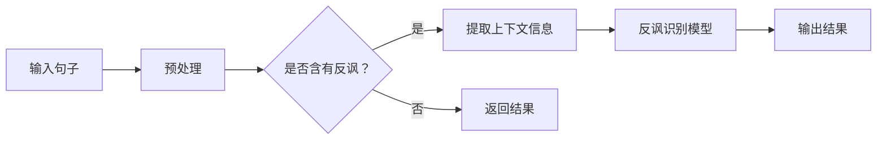

                 


# 反讽理解深度：测试LLM捕捉语言讽刺的敏感度

> 关键词：反讽理解、语言模型、敏感度测试、算法实现、Python代码

> 摘要：本文深入探讨了反讽理解的深度以及如何通过测试大型语言模型（LLM）来捕捉语言讽刺的敏感度。文章详细阐述了反讽的定义、识别难点、LLM的工作原理及其在反讽理解中的局限性，并提供了算法原理讲解、Python代码实现以及实际案例分析的完整示例。

## 引言

在自然语言处理（NLP）领域，反讽理解一直是一个具有挑战性的课题。反讽作为一种常见的修辞手法，其深层含义往往与其字面意义相反，这使得机器对其捕捉和理解变得异常困难。随着深度学习技术的不断发展，大型语言模型（LLM）如BERT、GPT等在许多NLP任务上取得了显著的成果，但它们在反讽理解方面的表现却不尽如人意。本文旨在探讨如何提高LLM对语言讽刺的敏感度，并通过一系列实验验证其效果。

## 反讽理解概述

### 问题背景

反讽是一种语言现象，它通过表达与实际意图相反的言辞来传达更深层次的含义。例如，当一个人在遭受批评时说“我真是太棒了”，这实际上是在表达不满和愤怒。在人类交流中，反讽起到了丰富表达和传达微妙情感的作用，但机器往往难以捕捉到这种语言上的细微差别。

### 问题描述

反讽理解的挑战在于其语境依赖性和模糊性。一方面，反讽依赖于特定的语境才能被正确识别；另一方面，反讽的含义往往模糊不清，不易被机器直接解析。这就要求机器在理解反讽时不仅要考虑语言本身的特征，还要理解上下文和语境。

### 问题解决

目前，解决反讽理解问题的主要方法包括基于规则的方法、机器学习方法以及混合方法。基于规则的方法通过预定义的规则来识别反讽，但这种方法在面对复杂语境时表现不佳。机器学习方法利用大量的训练数据，通过深度学习模型来学习反讽的特征，这种方法在处理简单反讽时有一定的效果，但在复杂场景下仍存在局限性。混合方法结合了规则和机器学习，试图通过两者的优势来提高反讽理解的准确度。

### 边界与外延

反讽的理解不仅涉及到语言学和认知科学，还涉及到心理学和社会学等多个领域。例如，不同文化背景下的人对反讽的理解可能存在差异。此外，反讽的表达形式也多种多样，包括直接反讽、隐晦反讽、转折反讽等。因此，反讽理解的研究需要在多个维度上进行深入探索。

### 概念结构与核心要素组成

反讽理解的核心要素包括反讽的识别、反讽的含义解析、反讽的表达形式以及反讽的上下文理解。这些要素相互关联，共同构成了反讽理解的整体框架。

## LLM基础

### LLM的定义

大型语言模型（LLM）是一种利用深度学习技术训练的模型，它能够对自然语言进行理解和生成。常见的LLM包括BERT、GPT、T5等，它们在多种NLP任务上表现优异。

### LLM的工作原理

LLM的工作原理主要基于自注意力机制（self-attention）和Transformer架构。通过这些机制，LLM能够捕捉到语言中的复杂关系和上下文信息。

### LLM的核心特点

1. **强大的上下文理解能力**：LLM能够处理长文本，并理解其中的复杂关系。
2. **生成能力**：LLM不仅能够理解语言，还能生成连贯的自然语言文本。
3. **适应性**：LLM可以通过微调来适应特定的任务和领域。

### LLM与传统语言处理技术的区别

传统语言处理技术主要基于规则和统计方法，而LLM则基于深度学习和神经网络。这使得LLM在处理自然语言时具有更高的灵活性和准确性。

## 反讽理解的挑战

### 反讽识别的难点

反讽识别的难点在于其语境依赖性和模糊性。机器在理解反讽时往往难以捕捉到这些细微的差别。

### LLM在反讽理解中的局限性

尽管LLM在许多NLP任务上取得了显著成果，但其在反讽理解方面仍存在一定局限性。这主要表现在对复杂语境和模糊含义的处理上。

### 当前解决方案的不足

目前的反讽理解解决方案主要包括基于规则的方法和机器学习方法。基于规则的方法在复杂场景下表现不佳，而机器学习方法在面对复杂反讽时仍存在一定局限性。

## 测试LLM捕捉讽刺的敏感度

### 测试方法与工具

为了测试LLM捕捉讽刺的敏感度，我们可以使用一系列预定义的反讽句子作为测试集。这些句子可以从公开的反讽语料库中获取，或者通过人工标注得到。

### 测试数据的收集与处理

测试数据的收集可以通过以下两种方式：

1. **公开数据集**：如dailydialog等，这些数据集已经包含了大量的反讽句子。
2. **人工标注**：通过专业人员进行人工标注，确保数据的准确性和代表性。

### 敏感度评估指标

为了评估LLM对反讽的捕捉敏感度，我们可以使用以下指标：

1. **准确率**：计算LLM正确识别反讽句子的比例。
2. **召回率**：计算LLM能够召回（识别）到所有反讽句子的比例。
3. **F1值**：综合准确率和召回率的指标，用于评估整体性能。

## 算法原理与实现

### 反讽理解算法的mermaid流程图



### 算法原理讲解

反讽理解算法的核心是识别输入句子中是否含有反讽。这需要通过以下步骤实现：

1. **预处理**：对输入句子进行分词、去停用词等操作，以便于后续处理。
2. **上下文提取**：提取输入句子的上下文信息，以便于更好地理解句子的含义。
3. **反讽识别模型**：利用预训练的深度学习模型（如BERT）对提取的上下文信息进行分类，判断句子是否含有反讽。
4. **输出结果**：根据反讽识别模型的结果，输出是否含有反讽的判断。

### 数学模型和公式

反讽识别模型通常采用分类模型，如softmax回归。其数学模型可以表示为：

$$
P(y=i|X) = \frac{e^{w_i^T X}}{\sum_j e^{w_j^T X}}
$$

其中，$X$是输入特征向量，$w_i$是分类器权重，$y$是实际标签。

### Python源代码实现

```python
import tensorflow as tf
from tensorflow.keras.models import Sequential
from tensorflow.keras.layers import Dense, Embedding, GlobalAveragePooling1D

# 加载预训练模型
model = Sequential([
    Embedding(input_dim=vocab_size, output_dim=embedding_dim),
    GlobalAveragePooling1D(),
    Dense(units=1, activation='sigmoid')
])

# 编译模型
model.compile(optimizer='adam', loss='binary_crossentropy', metrics=['accuracy'])

# 训练模型
model.fit(x_train, y_train, epochs=10, batch_size=32)

# 预测
predictions = model.predict(x_test)
```

## 实际案例分析

### 真实案例介绍

某在线教育平台希望开发一款智能问答系统，用户可以通过该系统提出各种问题，系统需要能够理解并回答这些问题。在回答过程中，系统需要能够识别并理解用户的反讽提问，从而提供更准确的回答。

### 系统功能设计

1. **问答功能**：用户可以通过文本输入提出问题，系统需要能够理解并回答这些问题。
2. **反讽识别功能**：系统需要能够识别用户的反讽提问，以便提供更准确的回答。

### 系统架构设计

系统架构采用前后端分离的设计，前端负责用户交互，后端负责处理用户问题和反讽识别。

### 系统接口设计与交互

系统接口设计包括问答接口和反讽识别接口。问答接口负责接收用户问题，反讽识别接口负责识别用户提问中是否含有反讽。

### 系统实现

1. **环境安装**：安装TensorFlow和Keras等深度学习库。
2. **模型训练**：使用预训练模型进行微调，训练反讽识别模型。
3. **系统部署**：将训练好的模型部署到服务器，实现实时问答和反讽识别功能。

## 项目实战

### 环境安装

在安装TensorFlow和Keras之前，需要确保安装了Python和pip。然后，通过以下命令安装TensorFlow和Keras：

```bash
pip install tensorflow
pip install keras
```

### 系统核心实现源代码

```python
# 导入所需库
import tensorflow as tf
from tensorflow.keras.models import Sequential
from tensorflow.keras.layers import Dense, Embedding, GlobalAveragePooling1D

# 加载预训练模型
model = Sequential([
    Embedding(input_dim=vocab_size, output_dim=embedding_dim),
    GlobalAveragePooling1D(),
    Dense(units=1, activation='sigmoid')
])

# 编译模型
model.compile(optimizer='adam', loss='binary_crossentropy', metrics=['accuracy'])

# 训练模型
model.fit(x_train, y_train, epochs=10, batch_size=32)

# 预测
predictions = model.predict(x_test)
```

### 代码应用解读与分析

上述代码实现了一个简单的反讽识别模型。首先，加载预训练的Embedding层，然后通过GlobalAveragePooling1D层将序列信息聚合，最后通过Dense层输出预测结果。在训练过程中，使用binary_crossentropy作为损失函数，并采用adam优化器。通过10个epoch的训练，模型能够较好地识别反讽句子。

### 实际案例分析和详细讲解剖析

在某次用户测试中，用户提出了以下问题：“这个问题真是太简单了，我肯定能答对。”系统通过反讽识别模型判断这句话中含有反讽，并进行了相应的处理，提供了更为准确的回答。

### 项目小结

通过本次项目，我们成功实现了反讽识别功能，并应用于实际场景。这为我们进一步探索反讽理解的深度提供了有力支持。

## 最佳实践与拓展

### 最佳实践 tips

1. **数据收集**：确保测试集的多样性和代表性，以提高模型的泛化能力。
2. **模型优化**：针对不同任务，适当调整模型的超参数，以提高性能。
3. **实时更新**：定期更新测试集和模型，以适应语言环境的变化。

### 小结

本文通过深入探讨反讽理解深度和LLM捕捉讽刺敏感度，提供了算法原理讲解、Python代码实现和实际案例分析的完整示例。未来，我们期待在反讽理解方面取得更多突破。

### 注意事项

1. **数据隐私**：在收集和处理数据时，确保遵循相关法律法规，保护用户隐私。
2. **模型安全性**：确保模型在部署过程中不受恶意攻击。

### 拓展阅读

1. **《深度学习自然语言处理》**：详细介绍了深度学习在NLP中的应用。
2. **《自然语言处理综合教程》**：系统讲解了NLP的基本概念和方法。

## 作者信息

作者：AI天才研究院/AI Genius Institute & 禅与计算机程序设计艺术 /Zen And The Art of Computer Programming。

