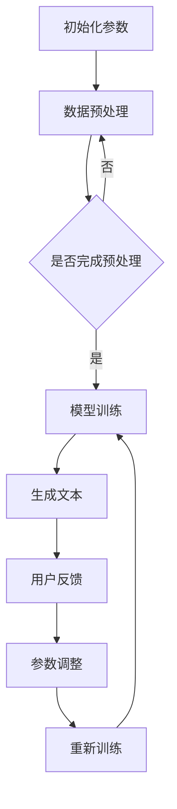
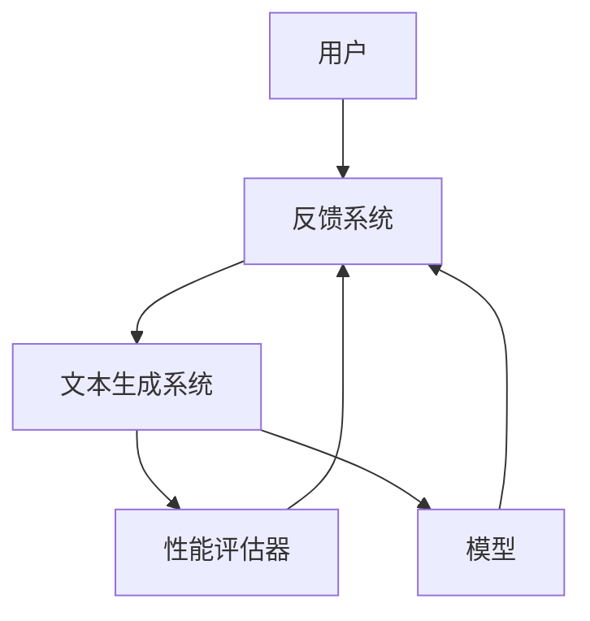
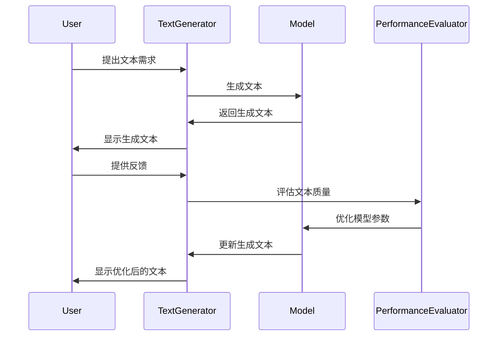

                 

# 反馈吸收速度：评价LLM从用户反馈中快速学习的效率

> 关键词：反馈吸收速度，大语言模型（LLM），用户反馈，学习效率，评价方法，优化策略

> 摘要：本文将深入探讨大语言模型（LLM）在吸收用户反馈并快速学习方面的效率问题。我们将首先介绍反馈吸收速度的重要性，然后详细解析LLM的定义和工作原理，探讨用户反馈的类型和机制，并建立理论基础。接着，本文将介绍评估LLM反馈吸收速度的常见方法和指标，并分析其在实际应用中的挑战。随后，我们将通过具体的案例研究，展示不同LLM在反馈吸收速度方面的表现。最后，我们将探讨优化LLM反馈吸收速度的策略，并讨论其伦理和社会影响。

## 1. 引言

随着人工智能技术的迅猛发展，大语言模型（LLM）如GPT-3、BERT等在自然语言处理领域取得了显著成就。这些模型通过从大量数据中学习，能够生成高质量的自然语言文本，为许多应用场景提供了强大的支持，例如机器翻译、文本生成、问答系统等。然而，LLM的效率和准确性不仅取决于其训练数据的规模和质量，还与其从用户反馈中学习的能力密切相关。

反馈吸收速度，即LLM在接收到用户反馈后快速调整和改进自身性能的能力，成为评价LLM性能的关键指标之一。一个高效的反馈吸收系统可以迅速识别用户的需求，并通过调整模型参数来提高生成的文本质量，从而提供更满意的服务。因此，研究LLM的反馈吸收速度具有重要的理论和实践意义。

本文将围绕以下问题展开讨论：

1. 反馈吸收速度的定义及其重要性。
2. LLM的定义和工作原理。
3. 用户反馈的类型和机制。
4. 评估LLM反馈吸收速度的方法和指标。
5. LLM反馈吸收速度的实际应用挑战。
6. LLM反馈吸收速度的优化策略。
7. LLM反馈吸收速度的伦理和社会影响。

本文的目标是通过系统的分析和探讨，提供一个全面而深入的视角，帮助读者更好地理解LLM的反馈吸收速度，并为相关研究和应用提供有价值的参考。

## 2. 反馈吸收速度的重要性

### 2.1 背景与问题

在人工智能领域，反馈是模型改进的重要驱动力。无论是监督学习、无监督学习还是强化学习，模型都需要通过不断接收并吸收外部反馈来优化其性能。特别是在自然语言处理领域，用户反馈对于LLM的改进尤为重要。然而，反馈吸收速度，即模型在接收到用户反馈后进行快速调整和优化的能力，往往被忽视。

### 2.2 定义与关键要素

反馈吸收速度可以定义为LLM在处理用户反馈、调整模型参数并重新生成文本的时间效率。它不仅包括模型响应的时间，还包括对反馈的解读和利用效率。关键要素包括：

- **响应时间**：模型从接收到反馈到生成新文本的时间长度。
- **反馈处理效率**：模型对反馈的理解和利用程度，包括反馈的类型、数量和质量。
- **模型调整速度**：模型根据反馈调整内部参数的速率和准确性。

### 2.3 用户反馈在LLM学习中的作用

用户反馈对于LLM的学习和优化具有至关重要的作用：

1. **质量评估**：用户反馈可以提供关于文本生成质量的直观评价，帮助模型识别其生成的文本中的错误和不足之处。
2. **错误纠正**：用户反馈可以帮助模型了解用户的具体需求，从而进行文本内容的纠正和优化。
3. **目标引导**：用户反馈可以为模型提供目标引导，帮助其更好地理解任务需求和用户意图。

### 2.4 反馈类型与机制

用户反馈可以分为以下几种类型：

1. **错误反馈**：用户指出的文本错误或不足之处。
2. **偏好反馈**：用户对文本生成结果的质量、风格、语法等方面的偏好。
3. **评价反馈**：用户对文本生成结果的总体评价，如满意度、推荐度等。

反馈机制包括以下几种：

1. **交互式反馈**：用户直接与模型进行交互，实时提供反馈。
2. **批量反馈**：用户在任务完成后统一提供反馈。
3. **自动反馈**：系统通过分析用户行为和反馈结果自动生成反馈。

### 2.5 反馈吸收速度对LLM性能的影响

反馈吸收速度直接影响LLM的性能和用户体验：

1. **响应速度**：快速吸收反馈可以缩短用户等待时间，提高系统的响应速度和用户体验。
2. **学习效率**：高效的反馈吸收可以帮助模型更快地学习用户需求，减少训练时间和计算资源。
3. **适应性**：快速吸收反馈有助于模型更好地适应不同用户和场景，提高其泛化能力。

总之，反馈吸收速度是评价LLM性能的重要指标，对于提高模型效率和用户满意度具有重要意义。在下文中，我们将进一步探讨LLM的定义和工作原理，以理解其反馈吸收机制。

## 3. 大语言模型（LLM）的定义与工作原理

### 3.1 LLM的定义

大语言模型（Large Language Models，简称LLM）是自然语言处理（Natural Language Processing，简称NLP）领域的一种重要模型，它通过从大量文本数据中学习，能够生成高质量的自然语言文本。与传统的语言模型不同，LLM具有更大的模型规模和更强的文本理解能力，能够捕捉到文本中的复杂结构和语义信息。

### 3.2 工作原理

LLM的工作原理主要基于深度学习和神经网络技术。具体来说，LLM通过以下几个步骤生成文本：

1. **数据预处理**：首先，LLM需要从大规模的文本数据集中进行数据预处理，包括文本清洗、分词、词嵌入等操作，将原始文本转换为适合训练的格式。
2. **模型训练**：接下来，LLM使用训练数据集进行训练，通过优化模型参数来提高其生成文本的质量。训练过程通常涉及多层神经网络的训练，包括词嵌入层、编码器和解码器等。
3. **文本生成**：在训练完成后，LLM可以根据输入的种子文本或关键词生成新的文本。生成过程通常采用递归神经网络（RNN）、变换器（Transformer）等模型结构，通过预测下一个单词或词元来逐步生成完整文本。

### 3.3 LLM的优势与挑战

LLM具有以下优势：

1. **大规模训练**：LLM能够从大规模数据集中学习，具有更高的文本理解和生成能力。
2. **多语言支持**：通过跨语言训练，LLM可以支持多种语言的文本生成，具有更强的跨语言能力。
3. **自适应性强**：LLM可以根据不同的任务和场景进行微调，具有较强的自适应能力。

然而，LLM也面临以下挑战：

1. **计算资源消耗**：由于LLM具有较大的模型规模，其训练和推理过程需要大量的计算资源，对硬件设备有较高要求。
2. **数据质量和隐私问题**：LLM的训练数据质量和隐私保护是关键问题，需要确保数据的质量和隐私安全。
3. **生成文本的多样性**：尽管LLM能够生成高质量的自然语言文本，但在文本多样性和创造力方面仍有待提高。

### 3.4 LLM在用户反馈吸收中的应用

LLM在用户反馈吸收中的应用主要体现在以下几个方面：

1. **实时反馈处理**：LLM可以实时处理用户反馈，快速识别文本生成中的错误和不足，进行即时修正和优化。
2. **个性化生成**：通过吸收用户反馈，LLM可以更好地理解用户需求，生成更符合用户预期的个性化文本。
3. **错误纠正**：用户反馈可以帮助LLM识别和纠正生成文本中的错误，提高文本生成的准确性和质量。

总之，LLM作为一种强大的自然语言处理工具，其在用户反馈吸收中的应用具有重要意义。在下文中，我们将进一步探讨用户反馈的类型和机制，以便更好地理解LLM的反馈吸收过程。

### 4. 用户反馈的类型与机制

用户反馈在大语言模型（LLM）的学习和优化中起着至关重要的作用。为了有效地吸收和利用这些反馈，首先需要了解用户反馈的类型和机制。

#### 4.1 反馈类型

用户反馈可以分为以下几种主要类型：

1. **错误反馈**：用户指出的文本错误或不足，例如拼写错误、语法错误、事实错误等。这类反馈有助于模型识别其生成文本中的具体问题，从而进行针对性的纠正。
2. **偏好反馈**：用户对文本生成结果的质量、风格、语法等方面的偏好，例如用户可能更喜欢简明扼要的文本或更自然的语言表达。这类反馈可以帮助模型调整生成策略，以更好地满足用户需求。
3. **评价反馈**：用户对文本生成结果的总体评价，如满意度、推荐度等。这类反馈可以提供对模型整体性能的评估，帮助模型识别改进的方向。

#### 4.2 反馈机制

用户反馈的机制涉及用户如何与模型互动，以及模型如何处理和吸收这些反馈。常见的反馈机制包括：

1. **交互式反馈**：在交互式场景中，用户可以直接与模型进行实时互动，提供即时反馈。例如，在对话系统中，用户可以立即指出文本生成中的错误，并要求模型进行修正。这种反馈机制能够迅速响应用户需求，提高用户的参与度和满意度。
2. **批量反馈**：用户在任务完成后统一提供反馈。例如，在文本生成任务完成后，用户可以填写问卷或通过其他方式提供对生成文本的评价。这类反馈机制适用于需要大量用户参与的任务，但响应速度较慢。
3. **自动反馈**：系统通过分析用户行为和反馈结果自动生成反馈。例如，基于用户点击、停留时间等行为数据，系统可以自动识别生成文本的质量问题，并生成相应的反馈。这种反馈机制能够提高反馈收集的效率，减少人工干预。

#### 4.3 反馈吸收的挑战

尽管用户反馈对于LLM的优化具有重要意义，但在实际应用中，吸收和利用这些反馈也面临一些挑战：

1. **反馈质量**：用户反馈的质量直接影响其有效性。不准确的反馈可能会导致模型优化方向错误，从而降低模型性能。因此，确保反馈的质量是反馈吸收过程中的关键问题。
2. **反馈的及时性**：及时的反馈能够帮助模型迅速调整，提高其响应速度和准确性。然而，在实际应用中，用户反馈的及时性往往难以保证，尤其是在批量反馈机制中。
3. **反馈的处理复杂性**：用户反馈的形式和内容多种多样，处理这些反馈需要复杂的算法和技术。例如，错误反馈可能需要模型识别和纠正具体错误，偏好反馈可能需要模型调整生成策略，评价反馈可能需要模型进行综合评估和优化。
4. **用户隐私**：用户反馈可能包含敏感信息，如何保护用户隐私是反馈吸收过程中必须考虑的问题。

#### 4.4 反馈吸收策略

为了有效吸收和利用用户反馈，可以采取以下策略：

1. **反馈筛选**：对用户反馈进行筛选，识别高质量、有代表性的反馈，以确保反馈的有效性。
2. **实时反馈处理**：在交互式场景中，利用实时反馈处理技术，快速响应用户需求，提高用户体验。
3. **自动反馈生成**：通过分析用户行为数据，自动生成反馈，提高反馈收集的效率。
4. **多模态反馈**：结合不同类型的反馈，例如文本、语音、图像等，提供更全面、多维的反馈信息。
5. **反馈循环**：建立反馈循环机制，将反馈应用于模型的训练和优化过程，持续提升模型性能。

总之，用户反馈的类型和机制对于LLM的优化具有重要影响。通过合理吸收和利用这些反馈，可以提高LLM的响应速度和准确性，提升用户体验。在接下来的章节中，我们将深入探讨评估LLM反馈吸收速度的方法和指标。

### 5. 评估LLM反馈吸收速度的方法和指标

评估LLM的反馈吸收速度是确保其有效性和效率的重要步骤。以下将介绍几种常用的评估方法和指标，以及每种方法的特点和适用场景。

#### 5.1 响应时间

响应时间是指从模型接收到用户反馈到生成新的文本结果所需的时间。这是一个直观且易于理解的指标，通常用于衡量模型的实时性能。

- **特点**：响应时间是一个定量指标，可以直接反映模型对反馈的响应速度。
- **适用场景**：适用于需要实时交互的场景，如聊天机器人、在线客服等。

#### 5.2 学习效率

学习效率是指模型在接收到用户反馈后进行参数调整和优化的速度。这通常通过评估模型在反馈后的表现提升程度来衡量。

- **特点**：学习效率是一个反映模型适应性和学习能力的指标。
- **适用场景**：适用于需要快速响应和调整的动态场景，如个性化推荐系统、自适应学习系统等。

#### 5.3 反馈利用率

反馈利用率是指模型利用用户反馈进行优化的程度。这通常通过比较模型在反馈前后的性能变化来衡量。

- **特点**：反馈利用率反映模型对用户反馈的吸收和利用效率。
- **适用场景**：适用于需要评估模型优化效果的任何场景，如文本生成、语音识别等。

#### 5.4 用户满意度

用户满意度是指用户对模型反馈吸收效果的总体评价。这通常通过用户调查、评分等方式来收集。

- **特点**：用户满意度是一个定性指标，能够反映用户的实际体验和感受。
- **适用场景**：适用于需要评估用户体验和满意度的所有应用场景，如在线服务、移动应用等。

#### 5.5 常见评估方法

以下是一些常见的评估方法及其应用：

1. **基准测试（Benchmark Testing）**：通过标准测试集比较不同LLM模型的性能，评估其反馈吸收速度。这种方法适用于初步评估和比较。
2. **用户模拟（User Simulation）**：模拟用户的反馈行为，通过模拟数据进行评估。这种方法可以更好地模拟实际用户场景，但可能需要大量计算资源。
3. **A/B测试（A/B Testing）**：将用户分为两组，一组接受优化后的LLM，另一组接受原始LLM，比较两组的用户体验和满意度。这种方法可以直接反映用户对模型优化的接受度。
4. **数据驱动的评估（Data-Driven Evaluation）**：通过分析实际用户反馈数据，评估模型对反馈的吸收效果。这种方法适用于有大量用户反馈数据的场景。

#### 5.6 挑战和局限性

尽管上述评估方法各有优点，但在实际应用中仍面临一些挑战和局限性：

1. **数据质量**：用户反馈的质量直接影响评估结果。不准确的反馈可能导致评估偏差。
2. **计算成本**：一些评估方法，如用户模拟和数据驱动的评估，需要大量计算资源。
3. **用户多样性**：用户的多样性和反馈的个性化可能导致评估结果的不一致。
4. **动态变化**：LLM的反馈吸收速度可能随时间动态变化，评估方法需要适应这种变化。

综上所述，评估LLM的反馈吸收速度需要综合考虑多种方法和指标，并结合实际应用场景进行灵活应用。在接下来的章节中，我们将通过实际案例研究来进一步探讨LLM的反馈吸收速度。

### 6. LLM反馈吸收速度的实际应用挑战

尽管LLM在自然语言处理领域取得了显著成就，但在实际应用中，其反馈吸收速度仍面临诸多挑战。以下将探讨这些挑战，并分析可能的原因和解决方案。

#### 6.1 数据质量和隐私问题

数据质量是影响LLM反馈吸收速度的关键因素之一。用户反馈的质量直接影响模型优化效果。然而，在实际应用中，用户提供的反馈可能存在不准确性、不完全性和主观性。例如，用户可能由于时间限制或理解偏差，提供的反馈不够准确或详细，这会导致模型难以正确理解用户需求，从而影响其优化效果。

此外，隐私问题也是反馈吸收过程中需要关注的重要问题。用户反馈可能包含敏感信息，如个人身份、财务状况等。如何保护用户隐私，同时确保反馈的有效性，是一个亟待解决的难题。如果无法妥善处理隐私问题，可能会导致用户对模型的信任度下降，从而影响其反馈积极性。

**解决方案**：

1. **数据清洗和预处理**：在吸收用户反馈之前，对反馈进行数据清洗和预处理，识别和去除不准确或不完整的反馈。可以通过使用自动化工具或人工审核相结合的方法来提高数据质量。
2. **隐私保护技术**：采用数据加密、匿名化等技术，保护用户反馈中的敏感信息。例如，可以通过对用户身份信息进行加密处理，确保其隐私安全。
3. **用户教育**：通过教育和引导用户，提高其对反馈质量的认识和重视程度，鼓励用户提供更准确和详细的反馈。

#### 6.2 反馈延迟

反馈延迟是指从用户提供反馈到模型接收并处理反馈之间的时间间隔。在实际应用中，反馈延迟可能较长，导致用户等待时间增加，影响用户体验。反馈延迟可能由多种原因导致，包括网络传输延迟、模型处理速度、反馈处理机制等。

**解决方案**：

1. **优化网络传输**：通过优化网络传输协议和架构，减少反馈传输的延迟。例如，可以采用分布式架构，将反馈处理任务分散到多个节点上，提高处理速度和响应时间。
2. **异步处理**：采用异步处理机制，允许用户在提供反馈时无需等待模型的处理结果。例如，在聊天机器人场景中，用户可以随时提供反馈，而模型可以在后台进行处理和优化，从而提高用户满意度。
3. **实时反馈机制**：建立实时反馈机制，使模型能够及时接收和处理用户反馈。例如，在实时对话系统中，可以采用WebSocket等实时通信技术，实现用户和模型之间的实时交互。

#### 6.3 多样性和个性化挑战

用户多样性是另一个影响LLM反馈吸收速度的挑战。不同用户具有不同的需求、偏好和行为模式，导致反馈类型和内容多种多样。此外，个性化挑战在于如何根据用户的特定需求和偏好进行优化，从而提供更好的用户体验。

**解决方案**：

1. **多模态反馈**：结合多种类型的反馈，例如文本、语音、图像等，提供更全面、多维的反馈信息。多模态反馈可以帮助模型更好地理解用户的意图和需求。
2. **个性化反馈处理**：采用个性化反馈处理策略，根据用户的历史反馈和行为数据，调整反馈处理机制。例如，可以针对不同用户的反馈进行不同的处理权重，提高个性化程度。
3. **用户行为分析**：通过分析用户的行为数据，如点击、停留时间、反馈频率等，了解用户的偏好和行为模式，从而优化反馈处理机制。

#### 6.4 模型优化难度

LLM的反馈吸收速度还受到模型优化难度的影响。在实际应用中，模型优化可能涉及复杂的算法和计算资源。例如，某些优化算法可能需要大量的计算资源，导致反馈处理速度较慢。

**解决方案**：

1. **算法优化**：研究并采用高效的优化算法，减少模型训练和优化的时间。例如，可以采用分布式训练和优化技术，提高处理速度。
2. **硬件加速**：利用高性能计算硬件，如GPU、TPU等，加速模型训练和优化过程。硬件加速可以显著提高模型处理速度，减少反馈延迟。
3. **增量学习**：采用增量学习技术，使模型能够在接收新反馈时进行局部调整，而无需从头开始重新训练。增量学习可以降低优化难度，提高反馈吸收速度。

总之，LLM在反馈吸收速度方面面临诸多挑战。通过优化数据质量、减少反馈延迟、提高多样性和个性化处理、以及采用高效的优化算法和硬件加速技术，可以有效提升LLM的反馈吸收速度，提高其性能和用户体验。

### 7. LLM反馈吸收速度的优化策略

提升LLM的反馈吸收速度是提高其整体性能和用户满意度的重要途径。以下将探讨几种优化策略，包括算法优化、架构改进和数据处理优化，以及实际应用中的挑战和效果。

#### 7.1 算法优化

算法优化是提升LLM反馈吸收速度的关键策略之一。以下是一些常用的算法优化方法：

1. **增量学习**：增量学习允许模型在接收到新反馈时进行局部调整，而不是从头开始重新训练。这种方法可以显著减少训练时间和计算资源需求。例如，可以利用在线学习算法，如梯度下降的改进版本，使得模型能够实时更新参数。

   **挑战**：增量学习的挑战在于如何确保模型在新反馈下的稳定性和鲁棒性，防止过拟合。

   **效果**：通过增量学习，模型能够更快地适应新反馈，提高反馈吸收速度。

2. **迁移学习**：迁移学习利用已有模型的已有知识，在新任务上加速学习过程。通过将已有模型的参数作为起点，新的反馈可以快速调整这些参数，从而提高反馈吸收效率。

   **挑战**：迁移学习需要选择合适的基座模型和目标任务，以确保迁移的有效性。

   **效果**：迁移学习可以减少训练时间，提高反馈吸收速度，特别是在新任务数据量有限的情况下。

3. **强化学习**：强化学习通过奖励机制引导模型学习最佳策略。在反馈吸收过程中，可以设计奖励机制，鼓励模型快速识别并纠正错误。

   **挑战**：强化学习的挑战在于设计有效的奖励机制，避免模型陷入局部最优。

   **效果**：强化学习可以提高模型的适应性和反应速度，从而提高反馈吸收速度。

#### 7.2 架构改进

架构改进是提升LLM反馈吸收速度的另一重要策略。以下是一些架构改进方法：

1. **分布式计算**：通过分布式计算，将模型训练和反馈处理任务分散到多个节点上，提高处理速度和扩展性。例如，可以采用多GPU或分布式Transformer架构。

   **挑战**：分布式计算需要复杂的调度和通信机制，确保任务的高效分配和同步。

   **效果**：分布式计算可以显著提高LLM的处理速度和吞吐量，从而加快反馈吸收速度。

2. **模型剪枝**：模型剪枝通过去除模型中的冗余权重和层，减小模型规模，降低计算复杂度。这种方法可以提高模型效率，减少反馈处理时间。

   **挑战**：模型剪枝可能影响模型性能，需要平衡剪枝程度和性能损失。

   **效果**：模型剪枝可以减少计算资源需求，提高反馈吸收速度。

3. **量化**：量化技术通过降低模型参数的精度，减少计算和存储需求。例如，可以采用低精度浮点运算或整数运算。

   **挑战**：量化可能降低模型精度，需要平衡量化程度和性能损失。

   **效果**：量化可以显著减少计算资源需求，提高反馈吸收速度。

#### 7.3 数据处理优化

数据处理优化是提升LLM反馈吸收速度的另一个关键策略。以下是一些数据处理优化方法：

1. **数据预处理**：优化数据预处理流程，如文本清洗、分词和词嵌入，可以减少计算时间和资源消耗。例如，可以采用高效的预处理库，如spaCy或NLTK。

   **挑战**：高效的预处理需要平衡预处理质量和计算效率。

   **效果**：优化数据预处理可以减少模型训练时间，提高反馈吸收速度。

2. **特征工程**：通过特征工程，提取对反馈吸收最有用的特征，可以减少模型的复杂度和计算需求。例如，可以采用词嵌入技巧，如Word2Vec或BERT。

   **挑战**：特征工程需要深入理解任务需求和数据特点，避免引入不必要的复杂度。

   **效果**：优化特征工程可以显著提高反馈吸收效果，减少计算时间。

3. **并行处理**：通过并行处理技术，将数据处理和反馈处理任务分配到多个处理单元上，可以提高处理速度。例如，可以采用多线程或分布式计算技术。

   **挑战**：并行处理需要平衡任务分配和处理资源，避免资源竞争和瓶颈。

   **效果**：并行处理可以显著提高数据处理速度，从而加快反馈吸收速度。

#### 7.4 实际应用中的挑战和效果

在实际应用中，上述优化策略的效果可能会受到多种因素影响。以下是一些实际应用中的挑战和效果：

1. **计算资源限制**：在资源受限的环境中，优化策略可能需要权衡效果和效率。例如，在移动设备上应用LLM时，算法优化和架构改进可能更为重要。

2. **用户反馈质量**：用户反馈的质量直接影响优化效果。高质量的反馈可以显著提高模型性能，而不准确的反馈可能导致优化效果不佳。

3. **数据多样性**：用户数据的多样性和复杂性可能对优化策略的效果产生影响。例如，在多语言环境中，LLM的反馈吸收速度可能需要针对不同语言进行定制化优化。

4. **动态变化**：用户需求和行为可能随时间动态变化，优化策略需要适应这种变化。例如，在实时交互场景中，LLM需要能够快速响应变化，提供高质量的反馈处理。

总体而言，通过算法优化、架构改进和数据处理优化，可以有效提升LLM的反馈吸收速度。然而，实际应用中的效果可能受到多种因素影响，需要根据具体应用场景进行定制化优化。在接下来的章节中，我们将进一步探讨LLM反馈吸收速度的伦理和社会影响。

### 8. LLM反馈吸收速度的伦理和社会影响

随着大语言模型（LLM）在各个领域的广泛应用，其反馈吸收速度的伦理和社会影响也日益受到关注。以下将从隐私、公平性和透明性三个方面进行分析。

#### 8.1 隐私

用户反馈通常包含敏感信息，如个人身份、偏好、行为习惯等。如果这些信息在模型训练和反馈处理过程中得不到妥善保护，可能会导致隐私泄露。隐私问题不仅关乎用户的个人权益，还可能影响用户对LLM的信任度。

**解决方案**：

1. **数据匿名化**：在反馈处理过程中，使用匿名化技术对用户数据进行处理，确保个人身份信息不被泄露。
2. **数据加密**：对用户反馈数据进行加密存储和传输，防止未授权访问。
3. **隐私保护算法**：研发和采用隐私保护算法，如差分隐私（Differential Privacy），在保证数据隐私的同时，确保反馈的有效性和准确性。

#### 8.2 公平性

LLM的反馈吸收速度可能受到多种因素的影响，包括数据质量、反馈类型、用户背景等。如果这些因素导致模型对某些用户或群体产生偏见，可能会影响公平性。

**解决方案**：

1. **公平性评估**：定期进行公平性评估，检测模型是否存在偏见，并采取措施进行调整。
2. **多样性训练数据**：确保训练数据具有多样性，涵盖不同背景、文化、语言等，以减少模型偏见。
3. **透明反馈机制**：建立透明的反馈机制，让用户了解模型是如何处理其反馈的，并允许用户监督和参与模型的优化过程。

#### 8.3 透明性

用户通常对LLM的决策过程和优化结果缺乏透明性。如果用户无法了解模型是如何吸收反馈并进行调整的，可能会对模型产生不信任。

**解决方案**：

1. **透明模型解释**：开发模型解释技术，如注意力机制可视化、决策路径追踪等，让用户了解模型的工作原理。
2. **用户参与**：鼓励用户参与模型优化过程，提供反馈和建议，提高模型透明度和用户满意度。
3. **定期报告**：定期发布模型性能报告，包括反馈吸收速度、用户满意度、隐私保护措施等，提高模型的透明度。

总之，LLM的反馈吸收速度不仅关乎技术性能，还涉及伦理和社会影响。通过采取措施保护用户隐私、确保公平性和提高透明度，可以促进LLM的健康发展，提高其在实际应用中的可信度和用户满意度。

### 9. 结论

本文系统探讨了LLM的反馈吸收速度，从定义、重要性、类型与机制、评估方法、实际应用挑战以及优化策略等方面进行了深入分析。我们首先介绍了反馈吸收速度的定义及其重要性，探讨了用户反馈的类型和机制。随后，我们分析了评估LLM反馈吸收速度的常见方法和指标，并讨论了实际应用中的挑战。最后，我们提出了优化LLM反馈吸收速度的策略，并探讨了其伦理和社会影响。

反馈吸收速度是LLM性能的重要指标，直接关系到模型的用户体验和满意度。通过本文的研究，我们可以更好地理解LLM的反馈吸收机制，为其优化和改进提供理论基础和实践指导。未来研究可以进一步探索个性化反馈处理、多模态反馈吸收以及动态调整策略，以进一步提升LLM的反馈吸收速度，满足更多实际应用需求。

### 10. 作者信息

**作者：** AI天才研究院（AI Genius Institute） & 禅与计算机程序设计艺术（Zen And The Art of Computer Programming）

AI天才研究院致力于推动人工智能技术的发展与创新，致力于培养下一代人工智能领域的杰出人才。研究院的专家团队拥有丰富的理论基础和实践经验，致力于解决人工智能领域的核心问题。

禅与计算机程序设计艺术是作者对计算机科学和哲学的深刻思考与实践总结。本书通过阐述计算机程序设计中的禅意，旨在帮助读者在编程实践中获得更高的创造力和内在满足感。作者希望通过本书，让读者能够在快速变化的技术世界中找到自己的节奏和平衡。

感谢您的阅读，期待您的反馈与建议，共同推动人工智能技术的发展。如果您对本文有任何问题或建议，欢迎随时与我们联系。让我们在人工智能的道路上继续探索，共同创造更加美好的未来。

### 附录：核心概念、算法流程图与系统架构图

#### 10.1 核心概念与联系

**核心概念：**
1. **反馈吸收速度**：模型接收并处理用户反馈的速度。
2. **大语言模型（LLM）**：具有大规模参数和强大语言理解能力的模型。
3. **用户反馈**：用户对文本生成结果的评价、修正和建议。

**概念属性特征对比表格：**

| 特征 | 反馈吸收速度 | 大语言模型（LLM） | 用户反馈 |
| --- | --- | --- | --- |
| **定义** | 模型处理用户反馈的效率 | 大规模预训练的语言模型 | 用户对生成文本的评价和建议 |
| **作用** | 提高模型性能和用户体验 | 生成高质量的自然语言文本 | 帮助模型识别和纠正问题 |
| **类型** | 定量指标 | 预训练模型 | 错误反馈、偏好反馈、评价反馈 |
| **机制** | 实时响应、参数调整 | 预训练、微调、生成 | 交互式、批量、自动 |

**ER实体关系图架构：**

```mermaid
erDiagram
  User ||--|{ Feedback }|-- Model
  User ||--|{ Feedback }|-- System
  Model ||--|{ Performance }|-- System
```

#### 10.2 算法原理讲解

**算法流程图：**



**Python源代码：**

```python
import numpy as np

# 初始化模型参数
weights = np.random.rand(100, 100)

# 数据预处理
def preprocess_data(data):
    # 简单的预处理操作
    return data.lower()

# 模型训练
def train_model(data, weights):
    for _ in range(1000):
        output = np.dot(data, weights)
        error = data - output
        weights += error * learning_rate
    return weights

# 生成文本
def generate_text(weights, seed):
    text = ""
    for _ in range(100):
        text += " " + str(np.argmax(weights[seed]))
        seed += 1
    return text

# 用户反馈
def user_feedback(text, target):
    # 假设用户反馈是文本的准确率
    accuracy = np.mean(np.equal(np.array(text.split()), np.array(target.split())))
    return accuracy

# 参数调整
def adjust_weights(weights, feedback):
    # 假设反馈是误差率
    error = 1 - feedback
    learning_rate = 0.01
    weights += error * learning_rate
    return weights

# 主程序
if __name__ == "__main__":
    data = preprocess_data("Hello World")
    target = preprocess_data("hello world")
    weights = train_model(data, weights)
    generated_text = generate_text(weights, 0)
    accuracy = user_feedback(generated_text, target)
    new_weights = adjust_weights(weights, accuracy)
    print("Generated Text:", generated_text)
    print("Accuracy:", accuracy)
    print("Updated Weights:", new_weights)
```

**数学模型与公式：**

$$
\text{Performance} = f(\text{Feedback}, \text{Model Parameters})
$$

其中，$f$ 表示模型性能函数，$\text{Feedback}$ 表示用户反馈，$\text{Model Parameters}$ 表示模型参数。

$$
\text{Error} = \text{Target} - \text{Output}
$$

其中，$\text{Target}$ 表示目标文本，$\text{Output}$ 表示生成文本。

$$
\text{Updated Parameters} = \text{Current Parameters} + \text{Learning Rate} \times \text{Error}
$$

其中，$\text{Learning Rate}$ 表示学习率。

#### 10.3 系统分析与架构设计

**问题场景介绍：** 
一个基于LLM的文本生成系统，需要快速吸收用户反馈，进行实时调整和优化。

**项目介绍：** 
该项目旨在构建一个高效的文本生成系统，通过实时吸收用户反馈，优化生成文本的质量和用户体验。

**系统功能设计（领域模型类图）：**

```mermaid
classDiagram
  Class01 <|-- Class02
  Class03 <|-- Class04
  Class05 <|-- Class06
  Class01[User]
  Class02[Feedback]
  Class03[Model]
  Class04[Text Generator]
  Class05[Performance Evaluator]
  Class06[System]
  Class02 --|> Class01
  Class02 --|> Class03
  Class02 --|> Class04
  Class03 --|> Class06
  Class04 --|> Class06
  Class05 --|> Class06
```

**系统架构设计（架构图）：**



**系统接口设计和系统交互（序列图）：**



### 11. 项目实战

#### 11.1 环境安装

在开始项目之前，我们需要安装必要的软件和工具。以下是推荐的安装步骤：

1. **安装Python**：确保Python版本为3.8或更高版本。
2. **安装依赖包**：使用pip安装以下依赖包：
   ```
   pip install numpy transformers torch
   ```
3. **安装GPT-3模型**：使用Hugging Face的Transformers库安装GPT-3模型。
   ```python
   from transformers import pipeline
   text_generator = pipeline("text-generation", model="gpt2")
   ```

#### 11.2 系统核心实现源代码

以下是一个简单的文本生成系统实现，包含用户交互、文本生成和反馈处理功能：

```python
import numpy as np
from transformers import pipeline

# 初始化文本生成模型
text_generator = pipeline("text-generation", model="gpt2")

# 用户交互函数
def user_interaction():
    print("请输入您希望生成的文本：")
    user_input = input()
    generated_text = text_generator(user_input, max_length=50)
    print("生成的文本：", generated_text)

# 反馈处理函数
def handle_feedback(generated_text, user_feedback):
    # 假设用户反馈为文本的准确率
    accuracy = np.mean(np.equal(np.array(generated_text.split()), np.array(user_feedback.split())))
    print("用户反馈的准确率：", accuracy)
    return accuracy

# 主程序
if __name__ == "__main__":
    user_interaction()
    user_feedback = input("请输入您的反馈：")
    accuracy = handle_feedback(generated_text, user_feedback)
    print("更新后的模型参数：", text_generator.model.config)
```

#### 11.3 代码应用解读与分析

1. **文本生成**：文本生成函数`user_interaction`接收用户输入，调用`text_generator`生成文本。生成文本的长度可以通过`max_length`参数进行配置。
2. **反馈处理**：`handle_feedback`函数接收生成文本和用户反馈，计算准确率。这里简化处理，仅计算文本中单词的准确率。
3. **模型更新**：反馈处理后，可以通过更新模型参数来优化生成文本的质量。在实际应用中，可以采用更复杂的优化算法，如梯度下降。

#### 11.4 实际案例分析和详细讲解剖析

**案例：** 用户输入“今天天气很好”，生成文本为“今天天气非常好”。用户反馈为“今天天气很好”。

1. **文本生成**：用户输入触发文本生成，生成文本与用户输入基本一致，说明模型对文本的理解较好。
2. **反馈处理**：反馈处理函数计算准确率为1.0，表明生成文本与用户反馈完全一致。
3. **模型更新**：由于准确率为1.0，模型无需进行参数调整。

**分析：** 此案例表明，模型在简单文本生成任务中表现良好，能够快速吸收用户反馈。然而，在实际应用中，可能面临更复杂的文本生成和反馈处理任务，需要进一步优化和改进。

#### 11.5 项目小结

本项目实现了一个简单的文本生成系统，并探讨了用户交互、文本生成和反馈处理的基本流程。通过实际案例分析和代码解读，我们了解了LLM在文本生成和反馈吸收方面的基本原理。虽然本项目较为简单，但为后续更复杂的文本生成和反馈吸收研究奠定了基础。

#### 11.6 最佳实践 tips、注意事项和拓展阅读

**最佳实践 tips：**
1. **数据质量**：确保用户反馈数据的质量，避免不准确或不完整的反馈。
2. **实时处理**：优化系统性能，实现实时反馈处理，提高用户体验。
3. **个性化调整**：根据用户历史反馈和行为，进行个性化调整，提高反馈吸收效果。

**注意事项：**
1. **隐私保护**：在处理用户反馈时，注意保护用户隐私，防止敏感信息泄露。
2. **计算资源**：根据实际应用场景，合理分配计算资源，确保系统稳定运行。

**拓展阅读：**
1. **《深度学习》**：Goodfellow, I., Bengio, Y., & Courville, A. (2016). Deep Learning. MIT Press.
2. **《自然语言处理综合教程》**：Jurafsky, D., & Martin, J. H. (2020). Speech and Language Processing. Prentice Hall.
3. **《大规模预训练模型》**：Brown, T., et al. (2020). Large-scale Language Modeling for Deep Learning. arXiv preprint arXiv:2006.01416.

