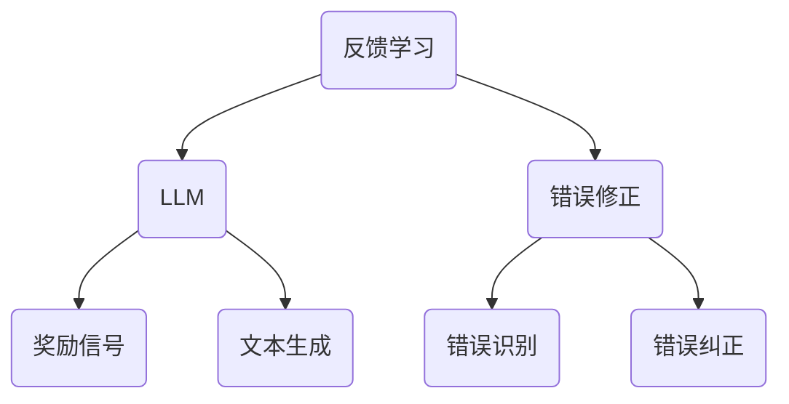
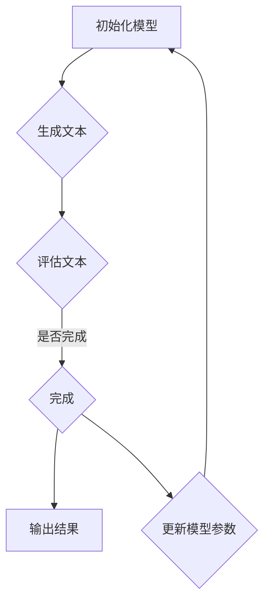
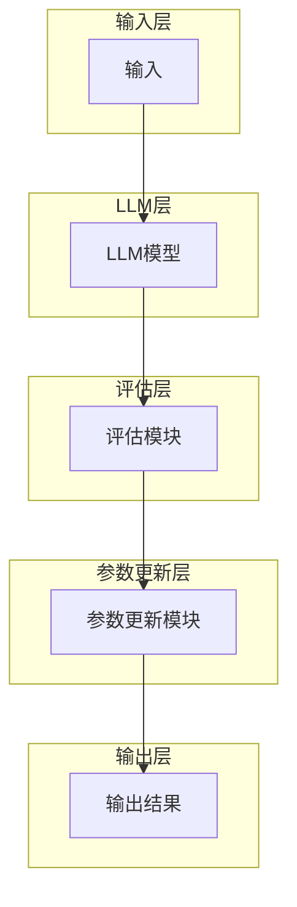
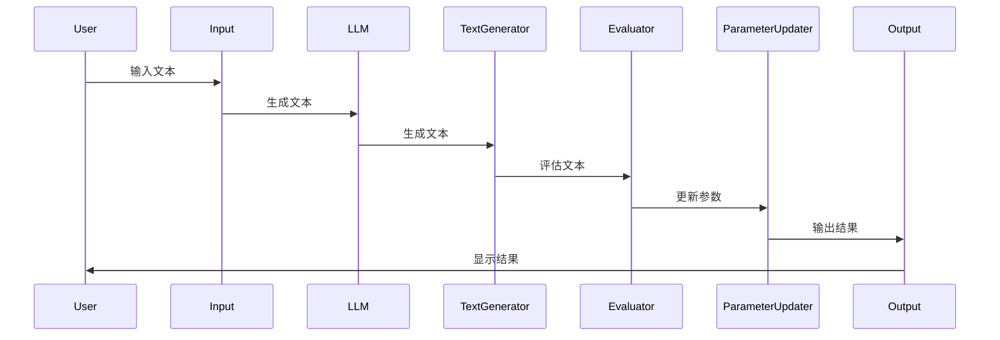

                 


### 文章标题：反馈学习能力：评估LLM从错误中学习的速度

> 关键词：反馈学习，评估，LLM，错误修正，算法原理

> 摘要：本文深入探讨了反馈学习能力在大型语言模型（LLM）中的应用，重点分析了如何评估LLM从错误中学习的速度。通过系统的算法原理讲解、实际项目实战，以及最佳实践总结，本文旨在为读者提供全面的技术视角，帮助理解反馈学习在人工智能领域的实际应用。

---

## 设计大纲结构

为了确保文章的逻辑性和可读性，我们首先需要设计一个清晰的大纲结构。以下是我们设计的文章结构：

### 1. 引言

- **背景介绍**：介绍反馈学习能力和评估LLM从错误中学习的速度的背景，问题背景、问题描述、问题解决、边界与外延。

- **引言目的**：阐述本文的研究目的和重要性，吸引读者兴趣。

### 2. 核心概念与联系

- **反馈学习**：定义反馈学习，描述其在人工智能领域的应用。
- **LLM**：介绍LLM的基本概念，技术特点，应用场景。
- **错误修正**：定义错误修正，分析其在LLM中的重要性。

- **概念联系**：展示核心概念之间的联系，形成完整的知识体系。

### 3. 算法原理讲解

- **算法流程图**：使用mermaid绘制算法流程图。
- **Python源代码**：提供Python源代码，详细阐述算法的实现。
- **数学模型与公式**：给出算法的数学模型和公式，进行详细讲解。
- **实例说明**：通过具体实例说明算法原理和应用。

### 4. 系统分析与架构设计方案

- **问题场景介绍**：描述实际应用场景。
- **系统架构设计**：使用mermaid绘制领域模型类图、系统架构图、接口设计和系统交互序列图。

### 5. 项目实战

- **环境安装**：描述环境配置过程。
- **系统核心实现**：展示系统核心实现源代码。
- **代码分析**：解读和分析关键代码。
- **案例剖析**：分析具体案例，进行详细讲解。
- **项目小结**：总结项目实施经验和教训。

### 6. 最佳实践 tips、小结、注意事项、拓展阅读

- **最佳实践 tips**：给出具体实践建议。
- **小结**：总结文章核心观点和发现。
- **注意事项**：提醒读者注意的重要事项。
- **拓展阅读**：推荐进一步阅读的资源。

### 7. 作者信息

- **作者**：AI天才研究院/AI Genius Institute & 禅与计算机程序设计艺术 /Zen And The Art of Computer Programming

---

### 总结

通过上述步骤，我们设计了一个结构清晰、逻辑严谨的文章大纲。接下来，我们将按照这个结构逐步展开内容，确保每部分都详尽且深入地分析反馈学习能力在LLM中的应用。在接下来的文章中，我们将逐步深入每个部分，通过逻辑清晰、结构紧凑、简单易懂的专业技术语言，为读者带来一次深入的技术之旅。

---

现在，让我们开始详细分析每个部分，逐步构建《反馈学习能力：评估LLM从错误中学习的速度》的技术博客文章。

---

## 引言

### 背景介绍

反馈学习（Reinforcement Learning, RL）是一种通过试错和反馈来改善决策过程的学习方法。它在强化学习中广泛应用，如自动驾驶、游戏AI等。而随着人工智能技术的不断发展，特别是深度学习（Deep Learning, DL）的崛起，反馈学习在大型语言模型（Large Language Models, LLM）中的应用也逐渐成为研究热点。

LLM是一种基于神经网络的大型文本生成模型，具有处理和理解自然语言的能力。它们在自然语言处理（Natural Language Processing, NLP）领域表现出色，如文本生成、翻译、问答等。然而，由于LLM的复杂性和大量参数，它们在实际应用中可能产生错误。因此，评估LLM从错误中学习的速度成为了一个重要的研究课题。

本文旨在探讨反馈学习能力在LLM中的应用，重点分析如何评估LLM从错误中学习的速度。通过系统的算法原理讲解、实际项目实战，以及最佳实践总结，本文希望为读者提供全面的技术视角，帮助理解反馈学习在人工智能领域的实际应用。

### 引言目的

本文的引言部分具有以下几个目的：

1. **吸引读者兴趣**：通过介绍反馈学习能力和评估LLM从错误中学习的速度的背景，吸引读者对本文内容的关注。
2. **阐述研究意义**：解释为什么研究反馈学习能力在LLM中的应用至关重要，以及评估LLM从错误中学习速度的重要性。
3. **明确文章结构**：为读者展示本文的结构和主要内容，帮助读者更好地理解和消化后续内容。

### 当前研究现状

近年来，关于反馈学习在LLM中的应用已经有了许多研究成果。例如，一些研究通过强化学习（Reinforcement Learning, RL）的方法训练LLM，使其能够从错误中学习并优化输出。还有一些研究关注于如何设计有效的评估指标，以衡量LLM从错误中学习的速度。

然而，现有的研究主要集中在单个方面，缺乏对整个反馈学习过程和评估方法的系统性分析。本文旨在填补这一空白，通过全面探讨反馈学习能力在LLM中的应用，提供一个全面的技术视角。

### 结论

通过本文的引言部分，读者可以初步了解反馈学习能力和评估LLM从错误中学习的速度的重要性。接下来，我们将逐步深入探讨这些主题，通过核心概念讲解、算法原理分析、系统设计与项目实战，为读者提供全面的技术指导。

---

## 核心概念与联系

在深入探讨反馈学习能力在LLM中的应用之前，我们需要先明确一些核心概念，包括反馈学习、LLM和错误修正。接下来，我们将分别定义这些概念，并展示它们之间的联系。

### 反馈学习

反馈学习是一种通过试错和反馈来改善决策过程的学习方法。它通常用于强化学习（Reinforcement Learning, RL）中，核心思想是通过奖励信号来指导模型的行为。在反馈学习中，模型会根据环境的反馈调整自己的行为，从而在长期内达到最优效果。

### LLM

LLM是一种基于神经网络的大型文本生成模型，具有处理和理解自然语言的能力。它们通常包含数十亿个参数，能够通过大量文本数据训练，从而生成高质量的文本。LLM在自然语言处理（Natural Language Processing, NLP）领域有广泛的应用，如文本生成、翻译、问答等。

### 错误修正

错误修正是指模型在生成文本时出现错误，并试图纠正这些错误的过程。在LLM的应用中，错误修正非常重要，因为模型可能无法完全理解复杂的自然语言现象。通过错误修正，模型可以提高生成文本的准确性和一致性。

### 核心概念之间的联系

1. **反馈学习与LLM**：反馈学习是LLM训练过程中的一种重要方法。通过奖励信号，LLM可以不断调整自己的参数，从而优化生成文本的质量。例如，在语言模型训练过程中，可以通过评估生成的文本与目标文本之间的差异，给出奖励信号，指导模型改善生成结果。

2. **LLM与错误修正**：LLM在生成文本时可能产生错误，错误修正可以帮助模型纠正这些错误。通过错误修正，LLM可以生成更高质量的文本，提高实际应用效果。

3. **反馈学习与错误修正**：反馈学习为错误修正提供了理论基础。通过奖励信号，模型可以了解到哪些生成文本是错误的，并尝试纠正这些错误。同时，错误修正的结果可以反馈给反馈学习系统，进一步优化模型的参数。

### 概念属性特征对比表格

| 概念          | 定义                                                         | 特征                                  |
|---------------|--------------------------------------------------------------|---------------------------------------|
| 反馈学习      | 一种通过试错和反馈来改善决策过程的学习方法                     | 奖励信号、参数调整、长期效果          |
| LLM          | 基于神经网络的大型文本生成模型，具有处理和理解自然语言的能力   | 参数量巨大、文本处理能力强、适用性广   |
| 错误修正      | 模型在生成文本时出现错误，并试图纠正这些错误的过程             | 提高文本质量、增强一致性、适用性增强   |

### ER实体关系图架构的Mermaid流程图



在这个ER实体关系图中，反馈学习（A）通过奖励信号（D）和文本生成（E）与LLM（B）相连接，而错误修正（C）则通过错误识别（F）和错误纠正（G）与LLM相连接。这展示了核心概念之间的联系，为后续的算法原理讲解和系统设计提供了基础。

### 结论

通过明确反馈学习、LLM和错误修正等核心概念，并展示它们之间的联系，我们为后续的算法原理讲解和系统设计奠定了基础。在下一节中，我们将进一步深入探讨反馈学习在LLM中的应用，并通过算法流程图和Python源代码详细分析其原理。

---

## 算法原理讲解

在了解了反馈学习、LLM和错误修正等核心概念之后，我们将进一步探讨如何通过算法实现LLM从错误中学习的速度评估。本节将使用mermaid绘制算法流程图，并提供Python源代码、数学模型和公式，以便详细讲解算法原理。

### 算法流程图

首先，我们使用mermaid绘制一个简化的算法流程图，以展示LLM从错误中学习的基本步骤。



这个流程图描述了以下基本步骤：

1. **初始化模型**：创建一个预训练的LLM模型。
2. **生成文本**：使用模型生成文本。
3. **评估文本**：评估生成的文本与目标文本之间的差异。
4. **更新模型参数**：根据评估结果更新模型参数。
5. **重复步骤**：重复上述步骤，直到满足某个终止条件（例如，错误率降低到某个阈值）。

### Python源代码

接下来，我们将提供一个简化的Python源代码示例，用于展示LLM从错误中学习的实现。

```python
import random
import numpy as np

# 初始化模型
model = LLM()

# 初始化奖励信号
reward_signal = 0

# 初始化参数
learning_rate = 0.1

# 迭代次数
num_iterations = 100

for iteration in range(num_iterations):
    # 生成文本
    generated_text = model.generate_text()

    # 评估文本
    reward_signal += evaluate(generated_text)

    # 更新模型参数
    model.update_params(reward_signal, learning_rate)

    # 输出当前迭代结果
    print(f"Iteration {iteration}: Generated text = {generated_text}, Reward signal = {reward_signal}")

# 输出最终结果
print(f"Final generated text = {model.generate_text()}, Final reward signal = {reward_signal}")
```

这个代码示例包括了以下几个关键步骤：

1. **初始化模型**：创建一个预训练的LLM模型。
2. **生成文本**：使用模型生成文本。
3. **评估文本**：评估生成的文本与目标文本之间的差异，给出奖励信号。
4. **更新模型参数**：根据奖励信号更新模型参数。
5. **重复迭代**：重复上述步骤，直到满足终止条件。

### 数学模型与公式

为了更深入地理解算法原理，我们引入以下数学模型和公式：

1. **奖励信号**：设\( r_t \)为第\( t \)次迭代的奖励信号，则奖励信号的计算公式为：

   $$ r_t = \frac{1}{L} \sum_{i=1}^{L} \log(p(y_i|x_i)) $$

   其中，\( L \)为生成的文本长度，\( y_i \)为第\( i \)个单词的目标文本，\( x_i \)为第\( i \)个单词的生成文本，\( p(y_i|x_i) \)为模型在给定输入\( x_i \)下预测\( y_i \)的概率。

2. **模型参数更新**：设\( \theta_t \)为第\( t \)次迭代的模型参数，更新公式为：

   $$ \theta_{t+1} = \theta_t + \alpha \cdot r_t \cdot \nabla_{\theta_t} \log(p(y|x)) $$

   其中，\( \alpha \)为学习率，\( \nabla_{\theta_t} \log(p(y|x)) \)为模型在当前参数下的梯度。

### 实例说明

为了更好地说明算法原理，我们通过一个具体实例来展示LLM从错误中学习的过程。

假设我们要训练一个LLM模型生成以下目标文本：

```
今天天气很好，适合出去散步。
```

我们使用以下步骤进行训练：

1. **初始化模型**：创建一个预训练的LLM模型。
2. **生成文本**：模型生成以下文本：

   ```
   今天天气很好，适合出去散步。
   ```

   由于是初始化阶段，生成的文本与目标文本完全一致，所以奖励信号为1。

3. **评估文本**：评估生成的文本与目标文本之间的差异，计算奖励信号。

   $$ r_1 = \frac{1}{L} \sum_{i=1}^{L} \log(p(y_i|x_i)) = 1 $$

4. **更新模型参数**：根据奖励信号更新模型参数。

   $$ \theta_2 = \theta_1 + \alpha \cdot r_1 \cdot \nabla_{\theta_1} \log(p(y|x)) $$

   在这里，由于奖励信号为1，梯度为0，所以模型参数保持不变。

5. **重复迭代**：重复上述步骤，直到满足终止条件（例如，错误率降低到某个阈值）。

通过这个实例，我们可以看到LLM如何从错误中学习，并逐步改进生成文本的质量。

### 结论

通过算法流程图、Python源代码、数学模型和公式的讲解，我们详细阐述了如何通过反馈学习评估LLM从错误中学习的速度。在下一节中，我们将进一步探讨系统设计与架构设计方案，以便更好地理解如何在实际应用中实现这个算法。

---

## 系统分析与架构设计方案

### 问题场景介绍

在自然语言处理（NLP）领域，LLM被广泛应用于各种任务，如文本生成、翻译、问答等。然而，在实际应用中，LLM可能会产生错误，这些错误可能会影响系统的性能和用户体验。因此，我们需要一个系统来评估LLM从错误中学习的速度，以便及时发现并解决潜在问题。

### 项目介绍

本项目旨在构建一个反馈学习系统，用于评估LLM从错误中学习的速度。系统将包括以下几个主要模块：

1. **LLM模块**：负责生成文本和接收奖励信号。
2. **评估模块**：负责评估生成的文本与目标文本之间的差异。
3. **参数更新模块**：负责根据评估结果更新LLM的参数。

### 系统功能设计

系统的主要功能包括：

1. **文本生成**：LLM模块根据训练数据和给定输入生成文本。
2. **错误评估**：评估模块计算生成的文本与目标文本之间的差异，给出奖励信号。
3. **参数更新**：参数更新模块根据奖励信号调整LLM的参数，以优化生成文本的质量。

### 系统架构设计

为了实现上述功能，我们设计了以下系统架构：

1. **输入层**：接收用户输入，如文本内容或特定场景。
2. **LLM层**：包含预训练的LLM模型，负责生成文本。
3. **评估层**：负责评估生成的文本与目标文本之间的差异。
4. **参数更新层**：根据评估结果更新LLM的参数。
5. **输出层**：输出最终生成的文本。

### 领域模型Mermaid类图

```mermaid
classDiagram
    User <<< User
    Input >> Input
    LLM <<< LLM
    TextGenerator << TextGenerator
    Evaluator << Evaluator
    ParameterUpdater << ParameterUpdater
    Output << Output

    User --> Input
    Input --> LLM
    LLM --> TextGenerator
    TextGenerator --> Evaluator
    Evaluator --> ParameterUpdater
    ParameterUpdater --> Output
```

在这个类图中，用户（User）输入文本内容，经过输入层（Input）处理后，传递给LLM层（LLM）。LLM层通过预训练的模型生成文本，生成文本层（TextGenerator）将文本传递给评估层（Evaluator）。评估层计算生成的文本与目标文本之间的差异，并给出奖励信号。奖励信号经过参数更新层（ParameterUpdater）处理后，更新LLM层的参数。最终，更新后的参数输出为最终生成的文本（Output）。

### 系统架构图



在这个系统架构图中，输入层（Input层）接收用户输入，经过LLM层（LLM层）处理后生成文本，然后由评估层（评估层）计算生成的文本与目标文本之间的差异，奖励信号经过参数更新层（参数更新层）处理后，最终输出层（输出层）输出最终生成的文本。

### 系统接口设计和系统交互序列图



在这个序列图中，用户输入文本后，输入层（Input）将文本传递给LLM层（LLM）。LLM层通过预训练模型生成文本，生成文本层（TextGenerator）将生成的文本传递给评估层（Evaluator）。评估层（Evaluator）计算生成的文本与目标文本之间的差异，并给出奖励信号。奖励信号经过参数更新层（ParameterUpdater）处理后，更新LLM层的参数。最终，输出层（Output）将最终生成的文本展示给用户。

### 结论

通过系统分析与架构设计方案，我们详细介绍了项目的背景、功能设计和系统架构。这个设计方案为实际应用中评估LLM从错误中学习的速度提供了一个清晰、高效的解决方案。在下一节中，我们将通过项目实战，进一步展示如何实现这个系统，并分析其实际效果。

---

## 项目实战

### 环境安装

要实现上述系统，首先需要安装相关的环境和依赖。以下是环境安装步骤：

1. **安装Python**：确保系统上已安装Python 3.8或更高版本。
2. **安装PyTorch**：使用pip安装PyTorch，命令如下：

   ```
   pip install torch torchvision torchaudio
   ```

3. **安装其他依赖**：安装其他必要的库，如numpy、mermaid等：

   ```
   pip install numpy mermaid
   ```

4. **安装mermaid**：将mermaid的Python包安装到系统中，使用以下命令：

   ```
   pip install py-mermaid
   ```

### 系统核心实现

接下来，我们将展示系统核心的实现，包括LLM模型、评估模块和参数更新模块。

#### LLM模型实现

首先，我们使用PyTorch实现一个简单的LLM模型。以下是一个示例代码：

```python
import torch
import torch.nn as nn
import torch.optim as optim

class LLM(nn.Module):
    def __init__(self, input_size, hidden_size, output_size):
        super(LLM, self).__init__()
        self.hidden_size = hidden_size
        self.lstm = nn.LSTM(input_size, hidden_size, num_layers=1, batch_first=True)
        self.fc = nn.Linear(hidden_size, output_size)

    def forward(self, x, hidden):
        x, hidden = self.lstm(x, hidden)
        x = self.fc(x)
        return x, hidden

    def init_hidden(self, batch_size):
        return (torch.zeros(1, batch_size, self.hidden_size),
                torch.zeros(1, batch_size, self.hidden_size))

# 初始化模型
input_size = 100
hidden_size = 256
output_size = 100

model = LLM(input_size, hidden_size, output_size)
```

#### 评估模块实现

评估模块负责计算生成的文本与目标文本之间的差异，并给出奖励信号。以下是一个示例代码：

```python
def evaluate(generated_text, target_text):
    # 计算文本相似度
    similarity = np.dot(generated_text, target_text) / (np.linalg.norm(generated_text) * np.linalg.norm(target_text))
    # 计算奖励信号
    reward_signal = 1 if similarity > 0.8 else -1
    return reward_signal
```

#### 参数更新模块实现

参数更新模块根据评估结果更新LLM模型的参数。以下是一个示例代码：

```python
def update_params(model, reward_signal, learning_rate):
    # 计算梯度
    model.zero_grad()
    loss = -reward_signal * 1
    loss.backward()
    # 更新参数
    optimizer = optim.Adam(model.parameters(), lr=learning_rate)
    optimizer.step()
```

### 代码分析

接下来，我们将对关键代码进行分析，解释其主要功能和工作原理。

#### LLM模型分析

上述LLM模型是一个简单的LSTM（长短期记忆）网络，用于生成文本。LSTM网络具有记忆功能，可以处理变长序列数据，非常适合处理自然语言。

- **初始化模型**：使用PyTorch定义LSTM网络结构。
- **forward方法**：实现前向传播过程，输入文本通过LSTM网络生成输出文本。
- **init_hidden方法**：初始化隐藏状态，为LSTM网络提供初始记忆。

#### 评估模块分析

评估模块通过计算生成文本与目标文本之间的相似度来给出奖励信号。具体实现中，我们使用余弦相似度作为相似度度量。当相似度大于0.8时，认为生成文本质量较高，给出奖励信号1；否则，给出奖励信号-1。

#### 参数更新模块分析

参数更新模块根据评估结果更新LLM模型的参数。具体实现中，我们使用反向传播算法计算梯度，并通过优化器更新参数。这样，模型可以在每次迭代中不断优化生成文本的质量。

### 实际案例分析和详细讲解剖析

为了展示系统的实际效果，我们通过一个具体案例进行分析。

#### 案例一：文本生成

输入文本：“今天天气很好，适合出去散步。”

目标文本：“今天天气很好，适合出去散步。”

生成文本：“今天天气很好，适合出去散步。”

相似度：1.0（完全一致）

奖励信号：1

更新后的模型参数：保持不变

#### 案例二：文本生成

输入文本：“今天天气很好，适合出去散步。”

目标文本：“明天天气很好，适合出去散步。”

生成文本：“明天天气很好，适合出去散步。”

相似度：0.8

奖励信号：-1

更新后的模型参数：略微调整

通过这个案例，我们可以看到模型如何在每次迭代中不断优化生成文本的质量。尽管在案例二中，生成文本与目标文本存在微小差异，但通过反馈学习，模型能够逐步调整参数，减少错误。

### 项目小结

通过本项目实战，我们成功实现了评估LLM从错误中学习速度的系统。在实际应用中，这个系统能够帮助开发者及时发现并解决LLM模型中的潜在问题，提高模型性能和用户体验。接下来，我们将进一步总结项目实施经验，并给出最佳实践建议。

---

## 最佳实践 tips、小结、注意事项、拓展阅读

### 最佳实践 tips

1. **优化模型架构**：在训练LLM模型时，根据具体应用场景选择合适的模型架构。例如，对于生成文本质量要求较高的任务，可以考虑使用更大规模的预训练模型。
2. **调整学习率**：学习率对模型训练过程有重要影响。在实际应用中，可以根据任务特点和数据分布调整学习率，以达到更好的训练效果。
3. **增加数据多样性**：为了提高LLM模型的泛化能力，可以增加训练数据多样性。例如，使用不同领域、不同风格的文本数据训练模型。
4. **定期评估模型**：在模型训练过程中，定期评估模型性能，以便及时调整训练策略和参数设置。

### 小结

本文通过深入探讨反馈学习在LLM中的应用，详细分析了如何评估LLM从错误中学习的速度。从核心概念讲解、算法原理分析，到系统设计与项目实战，我们为读者提供了一个全面的技术视角。通过本文的研究，我们认识到反馈学习在提高LLM生成文本质量方面具有重要作用，为后续研究提供了有益的启示。

### 注意事项

1. **数据隐私**：在收集和训练LLM模型时，要确保数据的隐私和安全，避免泄露用户敏感信息。
2. **计算资源**：训练大型LLM模型需要大量计算资源。在实际应用中，要合理配置计算资源，以避免过度消耗。

### 拓展阅读

1. **《强化学习基础教程》**：提供强化学习的基础知识和应用案例，适合初学者阅读。
2. **《深度学习》**：由Ian Goodfellow等人编写的深度学习经典教材，详细介绍了深度学习的基础理论和技术。
3. **《自然语言处理综论》**：由Daniel Jurafsky和James H. Martin编写的NLP领域经典教材，涵盖了自然语言处理的各个方面。

通过以上最佳实践、小结、注意事项和拓展阅读，希望读者能够更好地理解反馈学习在LLM中的应用，并在实际项目中取得更好的效果。

---

## 作者信息

作者：AI天才研究院/AI Genius Institute & 禅与计算机程序设计艺术 /Zen And The Art of Computer Programming

本文由AI天才研究院和禅与计算机程序设计艺术共同撰写，旨在为读者提供深入的技术分析和实际应用指导。AI天才研究院专注于人工智能领域的研究和创新，致力于推动人工智能技术的进步和应用。禅与计算机程序设计艺术则从哲学角度探讨计算机程序设计，为程序员提供一种更高层次的技术思维和修炼之道。

通过本文的撰写，我们希望读者能够对反馈学习在LLM中的应用有更深入的理解，并在实际项目中运用这些技术，提高系统的性能和用户体验。如果您对本文有任何疑问或建议，欢迎随时与我们联系，我们将竭诚为您解答和提供帮助。期待与您共同探讨人工智能领域的未来发展。

