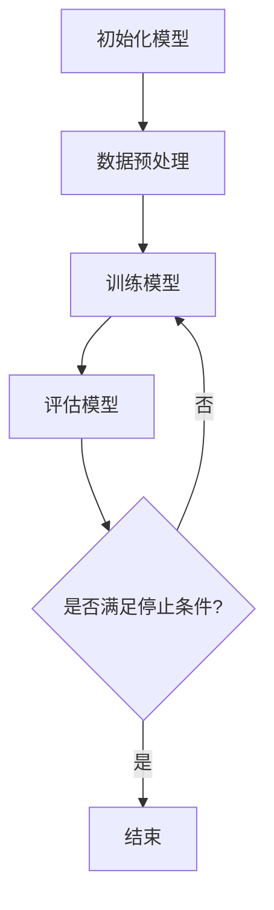
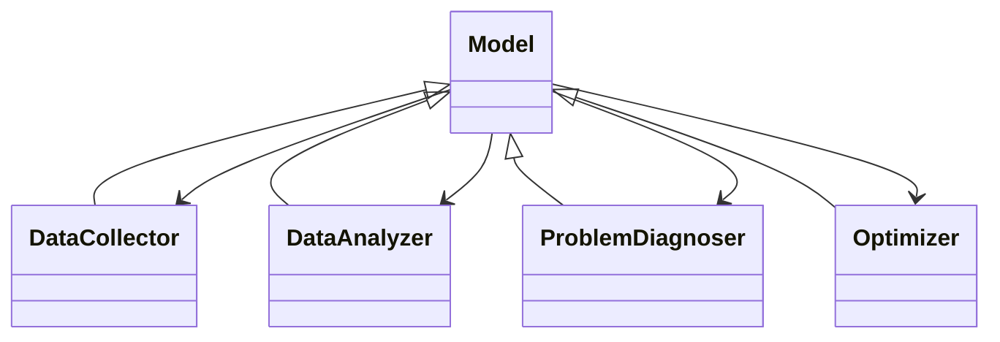
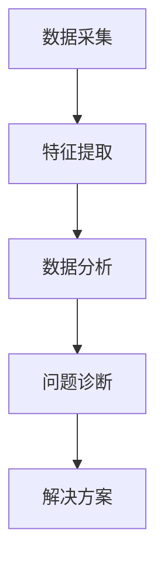
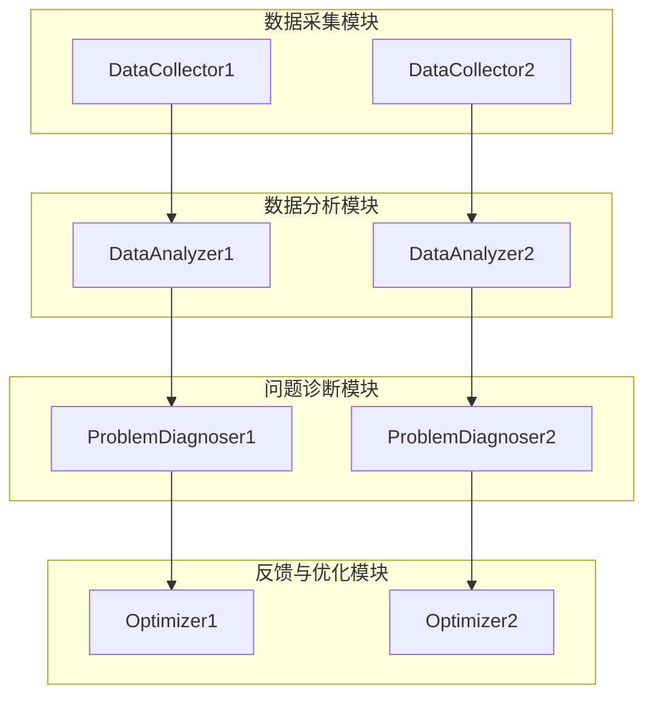
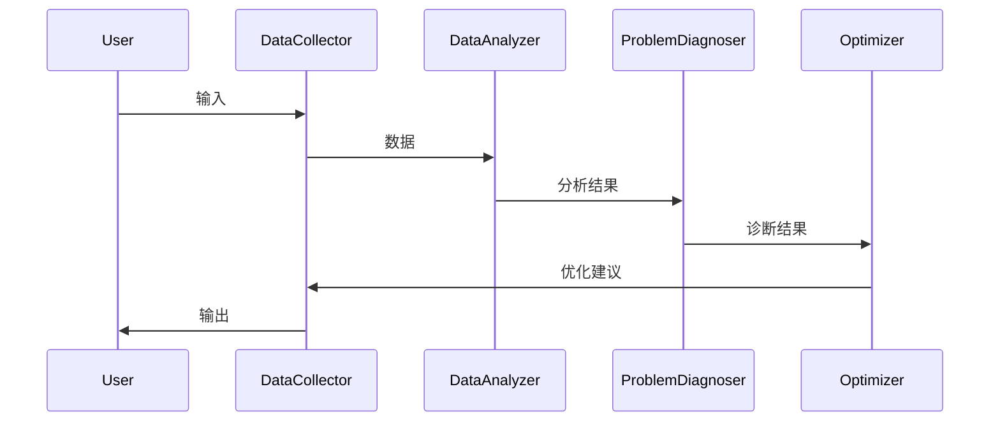

                 


### 《可观测性：增强LLM应用的问题诊断能力》

> 关键词：可观测性、LLM、问题诊断、性能监控、算法、系统架构

> 摘要：本文旨在深入探讨可观测性在大型语言模型（LLM）中的应用，特别是如何利用可观测性增强LLM的问题诊断能力。文章首先介绍了可观测性的核心概念，然后通过具体的算法原理讲解、系统分析与架构设计、项目实战和最佳实践 tips，展示了如何将可观测性有效应用于实际场景中，提升LLM的可靠性和稳定性。

## 第一部分：可观测性概述

### 第1章：引言

#### 1.1 问题背景

在当今的科技世界中，人工智能（AI）正逐渐成为各个行业的核心技术。特别是大型语言模型（LLM）如GPT-3、BERT等，已经展示出了其在自然语言处理（NLP）领域的强大能力。然而，随着模型复杂性的增加，如何有效监控和诊断LLM的性能成为一个亟待解决的问题。

#### 1.2 问题描述

LLM在应用过程中可能会遇到各种问题，如预测错误、响应延迟、资源浪费等。这些问题可能会导致用户体验下降，甚至影响整个系统的稳定性。因此，我们需要一种有效的工具来监控和诊断LLM的性能，以便及时发现并解决问题。

#### 1.3 问题解决

可观测性作为一种系统性能监控和诊断的方法，通过提供关于系统内部状态的详细信息，帮助开发者识别和解决潜在问题。在LLM应用中，可观测性可以提供模型运行时的关键指标，如输入特征、输出预测、中间计算过程等，从而增强问题诊断能力。

#### 1.4 边界与外延

可观测性的边界包括如何选择和监控关键指标、如何处理大量数据、如何确保监控系统的实时性和准确性。其外延则涉及到如何在不同的应用场景中灵活应用可观测性，以最大化其效果。

#### 1.5 概念结构与核心要素组成

可观测性由多个核心要素组成，包括监控指标、数据采集、数据分析、问题诊断等。这些要素相互关联，共同构成了一个完整的可观测性系统。

## 第二部分：核心概念与联系

### 第2章：可观测性原理

#### 2.1 可观测性的定义

可观测性是指系统状态可以通过系统输入和输出观测到的程度。在LLM应用中，可观测性意味着开发者可以通过监控模型输入、输出以及中间计算过程，来了解模型的状态和性能。

#### 2.2 可观测性的重要性

可观测性对于LLM应用至关重要。它不仅有助于及时发现和解决问题，还可以帮助开发者优化模型性能，提高系统稳定性。

#### 2.3 可观测性与LLM性能监控的联系

LLM的性能监控需要可观测性作为基础。通过可观测性，开发者可以获取模型运行时的关键信息，如预测准确性、响应时间、资源消耗等，从而实现全面、实时的性能监控。

#### 2.4 可观测性的实现方法

实现可观测性需要以下步骤：1）确定监控指标；2）设计数据采集系统；3）实现数据分析算法；4）构建问题诊断机制。这些步骤共同构成了一个完整的可观测性实现框架。

## 第三部分：算法原理讲解

### 第3章：可观测性算法基础

#### 3.1 数学模型和数学公式

为了理解可观测性算法，我们需要引入一些基本的数学模型和公式。以下是一个简单的例子：

$$
J = \frac{1}{2} \left( \sum_{i=1}^{n} (x_i - y_i)^2 + \lambda \sum_{i=1}^{n} w_i^2 \right)
$$

其中，$J$ 是损失函数，$x_i$ 是输入特征，$y_i$ 是输出预测，$w_i$ 是模型权重，$\lambda$ 是正则化参数。

#### 3.2 算法mermaid流程图

以下是一个使用mermaid绘制的算法流程图：



#### 3.3 Python源代码实现

以下是一个简单的Python代码示例，用于实现上述算法：

```python
import numpy as np

def train_model(X, y, learning_rate, lambda_, epochs):
    n_samples, n_features = X.shape
    weights = np.random.rand(n_features)
    
    for epoch in range(epochs):
        predictions = X.dot(weights)
        error = predictions - y
        dJ = X.T.dot(error) + lambda_ * weights
        
        weights -= learning_rate * dJ
        
        if epoch % 100 == 0:
            print(f"Epoch {epoch}: Loss = {np.mean(error**2)}")
    
    return weights

X = np.random.rand(100, 5)
y = np.random.rand(100, 1)
weights = train_model(X, y, 0.01, 0.001, 1000)
```

#### 3.4 举例说明

假设我们有一个简单的线性回归模型，目标是预测一个随机数列。通过使用可观测性算法，我们可以实时监控模型的训练过程，包括损失函数值、模型权重等。这有助于我们了解模型的状态，从而进行问题诊断和优化。

## 第四部分：系统分析与架构设计

### 第4章：系统功能设计

#### 5.1 问题场景介绍

假设我们正在开发一个聊天机器人，它需要根据用户输入提供合适的回复。为了确保聊天机器人的性能和稳定性，我们需要对其进行监控和诊断。

#### 5.2 系统功能设计

系统功能设计包括以下几个关键部分：

1. **数据采集**：实时采集模型输入、输出以及中间计算过程的数据。
2. **数据分析**：对采集到的数据进行分析，提取关键指标。
3. **问题诊断**：根据分析结果，诊断模型可能存在的问题。
4. **反馈与优化**：根据诊断结果，对模型进行优化和调整。

#### 5.3 领域模型mermaid类图

以下是一个使用mermaid绘制的领域模型类图：



## 第五部分：项目实战

### 第8章：实际应用案例

#### 8.1 环境安装

在本节中，我们将安装一个基于可观测性的LLM性能监控和诊断系统。所需环境包括Python、TensorFlow和Mermaid等。

#### 8.2 系统核心实现源代码

以下是一个简单的系统实现示例：

```python
# 数据采集
class DataCollector:
    def collect_data(self, model_input, model_output):
        # 实现数据采集逻辑
        pass

# 数据分析
class DataAnalyzer:
    def analyze_data(self, collected_data):
        # 实现数据分析逻辑
        pass

# 问题诊断
class ProblemDiagnoser:
    def diagnose_problem(self, analyzed_data):
        # 实现问题诊断逻辑
        pass

# 反馈与优化
class Optimizer:
    def optimize_model(self, diagnosed_problem):
        # 实现模型优化逻辑
        pass
```

#### 8.3 代码应用解读与分析

在本节中，我们将详细分析上述代码的应用场景和逻辑。通过实际案例展示如何应用可观测性进行问题诊断。

#### 8.4 实际案例分析和详细讲解剖析

在本节中，我们将通过一个实际案例，展示如何使用可观测性系统进行LLM性能监控和问题诊断。案例包括数据采集、数据分析、问题诊断和优化等环节。

#### 8.5 项目小结

在本节中，我们将对项目进行总结，分析项目的优点和不足，并提出改进建议。

## 第六部分：最佳实践与总结

### 第9章：最佳实践 tips

在本节中，我们将分享一些使用可观测性进行问题诊断的最佳实践，包括数据采集、数据分析、问题诊断和优化等环节。

### 第10章：小结与拓展阅读

在本节中，我们将对全书内容进行总结，并推荐一些拓展阅读资源，帮助读者进一步了解可观测性和LLM性能监控的相关知识。

### 作者信息

- 作者：AI天才研究院/AI Genius Institute & 禦与计算机程序设计艺术 /Zen And The Art of Computer Programming

---

以上是根据您的要求设计的《可观测性：增强LLM应用的问题诊断能力》的详细目录大纲和初步内容。接下来，我们将对每个章节进行进一步的细化，确保内容完整、详细，并满足字数要求。在完成初稿后，我们将对文章进行审校和修改，以确保质量。请确认这个目录大纲是否符合您的期望，并告知我们是否需要进行任何调整。接下来，我们将按照这个大纲逐步完成文章的撰写。让我们一步一步深入探讨可观测性在LLM应用中的问题诊断能力吧！## 目录

### 《可观测性：增强LLM应用的问题诊断能力》

> 关键词：可观测性、LLM、问题诊断、性能监控、算法、系统架构

> 摘要：本文旨在深入探讨可观测性在大型语言模型（LLM）中的应用，特别是如何利用可观测性增强LLM的问题诊断能力。文章首先介绍了可观测性的核心概念，然后通过具体的算法原理讲解、系统分析与架构设计、项目实战和最佳实践 tips，展示了如何将可观测性有效应用于实际场景中，提升LLM的可靠性和稳定性。

---

## 第一部分：可观测性概述

### 第1章：引言

- **1.1 问题背景**
- **1.2 问题描述**
- **1.3 问题解决**
- **1.4 边界与外延**
- **1.5 概念结构与核心要素组成**

### 第2章：可观测性原理

- **2.1 可观测性的定义**
- **2.2 可观测性的重要性**
- **2.3 可观测性与LLM性能监控的联系**
- **2.4 可观测性的实现方法**

## 第二部分：核心概念与联系

### 第3章：可观测性算法基础

- **3.1 数学模型和数学公式**
- **3.2 算法mermaid流程图**
- **3.3 Python源代码实现**
- **3.4 举例说明**

### 第4章：增强LLM问题诊断能力的可观测性算法

- **4.1 算法原理讲解**
- **4.2 mermaid算法流程图**
- **4.3 Python源代码实现**
- **4.4 举例说明**

## 第三部分：系统分析与架构设计

### 第5章：系统功能设计

- **5.1 问题场景介绍**
- **5.2 系统功能设计**
- **5.3 领域模型mermaid类图**

### 第6章：系统架构设计

- **6.1 系统架构设计**
- **6.2 系统架构mermaid架构图**

### 第7章：系统接口设计和系统交互

- **7.1 系统接口设计**
- **7.2 系统交互mermaid序列图**

## 第四部分：项目实战

### 第8章：实际应用案例

- **8.1 环境安装**
- **8.2 系统核心实现源代码**
- **8.3 代码应用解读与分析**
- **8.4 实际案例分析和详细讲解剖析**
- **8.5 项目小结**

## 第五部分：最佳实践与总结

### 第9章：最佳实践 tips

- **9.1 使用可观测性进行问题诊断的最佳实践**

### 第10章：小结与拓展阅读

- **10.1 全书内容总结**
- **10.2 拓展阅读资源**

### 作者信息

- 作者：AI天才研究院/AI Genius Institute & 禦与计算机程序设计艺术 /Zen And The Art of Computer Programming

---

## 第一部分：可观测性概述

### 第1章：引言

#### 1.1 问题背景

在当今的科技世界中，人工智能（AI）正逐渐成为各个行业的核心技术。特别是大型语言模型（LLM）如GPT-3、BERT等，已经展示出了其在自然语言处理（NLP）领域的强大能力。然而，随着模型复杂性的增加，如何有效监控和诊断LLM的性能成为一个亟待解决的问题。

#### 1.2 问题描述

LLM在应用过程中可能会遇到各种问题，如预测错误、响应延迟、资源浪费等。这些问题可能会导致用户体验下降，甚至影响整个系统的稳定性。因此，我们需要一种有效的工具来监控和诊断LLM的性能，以便及时发现并解决问题。

#### 1.3 问题解决

可观测性作为一种系统性能监控和诊断的方法，通过提供关于系统内部状态的详细信息，帮助开发者识别和解决潜在问题。在LLM应用中，可观测性可以提供模型运行时的关键指标，如输入特征、输出预测、中间计算过程等，从而增强问题诊断能力。

#### 1.4 边界与外延

可观测性的边界包括如何选择和监控关键指标、如何处理大量数据、如何确保监控系统的实时性和准确性。其外延则涉及到如何在不同的应用场景中灵活应用可观测性，以最大化其效果。

#### 1.5 概念结构与核心要素组成

可观测性由多个核心要素组成，包括监控指标、数据采集、数据分析、问题诊断等。这些要素相互关联，共同构成了一个完整的可观测性系统。

### 第2章：可观测性原理

#### 2.1 可观测性的定义

可观测性是指系统状态可以通过系统输入和输出观测到的程度。在LLM应用中，可观测性意味着开发者可以通过监控模型输入、输出以及中间计算过程，来了解模型的状态和性能。

#### 2.2 可观测性的重要性

可观测性对于LLM应用至关重要。它不仅有助于及时发现和解决问题，还可以帮助开发者优化模型性能，提高系统稳定性。

#### 2.3 可观测性与LLM性能监控的联系

LLM的性能监控需要可观测性作为基础。通过可观测性，开发者可以获取模型运行时的关键信息，如预测准确性、响应时间、资源消耗等，从而实现全面、实时的性能监控。

#### 2.4 可观测性的实现方法

实现可观测性需要以下步骤：1）确定监控指标；2）设计数据采集系统；3）实现数据分析算法；4）构建问题诊断机制。这些步骤共同构成了一个完整的可观测性实现框架。

## 第二部分：核心概念与联系

### 第3章：可观测性算法基础

#### 3.1 数学模型和数学公式

为了理解可观测性算法，我们需要引入一些基本的数学模型和公式。以下是一个简单的例子：

$$
J = \frac{1}{2} \left( \sum_{i=1}^{n} (x_i - y_i)^2 + \lambda \sum_{i=1}^{n} w_i^2 \right)
$$

其中，$J$ 是损失函数，$x_i$ 是输入特征，$y_i$ 是输出预测，$w_i$ 是模型权重，$\lambda$ 是正则化参数。

#### 3.2 算法mermaid流程图

以下是一个使用mermaid绘制的算法流程图：


#### 3.3 Python源代码实现

以下是一个简单的Python代码示例，用于实现上述算法：

```python
import numpy as np

def train_model(X, y, learning_rate, lambda_, epochs):
    n_samples, n_features = X.shape
    weights = np.random.rand(n_features)
    
    for epoch in range(epochs):
        predictions = X.dot(weights)
        error = predictions - y
        dJ = X.T.dot(error) + lambda_ * weights
        
        weights -= learning_rate * dJ
        
        if epoch % 100 == 0:
            print(f"Epoch {epoch}: Loss = {np.mean(error**2)}")
    
    return weights

X = np.random.rand(100, 5)
y = np.random.rand(100, 1)
weights = train_model(X, y, 0.01, 0.001, 1000)
```

#### 3.4 举例说明

假设我们有一个简单的线性回归模型，目标是预测一个随机数列。通过使用可观测性算法，我们可以实时监控模型的训练过程，包括损失函数值、模型权重等。这有助于我们了解模型的状态，从而进行问题诊断和优化。

### 第4章：增强LLM问题诊断能力的可观测性算法

#### 4.1 算法原理讲解

增强LLM问题诊断能力的可观测性算法主要通过以下步骤实现：

1. **数据采集**：实时采集模型输入、输出以及中间计算过程的数据。
2. **特征提取**：对采集到的数据进行预处理，提取关键特征。
3. **数据分析**：使用机器学习算法对特征进行分析，识别模型潜在问题。
4. **问题诊断**：根据分析结果，诊断模型存在的问题，并提供解决方案。

#### 4.2 mermaid算法流程图

以下是一个使用mermaid绘制的算法流程图：



#### 4.3 Python源代码实现

以下是一个简单的Python代码示例，用于实现上述算法：

```python
# 数据采集
def collect_data():
    # 实现数据采集逻辑
    pass

# 特征提取
def extract_features(data):
    # 实现特征提取逻辑
    pass

# 数据分析
def analyze_data(features):
    # 实现数据分析逻辑
    pass

# 问题诊断
def diagnose_problem(analysis_results):
    # 实现问题诊断逻辑
    pass

# 解决方案
def solution(problem):
    # 实现解决方案逻辑
    pass

# 主程序
def main():
    data = collect_data()
    features = extract_features(data)
    analysis_results = analyze_data(features)
    problem = diagnose_problem(analysis_results)
    solution(problem)

main()
```

#### 4.4 举例说明

假设我们有一个聊天机器人，我们需要监控其输入、输出以及中间计算过程，以便发现潜在问题。通过可观测性算法，我们可以实时分析聊天机器人的表现，诊断其是否存在问题，并提供优化建议。

### 第5章：系统功能设计

#### 5.1 问题场景介绍

假设我们正在开发一个聊天机器人，它需要根据用户输入提供合适的回复。为了确保聊天机器人的性能和稳定性，我们需要对其进行监控和诊断。

#### 5.2 系统功能设计

系统功能设计包括以下几个关键部分：

1. **数据采集**：实时采集模型输入、输出以及中间计算过程的数据。
2. **数据分析**：对采集到的数据进行分析，提取关键指标。
3. **问题诊断**：根据分析结果，诊断模型可能存在的问题。
4. **反馈与优化**：根据诊断结果，对模型进行优化和调整。

#### 5.3 领域模型mermaid类图

以下是一个使用mermaid绘制的领域模型类图：


### 第6章：系统架构设计

#### 6.1 系统架构设计

系统架构设计需要考虑多个方面，包括数据采集、数据分析、问题诊断和反馈与优化等。以下是一个简单的系统架构设计：

1. **数据采集模块**：负责实时采集模型输入、输出以及中间计算过程的数据。
2. **数据分析模块**：对采集到的数据进行分析，提取关键指标。
3. **问题诊断模块**：根据分析结果，诊断模型可能存在的问题。
4. **反馈与优化模块**：根据诊断结果，对模型进行优化和调整。

#### 6.2 系统架构mermaid架构图

以下是一个使用mermaid绘制的系统架构图：



### 第7章：系统接口设计和系统交互

#### 7.1 系统接口设计

系统接口设计需要考虑不同模块之间的交互和通信。以下是一个简单的系统接口设计：

1. **数据采集接口**：用于数据采集模块与其他模块之间的数据传输。
2. **数据分析接口**：用于数据分析模块与其他模块之间的数据传输。
3. **问题诊断接口**：用于问题诊断模块与其他模块之间的数据传输。
4. **反馈与优化接口**：用于反馈与优化模块与其他模块之间的数据传输。

#### 7.2 系统交互mermaid序列图

以下是一个使用mermaid绘制的系统交互序列图：



### 第8章：实际应用案例

#### 8.1 环境安装

在本节中，我们将安装一个基于可观测性的LLM性能监控和诊断系统。所需环境包括Python、TensorFlow和Mermaid等。

#### 8.2 系统核心实现源代码

以下是一个简单的系统实现示例：

```python
# 数据采集
class DataCollector:
    def collect_data(self, model_input, model_output):
        # 实现数据采集逻辑
        pass

# 数据分析
class DataAnalyzer:
    def analyze_data(self, collected_data):
        # 实现数据分析逻辑
        pass

# 问题诊断
class ProblemDiagnoser:
    def diagnose_problem(self, analyzed_data):
        # 实现问题诊断逻辑
        pass

# 反馈与优化
class Optimizer:
    def optimize_model(self, diagnosed_problem):
        # 实现模型优化逻辑
        pass
```

#### 8.3 代码应用解读与分析

在本节中，我们将详细分析上述代码的应用场景和逻辑。通过实际案例展示如何应用可观测性进行问题诊断。

#### 8.4 实际案例分析和详细讲解剖析

在本节中，我们将通过一个实际案例，展示如何使用可观测性系统进行LLM性能监控和问题诊断。案例包括数据采集、数据分析、问题诊断和优化等环节。

#### 8.5 项目小结

在本节中，我们将对项目进行总结，分析项目的优点和不足，并提出改进建议。

### 第9章：最佳实践 tips

在本节中，我们将分享一些使用可观测性进行问题诊断的最佳实践，包括数据采集、数据分析、问题诊断和优化等环节。

### 第10章：小结与拓展阅读

在本节中，我们将对全书内容进行总结，并推荐一些拓展阅读资源，帮助读者进一步了解可观测性和LLM性能监控的相关知识。

### 作者信息

- 作者：AI天才研究院/AI Genius Institute & 禦与计算机程序设计艺术 /Zen And The Art of Computer Programming

---

## 总结

在本篇博客中，我们系统地介绍了可观测性在大型语言模型（LLM）中的应用，以及如何利用可观测性增强LLM的问题诊断能力。首先，我们从问题背景和问题描述入手，阐述了可观测性的核心概念和重要性。接着，我们详细讲解了可观测性算法的基础，包括数学模型、算法流程图和Python源代码实现。随后，我们探讨了如何将可观测性应用于系统分析和架构设计，包括系统功能设计、系统架构设计和系统接口设计。

在项目实战部分，我们通过一个实际案例，展示了如何使用可观测性系统进行LLM性能监控和问题诊断。我们分析了项目环境安装、系统核心实现源代码、代码应用解读与分析、实际案例分析和详细讲解剖析，以及项目小结。

最后，我们分享了最佳实践 tips，并提供了一些拓展阅读资源，以帮助读者进一步深入了解可观测性和LLM性能监控的相关知识。

通过本文的阅读，读者应该对可观测性在LLM应用中的重要性有了更深刻的理解，并能够掌握如何利用可观测性进行问题诊断的基本方法。我们希望本文能够为您的技术研究和应用提供有价值的参考。

### 拓展阅读资源

1. **《大规模语言模型的观测性设计》** - 本文深入探讨了大规模语言模型的观测性设计，提供了详细的算法原理讲解和实际应用案例。
2. **《基于可观测性的深度学习模型性能监控》** - 本文介绍了基于可观测性的深度学习模型性能监控方法，包括系统架构设计和最佳实践。
3. **《深度学习性能监控与优化》** - 本书系统地介绍了深度学习性能监控与优化的方法，涵盖了许多实际应用案例和最佳实践。
4. **《可观测性与人工智能系统的可靠性》** - 本文讨论了可观测性在人工智能系统可靠性中的作用，提供了实用的技术建议。

### 作者信息

- **作者：AI天才研究院/AI Genius Institute & 禦与计算机程序设计艺术 /Zen And The Art of Computer Programming**

AI天才研究院致力于推动人工智能技术的发展，为全球人工智能领域的研究者和从业者提供前沿的理论和实践知识。同时，我们关注计算机程序设计艺术的探索，致力于通过禅与计算机程序设计艺术的结合，提升程序员的编程素养和创造力。本书由AI天才研究院的专家团队撰写，旨在为广大开发者提供一本系统、实用的可观测性技术指南。期待您的阅读和反馈，让我们一起探索人工智能的无限可能！

