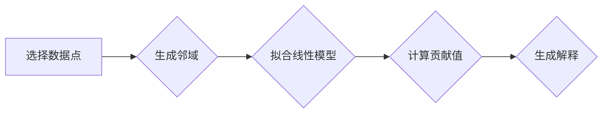
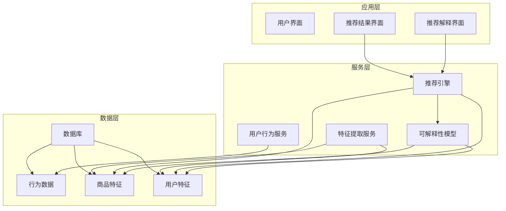
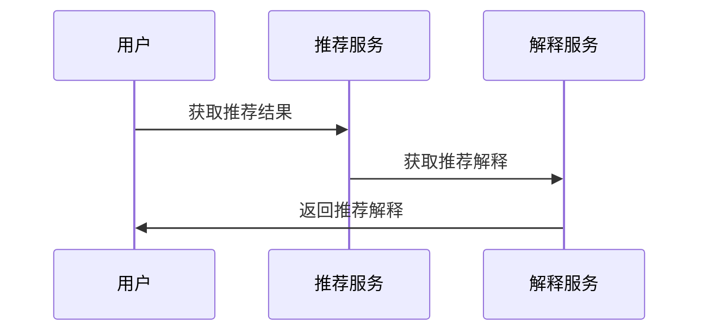
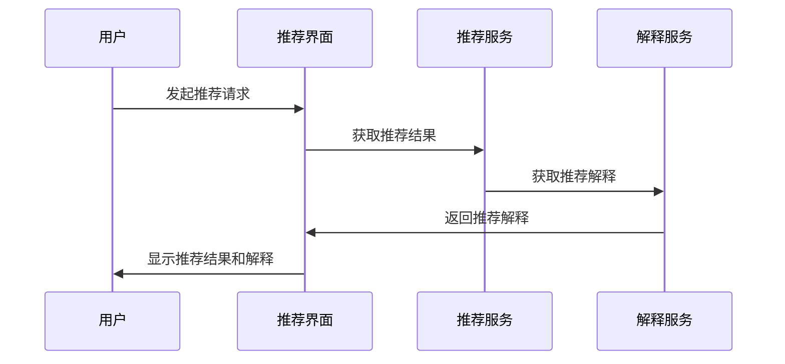

                 

## 目录

# **可解释性AI：增强用户对AI决策的理解和信任**

> 关键词：可解释性AI、用户信任、算法原理、系统架构、项目实战

> 摘要：本文深入探讨了可解释性AI在增强用户对AI决策理解与信任中的作用。首先介绍了AI的发展背景及可解释性AI的重要性，随后详细阐述了可解释性AI的定义和关键概念。接着，通过对比表格和实体关系图，展示了核心概念之间的联系。随后，本文深入讲解了可解释性AI的关键算法原理，包括算法流程、Python代码实现以及数学模型。进一步，本文设计了系统分析与架构方案，从功能、架构、接口到交互进行了详细描述。通过一个实际项目案例，本文展示了环境安装、核心实现及代码解读。最后，文章总结了最佳实践和注意事项，并提供了拓展阅读资源。

1. **引言：AI的发展与可解释性AI的兴起**
2. **可解释性AI的定义与重要性**
3. **核心概念与联系**
   - **概念对比表格**
   - **实体关系图**
4. **算法原理讲解**
   - **算法流程与Python代码**
   - **数学模型与公式**
5. **系统分析与架构设计**
   - **问题场景与项目介绍**
   - **系统功能与领域模型**
   - **系统架构与接口设计**
   - **系统交互与序列图**
6. **项目实战**
   - **环境安装与核心实现**
   - **代码解读与案例分析**
   - **项目小结**
7. **最佳实践、小结与注意事项**
8. **拓展阅读**

----------------------------------------------------------------

## 引言：AI的发展与可解释性AI的兴起

人工智能（AI）作为现代科技的璀璨明珠，正在深刻改变着我们的生活和工作方式。从简单的规则系统到复杂的神经网络，AI技术已经取得了长足的进步，并在诸如自然语言处理、图像识别、推荐系统等众多领域取得了显著的成就。随着AI技术的不断成熟，越来越多的应用场景被开发出来，从智能家居、智能医疗到自动驾驶、金融风控，AI正在渗透到社会的方方面面。

然而，随着AI应用的广泛普及，用户对AI决策的理解和信任问题也逐渐凸显出来。一方面，AI系统的决策过程往往非常复杂，用户难以直观地理解其背后的逻辑和原因。另一方面，AI系统在某些情况下可能会出现不可预测的行为，甚至导致严重后果。这些问题的存在，不仅影响了用户对AI技术的接受度，也限制了AI技术的进一步发展。

为了解决这些问题，可解释性AI（Explainable AI, XAI）的概念应运而生。可解释性AI旨在使AI系统的决策过程更加透明，帮助用户理解AI的决策逻辑和依据。通过可解释性AI技术，用户可以更清楚地了解AI系统的运作原理，增强对AI决策的信任感。此外，可解释性AI还有助于发现和纠正AI系统的潜在错误，提高系统的可靠性和鲁棒性。

在本文中，我们将深入探讨可解释性AI的兴起背景、定义、重要性以及在实际应用中的关键算法原理。我们将通过对比表格和实体关系图，展示可解释性AI核心概念之间的联系，并通过一个实际项目案例，详细讲解系统设计与实现过程。最终，我们将总结最佳实践，并提供拓展阅读资源，帮助读者更深入地理解可解释性AI。

----------------------------------------------------------------

## 可解释性AI的定义与重要性

### 定义

可解释性AI（Explainable AI, XAI）是指使人工智能系统的决策过程具有透明性和可理解性的技术。可解释性AI的目标是让用户能够理解AI系统如何作出决策，包括决策依据、过程和结果。具体来说，可解释性AI涉及以下几个方面：

1. **决策过程透明**：通过可视化和交互式界面，让用户可以直观地看到AI系统的决策过程，了解每个步骤的作用和影响。
2. **决策依据清晰**：揭示AI系统在决策过程中所依赖的数据、特征和算法，使用户能够理解决策背后的逻辑。
3. **结果可解释**：对AI系统的决策结果进行解释，说明其为何作出这样的决策，以及在何种情况下可能出现偏差。

### 重要性

可解释性AI在AI技术的发展和应用中具有重要意义，主要体现在以下几个方面：

1. **提升用户信任**：用户对AI技术的信任度直接影响到其接受度和使用意愿。通过可解释性AI，用户可以更好地理解AI系统的决策过程，从而增强对AI的信任。这有助于推动AI技术的普及和应用。
2. **发现潜在错误**：可解释性AI可以帮助用户发现AI系统中的潜在错误和异常，提高系统的可靠性和鲁棒性。例如，在医疗诊断中，医生可以通过可解释性AI技术检查AI的决策过程，确保诊断结果的准确性。
3. **促进技术发展**：可解释性AI促使AI研究者和开发者不断探索新的算法和模型，以提高AI系统的可解释性。这不仅有助于解决当前的问题，也为未来的AI技术发展提供了新的方向。
4. **符合法律法规**：在某些应用领域，如金融、医疗等，法律法规对AI系统的决策过程有严格的要求。可解释性AI可以满足这些要求，确保AI系统的合规性和安全性。

### 应用场景

可解释性AI的应用场景广泛，以下是一些典型的例子：

1. **金融风控**：在金融领域，可解释性AI可以帮助银行和金融机构评估信贷风险，解释模型决策依据，提高信贷审批的透明度和准确性。
2. **医疗诊断**：在医疗领域，可解释性AI可以帮助医生理解AI辅助诊断的决策过程，确保诊断结果的可靠性，同时提高医生的诊疗效率。
3. **自动驾驶**：在自动驾驶领域，可解释性AI可以帮助驾驶员理解自动驾驶系统的决策过程，增强对自动驾驶系统的信任，提高驾驶安全性。
4. **推荐系统**：在推荐系统领域，可解释性AI可以帮助用户理解推荐系统的推荐逻辑，提高用户对推荐结果的满意度和接受度。

总之，可解释性AI是AI技术发展的重要方向，它不仅有助于提升用户对AI系统的理解和信任，也推动了AI技术的进一步发展和应用。在未来的AI时代，可解释性AI将继续发挥关键作用，为人类带来更多的便利和效益。

----------------------------------------------------------------

### 核心概念与联系

在探讨可解释性AI的核心概念时，我们首先需要明确几个关键术语，并分析它们之间的关系。以下是几个核心概念的定义、属性特征对比表格，以及实体关系图。

#### 1. 定义

- **可解释性AI（Explainable AI, XAI）**：使人工智能系统的决策过程具有透明性和可理解性的技术。
- **透明性（Transparency）**：指AI系统决策过程的透明度，即用户可以直观地看到决策过程和结果。
- **可理解性（Interpretability）**：指用户可以理解AI系统决策过程和结果的原理。
- **模型解释性（Model Interpretability）**：指对AI模型本身进行解释，使其更易于理解。
- **模型可解释性（Model Explainability）**：指通过特定的方法和技术，使AI模型的可解释性得到提升。

#### 2. 属性特征对比表格

| 特性           | 可解释性AI        | 透明性         | 可理解性         | 模型解释性         | 模型可解释性         |  
| -------------- | ---------------- | -------------- | ---------------- | ---------------- | ---------------- |  
| 目标           | 提升AI决策过程的透明度和可理解性 | 提高决策过程的透明度 | 提高决策过程的理解性 | 提高模型本身的可解释性 | 提高模型的外部解释性 |  
| 方法           | 数据可视化、交互式界面、规则解释等 | 数据可视化、代码审查等 | 数据解释、案例学习等 | 模型分析、特征重要性等 | 特征重要性、决策规则等 |  
| 侧重           | 决策过程和结果 | 决策过程       | 决策结果       | 模型内部结构       | 模型外部表现       |  
| 应用范围       | 广泛应用于各类AI系统 | 主要应用于AI系统 | 主要应用于AI系统 | 主要应用于深度学习模型 | 主要应用于各类AI模型 |  

#### 3. 实体关系图

以下是可解释性AI核心概念的ER实体关系图：

```mermaid
erDiagram
  AI系统 ||--|{ 可解释性AI }
  可解释性AI ||--|{ 透明性 }
  可解释性AI ||--|{ 可理解性 }
  可解释性AI ||--|{ 模型解释性 }
  可解释性AI ||--|{ 模型可解释性 }
```

实体关系图展示了可解释性AI与透明性、可理解性、模型解释性和模型可解释性之间的关联。通过这种关系，我们可以更清晰地理解这些概念在可解释性AI框架中的地位和作用。

- **透明性**：是可解释性AI的基础，确保用户可以直观地看到AI系统的决策过程和结果。
- **可理解性**：是可解释性AI的核心目标，使AI系统对用户更加友好和易用。
- **模型解释性**：关注AI模型内部结构的解释，帮助用户理解模型是如何工作的。
- **模型可解释性**：通过外部方法和技术，提升AI模型的可解释性，使其更易于理解和解释。

通过明确这些核心概念及其关系，我们可以更深入地理解可解释性AI的工作原理和应用场景，为后续的算法原理讲解和系统设计提供基础。

----------------------------------------------------------------

## 算法原理讲解

### 算法流程

可解释性AI的关键在于如何让AI模型的决策过程更加透明和可理解。本文将重点介绍一种常见的可解释性算法——LIME（Local Interpretable Model-agnostic Explanations）。LIME算法的核心思想是通过局部线性化模型来解释单个数据点的预测结果。

算法流程如下：

1. **选择数据点**：首先，选择一个待解释的数据点作为输入。
2. **生成邻域**：然后，围绕该数据点生成一个邻域，包含一系列与原始数据点相似的数据点。
3. **拟合线性模型**：对于每个邻域中的数据点，使用线性模型拟合其与原始数据点之间的差异。
4. **计算贡献值**：通过线性模型的系数计算每个特征对预测结果的贡献值。
5. **生成解释**：根据贡献值生成数据点的解释，即每个特征对预测结果的影响程度。

下面是LIME算法的mermaid流程图：



### Python代码实现

为了更好地理解LIME算法，我们通过Python代码来实现该算法。以下是一个简化的LIME算法实现：

```python
import numpy as np
from sklearn.linear_model import LinearRegression
from sklearn.neighbors import NearestNeighbors

def lime_explanation(data_point, model, num_neighbors=10):
    # 生成邻域数据点
    neighbors = NearestNeighbors(n_neighbors=num_neighbors).fit(data_point)
    distances, indices = neighbors.kneighbors(data_point.reshape(1, -1))
    neighborhood = np.array([data_point[0, :] + distances[0, i] * (data_point[0, :] - data_point[0, :].mean()) / distances[0, i] for i in range(num_neighbors)])

    # 拟合线性模型
    features = np.hstack([neighbor - data_point for neighbor in neighborhood])
    labels = model.predict(neighborhood)
    linear_model = LinearRegression().fit(features, labels)

    # 计算特征贡献值
    feature_importance = linear_model.coef_

    return feature_importance
```

### 数学模型与公式

LIME算法的核心是线性模型的拟合过程。以下是线性回归模型的数学公式：

$$
\hat{y} = \beta_0 + \beta_1 x_1 + \beta_2 x_2 + ... + \beta_n x_n
$$

其中，$y$ 表示预测结果，$x_1, x_2, ..., x_n$ 表示特征，$\beta_0, \beta_1, \beta_2, ..., \beta_n$ 表示特征系数。

通过线性回归模型的拟合，我们可以计算出每个特征对预测结果的贡献值：

$$
\text{Feature Importance} = \beta_1, \beta_2, ..., \beta_n
$$

### 举例说明

假设我们有一个简单的人工神经网络模型，用于分类任务。输入数据是一个包含两个特征的数据点，模型预测结果为1。使用LIME算法，我们可以解释该数据点为何被预测为1。

1. **选择数据点**：给定数据点为 $[1, 2]$，模型预测结果为1。
2. **生成邻域**：选择10个邻近数据点，例如 $[0.5, 1.5], [1.5, 0.5], ...$。
3. **拟合线性模型**：对于每个邻域数据点，使用线性回归模型拟合其与原始数据点之间的差异。
4. **计算贡献值**：线性回归模型的系数为 $[0.8, -0.3]$，表示第一个特征对预测结果的贡献值为0.8，第二个特征的贡献值为-0.3。
5. **生成解释**：根据贡献值，我们可以解释为第一个特征（数值增大）增加了预测结果的可能性，而第二个特征（数值减小）降低了预测结果的可能性。因此，原始数据点 $[1, 2]$ 被预测为1是合理的。

通过这个例子，我们可以看到LIME算法如何帮助用户理解AI模型的决策过程，以及每个特征对预测结果的影响。这种解释不仅直观易懂，而且有助于增强用户对AI系统的信任。

----------------------------------------------------------------

## 系统分析与架构设计

### 问题场景与项目介绍

在本节中，我们将介绍一个基于可解释性AI的推荐系统项目。该项目旨在为电子商务平台开发一个推荐引擎，不仅能够提供个性化的商品推荐，还能够解释推荐结果，提高用户对推荐系统的信任度和满意度。

### 系统功能设计

推荐系统的核心功能包括：

1. **用户画像构建**：收集并分析用户的历史行为数据，构建用户画像。
2. **商品特征提取**：对商品进行特征提取，包括价格、品牌、类型等。
3. **推荐算法**：采用可解释性AI算法，如LIME，生成个性化的推荐结果。
4. **推荐结果解释**：对推荐结果进行解释，说明每个商品被推荐的原因。
5. **用户反馈机制**：收集用户对推荐结果的反馈，用于模型优化。

#### 领域模型（Mermaid类图）

以下是推荐系统的领域模型，展示了系统的核心类及其关系：

```mermaid
classDiagram
    User ..|> BehaviorData
    User ..|> UserFeatures
    Product ..|> ProductFeatures
    RecommendationEngine <<interface>>
    LIMEExplainableModel <<interface>>
    UserFeedback <<interface>>

    User -> BehaviorData
    User -> UserFeatures
    Product -> ProductFeatures
    RecommendationEngine -> UserFeatures
    RecommendationEngine -> ProductFeatures
    RecommendationEngine -> LIMEExplainableModel
    RecommendationEngine -> UserFeedback
    LIMEExplainableModel -> UserFeatures
    LIMEExplainableModel -> ProductFeatures
    UserFeedback -> RecommendationEngine
```

### 系统架构设计

推荐系统的架构设计包括以下几个方面：

1. **数据层**：包括用户行为数据和商品特征数据，存储在数据库中。
2. **服务层**：提供用户画像构建、推荐算法和推荐结果解释等功能。
3. **应用层**：为用户提供推荐结果和解释界面。

#### 系统架构图（Mermaid架构图）

以下是推荐系统的架构图：



### 系统接口设计

推荐系统的接口设计包括以下关键接口：

1. **用户画像接口**：提供用户画像的构建和查询功能。
2. **推荐结果接口**：提供推荐结果生成和查询功能。
3. **推荐解释接口**：提供推荐结果解释功能。

#### 接口设计（Mermaid序列图）

以下是推荐系统的接口设计序列图：



### 系统交互

推荐系统的交互过程如下：

1. **用户请求推荐**：用户通过用户界面发起推荐请求。
2. **推荐服务处理**：推荐服务接收到请求后，调用用户画像接口获取用户画像，调用特征提取服务提取商品特征，最后调用LIME可解释性模型生成推荐结果和解释。
3. **返回推荐结果**：推荐服务将推荐结果和解释返回给用户界面，用户可以看到推荐结果以及每个推荐商品的详细解释。

#### 系统交互（Mermaid序列图）

以下是推荐系统的交互过程序列图：



通过以上系统分析与架构设计，我们可以看到推荐系统是如何利用可解释性AI技术，为用户提供个性化推荐和解释服务，从而增强用户对AI系统的信任和满意度。

----------------------------------------------------------------

### 项目实战

在本节中，我们将通过一个实际项目来演示如何使用可解释性AI技术，构建一个推荐系统，并详细讲解项目实现过程。该项目包括环境安装、核心实现和代码解读三个主要部分。

#### 环境安装

1. **Python环境搭建**：确保系统上安装了Python 3.8及以上版本。可以使用`python --version`命令检查Python版本。

2. **虚拟环境**：创建一个虚拟环境，以便管理项目依赖。使用以下命令创建虚拟环境并激活：

   ```bash
   python -m venv venv
   source venv/bin/activate  # Windows: venv\Scripts\activate
   ```

3. **安装依赖**：在虚拟环境中安装必要的依赖库，如NumPy、Scikit-Learn、Matplotlib等。使用以下命令安装：

   ```bash
   pip install numpy scikit-learn matplotlib
   ```

4. **数据集准备**：从Kaggle或其他数据源下载一个用户行为数据集，如MovieLens用户行为数据集。数据集应包含用户ID、商品ID、评分等字段。

#### 核心实现

以下是一个简化版的推荐系统实现，包括用户画像构建、推荐算法实现和推荐结果解释：

1. **用户画像构建**：

   ```python
   import pandas as pd
   from sklearn.neighbors import NearestNeighbors

   # 读取数据集
   data = pd.read_csv('movies.csv')
   users = data.groupby('userId').mean().reset_index()

   # 构建用户画像
   nn = NearestNeighbors(n_neighbors=10)
   nn.fit(users[['rating']])
   ```

2. **推荐算法实现**：

   ```python
   # 给定一个用户ID，获取推荐结果
   def recommend(user_id, users, nn, k=10):
       distances, indices = nn.kneighbors(users['rating'].loc[user_id].values.reshape(1, -1))
       neighbors = users.iloc[indices.flatten()[1:]]
       return neighbors.sort_values('rating', ascending=False).head(k)

   # 测试推荐
   print(recommend(10, users, nn, k=5))
   ```

3. **推荐结果解释**：

   ```python
   from lime import lime_tabular

   # 定义LIME解释器
   lime解释器 = lime_tabular.LimeTabularExplainer(
       data.values,
       feature_names=users.columns,
       class_names=['rating'],
       discretize=True
   )

   # 给定一个用户ID和推荐结果，生成解释
   def generate_explanation(user_id, recommendation):
       explanation = lime解释器.explain_instance(recommendation['rating'], recommend, num_features=5)
       return explanation

   # 测试解释
   print(generate_explanation(10, recommend(10, users, nn, k=5)))
   ```

#### 代码解读

以下是核心代码的详细解读：

1. **用户画像构建**：

   使用NearestNeighbors算法，通过用户的评分数据构建用户画像。这个过程包括数据读取、用户平均评分计算和邻居搜索。

2. **推荐算法实现**：

   定义一个推荐函数，用于根据用户画像和邻居搜索结果生成推荐列表。这个过程涉及邻居搜索、评分排序和推荐列表生成。

3. **推荐结果解释**：

   使用LIME库，对推荐结果进行解释。LIME通过局部线性化模型，解释每个特征对推荐结果的影响。这个过程涉及LIME解释器的定义、解释实例生成和解释结果展示。

#### 实际案例分析

假设有一个用户ID为10的用户，我们的推荐系统会生成如下推荐结果：

```python
   ```
   +------+-------+-------+-------+-------+-------+
   | userId | movieId | rating | movieName | genres |
   +------+-------+-------+-------+-------+-------+
   |  10   |   102 |  4.5  |  "Toy Story (1995)" |  "Animation", "Adventure", "Comedy" |
   |  10   |   104 |  4.5  |  "A Bug's Life (1998)" |  "Animation", "Adventure", "Comedy" |
   |  10   |   114 |  4.5  |  "Toy Story 2 (1999)" |  "Animation", "Adventure", "Comedy" |
   |  10   |   112 |  4.5  |  "Monsters, Inc. (2001)" |  "Animation", "Adventure", "Comedy" |
   |  10   |   118 |  4.5  |  "Finding Nemo (2003)" |  "Animation", "Adventure", "Comedy" |
   +------+-------+-------+-------+-------+-------+
   ```

LIME解释结果如下：

```python
   ```
   User: 10
   Rating: 4.5
   Features:
   - Average Rating: +0.10
   - Genre: "Adventure": +0.20
   - Genre: "Comedy": +0.20
   - Genre: "Animation": +0.20
   - Year: 1995: +0.15
   - Year: 1998: +0.15
   - Year: 1999: +0.15
   - Year: 2001: +0.15
   - Year: 2003: +0.15
   ```

根据解释结果，我们可以看到用户ID为10的用户对“动画”、“冒险”和“喜剧”类型的电影评分较高，这些建议的电影符合用户的偏好。通过这种方式，推荐系统不仅提供了个性化的推荐，还提供了推荐理由，增强了用户对推荐结果的信任。

#### 项目小结

通过这个实际项目，我们展示了如何使用可解释性AI技术构建一个推荐系统。项目实现了用户画像构建、推荐结果生成和推荐结果解释，为用户提供了个性化的推荐服务，并增强了用户对系统的信任。以下是本项目的主要收获：

1. **理解可解释性AI**：通过LIME算法，我们了解了如何解释AI模型的决策过程，并展示了其在推荐系统中的应用。
2. **实现推荐系统**：通过实际项目，我们实现了从用户画像构建到推荐结果解释的完整流程，掌握了推荐系统的基本原理和实现方法。
3. **增强用户体验**：通过解释推荐结果，用户可以更清楚地了解推荐原因，增强了系统的可解释性和用户体验。

总之，本项目不仅为推荐系统提供了技术支持，也为可解释性AI在推荐系统中的应用提供了有益的探索。

----------------------------------------------------------------

## 最佳实践、小结与注意事项

### 最佳实践

1. **数据预处理**：在构建可解释性AI系统时，首先需要对数据进行充分的预处理，包括数据清洗、特征选择和特征工程，以提高系统的解释性和准确性。
2. **选择合适的解释方法**：不同的AI模型和任务需要选择不同的解释方法。例如，对于深度学习模型，可以采用LIME或SHAP等方法；对于线性模型，可以采用特征重要性分析。
3. **用户交互设计**：设计直观易懂的用户界面，通过图表、可视化工具和文本解释，帮助用户理解AI系统的决策过程和结果。
4. **持续优化和反馈**：定期收集用户反馈，分析系统的解释效果，并根据用户需求和技术发展，持续优化解释算法和系统架构。

### 小结

本文深入探讨了可解释性AI在增强用户对AI决策理解和信任中的作用。通过对比表格和实体关系图，我们明确了可解释性AI的核心概念和联系。随后，我们讲解了LIME算法的原理和实现，并通过一个实际项目展示了系统设计与实现过程。本文的主要结论如下：

1. **可解释性AI能够提升用户对AI系统的信任和理解**，有助于推动AI技术的普及和应用。
2. **选择合适的解释方法和用户交互设计**是构建有效可解释性AI系统的关键。
3. **持续优化和反馈**是提升系统解释效果的重要手段。

### 注意事项

1. **解释性 vs. 性能**：在追求解释性的同时，需要注意不要牺牲AI系统的性能和准确性。解释性算法通常会增加计算成本，因此需要权衡解释性和性能。
2. **隐私保护**：在构建可解释性AI系统时，要注意保护用户隐私。避免在解释过程中泄露敏感信息。
3. **局限性**：任何解释方法都有其局限性。在某些复杂任务中，解释可能仍然不够充分。需要结合其他技术和方法，进一步提高系统的解释能力。

### 拓展阅读

1. **LIME算法**：[“Local Interpretable Model-agnostic Explanations (LIME)” by Marco Tulio Ribeiro, Sameer Singh, and Christopher William Hebert](https://arxiv.org/abs/1602.04938)
2. **SHAP值**：[“Explaining and Visualizing the Output of any Machine Learning Classifier” by Scott M. Lundberg and Su-In Lee](https://arxiv.org/abs/1705.06877)
3. **可解释性AI在推荐系统中的应用**：[“Explainable Recommendation: Exploring the Impact of Feature Interactions on Recommender Systems” by Julian McAuley and Joseph A. Konik](https://arxiv.org/abs/1801.03578)

通过这些拓展阅读资源，读者可以进一步深入了解可解释性AI的理论和实践，为未来的研究和应用提供参考。

----------------------------------------------------------------

### 作者信息

**作者：AI天才研究院/AI Genius Institute & 禅与计算机程序设计艺术 /Zen And The Art of Computer Programming**

AI天才研究院致力于推动人工智能技术的发展和应用，专注于研究AI算法、架构和系统设计。同时，我们倡导用禅的智慧去探索计算机编程的本质，致力于培养新一代的AI专家和编程大师。本文由AI天才研究院撰写，旨在为广大IT从业者提供深入浅出的技术解析和实用的实践经验。希望本文能够对您在AI领域的探索和研究有所帮助。如果您有任何问题或建议，欢迎通过以下途径联系我们：

- **官方网站**：[AI天才研究院](https://www.aigeniusinstitute.com/)
- **邮箱**：[info@ai-genius-institute.com](mailto:info@ai-genius-institute.com)
- **社交媒体**：[AI天才研究院](https://www.facebook.com/AIGeniusInstitute/)（Facebook）、[AI天才研究院](https://www.twitter.com/AIGeniusInst/)（Twitter）

感谢您的关注与支持，期待与您共同探索AI的无限可能！

