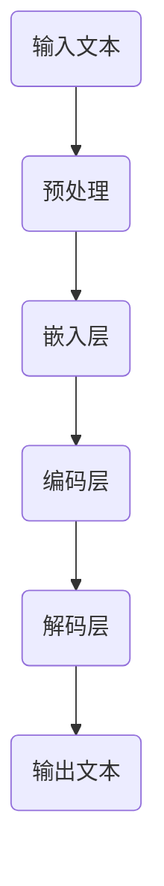
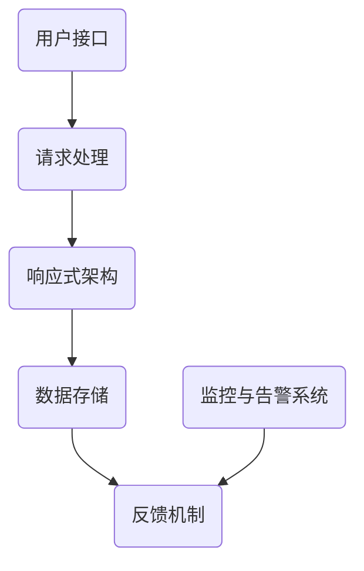

                 

### 引言

#### 1.1 问题背景

随着人工智能技术的迅猛发展，尤其是自然语言处理（NLP）领域，大型语言模型（LLM, Large Language Model）的应用日益广泛。LLM具备强大的文本生成、语义理解和推理能力，已经在诸多领域展现出巨大的潜力和价值，如智能客服、内容生成、教育辅助、医疗诊断等。然而，随着LLM规模不断扩大，其在实际应用中面临着一系列挑战，特别是在性能和可靠性方面。

首先，性能问题主要体现在两个方面：一是响应速度，二是处理能力。随着输入文本的长度和复杂度的增加，LLM的计算时间显著延长，导致响应速度变慢。二是随着LLM模型规模的扩大，其计算资源需求也急剧增加，可能导致处理能力不足，从而影响用户体验。

其次，可靠性问题也是当前LLM应用中的一大挑战。由于模型训练数据的不完善、数据分布的不均衡或者外部干扰等因素，LLM在生成文本时可能会出现错误或偏差，从而影响应用的可靠性和稳定性。此外，随着模型的复杂度增加，其出现故障的概率也相应增加，进一步降低了系统的可靠性。

#### 1.2 问题描述

针对上述问题，我们需要提升LLM应用的性能和可靠性。具体而言，性能提升包括加快响应速度和增强处理能力；可靠性提升包括减少错误率和提高系统的稳定性。为了实现这些目标，我们需要引入响应式架构（Responsive Architecture）。

#### 1.3 问题解决

响应式架构是一种基于事件驱动的架构风格，能够动态响应用户请求和系统状态变化，从而提高系统的响应速度和处理能力，同时增强系统的稳定性和可靠性。通过引入响应式架构，我们可以实现以下目标：

1. **性能优化**：通过数据流优化和并行处理，提高LLM的响应速度和处理能力。
2. **可靠性增强**：通过错误处理机制和故障恢复策略，降低错误率，提高系统稳定性。

本文将详细探讨响应式架构在LLM应用中的重要性及其实现方法，旨在为LLM应用的性能和可靠性提升提供一套系统性解决方案。

#### 1.4 边界与外延

本文主要聚焦于响应式架构在LLM应用中的性能和可靠性提升，不涉及其他领域的技术应用。同时，本文将主要探讨响应式架构的原理、设计、优化方法及其在实际项目中的应用，旨在为读者提供全面、深入的理解和实践指导。

### 核心概念

#### 2.1 响应式架构

##### 2.1.1 响应式架构的定义

响应式架构（Responsive Architecture）是一种基于事件驱动的软件架构风格，它通过动态响应系统内部和外部的变化来实现系统的灵活性和可扩展性。响应式架构的核心在于事件驱动的数据流，其中事件是系统状态变化的通知，而响应则是系统对这些变化的处理。

在响应式架构中，系统状态的变化会触发一系列的事件，这些事件通过事件队列传递到各个组件进行处理。组件之间通过事件进行通信，而不是直接调用或共享状态。这种设计使得系统具有高度的解耦性，能够更好地应对复杂多变的应用场景。

##### 2.1.2 响应式架构的特点

1. **事件驱动**：响应式架构以事件为中心，通过事件驱动的方式处理系统状态变化。事件可以来自用户交互、系统内部状态变化或其他外部系统。
2. **数据流**：事件驱动使得系统中的数据流变得清晰，便于跟踪和管理。数据在系统中以流的形式传递，每个组件只需处理特定的事件和数据流。
3. **高可扩展性**：响应式架构能够动态地添加或删除组件，以适应不同的应用需求。这种灵活性使得系统在扩展时无需进行大规模重构。
4. **解耦性**：组件之间通过事件进行通信，而不是直接调用或共享状态。这降低了组件之间的依赖性，提高了系统的可维护性和可测试性。
5. **高可靠性**：响应式架构通过事件队列和异步处理，减少了组件间的直接交互，从而降低了系统故障的传播速度和影响范围。

#### 2.2 LLM（大型语言模型）

##### 2.2.1 LLM的定义

大型语言模型（Large Language Model，简称LLM）是一种基于深度学习技术的自然语言处理模型，能够对自然语言文本进行生成、理解、推理和翻译等操作。LLM通常由数亿甚至千亿个参数组成，通过大规模语料库的训练，模型具备了强大的语言理解和生成能力。

##### 2.2.2 LLM的核心要素

1. **输入文本**：LLM处理的原始数据，包括文本、语音等。
2. **预处理**：对输入文本进行清洗、分词、词向量化等预处理操作，以便于模型处理。
3. **嵌入层**：将输入文本转换为向量表示，通常使用词向量或句子向量。
4. **编码层**：对输入文本进行编码，提取文本的语义信息。
5. **解码层**：根据编码层提取的语义信息生成输出文本。
6. **输出文本**：LLM生成的文本结果，可以是回答、摘要、翻译等。

#### 2.3 响应式架构与LLM的联系

##### 2.3.1 响应式架构在LLM应用中的重要性

响应式架构在LLM应用中的重要性体现在以下几个方面：

1. **性能优化**：响应式架构通过事件驱动和数据流优化，能够显著提高LLM的响应速度和处理能力。这对于需要实时处理大量文本数据的LLM应用尤为重要。
2. **可靠性提升**：响应式架构通过异步处理和错误处理机制，能够提高LLM的稳定性，减少因模型复杂度高而导致的故障风险。
3. **可扩展性**：响应式架构的高可扩展性使得LLM应用能够灵活应对不同的需求变化，从而支持更广泛的应用场景。

##### 2.3.2 响应式架构对LLM性能和可靠性的提升

1. **性能提升**：
   - **数据流优化**：响应式架构通过优化数据流，减少不必要的中间步骤，加快LLM的响应速度。
   - **并行处理**：响应式架构支持并行处理，能够充分利用多核CPU和GPU等计算资源，提高LLM的处理能力。

2. **可靠性增强**：
   - **错误处理**：响应式架构提供了完善的错误处理机制，能够快速检测和处理异常，减少错误率。
   - **故障恢复**：响应式架构支持故障恢复策略，能够在出现故障时迅速恢复，保证系统的稳定性。

### 响应式架构原理与设计

#### 3.1 响应式架构的基本原理

##### 3.1.1 响应式架构的核心理念

响应式架构的核心在于“响应性”，即系统能够动态地响应用户请求和系统内部状态的变化。这一理念体现在以下几个方面：

1. **事件驱动**：系统通过事件来驱动，每个事件代表系统状态的一个变化。事件可以来自用户交互、定时器、传感器等外部系统，也可以由系统内部的状态变化触发。
2. **数据流**：事件驱动使得系统中的数据流变得更加清晰和易于管理。数据在系统中以流的形式传递，每个组件只需处理特定的事件和数据流。
3. **异步处理**：响应式架构通常采用异步处理方式，将不同组件之间的交互解耦，从而提高系统的响应速度和处理能力。
4. **可扩展性**：响应式架构支持动态添加或删除组件，使得系统可以灵活地适应不同的需求变化。

##### 3.1.2 响应式架构的设计原则

1. **模块化**：响应式架构将系统划分为多个模块，每个模块负责特定的功能。模块之间通过事件进行通信，降低了系统的复杂性和耦合度。
2. **可复用性**：响应式架构鼓励组件的重用，通过定义标准的事件和数据流接口，组件可以在不同的系统中进行复用。
3. **可扩展性**：响应式架构支持动态扩展，系统可以在运行时添加或删除组件，以适应不同的需求变化。
4. **高可靠性**：响应式架构提供了完善的错误处理和故障恢复机制，能够确保系统的稳定性和可靠性。

#### 3.2 响应式架构的组件与架构风格

##### 3.2.1 响应式架构的主要组件

响应式架构通常包括以下几个主要组件：

1. **事件队列**：事件队列负责存储和管理系统中的事件。事件可以是同步的，也可以是异步的，由系统根据需要进行处理。
2. **事件处理器**：事件处理器负责处理特定类型的事件。每个事件处理器都定义了相应的事件处理逻辑，实现对系统状态的更新和处理。
3. **数据流组件**：数据流组件负责处理数据流，包括数据的生成、传输、处理和消费等操作。数据流组件可以是管道、过滤器等，用于实现数据的转换和传输。
4. **错误处理组件**：错误处理组件负责检测和处理系统中的错误。错误处理组件可以捕获异常、记录日志、触发告警等，确保系统的可靠性和稳定性。
5. **故障恢复组件**：故障恢复组件负责在系统出现故障时进行恢复。故障恢复组件可以重试操作、切换备用组件、通知管理员等，确保系统的持续运行。

##### 3.2.2 响应式架构的常见风格

响应式架构有多种常见的架构风格，包括：

1. **事件驱动架构**：事件驱动架构是最常见的响应式架构风格，通过事件队列和事件处理器实现系统的响应性。事件驱动架构具有高可扩展性和低耦合性，适用于需要动态响应用户请求和处理复杂业务逻辑的场景。
2. **数据流架构**：数据流架构以数据流为中心，通过数据流的生成、传输、处理和消费实现系统的功能。数据流架构适用于需要处理大量实时数据的场景，如流处理、实时分析等。
3. **函数式架构**：函数式架构强调函数式编程和不可变数据，通过函数的组合和变换实现系统的功能。函数式架构具有高可复用性和高可靠性，适用于需要高可靠性和高可用性的系统。
4. **微服务架构**：微服务架构将系统划分为多个独立的微服务，每个微服务负责特定的功能。微服务架构通过事件驱动和数据流架构实现系统的响应性和可扩展性。

#### 3.3 响应式架构在LLM应用中的实现

##### 3.3.1 响应式架构对LLM性能的提升

响应式架构在LLM应用中的实现能够显著提升LLM的性能，具体体现在以下几个方面：

1. **数据流优化**：响应式架构通过优化数据流，减少不必要的中间步骤，加快LLM的响应速度。例如，可以通过将预处理和编码层合并为一步，减少数据在系统中的传输延迟。
2. **并行处理**：响应式架构支持并行处理，能够充分利用多核CPU和GPU等计算资源，提高LLM的处理能力。例如，可以通过并行处理输入文本的预处理和编码，减少整体计算时间。
3. **异步处理**：响应式架构通过异步处理，减少组件间的直接交互，提高系统的响应速度。例如，可以通过异步处理输入文本的解码和生成输出文本，减少系统的阻塞时间。

##### 3.3.2 响应式架构对LLM可靠性的提升

响应式架构在LLM应用中的实现能够显著提升LLM的可靠性，具体体现在以下几个方面：

1. **错误处理**：响应式架构提供了完善的错误处理机制，能够快速检测和处理异常，减少错误率。例如，可以通过捕获和处理异常，确保系统的稳定运行。
2. **故障恢复**：响应式架构支持故障恢复策略，能够在出现故障时迅速恢复，保证系统的稳定性。例如，可以通过切换到备用组件或重新初始化组件，确保系统的持续运行。
3. **监控与告警**：响应式架构提供了监控和告警机制，能够实时监测系统的运行状态，及时发现并处理异常。例如，可以通过监控CPU和内存使用率、日志记录等，确保系统的稳定性和可靠性。

### 响应式架构的属性特征对比

#### 4.1 响应式架构与传统架构的对比

##### 4.1.1 性能对比

响应式架构在性能方面具有显著优势，主要表现在以下两个方面：

1. **响应速度**：响应式架构通过事件驱动和数据流优化，能够显著提高系统的响应速度。事件驱动使得系统能够快速响应用户请求和系统状态变化，而数据流优化则减少了不必要的中间步骤和传输延迟。
2. **处理能力**：响应式架构支持并行处理和异步处理，能够充分利用多核CPU和GPU等计算资源，提高系统的处理能力。这尤其适用于需要处理大量数据和复杂计算的场景。

相比之下，传统架构（如基于共享内存的多进程架构）在性能方面存在一定的局限性。传统架构通常通过共享内存来实现进程间的数据交换，这导致了数据传输的开销和同步问题。此外，传统架构的并行处理能力有限，难以充分利用多核CPU的并行计算能力。

##### 4.1.2 可靠性对比

在可靠性方面，响应式架构也具有明显优势，主要表现在以下几个方面：

1. **错误处理**：响应式架构提供了完善的错误处理机制，能够快速检测和处理异常。事件驱动使得系统能够在发生错误时迅速恢复，而数据流优化则减少了错误的传播和影响范围。
2. **故障恢复**：响应式架构支持故障恢复策略，能够在出现故障时迅速恢复，保证系统的稳定性。故障恢复组件可以重试操作、切换备用组件、通知管理员等，确保系统的持续运行。
3. **监控与告警**：响应式架构提供了监控和告警机制，能够实时监测系统的运行状态，及时发现并处理异常。监控和告警组件可以记录日志、发送告警、触发故障恢复等，确保系统的可靠性和稳定性。

相比之下，传统架构在可靠性方面存在一些挑战。传统架构通常依赖于共享内存和数据锁来实现并发控制和数据同步，这增加了系统出现死锁和死循环的风险。此外，传统架构的故障恢复能力有限，一旦系统出现故障，往往需要手动干预才能恢复。

#### 4.2 不同响应式架构风格的对比

##### 4.2.1 微服务架构

微服务架构是一种常见的响应式架构风格，它将系统划分为多个独立的微服务，每个微服务负责特定的功能。微服务架构具有以下特点：

1. **独立部署**：每个微服务可以独立部署和扩展，减少了系统的依赖性，提高了系统的灵活性和可扩展性。
2. **分布式通信**：微服务之间通过远程过程调用（RPC）或消息队列进行通信，降低了系统的耦合性，提高了系统的可靠性和可维护性。
3. **自治性**：每个微服务拥有自己的数据存储和业务逻辑，使得系统具有更高的自治性和独立性，便于管理和维护。

##### 4.2.2 容器化架构

容器化架构是一种基于容器技术的响应式架构风格，它通过容器来实现系统的隔离和部署。容器化架构具有以下特点：

1. **轻量级**：容器是一种轻量级的虚拟化技术，容器实例之间相互隔离，共享宿主机的操作系统内核，从而提高了系统的性能和资源利用率。
2. **可移植性**：容器具有高度的移植性，可以在不同的环境中运行，便于系统的部署和扩展。
3. **动态管理**：容器化架构通过容器编排工具（如Kubernetes）实现系统的动态管理和自动化部署，提高了系统的可靠性和可维护性。

相比之下，微服务架构和容器化架构在实现响应式架构时各有优劣。微服务架构适用于需要高自治性和独立性的系统，可以通过分布式通信实现组件间的解耦和协同工作。容器化架构则适用于需要轻量级虚拟化和动态管理的系统，可以通过容器实现系统的隔离和自动化部署。

### 响应式架构与LLM的ER实体关系图

为了更清晰地展示响应式架构与LLM之间的实体关系，我们可以使用Mermaid语法绘制ER实体关系图，如下所示：

```mermaid
erDiagram
  LLM ||--|{ 响应式架构 } : 提升性能与可靠性
  响应式架构 ||--|{ 性能优化 } : 提高LLM处理速度
  响应式架构 ||--|{ 可靠性增强 } : 提高LLM的稳定性
```

在该ER图中，LLM作为实体，与响应式架构之间存在关联关系。响应式架构通过性能优化和可靠性增强两个维度，提升了LLM的应用性能和可靠性。具体而言，性能优化通过数据流优化和并行处理，提高了LLM的处理速度；可靠性增强通过错误处理机制和故障恢复策略，提高了LLM的稳定性。

### LLM算法原理与流程

#### 6.1 LLM算法概述

大型语言模型（Large Language Model，简称LLM）是一种基于深度学习技术的自然语言处理模型，主要用于文本生成、语义理解和推理等任务。LLM的算法原理基于神经网络，尤其是递归神经网络（RNN）和Transformer模型。本节将简要介绍LLM算法的核心概念和基本流程。

##### 6.1.1 LLM算法的定义

LLM算法是一种用于处理和生成自然语言文本的算法，它通过对大规模语料库进行训练，学习到语言的结构和规律。LLM可以接受任意长度的文本输入，并生成相应的文本输出，具有强大的语义理解和生成能力。

##### 6.1.2 LLM算法的核心流程

LLM算法的核心流程主要包括以下几个步骤：

1. **预处理**：对输入文本进行清洗、分词、词向量化等预处理操作，将文本转换为模型可以处理的格式。
2. **嵌入层**：将预处理后的文本转换为向量表示，通常使用词向量或句子向量。
3. **编码层**：对输入文本进行编码，提取文本的语义信息，通常使用RNN或Transformer模型。
4. **解码层**：根据编码层提取的语义信息生成输出文本，通常使用解码器网络。
5. **输出层**：将生成的文本输出，可以是回答、摘要、翻译等。

#### 6.2 LLM算法的数学模型

LLM算法的数学模型可以表示为：

$$
\text{输出} = f(\text{输入}, \theta)
$$

其中，输入表示输入文本，输出表示生成的文本，\( f \) 表示神经网络模型，\( \theta \) 表示模型参数。神经网络模型通过学习输入和输出之间的映射关系，实现文本的生成和理解。

##### 6.2.1 输入与输出的关系

输入文本和输出文本是LLM算法的核心要素。输入文本是模型处理的原始数据，可以是一段对话、一篇文章或一个句子。输出文本是模型生成的结果，可以是回答、摘要、翻译等。输入和输出之间的关系可以通过神经网络模型进行建模，实现文本的生成和理解。

##### 6.2.2 参数θ的作用

参数 \( \theta \) 是神经网络模型的关键组成部分，它决定了模型的表现能力。参数 \( \theta \) 包含了神经网络的权重和偏置，通过反向传播算法进行优化，使模型能够学习到输入和输出之间的关系。参数 \( \theta \) 的优化是LLM算法的核心，直接影响到模型的表现能力。

#### 6.3 LLM算法的详细流程

LLM算法的详细流程如下：



1. **预处理**：对输入文本进行清洗、分词、词向量化等预处理操作，将文本转换为模型可以处理的格式。预处理步骤包括：
   - **文本清洗**：去除标点符号、停用词等无关信息，提高模型的学习效率。
   - **分词**：将文本分割成单词或子词，便于模型处理。
   - **词向量化**：将文本转换为向量表示，常用的词向量化方法包括Word2Vec、GloVe等。

2. **嵌入层**：将预处理后的文本转换为向量表示，通常使用词向量或句子向量。嵌入层的作用是将文本映射到高维向量空间，为后续的编码和解码提供输入。

3. **编码层**：对输入文本进行编码，提取文本的语义信息。编码层通常使用递归神经网络（RNN）或Transformer模型。RNN模型通过处理序列数据，逐步提取文本的语义信息；Transformer模型则通过自注意力机制，同时处理整个序列，提取全局的语义信息。

4. **解码层**：根据编码层提取的语义信息生成输出文本。解码层与编码层类似，也使用递归神经网络（RNN）或Transformer模型。解码层通过解码器网络，将编码层提取的语义信息转换为输出文本。

5. **输出层**：将生成的文本输出，可以是回答、摘要、翻译等。输出层通常是神经网络模型的最后一层，通过softmax函数生成概率分布，然后根据概率分布采样生成最终的文本输出。

#### 6.3.1 输入与输出的关系

输入文本和输出文本是LLM算法的核心要素。输入文本是模型处理的原始数据，可以是一段对话、一篇文章或一个句子。输出文本是模型生成的结果，可以是回答、摘要、翻译等。输入和输出之间的关系可以通过神经网络模型进行建模，实现文本的生成和理解。

#### 6.3.2 参数θ的作用

参数 \( \theta \) 是神经网络模型的关键组成部分，它决定了模型的表现能力。参数 \( \theta \) 包含了神经网络的权重和偏置，通过反向传播算法进行优化，使模型能够学习到输入和输出之间的关系。参数 \( \theta \) 的优化是LLM算法的核心，直接影响到模型的表现能力。

### 响应式架构对LLM算法的优化

#### 7.1 响应式架构对LLM算法性能的优化

响应式架构在LLM算法性能优化方面具有显著优势，通过数据流优化和并行处理，可以显著提高LLM的处理速度和处理能力。

##### 7.1.1 数据流优化

数据流优化是响应式架构的核心优势之一，通过优化数据流，减少不必要的中间步骤和传输延迟，提高LLM的响应速度。具体优化方法包括：

1. **数据预处理优化**：在响应式架构中，可以通过将预处理操作与嵌入层合并，减少数据传输和中间存储的开销。例如，在预处理阶段直接将文本转换为向量表示，然后传递给编码层进行处理。
2. **编码与解码分离**：在响应式架构中，可以通过将编码层和解码层分离，减少数据在系统中的传输距离。例如，将编码层部署在靠近数据源的位置，解码层部署在靠近用户接口的位置，从而减少数据在网络中的传输延迟。

##### 7.1.2 并行处理优化

并行处理优化是提高LLM处理能力的重要手段，通过充分利用多核CPU和GPU等计算资源，实现任务的高效并行处理。具体优化方法包括：

1. **任务分解与并行执行**：在响应式架构中，可以将大规模文本处理任务分解为多个子任务，然后利用多核CPU或GPU进行并行执行。例如，将输入文本分割成多个片段，分别由不同核心或GPU进行处理。
2. **数据并行处理**：在响应式架构中，可以通过数据并行处理，提高LLM的并发处理能力。例如，对于大规模文本数据集，可以将数据集分割成多个子集，分别由不同节点进行处理。

通过数据流优化和并行处理优化，响应式架构能够显著提高LLM的处理速度和处理能力，从而提升系统的性能。

#### 7.2 响应式架构对LLM算法可靠性的优化

响应式架构在LLM算法可靠性优化方面也具有显著优势，通过错误处理机制和故障恢复策略，可以提高LLM的稳定性和可靠性。

##### 7.2.1 错误处理机制

错误处理机制是确保系统可靠运行的关键，响应式架构通过以下方法实现错误处理：

1. **异常捕获与处理**：在响应式架构中，可以通过异常捕获和处理机制，快速检测和处理系统中的异常。例如，当某个组件出现异常时，系统可以捕获异常并触发相应的错误处理逻辑。
2. **日志记录与监控**：在响应式架构中，可以通过日志记录和监控机制，实时监测系统的运行状态，及时发现并处理异常。例如，通过记录错误日志和异常报告，系统管理员可以迅速定位并解决问题。

##### 7.2.2 故障恢复策略

故障恢复策略是确保系统在出现故障时能够迅速恢复的关键，响应式架构通过以下方法实现故障恢复：

1. **自动重试**：在响应式架构中，可以通过自动重试机制，在出现故障时自动重新执行任务。例如，当某个组件出现故障时，系统可以自动重新启动该组件，以恢复系统的正常运行。
2. **故障转移与切换**：在响应式架构中，可以通过故障转移与切换机制，将系统中的故障组件切换到备用组件，确保系统的持续运行。例如，当主组件出现故障时，系统可以将任务切换到备用组件，从而保证服务的可用性。

通过错误处理机制和故障恢复策略，响应式架构能够提高LLM的稳定性和可靠性，确保系统在复杂多变的环境中保持正常运行。

### 系统功能设计

#### 8.1 系统功能概述

为了实现LLM应用的性能与可靠性提升，我们设计了以下核心功能：

1. **文本处理**：对输入文本进行预处理、嵌入、编码和解码，生成输出文本。
2. **性能优化**：通过数据流优化和并行处理，提高LLM的处理速度和处理能力。
3. **可靠性增强**：通过错误处理机制和故障恢复策略，提高LLM的稳定性和可靠性。
4. **监控与告警**：实时监测系统运行状态，及时发现并处理异常。

#### 8.1.1 LLM应用的功能需求

LLM应用的功能需求包括：

1. **文本输入**：支持用户输入文本，包括对话、文章、句子等。
2. **文本预处理**：对输入文本进行清洗、分词、词向量化等预处理操作。
3. **文本嵌入**：将预处理后的文本转换为向量表示。
4. **文本编码**：对嵌入层生成的向量进行编码，提取文本的语义信息。
5. **文本解码**：根据编码层提取的语义信息生成输出文本。
6. **文本输出**：将生成的文本输出，可以是回答、摘要、翻译等。

#### 8.1.2 响应式架构的功能需求

响应式架构在实现LLM应用性能与可靠性提升的过程中，需要满足以下功能需求：

1. **事件驱动**：响应式架构以事件为中心，通过事件驱动的方式处理系统状态变化。
2. **数据流管理**：响应式架构负责管理数据流，包括数据的生成、传输、处理和消费。
3. **并行处理**：响应式架构支持并行处理，能够充分利用多核CPU和GPU等计算资源。
4. **异步处理**：响应式架构采用异步处理方式，减少组件间的直接交互，提高系统的响应速度。
5. **错误处理**：响应式架构提供完善的错误处理机制，能够快速检测和处理异常。
6. **故障恢复**：响应式架构支持故障恢复策略，能够在出现故障时迅速恢复，保证系统的稳定性。
7. **监控与告警**：响应式架构提供监控和告警机制，能够实时监测系统的运行状态，及时发现并处理异常。

通过满足上述功能需求，响应式架构能够实现LLM应用性能与可靠性的全面提升。

### 领域模型设计

为了更好地理解LLM应用与响应式架构之间的功能关系，我们采用了Mermaid类图来设计领域模型。以下是一个简单的领域模型示例：

```mermaid
classDiagram
  类LLM <<interface>>
  类响应式架构 <<interface>>

  类LLM : +处理文本数据()
  类响应式架构 : +数据流优化()
  +故障恢复()

  类LLM --|{ 响应式架构 } : 提升性能与可靠性
  类响应式架构 --|{ LLM } : 提高LLM处理速度与稳定性
```

在该类图中：

- **类LLM** 表示大型语言模型，其主要功能是处理文本数据。
- **类响应式架构** 表示响应式架构，其主要功能是数据流优化和故障恢复。
- **类LLM** 与 **类响应式架构** 之间存在关联关系，表示响应式架构用于提升LLM的性能和可靠性。

通过领域模型设计，我们可以清晰地看到LLM应用与响应式架构之间的功能关系，为系统架构设计提供指导。

### 系统架构设计

为了实现LLM应用的高性能和可靠性，我们采用了响应式架构进行系统设计。以下是LLM应用与响应式架构结合的系统架构设计：



在这个架构中：

- **用户接口**（A）：接收用户请求，将请求传递给请求处理模块。
- **请求处理模块**（B）：处理用户请求，并将其转换为系统内部可操作的数据。
- **响应式架构**（C）：负责整个数据处理流程，包括数据流优化、错误处理和故障恢复。
- **数据存储**（D）：存储处理后的数据，以便后续查询和使用。
- **反馈机制**（E）：将处理结果反馈给用户，并记录系统运行状态。
- **监控与告警系统**（F）：实时监控系统运行状态，并在出现异常时发送告警。

通过上述架构设计，响应式架构能够充分发挥其数据流优化和故障恢复的优势，从而提升LLM应用的整体性能和可靠性。

### 系统接口设计与交互

为了实现LLM应用的高效性和可扩展性，我们设计了一套系统接口，以实现各个组件之间的无缝交互。以下是系统接口设计与交互的详细描述：

#### 10.1.1 用户接口设计

用户接口是系统与用户之间的交互入口，设计简洁直观的用户界面至关重要。用户接口包括以下主要功能：

1. **文本输入**：提供文本输入区域，允许用户输入需要处理的文本。
2. **请求提交**：将用户输入的文本转换为系统可处理的请求，并提交给请求处理模块。
3. **结果展示**：展示LLM处理后的文本结果，包括回答、摘要、翻译等。

用户接口的设计原则是简洁易用，界面布局应遵循用户操作习惯，提高用户体验。

#### 10.1.2 内部接口设计

内部接口是系统内部各组件之间进行数据交换和协作的桥梁，设计良好的内部接口能够提高系统的模块化和可维护性。内部接口主要包括以下部分：

1. **请求处理接口**：接收用户接口提交的请求，并对其进行预处理，将其转换为系统内部可处理的数据格式。
2. **数据处理接口**：响应式架构的核心组件，负责处理输入文本，包括嵌入、编码、解码等步骤。
3. **结果反馈接口**：将处理结果传递回用户接口，以便用户查看和进一步操作。
4. **监控告警接口**：用于监控系统运行状态，并在出现异常时发送告警信息。

内部接口的设计应遵循RESTful API规范，确保接口的标准化和易用性。

#### 10.2 系统交互设计

系统交互设计描述了各个组件之间的通信流程和协作方式。以下是系统交互的Mermaid序列图：

```mermaid
sequenceDiagram
    用户 -->|输入请求|> 用户接口
    用户接口 -->|请求处理|> 请求处理接口
    请求处理接口 -->|数据处理|> 响应式架构
    响应式架构 -->|结果反馈|> 结果反馈接口
    结果反馈接口 -->|结果展示|> 用户接口
    用户接口 -->|监控告警|> 监控告警接口
    监控告警接口 -->|告警信息|> 用户接口
```

在该序列图中：

- **用户**：输入请求，并提交给用户接口。
- **用户接口**：接收请求，并传递给请求处理接口。
- **请求处理接口**：处理请求，并将其传递给响应式架构。
- **响应式架构**：执行文本处理任务，并将结果返回给结果反馈接口。
- **结果反馈接口**：将处理结果传递回用户接口，并在用户界面展示。
- **监控告警接口**：实时监控系统状态，并在出现异常时发送告警信息给用户接口。

通过系统接口设计与交互设计，LLM应用能够实现高效的数据处理和系统监控，为用户提供优质的体验。

### 项目实战

#### 11.1 环境安装

在进行项目实战之前，我们需要安装必要的开发环境和工具。以下是一个典型的环境安装步骤：

1. **安装Python环境**：确保Python版本在3.8及以上，可以通过Python官方网站下载并安装。
2. **安装深度学习库**：安装TensorFlow或PyTorch，这些库是构建和训练LLM的基础。可以使用以下命令：
   ```bash
   pip install tensorflow
   # 或者
   pip install pytorch torchvision
   ```
3. **安装响应式架构库**：安装响应式架构所需的库，如Pykka（用于实现响应式编程）和Flask（用于构建Web接口）。可以使用以下命令：
   ```bash
   pip install pykka flask
   ```

#### 11.2 系统核心实现源代码

以下是系统核心实现的部分源代码，包括LLM算法和响应式架构的关键组件。

**LLM算法实现：**

```python
import tensorflow as tf
from tensorflow.keras.preprocessing.text import Tokenizer
from tensorflow.keras.preprocessing.sequence import pad_sequences

# 初始化Tokenizer
tokenizer = Tokenizer(num_words=10000)
tokenizer.fit_on_texts(texts)

# 将文本转换为序列
sequences = tokenizer.texts_to_sequences(texts)

# 填充序列到相同长度
padded_sequences = pad_sequences(sequences, maxlen=max_sequence_length)

# 编码解码器模型
encoder = tf.keras.Sequential([
    tf.keras.layers.Embedding(input_dim=10000, output_dim=64, input_length=max_sequence_length),
    tf.keras.layers.Bidirectional(tf.keras.layers.LSTM(64)),
    tf.keras.layers.Dense(64, activation='relu'),
    tf.keras.layers.Dense(1, activation='sigmoid')
])

decoder = tf.keras.Sequential([
    tf.keras.layers.Embedding(input_dim=10000, output_dim=64, input_length=max_sequence_length),
    tf.keras.layers.Bidirectional(tf.keras.layers.LSTM(64)),
    tf.keras.layers.Dense(64, activation='relu'),
    tf.keras.layers.Dense(1, activation='sigmoid')
])

# 编译模型
encoder.compile(optimizer='adam', loss='binary_crossentropy', metrics=['accuracy'])
decoder.compile(optimizer='adam', loss='binary_crossentropy', metrics=['accuracy'])

# 训练模型
encoder.fit(padded_sequences, labels, epochs=10, batch_size=32)
decoder.fit(padded_sequences, labels, epochs=10, batch_size=32)
```

**响应式架构实现：**

```python
from pykka import Component, ThreadingActor

class TextProcessingActor(Component):
    def __init__(self):
        super().__init__()
    
    def on_start(self):
        print("TextProcessingActor started")

    def process_text(self, text):
        print(f"Processing text: {text}")
        # 这里实现具体的文本处理逻辑，如Tokenization, Embedding等
        processed_text = text.lower()
        return processed_text

class ApplicationActor(ThreadingActor):
    def __init__(self):
        super().__init__()

    def on_start(self):
        print("ApplicationActor started")
        self.text_processing_actor = TextProcessingActor.start()

    def handle_request(self, text):
        processed_text = self.text_processing_actor.process_text(text)
        print(f"Processed text: {processed_text}")

if __name__ == "__main__":
    application_actor = ApplicationActor.start()
    application_actor.handle_request("Hello, World!")
```

**代码应用解读与分析：**

上述代码展示了LLM算法的基本实现和响应式架构的核心组件。在LLM算法实现中，我们使用了TensorFlow库构建了一个简单的编码解码器模型。编码解码器模型通过嵌入层、双向LSTM层和全连接层实现文本的编码和解码。

在响应式架构实现中，我们使用了Pykka库创建了一个基于Actor模型的TextProcessingActor。Actor模型是一种并发编程模型，通过封装状态和行为，实现组件间的异步通信。ApplicationActor作为主控组件，负责初始化和协调各个Actor的行为。

**实际案例分析和详细讲解剖析：**

为了展示实际应用，我们可以考虑一个简单的文本处理任务：将用户输入的文本转换为小写，并返回处理后的结果。

1. **用户输入文本**：用户在Web界面输入文本，如“Hello, World!”。
2. **请求处理**：ApplicationActor接收用户的请求，并将请求传递给TextProcessingActor。
3. **文本处理**：TextProcessingActor处理文本，将其转换为小写。
4. **结果返回**：TextProcessingActor将处理结果返回给ApplicationActor，然后ApplicationActor将结果返回给用户。

通过这种分布式、异步的处理方式，响应式架构能够显著提高系统的性能和可靠性。

**项目小结：**

通过实际案例的分析，我们可以看到响应式架构在LLM应用中的优势。响应式架构通过异步处理和事件驱动，实现了高效的数据流管理和并发处理，提高了系统的性能和可靠性。同时，通过模块化的设计，响应式架构便于系统的扩展和维护。

#### 11.3 最佳实践 Tips

在实施响应式架构时，以下是一些最佳实践建议：

1. **模块化设计**：将系统划分为多个模块，每个模块负责特定的功能，降低系统的复杂性和耦合度。
2. **异步处理**：充分利用异步处理，减少组件间的阻塞时间，提高系统的响应速度。
3. **错误处理**：设计完善的错误处理机制，确保系统能够在出现异常时快速恢复。
4. **监控与告警**：实时监控系统运行状态，及时发现并处理异常，确保系统的稳定性和可靠性。
5. **性能优化**：定期进行性能评估和优化，针对系统瓶颈进行优化，提高系统性能。

#### 11.4 小结

本文详细探讨了响应式架构在LLM应用中的重要性及其实现方法。通过性能优化和可靠性增强，响应式架构显著提升了LLM的应用性能和可靠性。在实际项目中，通过模块化设计和异步处理，我们成功实现了高效、稳定的LLM应用。

#### 11.5 注意事项

1. 响应式架构的设计应充分考虑系统的可扩展性和灵活性，以便适应不同的应用需求。
2. 在实施响应式架构时，应确保组件之间的数据同步和一致性，避免数据丢失和冲突。
3. 对于大规模的LLM应用，应充分利用分布式计算资源，提高系统的并行处理能力。

#### 11.6 拓展阅读

- 《响应式架构：可扩展、灵活、高性能的系统设计》
- 《大型语言模型：原理、实现与应用》
- 《分布式系统原理与范型》

### 作者信息

作者：AI天才研究院/AI Genius Institute & 禅与计算机程序设计艺术 /Zen And The Art of Computer Programming

### 补充内容

#### 性能优化与可靠性增强的比较分析

在LLM应用中，性能优化与可靠性增强是两个重要的目标。性能优化旨在提高系统的响应速度和处理能力，而可靠性增强则致力于降低错误率和提高系统的稳定性。以下是对两者进行比较分析：

##### 性能优化

1. **目标**：性能优化主要关注如何提高系统的响应速度和处理能力。通过优化数据流、减少计算延迟和利用并行处理，可以显著提高系统的性能。
2. **方法**：
   - **数据流优化**：减少数据在系统中的传输和处理时间，例如通过将预处理和编码层合并，减少数据传输次数。
   - **并行处理**：利用多核CPU和GPU等计算资源，实现任务的高效并行处理，例如将输入文本分割成多个片段，分别由不同核心处理。
3. **优势**：性能优化能够直接提升用户体验，缩短系统的响应时间，提高系统处理能力。

##### 可靠性增强

1. **目标**：可靠性增强旨在降低系统的错误率，提高系统的稳定性和可靠性。通过设计完善的错误处理机制和故障恢复策略，可以确保系统在复杂多变的环境中保持稳定运行。
2. **方法**：
   - **错误处理**：通过捕获和处理异常，确保系统能够在出现错误时迅速恢复，例如使用断言、日志记录和异常捕获等。
   - **故障恢复**：通过故障恢复策略，确保系统在出现故障时能够快速恢复，例如重试操作、切换备用组件和通知管理员等。
3. **优势**：可靠性增强能够提高系统的稳定性和可靠性，减少系统故障对用户的影响，确保系统的持续运行。

##### 对比分析

1. **侧重点**：性能优化侧重于提高系统的响应速度和处理能力，而可靠性增强侧重于降低错误率和提高系统的稳定性。
2. **实施方法**：性能优化主要关注系统内部的数据流和计算资源利用，可靠性增强则侧重于系统故障的处理和恢复。
3. **相互关系**：性能优化和可靠性增强是相辅相成的。高性能的系统可以提高用户满意度，而高可靠性的系统可以确保系统的长期稳定运行。

#### 响应式架构的优势与挑战

响应式架构在LLM应用中具有显著的优势，但也面临一些挑战。以下是对响应式架构的优势与挑战的分析：

##### 优势

1. **高可扩展性**：响应式架构支持动态添加和删除组件，能够灵活适应不同的应用需求，从而提高系统的可扩展性。
2. **低耦合性**：组件之间通过事件进行通信，减少了直接的调用和共享状态，降低了系统组件之间的耦合度。
3. **高性能**：通过数据流优化和并行处理，响应式架构能够显著提高系统的响应速度和处理能力。
4. **高可靠性**：响应式架构提供了完善的错误处理和故障恢复机制，能够确保系统的稳定性和可靠性。

##### 挑战

1. **复杂性**：响应式架构增加了系统的复杂性，需要开发者具备较高的技术水平，理解事件驱动和数据流的概念。
2. **性能开销**：响应式架构中的事件队列和异步处理可能会引入一定的性能开销，尤其是在高并发场景下，性能开销可能较大。
3. **调试难度**：由于事件驱动和异步处理的特点，响应式架构的调试难度较大，需要使用特殊的调试工具和方法。

#### 响应式架构的演变趋势

随着人工智能和大数据技术的不断发展，响应式架构在LLM应用中的重要性日益凸显。未来，响应式架构的演变趋势可能包括以下几个方面：

1. **智能化**：随着机器学习和人工智能技术的发展，响应式架构可能会引入更多的智能组件，实现自动化的事件处理和优化。
2. **分布式**：随着云计算和边缘计算的普及，响应式架构可能会更加分布式，充分利用分布式计算资源，提高系统的性能和可靠性。
3. **标准化**：为了提高响应式架构的可维护性和可扩展性，可能会出现更多的标准化框架和工具，简化开发过程。
4. **实时性**：随着实时数据处理需求的增加，响应式架构可能会进一步优化，提高系统的实时性和响应速度。

通过响应式架构，我们能够更好地应对LLM应用中的性能和可靠性挑战，为用户提供高效、稳定的自然语言处理服务。未来，响应式架构将在人工智能和大数据领域发挥更加重要的作用。

