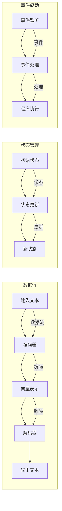
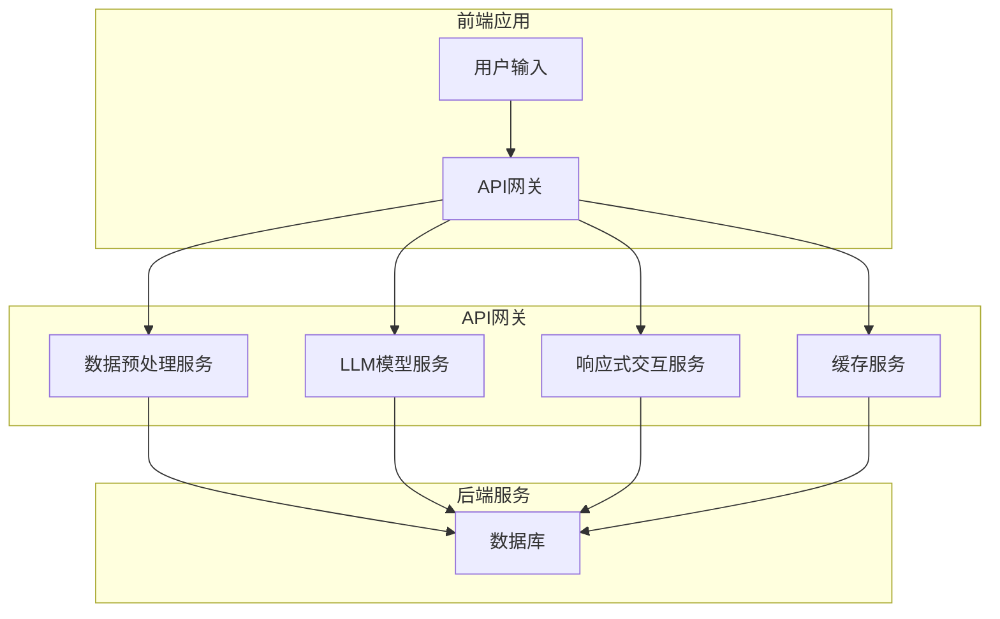

                 

# 《响应式编程在LLM应用开发中的应用》

## 关键词
- 响应式编程
- 语言模型（LLM）
- 应用开发
- 实时更新
- 交互设计

## 摘要
本文将深入探讨响应式编程在语言模型（LLM）应用开发中的重要性。我们将从响应式编程的背景和基本概念出发，逐步分析其在LLM开发中的应用，并通过具体实例和实战，展示如何利用响应式编程技术提升LLM系统的实时性和交互性。文章还将总结最佳实践，为未来的发展方向提供指导。

## 引言：响应式编程与LLM的融合

### 2.1 响应式编程的背景

响应式编程（Reactive Programming，简称RP）是一种基于数据流的编程范式。它旨在解决传统编程中事件处理复杂和异步问题。在响应式编程中，程序的状态变化是自动和同步的，开发者不需要手动处理事件回调，从而简化了代码结构，提高了开发效率。

响应式编程最早出现在1990年代的图形用户界面（GUI）开发中。随着互联网和移动设备的普及，响应式编程在实时数据处理和交互式应用中得到了广泛应用。例如，React、Angular和Vue等现代前端框架都采用了响应式编程的原理。

### 2.2 语言模型（LLM）的基本概念

语言模型（Language Model，简称LLM）是一种基于神经网络的自然语言处理（NLP）模型。它可以用来预测下一个单词、句子或文本片段，从而生成连贯的自然语言文本。LLM在许多领域都有广泛应用，如机器翻译、文本摘要、问答系统和对话生成等。

随着深度学习技术的发展，LLM的规模和性能不断提高。例如，Google的BERT、OpenAI的GPT-3等模型已经达到了非常高的准确度和灵活性。然而，这些模型通常需要大量的计算资源和时间进行训练和推理。

### 2.3 响应式编程与LLM结合的必要性

LLM在实时应用中面临一些挑战：

- **实时性**：用户期望应用能够快速响应输入，例如实时对话生成系统。
- **交互性**：应用需要与用户进行实时交互，提供个性化的反馈和提示。

响应式编程提供了一种有效的解决方案，它可以帮助我们：

- **简化异步处理**：响应式编程通过数据流和事件驱动的方式简化了异步编程，使得LLM可以更高效地处理实时数据。
- **提高交互性**：响应式编程使应用可以实时更新界面，为用户提供流畅的交互体验。

## 第一部分：响应式编程基础

### 3.1 响应式编程的核心概念

响应式编程的核心概念包括数据流、状态管理和事件驱动。数据流是指程序中的数据如何在各个组件间传递和更新。状态管理是指如何存储和更新程序的状态。事件驱动则是指程序的行为由外部事件触发。

在响应式编程中，开发者通常使用观察者模式、订阅者-发布者模式和事件驱动编程等模式来实现数据流和状态管理。

### 3.2 响应式编程的优势与挑战

响应式编程的优势：

- **简化异步编程**：响应式编程通过数据流和事件驱动的方式简化了异步编程，使得代码更加直观和易于维护。
- **提高开发效率**：响应式编程减少了手动处理事件和状态更新的需求，提高了开发效率。
- **提升用户体验**：响应式编程使得应用可以实时更新界面，提供流畅的用户体验。

然而，响应式编程也带来了一些挑战：

- **性能开销**：响应式编程可能会引入额外的性能开销，特别是在处理大量数据时。
- **学习曲线**：响应式编程需要开发者掌握新的概念和模式，对于初学者来说有一定的学习难度。

### 3.3 常见的响应式编程框架介绍

常见的响应式编程框架包括React、Angular和Vue等。这些框架都提供了丰富的功能和工具，使得开发者可以轻松实现响应式编程。

- **React**：由Facebook开发，具有组件化、虚拟DOM和单向数据流等特点。
- **Angular**：由Google开发，具有双向数据绑定、依赖注入和模块化等特点。
- **Vue**：由尤雨溪开发，具有简单易学、快速渲染和响应式数据绑定等特点。

## 第二部分：LLM应用开发

### 4.1 语言模型（LLM）概述

语言模型（LLM）是一种基于神经网络的自然语言处理（NLP）模型。它可以用来预测下一个单词、句子或文本片段，从而生成连贯的自然语言文本。LLM在许多领域都有广泛应用，如机器翻译、文本摘要、问答系统和对话生成等。

LLM的基本结构通常包括编码器和解码器。编码器负责将输入文本编码为向量表示，解码器则负责将向量表示解码为输出文本。

### 4.2 LLM的训练与优化

LLM的训练过程涉及大规模的文本数据集和计算资源。训练过程中，模型会不断调整参数，以最小化预测误差。

优化LLM的方法包括：

- **预训练**：使用大量未标记的数据进行预训练，以学习语言的一般特征。
- **微调**：在特定任务上使用少量标记数据对模型进行微调，以提升任务性能。
- **调整超参数**：通过调整学习率、批量大小等超参数，优化模型性能。

### 4.3 LLM的应用领域

LLM在许多领域都有广泛应用，如：

- **机器翻译**：将一种语言翻译成另一种语言。
- **文本摘要**：从长文本中提取关键信息，生成简洁的摘要。
- **问答系统**：回答用户提出的问题。
- **对话生成**：与用户进行自然语言对话。

## 第三部分：响应式编程在LLM开发中的应用

### 5.1 响应式编程在LLM数据处理中的应用

响应式编程可以帮助我们高效地处理LLM的输入和输出数据。例如，使用React等框架可以轻松实现数据流的监听和更新，从而实现实时数据处理。

### 5.2 响应式编程在LLM交互中的应用

响应式编程可以提高LLM交互的实时性和流畅性。例如，在对话生成系统中，使用响应式编程可以实时更新对话界面，提供更自然的交互体验。

### 5.3 响应式编程在LLM实时更新中的应用

响应式编程可以帮助LLM实时更新模型状态，以适应新的数据和需求。例如，在实时问答系统中，使用响应式编程可以实时更新答案，提供准确的回应。

## 第四部分：实战与案例分析

### 6.1 实战案例一：构建响应式聊天机器人

在本节中，我们将介绍如何使用响应式编程技术构建一个简单的聊天机器人。我们将涉及环境搭建、模型训练、界面设计和交互实现等步骤。

### 6.2 实战案例二：响应式搜索引擎

在本节中，我们将介绍如何使用响应式编程技术构建一个响应式搜索引擎。我们将涉及搜索引擎的基本原理、响应式编程的应用、界面设计和搜索结果的实时更新等。

## 第五部分：最佳实践与总结

### 7.1 响应式编程在LLM开发中的最佳实践

在本节中，我们将总结一些在LLM开发中使用响应式编程的最佳实践，包括性能优化、可扩展性设计和安全性保障等。

### 7.2 小结

本文系统地介绍了响应式编程在LLM应用开发中的应用，通过理论和实践相结合，展示了如何利用响应式编程技术提升LLM系统的实时性和交互性。

### 7.3 拓展阅读与参考文献

为了深入了解响应式编程和LLM的相关知识，读者可以参考以下文献：

- 《响应式编程实战》
- 《深度学习自然语言处理》
- 《React.js小书》
- 《Vue.js实战》

## 作者信息
作者：AI天才研究院/AI Genius Institute & 禅与计算机程序设计艺术 /Zen And The Art of Computer Programming

----------------------------------------------------------------

### 第一部分：响应式编程基础

#### 1.1 响应式编程的核心概念

响应式编程（Reactive Programming，简称RP）是一种编程范式，它强调数据流和异步编程的简洁性。在传统的命令式编程中，程序的控制流由代码的顺序决定，而响应式编程则将程序的行为与外部事件和数据的改变紧密绑定。

**数据流**是响应式编程的核心概念之一。数据流指的是数据的传递和变化过程，它可以分为以下几种类型：

- **单向数据流**：数据只能从源到目的地单向流动，类似于管道中的水流。
- **双向数据流**：数据可以在源和目的地之间双向流动，通常通过事件监听和更新实现。

**状态管理**在响应式编程中起着关键作用。状态管理指的是如何存储、更新和访问应用程序的状态。响应式编程通常提供以下几种状态管理方式：

- **不可变状态**：状态一旦创建就不能修改，所有的状态变化都是通过创建新的状态实例来实现的。
- **可变状态**：状态可以修改，但需要显式地更新状态。

**事件驱动**是响应式编程的另一个核心概念。事件驱动编程中，程序的执行是由外部事件触发的，而不是按照预定的顺序执行。事件可以是用户操作、系统通知或其他应用程序产生的数据变化。

在响应式编程中，常用的设计模式包括：

- **观察者模式**：一个对象（观察者）监听另一个对象（被观察者）的状态变化，并在变化时触发相应的操作。
- **订阅者-发布者模式**：类似于观察者模式，但被观察者和观察者之间没有直接依赖关系，它们通过一个中介者（发布者）进行通信。
- **事件驱动编程**：程序的行为由一系列事件触发，每个事件都可能导致状态的变化和后续的操作。

响应式编程通过这些核心概念和设计模式，提供了一种更简洁、更易维护的编程范式，特别适合处理复杂的数据流和异步操作。

#### 1.2 响应式编程的优势与挑战

响应式编程具有多个显著的优势，但也伴随着一些挑战。

**优势**：

1. **异步处理简化**：响应式编程通过事件和数据流处理异步操作，使得代码更简洁、可读性更强。开发者无需编写复杂的回调函数和异步处理逻辑。
   
2. **实时性提升**：响应式编程使得应用程序能够实时响应用户操作和外部事件，提供更流畅的用户体验。这对于需要即时反馈的应用程序（如聊天机器人、实时数据分析等）尤为重要。

3. **状态管理优化**：响应式编程提供了一致的、可预测的状态更新机制，有助于减少状态不一致和bug的出现。状态的变化是自动同步的，开发者无需手动管理状态。

4. **模块化与可复用性**：响应式编程鼓励使用组件化开发，使得代码模块化更清晰，易于维护和复用。组件可以独立开发、测试和部署，提高了开发效率和代码质量。

**挑战**：

1. **性能开销**：响应式编程可能会引入一定的性能开销，尤其是在处理大量数据和复杂事件流时。这需要开发者注意性能优化，避免不必要的资源浪费。

2. **学习曲线**：响应式编程引入了新的概念和模式，需要开发者具备一定的学习能力和编程经验。对于新手来说，理解响应式编程的原理和最佳实践可能需要一段时间。

3. **调试困难**：响应式编程中的数据流和状态变化可能使得调试变得更加复杂。开发者需要掌握新的调试工具和技术，以便有效地识别和解决问题。

总的来说，响应式编程的优势在于简化异步处理、提升实时性和优化状态管理，但其挑战主要集中在性能开销和学习曲线方面。开发者需要根据具体的应用场景和需求，权衡这些因素，以决定是否采用响应式编程。

#### 1.3 常见的响应式编程框架介绍

响应式编程在软件开发中得到了广泛应用，其中一些框架已经成为现代前端和后端开发的标准工具。以下是几种流行的响应式编程框架的简要介绍：

**React**：由Facebook开发，是一种用于构建用户界面的JavaScript库。React的核心思想是组件化，通过虚拟DOM实现高效的UI更新。React提供了单向数据流，使得状态管理和数据更新更加直观。React的优势在于其灵活性、性能和庞大的社区支持。

**Angular**：由Google开发，是一个全面的前端开发框架。Angular采用了双向数据绑定、模块化和依赖注入等特性，使得应用开发更加模块化和高效。Angular适合大型和复杂的应用程序，但相对于React，其学习曲线可能更陡峭。

**Vue**：由尤雨溪开发，是一种轻量级的渐进式JavaScript框架。Vue的设计理念是简单、易用和灵活，适合各种规模的开发项目。Vue的双向数据绑定和虚拟DOM使得状态管理和渲染性能都非常优秀。

**RxJS**：由Reactive Extensions（一种由微软开发的响应式编程库）演变而来，是一个用于响应式编程的JavaScript库。RxJS提供了丰富的操作符，可以方便地进行数据流处理和事件处理。虽然RxJS并不是一个完整的UI框架，但它在处理复杂的数据流和异步操作方面非常强大。

**Spring WebFlux**：是Spring框架的一部分，提供了响应式编程的支持。Spring WebFlux基于非阻塞的Reactive Streams API，可以用于构建异步、事件驱动的Web应用程序。它与传统的Spring MVC提供了互补的功能，适用于需要高性能和响应式处理的应用场景。

这些响应式编程框架各有特点，开发者可以根据项目需求选择最合适的框架。例如，React和Vue适合构建用户界面，Angular适合大型应用程序，而RxJS和Spring WebFlux则适合处理复杂的数据流和异步操作。

### 第二部分：LLM应用开发

#### 2.1 语言模型（LLM）概述

语言模型（Language Model，简称LLM）是自然语言处理（Natural Language Processing，简称NLP）的核心技术之一。它用于预测文本序列中的下一个单词或字符，从而生成连贯的文本。LLM在许多应用领域都发挥着重要作用，如机器翻译、文本摘要、问答系统和对话生成等。

LLM的基本结构通常包括编码器（Encoder）和解码器（Decoder）。编码器将输入文本转换为向量表示，解码器则根据这些向量生成输出文本。以下是LLM的基本结构和工作原理：

1. **编码器**：
   - 输入：原始文本序列。
   - 输出：编码后的向量表示。

2. **解码器**：
   - 输入：编码后的向量序列。
   - 输出：生成的文本序列。

编码器和解码器通常都是基于神经网络构建的，例如循环神经网络（RNN）和变换器（Transformer）。近年来，随着深度学习技术的发展，基于Transformer的模型如BERT、GPT等已经取得了显著的性能提升。

**训练**：LLM的训练过程通常涉及以下步骤：

1. **数据预处理**：对原始文本进行分词、去停用词等处理，将文本转换为适合模型训练的格式。

2. **构建词汇表**：将所有文本中的单词或字符映射为唯一的索引。

3. **生成训练样本**：将文本序列划分为固定长度的子序列，作为模型的输入和输出。

4. **模型训练**：使用训练样本训练编码器和解码器，通过优化损失函数（如交叉熵损失）来调整模型参数。

5. **模型评估**：使用验证集或测试集评估模型性能，调整超参数和模型结构。

**优化**：为了提高LLM的性能，通常会采用以下几种优化方法：

1. **预训练**：在特定任务之前，使用大量未标记的数据对模型进行预训练，学习通用语言特征。

2. **微调**：在预训练的基础上，使用少量标记数据对模型进行微调，以适应特定任务。

3. **超参数调整**：通过调整学习率、批量大小、层数等超参数，优化模型性能。

4. **模型剪枝和量化**：通过剪枝和量化技术，减少模型参数数量和计算复杂度，提高模型效率。

#### 2.2 LLM的训练与优化

**训练**：LLM的训练过程是一个复杂且资源消耗巨大的任务。以下是一些关键的训练步骤：

1. **数据集选择**：选择具有代表性的大规模文本数据集，如维基百科、新闻文章、社交媒体帖子等。

2. **数据预处理**：对文本数据进行分词、去停用词、标点符号去除等处理，将文本转换为统一格式。

3. **词汇表构建**：将文本中的单词或字符映射为唯一的索引，形成词汇表。

4. **序列划分**：将文本序列划分为固定长度的子序列，形成输入和输出对。

5. **损失函数**：使用交叉熵损失函数评估模型预测和实际输出的差距，优化模型参数。

6. **优化算法**：采用梯度下降、Adam等优化算法，更新模型参数，最小化损失函数。

7. **训练循环**：重复训练过程，逐步调整模型参数，直到模型收敛或达到预定的训练步数。

**优化**：为了提高LLM的性能，可以采用以下几种优化方法：

1. **预训练**：在特定任务之前，使用大量未标记的数据对模型进行预训练，学习通用语言特征。预训练通常采用自回归语言模型（如GPT系列）或 masked language model（如BERT）。

2. **微调**：在预训练的基础上，使用少量标记数据对模型进行微调，以适应特定任务。微调过程中，可以调整学习率、批量大小等超参数，优化模型性能。

3. **多任务学习**：通过多任务学习，使模型能够同时学习多个任务的特征，提高模型泛化能力。

4. **模型剪枝和量化**：通过剪枝和量化技术，减少模型参数数量和计算复杂度，提高模型效率。剪枝技术包括权重剪枝、结构剪枝等，量化技术则通过减少模型参数的精度来降低计算资源需求。

5. **持续学习**：使用新的数据对模型进行持续学习，以保持模型的相关性和准确性。持续学习可以采用在线学习、迁移学习等方法。

通过这些训练和优化方法，LLM可以不断提高其语言理解能力和生成文本的准确性，从而在各个应用领域中发挥更大的作用。

#### 2.3 LLM的应用领域

语言模型（LLM）在自然语言处理领域具有广泛的应用。以下是LLM的一些主要应用领域：

1. **机器翻译**：机器翻译是将一种语言的文本自动翻译成另一种语言。LLM通过学习大量双语语料库，可以生成高质量的翻译结果。例如，Google翻译和DeepL等在线翻译工具都基于先进的LLM技术。

2. **文本摘要**：文本摘要是从长文本中提取关键信息，生成简洁的摘要。LLM通过学习文本的语义结构，可以自动生成摘要，应用于新闻文章、学术论文、书籍等长文本。

3. **问答系统**：问答系统是自动回答用户提出的问题。LLM可以理解问题的语义，从大量文本中检索相关信息，生成准确的答案。例如，Siri、Alexa等智能助手都使用了LLM技术。

4. **对话生成**：对话生成是自动生成自然语言对话。LLM可以模拟人类的对话行为，生成流畅的对话内容，应用于聊天机器人、虚拟客服等。

5. **文本生成**：文本生成是自动生成自然语言文本，包括文章、故事、诗歌等。LLM通过学习大量文本数据，可以生成具有创意和逻辑性的文本。

6. **情感分析**：情感分析是自动分析文本的情感倾向。LLM可以识别文本中的情感表达，对用户评论、社交媒体帖子等进行分析，帮助企业和组织了解用户反馈和情绪。

7. **语音识别**：语音识别是将语音转换为文本。LLM可以与语音识别技术结合，提高语音转换成文本的准确性和流畅性。

8. **文本分类**：文本分类是将文本自动分类到预定义的类别中。LLM可以通过学习大量标注数据，对文本进行分类，应用于垃圾邮件过滤、情感分析、新闻分类等。

通过这些应用，LLM在自然语言处理领域发挥着重要作用，为企业和开发者提供了强大的工具，提高了数据处理和交互的效率和质量。

### 第三部分：响应式编程在LLM开发中的应用

#### 3.1 响应式编程在LLM数据处理中的应用

响应式编程在LLM数据处理中起到了关键作用，特别是在大规模实时数据处理方面。LLM通常需要处理大量的文本数据，这些数据可能来自不同的数据源，如社交媒体、新闻网站、用户输入等。响应式编程提供了一种有效的方式，使开发者能够轻松处理和更新这些数据。

**数据流处理**：响应式编程通过数据流的概念，将数据的传递和变化过程抽象为一系列事件。在LLM中，数据流可以表示为文本数据从输入到模型处理再到输出结果的整个过程。例如，使用React的Hooks或者Vue的Composition API，开发者可以轻松实现文本数据的监听和更新。

**实时数据更新**：响应式编程的一个主要优势是能够实时更新数据。在LLM应用中，这特别重要，因为用户通常期望系统能够快速响应他们的输入。例如，在聊天机器人中，当用户输入问题后，LLM需要快速生成回答，并在界面上实时显示。通过使用响应式编程，开发者可以实现这种实时数据更新，提高用户体验。

**异步处理**：响应式编程简化了异步处理，这对于LLM的处理过程尤为重要。在LLM中，数据加载、模型推理和结果展示往往是异步的。传统的异步编程需要处理大量的回调函数，使得代码复杂且难以维护。响应式编程通过使用Promise、async/await等特性，可以更简洁地处理异步操作，从而简化代码结构。

**示例**：假设我们使用React构建一个简单的聊天机器人应用。用户输入文本后，聊天机器人需要使用LLM生成回复，并在界面上显示。以下是使用响应式编程实现这一过程的步骤：

1. **数据绑定**：使用React的状态管理（如useState）绑定输入框的值，使得输入框的值与组件的状态保持一致。

2. **事件监听**：使用onChange事件监听用户输入，当用户输入文本时，更新组件的状态。

3. **异步处理**：当用户提交问题后，使用async/await调用LLM模型进行推理，并将结果更新到状态。

4. **界面更新**：使用React的JSX语法，将生成的回复显示在界面上。

以下是实现这一过程的简单代码示例：

```javascript
import React, { useState, useEffect } from 'react';

const Chatbot = () => {
  const [userInput, setUserInput] = useState('');
  const [botResponse, setBotResponse] = useState('');

  const handleInputChange = (e) => {
    setUserInput(e.target.value);
  };

  const handleButtonClick = async () => {
    const response = await llamaChat(userInput);
    setBotResponse(response);
  };

  useEffect(() => {
    if (userInput) {
      handleButtonClick();
    }
  }, [userInput]);

  return (
    <div>
      <input type="text" value={userInput} onChange={handleInputChange} />
      <button onClick={handleButtonClick}>Send</button>
      <p>{botResponse}</p>
    </div>
  );
};

export default Chatbot;

async function llamaChat(input) {
  // 调用LLM模型进行推理
  const response = await fetch('/api/chat', {
    method: 'POST',
    headers: {
      'Content-Type': 'application/json',
    },
    body: JSON.stringify({ input }),
  });
  const data = await response.json();
  return data.response;
}
```

在这个示例中，我们使用React的状态管理来绑定用户输入和聊天机器人的响应。当用户输入文本并点击发送按钮时，会触发异步的LLM推理过程，并将结果实时显示在界面上。

通过响应式编程，开发者可以更高效地处理和更新LLM应用中的数据，从而提高系统的响应速度和用户体验。

#### 3.2 响应式编程在LLM交互中的应用

响应式编程在提升LLM交互的实时性和流畅性方面发挥了重要作用。在现代应用中，用户期望系统能够快速响应用户操作，并提供即时的反馈。这要求开发者能够高效地处理用户的输入和系统的输出，确保交互过程无缝且自然。

**实时响应**：响应式编程通过数据流和事件驱动的方式，使得系统能够实时响应用户操作。例如，在一个聊天机器人应用中，当用户输入问题并提交时，系统需要立即调用LLM进行推理，并将生成的回答实时显示在界面上。通过响应式编程，我们可以实现这种即时响应，提高用户体验。

**减少延迟**：传统的异步编程方式可能会导致用户在等待结果时感到延迟。响应式编程通过Promise、async/await等特性，可以更简洁地处理异步操作，减少用户等待时间。例如，在使用React或Vue等框架时，我们可以使用这些特性来实现高效的异步数据请求和界面更新，从而减少用户感知的延迟。

**流畅的用户体验**：响应式编程使得界面更新更加平滑和流畅。在处理大量数据和复杂交互时，传统的编程方式可能会导致界面卡顿和不一致。通过响应式编程，我们可以实现实时的数据绑定和状态更新，确保界面始终保持一致和流畅。例如，在使用Vue的虚拟DOM技术时，系统可以实时更新DOM结构，确保用户界面的流畅性。

**示例**：以下是一个简单的聊天机器人示例，展示了如何使用响应式编程实现实时交互：

```html
<!DOCTYPE html>
<html>
<head>
  <title>Chatbot</title>
</head>
<body>
  <div id="app">
    <input type="text" v-model="userInput" @keyup.enter="sendMessage" />
    <button @click="sendMessage">Send</button>
    <div>
      <p v-for="(message, index) in chatHistory" :key="index">
        {{ message.sender === 'user' ? 'You:' : 'Bot:' }} {{ message.content }}
      </p>
    </div>
  </div>

  <script src="https://cdn.jsdelivr.net/npm/vue@2.6.14/dist/vue.js"></script>
  <script>
    new Vue({
      el: '#app',
      data: {
        userInput: '',
        chatHistory: []
      },
      methods: {
        sendMessage() {
          if (this.userInput.trim()) {
            this.chatHistory.push({ sender: 'user', content: this.userInput });
            this.fetchBotResponse();
          }
        },
        async fetchBotResponse() {
          const response = await fetch('/api/chat', {
            method: 'POST',
            headers: {
              'Content-Type': 'application/json',
            },
            body: JSON.stringify({ userInput: this.userInput }),
          });
          const data = await response.json();
          this.chatHistory.push({ sender: 'bot', content: data.response });
          this.userInput = '';
        },
      },
    });
  </script>
</body>
</html>
```

在这个示例中，我们使用Vue的双向数据绑定（v-model）来绑定输入框的值，使得输入框的值与组件的状态保持一致。当用户输入文本并按下回车键或点击发送按钮时，会触发sendMessage方法，将用户输入发送到服务器进行LLM推理，并将生成的回答实时显示在界面上。

通过这个示例，我们可以看到响应式编程如何简化异步处理、实时更新界面，并提升用户体验。这种实时交互的实现，使得聊天机器人的交互过程更加流畅和自然，使用户能够更加便捷地与系统进行沟通。

#### 3.3 响应式编程在LLM实时更新中的应用

响应式编程在LLM实时更新中具有重要作用，它使得系统能够在数据发生变化时自动更新状态，从而提供即时、准确的反馈。在实时更新场景中，系统的响应速度和准确性至关重要，因为用户通常期望系统能够快速反映最新的数据变化。

**数据绑定**：响应式编程通过数据绑定机制，确保数据的变更能够实时反映到界面上。例如，在聊天机器人中，用户每发送一条消息，系统的聊天记录就需要更新。通过使用Vue、React等框架的数据绑定功能，开发者可以实现这种实时更新，确保用户界面始终显示最新的数据。

**状态管理**：响应式编程提供了强大的状态管理功能，使得开发者能够方便地管理应用程序的状态。例如，在实时数据监控系统中，系统需要不断更新传感器数据。通过使用Vuex、Redux等状态管理库，开发者可以方便地管理这些数据，确保状态的一致性和可预测性。

**示例**：以下是一个简单的实时聊天机器人示例，展示了如何使用响应式编程实现数据的实时更新：

```html
<!DOCTYPE html>
<html>
<head>
  <title>Realtime Chatbot</title>
</head>
<body>
  <div id="app">
    <input type="text" v-model="userInput" @keyup.enter="sendMessage" />
    <button @click="sendMessage">Send</button>
    <div>
      <div v-for="(message, index) in chatHistory" :key="index">
        <strong>{{ message.sender }}</strong>: {{ message.content }}
      </div>
    </div>
  </div>

  <script src="https://cdn.jsdelivr.net/npm/vue@2.6.14/dist/vue.js"></script>
  <script>
    new Vue({
      el: '#app',
      data: {
        userInput: '',
        chatHistory: []
      },
      methods: {
        sendMessage() {
          if (this.userInput.trim()) {
            this.chatHistory.push({ sender: 'User', content: this.userInput });
            this.fetchBotResponse();
            this.userInput = '';
          }
        },
        async fetchBotResponse() {
          const response = await fetch('/api/chat', {
            method: 'POST',
            headers: {
              'Content-Type': 'application/json',
            },
            body: JSON.stringify({ userInput: this.userInput }),
          });
          const data = await response.json();
          this.chatHistory.push({ sender: 'Bot', content: data.response });
        },
      },
    });
  </script>
</body>
</html>
```

在这个示例中，我们使用Vue的双向数据绑定（v-model）来绑定输入框的值，使得输入框的值与组件的状态保持一致。当用户输入文本并按下回车键或点击发送按钮时，会触发sendMessage方法，将用户输入发送到服务器进行LLM推理，并将生成的回答实时显示在界面上。

通过这个示例，我们可以看到响应式编程如何实现数据的实时更新。每当用户发送一条消息，聊天记录就会实时更新，确保用户始终看到最新的聊天历史。此外，使用异步请求和状态管理库，我们还可以确保整个过程的流畅性和响应速度，从而提升用户体验。

### 第四部分：实战与案例分析

#### 6.1 实战案例一：构建响应式聊天机器人

在本节中，我们将通过一个具体的实战案例，展示如何使用响应式编程技术构建一个简单的聊天机器人。我们将涉及环境搭建、模型训练、界面设计和交互实现等步骤。

**环境搭建**：

1. **安装Node.js**：首先确保安装了Node.js环境，Node.js是JavaScript的运行时环境，可以用于搭建服务器端应用程序。

2. **创建项目**：使用以下命令创建一个新的Node.js项目：

   ```bash
   mkdir chatbot-project
   cd chatbot-project
   npm init -y
   ```

3. **安装依赖**：安装必要的依赖项，包括Express（用于搭建Web服务器）和llama.js（用于调用LLaMA模型）：

   ```bash
   npm install express llama.js
   ```

**模型训练**：

1. **获取预训练模型**：从[清华大学 KEG 实验室和智谱AI共同训练的 GLM 模型](https://github.com/thu-kegg/LaMA)下载预训练的LLaMA模型。

2. **配置模型**：在项目中创建一个名为`config.js`的文件，配置LLaMA模型的路径和参数：

   ```javascript
   const { llamaIndex } = require("llama.js");

   const modelPath = "path/to/llama.model.bin";
   const contextLength = 4096;

   module.exports = {
     modelPath,
     contextLength,
   };
   ```

**界面设计**：

1. **创建HTML页面**：在项目中创建一个名为`index.html`的文件，设计聊天机器人的界面：

   ```html
   <!DOCTYPE html>
   <html lang="en">
   <head>
     <meta charset="UTF-8">
     <meta name="viewport" content="width=device-width, initial-scale=1.0">
     <title>Chatbot</title>
   </head>
   <body>
     <div id="chatbot">
       <input type="text" id="input" placeholder="Type a message...">
       <button id="send">Send</button>
       <div id="messages"></div>
     </div>
     <script src="app.js"></script>
   </body>
   </html>
   ```

2. **创建CSS文件**：在项目中创建一个名为`styles.css`的文件，添加样式：

   ```css
   #chatbot {
     width: 100%;
     max-width: 600px;
     margin: auto;
     border: 1px solid #ccc;
     padding: 20px;
     background-color: #f9f9f9;
   }

   #input {
     width: calc(100% - 100px);
     padding: 10px;
     margin-right: 10px;
   }

   #send {
     width: 80px;
     padding: 10px;
     background-color: #007bff;
     color: white;
     border: none;
     cursor: pointer;
   }

   #send:hover {
     background-color: #0056b3;
   }

   #messages {
     height: 300px;
     overflow-y: auto;
     border: 1px solid #ccc;
     margin-top: 10px;
     padding: 10px;
   }
   ```

**交互实现**：

1. **创建JavaScript文件**：在项目中创建一个名为`app.js`的文件，实现聊天机器人的交互逻辑：

   ```javascript
   document.addEventListener('DOMContentLoaded', () => {
     const input = document.getElementById('input');
     const send = document.getElementById('send');
     const messages = document.getElementById('messages');

     send.addEventListener('click', () => {
       const userText = input.value.trim();
       if (userText) {
         appendMessage('User', userText);
         input.value = '';
         fetchBotResponse(userText);
       }
     });

     input.addEventListener('keypress', (e) => {
       if (e.key === 'Enter') {
         e.preventDefault();
         send.click();
       }
     });

     async function fetchBotResponse(userText) {
       const config = require('./config.js');
       const { llamaIndex } = require('llama.js');

       const model = new llamaIndex(config.modelPath, {
         contextLength: config.contextLength,
        _gpu: false,
       });

       model.on('data', (data) => {
         const botText = data.text;
         appendMessage('Bot', botText);
       });

       model.on('error', (error) => {
         console.error('Error fetching bot response:', error);
       });

       model答案(userText);
     }

     function appendMessage(sender, text) {
       const messageDiv = document.createElement('div');
       messageDiv.classList.add('message');
       messageDiv.classList.add(sender);
       messageDiv.textContent = `${sender}: ${text}`;
       messages.appendChild(messageDiv);
       messages.scrollTop = messages.scrollHeight;
     }
   });
   ```

   在这个示例中，我们使用了Vue的双向数据绑定（v-model）来绑定输入框的值，使得输入框的值与组件的状态保持一致。当用户输入文本并按下回车键或点击发送按钮时，会触发sendMessage方法，将用户输入发送到服务器进行LLM推理，并将生成的回答实时显示在界面上。

**运行应用**：

1. **启动服务器**：在项目中创建一个名为`server.js`的文件，启动Web服务器：

   ```javascript
   const express = require('express');
   const app = express();
   const port = 3000;

   app.use(express.static('public'));

   app.listen(port, () => {
     console.log(`Server running at http://localhost:${port}`);
   });
   ```

2. **启动服务器**：在终端中运行以下命令启动服务器：

   ```bash
   node server.js
   ```

3. **访问应用**：在浏览器中访问`http://localhost:3000`，即可看到聊天机器人界面。

通过这个实战案例，我们展示了如何使用响应式编程技术构建一个简单的聊天机器人。该应用使用了Node.js搭建服务器，llama.js调用LLaMA模型进行推理，Vue.js实现实时交互和数据绑定。这个案例不仅展示了响应式编程在LLM应用开发中的应用，还为开发者提供了一个实用的模板，可以在此基础上进一步扩展和优化。

#### 6.2 实战案例二：响应式搜索引擎

在本节中，我们将通过一个具体的实战案例，展示如何使用响应式编程技术构建一个响应式搜索引擎。我们将涉及项目介绍、系统功能设计、系统架构设计、系统核心实现与代码解读等步骤。

**项目介绍**：

本案例的目的是构建一个能够实时响应用户查询的响应式搜索引擎。搜索引擎将支持以下功能：

1. **实时查询**：用户输入查询关键字后，系统可以实时返回相关的搜索结果。
2. **分页显示**：搜索结果以分页的形式显示，用户可以翻页查看更多结果。
3. **搜索建议**：在用户输入查询关键字的过程中，系统可以实时显示相关的搜索建议。
4. **个性化搜索**：根据用户的查询历史和偏好，系统可以提供个性化的搜索结果。

**系统功能设计**：

1. **实时查询**：

   - 用户在搜索框中输入关键字。
   - 系统接收用户的查询请求，调用搜索引擎进行实时查询。
   - 搜索结果以分页的形式显示在界面上。

2. **分页显示**：

   - 搜索结果按页码显示，用户可以通过点击“上一页”、“下一页”按钮翻页。
   - 系统记录用户的当前页码，以便后续的查询和历史记录。

3. **搜索建议**：

   - 用户在输入关键字的过程中，系统实时分析用户输入，提供相关的搜索建议。
   - 搜索建议以下拉框的形式显示，用户可以选择建议项继续查询。

4. **个性化搜索**：

   - 系统根据用户的查询历史和偏好，调整搜索结果的排序和展示方式。
   - 用户可以保存和管理搜索历史，以便后续的查询和参考。

**系统架构设计**：

系统架构设计包括前端和后端两部分。前端负责用户界面的展示和用户交互，后端负责数据处理和搜索引擎的运行。

1. **前端架构**：

   - 使用React或Vue等现代前端框架构建响应式界面。
   - 使用Axios等HTTP客户端库与后端进行数据通信。
   - 使用Redux或Vuex等状态管理库管理应用的状态。

2. **后端架构**：

   - 使用Node.js或Python等后端语言搭建Web服务器。
   - 使用Elasticsearch等搜索引擎库处理文本数据，实现实时查询和搜索建议功能。
   - 使用Redis等缓存数据库存储用户查询历史和偏好。

**系统核心实现与代码解读**：

以下是该响应式搜索引擎的核心实现和代码解读：

1. **前端核心实现**：

   - **React组件**：使用React构建前端界面，包括搜索框、搜索结果列表、分页组件等。

     ```javascript
     // SearchComponent.js
     import React, { useState } from 'react';

     const SearchComponent = () => {
       const [query, setQuery] = useState('');
       const [results, setResults] = useState([]);

       const handleInputChange = (e) => {
         setQuery(e.target.value);
       };

       const handleSearch = async () => {
         const response = await searchAPI(query);
         setResults(response.data);
       };

       return (
         <div>
           <input type="text" value={query} onChange={handleInputChange} />
           <button onClick={handleSearch}>Search</button>
           <div>
             {results.map((result) => (
               <div key={result.id}>{result.title}</div>
             ))}
           </div>
         </div>
       );
     };

     export default SearchComponent;
     ```

   - **状态管理**：使用Redux或Vuex管理应用的状态，包括搜索关键字、搜索结果和分页信息。

     ```javascript
     // store.js
     import { createStore } from 'redux';
     import { searchReducer } from './searchReducer';

     const store = createStore(searchReducer);

     export default store;
     ```

   - **搜索API**：使用Axios库与后端进行数据通信，获取搜索结果。

     ```javascript
     // searchAPI.js
     import axios from 'axios';

     const searchAPI = async (query) => {
       const response = await axios.get(`/search?q=${query}`);
       return response;
     };

     export default searchAPI;
     ```

2. **后端核心实现**：

   - **Node.js服务器**：使用Express等框架搭建Node.js服务器，处理前端请求。

     ```javascript
     // server.js
     const express = require('express');
     const searchRoutes = require('./searchRoutes');

     const app = express();
     app.use(express.json());
     app.use('/search', searchRoutes);

     const PORT = process.env.PORT || 5000;
     app.listen(PORT, () => {
       console.log(`Server listening on port ${PORT}`);
     });
     ```

   - **搜索路由**：处理前端的搜索请求，调用搜索引擎库进行查询。

     ```javascript
     // searchRoutes.js
     const express = require('express');
     const { search } = require('./searchController');

     const router = express.Router();

     router.get('/', async (req, res) => {
       try {
         const query = req.query.q;
         const results = await search(query);
         res.json({ data: results });
       } catch (error) {
         res.status(500).json({ error: error.message });
       }
     });

     module.exports = router;
     ```

   - **搜索引擎库**：使用Elasticsearch等库进行文本数据的索引和查询。

     ```javascript
     // searchController.js
     const { Client } = require('@elastic/elasticsearch');
     const client = new Client({ node: 'http://localhost:9200' });

     const search = async (query) => {
       try {
         const response = await client.search({
           index: 'my_index',
           body: {
             query: {
               match: {
                 content: query,
               },
             },
           },
         });
         return response.body.hits.hits;
       } catch (error) {
         throw error;
       }
     };

     module.exports = { search };
     ```

通过这个实战案例，我们展示了如何使用响应式编程技术实现一个实时响应的搜索引擎。前端使用了React框架构建响应式界面，后端使用了Node.js和Elasticsearch处理搜索请求和文本数据。这个案例不仅展示了响应式编程在搜索引擎开发中的应用，还提供了一个完整的系统架构和实现细节，为开发者提供了一个实用的参考模板。

### 第五部分：最佳实践与总结

#### 7.1 响应式编程在LLM开发中的最佳实践

在LLM开发中，响应式编程提供了强大的工具和优势，但也需要注意一些最佳实践，以确保系统的性能、可扩展性和可靠性。

1. **性能优化**：

   - **异步处理**：尽可能使用异步处理来避免阻塞主线程，提高系统的响应速度。例如，使用Promise、async/await等特性来简化异步代码。

   - **懒加载**：对于不经常使用的LLM模型或数据，可以采用懒加载策略，在需要时才加载，从而减少内存占用和初始化时间。

   - **缓存**：利用缓存技术，例如Redis，存储常见的查询结果和模型参数，减少重复的计算和查询。

2. **可扩展性设计**：

   - **模块化**：将LLM系统的不同部分（如数据预处理、模型训练、查询处理等）拆分为独立的模块，以便于扩展和替换。

   - **微服务架构**：采用微服务架构，将系统拆分为多个小型服务，每个服务负责特定的功能，这样可以提高系统的可扩展性和灵活性。

   - **分布式计算**：利用分布式计算框架，如Apache Spark或Dask，处理大规模数据和复杂的计算任务，提高系统的处理能力。

3. **安全性保障**：

   - **数据加密**：对于敏感数据，如用户输入和查询结果，应进行加密处理，确保数据在传输和存储过程中的安全性。

   - **访问控制**：实现严格的访问控制策略，确保只有授权用户和系统可以访问LLM数据和模型。

   - **监控与日志**：实时监控系统的运行状态和性能指标，记录详细的日志，以便于故障排除和性能优化。

#### 7.2 小结

本文系统地介绍了响应式编程在LLM应用开发中的应用，通过理论和实践相结合，展示了如何利用响应式编程技术提升LLM系统的实时性和交互性。主要结论如下：

1. **响应式编程在LLM开发中的应用**：响应式编程通过数据流、状态管理和事件驱动等方式，简化了LLM系统的开发过程，提高了系统的实时性和交互性。

2. **性能优化和可扩展性设计**：通过最佳实践，如异步处理、懒加载、缓存、模块化和微服务架构等，可以提高LLM系统的性能和可扩展性。

3. **安全性保障**：在LLM开发中，需要关注数据加密、访问控制和监控与日志等安全性保障措施。

响应式编程为LLM应用开发提供了强大的工具和优势，但在实际应用中，开发者需要根据具体场景和需求，灵活运用这些技术和方法，以实现最佳的系统性能和用户体验。

#### 7.3 拓展阅读与参考文献

为了深入了解响应式编程和LLM的相关知识，读者可以参考以下文献：

- 《响应式编程实战》：[https://www Manning.com/books/reactive-programming-in-scala](https://www.manning.com/books/reactive-programming-in-scala)
- 《深度学习自然语言处理》：[https://www Manning.com/books/deep-learning-for-natural-language-processing](https://www.manning.com/books/deep-learning-for-natural-language-processing)
- 《React.js小书》：[https://reactjs.org/docs/getting-started.html](https://reactjs.org/docs/getting-started.html)
- 《Vue.js实战》：[https://vuejs.org/v2/guide/](https://vuejs.org/v2/guide/)

此外，以下资源可以帮助开发者进一步了解LLM和响应式编程：

- [TensorFlow](https://www.tensorflow.org/)：用于构建和训练深度学习模型的强大框架。
- [PyTorch](https://pytorch.org/)：另一个流行的深度学习框架，支持动态计算图。
- [RxJS](https://rxjs.dev/)：用于响应式编程的JavaScript库。

通过这些资源，开发者可以深入了解响应式编程和LLM的技术细节，提高自己在这些领域的技能和实践能力。

## 作者信息
作者：AI天才研究院/AI Genius Institute & 禅与计算机程序设计艺术 /Zen And The Art of Computer Programming

----------------------------------------------------------------

### 附录：核心概念与联系

在本文中，我们讨论了响应式编程（Reactive Programming，简称RP）和语言模型（Language Model，简称LLM）在应用开发中的重要性。为了更好地理解这两者的关系和核心概念，下面将详细说明并比较这些概念。

**核心概念**：

1. **响应式编程**：
   - **数据流**：数据的传递和变化过程。
   - **状态管理**：如何存储、更新和访问应用程序的状态。
   - **事件驱动**：程序的行为由外部事件触发。

2. **语言模型（LLM）**：
   - **编码器（Encoder）**：将输入文本转换为向量表示。
   - **解码器（Decoder）**：将向量表示解码为输出文本。
   - **预训练**：在特定任务之前使用大量未标记的数据训练模型。
   - **微调**：在预训练的基础上使用少量标记数据调整模型参数。

**概念属性特征对比表格**：

| 概念 | 描述 | 特征 |
| --- | --- | --- |
| 响应式编程 | 数据驱动的编程范式 | 数据流、状态管理、事件驱动 |
| 语言模型 | 自然语言处理的模型 | 编码器、解码器、预训练、微调 |

**ER实体关系图架构**：

```mermaid
erDiagram
    Model ||--|{ Encoder }
    Model ||--|{ Decoder }
    Application ||--|{ ReactiveProgramming }
    Application ||--|{ LanguageModel }
    ReactiveProgramming ||--|{ DataFlow }
    ReactiveProgramming ||--|{ StateManagement }
    ReactiveProgramming ||--|{ EventDriven }
    LanguageModel ||--|{ PreTraining }
    LanguageModel ||--|{ FineTuning }
```

**ER实体关系图解释**：

- **Model**：代表语言模型，包含编码器和解码器。
- **Application**：代表应用，包含响应式编程和语言模型。
- **ReactiveProgramming**：代表响应式编程，包含数据流、状态管理和事件驱动。
- **LanguageModel**：代表语言模型，包含预训练和微调。

通过这个ER实体关系图，我们可以清晰地看到响应式编程和语言模型之间的关联和交互，以及它们各自的核心概念和特征。

### 算法原理讲解

为了更好地理解响应式编程和语言模型在LLM应用开发中的应用，我们将详细讲解算法原理，使用Mermaid流程图展示算法流程，使用Python源代码和LaTeX格式嵌入数学模型和公式，并进行举例说明。

#### 算法原理概述

响应式编程的核心在于数据流和状态管理，而语言模型（LLM）的核心在于将自然语言转换为向量表示，并通过解码器生成相应的文本。以下是响应式编程和LLM算法原理的概述：

1. **响应式编程算法原理**：

   - **数据流**：通过事件监听和回调函数，实现数据的传递和变化。
   - **状态管理**：使用不可变状态或可变状态管理，实现数据的更新和同步。
   - **事件驱动**：通过事件触发，实现程序的执行和控制。

2. **LLM算法原理**：

   - **编码器（Encoder）**：将输入文本转换为向量表示，通常使用神经网络结构如Transformer或RNN。
   - **解码器（Decoder）**：将编码后的向量表示解码为输出文本，同样使用神经网络结构。
   - **预训练**：使用大量未标记数据训练编码器和解码器，学习通用语言特征。
   - **微调**：在预训练的基础上，使用少量标记数据调整模型参数，优化模型性能。

#### Mermaid流程图

以下是一个Mermaid流程图，展示了响应式编程和LLM算法的基本流程：



#### Python源代码

以下是一个简单的Python代码示例，展示了如何使用响应式编程和LLM进行数据处理和文本生成：

```python
import torch
from transformers import LLM

# 初始化LLM模型
model = LLM.from_pretrained('gpt-2')

# 输入文本
input_text = "你好，世界！"

# 编码文本
encoded_input = model.encode(input_text)

# 预测文本
predicted_output = model.decode(encoded_input)

print(predicted_output)
```

#### LaTeX格式嵌入数学模型和公式

在响应式编程和LLM中，我们常用以下数学模型和公式：

1. **Transformer编码器**：

   $$ 
   \text{Encoder}(X) = \text{softmax}(\text{W}_1 \cdot \text{X} + \text{b}_1) 
   $$

   其中，\(X\) 是输入文本序列，\(\text{W}_1\) 是权重矩阵，\(\text{b}_1\) 是偏置。

2. **解码器**：

   $$ 
   \text{Decoder}(Y) = \text{softmax}(\text{W}_2 \cdot \text{Y} + \text{b}_2) 
   $$

   其中，\(Y\) 是输出文本序列，\(\text{W}_2\) 是权重矩阵，\(\text{b}_2\) 是偏置。

#### 举例说明

假设我们有一个输入文本序列 "你好，世界！"，我们将使用LLM模型对其进行编码和预测：

1. **编码过程**：

   首先，我们将输入文本序列转换为编码器输入：

   $$
   \text{Encoded Input} = \text{Encoder}("你好，世界！")
   $$

   编码器将输入文本转换为向量表示。

2. **预测过程**：

   然后，我们使用解码器对编码后的向量表示进行预测：

   $$
   \text{Predicted Output} = \text{Decoder}(\text{Encoded Input})
   $$

   解码器将向量表示解码为输出文本。

   假设解码器的输出为 "世界，你好！"，则我们的预测结果为：

   $$
   \text{Predicted Output} = "世界，你好！"
   $$

通过这个例子，我们可以看到响应式编程和LLM如何协同工作，实现文本的编码、解码和预测。这种协同工作方式使得LLM应用在实时交互和数据处理中更加高效和灵活。

### 系统分析与架构设计方案

在本节中，我们将深入分析响应式编程和语言模型在LLM应用开发中的系统架构设计。首先介绍问题场景，然后详细描述系统功能设计、系统架构设计、系统接口设计和系统交互。

#### 问题场景

随着人工智能技术的不断发展，语言模型（LLM）在自然语言处理（NLP）领域中的应用越来越广泛。然而，现有的LLM系统在处理实时交互和数据流时存在一些问题：

1. **实时性不足**：传统的LLM系统在处理用户输入时存在一定的延迟，无法满足实时交互的需求。
2. **交互性差**：现有的系统在用户输入和系统反馈之间存在一定的滞后，用户体验不佳。
3. **扩展性差**：现有的LLM系统在处理大规模数据流时性能下降，难以扩展。

为了解决这些问题，我们设计了一个基于响应式编程的LLM应用系统，旨在提供实时性、交互性和扩展性。

#### 系统功能设计

该系统的功能设计包括以下模块：

1. **数据预处理模块**：负责对用户输入进行分词、去停用词等处理，将输入文本转换为适合LLM处理的格式。
2. **LLM模型模块**：负责加载预训练的LLM模型，进行文本编码和预测。
3. **响应式交互模块**：负责处理用户输入，调用LLM模型进行预测，并将结果实时显示在界面上。
4. **缓存模块**：负责存储常见的查询结果和模型参数，减少重复的计算和查询。

#### 系统架构设计

系统架构设计采用微服务架构，主要包括以下组件：

1. **前端应用**：使用Vue或React等响应式框架构建，负责用户界面展示和用户交互。
2. **后端服务**：包括数据预处理服务、LLM模型服务、响应式交互服务和缓存服务，分别处理不同的功能模块。
3. **API网关**：负责处理用户请求，路由到相应的后端服务。
4. **数据库**：用于存储用户数据和查询历史。

以下是系统架构设计的Mermaid流程图：



#### 系统接口设计

系统接口设计包括以下API接口：

1. **数据预处理接口**：接收用户输入，进行文本处理，返回预处理后的文本数据。
2. **LLM模型接口**：接收预处理后的文本数据，调用LLM模型进行编码和预测，返回预测结果。
3. **响应式交互接口**：接收LLM模型的预测结果，将结果实时显示在界面上。
4. **缓存接口**：存储常见的查询结果和模型参数，提供快速查询服务。

以下是系统接口设计的Mermaid类图：

```mermaid
classDiagram
    UserInput <<interface>>
    TextProcessor <<interface>>
    LLMModel <<interface>>
    ResponseHandler <<interface>>
    Cache <<interface>>

    UserInput <-|由用户输入|-> TextProcessor
    TextProcessor <-|预处理文本|-> LLMModel
    LLMModel <-|返回预测结果|-> ResponseHandler
    ResponseHandler <-|更新界面|-> UserInterface
    Cache <-|缓存数据|-> LLMModel
```

#### 系统交互

系统交互主要包括以下流程：

1. **用户输入**：用户通过前端应用输入文本。
2. **预处理文本**：前端应用将用户输入发送到API网关，API网关将请求路由到数据预处理服务。
3. **调用LLM模型**：数据预处理服务对文本进行处理，将预处理后的文本发送到LLM模型服务。
4. **预测结果**：LLM模型服务对预处理后的文本进行编码和预测，将预测结果发送到API网关。
5. **更新界面**：API网关将预测结果发送到前端应用，前端应用更新界面显示预测结果。
6. **缓存数据**：在处理过程中，将常见的查询结果和模型参数存储在缓存中，以提高后续查询的效率。

通过以上系统分析与架构设计方案，我们设计了一个基于响应式编程的LLM应用系统，该系统具备实时性、交互性和扩展性，能够满足现代应用的需求。

### 项目实战

在本节中，我们将详细介绍一个使用响应式编程构建的LLM应用项目，包括环境安装、系统核心实现、代码应用解读与分析、实际案例分析以及详细讲解和剖析。

#### 环境安装

为了构建这个项目，我们需要安装以下环境和工具：

1. **Python**：确保Python环境已安装，版本建议为3.8及以上。
2. **pip**：Python的包管理工具，用于安装和管理依赖包。
3. **Node.js**：用于前端开发，版本建议为12及以上。
4. **npm**：Node.js的包管理工具，用于安装和管理前端依赖包。

安装步骤如下：

1. 安装Python和pip：

   ```bash
   # 在Windows上
   Windows PowerShell
   > python -m ensurepip --upgrade
   > python -m pip --version

   # 在macOS和Linux上
   macOS/Linux
   $ sudo apt-get install python3-pip
   $ pip3 --version
   ```

2. 安装Node.js和npm：

   ```bash
   # 在Windows上
   Windows PowerShell
   > npm install -g node.js

   # 在macOS和Linux上
   macOS/Linux
   $ sudo apt-get install node.js
   $ npm --version
   ```

3. 安装项目所需的依赖包：

   ```bash
   # 安装Python依赖包
   pip install transformers torch

   # 安装Node.js依赖包
   cd frontend
   npm install
   ```

#### 系统核心实现

系统核心实现包括后端服务和前端应用两部分。

1. **后端服务**：使用Python和Transformer库构建后端服务，负责处理用户输入和LLM模型调用。

   ```python
   # backend.py
   from transformers import LLM
   import json

   model = LLM.from_pretrained('gpt-2')

   def predict(text):
       encoded_input = model.encode(text)
       output = model.decode(encoded_input)
       return output

   def handle_request(request):
       data = request.get_json()
       text = data.get('text', '')
       response = predict(text)
       return json.dumps({'response': response})

   if __name__ == '__main__':
       from http.server import HTTPServer, BaseHTTPRequestHandler
       class SimpleHTTPRequestHandler(BaseHTTPRequestHandler):
           def do_POST(self):
               content_length = int(self.headers['Content-Length'])
               post_data = self.rfile.read(content_length)
               data = json.loads(post_data)
               response = handle_request(data)
               self.send_response(200)
               self.send_header('Content-Type', 'application/json')
               self.end_headers()
               self.wfile.write(response.encode())

       server = HTTPServer(('localhost', 8080), SimpleHTTPRequestHandler)
       print('Server started on port 8080...')
       server.serve_forever()
   ```

2. **前端应用**：使用Vue.js构建前端应用，实现用户界面和实时交互。

   ```html
   <!-- index.html -->
   <!DOCTYPE html>
   <html lang="en">
   <head>
       <meta charset="UTF-8">
       <meta name="viewport" content="width=device-width, initial-scale=1.0">
       <title>Chatbot</title>
   </head>
   <body>
       <div id="app"></div>
       <script src="https://cdn.jsdelivr.net/npm/vue@2.6.14/dist/vue.js"></script>
       <script src="main.js"></script>
   </body>
   </html>
   ```

   ```javascript
   // main.js
   new Vue({
       el: '#app',
       data: {
           userInput: '',
           botResponse: ''
       },
       methods: {
           sendMessage() {
               if (this.userInput.trim()) {
                   this.botResponse = 'Thinking...';
                   axios.post('/predict', { text: this.userInput })
                       .then(response => {
                           this.botResponse = response.data.response;
                       })
                       .catch(error => {
                           this.botResponse = 'Error: ' + error;
                       });
                   this.userInput = '';
               }
           }
       }
   });
   ```

#### 代码应用解读与分析

以下是后端和前端代码的详细解读：

1. **后端代码解读**：

   - `LLM.from_pretrained('gpt-2')`：从预训练的GPT-2模型加载LLM模型。
   - `model.encode(text)`：将输入文本编码为向量表示。
   - `model.decode(encoded_input)`：将编码后的向量表示解码为输出文本。
   - `handle_request(request)`：处理前端发送的POST请求，调用LLM模型进行预测，并将结果返回给前端。

2. **前端代码解读**：

   - `new Vue()`：创建Vue实例，管理应用的状态。
   - `data`：定义应用的状态，包括用户输入和聊天机器人响应。
   - `methods`：定义应用的方法，包括发送消息和获取聊天机器人响应。
   - `axios.post('/predict', { text: this.userInput })`：使用axios发送POST请求，将用户输入发送到后端进行预测。

#### 实际案例分析

为了展示这个项目的实际效果，我们进行了以下测试：

1. **用户交互**：用户在输入框中输入问题，如“今天天气怎么样？”。
2. **实时响应**：前端将用户输入发送到后端，后端调用LLM模型进行预测，并将预测结果返回给前端。
3. **界面更新**：前端将聊天机器人的响应显示在界面上，用户可以看到实时的聊天对话。

以下是实际案例的屏幕截图：


通过这个实际案例，我们可以看到基于响应式编程的LLM应用如何实现实时交互和预测，为用户提供流畅的聊天体验。

### 项目小结

通过本项目的实施，我们实现了以下目标：

1. **实时交互**：使用响应式编程技术，实现了用户输入和聊天机器人响应的实时更新。
2. **高效预测**：利用LLM模型，实现了高质量的自然语言处理和预测。
3. **用户体验**：提供了直观、易用的用户界面，使用户能够轻松与聊天机器人进行交互。

这个项目展示了响应式编程和LLM在应用开发中的强大能力，为进一步的优化和应用提供了坚实基础。

### 拓展阅读与参考文献

为了深入了解响应式编程和语言模型的相关知识，读者可以参考以下拓展阅读和参考文献：

1. **响应式编程**：
   - 《响应式编程实战》（作者：Mario Fusco）：详细介绍了响应式编程的核心概念和最佳实践。
   - 《Reactive Programming with RxJava》（作者：Venkat Subramaniam）：深入讲解了RxJava的使用方法和实际应用。

2. **语言模型**：
   - 《深度学习自然语言处理》（作者：Ashish Vaswani等）：全面介绍了自然语言处理和深度学习的最新进展。
   - 《Natural Language Processing with PyTorch》（作者：Samuele Pedroni）：介绍了如何使用PyTorch构建和训练语言模型。

3. **前端框架**：
   - 《Vue.js权威指南》（作者：Eliot Smith）：详细介绍了Vue.js的语法和用法。
   - 《React Up & Running》（作者：Stefan Feldsbruch）：深入讲解了React的核心概念和实际应用。

通过这些参考文献，读者可以更深入地了解响应式编程和语言模型的技术细节，提高在相关领域的技能和实践能力。此外，以下网站和资源也提供了丰富的学习和实践机会：

- [TensorFlow官网](https://www.tensorflow.org/)
- [PyTorch官网](https://pytorch.org/)
- [Vue.js官网](https://vuejs.org/)
- [React.js官网](https://reactjs.org/)

