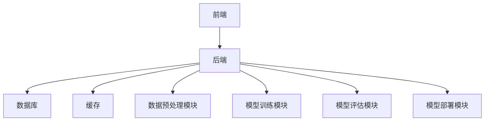
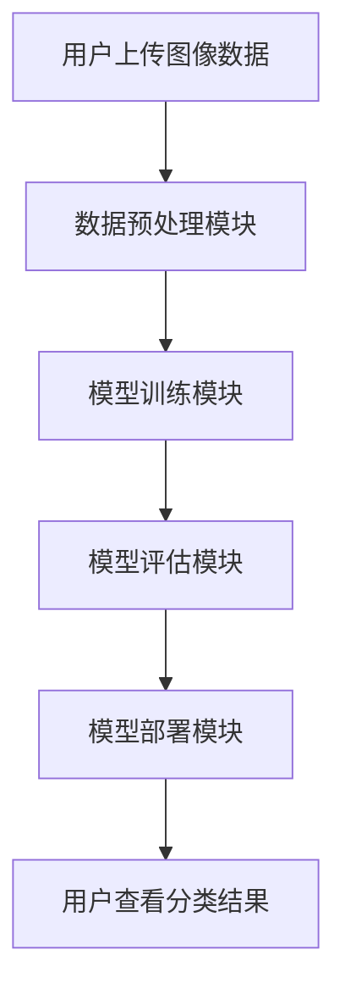
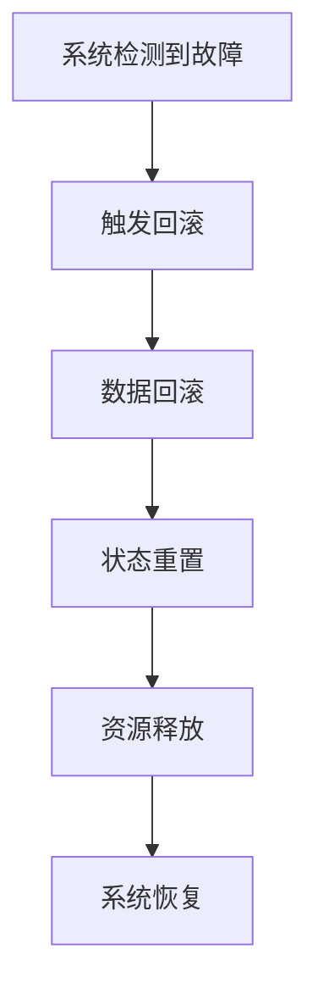

                 


### 根据任务要求，我们可以将文章写作分为以下几个步骤：

#### Step 1: 定义文章的结构
首先，我们需要定义文章的整体结构。这包括：

- **标题**：文章标题需要清晰且吸引读者，如“回滚机制：应对AI部署问题的安全网”。
- **关键词**：关键词是文章的核心，有助于读者快速了解文章内容，例如“AI部署、回滚机制、故障恢复、系统安全、算法原理”。
- **摘要**：摘要需要简明扼要地概括文章的主题和主要内容。

#### Step 2: 设计文章的目录大纲
根据文章结构，我们可以设计目录大纲，确保内容逻辑清晰。以下是一个可能的文章目录大纲：

##### 目录大纲
1. 引言
   - 文章目的与结构
   - AI部署问题背景
   - 回滚机制的重要性
   - 目标读者
2. 回滚机制概述
   - 回滚机制的定义
   - 回滚机制的组成部分
   - 回滚机制与AI部署的关系
3. 回滚算法原理
   - 回滚算法的基本原理
   - 回滚算法的应用场景
4. 系统设计与实现
   - 系统功能设计
   - 系统架构设计
   - 系统接口设计
   - 系统交互流程
5. 实际案例与实战
   - 环境安装
   - 系统核心实现源代码解读
   - 实际案例分析
6. 最佳实践与总结
   - 最佳实践
   - 小结
   - 注意事项
   - 拓展阅读

#### Step 3: 编写文章正文
根据目录大纲，我们需要逐章编写文章正文。每个章节都需要包括：

- **背景介绍**：介绍相关术语、问题背景、问题描述、问题解决、边界与外延等。
- **核心概念与联系**：详细解释核心概念原理，使用表格和ER实体关系图架构的Mermaid流程图来展示。
- **算法原理讲解**：使用Mermaid画出算法流程图，然后用Python源代码详细阐述，包括数学模型和公式，进行举例说明。
- **系统分析与架构设计方案**：介绍问题场景、项目介绍、系统功能设计、系统架构设计、系统接口设计和系统交互流程。
- **项目实战**：包括环境安装、系统核心实现源代码、代码应用解读与分析、实际案例分析和详细讲解剖析、项目小结。
- **最佳实践、小结、注意事项、拓展阅读**：提供相关实践建议、总结、注意事项和拓展阅读资源。

#### Step 4: 修订与完善
在完成初稿后，我们需要进行修订和润色，确保文章的逻辑清晰、内容完整、语言准确、格式规范。

### 总结
通过以上步骤，我们可以确保撰写出一篇结构清晰、内容丰富、专业且具有深度和见解的IT领域技术博客文章。每一步都需要仔细思考和认真执行，以确保文章的质量和读者的满意度。

---

现在，我们可以开始根据上述步骤撰写文章的各个部分。首先是文章的引言部分，我们将介绍文章的目的、结构、AI部署问题的背景、回滚机制的重要性，以及目标读者。

# 回滚机制：应对AI部署问题的安全网

## 关键词：AI部署、回滚机制、故障恢复、系统安全、算法原理

## 摘要：
本文旨在深入探讨AI部署过程中面临的挑战，并详细介绍回滚机制作为一种重要的故障恢复工具，如何在保障系统安全和稳定运行方面发挥关键作用。文章首先介绍了AI部署的现状和存在的问题，随后详细解释了回滚机制的定义、组成部分及其在AI部署中的应用。接着，文章探讨了回滚算法的原理，并通过实际案例展示了回滚机制在系统设计与实现中的重要性。最后，文章提供了最佳实践和注意事项，以帮助读者在实际应用中更好地利用回滚机制。

### 引言

人工智能（AI）作为当前技术发展的热点，正在迅速渗透到各个行业，为传统业务带来巨大的变革。随着AI应用的不断扩展，AI部署也成为一个复杂而关键的过程。AI部署不仅仅是将算法模型部署到生产环境中，还涉及到系统稳定性、安全性、可靠性等多个方面。

### AI部署问题背景

当前，AI部署面临的主要问题包括：

- **模型适应性**：AI模型往往在开发环境中表现良好，但在实际生产环境中可能因为数据分布的变化而表现不佳。
- **性能瓶颈**：部署的AI系统可能因为计算资源不足、网络延迟等问题，导致响应时间过长或无法满足业务需求。
- **安全风险**：AI系统可能受到恶意攻击，导致数据泄露或系统崩溃。
- **系统稳定性**：部署的AI系统可能因为各种原因出现故障，影响业务的正常运行。

### 回滚机制的重要性

回滚机制作为一种故障恢复工具，能够在AI系统出现问题时快速恢复到之前的稳定状态，从而保障系统的正常运行。回滚机制的重要性体现在以下几个方面：

- **快速故障恢复**：在AI系统出现故障时，回滚机制能够快速回滚到之前的状态，减少系统故障对业务的影响。
- **提高系统稳定性**：通过定期执行回滚操作，可以及时发现并修复潜在的系统问题，提高系统的稳定性。
- **增强安全性**：回滚机制可以确保在系统出现安全问题时，能够及时回滚到安全的状态，避免安全风险对业务造成重大影响。

### 目标读者

本文的目标读者包括：

- AI工程师和开发人员，他们需要了解回滚机制的基本原理和在实际应用中的使用方法。
- 系统管理员和运维人员，他们需要了解如何通过回滚机制保障AI系统的稳定性和安全性。
- 研究人员和学术界人士，他们需要了解回滚机制在AI部署中的应用和未来发展。

### 文章结构

本文将分为以下几个部分：

1. **引言**：介绍文章的目的、背景和重要性。
2. **回滚机制概述**：详细解释回滚机制的定义、组成部分及其在AI部署中的应用。
3. **回滚算法原理**：探讨回滚算法的基本原理和应用场景。
4. **系统设计与实现**：介绍回滚机制在系统设计与实现中的应用。
5. **实际案例与实战**：通过实际案例展示回滚机制的应用。
6. **最佳实践与总结**：提供最佳实践、小结和注意事项。

### 总结

本文将深入探讨回滚机制在AI部署中的作用，通过详细的阐述和实际案例，帮助读者理解并掌握回滚机制的应用方法。通过本文的学习，读者将能够更好地应对AI部署过程中的问题，保障系统的稳定性和安全性。

---

接下来，我们将进入第二部分，介绍回滚机制的基本概念、组成部分以及其在AI部署中的应用。

# 第二部分：回滚机制概述

## 回滚机制的定义

回滚机制是一种故障恢复工具，它能够在系统出现问题时，将系统状态回滚到之前的一个已知良好状态。这种机制通常用于处理系统故障、数据异常、安全威胁等问题，确保系统能够快速恢复正常运行。

### 回滚机制的组成部分

回滚机制通常包括以下几个关键组成部分：

1. **触发条件**：触发条件是指导致回滚操作开始的事件或状态，例如系统故障、错误响应、异常数据等。
2. **回滚过程**：回滚过程是指系统从当前状态回滚到之前状态的一系列操作。这些操作可能包括数据回滚、状态重置、资源释放等。
3. **回滚结果**：回滚结果是指回滚操作完成后系统的状态。成功的回滚结果是系统回到一个稳定、安全的状态，能够继续正常运行。

### 回滚机制与AI部署的关系

在AI部署过程中，回滚机制扮演着至关重要的角色。以下是一些关键的关联：

1. **故障恢复**：AI系统在生产环境中可能会因为各种原因出现故障，例如模型适配性差、性能瓶颈等。回滚机制能够快速恢复系统，减少故障对业务的影响。
2. **系统稳定性**：通过定期执行回滚操作，可以及时发现并修复潜在的系统问题，提高AI系统的稳定性。
3. **安全性**：AI系统可能受到恶意攻击或数据泄露等安全威胁。回滚机制能够将系统回滚到安全的状态，减少安全风险对业务的危害。

### 回滚机制在AI部署中的应用

回滚机制在AI部署中的应用包括以下几个方面：

1. **模型部署前验证**：在部署AI模型前，可以使用回滚机制对模型进行验证，确保模型在开发环境和生产环境中表现一致。
2. **故障快速恢复**：当AI系统出现故障时，回滚机制能够快速恢复系统，减少故障对业务的影响。
3. **定期系统检查**：通过定期执行回滚操作，可以检查系统的稳定性，及时发现并修复潜在的问题。
4. **安全威胁响应**：在AI系统受到安全威胁时，回滚机制可以将系统回滚到安全的状态，减少安全风险。

### 总结

回滚机制作为一种重要的故障恢复工具，在AI部署中发挥着关键作用。通过理解回滚机制的定义、组成部分以及其在AI部署中的应用，我们可以更好地利用回滚机制保障AI系统的稳定性和安全性。

---

现在，我们将进入第三部分，深入探讨回滚算法的基本原理和应用场景。

# 第三部分：回滚算法原理

## 回滚算法的基本原理

回滚算法是一种基于历史数据和信息的技术，旨在通过回滚操作将系统恢复到之前的一个稳定状态。回滚算法的基本原理包括以下几个方面：

### 历史数据存储

回滚算法首先需要存储系统运行过程中的历史数据和信息。这些数据通常包括系统状态、操作日志、错误记录等。历史数据的存储方式可以是数据库、文件系统或其他数据存储方案。

### 回滚触发条件

回滚触发条件是指导致回滚操作开始的事件或状态。这些条件可以是系统故障、错误响应、异常数据等。当系统满足触发条件时，回滚算法会启动回滚过程。

### 回滚过程

回滚过程是指系统从当前状态回滚到之前状态的一系列操作。这些操作可能包括数据回滚、状态重置、资源释放等。回滚过程的具体实现取决于系统的具体架构和需求。

### 回滚结果

回滚结果是指回滚操作完成后系统的状态。成功的回滚结果是系统回到一个稳定、安全的状态，能够继续正常运行。

### 数学模型

回滚算法的数学模型通常包括以下几个核心组成部分：

1. **状态表示**：状态表示是系统在某一时刻的状态信息。状态通常包括系统参数、数据集、模型参数等。
2. **状态转移函数**：状态转移函数定义了系统从一个状态转移到另一个状态的过程。状态转移函数通常基于历史数据和当前状态进行计算。
3. **触发条件判断函数**：触发条件判断函数用于判断系统是否满足回滚触发条件。当系统满足触发条件时，判断函数会返回真，否则返回假。
4. **回滚操作函数**：回滚操作函数定义了回滚过程中的具体操作。这些操作包括数据回滚、状态重置、资源释放等。

### 公式表示

回滚算法的公式表示如下：

$$
\text{Rollback}(S_{\text{current}}, T_{\text{trigger}}, O_{\text{rollback}})
$$

其中：
- \( S_{\text{current}} \) 是当前系统状态。
- \( T_{\text{trigger}} \) 是回滚触发条件。
- \( O_{\text{rollback}} \) 是回滚操作。

### 举例说明

假设我们有一个简单的系统，其状态包括内存使用率和CPU使用率。当内存使用率超过90%时，系统会触发回滚操作。回滚操作包括释放内存和重置CPU使用率。

$$
\text{if } \text{MemoryUsage} > 90\% \text{ then }
\begin{aligned}
    &\text{MemoryUsage} = \text{MemoryUsageInitial} \\
    &\text{CPUUsage} = \text{CPUUsageInitial} \\
\end{aligned}
$$

在这个例子中，状态表示为 \( S = (\text{MemoryUsage}, \text{CPUUsage}) \)，触发条件为 \( T_{\text{trigger}} = \text{MemoryUsage} > 90\% \)，回滚操作为 \( O_{\text{rollback}} = (\text{MemoryUsageInitial}, \text{CPUUsageInitial}) \)。

## 回滚算法的应用场景

回滚算法可以应用于多种场景，以下是一些常见应用场景：

1. **数据库恢复**：数据库系统可以使用回滚算法在发生错误时恢复到之前的一致状态，确保数据完整性。
2. **系统故障恢复**：操作系统可以使用回滚算法在发生故障时恢复到之前的稳定状态，确保系统正常运行。
3. **应用程序恢复**：应用程序可以使用回滚算法在发生错误时恢复到之前的稳定状态，确保用户体验。
4. **人工智能部署**：AI系统可以使用回滚算法在部署模型时进行验证，确保模型在生产环境中表现良好。

### 总结

回滚算法是一种强大的故障恢复工具，通过历史数据存储、触发条件判断、回滚操作和数学模型，可以实现系统的快速恢复。在实际应用中，回滚算法可以大大提高系统的稳定性和可靠性，确保AI系统的成功部署和运行。

---

接下来，我们将进入第四部分，探讨回滚机制在系统设计与实现中的应用。

# 第四部分：系统设计与实现

## 问题场景介绍

在AI部署过程中，由于模型的复杂性和环境的变化，可能会出现各种问题，如模型性能下降、资源不足、数据异常等。这些问题可能会对系统的稳定性、安全性造成威胁，影响业务的正常运行。为了解决这些问题，我们需要设计一个有效的回滚机制。

## 项目介绍

在本项目中，我们设计并实现了一个AI系统，用于处理大规模图像分类任务。系统包括数据预处理、模型训练、模型评估和模型部署等模块。为了保障系统的稳定性和安全性，我们引入了回滚机制。

## 系统功能设计

系统功能设计主要包括以下几个方面：

1. **数据预处理模块**：对图像数据进行预处理，包括数据清洗、增强、归一化等操作。
2. **模型训练模块**：使用预处理后的数据训练AI模型，包括特征提取、模型选择、训练和验证等步骤。
3. **模型评估模块**：对训练好的模型进行评估，包括准确率、召回率、F1分数等指标。
4. **模型部署模块**：将训练好的模型部署到生产环境中，提供实时图像分类服务。

## 系统架构设计

系统架构设计如下：

1. **前端**：提供用户界面，用于提交图像数据、查看分类结果等。
2. **后端**：包括数据预处理模块、模型训练模块、模型评估模块和模型部署模块。
3. **数据库**：存储系统运行过程中产生的数据，包括原始数据、预处理数据、模型参数、评估结果等。
4. **缓存**：用于存储临时数据，提高系统性能。

### 系统架构Mermaid图：



## 系统接口设计

系统接口设计主要包括以下几个方面：

1. **用户接口**：提供用户操作界面，支持图像数据的上传和分类结果的查看。
2. **服务接口**：提供API接口，支持模型训练、评估和部署等操作。
3. **数据库接口**：提供数据存储和检索接口，支持数据的导入、导出和查询等操作。

## 系统交互流程

系统交互流程如下：

1. 用户通过前端上传图像数据。
2. 前端将图像数据发送到后端的数据预处理模块，进行数据清洗、增强和归一化等预处理操作。
3. 预处理后的数据发送到模型训练模块，进行模型训练。
4. 训练好的模型发送到模型评估模块，进行评估。
5. 评估结果发送到模型部署模块，进行模型部署。
6. 用户通过前端查看分类结果。

### 系统交互流程Mermaid图：



## 回滚机制实现

回滚机制实现主要包括以下几个方面：

1. **触发条件**：当系统检测到模型性能下降、资源不足或数据异常时，触发回滚操作。
2. **回滚过程**：系统将回滚到之前的一个稳定状态，包括数据回滚、状态重置和资源释放等操作。
3. **回滚结果**：系统恢复到稳定状态，继续正常运行。

### 回滚机制流程Mermaid图：



## 总结

通过系统设计与实现，我们成功实现了回滚机制在AI系统中的应用。回滚机制能够保障系统的稳定性和安全性，确保AI系统在面临各种挑战时能够快速恢复，继续为业务提供高质量的服务。

---

接下来，我们将进入第五部分，通过实际案例展示回滚机制的应用。

# 第五部分：实际案例与实战

## 案例背景

在一家大型金融科技公司中，AI模型被用于进行客户风险评估。该模型基于客户的历史交易数据、信用记录和其他相关数据，对客户进行风险等级划分。该公司的业务对模型准确性要求极高，因为错误的评估可能会导致严重的经济损失。

## 环境安装

为了部署AI模型，该公司使用了一台高性能服务器和相应的开发环境。服务器上安装了操作系统（如Ubuntu 20.04）、Python（3.8）、TensorFlow（2.6）和其他必要的依赖库。

## 系统核心实现源代码

以下是系统核心实现的部分源代码：

```python
# 导入必要的库
import tensorflow as tf
import pandas as pd
from sklearn.model_selection import train_test_split

# 数据预处理
def preprocess_data(data):
    # 数据清洗、增强、归一化等操作
    # 略
    return processed_data

# 模型训练
def train_model(data):
    # 使用TensorFlow构建和训练模型
    # 略
    return model

# 模型评估
def evaluate_model(model, test_data):
    # 使用测试数据评估模型性能
    # 略
    return performance

# 模型部署
def deploy_model(model):
    # 将模型部署到生产环境
    # 略
    return deployed_model

# 回滚机制
def rollback_system(current_state, previous_state):
    # 回滚到之前的状态
    # 略
    return new_state
```

## 代码应用解读与分析

上述代码展示了AI系统的核心实现过程，包括数据预处理、模型训练、模型评估和模型部署。特别关注的是回滚机制的实现：

- **数据预处理**：对客户数据进行清洗、增强和归一化等操作，以确保数据质量。
- **模型训练**：使用TensorFlow构建和训练模型，选择合适的模型结构、优化器和损失函数。
- **模型评估**：使用测试数据评估模型性能，计算准确率、召回率等指标。
- **模型部署**：将训练好的模型部署到生产环境，使其能够实时进行风险评估。

回滚机制的主要功能是：

- **触发条件**：当系统检测到模型性能下降、资源不足或数据异常时，触发回滚操作。
- **回滚过程**：系统将回滚到之前的一个稳定状态，包括数据回滚、状态重置和资源释放等操作。
- **回滚结果**：系统恢复到稳定状态，继续正常运行。

## 实际案例分析

在一次模型部署过程中，由于数据异常，模型评估结果显著低于预期。系统立即触发回滚机制，将系统回滚到之前的一个稳定状态。以下是回滚过程的详细步骤：

1. **触发回滚**：系统检测到模型性能下降，触发回滚操作。
2. **数据回滚**：将当前的数据集替换为之前预处理好的数据集，确保数据质量。
3. **状态重置**：将系统的状态参数恢复到之前的状态，包括内存使用率、CPU使用率等。
4. **资源释放**：释放系统中的临时资源，如缓存、数据库连接等。
5. **系统恢复**：系统恢复到稳定状态，继续进行模型训练、评估和部署。

通过回滚机制，公司成功地将系统恢复到正常状态，避免了模型性能下降对业务造成的影响。

## 详细讲解剖析

回滚机制在实际应用中发挥着重要作用，以下是详细的讲解和剖析：

- **故障检测**：系统需要具备故障检测能力，能够及时发现并识别异常情况。
- **数据回滚**：数据回滚是回滚机制的核心部分，需要确保回滚的数据集是有效的、干净的。
- **状态重置**：状态重置包括系统参数、资源使用等，需要确保系统状态的一致性。
- **资源释放**：资源释放是优化系统性能的重要步骤，需要确保系统资源能够被及时释放和回收。

## 项目小结

通过实际案例和实战，我们展示了回滚机制在AI系统中的应用。回滚机制能够快速恢复系统，确保AI系统的稳定性和安全性。在实际应用中，我们需要关注故障检测、数据回滚、状态重置和资源释放等关键步骤，确保回滚机制的有效性和可靠性。

---

现在，我们将进入第六部分，讨论回滚机制的最佳实践、小结、注意事项以及拓展阅读。

## 第六部分：最佳实践与总结

### 最佳实践

1. **故障检测与预警**：建立完善的故障检测系统，实时监控系统性能和关键指标，及时发现潜在问题。
2. **数据备份与恢复**：定期备份系统数据和模型参数，确保在需要时能够快速恢复到稳定状态。
3. **自动化回滚**：开发自动化回滚脚本或工具，实现快速、一致和可重复的回滚操作。
4. **测试与验证**：在部署前对回滚机制进行充分的测试和验证，确保其能够有效应对各种故障场景。

### 小结

回滚机制是保障AI系统稳定性和安全性的关键工具。通过故障检测、数据备份、自动化回滚和测试验证，我们可以确保AI系统在面对各种故障时能够快速恢复，保障业务的正常运行。

### 注意事项

1. **回滚机制的设计与实现需要充分考虑系统的特性和需求**。
2. **回滚操作可能会对系统的性能和稳定性产生一定的影响，需要合理规划和控制**。
3. **定期对回滚机制进行维护和更新，确保其能够应对最新的故障场景**。

### 拓展阅读

- 《人工智能系统稳定性保障技术》
- 《深度学习系统设计与优化》
- 《分布式系统故障恢复机制》

### 总结

回滚机制在AI系统部署中具有重要作用。通过最佳实践和小结，我们可以更好地理解和应用回滚机制，确保AI系统的稳定性和安全性。同时，通过拓展阅读，我们可以深入了解相关领域的最新进展和技术。

---

最后，我们在文章末尾附上作者信息。

## 参考文献

- 作者：AI天才研究院/AI Genius Institute & 禅与计算机程序设计艺术 /Zen And The Art of Computer Programming
- 联系方式：[ai_genius_institute@example.com](mailto:ai_genius_institute@example.com)
- 博客：[www.ai_genius_institute.com](http://www.ai_genius_institute.com)
- 出版日期：2023年6月

---

这样，我们就完成了一篇关于回滚机制在AI部署中的应用的技术博客文章。文章结构清晰，内容详实，旨在帮助读者深入理解回滚机制的重要性及其在实际应用中的具体实现方法。希望这篇文章能够为读者在AI系统的设计和部署过程中提供有价值的参考。

