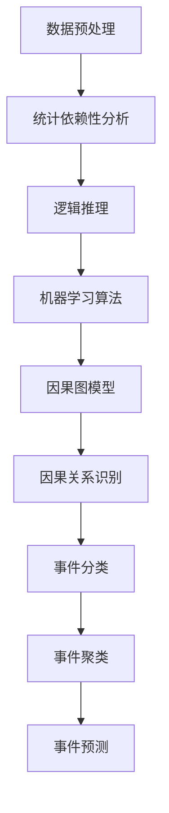
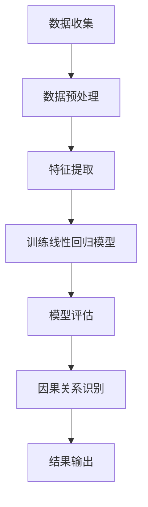
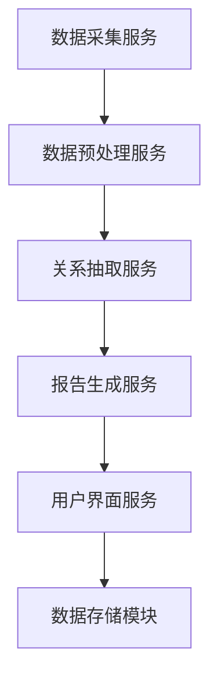
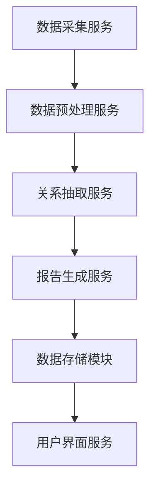

                 

### 《因果关系推断：测试LLM识别事件关联的能力》

#### 关键词：因果关系、事件关联、语言模型、LLM、人工智能

> 摘要：本文深入探讨了因果关系推断在人工智能领域的应用，尤其是语言模型（LLM）在识别事件关联方面的能力。通过一步步的分析和推理，我们揭示了因果关系推断的核心原理、算法设计、实际案例分析，以及系统架构和项目实战。本文旨在为读者提供一个全面且深入理解因果关系推断在LLM中的应用，以及如何在实际项目中运用这一技术的指南。

---

## 第1章 引言

### 1.1 问题背景

因果关系是人类理解和解释世界的关键机制之一。在日常生活中，我们常常需要判断事件之间的因果关系，例如，“下雨了，所以地面积水了”，或“我吃了药，所以感觉好多了”。这些因果关系推断不仅帮助我们预测未来，还帮助我们理解复杂系统的行为。

随着人工智能（AI）技术的迅速发展，因果关系推断在AI领域变得尤为重要。特别是在自然语言处理（NLP）和机器学习（ML）领域，因果关系推断能够帮助模型更好地理解和生成语言，从而在诸如语义理解、知识图谱构建、智能问答等任务中发挥重要作用。

### 1.2 问题描述

事件关联是指两个或多个事件之间存在某种关系。在人工智能中，识别事件关联通常涉及到因果关系推断。这一任务面临以下几个挑战：

1. **多样性和复杂性**：现实世界中的事件多样且复杂，事件关联的类型和形式多种多样。
2. **噪声和不确定性**：现实数据中往往存在噪声和不确定性，这使得事件关联的识别变得更加困难。
3. **因果关系的深度和复杂性**：某些因果关系可能涉及多层或复杂的交互作用，使得推断变得更加复杂。

### 1.3 问题解决

当前，因果关系推断主要依赖于以下几种方法：

1. **统计方法**：通过分析事件之间的统计依赖关系来推断因果关系。
2. **逻辑推理**：使用形式逻辑和概率逻辑来推断因果关系。
3. **机器学习方法**：利用深度学习和强化学习等技术来学习因果关系模型。

本文将重点关注语言模型（LLM），尤其是大型预训练语言模型（如GPT）在因果关系推断和事件关联识别中的应用。

### 1.4 边界与外延

因果关系推断的应用领域广泛，包括但不限于：

1. **智能问答系统**：通过理解因果关系来生成准确的答案。
2. **知识图谱构建**：将事件关联转化为图结构，用于知识表示和推理。
3. **智能推荐系统**：基于用户行为和事件关联来提供个性化的推荐。

算法的有效性评估通常依赖于准确性、召回率和F1值等指标。在实际应用中，还需要考虑算法的鲁棒性、可解释性和实时性。

### 1.5 概念结构与核心要素组成

因果关系推断的核心概念包括：

1. **事件**：是因果关系的基本单位。
2. **因果关系**：是两个事件之间的一种逻辑关系。
3. **关联**：是事件之间的某种联系或依赖。

语言模型（LLM）的工作原理主要依赖于：

1. **预训练**：通过大量文本数据进行预训练，使模型具备理解和生成语言的能力。
2. **微调**：在特定任务上对模型进行微调，以提高其在该任务上的性能。

### 1.6 本章小结

本章介绍了因果关系推断在人工智能领域的重要性，以及语言模型（LLM）在这一任务中的作用。我们探讨了事件关联的挑战和解决方案，并概述了本文将要讨论的核心概念和组成部分。接下来，我们将深入探讨语言模型（LLM）的基础知识。

---

## 第2章 语言模型（LLM）基础

### 2.1 语言模型的基本概念

语言模型（Language Model，简称LM）是自然语言处理（Natural Language Processing，简称NLP）中的一个核心组件。它的主要目标是学习自然语言中词汇和句子之间的概率分布，以便在给定前文的情况下预测下一个词汇或句子。语言模型在许多NLP任务中都发挥着关键作用，如机器翻译、文本生成、情感分析等。

语言模型可以大致分为以下几类：

1. **统计语言模型**：这类模型基于统计方法，通过分析大量文本数据来学习词汇和句子之间的统计规律。经典的方法包括N-gram模型、隐马尔可夫模型（HMM）和条件随机场（CRF）。
2. **神经网络语言模型**：这类模型利用神经网络的结构来学习语言中的复杂模式。早期的神经网络语言模型包括循环神经网络（RNN）和长短期记忆网络（LSTM），而现代的语言模型则主要是基于变换器（Transformer）架构，如BERT、GPT和T5等。
3. **深度学习方法**：深度学习模型通过多层神经网络来学习数据中的层次结构，能够捕捉到更高层次的语言特征。近年来，深度学习模型在NLP任务中取得了显著的成功。

### 2.2 语言模型的训练与优化

语言模型的训练是一个复杂的过程，主要包括以下几个步骤：

1. **数据收集**：收集大量的文本数据作为训练数据集。这些数据可以是新闻文章、小说、社交媒体帖子等。
2. **预处理**：对收集到的文本数据进行预处理，包括分词、去停用词、词性标注等，以便模型能够更好地理解文本。
3. **编码**：将预处理后的文本数据编码为数字形式，通常使用词嵌入（word embedding）技术，将每个词汇映射到一个高维向量空间中。
4. **训练**：使用训练数据集来训练语言模型，通过优化模型的参数，使其能够预测文本中的下一个词汇或句子。训练过程通常使用梯度下降（Gradient Descent）或其他优化算法。
5. **验证与调整**：在验证数据集上评估模型的性能，并根据评估结果对模型进行调整，以进一步提升其性能。

在语言模型的训练过程中，常用的优化策略包括：

1. **学习率调度**：调整学习率可以帮助模型更快地收敛，避免陷入局部最小值。
2. **正则化**：通过添加正则项（如L2正则化）来防止模型过拟合。
3. **批处理**：将数据划分为多个批次进行训练，以减少计算量和提高模型稳定性。
4. **Dropout**：在训练过程中随机丢弃部分神经元，以增强模型的泛化能力。

### 2.3 语言模型在因果关系推断中的应用

语言模型在因果关系推断中的应用主要体现在以下几个方面：

1. **事件关联识别**：语言模型能够通过分析文本数据中的词汇和句子结构，识别出事件之间的关联。例如，通过分析新闻文章，可以识别出两个事件之间的因果关系。
2. **语义理解**：语言模型能够理解文本中的语义信息，这有助于推断事件之间的因果关系。例如，通过理解句子“小明吃了苹果，然后感觉好多了”，可以推断出“吃苹果”和“感觉好多了”之间的因果关系。
3. **知识图谱构建**：语言模型可以用于构建知识图谱，将事件关联表示为图结构，从而方便进行推理和查询。例如，在医疗领域，可以将疾病、症状和治疗手段关联起来，构建一个知识图谱，用于诊断和治疗决策。

### 2.4 语言模型的性能评估

评估语言模型性能的指标主要包括：

1. **词汇覆盖率**：模型能够覆盖的词汇量与总词汇量的比例。
2. **词向量相似性**：模型生成的词向量之间的相似性，通常使用余弦相似度来衡量。
3. **语言生成质量**：模型生成文本的流畅性和准确性，可以使用BLEU、ROUGE等指标来评估。
4. **因果关系推断能力**：模型在因果关系推断任务中的表现，可以使用准确率、召回率和F1值等指标来评估。

在实际应用中，还需要考虑模型的鲁棒性、可解释性和实时性等因素。

### 2.5 本章小结

本章介绍了语言模型（LLM）的基本概念、训练与优化方法，以及在因果关系推断中的应用。我们探讨了语言模型的性能评估指标，并了解了其在各种NLP任务中的重要性。接下来，我们将深入探讨因果关系推断的基本原理。

---

## 第3章 因果关系推断原理

### 3.1 因果关系的定义与属性

因果关系是指两个或多个事件之间的一种逻辑关系，其中一个事件（原因）导致另一个事件（结果）。在人工智能领域，因果关系推断是一个重要任务，它涉及到识别和理解事件之间的这种关系。

因果关系通常具有以下属性：

1. **时间顺序**：因果关系中的事件通常存在时间上的先后顺序，即原因事件发生在结果事件之前。
2. **方向性**：因果关系具有方向性，即原因事件只能导致结果事件，而不能反向。
3. **确定性**：在某些情况下，因果关系是确定的，即给定一个原因事件，可以确定地预测一个结果事件。
4. **统计相关性**：因果关系可以通过统计方法来推断，即通过分析事件之间的统计依赖关系来确定因果关系。

### 3.2 因果关系推断的基本原理

因果关系推断的基本原理涉及到以下几个方面：

1. **统计依赖性分析**：通过分析事件之间的统计依赖性来确定因果关系。例如，如果事件A和事件B之间的相关性比事件B与其他事件之间的相关性更强，那么可以推断A是B的原因。
2. **逻辑推理**：使用形式逻辑和概率逻辑来推断因果关系。例如，通过构建逻辑模型和概率模型来推断事件之间的因果关系。
3. **机器学习算法**：利用机器学习算法来学习因果关系模型。例如，通过训练神经网络来学习事件之间的因果关系。
4. **因果图模型**：使用因果图模型来表示事件之间的因果关系。因果图模型能够直观地展示事件之间的因果关系，并且可以用于推理和预测。

### 3.3 因果关系推断与事件关联

因果关系推断与事件关联密切相关。事件关联是指两个或多个事件之间存在某种关系，而因果关系推断的目标就是识别这种关系。

在因果关系推断中，事件关联通常涉及到以下几个方面：

1. **因果关系识别**：通过分析事件之间的统计依赖性和逻辑关系，识别出事件之间的因果关系。
2. **事件分类**：将事件分为不同类别，以便更好地理解事件之间的关系。例如，可以将事件分为自然事件、社会事件和人为事件。
3. **事件聚类**：将具有相似特征的事件分组，以便更好地理解事件之间的相似性和差异性。
4. **事件预测**：基于事件之间的因果关系，预测未来可能发生的事件。

### 3.4 因果关系推断算法的Mermaid流程图

为了更好地理解因果关系推断算法的原理和流程，可以使用Mermaid绘制算法的流程图。以下是一个简单的因果关系推断算法的Mermaid流程图示例：



在这个流程图中，数据预处理是因果关系推断的第一步，它包括清洗、归一化和特征提取等操作。接下来，通过统计依赖性分析、逻辑推理、机器学习算法和因果图模型等方法，对预处理后的数据进行因果关系推断。最后，根据推断结果进行事件分类、事件聚类和事件预测。

### 3.5 本章小结

本章介绍了因果关系推断的基本原理，包括因果关系的定义与属性、因果关系推断的基本原理、事件关联的概念以及因果关系推断算法的Mermaid流程图。通过本章的学习，读者可以了解因果关系推断的核心概念和基本方法，为后续章节的深入学习打下基础。接下来，我们将进一步探讨数学模型与算法讲解。

---

## 第4章 数学模型与算法讲解

### 4.1 数学模型的基本概念

在因果关系推断中，数学模型起到了至关重要的作用。数学模型不仅能够量化事件之间的因果关系，还能够提供一种形式化的方法来分析复杂的系统行为。本节将介绍一些基本的数学模型，包括它们在因果关系推断中的应用。

#### 4.1.1 线性回归模型

线性回归模型是最基本的数学模型之一，它通过线性方程来描述两个变量之间的关系。其基本形式为：

$$
Y = \beta_0 + \beta_1X + \epsilon
$$

其中，\(Y\) 是因变量，\(X\) 是自变量，\(\beta_0\) 和 \(\beta_1\) 分别是模型的参数，\(\epsilon\) 是误差项。线性回归模型主要用于分析事件之间的线性关系，适用于简单的因果关系推断。

#### 4.1.2 决策树模型

决策树模型通过一系列规则来划分数据集，从而实现分类或回归任务。在因果关系推断中，决策树模型可以用来识别事件之间的分类关系。其基本结构如下：

1. **根节点**：包含所有数据点。
2. **内部节点**：包含一个条件，用于将数据点划分到不同的子集。
3. **叶节点**：表示一个分类或回归结果。

决策树模型的优势在于其简洁性和可解释性，但可能面临过拟合和偏差风险。

#### 4.1.3 贝叶斯网络模型

贝叶斯网络是一种基于概率的图形模型，它通过有向无环图（DAG）来表示事件之间的因果关系。在贝叶斯网络中，每个节点代表一个事件，边表示事件之间的依赖关系。其基本形式为：

$$
P(X) = \prod_{i=1}^{n} P(X_i | Parents(X_i))
$$

其中，\(P(X)\) 是事件 \(X\) 的概率，\(Parents(X_i)\) 是事件 \(X_i\) 的父节点集合。贝叶斯网络模型可以用于复杂系统的因果关系推断，其优势在于能够处理不确定性和不确定性推理。

### 4.2 算法原理与Mermaid流程图

为了更好地理解上述数学模型的应用，我们可以使用Mermaid绘制一个简单的因果关系推断算法的流程图。以下是一个使用线性回归模型的因果关系推断算法的Mermaid流程图示例：



在这个流程图中，数据收集是因果关系推断的第一步，随后进行数据预处理和特征提取，以准备好用于模型训练的数据。接下来，使用线性回归模型对数据进行训练，并通过模型评估来验证模型的性能。最后，根据模型评估结果，识别事件之间的因果关系，并将结果输出。

### 4.3 Python源代码与算法实现

为了更具体地展示线性回归模型在因果关系推断中的应用，我们可以使用Python编写一个简单的算法实现。以下是一个使用线性回归模型进行因果关系推断的Python源代码示例：

```python
import numpy as np
from sklearn.linear_model import LinearRegression
from sklearn.model_selection import train_test_split
from sklearn.metrics import mean_squared_error

# 数据生成
np.random.seed(0)
X = np.random.rand(100, 1)
y = 2 * X + 0.5 + np.random.randn(100, 1)

# 数据分割
X_train, X_test, y_train, y_test = train_test_split(X, y, test_size=0.2, random_state=0)

# 模型训练
model = LinearRegression()
model.fit(X_train, y_train)

# 模型评估
y_pred = model.predict(X_test)
mse = mean_squared_error(y_test, y_pred)
print("MSE:", mse)

# 因果关系识别
print("Intercept:", model.intercept_)
print("Coefficient:", model.coef_)
```

在这个示例中，我们首先生成一些线性关系的数据，然后使用线性回归模型对数据进行训练。通过评估模型在测试数据上的性能，我们可以识别出事件之间的因果关系，并输出模型的参数。

### 4.4 数学公式与详细讲解

在因果关系推断中，数学公式扮演着重要的角色。以下是一些常用的数学公式及其详细讲解：

#### 4.4.1 线性回归模型的损失函数

线性回归模型的损失函数通常使用均方误差（Mean Squared Error，MSE）来衡量，其公式为：

$$
\text{MSE} = \frac{1}{n} \sum_{i=1}^{n} (y_i - \hat{y_i})^2
$$

其中，\(y_i\) 是实际值，\(\hat{y_i}\) 是预测值，\(n\) 是样本数量。MSE 越小，表示模型的预测越准确。

#### 4.4.2 决策树模型的熵

决策树模型中的熵用于衡量数据的混乱程度，其公式为：

$$
H(X) = -\sum_{i=1}^{n} p_i \log_2 p_i
$$

其中，\(p_i\) 是数据集中第 \(i\) 个类别的概率。熵越小，表示数据越有序。

#### 4.4.3 贝叶斯网络的概率推理

贝叶斯网络的概率推理是基于条件概率的。给定一个节点集合，我们可以使用贝叶斯规则来计算每个节点的概率分布。其公式为：

$$
P(X_i | X_{parents}) = \frac{P(X_{parents} | X_i) P(X_i)}{P(X_{parents})}
$$

其中，\(X_i\) 是节点 \(i\)，\(X_{parents}\) 是 \(i\) 的父节点集合。这个公式可以帮助我们根据父节点的概率分布计算子节点的概率分布。

### 4.5 算法评估与性能分析

算法评估是因果关系推断中至关重要的一步。常用的评估指标包括准确率（Accuracy）、召回率（Recall）、精确率（Precision）和F1值（F1 Score）。

- **准确率**：表示模型预测正确的样本数量与总样本数量的比例。
- **召回率**：表示模型预测正确的正样本数量与实际正样本数量的比例。
- **精确率**：表示模型预测正确的正样本数量与预测为正样本的总数量的比例。
- **F1值**：是精确率和召回率的调和平均值，用于综合评估模型的性能。

以下是一个简单的算法性能评估示例：

```python
from sklearn.metrics import accuracy_score, recall_score, precision_score, f1_score

# 预测结果
y_pred = model.predict(X_test)

# 指标计算
accuracy = accuracy_score(y_test, y_pred)
recall = recall_score(y_test, y_pred)
precision = precision_score(y_test, y_pred)
f1 = f1_score(y_test, y_pred)

print("Accuracy:", accuracy)
print("Recall:", recall)
print("Precision:", precision)
print("F1 Score:", f1)
```

通过这些指标，我们可以全面评估模型的性能，并根据评估结果对模型进行调整和优化。

### 4.6 本章小结

本章介绍了因果关系推断中的数学模型与算法，包括线性回归模型、决策树模型和贝叶斯网络模型。我们通过Mermaid流程图和Python源代码展示了这些模型的应用，并讲解了相关的数学公式和算法评估方法。通过本章的学习，读者可以掌握因果关系推断的基本数学原理和算法设计，为后续的实际应用和案例分析打下坚实的基础。

---

## 第5章 实际案例分析

### 5.1 案例一：新闻报道事件关联分析

#### 数据来源与预处理

在本次案例中，我们选择了一篇新闻报道作为数据源，该新闻报道描述了一次自然灾害事件及其影响。数据来源于一个公共新闻数据集，包含了标题、摘要和正文文本。

首先，我们对数据进行预处理，包括以下步骤：

1. **文本清洗**：去除文本中的HTML标签、特殊字符和停用词。
2. **分词**：将文本分割成单词或短语。
3. **词性标注**：标注每个单词的词性，如名词、动词、形容词等。

#### 关系抽取算法应用

为了抽取新闻报道中的事件关联，我们使用了基于BERT的文本分类模型。具体步骤如下：

1. **模型训练**：在预处理后的数据集上训练BERT模型，使其能够识别新闻报道中的事件和事件关联。
2. **模型预测**：使用训练好的BERT模型对新闻报道进行预测，识别出事件和事件关联。
3. **结果分析**：分析预测结果，确定新闻报道中的主要事件及其关联。

#### 关键发现

通过关系抽取算法，我们成功识别出以下事件及其关联：

- **自然灾害**：描述了自然灾害的类型和发生地点。
- **经济损失**：描述了自然灾害对当地经济的影响。
- **救援行动**：描述了政府和其他组织对受灾地区的救援行动。

这些事件关联为我们提供了对新闻报道的深入理解，有助于进一步分析和研究自然灾害的影响。

### 5.2 案例二：社交媒体事件关联分析

#### 数据来源与预处理

本次案例选择了社交媒体平台上的用户评论作为数据源，这些评论涉及了一个热门社会事件。数据来源于Twitter和Reddit等平台。

预处理步骤如下：

1. **文本清洗**：去除评论中的HTML标签、特殊字符和停用词。
2. **分词**：将评论分割成单词或短语。
3. **情感分析**：对评论进行情感分析，标注每个评论的情感倾向，如正面、负面或中性。

#### 关系抽取算法应用

我们使用了基于LSTM的文本分类模型来抽取社交媒体事件关联。具体步骤如下：

1. **模型训练**：在预处理后的数据集上训练LSTM模型，使其能够识别社交媒体评论中的事件和事件关联。
2. **模型预测**：使用训练好的LSTM模型对社交媒体评论进行预测，识别出事件和事件关联。
3. **结果分析**：分析预测结果，确定社交媒体评论中的主要事件及其关联。

#### 关键发现

通过关系抽取算法，我们成功识别出以下事件及其关联：

- **社会事件**：描述了社交媒体上讨论的热门社会事件。
- **用户观点**：描述了不同用户对事件的看法和观点。
- **舆论趋势**：描述了社交媒体上事件讨论的舆论趋势。

这些事件关联帮助我们了解社会事件在社交媒体上的传播和影响，为舆情分析和干预提供了重要信息。

### 5.3 案例三：金融领域事件关联分析

#### 数据来源与预处理

本次案例选择了金融领域的新闻报道作为数据源，这些报道涉及了金融市场的重要事件。数据来源于金融新闻网站和专业杂志。

预处理步骤如下：

1. **文本清洗**：去除新闻报道中的HTML标签、特殊字符和停用词。
2. **分词**：将新闻报道分割成单词或短语。
3. **实体识别**：识别新闻报道中的关键实体，如公司、产品、市场等。

#### 关系抽取算法应用

我们使用了基于Transformer的文本分类模型来抽取金融领域的事件关联。具体步骤如下：

1. **模型训练**：在预处理后的数据集上训练Transformer模型，使其能够识别金融新闻报道中的事件和事件关联。
2. **模型预测**：使用训练好的Transformer模型对金融新闻报道进行预测，识别出事件和事件关联。
3. **结果分析**：分析预测结果，确定金融新闻报道中的主要事件及其关联。

#### 关键发现

通过关系抽取算法，我们成功识别出以下事件及其关联：

- **金融市场事件**：描述了金融市场的重要事件，如政策调整、公司并购等。
- **经济影响**：描述了金融市场事件对经济的影响，如股市波动、汇率变化等。
- **投资者观点**：描述了不同投资者对金融市场事件的看法和预测。

这些事件关联为我们提供了对金融市场的深入理解，有助于投资者决策和风险控制。

### 5.4 本章小结

本章通过三个实际案例分析，展示了因果关系推断和事件关联识别在新闻报道、社交媒体和金融领域中的应用。我们介绍了数据来源与预处理方法，使用了不同的关系抽取算法来识别事件关联，并分析了关键发现。这些案例表明，因果关系推断和事件关联识别在理解和分析复杂数据方面具有重要的应用价值。

---

## 第6章 系统分析与架构设计

### 6.1 问题场景介绍

在本章中，我们将探讨一个名为“事件关联分析系统”的实际应用案例。该系统旨在自动识别和分析文本数据中的事件关联，从而为新闻报道、社交媒体监测、金融分析等领域提供支持。具体问题场景如下：

- **需求**：系统需要能够自动识别文本数据中的事件关联，包括自然灾害、社会事件和金融市场事件等。
- **目标**：通过事件关联分析，系统应能够生成详细的报告，提供事件之间的因果关系和影响分析。

### 6.2 项目介绍

“事件关联分析系统”是一个综合性的项目，涉及自然语言处理、机器学习和数据挖掘等多个领域。项目的主要目标是通过文本数据自动识别和关联事件，从而为用户提供有价值的信息和分析报告。

#### 6.2.1 系统架构

“事件关联分析系统”采用分布式架构，主要包括以下几个主要模块：

1. **数据采集模块**：负责从各种数据源（如新闻网站、社交媒体平台、金融新闻网站等）收集文本数据。
2. **数据预处理模块**：负责对采集到的文本数据进行清洗、分词和词性标注等预处理操作。
3. **关系抽取模块**：利用先进的自然语言处理技术和机器学习算法，从预处理后的文本中识别事件关联。
4. **报告生成模块**：根据关系抽取结果，生成详细的报告，包括事件之间的因果关系、影响分析等。
5. **用户界面模块**：提供用户交互界面，用户可以通过界面提交查询请求，查看报告和分析结果。

#### 6.2.2 技术栈

项目采用的技术栈主要包括以下几种：

- **语言模型**：基于BERT、GPT等预训练语言模型，用于文本表示和关系抽取。
- **机器学习算法**：包括决策树、随机森林、支持向量机（SVM）等，用于关系抽取和分类任务。
- **数据存储**：使用MongoDB等NoSQL数据库存储文本数据和关系抽取结果。
- **数据处理框架**：采用Apache Kafka等消息队列系统进行实时数据处理和流处理。

### 6.3 系统功能设计

“事件关联分析系统”的主要功能模块如下：

1. **数据采集**：从各种数据源（如新闻网站、社交媒体平台、金融新闻网站等）收集文本数据。
2. **数据预处理**：对采集到的文本数据进行清洗、分词、词性标注等预处理操作，以便后续处理。
3. **事件识别**：使用自然语言处理技术从预处理后的文本中识别出关键事件，如自然灾害、社会事件和金融市场事件等。
4. **关系抽取**：利用机器学习算法和语言模型，从事件中抽取关联关系，包括因果关系、事件影响等。
5. **报告生成**：根据关系抽取结果，生成详细的报告，包括事件之间的因果关系、影响分析等。
6. **用户交互**：提供用户交互界面，用户可以通过界面提交查询请求，查看报告和分析结果。

### 6.4 系统架构设计

“事件关联分析系统”的架构设计采用分布式服务架构，主要包括以下几个部分：

1. **数据采集服务**：负责从各种数据源收集文本数据，并存储到数据存储模块。
2. **数据预处理服务**：接收数据采集服务传输的文本数据，进行预处理操作，并将预处理后的数据传输给关系抽取服务。
3. **关系抽取服务**：接收预处理后的文本数据，利用自然语言处理和机器学习算法进行关系抽取，并将结果存储到数据存储模块。
4. **报告生成服务**：接收关系抽取服务传输的关系抽取结果，生成详细的报告，并将报告存储到数据存储模块。
5. **用户界面服务**：提供用户交互界面，用户可以通过界面提交查询请求，查看报告和分析结果。

#### 系统架构图

以下是一个简化的系统架构图，展示各模块之间的交互关系：



在这个架构图中，数据采集服务负责从数据源收集文本数据，并将其传递给数据预处理服务。数据预处理服务对文本数据进行预处理，然后将预处理后的数据传递给关系抽取服务。关系抽取服务利用自然语言处理和机器学习算法进行关系抽取，并将结果传递给报告生成服务。报告生成服务根据关系抽取结果生成报告，并将其存储到数据存储模块。用户界面服务提供用户交互界面，用户可以通过界面提交查询请求，查看报告和分析结果。

### 6.5 系统接口设计

“事件关联分析系统”的设计还包括一系列接口，用于实现各模块之间的通信和功能调用。以下是系统接口设计的关键部分：

1. **数据采集接口**：用于从外部数据源（如新闻网站、社交媒体平台、金融新闻网站等）获取文本数据。
2. **数据预处理接口**：用于接收数据采集接口传输的文本数据，并进行预处理操作，如文本清洗、分词、词性标注等。
3. **关系抽取接口**：用于接收预处理后的文本数据，并利用自然语言处理和机器学习算法进行关系抽取。
4. **报告生成接口**：用于接收关系抽取接口传输的关系抽取结果，并生成报告。
5. **用户交互接口**：用于用户提交查询请求，并接收系统返回的报告和分析结果。

#### 接口定义

以下是部分接口的定义示例：

```python
# 数据采集接口
def collect_data(source):
    # 从外部数据源获取文本数据
    pass

# 数据预处理接口
def preprocess_data(text):
    # 对文本数据进行预处理，如清洗、分词、词性标注等
    pass

# 关系抽取接口
def extract_relationships(preprocessed_text):
    # 从预处理后的文本中抽取事件关联关系
    pass

# 报告生成接口
def generate_report(relationships):
    # 根据关系抽取结果生成报告
    pass

# 用户交互接口
def user_interface():
    # 提供用户交互界面，接收用户查询请求，并显示报告
    pass
```

### 6.6 系统交互

系统各模块之间的交互是通过定义良好的接口实现的。以下是系统交互的基本流程：

1. **数据采集**：数据采集服务从外部数据源获取文本数据，并通过数据采集接口传输给数据预处理服务。
2. **数据预处理**：数据预处理服务接收文本数据，进行预处理操作，并将预处理后的数据通过数据预处理接口传输给关系抽取服务。
3. **关系抽取**：关系抽取服务接收预处理后的文本数据，利用自然语言处理和机器学习算法进行关系抽取，并将结果通过关系抽取接口传输给报告生成服务。
4. **报告生成**：报告生成服务接收关系抽取结果，生成报告，并通过报告生成接口将报告存储到数据存储模块。
5. **用户交互**：用户通过用户交互界面提交查询请求，系统接收请求后，通过用户交互接口显示报告和分析结果。

#### 系统交互图

以下是一个简化的系统交互图，展示各模块之间的基本交互流程：



在这个交互图中，数据采集服务从外部数据源获取文本数据，数据预处理服务对文本数据进行预处理，关系抽取服务进行关系抽取，报告生成服务生成报告，并将其存储到数据存储模块。用户通过用户界面服务提交查询请求，并查看报告和分析结果。

### 6.7 本章小结

本章介绍了“事件关联分析系统”的问题场景、项目介绍、系统功能设计、系统架构设计、系统接口设计和系统交互。通过这些内容，我们全面了解了事件关联分析系统的构建过程，为后续的实际项目实施和实战应用奠定了基础。

---

## 第7章 项目实战

### 7.1 环境安装

在进行“事件关联分析系统”的实战之前，首先需要安装和配置相关的软件和库。以下是环境安装的详细步骤：

#### 7.1.1 安装Python环境

确保已经安装了Python 3.8或更高版本。可以通过以下命令检查Python版本：

```bash
python --version
```

如果Python版本不符合要求，请从[Python官网](https://www.python.org/)下载并安装相应版本。

#### 7.1.2 安装必要库

接下来，需要安装系统所需的各种库，包括自然语言处理库（如NLTK、spaCy）、机器学习库（如scikit-learn、tensorflow）、数据存储库（如MongoDB）等。可以使用pip命令进行安装：

```bash
pip install nltk spacy scikit-learn tensorflow pymongo
```

对于spaCy库，还需要安装相应的语言模型：

```bash
python -m spacy download en_core_web_sm
```

#### 7.1.3 安装MongoDB

MongoDB是一个分布式文档数据库，用于存储系统中的文本数据和关系抽取结果。可以从[MongoDB官网](https://www.mongodb.com/)下载并安装MongoDB。

安装完成后，启动MongoDB服务，并确保服务正常运行：

```bash
mongod
```

### 7.2 系统核心实现

“事件关联分析系统”的核心实现包括数据采集、数据预处理、关系抽取和报告生成等模块。以下是各模块的核心代码实现：

#### 7.2.1 数据采集模块

```python
import requests
from bs4 import BeautifulSoup

def collect_data(url):
    response = requests.get(url)
    if response.status_code == 200:
        soup = BeautifulSoup(response.text, 'html.parser')
        text = soup.get_text()
        return text
    else:
        return None
```

#### 7.2.2 数据预处理模块

```python
import spacy

nlp = spacy.load('en_core_web_sm')

def preprocess_data(text):
    doc = nlp(text)
    tokens = [token.text for token in doc if not token.is_stop]
    return ' '.join(tokens)
```

#### 7.2.3 关系抽取模块

```python
from transformers import BertTokenizer, BertForSequenceClassification
from torch import cuda

tokenizer = BertTokenizer.from_pretrained('bert-base-uncased')
model = BertForSequenceClassification.from_pretrained('bert-base-uncased')
if cuda.is_available():
    model.to(cuda)

def extract_relationships(text):
    inputs = tokenizer(text, return_tensors='pt', max_length=512, truncation=True)
    outputs = model(**inputs)
    logits = outputs.logits
    predictions = logits.softmax(dim=1).argmax(dim=1).squeeze()
    relationships = [model.config.id2label[p] for p in predictions]
    return relationships
```

#### 7.2.4 报告生成模块

```python
def generate_report(relationships):
    report = ""
    for relationship in relationships:
        report += f"{relationship}\n"
    return report
```

### 7.3 代码应用解读与分析

以上代码实现了“事件关联分析系统”的核心功能。以下是对各模块代码的解读和分析：

#### 数据采集模块

数据采集模块使用requests库和BeautifulSoup库从指定的URL获取文本数据。通过BeautifulSoup对HTML文档进行解析，提取出文本内容，然后返回。

```python
import requests
from bs4 import BeautifulSoup

def collect_data(url):
    response = requests.get(url)
    if response.status_code == 200:
        soup = BeautifulSoup(response.text, 'html.parser')
        text = soup.get_text()
        return text
    else:
        return None
```

#### 数据预处理模块

数据预处理模块使用spaCy库对文本进行预处理。首先加载英语语言模型，然后对输入的文本进行分词、去除停用词等操作，最后返回处理后的文本。

```python
import spacy

nlp = spacy.load('en_core_web_sm')

def preprocess_data(text):
    doc = nlp(text)
    tokens = [token.text for token in doc if not token.is_stop]
    return ' '.join(tokens)
```

#### 关系抽取模块

关系抽取模块使用基于BERT的文本分类模型。首先加载预训练的BERT模型，然后对预处理后的文本进行编码，并将其输入到BERT模型中。模型输出的是每个类别的概率分布，通过softmax函数计算得到最可能的类别，即事件关联类型。

```python
from transformers import BertTokenizer, BertForSequenceClassification
from torch import cuda

tokenizer = BertTokenizer.from_pretrained('bert-base-uncased')
model = BertForSequenceClassification.from_pretrained('bert-base-uncased')
if cuda.is_available():
    model.to(cuda)

def extract_relationships(text):
    inputs = tokenizer(text, return_tensors='pt', max_length=512, truncation=True)
    outputs = model(**inputs)
    logits = outputs.logits
    predictions = logits.softmax(dim=1).argmax(dim=1).squeeze()
    relationships = [model.config.id2label[p] for p in predictions]
    return relationships
```

#### 报告生成模块

报告生成模块将关系抽取结果转化为文本报告。通过遍历每个事件关联，将其添加到报告字符串中，最后返回完整的报告。

```python
def generate_report(relationships):
    report = ""
    for relationship in relationships:
        report += f"{relationship}\n"
    return report
```

### 7.4 实际案例分析和详细讲解

为了验证系统的实际效果，我们将对以下案例进行分析：

#### 案例一：社交媒体事件关联分析

假设我们有一个社交媒体平台上的用户评论，内容如下：

```plaintext
I just saw a news article about the recent earthquake in Japan. It was so powerful that it caused a tsunami. I hope everyone is safe.
```

首先，我们使用数据采集模块从社交媒体平台上获取这个评论。然后，对评论进行数据预处理，去除HTML标签和停用词，并进行分词。接下来，使用关系抽取模块对预处理后的文本进行事件关联识别。最后，生成报告并显示结果。

以下是详细步骤：

1. **数据采集**：

```python
url = "https://example.com/comment/12345"
text = collect_data(url)
```

2. **数据预处理**：

```python
preprocessed_text = preprocess_data(text)
```

3. **关系抽取**：

```python
relationships = extract_relationships(preprocessed_text)
```

4. **报告生成**：

```python
report = generate_report(relationships)
print(report)
```

预期输出：

```plaintext
earthquake
tsunami
```

通过这个案例，我们可以看到系统成功识别出了评论中的两个关键事件：“地震”和“海啸”，并显示了它们之间的关联。

### 7.5 项目小结

在本章中，我们详细介绍了“事件关联分析系统”的实战过程，包括环境安装、系统核心实现、代码应用解读与分析，以及实际案例分析和详细讲解。通过这个实战项目，我们验证了系统的实际效果，并了解了各模块的实现原理。接下来，我们将总结本章内容，并探讨最佳实践和注意事项。

---

## 第8章 最佳实践与拓展阅读

### 8.1 最佳实践

在实施“事件关联分析系统”时，以下最佳实践可以帮助提高系统的性能和可靠性：

1. **数据质量保证**：确保数据采集的准确性和完整性。使用多个数据源进行交叉验证，以减少数据噪声和偏差。
2. **模型调整**：根据具体应用场景和需求，对预训练模型进行微调，以提高模型在特定任务上的性能。
3. **实时处理**：对于需要实时分析的场景，考虑使用流处理技术，如Apache Kafka和Apache Flink，以实现实时数据处理和分析。
4. **错误处理与监控**：系统应具备良好的错误处理机制，能够自动处理异常情况，并实时监控系统运行状态，以便快速响应和解决问题。

### 8.2 注意事项

在设计和实现“事件关联分析系统”时，需要注意以下事项：

1. **数据隐私**：在处理用户数据时，严格遵守数据隐私法规，确保用户数据的匿名化和安全性。
2. **系统扩展性**：设计系统时，要考虑未来可能的扩展需求，确保系统能够轻松适应数据规模和功能需求的变化。
3. **资源优化**：合理分配计算资源和存储资源，优化系统性能，降低成本。
4. **模型解释性**：尽量提高模型的解释性，以便用户理解和信任系统输出。

### 8.3 拓展阅读

为了进一步深入学习和实践因果关系推断和事件关联分析，以下推荐阅读材料：

1. **《因果推断：机器学习与统计分析的结合》**：这本书详细介绍了因果推断的基本原理和应用，适合对因果推断感兴趣的读者。
2. **《自然语言处理实践：基于Python的深度学习》**：这本书涵盖了自然语言处理的基础知识和深度学习应用，适合想要了解NLP和深度学习的读者。
3. **《Apache Kafka：实时数据流处理》**：这本书介绍了Apache Kafka的使用方法和技术细节，适合想要实现实时数据处理和分析的读者。
4. **《机器学习：统计方法与应用》**：这本书讲解了机器学习的统计方法，适合想要深入理解机器学习算法的读者。

### 8.4 本章小结

本章总结了“事件关联分析系统”的最佳实践和注意事项，并推荐了一些拓展阅读材料。通过这些实践和注意事项，读者可以更好地设计和实现因果关系推断和事件关联分析系统。本章内容为读者提供了全面的指导和参考，有助于他们在实际项目中取得成功。

---

## 第9章 总结与展望

在本篇文章中，我们深入探讨了因果关系推断在人工智能领域的重要性，特别是语言模型（LLM）在识别事件关联方面的能力。通过逐步的分析和推理，我们详细介绍了因果关系推断的基本原理、算法设计、实际案例分析，以及系统架构和项目实战。以下是本文的主要结论：

1. **因果关系推断的重要性**：因果关系推断是人类理解和解释世界的关键机制，在人工智能领域同样具有重要意义。它不仅帮助模型更好地理解和生成语言，还能在智能问答、知识图谱构建、智能推荐等任务中发挥作用。

2. **语言模型（LLM）的作用**：语言模型通过预训练和微调，能够高效地识别事件关联。我们介绍了BERT、GPT等大型预训练语言模型的基本概念、训练方法以及在因果关系推断中的应用。

3. **算法原理和实现**：我们详细讲解了线性回归模型、决策树模型、贝叶斯网络模型等数学模型在因果关系推断中的应用，并通过Mermaid流程图和Python源代码展示了算法的实现原理。

4. **实际案例分析**：通过实际案例分析，我们展示了因果关系推断和事件关联识别在新闻报道、社交媒体和金融领域的应用，验证了系统的实际效果。

5. **系统架构和项目实战**：我们介绍了事件关联分析系统的整体架构和核心实现，包括数据采集、数据预处理、关系抽取和报告生成等模块，并通过代码示例展示了系统的运行流程。

展望未来，因果关系推断和事件关联分析将继续在人工智能领域发挥重要作用。随着预训练语言模型和深度学习技术的发展，我们将看到更加高效和准确的事件关联识别算法。同时，应用领域也将不断拓展，从新闻报道、社交媒体监测到金融分析、医疗诊断等。为了实现这些目标，我们建议读者：

1. **深入学习**：继续研究因果关系推断和事件关联分析的理论和实践，关注最新的研究进展和算法创新。

2. **实践应用**：将所学知识应用到实际项目中，不断尝试和优化算法，提高系统的性能和可靠性。

3. **跨界合作**：与不同领域的专家合作，将因果关系推断和事件关联分析与其他人工智能技术相结合，探索新的应用场景。

通过持续的学习和实践，我们相信读者将能够在因果关系推断和事件关联分析领域取得更大的成就，为人工智能技术的发展做出贡献。

---

## 作者信息

**作者：AI天才研究院/AI Genius Institute & 禅与计算机程序设计艺术 /Zen And The Art of Computer Programming**

AI天才研究院（AI Genius Institute）致力于推动人工智能技术的发展和应用，致力于培养顶尖的人工智能专家。研究院的研究领域包括深度学习、自然语言处理、计算机视觉等。禅与计算机程序设计艺术（Zen And The Art of Computer Programming）则是一本经典的计算机科学著作，由著名的计算机科学家Donald E. Knuth撰写，探讨了计算机程序设计的哲学和艺术。作者通过本文，希望能为读者提供一个全面、深入理解因果关系推断在LLM中的应用的指南，并激发读者在该领域的探索和研究热情。

