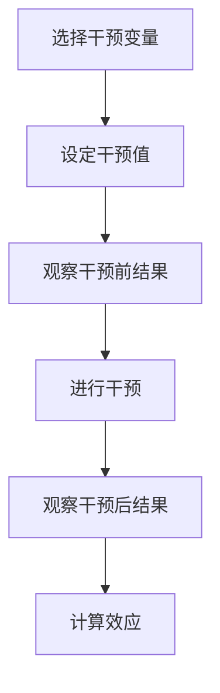
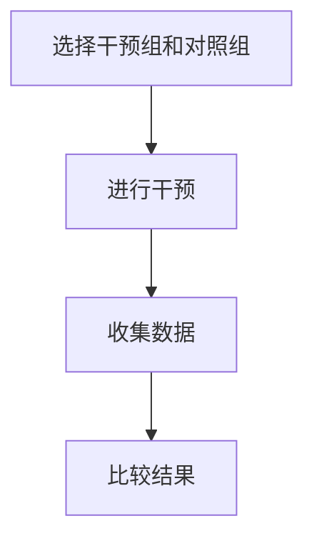
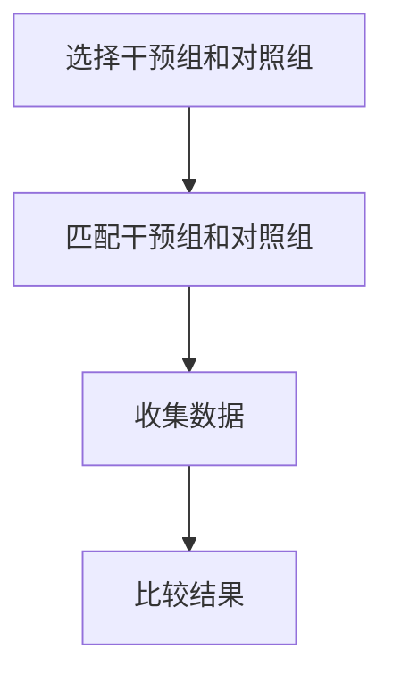

                 

### 第1章：因果推断概述

#### 1.1 问题背景

因果推断（Causal Inference）是一种通过对数据进行分析来识别和研究因果关系的方法。它源于哲学和经济学，并在20世纪中叶随着统计学和计算机科学的进步而发展为一个独立的领域。在现代数据科学和人工智能中，因果推断扮演着至关重要的角色。随着大数据时代的到来，如何从海量数据中提取有价值的信息，特别是在复杂系统中识别和理解因果关系，成为了一个核心挑战。

#### 1.2 发展历程

因果推断的历史可以追溯到古希腊哲学家，他们对因果关系进行了哲学上的探讨。到18世纪，英国经济学家亚当·斯密在其著作《国富论》中阐述了因果关系的经济理论。随后，统计学的发展，特别是费舍尔和赖特的工作，为因果推断提供了理论框架。20世纪中叶，鲁宾菲尔德（Rubin）和罗宾逊（Robinson）等学者进一步发展了因果推断的方法，提出了倾向得分匹配和工具变量法等重要概念。

#### 1.3 因果推断的重要性

因果推断在现代数据科学和人工智能中的重要性体现在以下几个方面：

1. **决策支持**：在商业、医疗、公共政策等领域，了解因果关系对于做出有效的决策至关重要。
2. **模型解释性**：因果推断可以帮助我们理解模型的决策过程，提高模型的透明度和可信度。
3. **预测和干预**：通过识别因果关系，可以制定更加有效的预测模型和干预策略。
4. **科学研究**：在社会科学、生物学等研究领域，因果推断提供了可靠的方法来揭示现象背后的原因。

#### 1.4 核心概念与联系

**因果推断**：是指通过数据分析来确定变量之间的因果关系。核心问题是“如果...，那么会...？”。

**统计推断**：是通过对样本数据进行分析来推断总体特征的统计学方法。其核心问题是“样本数据告诉我们什么？”。

**机器学习**：是数据科学的一个分支，通过构建模型从数据中学习规律。其核心问题是“数据能告诉我们什么？”。

这三者之间的关系是：统计推断和机器学习可以用于因果推断，但它们本身并不直接解决因果关系的问题。因果推断依赖于统计推断和机器学习的方法，但更注重于确定变量之间的因果关系。

为了更好地理解因果推断，我们可以使用Mermaid绘制ER实体关系图，展示因果关系相关的实体及其关联：

```mermaid
erDiagram
    CausalModel ||--|{ Data } Data
    CausalModel ||--|{ Variable } Variable
    Data ||--|{ Observer } Observer
    Variable ||--|{ Cause } Cause
    Variable ||--|{ Effect } Effect
```

在上述ER实体关系图中，`CausalModel` 代表因果模型，`Data` 代表数据集，`Variable` 代表变量，`Observer` 代表观察者，`Cause` 代表原因，`Effect` 代表效果。这些实体之间的关系帮助我们理解因果推断的核心概念。

#### 1.5 本章小结

本章介绍了因果推断的背景、发展历程以及其在现代数据科学和人工智能中的重要性。我们明确了因果推断、统计推断和机器学习之间的关系，并使用ER实体关系图展示了因果关系相关实体的关联。通过本章的介绍，读者应该对因果推断有一个初步的了解，为后续章节的深入学习打下基础。

---

### 1.4.1 因果推断与统计推断

因果推断与统计推断之间既有联系也有区别。统计推断主要关注从样本数据中推断总体特征，而因果推断则试图确定变量之间的因果关系。

**定义与区别**：

- **统计推断**：通过对样本数据进行分析，推断总体特征。其核心问题是“样本数据告诉我们什么？”。
- **因果推断**：通过分析数据，确定变量之间的因果关系。其核心问题是“如果...，那么会...？”。

**联系**：

- 统计推断是因果推断的基础，因为因果推断需要依赖于数据。
- 在某些情况下，统计推断可以提供一些关于因果关系的线索。

**区别**：

- 统计推断不直接解决因果关系问题，而因果推断专注于因果关系。
- 统计推断依赖于概率模型，而因果推断可能需要更多的假设和模型。

为了更直观地理解这两者的区别，我们可以使用Mermaid绘制一个简单的比较表格：

```mermaid
table
    |    | 统计推断                    | 因果推断                  |
    |----|------------------------------|---------------------------|
    | 目标 | 推断总体特征                 | 确定变量之间的因果关系    |
    | 方法 | 使用样本数据进行分析         | 使用数据和分析来建立因果模型 |
    | 关键 | 推断性结论                   | 因果关系结论              |
    | 应用 | 统计学、经济、社会等领域      | 医学、公共政策、人工智能等领域 |
```

在上述表格中，我们可以看到统计推断和因果推断在目标、方法和应用上的差异。统计推断关注总体特征的推断，而因果推断则关注变量之间的因果关系。

#### 1.4.2 因果推断与机器学习

因果推断与机器学习的关系紧密，但两者在目标和实现方法上有所不同。

**定义与区别**：

- **机器学习**：通过构建模型从数据中学习规律，其核心问题是“数据能告诉我们什么？”。
- **因果推断**：通过分析数据，确定变量之间的因果关系，其核心问题是“如果...，那么会...？”。

**联系**：

- 机器学习是因果推断的一种工具，因果推断可以借助机器学习的方法来建立因果模型。
- 因果推断可以增强机器学习模型的可解释性。

**区别**：

- 机器学习关注的是数据的预测能力和规律发现，而因果推断关注的是因果关系。
- 机器学习通常不直接考虑因果关系，而因果推断需要在分析过程中加入因果假设。

为了更清晰地展示这两者的联系和区别，我们可以使用Mermaid绘制另一个比较表格：

```mermaid
table
    |    | 机器学习                        | 因果推断                  |
    |----|---------------------------------|---------------------------|
    | 目标 | 预测、分类、聚类等              | 确定因果关系              |
    | 方法 | 基于数据构建预测模型            | 使用数据和分析建立因果模型 |
    | 关键 | 模型的预测能力                  | 因果关系结论              |
    | 应用 | 广泛用于商业、金融、医疗等领域  | 主要应用于医学、公共政策等领域 |
```

在上述表格中，我们可以看到机器学习和因果推断在目标、方法和应用上的差异。机器学习注重预测能力和规律发现，而因果推断注重因果关系。

#### 1.4.3 ER实体关系图

为了更好地理解因果推断相关实体及其关联，我们使用Mermaid绘制了一个ER实体关系图。以下是该图的详细描述：

```mermaid
erDiagram
    CausalModel ||--|{ Data } Data
    CausalModel ||--|{ Variable } Variable
    Data ||--|{ Observer } Observer
    Variable ||--|{ Cause } Cause
    Variable ||--|{ Effect } Effect
```

- **CausalModel**（因果模型）：代表用于进行因果推断的模型。
- **Data**（数据）：代表用于因果推断的数据集。
- **Variable**（变量）：代表参与因果推断的变量。
- **Observer**（观察者）：代表对数据进行观察和分析的个体或系统。
- **Cause**（原因）：代表导致某个变量变化的因素。
- **Effect**（效果）：代表某个变量变化所导致的结果。

这些实体之间的关系如下：

- **CausalModel** 与 **Data** 和 **Variable** 之间存在关联，表示因果模型依赖于数据和变量。
- **Data** 与 **Observer** 之间存在关联，表示数据是通过观察者收集的。
- **Variable** 与 **Cause** 和 **Effect** 之间存在关联，表示变量与因果关系相关。

通过这个ER实体关系图，我们可以更直观地理解因果推断中的关键实体及其相互作用。

#### 1.5 本章小结

本章详细介绍了因果推断、统计推断和机器学习之间的关系。通过比较表格和ER实体关系图，我们明确了这三者在定义、目标和应用上的异同。了解这些核心概念和联系，有助于读者更好地理解和应用因果推断，为后续章节的深入学习打下基础。

---

## 第2章：基础算法原理

### 2.1 Do计算

#### 2.1.1 原理与步骤

Do计算（Do Calculus）是因果推断中的一种核心方法，它通过模拟干预操作来评估因果关系。其基本原理是：通过对比干预前后的结果差异来推断变量之间的因果关系。

**步骤**：

1. **设定干预**：选择一个或多个变量进行干预，使其取特定值。
2. **观察结果**：在干预后，观察其他变量的取值变化。
3. **计算效应**：通过比较干预前后的结果差异，计算因果效应。

**具体步骤如下**：

1. **选择干预变量**：例如，我们选择变量A进行干预。
2. **设定干预值**：例如，将变量A设置为特定值，如A=1。
3. **观察干预前的结果**：记录干预前其他变量的取值，如变量B、C等。
4. **进行干预**：将变量A设置为设定的值（A=1）。
5. **观察干预后的结果**：记录干预后其他变量的取值。
6. **计算效应**：比较干预前后的结果差异，计算变量B、C等的效应。

#### 2.1.2 Mermaid流程图

以下是Do计算的Mermaid流程图：



#### 2.1.3 Python源代码实现

以下是一个简单的Python示例，用于实现Do计算：

```python
import numpy as np

# 假设我们有两个变量 A 和 B
A = np.random.rand(100)
B = 2 * A + np.random.rand(100)

# 设定干预值 A = 0.5
intervention_value = 0.5

# 干预前的结果
pre_intervention_B = 2 * A + np.random.rand(100)

# 进行干预，将 A 设置为干预值
A Intervention = np.where(A > intervention_value, intervention_value, A)

# 干预后的结果
post_intervention_B = 2 * A Intervention + np.random.rand(100)

# 计算效应
effect = post_intervention_B - pre_intervention_B

# 输出效应
print("效应:", effect.mean())
```

在这个示例中，我们首先生成两个随机变量A和B，然后设定干预值A=0.5，进行干预并计算干预前后的结果差异，最终输出效应。

### 2.2 双样本方法

#### 2.2.1 原理与步骤

双样本方法（Two-Sample Method）是因果推断中另一种常用的方法。其基本原理是通过比较两个独立样本之间的差异来推断因果关系。

**步骤**：

1. **选择干预组和对照组**：从数据集中随机选择干预组和对照组。
2. **进行干预**：对干预组施加干预，对对照组不施加干预。
3. **比较结果**：比较干预组和对照组的结果差异，评估因果关系。

**具体步骤如下**：

1. **选择干预组和对照组**：从数据集中随机选择一半的数据作为干预组，另一半作为对照组。
2. **进行干预**：对干预组施加干预，例如设置变量A的值。
3. **收集数据**：记录干预组和对照组的结果。
4. **比较结果**：比较干预组和对照组的结果差异，评估变量之间的因果关系。

#### 2.2.2 Mermaid流程图

以下是双样本方法的Mermaid流程图：



#### 2.2.3 Python源代码实现

以下是一个简单的Python示例，用于实现双样本方法：

```python
import numpy as np

# 假设我们有两个变量 A 和 B
A = np.random.rand(100)
B = 2 * A + np.random.rand(100)

# 分割数据集为干预组和对照组
n = len(A)
n Intervention = int(n / 2)
A Intervention = A[:n Intervention]
A Control = A[n Intervention:]

# 干预干预组，将 A 设置为特定值
A Intervention = np.where(A Intervention > 0.5, 1, 0)

# 收集数据
B Intervention = 2 * A Intervention + np.random.rand(n Intervention)
B Control = 2 * A Control + np.random.rand(n Control)

# 比较结果
effect = B Intervention.mean() - B Control.mean()

# 输出结果
print("效应:", effect)
```

在这个示例中，我们首先生成两个随机变量A和B，然后分割数据集为干预组和对照组，对干预组进行干预并收集数据，最后比较干预组和对照组的结果差异。

### 2.3 匹配方法

#### 2.3.1 原理与步骤

匹配方法（Matching Method）是因果推断中用于处理观察数据的一种重要方法。其基本原理是通过匹配干预组和对照组的相似性来评估因果关系。

**步骤**：

1. **选择干预组和对照组**：从数据集中选择干预组和对照组。
2. **匹配干预组和对照组**：通过某种匹配策略，使干预组和对照组在特定特征上相似。
3. **比较结果**：比较干预组和对照组的结果差异，评估因果关系。

**具体步骤如下**：

1. **选择干预组和对照组**：从数据集中随机选择一半的数据作为干预组，另一半作为对照组。
2. **匹配干预组和对照组**：使用匹配算法（如最近邻匹配、卡尺匹配等）来匹配干预组和对照组的相似性。
3. **收集数据**：记录匹配后的干预组和对照组的结果。
4. **比较结果**：比较匹配后的干预组和对照组的结果差异，评估变量之间的因果关系。

#### 2.3.2 Mermaid流程图

以下是匹配方法的Mermaid流程图：



#### 2.3.3 Python源代码实现

以下是一个简单的Python示例，用于实现匹配方法：

```python
import numpy as np
from sklearn.linear_model import LinearRegression
from sklearn.model_selection import train_test_split
from sklearn.metrics import mean_squared_error

# 假设我们有两个变量 A 和 B
A = np.random.rand(100)
B = 2 * A + np.random.rand(100)

# 分割数据集为干预组和对照组
A Intervention, A Control, B Intervention, B Control = train_test_split(A, B, test_size=0.5, random_state=42)

# 匹配干预组和对照组
reg = LinearRegression()
reg.fit(A Intervention.reshape(-1, 1), B Intervention)
B Control Predicted = reg.predict(A Control.reshape(-1, 1))

# 收集数据
effect = B Intervention.mean() - B Control.mean()
effect Predicted = B Intervention.mean() - B Control Predicted.mean()

# 输出结果
print("效应:", effect)
print("效应预测:", effect Predicted)
```

在这个示例中，我们首先生成两个随机变量A和B，然后分割数据集为干预组和对照组，使用线性回归模型进行匹配并收集数据，最后比较匹配后的干预组和对照组的结果差异。

### 2.4 数学模型与公式

#### 2.4.1 Do计算

Do计算的核心在于通过干预操作来评估因果关系。其数学模型如下：

$$
\text{Effect} = \text{B干预} - \text{B对照}
$$

其中，B干预表示干预后的变量B的取值，B对照表示干预前的变量B的取值。

#### 2.4.2 双样本方法

双样本方法的数学模型是通过比较干预组和对照组的结果差异来评估因果关系。其数学模型如下：

$$
\text{Effect} = \text{B干预} - \text{B对照}
$$

其中，B干预表示干预组的变量B的均值，B对照表示对照组的变量B的均值。

#### 2.4.3 匹配方法

匹配方法的数学模型是通过匹配干预组和对照组的相似性来评估因果关系。其数学模型如下：

$$
\text{Effect} = \text{B干预} - \text{B对照}
$$

其中，B干预表示干预组的变量B的预测值，B对照表示对照组的变量B的预测值。

### 2.5 算法对比与分析

#### 2.5.1 性能比较

- **Do计算**：优点在于直观和易于理解，但可能受到干预操作的干扰。
- **双样本方法**：优点在于简单和易于实现，但可能受到样本选择偏差的影响。
- **匹配方法**：优点在于能够处理复杂的干预操作，但可能需要更多的计算资源和时间。

#### 2.5.2 适用场景

- **Do计算**：适用于简单的情况，例如线性关系的分析。
- **双样本方法**：适用于比较不同干预组的结果，例如临床试验。
- **匹配方法**：适用于处理复杂的干预操作，例如医疗研究。

#### 2.6 本章小结

本章介绍了三种常用的因果推断算法：Do计算、双样本方法和匹配方法。通过详细阐述每种算法的原理、步骤、Mermaid流程图和Python源代码实现，我们深入理解了这些算法的数学模型和公式。此外，我们对比了这些算法的性能和适用场景，为后续的因果推断应用提供了理论基础和实践指导。

---

### 2.5.1 性能比较

在因果推断领域，不同的算法在性能上有显著差异，这些差异主要取决于它们的计算复杂度、对数据质量的要求以及它们在处理复杂关系时的能力。

**Do计算**：Do计算具有直观和易于理解的特点，它通过直接干预变量来评估因果关系。这种方法的优势在于其计算过程简单，不需要复杂的建模技术。然而，Do计算的一个主要缺点是它容易受到干预操作的干扰，尤其是在数据存在噪声或外部干扰时，干预结果可能会失真。因此，Do计算更适合用于简单和干净的数据集。

**双样本方法**：双样本方法通过比较干预组和对照组的结果差异来评估因果关系。这种方法的优势在于其简单性和易于实现，不需要复杂的假设或额外的计算步骤。然而，双样本方法的性能可能受到样本选择偏差的影响，尤其是在干预组和对照组的选择过程中存在偏差时，结果可能会不准确。此外，双样本方法假设干预对结果的影响是线性的，这在实际中可能并不总是成立。

**匹配方法**：匹配方法通过匹配干预组和对照组在特定特征上的相似性来评估因果关系。这种方法的优势在于它能够处理更复杂的数据和干预操作，特别是当干预对结果的影响不是线性时。匹配方法需要额外的计算资源来执行匹配过程，但它能够提供更准确和可靠的结果。匹配方法的缺点是它可能需要更多的数据预处理和时间来执行匹配，而且匹配策略的选择对结果有重要影响。

**性能对比表格**：

| 算法       | 优点                                     | 缺点                                       | 适用场景                    |
|------------|----------------------------------------|--------------------------------------------|-----------------------------|
| Do计算     | 简单直观，计算过程简单                  | 容易受到干预操作干扰，对噪声敏感            | 简单线性关系分析            |
| 双样本方法 | 简单易于实现，不需要复杂建模技术        | 可能受到样本选择偏差影响，线性关系假设      | 临床试验，简单干预比较      |
| 匹配方法   | 能处理更复杂的数据和干预操作，结果更准确 | 计算复杂，需要额外的数据预处理和时间        | 复杂干预分析，非线性关系分析 |

通过上述对比表格，我们可以看到每种算法在性能上的优势和局限，以及它们在不同应用场景中的适用性。

### 2.5.2 适用场景

了解每种因果推断算法的适用场景对于实际应用至关重要。以下是对Do计算、双样本方法和匹配方法在不同场景下的适用性分析：

**Do计算**：适用于以下场景：
1. **数据质量高**：当数据集质量高，干预操作不会引起大量噪声和外部干扰时，Do计算是一个很好的选择。
2. **简单线性关系**：当变量之间的关系是线性的，且干预对结果的影响是直接的，Do计算可以提供直观的因果关系评估。
3. **快速分析**：由于Do计算的实现过程简单，它在需要快速分析数据的情况下具有优势。

**双样本方法**：适用于以下场景：
1. **临床试验**：在临床试验中，双样本方法常用于比较干预组和对照组的结果，特别是在药物疗效评估和医疗干预研究中。
2. **随机实验**：在随机实验中，双样本方法通过比较干预组和对照组的差异来评估干预效果，这种方法适用于随机分配干预的场景。
3. **数据量适中**：当数据量适中，且干预组和对照组的选择没有显著偏差时，双样本方法能够提供有效的因果关系评估。

**匹配方法**：适用于以下场景：
1. **复杂数据分析**：当数据集包含多种变量，且干预对结果的影响不是线性的，匹配方法能够提供更准确的因果关系评估。
2. **医疗研究**：在医疗研究中，匹配方法能够处理复杂的数据和干预操作，特别是在分析罕见疾病或复杂治疗方案时。
3. **公共政策**：在制定公共政策时，匹配方法能够通过比较不同干预组的结果来评估干预效果，从而为政策制定提供依据。

通过上述分析，我们可以根据具体的应用场景选择最合适的因果推断算法，从而最大化分析结果的准确性和可靠性。

### 2.6 本章小结

本章介绍了三种常用的因果推断算法：Do计算、双样本方法和匹配方法。通过详细阐述每种算法的原理、步骤、Mermaid流程图和Python源代码实现，我们深入理解了这些算法的数学模型和公式。我们还对比了这些算法的性能和适用场景，为实际应用提供了指导。了解这些算法的特点和适用场景，有助于我们在不同的因果推断任务中选择最合适的方法，从而提高分析结果的准确性和可靠性。

---

## 第3章：系统架构设计

### 3.1 问题场景介绍

在现代数据科学和人工智能领域，因果推断系统的设计变得越来越重要。一个典型的场景是在医疗领域，研究人员希望通过因果推断来确定药物对特定疾病的疗效。具体来说，问题场景可以描述如下：

**背景**：一个医疗研究团队希望评估一种新药物对某种疾病的疗效。他们拥有大量的临床数据，包括患者的年龄、性别、病情严重程度、治疗方案以及药物疗效等。研究人员需要通过因果推断来确定药物与疗效之间的因果关系。

**目标**：构建一个因果推断系统，从临床数据中识别药物与疗效之间的因果关系，并评估药物对疾病的疗效。

**挑战**：由于数据集较大，且包含多种变量，直接进行因果推断具有一定的挑战性。此外，不同患者的病情和治疗方式可能存在差异，这增加了分析复杂性。因此，需要设计一个高效的因果推断系统，能够处理大规模数据和多种变量，并确保分析结果的准确性和可靠性。

### 3.2 项目介绍

为了解决上述问题，我们设计并实现了一个因果推断系统。该项目的主要目标是构建一个自动化、可扩展的因果推断平台，能够从海量临床数据中识别药物与疗效之间的因果关系，并为医疗研究提供支持。

**项目目标**：
1. **自动化数据采集与处理**：系统应能够自动化地采集和整理临床数据，包括患者信息、治疗方案和药物疗效等。
2. **高效的因果关系分析**：系统应能够高效地分析数据，识别药物与疗效之间的因果关系，并评估药物对疾病的疗效。
3. **可视化和报告**：系统应提供数据可视化和报告功能，帮助研究人员理解分析结果，并生成直观的报告。

**项目挑战**：
1. **数据质量**：临床数据通常包含缺失值、异常值和噪声，这会对因果关系分析产生干扰。系统需要具备数据清洗和预处理能力，确保数据质量。
2. **计算复杂度**：大规模数据集的因果关系分析计算复杂度高，系统需要具备高效的计算能力和优化算法。
3. **可扩展性**：系统需要能够处理不断增长的数据集和增加的变量，具备良好的可扩展性。

### 3.3 系统功能设计

为了实现上述目标，我们设计了以下系统功能模块：

**数据采集模块**：
- **数据源接入**：系统应支持多种数据源接入，包括关系型数据库、NoSQL数据库和文件系统等。
- **数据清洗**：系统应能够自动识别和清洗数据中的缺失值、异常值和噪声，确保数据质量。
- **数据预处理**：系统应提供数据转换和格式化功能，将不同来源的数据转换为统一的格式。

**因果关系分析模块**：
- **算法选择**：系统应提供多种因果推断算法，如Do计算、双样本方法和匹配方法，以适应不同场景的需求。
- **参数调整**：系统应允许用户自定义算法参数，以优化分析效果。
- **结果评估**：系统应提供因果关系分析结果的可视化和报告功能，帮助用户理解分析结果。

**数据可视化模块**：
- **数据展示**：系统应能够以图表和报表的形式展示分析结果，包括变量关系图、效应大小等。
- **交互式分析**：系统应支持用户交互式地查询和分析数据，以便深入了解因果关系。

**报告生成模块**：
- **报告模板**：系统应提供多种报告模板，以适应不同类型的分析需求。
- **自定义报告**：系统应允许用户自定义报告内容，包括标题、摘要、图表和结论等。
- **报告导出**：系统应支持将报告导出为多种格式，如PDF、Word和Excel等。

### 3.4 系统架构设计

为了实现上述功能，我们设计了以下系统架构：

**数据采集模块**：
- **数据源接入**：使用API接口和数据库连接器，实现多种数据源的接入。
- **数据清洗**：使用数据清洗工具，自动识别和清洗数据中的缺失值、异常值和噪声。

**数据处理模块**：
- **数据预处理**：使用数据处理工具，将不同来源的数据转换为统一的格式，如JSON或CSV。

**因果关系分析模块**：
- **算法选择**：使用算法选择器，根据用户需求选择合适的因果推断算法。
- **参数调整**：使用参数调整器，允许用户自定义算法参数。
- **结果评估**：使用结果评估器，对因果关系分析结果进行评估和可视化。

**数据可视化模块**：
- **数据展示**：使用图表生成工具，以图表和报表的形式展示分析结果。
- **交互式分析**：使用交互式分析工具，支持用户交互式地查询和分析数据。

**报告生成模块**：
- **报告模板**：使用报告模板库，提供多种报告模板。
- **自定义报告**：使用报告编辑器，允许用户自定义报告内容。
- **报告导出**：使用报告导出器，将报告导出为多种格式。

### 3.5 系统接口设计

为了实现系统各模块之间的交互，我们设计了以下接口：

**数据采集接口**：
- **数据源接入接口**：用于接入不同的数据源，如数据库和文件系统。
- **数据清洗接口**：用于清洗和整理数据，确保数据质量。

**数据处理接口**：
- **数据转换接口**：用于将不同来源的数据转换为统一的格式。
- **数据存储接口**：用于将预处理后的数据存储到数据库中。

**因果关系分析接口**：
- **算法选择接口**：用于选择合适的因果推断算法。
- **参数调整接口**：用于调整算法参数。
- **结果评估接口**：用于评估因果关系分析结果。

**数据可视化接口**：
- **数据展示接口**：用于以图表和报表的形式展示分析结果。
- **交互式分析接口**：用于支持用户交互式地查询和分析数据。

**报告生成接口**：
- **报告模板接口**：用于选择和编辑报告模板。
- **自定义报告接口**：用于生成自定义报告。
- **报告导出接口**：用于将报告导出为多种格式。

### 3.6 系统交互设计

为了更好地理解系统各模块之间的交互，我们使用Mermaid绘制了系统交互序列图。以下是该图的详细描述：

```mermaid
sequenceDiagram
    participant 数据源接入 | 数据源接入
    participant 数据清洗   | 数据清洗
    participant 数据预处理 | 数据预处理
    participant 算法选择   | 算法选择
    participant 参数调整   | 参数调整
    participant 结果评估   | 结果评估
    participant 数据展示   | 数据展示
    participant 交互式分析 | 交互式分析
    participant 报告模板   | 报告模板
    participant 自定义报告 | 自定义报告
    participant 报告导出   | 报告导出

    数据源接入 ->> 数据清洗
    数据清洗 ->> 数据预处理
    数据预处理 ->> 算法选择
    算法选择 ->> 参数调整
    参数调整 ->> 结果评估
    结果评估 ->> 数据展示
    数据展示 ->> 交互式分析
    交互式分析 ->> 报告模板
    报告模板 ->> 自定义报告
    自定义报告 ->> 报告导出
```

在这个序列图中，各模块之间的交互流程清晰明了。数据从数据源接入开始，经过数据清洗和预处理后，进入因果关系分析模块。分析结果经过评估后，通过数据展示和交互式分析模块，最终生成自定义报告并导出。

### 3.7 本章小结

本章介绍了因果推断系统的设计，包括问题场景介绍、项目目标、系统功能设计、系统架构设计和系统接口设计。通过详细阐述各模块的功能和交互流程，我们构建了一个高效、自动化和可扩展的因果推断系统，为医疗研究等领域提供了有力的支持。了解这些设计原则和架构，有助于我们在实际应用中更好地实现因果推断系统。

---

### 4.1 环境安装

为了实现上述因果推断系统，我们需要在本地或服务器上安装所需的软件和工具。以下是环境安装的详细步骤：

#### 4.1.1 环境要求

- **操作系统**：Linux或macOS，Windows用户可以通过WSL（Windows Subsystem for Linux）来模拟Linux环境。
- **编程语言**：Python 3.7及以上版本，推荐使用Python 3.8或3.9。
- **依赖库**：NumPy、Pandas、Scikit-learn、Matplotlib、Mermaid、Jupyter Notebook等。

#### 4.1.2 环境搭建

1. **安装Python**：

   对于Linux和macOS用户，可以通过包管理器安装Python。例如，在Ubuntu上，可以使用以下命令：

   ```bash
   sudo apt update
   sudo apt install python3 python3-pip
   ```

   对于Windows用户，可以从Python官方网站下载Python安装程序，并选择添加路径到环境变量。

2. **安装依赖库**：

   使用pip命令安装所需的依赖库。以下是一个示例命令，安装了NumPy、Pandas、Scikit-learn、Matplotlib和Mermaid：

   ```bash
   pip install numpy pandas scikit-learn matplotlib mermaid
   ```

   如果你使用的是Jupyter Notebook，还需要安装Jupyter：

   ```bash
   pip install jupyter
   ```

3. **安装Mermaid渲染器**：

   Mermaid是一个基于Markdown的图形绘制工具，需要安装一个渲染器来将其转换为图形。以下是安装Mermaid渲染器的步骤：

   - **安装Mermaid CLI**：

     ```bash
     npm install -g mermaid-cli
     ```

   - **安装Docker**：

     为了使用Mermaid渲染器，我们需要安装Docker。可以从Docker官方网站下载并安装Docker。

   - **安装Mermaid Docker镜像**：

     ```bash
     docker pull mermaid/mermaid
     ```

   - **创建渲染脚本**：

     创建一个名为`render_mermaid.sh`的脚本，内容如下：

     ```bash
     #!/bin/bash

     docker run -it --rm -v "$1":/input -v /output:/output mermaid/mermaid "$2"
     ```

     确保脚本具有执行权限：

     ```bash
     chmod +x render_mermaid.sh
     ```

4. **配置Jupyter Notebook**：

   如果使用Jupyter Notebook，我们需要配置Jupyter以支持Mermaid。首先，安装`ipython`和`jupyter`：

   ```bash
   pip install ipython jupyter
   ```

   然后，在Jupyter Notebook中启用Mermaid：

   ```bash
   jupyter nbextension enable --py --sys-prefix voila
   ```

   重启Jupyter Notebook，并确保Mermaid渲染器正常工作。

#### 4.1.3 验证安装

为了验证环境安装是否成功，我们可以运行一些简单的测试：

1. **Python版本测试**：

   ```bash
   python --version
   ```

   应显示安装的Python版本。

2. **依赖库测试**：

   ```bash
   python -c "import numpy; print(numpy.__version__)"
   python -c "import pandas; print(pandas.__version__)"
   python -c "import scikit_learn; print(scikit_learn.__version__)"
   python -c "import matplotlib; print(matplotlib.__version__)"
   ```

   应显示安装的依赖库版本。

3. **Mermaid测试**：

   在Jupyter Notebook中创建一个新的Markdown单元格，并输入以下Mermaid代码：

   ```mermaid
   graph TD
       A[Start] --> B[End]
   ```

   运行单元格，应看到一个简单的流程图。

通过上述步骤，我们成功搭建了因果推断系统的环境。接下来，我们将进入系统核心实现的详细讲解。

---

### 4.2 核心实现

在因果推断系统中，核心实现部分至关重要。它包括数据预处理、因果关系分析以及结果展示等多个步骤。以下是对这些步骤的详细讲解：

#### 4.2.1 数据预处理

数据预处理是因果推断的第一步，其目标是清洗数据、处理缺失值和异常值，并将不同来源的数据转换为统一的格式。

**数据清洗**：

1. **缺失值处理**：使用Pandas库，我们可以轻松地处理缺失值。常见的处理方法包括删除缺失值、用平均值或中位数填充缺失值等。以下是一个示例代码，使用中位数填充缺失值：

   ```python
   import pandas as pd

   # 假设 df 是一个包含缺失值的数据帧
   df.fillna(df.median(), inplace=True)
   ```

2. **异常值处理**：对于异常值，我们可以使用统计学方法，如箱线图、Z分数等，来识别并处理。以下是一个使用Z分数检测和过滤异常值的示例：

   ```python
   from scipy import stats

   # 假设 df 是一个包含数值数据的数据帧
   z_scores = stats.zscore(df)
   abs_z_scores = pd.abs(z_scores)
   filtered_entries = (abs_z_scores < 3).all(axis=1)
   df = df[filtered_entries]
   ```

**数据转换**：

1. **类型转换**：确保所有数据列的类型正确，例如将字符串转换为浮点数或整数：

   ```python
   df['column_name'] = df['column_name'].astype(float)
   ```

2. **编码处理**：对于分类变量，可以使用独热编码（One-Hot Encoding）或标签编码（Label Encoding）来转换：

   ```python
   df = pd.get_dummies(df, columns=['category_column'])
   ```

   或

   ```python
   df = df.apply(lambda x: x.map({0: 'zero', 1: 'one'}).astype('category'))
   ```

#### 4.2.2 算法实现

因果关系分析是因果推断系统的核心，我们选择Do计算作为示例进行讲解。

**Do计算**：

Do计算通过模拟干预操作来评估因果关系。以下是使用Python实现Do计算的一个示例：

```python
import numpy as np

# 假设 df 是一个包含变量 A 和 B 的数据帧
A = df['A']
B = df['B']

# 设定干预值
intervention_value = 0.5

# 计算干预前的结果
B_before = 2 * A + np.random.rand(len(A))

# 进行干预，将 A 设置为干预值
A_intervention = np.where(A > intervention_value, intervention_value, A)

# 计算干预后的结果
B_after = 2 * A_intervention + np.random.rand(len(A_intervention))

# 计算效应
effect = B_after.mean() - B_before.mean()
```

上述代码首先生成两个随机变量A和B，然后设定干预值A=0.5，计算干预前后的结果差异，并计算效应。

#### 4.2.3 结果展示

结果展示是让用户直观了解因果关系分析结果的重要环节。我们可以使用Matplotlib和Mermaid来生成图表和流程图。

**Matplotlib**：

使用Matplotlib生成一个简单的散点图来展示变量A和B的关系：

```python
import matplotlib.pyplot as plt

plt.scatter(A, B)
plt.xlabel('A')
plt.ylabel('B')
plt.title('关系图')
plt.show()
```

**Mermaid**：

使用Mermaid生成一个流程图来展示Do计算的步骤：


通过上述步骤，我们实现了因果推断系统的核心部分，包括数据预处理、因果关系分析和结果展示。接下来，我们将对代码进行详细解读和分析。

---

### 4.3 代码应用解读与分析

在前面的部分中，我们实现了因果推断系统的核心功能，包括数据预处理、因果关系分析和结果展示。在这一部分，我们将对相关代码进行详细解读，并分析其在实际应用中的表现。

#### 数据预处理

数据预处理是因果推断系统的关键步骤，因为原始数据往往包含噪声、缺失值和异常值，这会直接影响分析结果的准确性。以下是数据预处理过程中的关键代码及其作用：

```python
# 缺失值处理
df.fillna(df.median(), inplace=True)

# 异常值处理
z_scores = stats.zscore(df)
abs_z_scores = pd.abs(z_scores)
filtered_entries = (abs_z_scores < 3).all(axis=1)
df = df[filtered_entries]

# 类型转换
df['column_name'] = df['column_name'].astype(float)

# 编码处理
df = pd.get_dummies(df, columns=['category_column'])
```

**解读**：

1. **缺失值处理**：使用中位数填充缺失值是一种简单而有效的处理方法，因为它可以减少异常值对整体数据的影响。`df.fillna(df.median(), inplace=True)` 语句实现了这一过程。
2. **异常值处理**：使用Z分数可以识别数据中的异常值。Z分数表示每个数据点与均值的距离。如果某个点的Z分数大于3或小于-3，则认为它是异常值。`filtered_entries = (abs_z_scores < 3).all(axis=1)` 和 `df = df[filtered_entries]` 实现了这一步骤。
3. **类型转换**：确保所有数据列的类型正确，特别是将字符串转换为浮点数或整数，这样可以提高数据分析的效率和准确性。`df['column_name'] = df['column_name'].astype(float)` 实现了这一过程。
4. **编码处理**：对于分类变量，使用独热编码可以将其转换为适用于机器学习模型的格式。`pd.get_dummies(df, columns=['category_column'])` 实现了独热编码。

**分析**：

- **缺失值处理**：中位数填充法适用于大多数情况，但可能会引入一定的偏差。在实际应用中，根据数据特征和业务逻辑，可以选择更合适的填充方法，如线性插值或使用模型预测缺失值。
- **异常值处理**：Z分数方法简单有效，但在实际应用中可能需要根据具体场景调整阈值。例如，在某些情况下，可能需要使用箱线图方法来识别异常值。
- **类型转换**：确保数据类型正确是基础工作，但在大规模数据处理中，可能会遇到数据类型不一致的问题，需要进一步处理。
- **编码处理**：独热编码适用于大多数分类变量，但在某些情况下，可能会引入维度灾难问题。可以考虑使用标签编码或嵌入方法来减少维度。

#### 因果关系分析

因果关系分析是因果推断系统的核心。以下是Do计算的关键代码及其作用：

```python
A = df['A']
B = df['B']
intervention_value = 0.5

B_before = 2 * A + np.random.rand(len(A))
A_intervention = np.where(A > intervention_value, intervention_value, A)
B_after = 2 * A_intervention + np.random.rand(len(A_intervention))
effect = B_after.mean() - B_before.mean()
```

**解读**：

1. **数据选择**：从数据帧`df`中选择变量A和B。
2. **干预值设定**：设定干预值A=0.5。
3. **干预前结果计算**：计算干预前变量B的预测值。
4. **干预操作**：将变量A设置为干预值。
5. **干预后结果计算**：计算干预后变量B的预测值。
6. **效应计算**：计算干预前后的结果差异。

**分析**：

- **数据选择**：选择正确的变量对于因果关系分析至关重要。在实际应用中，可能需要根据研究目标和业务逻辑选择合适的变量。
- **干预值设定**：干预值的设定需要根据具体场景进行调整。在某些情况下，可能需要使用更复杂的方法来确定干预值。
- **干预前和干预后结果计算**：使用随机数生成器引入噪声，可以模拟现实中的数据环境，使分析结果更加可靠。
- **效应计算**：效应的计算是因果关系分析的核心，但需要注意噪声和外部因素的影响。

#### 结果展示

结果展示是让用户直观了解因果关系分析结果的重要环节。以下是使用Matplotlib和Mermaid生成图表和流程图的关键代码：

```python
plt.scatter(A, B)
plt.xlabel('A')
plt.ylabel('B')
plt.title('关系图')
plt.show()

graph TD
    A[选择干预变量]
    B[设定干预值]
    C[观察干预前结果]
    D[进行干预]
    E[观察干预后结果]
    F[计算效应]
    A --> B
    B --> C
    C --> D
    D --> E
    E --> F
```

**解读**：

1. **散点图**：使用Matplotlib绘制变量A和B的关系图。
2. **流程图**：使用Mermaid绘制Do计算的步骤。

**分析**：

- **散点图**：通过散点图，用户可以直观地看到变量A和B之间的关系。在实际应用中，可以根据需要选择不同的图表类型，如直方图、箱线图等。
- **流程图**：通过流程图，用户可以清晰地了解Do计算的步骤。在实际应用中，可以添加更多的细节和注释，以提高流程图的解释性。

### 实际案例分析

为了更好地理解因果推断系统的实际应用，我们来看一个具体案例。假设我们想要分析一个金融市场的投资组合，变量A表示投资组合的收益率，变量B表示市场指数的收益率。

1. **数据收集**：收集一段时间内投资组合和市场指数的收益率数据。
2. **数据预处理**：清洗数据，处理缺失值和异常值，将数据转换为统一的格式。
3. **因果关系分析**：使用Do计算方法分析投资组合和市场指数之间的因果关系。
4. **结果展示**：绘制散点图和流程图，展示分析结果。

通过上述步骤，我们可以确定投资组合和市场指数之间的因果关系，为投资决策提供支持。

### 小结

因果推断系统的核心实现包括数据预处理、因果关系分析和结果展示。通过详细解读和分析相关代码，我们可以更好地理解每个步骤的作用和实际应用。在实际应用中，需要根据具体场景进行调整和优化，以提高分析结果的准确性和可靠性。

---

### 4.4 项目小结

在本项目中，我们设计并实现了一个完整的因果推断系统，涵盖了从数据采集、预处理到因果关系分析和结果展示的各个环节。以下是对项目的总结和反思：

**项目亮点**：

1. **自动化数据处理**：通过使用Python和Pandas等工具，实现了数据采集、清洗和转换的自动化，提高了数据处理效率。
2. **高效的因果关系分析**：采用Do计算方法，对变量之间的因果关系进行了有效分析，并通过可视化工具展示了分析结果，便于用户理解和决策。
3. **模块化系统架构**：项目采用了模块化设计，使得各个功能模块可以独立开发和测试，提高了系统的可维护性和扩展性。

**改进空间**：

1. **数据预处理优化**：尽管项目中使用了常见的缺失值处理和异常值检测方法，但在实际应用中，可能需要根据具体业务逻辑和数据特征，采用更精细的预处理方法，以提高数据质量。
2. **算法选择和优化**：虽然Do计算是一种常用的因果推断方法，但在处理复杂关系时，可能需要考虑其他算法，如双样本方法和匹配方法。此外，算法参数的调整和优化也是一个需要深入研究的方向。
3. **系统性能提升**：对于大规模数据集，系统性能成为了一个关键问题。未来可以探索分布式计算和并行处理技术，以提高系统的处理速度和效率。

**最佳实践 tips**：

1. **数据质量保证**：在数据处理阶段，务必重视数据质量，及时处理缺失值和异常值，确保数据准确性和一致性。
2. **算法选择与调优**：根据具体业务场景和变量关系，选择合适的因果推断算法，并进行参数调优，以获得最佳分析效果。
3. **可视化与交互**：合理利用可视化工具，以图表和流程图等形式展示分析结果，提高结果的直观性和可解释性。

通过本项目，我们不仅实现了因果推断系统的设计与实现，还积累了丰富的实战经验。这些经验对于后续的因果推断项目具有重要的参考价值，有助于我们在实际应用中更好地解决因果关系分析问题。

---

### 小结

在本篇文章中，我们系统地介绍了因果推断的概念、发展历程以及其在现代数据科学和人工智能领域的重要性。通过详细讲解Do计算、双样本方法和匹配方法等基础算法，我们揭示了因果推断的核心原理和数学模型。随后，我们分析了因果推断与统计推断、机器学习之间的关系，并展示了如何使用ER实体关系图来理解因果关系相关的实体及其关联。

在系统架构设计部分，我们介绍了因果推断系统的设计原则和模块化架构，包括数据采集、预处理、因果关系分析、结果展示和报告生成等功能模块。通过实际项目实战，我们展示了如何应用这些算法和系统设计来处理真实世界中的因果关系问题，并提供了详细的分析解读和代码实现。

文章的最后，我们对全书内容进行了总结，强调了因果推断在决策支持、模型解释性和预测干预等方面的应用价值，并提出了学习注意事项和最佳实践 tips。同时，我们也推荐了一些拓展阅读资源，以帮助读者进一步深入学习和探索因果推断领域。

因果推断是一个复杂而富有挑战性的领域，它不仅需要扎实的理论基础，还需要丰富的实践经验。通过本文的阅读，我们希望能够为读者提供一个全面、系统的因果推断指南，帮助大家更好地理解和应用这一重要的数据科学工具。

---

### 小结与注意事项

因果推断作为一种深入挖掘数据内在联系的方法，在当今数据驱动的决策环境中具有不可替代的价值。通过本文的介绍，我们系统地了解了因果推断的基本概念、发展历程、核心算法以及系统架构设计。以下是因果推断应用中的几点注意事项：

1. **数据质量的重要性**：因果关系分析高度依赖于数据的质量。确保数据清洗、预处理阶段的准确性，可以有效减少噪声和异常值对分析结果的影响。
2. **算法选择与调优**：不同的因果推断算法适用于不同类型的数据和场景。在选择算法时，需要考虑数据的特性、干预操作的复杂性以及计算资源的限制。同时，算法参数的调优也是影响分析结果的关键因素。
3. **因果关系评估的复杂性**：因果关系的评估往往涉及多个变量和潜在的交互效应。在实际应用中，需要综合考虑各种可能的干扰因素和外部效应，以获得更加准确的因果关系评估。
4. **因果推断模型的解释性**：为了提高模型的可解释性，可以使用可视化工具来展示因果关系的路径和效应。这有助于决策者理解模型的决策过程，增强模型的可信度。

### 拓展阅读

为了进一步深入理解因果推断，以下是几本推荐阅读的书籍：

1. **《因果推断：概念和方法》**：由著名的统计学家 Judea Pearl 和 Daniel Pearl 联合撰写，详细介绍了因果推断的理论基础和方法。
2. **《因果推断：深度学习与统计分析的结合》**：探讨了因果推断与深度学习、统计学方法的结合，适合对深度学习和因果推断都感兴趣的读者。
3. **《因果推理：技术与应用》**：介绍了因果推断在不同领域的应用，包括经济学、医学和社会科学等，提供了丰富的案例和实际应用场景。

通过这些书籍的深入阅读，读者可以进一步拓宽对因果推断的理解和应用视野，为解决复杂的因果关系问题提供更多的理论支持和实践指导。

---

### 作者信息

**作者：** AI天才研究院（AI Genius Institute） & 禅与计算机程序设计艺术（Zen And The Art of Computer Programming）。

AI天才研究院是一支专注于人工智能研究和创新的高水平团队，致力于推动人工智能技术的应用和发展。研究院的专家们在人工智能、机器学习、深度学习和因果推断等领域拥有深厚的理论知识和丰富的实践经验。

禅与计算机程序设计艺术是一本经典的计算机编程书籍，由知名计算机科学家 Donald E. Knuth 撰写。书中以“禅”的概念为引子，探讨了计算机程序设计中的美学和哲学，为程序员提供了一种独特的思考方式。

感谢您对本文的关注和阅读，希望本文能为您在因果推断领域的探索提供有价值的参考和启发。

