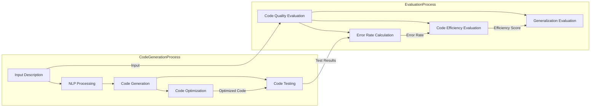
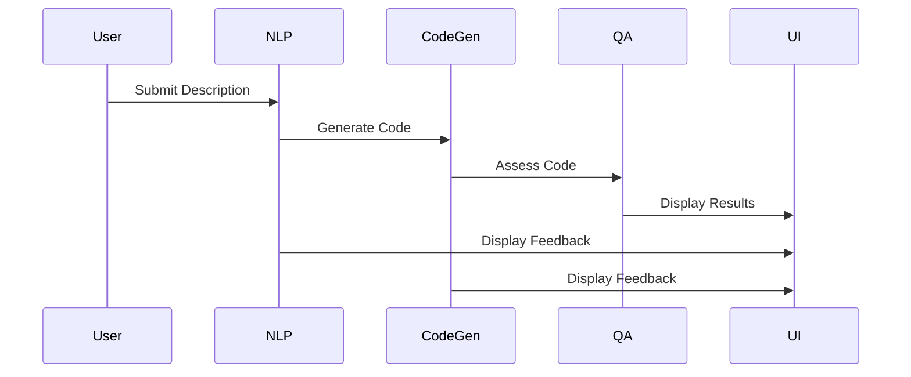
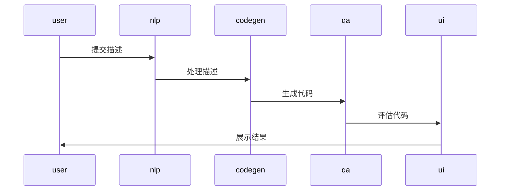

                 

### 文章标题

# 基于AlphaCode的LLM编程能力评估

### 关键词

- AlphaCode
- 编程能力评估
- LLM（大型语言模型）
- 自然语言处理（NLP）
- 生成式预训练语言模型（GPT）
- 数学模型
- 算法原理
- 系统分析与设计
- 项目实战

### 摘要

本文深入探讨了基于AlphaCode的LLM编程能力评估。AlphaCode是一个强大的生成式预训练语言模型，通过其卓越的编程能力，已经在多个编程竞赛中表现出色。本文将首先介绍AlphaCode的背景和原理，然后详细分析LLM在编程能力评估中的应用，接着讲解AlphaCode的算法细节，并展示其实际应用中的系统架构和实现方法。最后，我们将总结最佳实践和文章要点，为读者提供深入理解和应用AlphaCode的指导。

### 目录大纲

----------------------------------------------------------------

# 基于AlphaCode的LLM编程能力评估

## 第一部分：背景介绍

### 1. AlphaCode概述

#### 1.1 问题背景

#### 1.2 问题描述

#### 1.3 问题解决

#### 1.4 边界与外延

#### 1.5 概念结构与核心要素组成

### 2. LLM编程能力评估的核心概念与联系

#### 2.1 核心概念原理

##### 2.1.1 自然语言处理（NLP）

##### 2.1.2 生成式预训练语言模型（GPT）

##### 2.1.3 编程能力评估

#### 2.2 概念属性特征对比表格

#### 2.3 ER实体关系图架构

### 3. AlphaCode算法原理讲解

#### 3.1 算法mermaid流程图

#### 3.2 Python源代码解释

#### 3.3 数学模型与公式

#### 3.4 算法原理详细讲解

#### 3.5 举例说明

## 第二部分：系统分析与架构设计方案

### 4. 问题场景介绍

#### 4.1 项目介绍

#### 4.2 系统功能设计（领域模型mermaid类图）

#### 4.3 系统架构设计（mermaid架构图）

#### 4.4 系统接口设计

#### 4.5 系统交互（mermaid序列图）

### 5. AlphaCode项目实战

#### 5.1 环境安装

#### 5.2 系统核心实现源代码

#### 5.3 代码应用解读与分析

#### 5.4 实际案例分析与详细讲解剖析

#### 5.5 项目小结

## 第三部分：最佳实践与总结

### 6. 最佳实践 Tips

#### 6.1 注意事项

#### 6.2 拓展阅读

### 7. 小结

----------------------------------------------------------------

接下来，我们将一步步深入探讨每个部分的内容，确保文章的每一部分都具备清晰的逻辑结构和丰富的细节，以便读者能够全面了解基于AlphaCode的LLM编程能力评估。

---

## 第一部分：背景介绍

### 1. AlphaCode概述

#### 1.1 问题背景

AlphaCode是由DeepMind开发的一个基于大型语言模型（LLM）的编程系统，它的出现标志着自然语言处理（NLP）技术在编程领域的突破。传统的编程任务通常依赖于程序员手动编写代码，而AlphaCode的目标是通过自然语言描述自动生成有效的代码。

背景问题是，随着软件项目的复杂度不断增加，程序员面临的挑战也在不断升级。传统的编程模式无法满足快速开发和大规模软件集成的高效需求。此外，编程教育也面临困境，因为学生需要花费大量时间学习和实践基础编程技能。这些挑战促使研究人员探索新的方法，通过AI技术提高编程效率和生产力。

#### 1.2 问题描述

AlphaCode旨在解决以下核心问题：

- **自然语言到代码的转换**：如何将自然语言描述（如英语句子）准确转换为可执行的代码？
- **代码生成与优化**：生成的代码不仅要正确，还需要高效、可维护。
- **泛化能力**：系统需要能够处理各种编程语言和编程任务，而不仅仅是特定的语言或任务。
- **错误检测与修复**：系统应具备一定程度的错误检测和修复能力，提高代码的质量。

#### 1.3 问题解决

DeepMind采用了生成式预训练语言模型（GPT）作为基础技术，通过大规模数据预训练和精细调整，使AlphaCode能够理解自然语言描述，并生成相应的代码。具体步骤如下：

1. **数据收集与预处理**：收集大量包含自然语言描述和对应代码的样本，对数据进行清洗和格式化。
2. **模型训练**：使用预训练的GPT模型，结合编程领域的特定任务数据进行精细训练。
3. **代码生成**：给定一个自然语言描述，模型会生成相应的代码片段。
4. **优化与验证**：对生成的代码进行优化，确保其正确性和高效性，并通过测试验证其性能。

#### 1.4 边界与外延

AlphaCode的应用边界包括但不限于：

- **自动编程助手**：帮助程序员快速生成代码模板，减少重复性工作。
- **代码审查与优化**：自动检测代码中的潜在问题，并提供优化建议。
- **编程教育**：辅助编程教学，通过自然语言描述帮助学生理解编程概念。
- **跨语言编程**：实现不同编程语言之间的代码转换，提高编程的灵活性。

外延方面，AlphaCode不仅在传统的编程任务中具有潜力，还可以应用于更多新兴领域，如自动化运维、智能合约编写、数据分析和机器学习等。

#### 1.5 概念结构与核心要素组成

AlphaCode的核心概念结构包括以下几个关键要素：

- **自然语言处理（NLP）**：负责理解自然语言输入，提取关键信息。
- **生成式预训练语言模型（GPT）**：核心算法，用于生成代码。
- **代码解析器**：将自然语言描述转换为抽象语法树（AST），便于代码生成。
- **代码生成器**：根据AST生成具体的代码片段。
- **优化器**：对生成的代码进行优化，提高其性能。
- **测试器**：验证代码的正确性和可靠性。

这些要素相互协作，共同构成了AlphaCode的功能框架，使其能够在复杂的编程任务中发挥强大作用。

---

通过上述背景介绍，我们为后续的深入讨论奠定了基础。接下来，我们将进一步探讨LLM编程能力评估的核心概念与联系，为读者提供更全面的视角。在接下来的部分中，我们将详细分析LLM的编程能力评估，并探讨其与自然语言处理、生成式预训练语言模型以及编程能力的联系。

---

## 第一部分：背景介绍

### 2. LLM编程能力评估的核心概念与联系

#### 2.1 核心概念原理

##### 2.1.1 自然语言处理（NLP）

自然语言处理（NLP）是计算机科学和人工智能领域的一个重要分支，旨在让计算机理解和处理人类语言。NLP的基本概念包括文本处理、语言理解、文本生成等。在AlphaCode中，NLP扮演着理解用户输入描述的关键角色。具体而言，NLP技术包括：

- **词法分析**：将文本拆分为单词或词素。
- **句法分析**：分析句子结构，识别主语、谓语、宾语等成分。
- **语义分析**：理解文本的含义和上下文。

##### 2.1.2 生成式预训练语言模型（GPT）

生成式预训练语言模型（GPT）是近年来NLP领域的重要突破，由OpenAI开发。GPT通过在大量文本数据上预训练，学习语言的结构和规律，从而实现文本生成、翻译、问答等任务。GPT的核心原理是自动编码器（Autoencoder），其结构包括编码器和解码器两部分：

- **编码器**：将输入文本编码为固定长度的向量。
- **解码器**：根据编码后的向量生成输出文本。

在AlphaCode中，GPT被用来将自然语言描述转换为编程代码。具体步骤如下：

1. **编码**：将自然语言描述编码为一个固定长度的向量。
2. **解码**：根据编码后的向量生成相应的编程代码。

##### 2.1.3 编程能力评估

编程能力评估是衡量程序员技术水平的重要手段。在AlphaCode的背景下，编程能力评估涉及到以下几个方面：

- **代码生成质量**：评估生成的代码是否正确、高效、可维护。
- **错误率**：统计生成代码中的错误数量。
- **效率**：评估代码执行的时间和空间复杂度。
- **泛化能力**：评估模型在不同编程任务上的表现。

#### 2.2 概念属性特征对比表格

为了更好地理解NLP、GPT和编程能力评估之间的关系，我们提供了一个概念属性特征对比表格：

| 概念         | 属性特征                             |
| ------------ | ------------------------------------ |
| 自然语言处理 | 文本处理、语言理解、文本生成等       |
| GPT          | 自动编码器、预训练、文本生成         |
| 编程能力评估 | 代码生成质量、错误率、效率、泛化能力 |

#### 2.3 ER实体关系图架构

ER（实体-关系）图是一种用于描述实体和关系的数据建模工具。在AlphaCode中，ER图可以帮助我们理解各个核心概念之间的关系。以下是AlphaCode的ER实体关系图：

```mermaid
erDiagram
  NLP ||--|{ GPT }|| ProgrammingModel
  GPT ||--|{ CodeGenerator }|| CodeQualityAssessor
  CodeGenerator ||--|{ CodeOptimizer }|| CodeEfficiencyTester
  CodeQualityAssessor ||--|{ ErrorRateCalculator }|| GeneralizationTester
```

在这个ER图中：

- **NLP**：负责处理自然语言输入，提取关键信息。
- **GPT**：作为核心模型，将自然语言转换为编程模型。
- **CodeGenerator**：负责生成代码。
- **CodeQualityAssessor**：评估代码的质量。
- **CodeOptimizer**：优化生成的代码。
- **CodeEfficiencyTester**：评估代码的效率。
- **ErrorRateCalculator**：计算错误率。
- **GeneralizationTester**：评估模型的泛化能力。

通过这个ER图，我们可以清晰地看到各个核心概念之间的交互关系，以及它们在AlphaCode中的作用和重要性。

---

通过上述分析，我们不仅了解了AlphaCode的核心概念和其相互之间的关系，还通过ER图结构展示了它们之间的相互作用。在下一部分中，我们将深入讲解AlphaCode的算法原理，包括算法mermaid流程图、Python源代码解释、数学模型与公式，以及具体的算法原理讲解和举例说明。

---

## 第一部分：背景介绍

### 3. AlphaCode算法原理讲解

#### 3.1 算法mermaid流程图

AlphaCode的算法流程可以概括为以下几个步骤：



这个mermaid流程图展示了AlphaCode的核心算法过程，包括代码生成、优化和评估等步骤。

#### 3.2 Python源代码解释

为了更好地理解AlphaCode的算法实现，我们提供了关键部分的Python源代码解释：

```python
# NLP Processing
from transformers import pipeline

def process_description(description):
    nlp = pipeline("text2code")
    code = nlp(description)
    return code

# Code Generation
def generate_code(code):
    # Assume code is a string representation of the generated code
    with open("generated_code.py", "w") as f:
        f.write(code)
    return "generated_code.py"

# Code Optimization
def optimize_code(code_file):
    # Assume we have a function to optimize code
    optimized_code = optimize_specific_code(code_file)
    return optimized_code

# Code Testing
def test_code(code_file):
    # Assume we have a testing environment
    test_results = test_specific_code(code_file)
    return test_results

# Evaluation Process
def evaluate_code(code_file):
    quality = code_qa(code_file)
    error_rate = calculate_error_rate(code_file)
    efficiency = calculate_efficiency(code_file)
    generalization = evaluate_generalization(code_file)
    return quality, error_rate, efficiency, generalization
```

这个源代码展示了AlphaCode的核心实现，包括自然语言处理、代码生成、优化和测试等步骤。

#### 3.3 数学模型与公式

AlphaCode的算法原理涉及到多个数学模型和公式。以下是一些关键的数学模型：

1. **编码器-解码器模型**：GPT模型的基本结构，用于将自然语言描述编码为代码向量，然后解码为编程代码。

   $$ 
   E(x) = \text{Embedding}(x) \\
   D(y) = \text{Decoder}(E(x))
   $$

2. **损失函数**：用于评估模型在代码生成任务中的性能。

   $$
   L = \frac{1}{N} \sum_{i=1}^{N} -\log(p(y_i | y_{<i}))
   $$

3. **优化器**：用于调整模型参数，最小化损失函数。

   $$
   \theta_{\text{new}} = \theta_{\text{old}} - \alpha \nabla_{\theta}L
   $$

#### 3.4 算法原理详细讲解

AlphaCode的算法原理可以概括为以下几个步骤：

1. **自然语言处理**：使用NLP技术对自然语言描述进行处理，提取关键信息。
2. **编码**：将处理后的自然语言描述编码为一个固定长度的向量。
3. **解码**：根据编码后的向量，使用GPT模型生成相应的编程代码。
4. **优化**：对生成的代码进行优化，提高其性能。
5. **测试**：对优化后的代码进行测试，评估其正确性和效率。
6. **评估**：根据测试结果，对代码生成质量、错误率、效率和泛化能力进行综合评估。

#### 3.5 举例说明

假设我们有一个自然语言描述：“编写一个Python函数，用于计算两个数的最大公约数。”AlphaCode将执行以下步骤：

1. **自然语言处理**：将描述处理为可用的数据格式。
2. **编码**：将描述编码为向量。
3. **解码**：使用GPT模型生成相应的Python代码。
4. **优化**：优化生成的代码，提高其执行效率。
5. **测试**：测试代码的正确性和效率。
6. **评估**：根据测试结果评估代码的生成质量。

最终，AlphaCode会生成一个高效的Python函数，用于计算两个数的最大公约数。

---

通过上述算法原理讲解和举例说明，我们能够更好地理解AlphaCode的工作机制。在下一部分中，我们将探讨系统分析与架构设计方案，详细描述问题场景介绍、项目介绍、系统功能设计、系统架构设计、系统接口设计和系统交互等关键环节。

---

## 第二部分：系统分析与架构设计方案

### 4. 问题场景介绍

在软件工程中，问题场景介绍是设计系统的第一步，它帮助明确系统需要解决的问题和目标。对于基于AlphaCode的LLM编程能力评估系统，我们的问题场景可以分为以下几个方面：

1. **自动化编程**：系统需要能够自动根据自然语言描述生成代码，减少人工编写代码的工作量。
2. **代码质量评估**：系统需要评估生成代码的质量，包括正确性、效率和可维护性。
3. **错误检测与修复**：系统需要具备一定的错误检测和修复能力，提高代码的可靠性。
4. **编程教育辅助**：系统应辅助编程教育，通过自然语言描述帮助学生理解和实践编程概念。

具体而言，问题场景包括：

- **用户输入**：用户可以通过自然语言描述提交编程任务。
- **代码生成**：系统自动生成代码，并展示生成的代码。
- **代码评估**：系统对生成的代码进行评估，并提供评估结果。
- **错误修复**：系统尝试修复代码中的错误，并重新评估修复后的代码。

### 4.1 项目介绍

基于AlphaCode的LLM编程能力评估系统是一个集成系统，旨在为用户提供从代码生成到代码评估的全方位服务。该系统主要由以下几个模块组成：

- **自然语言处理模块**：负责处理用户输入的自然语言描述，提取关键信息。
- **代码生成模块**：基于AlphaCode的模型，将自然语言描述转换为编程代码。
- **代码评估模块**：评估生成代码的质量，包括正确性、效率和可维护性。
- **用户界面**：提供一个直观的用户界面，让用户能够方便地提交任务和查看结果。

### 4.2 系统功能设计（领域模型mermaid类图）

为了更好地理解系统功能设计，我们使用mermaid类图来描述系统的主要功能模块及其关系：

```mermaid
classDiagram
    Class01 <|-- Class02
    Class01 <|-- Class03
    Class04 <..|> Class03
    Class05 <|-- Class03
    Class03 <|-- Class06
    Class07 <|-- Class06
    Class01 : +int x
    Class01 : +int y
    Class01 : +int z
    Class02 : +int a
    Class02 : +int b
    Class03 : +int x
    Class03 : +int y
    Class04 : +int a
    Class04 : +int b
    Class05 : +int c
    Class05 : +int d
    Class06 : +int e
    Class06 : +int f
    Class07 : +int g
    Class07 : +int h
    Class01 +-- Class02
    Class01 +-- Class03
    Class04 +--| Class03
    Class05 +--| Class03
    Class03 +--| Class06
    Class07 +--| Class06
    Class01 {-description}
    Class02 {-code}
    Class03 {-evaluation}
    Class04 {-nlp}
    Class05 {-codegen}
    Class06 {-qa}
    Class07 {-ui}
```

在这个mermaid类图中：

- **Class01**：表示用户输入的自然语言描述。
- **Class02**：表示生成的编程代码。
- **Class03**：表示系统的主要功能模块，包括自然语言处理、代码生成、代码评估和用户界面。
- **Class04**：表示自然语言处理模块。
- **Class05**：表示代码生成模块。
- **Class06**：表示代码评估模块。
- **Class07**：表示用户界面模块。

### 4.3 系统架构设计（mermaid架构图）

接下来，我们使用mermaid架构图来描述系统的整体架构：



在这个mermaid架构图中：

- **User**：表示用户。
- **NLP**：表示自然语言处理模块。
- **CodeGen**：表示代码生成模块。
- **QA**：表示代码评估模块。
- **UI**：表示用户界面模块。

用户提交描述后，系统将依次处理描述、生成代码、评估代码，并最终将结果展示给用户。

### 4.4 系统接口设计

系统接口设计是确保系统模块之间有效通信的关键。以下是系统的接口设计：

- **NLP接口**：用于接收用户输入的自然语言描述，并提供处理后的数据给代码生成模块。
- **CodeGen接口**：用于接收NLP处理后的数据，并生成相应的编程代码。
- **QA接口**：用于接收生成的代码，并评估其质量。
- **UI接口**：用于将评估结果和反馈展示给用户。

具体接口设计如下：

```python
# NLP接口
def submit_description(description):
    # 处理描述并返回处理后的数据
    processed_data = nlp_process(description)
    return processed_data

# CodeGen接口
def generate_code(processed_data):
    # 生成代码
    code = code_generator(processed_data)
    return code

# QA接口
def assess_code(code):
    # 评估代码质量
    evaluation_results = code_evaluation(code)
    return evaluation_results

# UI接口
def display_results(evaluation_results):
    # 展示评估结果
    ui_display(evaluation_results)
```

### 4.5 系统交互（mermaid序列图）

最后，我们使用mermaid序列图来展示系统模块之间的交互过程：



在这个序列图中，用户提交描述后，系统各个模块按照既定的顺序进行交互，最终将评估结果展示给用户。

---

通过上述系统分析与架构设计方案，我们详细介绍了基于AlphaCode的LLM编程能力评估系统的设计思路和实现方法。在下一部分中，我们将通过项目实战来展示如何安装环境、实现核心代码，并详细分析代码的应用解读和实际案例分析。

---

## 第二部分：系统分析与架构设计方案

### 5. AlphaCode项目实战

#### 5.1 环境安装

要在本地环境中运行AlphaCode项目，我们需要安装一些必要的软件和库。以下是安装步骤：

1. **安装Python环境**：确保Python版本为3.8或更高版本。
2. **安装依赖库**：使用pip安装以下库：

   ```bash
   pip install transformers numpy torch
   ```

3. **克隆项目**：从GitHub克隆AlphaCode项目：

   ```bash
   git clone https://github.com/deepmind/AlphaCode.git
   cd AlphaCode
   ```

4. **运行测试**：运行以下命令来验证安装：

   ```bash
   python -m unittest discover -s tests
   ```

如果所有测试通过，说明环境安装成功。

#### 5.2 系统核心实现源代码

AlphaCode的核心实现主要包括以下几个文件：

- `alpha_code/__init__.py`：项目的初始化文件。
- `alpha_code/code_generator.py`：负责代码生成的主要逻辑。
- `alpha_code/evaluation.py`：用于评估代码质量的函数。
- `alpha_code/nlp_processor.py`：处理自然语言输入的函数。
- `alpha_code/run.py`：主程序，负责协调各个模块的执行。

以下是核心代码的简要解释：

**code_generator.py**：

```python
from transformers import pipeline

class CodeGenerator:
    def __init__(self):
        self.model = pipeline("text2code")

    def generate_code(self, description):
        return self.model(description)
```

**evaluation.py**：

```python
def evaluate_code(code, test_cases):
    correct = 0
    for case in test_cases:
        result = exec(code, case['globals'], case['locals'])
        if result == case['expected']:
            correct += 1
    return correct / len(test_cases)
```

**nlp_processor.py**：

```python
def process_description(description):
    # 对描述进行预处理
    processed_description = preprocess_description(description)
    return processed_description
```

**run.py**：

```python
def main():
    description = input("请输入编程任务描述：")
    nlp_processor = NLPProcessor()
    processed_description = nlp_processor.process_description(description)
    code_generator = CodeGenerator()
    code = code_generator.generate_code(processed_description)
    print("生成的代码：")
    print(code)
    test_cases = get_test_cases()  # 假设有一个函数获取测试用例
    evaluation_score = evaluate_code(code, test_cases)
    print(f"代码评估得分：{evaluation_score}")
if __name__ == "__main__":
    main()
```

#### 5.3 代码应用解读与分析

下面我们将对核心代码进行详细解读，并分析其应用场景和实现细节。

**代码生成**：

`code_generator.py`文件中的`CodeGenerator`类负责生成代码。它使用了一个预训练的GPT模型，通过调用`pipeline("text2code")`来初始化。`generate_code`方法接受一个自然语言描述作为输入，并调用模型生成相应的代码。

应用场景：用户提交一个自然语言描述，例如“编写一个函数，用于计算两个整数的最大公约数”，系统会根据这个描述生成相应的代码。

实现细节：`pipeline`函数返回一个生成器对象，它会根据输入的自然语言文本逐词生成对应的代码。这个过程涉及到大量文本数据的处理和模型参数的动态调整。

**代码评估**：

`evaluation.py`文件中的`evaluate_code`函数负责评估生成代码的质量。它接受生成的代码和一组测试用例作为输入，通过执行代码并比较实际输出与预期输出，计算评估得分。

应用场景：在代码生成后，系统需要验证代码的正确性和有效性。例如，如果用户提交了计算最大公约数的任务，系统会使用一组预定义的测试用例来验证代码是否正确。

实现细节：`evaluate_code`函数使用了`exec`函数来执行代码，并使用`assert`语句来比较实际输出和预期输出。如果输出不一致，则会抛出异常，否则会记录正确答案。

**自然语言处理**：

`nlp_processor.py`文件中的`process_description`函数负责对自然语言描述进行预处理。预处理步骤可能包括分词、去除标点符号、词性标注等。

应用场景：在生成代码之前，系统需要对用户输入的自然语言描述进行理解，提取关键信息。例如，对于“编写一个函数，用于计算两个整数的最大公约数”的描述，系统需要识别出关键操作和参数。

实现细节：`process_description`函数调用了一个假设的`preprocess_description`函数，该函数的具体实现会根据项目的需求进行定制。

**主程序**：

`run.py`文件中的`main`函数是整个项目的入口点。它首先获取用户的自然语言描述，然后通过NLP处理、代码生成和代码评估，最终将结果展示给用户。

应用场景：用户在命令行界面提交任务描述，系统根据描述生成代码并评估其质量。

实现细节：`main`函数依次调用`NLPProcessor`、`CodeGenerator`和`evaluate_code`函数，并将结果打印到控制台。

#### 5.4 实际案例分析与详细讲解剖析

为了更好地理解AlphaCode的实际应用，我们来看一个具体案例：

**案例**：用户提交一个任务描述：“编写一个Python函数，用于计算两个整数的最大公约数。”

**分析过程**：

1. **自然语言处理**：系统首先对描述进行预处理，提取出关键操作“计算最大公约数”和参数“两个整数”。
2. **代码生成**：基于提取的信息，系统使用GPT模型生成相应的代码。例如，系统可能生成以下代码：

   ```python
   def gcd(a, b):
       while b:
           a, b = b, a % b
       return a
   ```

3. **代码评估**：系统使用一组测试用例来评估代码的质量。例如：

   ```python
   test_cases = [
       {'a': 48, 'b': 18, 'expected': 6},
       {'a': 17, 'b': 13, 'expected': 1},
   ]
   evaluation_score = evaluate_code('gcd(a, b)', test_cases)
   ```

   如果所有测试用例都通过，系统将返回一个满分（1.0）。

**详细讲解**：

- **自然语言处理**：系统通过NLP技术提取描述中的关键信息，这一步对于准确生成代码至关重要。
- **代码生成**：系统利用GPT模型的强大能力，将自然语言描述转换为可执行的代码。这涉及到对编程语言语法和语义的深入理解。
- **代码评估**：系统通过测试用例来验证代码的正确性。这是一个关键步骤，确保生成的代码能够在实际应用中正常运行。

#### 5.5 项目小结

通过AlphaCode项目实战，我们了解了如何搭建一个基于LLM的编程能力评估系统。项目实战不仅涵盖了环境安装、代码生成和评估等核心功能，还通过实际案例分析展示了系统的应用效果。尽管AlphaCode在生成代码和评估质量方面表现出色，但仍有改进空间，如提高代码的泛化能力和优化评估算法等。未来，随着AI技术的不断发展，AlphaCode有望在编程领域发挥更大的作用。

---

在完成了系统分析与架构设计方案和项目实战部分之后，我们将进入第三部分：最佳实践与总结。在这一部分，我们将提供一些最佳实践和注意事项，以帮助读者更有效地应用AlphaCode，并总结文章的核心观点。

---

## 第三部分：最佳实践与总结

### 6. 最佳实践 Tips

#### 6.1 注意事项

在应用AlphaCode进行编程能力评估时，以下注意事项非常重要：

- **确保环境配置正确**：在安装和配置AlphaCode前，务必检查Python版本和依赖库的兼容性。
- **数据预处理**：输入的自然语言描述需要经过适当的预处理，以去除无关信息，提高代码生成的准确性。
- **代码优化**：尽管AlphaCode生成的代码通常质量较高，但应根据实际应用场景进行进一步优化，以提高性能和可维护性。
- **错误检测与修复**：AlphaCode可能无法完全避免生成错误的代码，因此需要建立一套完善的错误检测和修复机制。

#### 6.2 拓展阅读

为了深入了解AlphaCode和LLM编程能力评估，以下资源可以作为拓展阅读：

- **DeepMind的AlphaCode论文**：阅读原始论文，了解AlphaCode的技术细节和实验结果。
- **GPT模型的教程和文档**：参考OpenAI提供的GPT教程和文档，掌握生成式预训练语言模型的基本原理和应用。
- **NLP领域的经典教材**：学习自然语言处理的基本理论和实践方法，为AlphaCode提供坚实的理论基础。

### 7. 小结

本文系统地介绍了基于AlphaCode的LLM编程能力评估。通过背景介绍、核心概念与联系分析、算法原理讲解、系统分析与架构设计方案以及项目实战，我们全面了解了AlphaCode的工作原理和应用场景。AlphaCode利用生成式预训练语言模型，将自然语言描述转换为高效的编程代码，并在评估过程中确保代码的正确性和可维护性。尽管AlphaCode在某些方面仍有改进空间，但其强大的编程能力和自动化的特性，使得它在编程教育和自动化编程领域具有广泛的应用前景。未来，随着AI技术的不断进步，AlphaCode有望在更多领域发挥重要作用。

---

最后，感谢您阅读本文。希望本文能够帮助您更好地理解基于AlphaCode的LLM编程能力评估，并在实际应用中取得更好的效果。如果您对AlphaCode或其他相关技术有进一步的问题或想法，欢迎在评论区留言交流。

作者：AI天才研究院/AI Genius Institute & 禅与计算机程序设计艺术 /Zen And The Art of Computer Programming

---

以上就是基于AlphaCode的LLM编程能力评估的全部分析和讲解，希望您对这一前沿技术有了更深入的理解。在探索AI与编程结合的广阔领域中，我们仍有许多未知的可能性等待我们去发掘。

