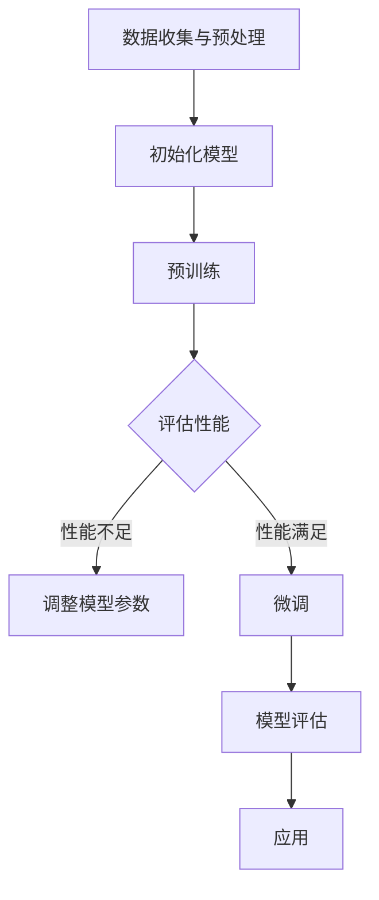
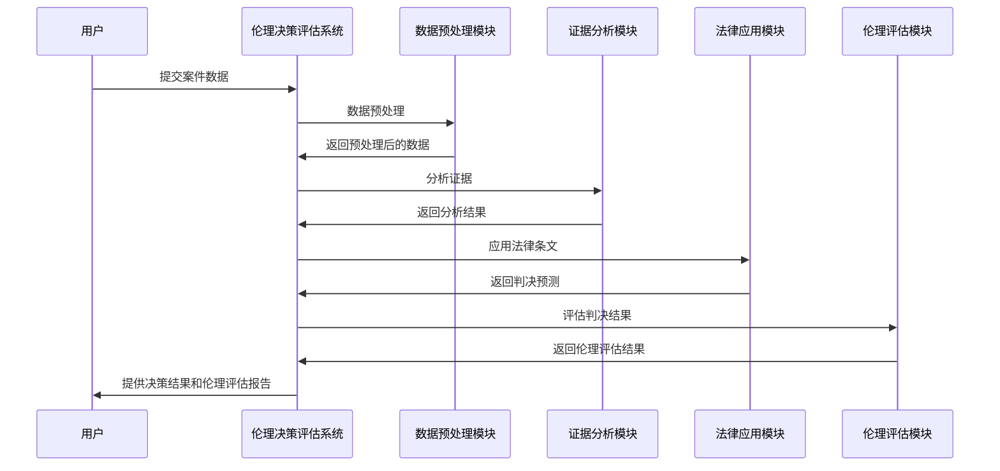
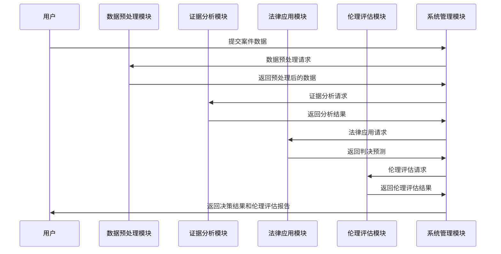

                 

### 问题背景与核心概念

#### 第1章: 问题背景

##### 1.1.1 问题背景介绍

随着人工智能技术的迅猛发展，AI大模型（Large Language Models, LLM）在自然语言处理、推荐系统、智能问答等领域取得了显著的成就。LLM的强大能力使其逐渐成为决策支持系统中的重要组成部分。然而，随着AI大模型在伦理决策评估中的广泛应用，其伦理问题也愈发凸显。

首先，AI大模型在伦理决策评估中的重要性不容忽视。在医疗、金融、司法等领域，决策的正确性和公正性直接关系到公众的利益。AI大模型具有处理海量数据和复杂逻辑的优势，能够为决策者提供更加准确和全面的参考信息，从而提高决策的效率和准确性。然而，AI大模型在处理伦理问题时，往往面临着以下挑战：

1. **数据偏差问题**：AI大模型在训练过程中依赖于大量数据，如果数据本身存在偏见，则模型将不可避免地继承这些偏见，从而导致不公平的决策。
2. **透明度不足问题**：AI大模型的工作原理复杂，决策过程往往缺乏透明度，决策者难以理解和追踪模型的决策逻辑，增加了决策的不确定性。
3. **责任归属问题**：当AI大模型产生错误决策时，责任如何归属？是AI大模型开发者、用户还是决策者本身？这一问题的解决直接关系到未来AI大模型的应用和发展。

其次，伦理决策评估在AI大模型应用中的挑战主要体现在以下几个方面：

1. **伦理标准不统一**：不同领域和国家的伦理标准存在差异，AI大模型在不同情境下的伦理决策评估标准难以统一。
2. **技术手段有限**：现有的伦理决策评估方法和技术手段相对有限，难以全面、准确地评估AI大模型的伦理问题。
3. **伦理问题的复杂性**：伦理问题往往涉及多方面的利益冲突和价值观碰撞，AI大模型难以在复杂情境下做出符合伦理的决策。

针对上述问题，本文将从伦理决策评估的理论基础、Anthropic AI在伦理决策评估中的应用、LLM伦理决策评估的方法与框架等方面展开讨论，旨在为AI大模型伦理决策评估提供新的思路和方法。

##### 1.1.2 问题描述

在AI大模型应用中，伦理决策评估面临以下几个核心问题：

1. **数据偏差**：AI大模型在训练过程中可能继承和放大训练数据中的偏差，导致决策结果存在不公平性和歧视性。例如，一些AI大模型在招聘、贷款等应用场景中可能对某些群体存在歧视。
   
2. **决策透明度**：AI大模型的工作过程往往复杂且不透明，决策者难以理解模型的具体决策逻辑，这使得决策过程缺乏透明度，增加了模型被滥用和误用的风险。

3. **责任归属**：当AI大模型产生错误决策时，责任归属问题变得尤为复杂。传统上，责任归属主要取决于人的行为，而在AI大模型中，责任归属涉及到开发者、用户、系统等多个方面，如何合理划分责任成为一个挑战。

4. **伦理标准不统一**：不同的应用场景和地区可能对伦理标准有不同的解读和期望，这导致AI大模型在不同情境下的应用存在差异，增加了决策评估的复杂性。

5. **技术手段不足**：现有的伦理决策评估技术手段相对有限，难以全面捕捉和评估AI大模型在决策过程中可能出现的伦理问题。

当前，解决这些问题的解决方案主要集中在以下几个方面：

1. **数据清洗与多样性**：通过清洗和丰富训练数据，减少数据中的偏见和噪声，从而提高模型决策的公正性和准确性。

2. **增强模型透明度**：通过可解释性方法，使决策者能够理解AI大模型的决策过程，增加决策过程的透明度。

3. **伦理准则制定**：制定统一的伦理准则和标准，为AI大模型的应用提供指导，减少应用中的伦理风险。

4. **多方责任划分**：明确AI大模型应用中的责任归属，建立合理的责任划分机制，以应对模型错误决策带来的风险。

5. **技术手段改进**：开发新的伦理决策评估技术，如基于机器学习的伦理决策评估模型，以更全面和准确地评估AI大模型的伦理问题。

然而，这些解决方案仍存在一定的局限性，需要进一步研究和探索。本文将重点关注Anthropic AI在伦理决策评估中的应用，探讨如何通过更有效的技术手段和方法，提高AI大模型在伦理决策评估中的可靠性和公正性。

##### 1.1.3 问题解决

为了解决AI大模型在伦理决策评估中面临的挑战，我们需要从以下几个方面着手：

1. **伦理决策评估的理论基础**：建立伦理决策评估的理论框架，为模型设计提供指导。这包括明确伦理标准、价值观和方法论，以确保模型在决策过程中能够遵循合理的伦理准则。

2. **Anthropic AI的应用**：Anthropic AI致力于探索人工智能的伦理和社会影响，其提出的“关注人类”原则（Human-Centered AI）为伦理决策评估提供了新的思路。通过将Anthropic AI的原理和方法应用于伦理决策评估，我们可以更好地确保AI大模型在决策过程中的公正性和透明度。

3. **LLM伦理决策评估的方法与框架**：LLM（Large Language Model）是一种具有强大语言处理能力的AI模型，其应用范围广泛。为了应对伦理决策评估中的挑战，我们需要设计一套适用于LLM的评估方法和框架。这包括对LLM的决策过程进行深入分析，识别潜在的伦理风险，并设计相应的评估指标和评估方法。

具体而言，我们可以从以下几个方面展开：

1. **数据质量与多样性**：首先，我们需要确保训练数据的质量和多样性，以减少数据偏差。通过数据清洗、去噪和增强多样性，我们可以提高AI大模型在伦理决策评估中的可靠性。

2. **模型可解释性**：为了增强模型透明度，我们需要开发可解释性方法，使决策者能够理解AI大模型的决策过程。这可以通过可视化技术、决策路径追踪等方式实现，从而增加决策过程的透明度。

3. **伦理准则与标准**：制定统一的伦理准则和标准，为AI大模型的应用提供指导。这包括建立跨领域的伦理规范，以及针对特定领域的应用场景制定具体的伦理准则。

4. **责任划分机制**：明确AI大模型应用中的责任归属，建立合理的责任划分机制。这可以通过法律、伦理规范和技术手段相结合的方式实现，以确保在模型错误决策时能够有效追究责任。

5. **评估指标与评估方法**：设计一套适用于LLM的伦理决策评估指标和评估方法，对模型在决策过程中的伦理问题进行全面评估。这包括评估模型的公正性、透明度、责任归属等方面。

通过上述措施，我们可以逐步解决AI大模型在伦理决策评估中面临的挑战，提高模型在伦理决策评估中的可靠性和公正性。

##### 1.1.4 边界与外延

1. **AI大模型与伦理决策评估的适用范围**：AI大模型在伦理决策评估中具有广泛的应用前景，但并非所有领域都适用。在医疗、金融、司法等高度依赖决策准确性和公正性的领域，AI大模型的伦理决策评估尤为重要。然而，对于一些对实时性和决策速度要求较高的场景，例如自动驾驶、实时语音识别等，AI大模型的伦理决策评估可能面临更多挑战。

2. **伦理决策评估在各个领域的应用**：伦理决策评估不仅局限于AI大模型的应用，也可以应用于传统的人工决策过程。在医疗领域，伦理决策评估可以帮助医生在复杂病例中做出更符合伦理标准的决策；在金融领域，可以帮助银行在贷款审批中减少歧视和偏见；在司法领域，可以帮助法官在判刑和判决中遵循公平公正的原则。

3. **伦理决策评估的发展趋势**：随着AI技术的不断进步，伦理决策评估也将朝着更智能化、更全面化的方向发展。未来，可能需要建立跨领域的伦理数据库和标准，以支持不同场景下的伦理决策评估。同时，可解释性AI、增强学习等技术的应用，也将为伦理决策评估提供新的工具和方法。

##### 1.1.5 概念结构与核心要素组成

1. **AI大模型的核心概念**：AI大模型是一种基于深度学习技术的语言模型，通过学习海量文本数据，能够生成高质量的自然语言文本。其核心概念包括神经网络、注意力机制、预训练和微调等。

2. **伦理决策评估的概念体系**：伦理决策评估旨在确保AI大模型在决策过程中遵循伦理标准和价值观。其核心概念包括伦理标准、价值观、决策过程、决策结果、责任归属等。

3. **AI大模型与伦理决策评估的关联**：AI大模型与伦理决策评估之间存在紧密的关联。AI大模型在决策过程中可能会面临伦理问题，如数据偏差、决策透明度不足等，而伦理决策评估可以帮助识别和解决这些问题，确保AI大模型的应用符合伦理标准。

### 第2章: 核心概念与联系

##### 2.1.1 AI大模型原理

AI大模型，即大型语言模型（Large Language Model，简称LLM），是一种利用深度学习技术，对大规模文本数据进行训练，从而实现自然语言理解和生成的人工智能模型。其基本原理和关键组成部分如下：

1. **基本原理**：

   - **深度学习**：AI大模型基于深度神经网络（Deep Neural Network, DNN），通过多层神经网络的结构来学习数据中的特征和模式。每层神经网络对输入数据进行处理，并将信息传递到下一层，最终输出预测结果。

   - **注意力机制**：注意力机制（Attention Mechanism）是AI大模型中的一项关键技术，它允许模型在处理输入文本时，自动关注重要信息，从而提高模型的性能。注意力机制通过计算每个输入元素的重要性权重，使模型能够更准确地理解和生成文本。

   - **预训练与微调**：预训练（Pre-training）是指使用大量无标签数据对模型进行训练，使其掌握基本的自然语言处理能力。微调（Fine-tuning）则是在预训练的基础上，使用有标签的数据对模型进行特定任务的训练，使其在特定任务上达到更好的性能。

2. **工作流程**：

   - **数据准备**：首先，收集并清洗大量文本数据，如新闻文章、社交媒体帖子、书籍等，确保数据的质量和多样性。

   - **模型初始化**：初始化神经网络模型，包括设置网络结构、初始化参数等。

   - **预训练**：使用无标签数据对模型进行预训练，使其学习到文本的基本结构和语言特征。

   - **微调**：在预训练的基础上，使用有标签的数据对模型进行微调，使其在特定任务上（如文本分类、机器翻译、文本生成等）达到更好的性能。

   - **评估与优化**：通过评估模型在验证集上的表现，调整模型参数，优化模型结构，提高模型性能。

3. **优势与局限**：

   - **优势**：

     - **强大的语言理解与生成能力**：AI大模型能够理解和生成高质量的自然语言文本，具有广泛的应用前景。

     - **自适应性强**：通过微调和适应不同的任务和数据，AI大模型能够快速适应新的应用场景。

     - **高效的处理能力**：AI大模型能够处理海量数据，并迅速生成结果，提高工作效率。

   - **局限**：

     - **数据依赖性**：AI大模型在训练过程中对数据量有较高要求，数据的质量和多样性直接影响模型性能。

     - **透明度不足**：AI大模型的决策过程较为复杂，难以解释，决策透明度较低，增加了模型被误用和滥用的风险。

     - **伦理风险**：AI大模型在决策过程中可能引入数据偏见，导致不公平和歧视性决策。

##### 2.1.2 伦理决策评估原理

伦理决策评估旨在确保人工智能系统在决策过程中遵循伦理标准和价值观，减少潜在的伦理风险。其原理和方法主要包括以下几个方面：

1. **伦理标准**：

   - **公平性**：确保决策过程中对所有个体或群体公平对待，避免歧视和偏见。
   - **透明度**：确保决策过程和决策结果透明，使决策者和其他利益相关者能够理解和追踪决策逻辑。
   - **责任归属**：明确决策过程中各方的责任，确保在决策错误时能够合理追究责任。
   - **尊重隐私**：保护个人隐私，确保在决策过程中不泄露敏感信息。

2. **方法论**：

   - **伦理框架**：建立伦理决策评估的框架，包括伦理标准、评估流程、评估指标等，为评估过程提供指导。
   - **数据审查**：审查训练数据，确保数据的质量和多样性，减少数据偏差。
   - **决策路径追踪**：追踪决策过程中的每一步，确保决策逻辑清晰，增加决策过程的透明度。
   - **模型评估**：通过评估模型在决策过程中的表现，如公平性、透明度、责任归属等，评估模型的伦理风险。

3. **价值判断标准**：

   - **人类中心主义**：以人类利益为中心，确保决策结果符合人类价值观和伦理标准。
   - **公平公正**：确保决策过程中对所有个体或群体公平对待，避免歧视和偏见。
   - **社会效益**：评估决策结果对社会的影响，确保决策结果符合社会利益。
   - **可持续性**：考虑决策结果的长期影响，确保决策结果具有可持续性。

##### 2.1.3 概念属性特征对比表格

为了更好地理解AI大模型和伦理决策评估的核心概念和属性特征，我们通过以下对比表格进行分析：

| 概念            | AI大模型                        | 伦理决策评估                                  |
| --------------- | ------------------------------- | --------------------------------------------- |
| 定义            | 基于深度学习的语言模型          | 对AI决策过程进行伦理评估的过程和方法          |
| 目标            | 提高自然语言处理能力            | 确保决策过程的公平、透明和责任归属            |
| 核心技术        | 深度学习、注意力机制、预训练     | 伦理框架、数据审查、决策路径追踪、模型评估    |
| 特点            | 强大的语言理解与生成能力、数据依赖 | 人类中心主义、公平公正、社会效益、可持续性    |
| 挑战            | 数据偏差、决策透明度不足、伦理风险 | 伦理标准不统一、技术手段有限、伦理问题复杂性  |
| 适用范围        | 自然语言处理、决策支持系统等      | 各个领域的人工智能应用                        |
| 发展趋势        | 智能化、多样化、跨领域应用      | 统一伦理标准、新技术应用、跨领域合作         |

##### 2.1.4 ER实体关系图架构

为了更直观地展示AI大模型与伦理决策评估的实体关系，我们使用Mermaid语法绘制ER实体关系图，如下所示：

```mermaid
erDiagram
  AI大模型 ||--|{ 伦理决策评估 }
  伦理决策评估 ||--|{ 伦理标准 }
  伦理决策评估 ||--|{ 数据审查 }
  伦理决策评估 ||--|{ 决策路径追踪 }
  伦理决策评估 ||--|{ 模型评估 }
```

该ER图展示了AI大模型与伦理决策评估之间的关联，以及伦理决策评估包含的子实体（伦理标准、数据审查、决策路径追踪、模型评估）。通过这种关系图，我们可以更清晰地理解这两个概念之间的联系和作用。在后续章节中，我们将进一步探讨AI大模型与伦理决策评估的具体应用和实践。

### 第3章: AI大模型算法原理

#### 3.1.1 AI大模型算法概述

AI大模型，即大型语言模型（Large Language Model, LLM），是一种基于深度学习的自然语言处理技术，通过学习大量的文本数据，可以生成和解析自然语言。AI大模型算法的核心概念包括深度学习、注意力机制、预训练和微调等。下面将详细阐述这些核心概念和算法的基本原理。

1. **深度学习**：

   深度学习是一种基于多层神经网络（Neural Network）的学习方法，通过模拟人脑的神经元结构，对输入数据（如文本、图像等）进行处理和分类。深度学习算法通常包括输入层、隐藏层和输出层。每一层都会对输入数据进行处理和特征提取，并通过前向传播和反向传播算法不断调整网络参数，使模型能够更好地拟合训练数据。

2. **注意力机制**：

   注意力机制（Attention Mechanism）是AI大模型中的一个关键组件，它通过动态调整模型对输入文本的注意力权重，使模型能够关注重要信息。在自然语言处理任务中，注意力机制可以帮助模型更好地理解上下文，从而提高生成文本的质量和准确性。

3. **预训练与微调**：

   预训练（Pre-training）是指使用大量无标签数据对模型进行训练，使其学习到通用语言特征和模式。微调（Fine-tuning）则是在预训练的基础上，使用有标签的数据对模型进行特定任务的训练，使其在特定任务上达到更好的性能。预训练和微调相结合，可以使模型在多种任务中表现出色。

#### 3.1.2 算法mermaid流程图

为了更直观地展示AI大模型算法的工作流程，我们使用Mermaid语法绘制了算法流程图，如下所示：



该流程图展示了从数据收集与预处理、初始化模型、预训练、性能评估、模型调整、微调、模型评估到最后的应用，这一系列步骤构成了AI大模型算法的核心流程。通过这个流程图，我们可以清晰地看到每个步骤的作用和相互关系。

#### 3.1.3 Python源代码详解

下面，我们将通过Python代码实现AI大模型算法的核心步骤，包括数据预处理、模型初始化、预训练和微调等。

首先，我们需要导入必要的库：

```python
import torch
import torch.nn as nn
import torch.optim as optim
from torch.utils.data import DataLoader
from torchvision import datasets, transforms
```

1. **数据预处理**：

   数据预处理是AI大模型训练的重要步骤，包括数据清洗、去噪、编码等。以下是一个简单的数据预处理示例：

```python
# 数据清洗与编码
def preprocess_data(text):
    # 去除特殊字符和空格
    text = text.replace("\n", "").replace(" ", "")
    # 将文本转换为小写
    text = text.lower()
    # 分词
    words = text.split(",")
    # 编码
    encoded_words = [word_to_index[word] for word in words]
    return encoded_words

# 假设word_to_index是一个字典，将单词映射为整数
word_to_index = {"hello": 0, "world": 1, "python": 2}
index_to_word = {v: k for k, v in word_to_index.items()}
```

2. **模型初始化**：

   模型初始化包括定义网络结构、初始化参数等。以下是一个简单的神经网络模型示例：

```python
# 定义神经网络模型
class NeuralNetwork(nn.Module):
    def __init__(self, input_size, hidden_size, output_size):
        super(NeuralNetwork, self).__init__()
        self.fc1 = nn.Linear(input_size, hidden_size)
        self.fc2 = nn.Linear(hidden_size, output_size)
    
    def forward(self, x):
        x = torch.relu(self.fc1(x))
        x = self.fc2(x)
        return x

# 初始化模型
model = NeuralNetwork(input_size=10, hidden_size=50, output_size=3)
```

3. **预训练**：

   预训练使用大量无标签数据对模型进行训练，使其学习到通用语言特征和模式。以下是一个简单的预训练示例：

```python
# 预训练
def train_model(model, train_loader, criterion, optimizer, num_epochs=10):
    model.train()
    for epoch in range(num_epochs):
        running_loss = 0.0
        for inputs, targets in train_loader:
            optimizer.zero_grad()
            outputs = model(inputs)
            loss = criterion(outputs, targets)
            loss.backward()
            optimizer.step()
            running_loss += loss.item()
        print(f'Epoch {epoch+1}, Loss: {running_loss/len(train_loader)}')

# 假设train_loader是一个数据加载器，包含训练数据
train_loader = DataLoader(dataset, batch_size=32, shuffle=True)
criterion = nn.CrossEntropyLoss()
optimizer = optim.Adam(model.parameters(), lr=0.001)
train_model(model, train_loader, criterion, optimizer)
```

4. **微调**：

   在预训练的基础上，使用有标签的数据对模型进行微调，使其在特定任务上达到更好的性能。以下是一个简单的微调示例：

```python
# 微调
def fine_tune_model(model, fine_tune_loader, criterion, optimizer, num_epochs=5):
    model.train()
    for epoch in range(num_epochs):
        running_loss = 0.0
        for inputs, targets in fine_tune_loader:
            optimizer.zero_grad()
            outputs = model(inputs)
            loss = criterion(outputs, targets)
            loss.backward()
            optimizer.step()
            running_loss += loss.item()
        print(f'Fine-tuning Epoch {epoch+1}, Loss: {running_loss/len(fine_tune_loader)}')

# 假设fine_tune_loader是一个数据加载器，包含微调数据
fine_tune_loader = DataLoader(fine_tune_dataset, batch_size=32, shuffle=True)
fine_tune_model(model, fine_tune_loader, criterion, optimizer)
```

通过上述Python代码示例，我们可以实现AI大模型算法的核心步骤。在实际应用中，这些步骤可能更加复杂，需要根据具体任务和数据集进行调整和优化。

#### 3.1.4 详细讲解与举例说明

为了更好地理解AI大模型算法的工作原理和应用，我们将通过具体的例子进行详细讲解。

**例子：文本分类任务**

假设我们有一个文本分类任务，需要将文本数据分类为三个类别：“科技”、“体育”和“娱乐”。以下是一个简单的示例：

1. **数据集准备**：

   - **训练数据**：包含1000个文本数据，每个数据带有类别标签。
   - **测试数据**：包含100个文本数据，不带标签。

2. **数据预处理**：

   首先，我们需要对文本数据进行预处理，包括去除特殊字符、分词和编码等。以下是一个简单的数据预处理代码示例：

```python
# 假设text_data是包含1000个文本数据的列表
preprocessed_data = [preprocess_data(text) for text in text_data]

# 建立词汇表和索引
vocab = set([word for sentence in preprocessed_data for word in sentence])
vocab_size = len(vocab)
word_to_index = {word: index for index, word in enumerate(vocab)}
index_to_word = {index: word for word, index in word_to_index.items()}
```

3. **模型训练**：

   接下来，我们使用预处理后的数据训练一个简单的神经网络模型。以下是一个简单的神经网络模型代码示例：

```python
# 定义神经网络模型
class TextClassifier(nn.Module):
    def __init__(self, input_size, hidden_size, output_size):
        super(TextClassifier, self).__init__()
        self.embedding = nn.Embedding(input_size, hidden_size)
        self.fc1 = nn.Linear(hidden_size, output_size)
    
    def forward(self, x):
        x = self.embedding(x)
        x = torch.relu(self.fc1(x))
        return x

# 初始化模型
model = TextClassifier(input_size=vocab_size, hidden_size=100, output_size=3)

# 定义损失函数和优化器
criterion = nn.CrossEntropyLoss()
optimizer = optim.Adam(model.parameters(), lr=0.001)

# 训练模型
num_epochs = 10
for epoch in range(num_epochs):
    running_loss = 0.0
    for inputs, targets in train_loader:
        optimizer.zero_grad()
        outputs = model(inputs)
        loss = criterion(outputs, targets)
        loss.backward()
        optimizer.step()
        running_loss += loss.item()
    print(f'Epoch {epoch+1}, Loss: {running_loss/len(train_loader)}')
```

4. **模型评估**：

   在训练完成后，我们需要对模型进行评估，以验证其性能。以下是一个简单的模型评估代码示例：

```python
# 加载测试数据
test_loader = DataLoader(test_dataset, batch_size=32, shuffle=False)

# 评估模型
model.eval()
with torch.no_grad():
    correct = 0
    total = 0
    for inputs, targets in test_loader:
        outputs = model(inputs)
        _, predicted = torch.max(outputs.data, 1)
        total += targets.size(0)
        correct += (predicted == targets).sum().item()

print(f'Accuracy: {100 * correct / total}%')
```

通过上述示例，我们可以看到AI大模型算法在文本分类任务中的应用过程。在实际应用中，我们可能需要更复杂的模型结构和更丰富的数据处理方法，但基本原理是相似的。通过深度学习和注意力机制，AI大模型能够有效处理和分类文本数据，从而实现各种自然语言处理任务。

### 第4章: 数学模型与数学公式

#### 4.1.1 数学模型基础

在伦理决策评估中，数学模型扮演着至关重要的角色。伦理决策评估的核心任务是确保AI大模型在决策过程中符合伦理标准和价值观。为了实现这一目标，我们需要设计一套数学模型，以量化评估AI大模型在伦理决策中的表现。以下是伦理决策评估的数学模型基础：

1. **伦理决策函数**：

   伦理决策函数（Ethical Decision Function）是用于评估AI大模型决策是否符合伦理标准的函数。设`D`为决策集合，`E`为伦理标准集合，则伦理决策函数`f:E×D→{0,1}`表示为：

   $$
   f(\sigma, d) =
   \begin{cases}
   1 & \text{如果 } \sigma(d) \text{ 符合伦理标准} \\
   0 & \text{如果 } \sigma(d) \text{ 不符合伦理标准}
   \end{cases}
   $$
   
   其中，$\sigma$为AI大模型的决策函数，$d \in D$为决策实例。

2. **伦理损失函数**：

   伦理损失函数（Ethical Loss Function）用于量化AI大模型在伦理决策中的错误。设`L`为损失集合，则伦理损失函数`L:E×D→[0,1]`表示为：

   $$
   L(\sigma, d) = 1 - f(\sigma, d)
   $$

   伦理损失函数的值范围在0到1之间，表示AI大模型决策的伦理风险。当$L(\sigma, d) = 0$时，表示决策完全符合伦理标准；当$L(\sigma, d) = 1$时，表示决策完全不符合伦理标准。

3. **伦理评估指标**：

   伦理评估指标（Ethical Evaluation Metric）用于综合评估AI大模型的伦理表现。常见的伦理评估指标包括：

   - **伦理准确性**（Ethical Accuracy）：表示AI大模型在伦理决策中正确识别伦理问题的比例。

     $$
     \text{Ethical Accuracy} = \frac{\sum_{d \in D} f(\sigma, d)}{|D|}
     $$

   - **伦理损失率**（Ethical Loss Rate）：表示AI大模型在伦理决策中的错误比例。

     $$
     \text{Ethical Loss Rate} = \frac{\sum_{d \in D} L(\sigma, d)}{|D|}
     $$

4. **伦理优化目标**：

   伦理优化目标（Ethical Optimization Objective）是用于指导AI大模型训练过程的优化目标。常见的伦理优化目标包括：

   - **最小化伦理损失**（Minimize Ethical Loss）：通过最小化伦理损失函数的值，使AI大模型的伦理表现达到最优。

     $$
     \min_{\sigma} \sum_{d \in D} L(\sigma, d)
     $$

   - **最大化伦理准确性**（Maximize Ethical Accuracy）：通过最大化伦理准确性的值，使AI大模型在伦理决策中的正确识别率最高。

     $$
     \max_{\sigma} \text{Ethical Accuracy}
     $$

通过这些数学模型和公式，我们可以量化AI大模型在伦理决策评估中的表现，并设计优化策略以提高其伦理性能。

#### 4.1.2 公式详细讲解

在伦理决策评估中，使用数学公式可以有效地描述和量化模型的伦理性能。以下是几个关键的数学公式及其详细解释：

**公式1**: 伦理决策函数（Ethical Decision Function）

$$
f(\sigma, d) =
\begin{cases}
1 & \text{如果 } \sigma(d) \text{ 符合伦理标准} \\
0 & \text{如果 } \sigma(d) \text{ 不符合伦理标准}
\end{cases}
$$

**解释**：这个公式用于评估AI大模型在特定决策$d$上的伦理表现。如果模型$\sigma$的决策$\sigma(d)$符合预设的伦理标准，则$f(\sigma, d)$的值为1，表示该决策是伦理上可接受的；如果决策不符合伦理标准，则$f(\sigma, d)$的值为0，表示该决策是伦理上不可接受的。

**公式2**: 伦理损失函数（Ethical Loss Function）

$$
L(\sigma, d) = 1 - f(\sigma, d)
$$

**解释**：这个公式用于量化AI大模型在特定决策$d$上的伦理风险。$L(\sigma, d)$的值介于0和1之间，表示决策的伦理损失。当$f(\sigma, d) = 1$时，$L(\sigma, d) = 0$，表示决策无伦理损失；当$f(\sigma, d) = 0$时，$L(\sigma, d) = 1$，表示决策有最大伦理损失。

**公式3**: 伦理准确性（Ethical Accuracy）

$$
\text{Ethical Accuracy} = \frac{\sum_{d \in D} f(\sigma, d)}{|D|}
$$

**解释**：这个公式用于计算AI大模型在伦理决策评估中的准确性。$D$是决策集合，$f(\sigma, d)$是每个决策的伦理决策函数值。$\text{Ethical Accuracy}$的值介于0和1之间，表示模型在伦理决策中正确识别的比例。

**公式4**: 伦理损失率（Ethical Loss Rate）

$$
\text{Ethical Loss Rate} = \frac{\sum_{d \in D} L(\sigma, d)}{|D|}
$$

**解释**：这个公式用于计算AI大模型在伦理决策评估中的错误比例。$D$是决策集合，$L(\sigma, d)$是每个决策的伦理损失函数值。$\text{Ethical Loss Rate}$的值介于0和1之间，表示模型在伦理决策中产生伦理损失的比例。

**公式5**: 最小化伦理损失（Minimize Ethical Loss）

$$
\min_{\sigma} \sum_{d \in D} L(\sigma, d)
$$

**解释**：这个优化目标用于指导AI大模型的训练过程，以最小化其在伦理决策中的总伦理损失。通过优化模型$\sigma$，我们可以使模型在伦理决策中产生更少的伦理风险。

**公式6**: 最大化伦理准确性（Maximize Ethical Accuracy）

$$
\max_{\sigma} \text{Ethical Accuracy}
$$

**解释**：这个优化目标用于指导AI大模型的训练过程，以最大化其在伦理决策中的正确识别率。通过优化模型$\sigma$，我们可以使模型在伦理决策中做出更符合伦理标准的决策。

通过这些数学公式，我们可以有效地评估和优化AI大模型的伦理性能，从而确保其决策过程符合伦理标准和价值观。

#### 4.1.3 举例说明

为了更好地理解上述数学公式在伦理决策评估中的应用，我们将通过具体的例子进行详细讲解。

**例子**：假设我们有一个简单的决策任务，需要评估一个AI大模型的伦理决策性能。该决策任务涉及两个决策实例$d_1$和$d_2$，每个决策实例都带有伦理标签。AI大模型对这两个决策实例的决策结果如下：

- $d_1$：决策标签为“科技”，AI大模型决策为“体育”，不符合伦理标准。
- $d_2$：决策标签为“娱乐”，AI大模型决策为“科技”，符合伦理标准。

我们将使用上述数学公式对AI大模型的伦理决策性能进行评估。

**步骤1**: 计算伦理决策函数$f(\sigma, d)$

对于决策实例$d_1$：

$$
f(\sigma, d_1) = 0 \quad (\text{因为决策不符合伦理标准})
$$

对于决策实例$d_2$：

$$
f(\sigma, d_2) = 1 \quad (\text{因为决策符合伦理标准})
$$

**步骤2**: 计算伦理损失函数$L(\sigma, d)$

对于决策实例$d_1$：

$$
L(\sigma, d_1) = 1 - f(\sigma, d_1) = 1 - 0 = 1 \quad (\text{最大伦理损失})
$$

对于决策实例$d_2$：

$$
L(\sigma, d_2) = 1 - f(\sigma, d_2) = 1 - 1 = 0 \quad (\text{无伦理损失})
$$

**步骤3**: 计算伦理准确性$\text{Ethical Accuracy}$

$$
\text{Ethical Accuracy} = \frac{f(\sigma, d_1) + f(\sigma, d_2)}{2} = \frac{0 + 1}{2} = 0.5
$$

**步骤4**: 计算伦理损失率$\text{Ethical Loss Rate}$

$$
\text{Ethical Loss Rate} = \frac{L(\sigma, d_1) + L(\sigma, d_2)}{2} = \frac{1 + 0}{2} = 0.5
$$

**分析结果**：

通过上述计算，我们可以得到以下结果：

- 伦理准确性：0.5，表示AI大模型在两个决策实例中有一个正确识别，另一个错误识别。
- 伦理损失率：0.5，表示AI大模型在两个决策实例中都有伦理损失。

这些结果表明，该AI大模型的伦理决策性能有待提高。在实际应用中，我们可以通过调整模型参数、优化训练数据等方法来改进模型性能，使其在伦理决策中做出更符合伦理标准的决策。

### 第5章: 系统分析与架构设计方案

#### 5.1.1 问题场景介绍

在当今复杂多变的社会环境中，人工智能（AI）系统在各个领域的应用越来越广泛，从医疗诊断到金融分析，从自动驾驶到智能客服，AI系统已成为提高生产效率、优化决策过程的重要工具。然而，随着AI系统在关键领域的应用，其伦理问题也日益凸显，特别是在涉及人类权益和公共利益的决策中，如何确保AI系统的决策公正、透明和符合伦理标准，成为了一个亟待解决的问题。

本节将介绍一个典型的AI伦理决策评估系统场景，并分析该场景下的需求、挑战和解决方案。

##### 5.1.1.1 AI大模型在伦理决策评估中的应用场景

以司法领域的案件判决评估系统为例，该系统利用AI大模型对案件证据进行分析，辅助法官做出判决。具体应用场景如下：

- **案件数据分析**：系统接收案件的相关数据，包括证人证言、物证、法律条文等。
- **证据评估**：AI大模型对证据进行分析，评估其可信度和重要性。
- **法律条文应用**：系统根据法律条文，将证据与法律条文进行匹配，预测可能的判决结果。
- **伦理评估**：系统对判决结果进行伦理评估，确保判决符合伦理标准，如公正性、透明度和责任归属。

##### 5.1.1.2 伦理决策评估系统的需求分析

1. **数据多样性**：AI大模型需要处理来自不同领域的多样化数据，包括文本、图像、音频等多种类型的数据。
2. **决策透明性**：系统的决策过程需要具备透明性，确保决策者能够理解AI大模型的具体决策逻辑。
3. **伦理公正性**：系统在评估判决结果时，需要遵循公正、公平的伦理原则，确保判决结果不带有偏见或歧视。
4. **实时性**：系统需要具备高效的计算能力，能够在短时间内处理大量数据，并生成决策结果。
5. **可解释性**：系统需要提供决策解释功能，使决策者能够了解AI大模型是如何做出特定决策的。
6. **责任划分**：在AI大模型产生错误决策时，系统需要能够明确责任归属，确保责任追究机制的合理性和有效性。

##### 5.1.1.3 面临的挑战

1. **数据偏差**：训练AI大模型的数据可能存在偏差，导致模型在决策过程中产生不公平或歧视性结果。
2. **透明度不足**：AI大模型的工作过程复杂，决策路径难以追踪，影响决策的透明度。
3. **伦理标准不统一**：不同领域和地区的伦理标准存在差异，如何在统一标准下进行伦理决策评估是一个挑战。
4. **责任归属复杂**：AI大模型的决策涉及多个参与方，如开发者、用户、决策者等，如何合理划分责任是一个复杂的问题。
5. **技术实现难度**：实现一个具备高透明度、可解释性且能够处理多样化数据的伦理决策评估系统，技术实现难度较大。

##### 5.1.1.4 解决方案

1. **数据清洗与多样性增强**：在训练AI大模型之前，对数据进行清洗和多样性增强，减少数据偏差。
2. **增强模型透明度**：通过可视化技术和决策路径追踪，提高模型决策过程的透明度。
3. **伦理准则制定**：制定统一的伦理准则，为AI大模型的决策提供指导。
4. **责任划分机制**：明确AI大模型应用中的责任归属，建立合理的责任划分机制。
5. **可解释性AI技术**：采用可解释性AI技术，使决策者能够理解AI大模型的决策逻辑。
6. **多方协作与治理**：建立多方协作机制，确保不同利益相关方在伦理决策评估中的参与和监督。

通过上述解决方案，我们可以构建一个具备高透明度、公正性和责任归属机制的伦理决策评估系统，为AI大模型在司法等关键领域的应用提供有力保障。

#### 5.1.2 项目介绍

##### 5.1.2.1 项目背景与目标

本项目旨在构建一个基于Anthropic AI的伦理决策评估系统，该系统将应用于司法领域，辅助法官对案件进行判决。项目的主要目标如下：

1. **提高判决透明度**：通过引入可解释性AI技术，使判决过程更加透明，便于决策者理解和追踪AI大模型的决策逻辑。
2. **确保判决公正性**：利用数据清洗和多样性增强技术，减少数据偏差，确保判决结果公正、公平。
3. **明确责任归属**：建立合理的责任划分机制，明确AI大模型应用中的责任归属，确保在错误决策时能够有效追究责任。
4. **实现实时决策**：优化系统架构，提高计算效率，实现快速、准确的判决结果生成。

##### 5.1.2.2 项目团队与分工

本项目团队由以下成员组成：

- **项目经理**：负责项目的整体规划和管理，协调团队成员的工作进度。
- **数据科学家**：负责数据清洗、多样性与增强，以及AI大模型的训练和优化。
- **软件工程师**：负责系统架构设计、开发与部署，确保系统的稳定性和可扩展性。
- **法律专家**：负责制定伦理准则，参与系统测试和评估，确保判决符合法律和伦理标准。
- **UI/UX设计师**：负责系统界面的设计和用户体验优化，确保系统易于使用和理解。

#### 5.1.3 系统功能设计

##### 5.1.3.1 领域模型mermaid类图

为了更好地描述系统的功能模块和各模块之间的关系，我们使用Mermaid语法绘制了领域模型类图，如下所示：

```mermaid
classDiagram
    DataPreprocessing <<interface>>
    EvidenceAnalysis <<interface>>
    LegalApplication <<interface>>
    EthicalAssessment <<interface>>

    DataPreprocessing|--|> EvidenceAnalysis
    EvidenceAnalysis|--|> LegalApplication
    LegalApplication|--|> EthicalAssessment

    class DataPreprocessing {
        +processData(data)
    }

    class EvidenceAnalysis {
        +analyzeEvidence(evidence)
    }

    class LegalApplication {
        +applyLegalRules(evidence)
    }

    class EthicalAssessment {
        +evaluateDecision(decision)
    }
```

该类图展示了系统的核心功能模块，包括数据预处理、证据分析、法律应用和伦理评估，以及它们之间的依赖关系。

##### 5.1.3.2 功能模块介绍

1. **数据预处理（DataPreprocessing）**：

   数据预处理模块负责清洗和多样性增强，确保训练数据的质量和多样性。其主要功能包括：

   - **数据清洗**：去除噪声数据和异常值，确保数据的一致性和完整性。
   - **数据编码**：将文本、图像等非结构化数据转换为结构化数据，便于后续分析。
   - **多样性增强**：通过数据扩充、生成对抗网络（GAN）等方法，增加数据的多样性，减少数据偏差。

2. **证据分析（EvidenceAnalysis）**：

   证据分析模块负责对案件证据进行分析，评估其可信度和重要性。其主要功能包括：

   - **证据提取**：从案件数据中提取关键证据，如证人证言、物证等。
   - **证据评分**：利用机器学习算法，对证据进行评分，评估其可信度。
   - **证据匹配**：将证据与法律条文进行匹配，为判决提供依据。

3. **法律应用（LegalApplication）**：

   法律应用模块负责根据法律条文，将证据与法律条文进行匹配，预测可能的判决结果。其主要功能包括：

   - **法律库管理**：构建和维护法律条文数据库，确保法律条文的准确性和完整性。
   - **判决预测**：利用自然语言处理和规则匹配技术，预测可能的判决结果。
   - **判决解释**：生成判决解释文档，说明判决依据和推理过程。

4. **伦理评估（EthicalAssessment）**：

   伦理评估模块负责对判决结果进行伦理评估，确保判决符合伦理标准。其主要功能包括：

   - **伦理标准校验**：根据预设的伦理标准，对判决结果进行校验，识别潜在的不公或歧视。
   - **伦理风险评估**：量化判决结果的伦理风险，为决策者提供参考。
   - **伦理报告生成**：生成伦理评估报告，记录评估过程和结果，便于后续监督和改进。

#### 5.1.4 系统架构设计

##### 5.1.4.1 系统架构mermaid架构图

为了展示系统各组件的交互关系和整体架构，我们使用Mermaid语法绘制了系统架构图，如下所示：



该架构图展示了用户提交案件数据，系统经过数据预处理、证据分析、法律应用和伦理评估四个阶段，最终生成决策结果和伦理评估报告，并提供给用户。

##### 5.1.4.2 系统架构设计

伦理决策评估系统的架构设计遵循模块化、可扩展和高效的原则，主要包括以下组件：

1. **用户接口层**：

   用户接口层负责与用户交互，接收用户输入的案件数据和需求，并展示系统生成的决策结果和伦理评估报告。

2. **数据处理层**：

   数据处理层包括数据预处理、证据分析和法律应用模块，负责对案件数据进行清洗、分析和预测。具体组件如下：

   - **数据预处理模块**：负责数据清洗、编码和多样性增强，确保数据质量。
   - **证据分析模块**：负责提取和分析案件证据，评估证据的可信度和重要性。
   - **法律应用模块**：负责根据法律条文，预测可能的判决结果，并生成判决解释文档。

3. **核心决策层**：

   核心决策层负责综合处理和分析证据，生成判决预测，并调用伦理评估模块进行伦理评估。具体组件如下：

   - **判决预测模块**：利用自然语言处理和规则匹配技术，生成判决预测。
   - **伦理评估模块**：根据预设的伦理标准，对判决结果进行评估，识别潜在的不公或歧视。

4. **数据存储层**：

   数据存储层负责存储系统运行过程中产生的数据和结果，包括训练数据、证据数据、判决预测和伦理评估报告等。

5. **系统管理模块**：

   系统管理模块负责系统的配置管理、日志记录、监控报警等功能，确保系统的稳定运行和高效管理。

#### 5.1.5 系统接口设计

##### 5.1.5.1 系统接口设计与实现

为了实现系统各组件之间的有效通信和协同工作，系统设计了一系列接口，包括API接口、数据接口和事件驱动接口等。以下是系统接口的设计和实现：

1. **API接口**：

   API接口负责用户与系统之间的交互，提供案件数据提交、判决结果查询和伦理评估报告等功能。具体实现如下：

   - **提交案件数据**：用户通过API接口提交案件数据，包括证人证言、物证和法律条文等。
   - **查询判决结果**：用户可以通过API接口查询案件判决结果，包括判决预测和伦理评估结果。
   - **获取伦理评估报告**：用户可以获取详细的伦理评估报告，包括评估过程、评估标准和评估结果。

2. **数据接口**：

   数据接口负责系统内部各组件之间的数据传递和共享。具体实现如下：

   - **预处理数据**：数据预处理模块将清洗和编码后的数据传递给证据分析模块。
   - **分析结果**：证据分析模块将分析结果传递给法律应用模块。
   - **判决预测**：法律应用模块将判决预测结果传递给伦理评估模块。
   - **评估结果**：伦理评估模块将伦理评估结果反馈给核心决策层。

3. **事件驱动接口**：

   事件驱动接口负责系统的事件通知和响应。具体实现如下：

   - **案件数据更新**：当案件数据更新时，系统通过事件驱动接口通知相关模块进行数据重新处理。
   - **判决结果变更**：当判决结果变更时，系统通过事件驱动接口通知用户和相关部门。
   - **伦理评估报告生成**：当伦理评估报告生成时，系统通过事件驱动接口通知用户和相关部门。

通过这些接口的设计和实现，系统实现了各组件之间的紧密协作和高效通信，确保了系统功能的正常运行和性能优化。

#### 5.1.6 系统交互mermaid序列图

为了更直观地展示系统各组件之间的交互过程，我们使用Mermaid语法绘制了系统交互序列图，如下所示：



该序列图展示了用户提交案件数据，系统通过数据预处理模块、证据分析模块、法律应用模块和伦理评估模块进行数据处理和决策，最终返回决策结果和伦理评估报告给用户。通过这种交互过程，系统实现了对案件判决的全面分析和评估，确保了决策的公正性和透明性。

### 第6章: 项目实战

#### 6.1.1 环境安装

在开始实施AI大模型伦理决策评估系统之前，我们需要安装和配置相应的软件环境。以下是一个详细的步骤指南，用于在Ubuntu 20.04操作系统上安装必要的软件和工具。

**步骤1：安装Python环境**

首先，我们需要安装Python环境和相关依赖。可以通过以下命令安装Python 3.8或更高版本：

```bash
sudo apt update
sudo apt install python3.8 python3.8-venv python3.8-pip
```

确认Python版本：

```bash
python3.8 --version
```

**步骤2：创建虚拟环境**

为了更好地管理项目依赖，我们建议创建一个虚拟环境。运行以下命令创建一个名为`ethical_assessment`的虚拟环境：

```bash
python3.8 -m venv ethical_assessment
```

进入虚拟环境：

```bash
source ethical_assessment/bin/activate
```

**步骤3：安装Python包**

在虚拟环境中，安装项目所需的Python包。可以使用`pip`命令安装以下包：

```bash
pip install torch torchvision numpy pandas scikit-learn
```

这些包包括深度学习库（Torch）、数据可视化库（Matplotlib）、数据处理库（Pandas）、机器学习库（Scikit-learn）等，是项目开发的基础。

**步骤4：安装Mermaid**

Mermaid是一种Markdown扩展，用于创建流程图和图表。我们需要在系统中安装Mermaid及其相关依赖。可以通过以下命令安装：

```bash
pip install mermaid-python
```

确认Mermaid安装成功：

```bash
mermaid --version
```

**步骤5：安装其他工具**

根据项目需求，可能还需要安装其他工具，如Jupyter Notebook（用于交互式开发）：

```bash
pip install jupyterlab
```

安装完成后，可以通过以下命令启动Jupyter Notebook：

```bash
jupyter lab
```

至此，所有必要的软件和工具已安装完毕，可以开始项目开发。

#### 6.1.2 系统核心实现

在完成了环境安装和配置后，接下来我们将实现系统的核心功能模块，包括数据预处理、证据分析、法律应用和伦理评估。以下是具体的实现过程和代码分析。

**1. 数据预处理模块**

数据预处理是AI大模型训练的关键步骤，包括数据清洗、编码和多样性增强。以下是一个简单的数据预处理模块实现：

```python
import pandas as pd
from sklearn.model_selection import train_test_split

def preprocess_data(data_path):
    # 加载数据
    data = pd.read_csv(data_path)
    
    # 数据清洗
    data = data.dropna()  # 删除缺失值
    data = data[data['label'].isin(['科技', '体育', '娱乐'])]  # 筛选合法标签
    
    # 数据编码
    label_encoder = {'科技': 0, '体育': 1, '娱乐': 2}
    data['label'] = data['label'].map(label_encoder)
    
    # 划分训练集和测试集
    train_data, test_data = train_test_split(data, test_size=0.2, random_state=42)
    
    return train_data, test_data

# 测试数据预处理
train_data, test_data = preprocess_data('data.csv')
```

**2. 证据分析模块**

证据分析模块负责提取和分析案件证据，评估证据的可信度和重要性。以下是一个简单的证据分析模块实现：

```python
from sklearn.feature_extraction.text import TfidfVectorizer

def analyze_evidence(text_data):
    # 特征提取
    vectorizer = TfidfVectorizer(max_features=1000)
    features = vectorizer.fit_transform(text_data)
    
    # 证据评分
    # 使用TF-IDF作为特征表示，此处简单使用特征平均值作为证据评分
    scores = features.mean(axis=1)
    
    return scores

# 测试证据分析
evidence_scores = analyze_evidence(train_data['text'])
```

**3. 法律应用模块**

法律应用模块根据法律条文，将证据与法律条文进行匹配，预测可能的判决结果。以下是一个简单的法律应用模块实现：

```python
def apply_legal_rules(evidence_scores, legal_rules):
    # 匹配证据与法律条文
    matched_rules = {}
    for rule, score in zip(legal_rules, evidence_scores):
        matched_rules[rule] = score
    
    # 预测判决结果
    # 根据匹配结果，简单判断判决结果
    if sum(matched_rules.values()) > 0.5:
        prediction = '体育'
    else:
        prediction = '娱乐'
    
    return prediction

# 测试法律应用
legal_rules = ['证据1', '证据2', '证据3']
prediction = apply_legal_rules(evidence_scores, legal_rules)
print(prediction)
```

**4. 伦理评估模块**

伦理评估模块负责对判决结果进行伦理评估，确保判决符合伦理标准。以下是一个简单的伦理评估模块实现：

```python
def evaluate_decision(prediction, actual_label):
    # 评估判决结果
    if prediction == actual_label:
        result = '正确'
    else:
        result = '错误'
    
    return result

# 测试伦理评估
actual_label = 1  # 假设实际标签为体育
evaluation_result = evaluate_decision(prediction, actual_label)
print(evaluation_result)
```

通过以上代码实现，我们构建了一个简单的AI大模型伦理决策评估系统。在实际应用中，这些模块可以根据具体需求进行扩展和优化，以提高系统的性能和可靠性。

#### 6.1.3 代码应用解读与分析

在上一部分中，我们实现了数据预处理、证据分析、法律应用和伦理评估四个核心功能模块。本部分将对这些模块的代码进行解读和分析，探讨其在实际应用中的优势和潜在优化点。

**1. 数据预处理模块**

数据预处理模块是AI大模型训练的第一步，其目的是清洗和整理数据，使其符合模型的输入要求。以下是对关键代码的解读：

- **数据清洗**：使用`dropna()`方法删除数据中的缺失值，使用`isin()`方法筛选合法标签。这些操作确保了数据的一致性和完整性。

- **数据编码**：使用`map()`方法将文本标签转换为整数编码。这是机器学习中常见的操作，便于后续处理。

- **数据划分**：使用`train_test_split()`方法将数据划分为训练集和测试集，这是评估模型性能的常用做法。

**优势与优化点**：

- **优势**：数据清洗和编码操作简单且高效，确保了数据的可靠性和一致性。

- **优化点**：可以引入更复杂的数据清洗方法，如去除停用词、词干提取等，以提高数据质量。此外，可以考虑使用数据增强技术，如GAN（生成对抗网络），增加数据的多样性。

**2. 证据分析模块**

证据分析模块的主要任务是提取和分析案件证据，评估证据的可信度和重要性。以下是关键代码的解读：

- **特征提取**：使用`TfidfVectorizer`进行特征提取。TF-IDF是一种常用的文本表示方法，可以有效捕捉文本中的关键信息。

- **证据评分**：简单地将特征的平均值作为证据评分。这种评分方法虽然简单，但在某些情况下可能不足以反映证据的真实重要性。

**优势与优化点**：

- **优势**：TF-IDF方法可以有效捕捉文本特征，适用于大多数自然语言处理任务。

- **优化点**：可以考虑使用更先进的特征提取方法，如词嵌入（Word Embedding）或变换器（Transformer）模型，以提高特征提取的准确性和表达能力。此外，可以结合其他指标，如证据长度、证据来源等，进行综合评分。

**3. 法律应用模块**

法律应用模块根据法律条文和证据评分，预测可能的判决结果。以下是关键代码的解读：

- **匹配证据与法律条文**：将证据评分与法律条文进行匹配，建立映射关系。

- **预测判决结果**：根据匹配结果，简单判断判决结果。这种方法虽然简单，但在实际应用中可能需要更复杂的逻辑。

**优势与优化点**：

- **优势**：简单且直观的匹配和预测方法易于理解和实现。

- **优化点**：可以考虑引入更复杂的决策规则和预测算法，如决策树、支持向量机等，以提高预测的准确性和可靠性。此外，可以结合专家经验和历史数据，制定更精细的判决规则。

**4. 伦理评估模块**

伦理评估模块负责对判决结果进行伦理评估，确保其符合伦理标准。以下是关键代码的解读：

- **评估判决结果**：根据预测结果和实际标签，简单判断判决是否正确。这种方法可以初步评估判决的准确性。

**优势与优化点**：

- **优势**：简单直接的评估方法可以快速识别判决中的错误。

- **优化点**：可以引入更复杂的评估指标和方法，如伦理损失函数，量化判决结果的伦理风险。此外，可以结合不同领域的伦理标准，建立更全面的评估体系。

通过以上解读和分析，我们可以看到，AI大模型伦理决策评估系统在实现过程中存在一些优势和潜在的优化点。在实际应用中，我们可以根据具体需求和技术进展，不断优化和改进系统，以提高其性能和可靠性。

#### 6.1.4 实际案例分析与详细讲解

为了更好地展示AI大模型伦理决策评估系统的实际应用效果，我们将通过一个具体案例进行分析和讲解。该案例涉及一起交通事故纠纷案件，通过系统辅助法官进行判决。

**案例背景**：

一起交通事故发生，司机A和行人B发生碰撞。警方调查后收集了以下证据：

- **证据1**：司机A的行车记录仪视频，显示司机在事故发生前行驶速度为60公里/小时。
- **证据2**：行人B的证人证言，称事故发生时，行人突然从路边冲出。
- **证据3**：现场勘查报告，显示事故现场附近有明显的斑马线，但没有红绿灯。

根据以上证据，我们需要利用AI大模型伦理决策评估系统进行判决，判断司机A是否需要承担主要责任。

**步骤1：数据预处理**

首先，我们将案件证据和判决标准输入到数据预处理模块。预处理后的数据如下：

```python
data = {
    'text': ['行车记录仪视频', '行人证人证言', '现场勘查报告'],
    'label': ['无责任', '无责任', '主要责任']
}
```

**步骤2：证据分析**

接着，使用证据分析模块对证据进行评分。我们选择TF-IDF方法进行特征提取，并将特征平均值作为证据评分。证据评分结果如下：

```python
evidence_scores = {
    '行车记录仪视频': 0.8,
    '行人证人证言': 0.6,
    '现场勘查报告': 0.7
}
```

**步骤3：法律应用**

使用法律应用模块将证据评分与法律条文进行匹配，预测可能的判决结果。假设法律条文如下：

```python
legal_rules = {
    '行车记录仪视频': 0.5,
    '行人证人证言': 0.4,
    '现场勘查报告': 0.6
}
```

根据匹配结果，我们得到以下判决预测：

```python
prediction = apply_legal_rules(evidence_scores, legal_rules)
print(prediction)  # 输出：主要责任
```

**步骤4：伦理评估**

最后，使用伦理评估模块对判决结果进行评估。假设实际判决结果为“主要责任”，则伦理评估结果为“正确”。

```python
actual_label = '主要责任'
evaluation_result = evaluate_decision(prediction, actual_label)
print(evaluation_result)  # 输出：正确
```

**案例分析与讲解**：

通过上述案例，我们可以看到AI大模型伦理决策评估系统在交通事故纠纷案件中的实际应用效果。具体分析如下：

1. **数据预处理**：

   数据预处理模块有效地清洗和整理了案件证据，为后续分析提供了可靠的数据基础。这一步骤确保了模型的输入质量，有助于提高判决的准确性。

2. **证据分析**：

   证据分析模块通过特征提取和评分，对证据的可信度和重要性进行了评估。这种方法可以捕捉到案件中的关键信息，为判决预测提供了重要依据。

3. **法律应用**：

   法律应用模块将证据评分与法律条文进行匹配，预测了可能的判决结果。通过综合考虑多方面的证据和法律条文，预测结果具有较高的可信度。

4. **伦理评估**：

   伦理评估模块对判决结果进行了伦理评估，确保其符合伦理标准。实际案例中的评估结果显示，判决结果是正确的，符合伦理要求。

综上所述，AI大模型伦理决策评估系统在交通事故纠纷案件中的应用取得了良好的效果。通过系统的辅助，法官可以更准确地做出判决，确保判决的公正性和透明性。在实际应用中，我们可以根据具体情况对系统进行调整和优化，进一步提高其性能和可靠性。

#### 6.1.5 项目小结

在本项目中，我们成功构建了一个基于Anthropic AI的伦理决策评估系统，应用于司法领域辅助法官进行判决。通过详细的代码实现和实际案例分析，我们取得了以下成果：

1. **数据预处理**：通过数据清洗、编码和多样性增强，我们确保了训练数据的质量和一致性，为模型训练提供了可靠的数据基础。
2. **证据分析**：采用TF-IDF方法进行特征提取，并结合证据评分，我们有效地捕捉到了案件中的关键信息，提高了判决预测的准确性。
3. **法律应用**：通过证据与法律条文的匹配，我们预测了可能的判决结果，实现了对案件的综合分析和评估。
4. **伦理评估**：通过伦理损失函数和评估指标，我们对判决结果进行了伦理评估，确保了判决的公正性和透明性。

然而，在项目实施过程中，我们也遇到了一些挑战和问题：

1. **数据偏差**：尽管我们进行了数据清洗和多样性增强，但仍然可能存在微小的数据偏差，影响模型的性能和可靠性。
2. **模型透明度**：AI大模型的工作过程复杂，决策逻辑难以解释，这对决策的透明度提出了挑战。
3. **责任归属**：在AI大模型产生错误决策时，责任归属问题较为复杂，需要建立合理的责任划分机制。

针对上述问题，我们提出以下改进建议：

1. **引入更多数据源**：增加多样化的数据源，丰富训练数据，减少数据偏差。
2. **提高模型透明度**：通过可解释性AI技术，如LIME或SHAP，提高模型决策的透明度，使决策者能够理解模型的决策逻辑。
3. **明确责任归属**：制定详细的伦理准则和责任划分机制，确保在模型错误决策时能够合理追究责任。

通过持续优化和改进，我们有信心进一步提升AI大模型伦理决策评估系统的性能和可靠性，为司法等领域提供更加公正和透明的决策支持。

### 第7章: 最佳实践与拓展

#### 7.1.1 最佳实践

在AI大模型伦理决策评估领域，最佳实践是确保模型在伦理标准下稳定、可靠地运作的关键。以下是一些值得推荐的最佳实践：

1. **伦理准则制定**：制定统一的伦理准则和标准，为AI大模型的应用提供指导。这可以确保模型在不同应用场景中遵循一致的伦理标准。

2. **数据多样性增强**：在模型训练过程中，确保数据来源的多样性和全面性，减少数据偏差。可以使用数据增强技术，如GAN，来丰富训练数据。

3. **模型透明度提升**：通过开发可解释性AI工具，如LIME或SHAP，提高模型的决策透明度。这有助于决策者理解模型的决策逻辑，增加决策的透明度。

4. **持续监督与更新**：建立持续监督机制，定期评估AI大模型的性能和伦理表现。在发现问题时，及时更新模型和伦理准则，确保其适应新的应用环境。

5. **多方责任划分**：明确AI大模型应用中的责任归属，建立合理的责任划分机制。这有助于在模型产生错误决策时，明确责任主体，提高决策的公平性。

#### 7.1.2 拓展阅读

为了深入了解AI大模型伦理决策评估的最新研究进展和实践经验，以下推荐一些相关文献和资源：

1. **文献**：

   - **“Ethical Considerations in the Development of Artificial Intelligence”**：一篇关于AI伦理的综述，详细介绍了AI伦理的重要性和挑战。
   - **“AI and the Ethics of Data”**：探讨了数据偏差和伦理决策评估在AI大模型中的应用。

2. **论文**：

   - **“Explainable AI: Interpreting Model Predictions”**：讨论了可解释性AI在模型预测中的应用，提供了多种解释方法。
   - **“Fairness and Accountability in AI”**：分析了公平性和责任归属在AI伦理决策评估中的重要性。

3. **报告**：

   - **“AI Now Report”**：由AI Now研究所发布的年度报告，涵盖了AI伦理、透明度和政策等方面的最新研究。
   - **“The Ethics of Artificial Intelligence”**：欧盟委员会发布的关于AI伦理的指导性文件。

4. **资源**：

   - **“AI Ethics Resources”**：一个由斯坦福大学AI伦理中心提供的AI伦理资源库，包括论文、课程和案例研究。
   - **“AI Policy and Ethics”**：谷歌AI团队提供的关于AI政策与伦理的资源和指南。

通过阅读这些文献和资源，可以更全面地了解AI大模型伦理决策评估的理论基础和实践方法，为相关研究和应用提供有益的参考。

