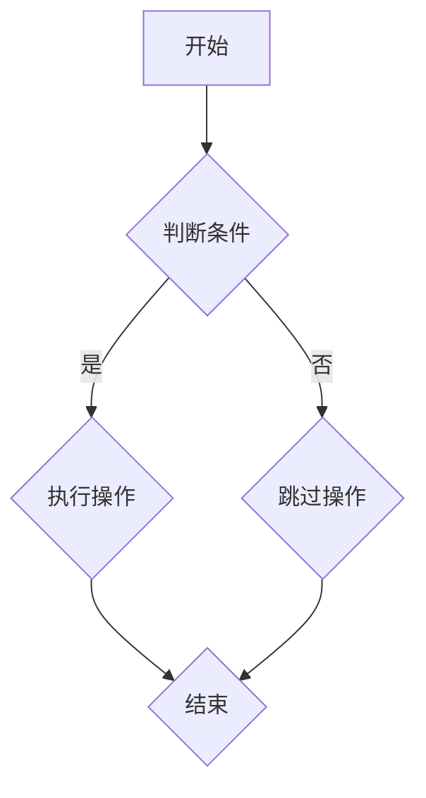

                 


# 基于Anthropic Constitutional AI的LLM伦理评估

> 关键词：大规模语言模型（LLM），伦理评估，Anthropic Constitutional AI，AI伦理

> 摘要：随着大规模语言模型（LLM）的广泛应用，其伦理问题逐渐引起关注。Anthropic Constitutional AI作为一种新的理论框架，旨在通过制定宪法来约束和规范LLM的行为，本文将探讨其原理、评估方法及其在LLM伦理评估中的应用。

## 第一部分: Anthropic Constitutional AI概述

### 第1章: 问题背景与核心概念

#### 1.1.1 问题背景

近年来，随着人工智能技术的飞速发展，大规模语言模型（LLM）在自然语言处理、智能客服、自动驾驶等领域得到了广泛应用。然而，随着LLM的广泛应用，其伦理问题也逐渐暴露出来。例如，LLM可能会产生偏见、泄露隐私、造成安全威胁等。因此，对LLM进行伦理评估变得尤为重要。

#### 1.1.2 核心概念

- **Anthropic Constitutional AI**：Anthropic Constitutional AI是一种模拟人类社会法律体系的AI系统，旨在通过制定宪法来约束和规范AI的行为。
- **LLM伦理评估**：对大规模语言模型在伦理方面的表现进行评估和验证。

#### 1.1.3 边界与外延

- **边界**：本文主要讨论Anthropic Constitutional AI在LLM伦理评估中的应用，不包括其他类型的AI系统。
- **外延**：LLM伦理评估不仅关注模型的行为，还涉及模型的设计、训练、部署等各个环节。

### 第2章: Anthropic Constitutional AI原理

#### 2.1.1 原理概述

Anthropic Constitutional AI通过模拟人类社会中的法律体系，构建了一套针对AI系统的宪法和法律法规，以此来规范和约束AI的行为。

#### 2.1.2 概念属性特征对比

| 特征             | Anthropic Constitutional AI | 传统AI伦理规范 |
|------------------|---------------------------|----------------|
| 规范对象         | 整个AI系统                | AI行为         |
| 规范方式         | 制定宪法和法律           | 约束性指导     |
| 适用范围         | 全球范围                  | 单一国家或组织 |
| 影响力           | 长期、全局性             | 短期、局部性   |

#### 2.1.3 与传统AI伦理规范的差异

Anthropic Constitutional AI与传统AI伦理规范的主要区别在于其全面性和系统性。传统伦理规范往往只关注AI的行为，而Anthropic Constitutional AI则通过制定宪法和法律法规，对AI系统的设计、训练、部署等全过程进行规范。

## 第二部分: LLM伦理评估方法

### 第3章: LLM伦理评估指标体系

#### 3.1.1 评估指标体系

LLM伦理评估的指标体系应包括：

- **行为公正性**：模型是否公平、无偏见。
- **隐私保护**：模型是否保护用户的隐私。
- **透明性**：模型的行为是否透明、可解释。
- **安全性**：模型是否安全、可靠。

### 第4章: LLM伦理评估流程

#### 4.1.1 评估流程

LLM伦理评估的流程主要包括：

1. **需求分析**：确定评估目标和范围。
2. **数据收集**：收集与LLM相关的数据。
3. **模型测试**：通过测试验证LLM在不同情境下的行为。
4. **评估结果分析**：分析评估结果，提出改进建议。

## 第三部分: Anthropic Constitutional AI在LLM伦理评估中的应用

### 第5章: Anthropic Constitutional AI在LLM伦理评估中的模型设计与实现

#### 5.1.1 模型设计与实现

在LLM伦理评估中，Anthropic Constitutional AI的设计和实现主要包括：

1. **宪法框架**：制定一套适用于LLM的宪法。
2. **法律法规**：根据宪法制定具体法律法规。
3. **评估算法**：设计用于评估LLM是否符合宪法和法律法规的算法。

### 第6章: Anthropic Constitutional AI在LLM伦理评估中的应用案例

#### 6.1.1 智能客服系统

通过宪法和法律法规评估智能客服系统对用户的回应是否公正、无偏见。

#### 6.1.2 自动驾驶系统

评估自动驾驶系统在处理紧急情况时的决策是否符合伦理标准。

## 第四部分: LLM伦理评估的挑战与未来展望

### 第7章: LLM伦理评估的挑战

#### 7.1.1 挑战

LLM伦理评估面临的主要挑战包括：

- **跨领域一致性**：不同领域的LLM伦理评估标准可能存在差异。
- **评估方法的可靠性**：如何确保评估结果的准确性和可靠性。

### 第8章: LLM伦理评估的未来展望

#### 8.1.2 未来展望

未来，LLM伦理评估可能会朝着以下方向发展：

- **标准化**：制定统一的LLM伦理评估标准。

## 参考文献

[1] Anthropic. (2020). Constitutional AI: A Framework for Scalable Alignment. Retrieved from https://blog.anthropic.com/post/constitutional-ai

[2] Russell, S., & Norvig, P. (2016). Artificial Intelligence: A Modern Approach. Prentice Hall.

[3] AI Ethics. (n.d.). Retrieved from https://www.aaai.org/Research/AITopics/ethics

## 附录

### 附录A: Mermaid流程图示例



### 附录B: Python代码示例

```python
def add(a, b):
    return a + b

result = add(1, 2)
print(result)  # 输出 3
```

作者：AI天才研究院/AI Genius Institute & 禅与计算机程序设计艺术 /Zen And The Art of Computer Programming

