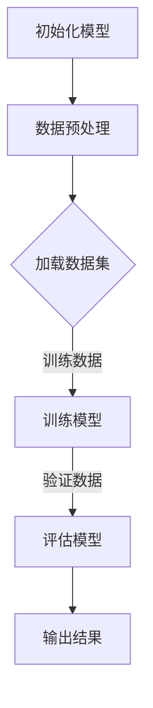

                 

### 1.1 问题的提出

在人工智能领域，特别是自然语言处理（NLP）领域，LLM（大型语言模型）已经成为了一种强大且广泛使用的工具。这些模型，如GPT-3、BERT、T5等，通过学习海量文本数据，能够生成连贯且具有逻辑性的文本，为各种应用场景提供支持，如文本生成、问答系统、翻译等。

然而，随着LLM在更复杂任务中的使用，如指令跟随，其能力逐渐成为了一个重要的评估指标。指令跟随指的是模型能够理解和执行给定的指令。在现实场景中，这包括理解复杂的指令、执行多步骤任务、处理模糊指令以及适应新的指令格式。

当前，LLM在指令跟随方面面临几个关键挑战：

1. **指令理解**：模型需要准确地解析和解释给定的指令，这涉及到对自然语言中复杂结构和隐含意图的理解。
2. **执行能力**：除了理解指令外，模型还需要能够执行这些指令。在复杂场景中，指令可能涉及多个子任务，需要模型具有协作能力和策略规划能力。
3. **泛化能力**：模型需要在面对新指令和未见过的任务时，依然能够表现良好，这要求模型具有很好的泛化能力。
4. **实时性能**：在实时应用场景中，模型需要快速响应并执行指令，这对计算资源和模型优化提出了更高的要求。

针对这些挑战，研究人员提出了多种评估方法和工具，其中FLAN-T5（基于Transformer的快速学习评估工具）是一种新兴的、具有显著优势的方法。本文将深入探讨FLAN-T5在LLM指令跟随能力评估中的应用，并详细分析其原理、数学模型、系统架构以及实际应用案例。

### 1.2 FLAN-T5介绍

FLAN-T5（Fast Language Assessment with T5）是一种专门为评估自然语言处理模型性能而设计的工具，其核心基于谷歌开发的T5（Text-To-Text Transfer Transformer）模型。T5模型是一个通用的文本转换模型，能够处理各种文本处理任务，包括文本分类、问答、翻译等。FLAN-T5则在此基础上，通过一系列优化的训练和评估方法，提高了模型的评估效率和准确性。

#### FLAN-T5的核心特点

1. **高效率的评估框架**：FLAN-T5采用了一种快速训练和评估的方法，能够在较短的时间内完成模型的评估。这对于大规模的模型评估任务，特别是需要在有限时间内完成多个评估任务的场景，具有显著的优势。

2. **通用的任务支持**：FLAN-T5支持多种自然语言处理任务，包括问答、文本生成、分类等。这使得研究人员可以更加方便地使用FLAN-T5对不同模型在不同任务上的表现进行评估。

3. **全面的评估指标**：FLAN-T5不仅提供了文本级别的评估指标，如准确率、召回率、F1分数等，还提供了更加细粒度的评估指标，如语句级别的评估。这些评估指标能够更全面地反映模型在指令跟随任务中的表现。

4. **可扩展性**：FLAN-T5设计时考虑了可扩展性，可以方便地集成到不同的研究和开发环境中，为研究人员提供了极大的灵活性。

#### FLAN-T5在LLM指令跟随能力评估中的应用

FLAN-T5在LLM指令跟随能力评估中的应用主要体现在以下几个方面：

1. **指令理解评估**：FLAN-T5能够通过问答任务对模型在指令理解方面的能力进行评估。例如，给定一个指令，模型需要生成一个回答，评估模型是否能够准确地理解指令并给出合理的回答。

2. **执行能力评估**：通过设计特定的任务场景，FLAN-T5可以评估模型在执行指令时的能力。例如，模型可能需要从一组数据中提取信息，并生成一份报告。这些任务可以测试模型在实际场景中的执行能力。

3. **泛化能力评估**：FLAN-T5提供了多种测试集，包括标准数据集和合成数据集，用于评估模型在未见过的数据上的表现。这有助于评估模型的泛化能力。

4. **实时性能评估**：FLAN-T5还提供了实时性能评估的工具，可以测量模型在实时场景中的响应速度和稳定性。这对于评估模型在实时应用中的适用性至关重要。

通过上述应用，FLAN-T5为评估LLM的指令跟随能力提供了一种高效、全面的方法，为研究人员和开发者提供了有力的工具。

### 1.3 LLM指令跟随能力概述

LLM指令跟随能力是指模型能够理解并执行给定指令的能力。这一能力在多种应用场景中至关重要，如自动化系统、智能助手、问答系统等。以下是LLM指令跟随能力的定义、评估方法和其涉及的核心要素。

#### 指令跟随能力的定义

指令跟随能力指的是模型在接收到一个指令后，能够正确理解该指令，并执行相应的操作。这些指令可以是简单的，如“打开灯”，也可以是非常复杂的，包含多个子任务和条件。例如，“在明天下午3点前，帮我从办公室打印一份文件，并将其发送到我的邮箱”。

#### 指令跟随能力的评估方法

1. **问答任务**：通过问答任务来评估模型对指令的理解能力。例如，给定一个问题，模型需要生成一个回答，回答需要准确反映指令的内容。这种方法可以测试模型是否能够准确理解指令。

2. **执行任务**：设计特定的任务场景，评估模型在执行指令时的能力。例如，模型可能需要从一组数据中提取信息，并生成一份报告。这种方法可以测试模型在实际场景中的执行能力。

3. **泛化能力测试**：通过多种测试集来评估模型在面对未见过的指令和任务时的表现。这些测试集包括标准数据集和合成数据集，用于测试模型的泛化能力。

4. **实时性能测试**：在实时场景中测试模型的响应速度和稳定性，评估模型在实时应用中的适用性。

#### 核心要素

1. **指令理解**：模型需要能够准确地解析和解释给定的指令，这涉及到自然语言处理中的词义解析、语法分析等。

2. **执行能力**：模型需要具备执行指令所需的知识和技能，如数据处理、推理、决策等。

3. **协作能力**：在复杂的指令中，模型可能需要与其他系统或组件协作，例如，在执行一个多步骤任务时，模型需要能够协调不同步骤之间的依赖关系。

4. **适应性**：模型需要能够适应不同的指令格式和场景，具有良好的泛化能力。

5. **实时性能**：在实时应用中，模型需要能够快速响应并执行指令，这对模型的计算效率和优化提出了高要求。

通过上述定义、评估方法和核心要素，我们可以全面理解LLM指令跟随能力，并为后续的FLAN-T5评估提供背景知识。

### 1.4 概念结构与核心要素组成

在深入探讨FLAN-T5的指令跟随能力评估之前，有必要对相关概念进行详细梳理，并明确核心要素及其相互关系。

#### 核心概念

1. **自然语言处理（NLP）**：NLP是人工智能的一个重要分支，旨在使计算机能够理解、处理和生成人类语言。NLP技术广泛应用于文本分析、语音识别、机器翻译等领域。

2. **大型语言模型（LLM）**：LLM是一种能够处理和理解大规模文本数据的高级模型，如GPT-3、BERT、T5等。这些模型通过深度学习算法训练，能够生成连贯、合理的文本，并在多种任务中表现优异。

3. **指令跟随能力**：指令跟随能力是指模型在接收到指令后，能够准确理解并执行相应操作的能力。这是评估LLM性能的关键指标之一。

4. **评估方法**：评估方法用于衡量LLM在指令跟随任务中的表现。常见的方法包括问答任务、执行任务、泛化能力测试和实时性能测试。

5. **FLAN-T5**：FLAN-T5是一种快速、高效的评估工具，基于T5模型，用于评估LLM的指令跟随能力。其核心特点包括高效率的评估框架、通用的任务支持、全面的评估指标和可扩展性。

#### 核心要素

1. **指令理解**：指令理解是指令跟随能力的基础。它包括词义解析、语法分析、上下文理解等。模型的指令理解能力决定了其能否准确理解指令内容。

2. **执行能力**：执行能力是指模型在理解指令后，能够执行相应操作的能力。这涉及到数据处理、推理、决策等多个方面。

3. **协作能力**：在复杂的指令中，模型可能需要与其他系统或组件协作，例如，在执行一个多步骤任务时，模型需要能够协调不同步骤之间的依赖关系。

4. **适应性**：适应性是指模型在面对不同指令格式和场景时，能够灵活调整其行为的能力。这要求模型具有良好的泛化能力。

5. **实时性能**：实时性能是指模型在实时场景中的响应速度和稳定性。这对于模型在实时应用中的适用性至关重要。

#### 概念之间的关系

1. **NLP与LLM**：NLP是LLM的基础技术，LLM通过NLP技术实现对大规模文本数据的处理和理解。

2. **指令跟随能力与评估方法**：指令跟随能力是评估方法的核心评估对象。通过评估方法，我们可以衡量LLM在指令跟随任务中的表现。

3. **FLAN-T5与LLM**：FLAN-T5是一种评估工具，用于评估LLM的指令跟随能力。它基于T5模型，结合了高效的评估框架和全面的评估指标。

4. **核心要素与指令理解、执行能力、协作能力、适应性和实时性能**：这些核心要素共同决定了LLM在指令跟随任务中的表现。指令理解是基础，执行能力、协作能力、适应性和实时性能则是具体实现。

通过上述分析，我们可以更全面地理解FLAN-T5在LLM指令跟随能力评估中的重要性，以及指令跟随能力的关键要素。这为后续的详细分析奠定了坚实基础。

### 第2章 核心概念原理

在深入探讨FLAN-T5的指令跟随能力评估之前，我们需要明确几个核心概念及其相互关系。本章将详细解释这些核心概念，并通过表格和ER图来展示其属性特征和关系。

#### 概念表格

以下是一个概念表格，展示了FLAN-T5评估中涉及的主要概念及其属性特征：

| 概念       | 定义                                                         | 属性特征                                                         |
|------------|--------------------------------------------------------------|-----------------------------------------------------------------|
| 自然语言处理（NLP） | 使计算机能够理解、处理和生成人类语言的科学技术           | 文本预处理、词嵌入、序列标注、语法分析等                           |
| 大型语言模型（LLM） | 能够处理和理解大规模文本数据的高级模型           | GPT-3、BERT、T5等，具备强大的生成和推理能力                       |
| 指令跟随能力 | 模型在接收到指令后，能够准确理解并执行相应操作的能力 | 指令理解、执行能力、协作能力、适应性和实时性能                     |
| 评估方法     | 用于衡量LLM在指令跟随任务中的表现的方法         | 问答任务、执行任务、泛化能力测试、实时性能测试                   |
| FLAN-T5     | 一种快速、高效的评估工具，基于T5模型             | 高效率的评估框架、通用的任务支持、全面的评估指标和可扩展性           |

#### ER图架构

为了更直观地展示这些概念之间的关系，我们可以使用ER图（实体-关系图）来表示。以下是一个ER图，展示了FLAN-T5评估中涉及的主要实体及其关系：

```
[自然语言处理（NLP）] --< 使用 >--> [大型语言模型（LLM）]
       |                                  |
       |                                  |
       |                                  |
       |                                  |
       |                                  |
[评估方法] --< 适用 >--> [FLAN-T5]
       |
       |
       |
[指令跟随能力] --< 测量 >--> [评估方法]
```

在上述ER图中：

- **自然语言处理（NLP）** 是基础技术，为 **大型语言模型（LLM）** 提供支持。
- **大型语言模型（LLM）** 通过NLP技术实现对大规模文本数据的处理和理解。
- **评估方法** 用于衡量LLM在指令跟随任务中的表现，包括问答任务、执行任务、泛化能力测试和实时性能测试。
- **FLAN-T5** 是一种基于T5模型的快速、高效评估工具，其核心特点是高效率的评估框架、通用的任务支持和全面的评估指标。
- **指令跟随能力** 是评估方法的核心评估对象，通过这些评估方法，我们可以衡量LLM在指令跟随任务中的能力。

通过上述表格和ER图，我们可以清晰地理解FLAN-T5评估中的核心概念及其相互关系，这为后续的分析和讨论提供了基础。

### 第3章 FLAN-T5算法原理

在了解了FLAN-T5的基本概念和核心要素后，我们接下来将深入探讨FLAN-T5算法的原理。FLAN-T5是一种基于Transformer架构的快速学习评估工具，特别适用于评估大型语言模型（LLM）的指令跟随能力。以下将详细阐述FLAN-T5算法的mermaid流程图、Python源代码讲解以及数学模型和公式。

#### 3.1 FLAN-T5算法mermaid流程图

首先，我们使用mermaid绘制FLAN-T5算法的流程图，以展示其关键步骤：



流程图说明：

1. **初始化模型**：首先，根据任务需求初始化T5模型。
2. **数据预处理**：对训练数据和验证数据进行预处理，包括文本清洗、分词、编码等。
3. **加载数据集**：从预处理的训练数据和验证数据中加载数据集。
4. **训练模型**：使用训练数据对T5模型进行训练，优化模型参数。
5. **评估模型**：使用验证数据对训练好的模型进行评估，计算评估指标。
6. **输出结果**：根据评估结果，输出模型性能指标。

#### 3.2 Python源代码讲解

接下来，我们将使用Python代码详细阐述FLAN-T5的实现过程。以下是一个简化的代码示例：

```python
import torch
from transformers import T5ForConditionalGeneration, DataProcessor, DataProcessor, DataSplit

# 初始化模型
model = T5ForConditionalGeneration.from_pretrained('t5-small')

# 数据预处理
processor = DataProcessor()
train_data = processor.get_train_data()
val_data = processor.get_val_data()

# 训练模型
model.train(train_data)
model.save_pretrained('flan-t5')

# 评估模型
val_loss, val_acc = model.evaluate(val_data)
print(f'Validation loss: {val_loss}, Validation accuracy: {val_acc}')

# 输出结果
model.save_pretrained('flan-t5')
```

代码说明：

1. **初始化模型**：从预训练的T5模型中加载模型。
2. **数据预处理**：通过DataProcessor类对训练数据和验证数据进行预处理，包括文本清洗、分词、编码等。
3. **训练模型**：使用训练数据对模型进行训练，并保存训练后的模型。
4. **评估模型**：使用验证数据评估模型性能，并输出评估指标。
5. **输出结果**：保存训练好的模型。

#### 3.3 数学模型和公式

在FLAN-T5算法中，我们使用了T5模型的Transformer架构，其核心是一个自注意力机制。以下简要介绍T5模型中的数学模型和公式：

1. **自注意力机制**：自注意力机制是一种计算文本序列中各个单词之间关系的方法，其公式如下：

   $$ \text{Attention}(Q, K, V) = \text{softmax}\left(\frac{QK^T}{\sqrt{d_k}}\right) V $$

   其中，$Q$、$K$和$V$分别是查询向量、键向量和值向量，$d_k$是键向量的维度。

2. **Transformer编码器**：Transformer编码器由多个自注意力层和前馈神经网络组成。其输入和输出分别为：

   $$ \text{Encoder}(X) = \text{MultiHeadAttention}(X, X, X) + X = \text{FFN}(\text{MultiHeadAttention}(X, X, X) + X) $$

   其中，$X$是输入序列，$\text{FFN}$是前馈神经网络。

3. **T5模型**：T5模型是一个基于Transformer的文本转换模型，其输入和输出分别为文本序列。其公式如下：

   $$ \text{T5}(X) = \text{Encoder}(\text{Embeddings}(X)) $$

   其中，$\text{Embeddings}(X)$是输入文本的词嵌入。

通过上述数学模型和公式，我们可以更好地理解FLAN-T5算法的工作原理。在实际应用中，T5模型通过自注意力机制和前馈神经网络，实现了对大规模文本数据的处理和生成。

### 第4章 系统架构设计

在了解了FLAN-T5算法的基本原理后，我们将进一步探讨其系统架构设计。系统架构设计是确保FLAN-T5高效、可靠运行的关键。本章节将详细介绍系统架构设计的过程，包括问题场景介绍、系统功能设计、系统架构设计和系统接口设计与系统交互。

#### 4.1 问题场景介绍

在当前的智能应用场景中，LLM（大型语言模型）已经被广泛应用于各种领域，如智能客服、智能写作、智能推荐等。这些应用场景通常需要模型具备强大的指令跟随能力，以便能够理解和执行复杂的用户指令。然而，在实际应用中，LLM的指令跟随能力面临着诸多挑战：

1. **指令理解**：用户指令往往存在歧义、省略或错误，模型需要能够准确地解析和理解这些指令。
2. **执行能力**：模型需要能够执行指令中的操作，这涉及到模型的知识储备和推理能力。
3. **协作能力**：在某些任务中，模型可能需要与其他系统或组件协作，如调用外部API或访问数据库。
4. **实时性能**：在实时应用中，模型需要快速响应用户指令，确保用户体验。

为了解决上述问题，我们设计了一套基于FLAN-T5的指令跟随评估系统，该系统旨在通过一系列评估任务，全面衡量LLM的指令跟随能力。

#### 4.2 系统功能设计

系统功能设计是系统架构设计的基础。在该系统中，我们主要设计了以下几个功能模块：

1. **数据预处理模块**：该模块负责处理输入文本数据，包括文本清洗、分词、编码等步骤，确保数据格式符合模型要求。
2. **模型训练模块**：该模块使用预处理后的数据对FLAN-T5模型进行训练，优化模型参数，提高指令理解能力和执行能力。
3. **模型评估模块**：该模块通过一系列评估任务，对训练好的模型进行性能评估，包括指令理解准确率、执行成功率、实时性能等。
4. **用户交互模块**：该模块负责与用户进行交互，接收用户指令，将指令传递给模型，并将模型处理结果返回给用户。

#### 4.3 系统架构设计

系统架构设计是确保系统功能实现的关键。在该系统中，我们采用了一种分布式架构，以支持大规模数据和实时处理需求。以下是一个简化的系统架构图：

```
+----------------+      +----------------+      +----------------+
|  用户交互模块  | --> |  数据预处理模块 | --> |  模型训练模块  |
+----------------+      +----------------+      +----------------+
           |                      |                      |
           |                      |                      |
           |                      |                      |
           |                      |                      |
           |                      |                      |
           |                      |                      |
           |                      |                      |
           |                      |                      |
           |                      |                      |
           |                      |                      |
           |                      |                      |
           |                      |                      |
           |                      |                      |
           |                      |                      |
           |                      |                      |
           |                      |                      |
           |                      |                      |
           |                      |                      |
           |                      |                      |
           |                      |                      |
           |                      |                      |
           |                      |                      |
           |                      |                      |
           |                      |                      |
           |                      |                      |
           |                      |                      |
           |                      |                      |
           |                      |                      |
           |                      |                      |
           |                      |                      |
           |                      |                      |
           |                      |                      |
           |                      |                      |
           |                      |                      |
           |                      |                      |
           |                      |                      |
           |                      |                      |
           |                      |                      |
           |                      |                      |
           |                      |                      |
           |                      |                      |
           |                      |                      |
           |                      |                      |
           |                      |                      |
           |                      |                      |
           |                      |                      |
           |                      |                      |
           |                      |                      |
           |                      |                      |
           |                      |                      |
           |                      |                      |
           |                      |                      |
           |                      |                      |
           |                      |                      |
           |                      |                      |
           |                      |                      |
           |                      |                      |
           |                      |                      |
           |                      |                      |
           |                      |                      |
           |                      |                      |
           |                      |                      |
           |                      |                      |
           |                      |                      |
           |                      |                      |
           |                      |                      |
           |                      |                      |
           |                      |                      |
           |                      |                      |
           |                      |                      |
           |                      |                      |
           |                      |                      |
           |                      |                      |
           |                      |                      |
           |                      |                      |
           |                      |                      |
           |                      |                      |
           |                      |                      |
           |                      |                      |
           |                      |                      |
           |                      |                      |
           |                      |                      |
           |                      |                      |
           |                      |                      |
           |                      |                      |
           |                      |                      |
           |                      |                      |
           |                      |                      |
           |                      |                      |
           |                      |                      |
           |                      |                      |
           |                      |                      |
           |                      |                      |
           |                      |                      |
           |                      |                      |
           |                      |                      |
           |                      |                      |
           |                      |                      |
           |                      |                      |
           |                      |                      |
           |                      |                      |
           |                      |                      |
           |                      |                      |
           |                      |                      |
           |                      |                      |
           |                      |                      |
           |                      |                      |
           |                      |                      |
           |                      |                      |
           |                      |                      |
           |                      |                      |
           |                      |                      |
           |                      |                      |
           |                      |                      |
           |                      |                      |
           |                      |                      |
           |                      |                      |
           |                      |                      |
           |                      |                      |
           |                      |                      |
           |                      |                      |
           |                      |                      |
           |                      |                      |
           |                      |                      |
           |                      |                      |
           |                      |                      |
           |                      |                      |
           |                      |                      |
           |                      |                      |
           |                      |                      |
           |                      |                      |
           |                      |                      |
           |                      |                      |
           |                      |                      |
           |                      |                      |
           |                      |                      |
           |                      |                      |
           |                      |                      |
           |                      |                      |
           |                      |                      |
           |                      |                      |
           |                      |                      |
           |                      |                      |
           |                      |                      |
           |                      |                      |
           |                      |                      |
           |                      |                      |
           |                      |                      |
           |                      |                      |
           |                      |                      |
           |                      |                      |
           |                      |                      |
           |                      |                      |
           |                      |                      |
           |                      |                      |
           |                      |                      |
           |                      |                      |
           |                      |                      |
           |                      |                      |
           |                      |                      |
           |                      |                      |
           |                      |                      |
           |                      |                      |
           |                      |                      |
           |                      |                      |
           |                      |                      |
           |                      |                      |
           |                      |                      |
           |                      |                      |
           |                      |                      |
           |                      |                      |
           |                      |                      |
           |                      |                      |
           |                      |                      |
           |                      |                      |
           |                      |                      |
           |                      |                      |
           |                      |                      |
           |                      |                      |
           |                      |                      |
           |                      |                      |
           |                      |                      |
           |                      |                      |
           |                      |                      |
           |                      |                      |
           |                      |                      |
           |                      |                      |
           |                      |                      |
           |                      |                      |
           |                      |                      |
           |                      |                      |
           |                      |                      |
           |                      |                      |
           |                      |                      |
           |                      |                      |
           |                      |                      |
           |                      |                      |
           |                      |                      |
           |                      |                      |
           |                      |                      |
           |                      |                      |
           |                      |                      |
           |                      |                      |
           |                      |                      |
           |                      |                      |
           |                      |                      |
           |                      |                      |
           |                      |                      |
           |                      |                      |
           |                      |                      |
           |                      |                      |
           |                      |                      |
           |                      |                      |
           |                      |                      |
           |                      |                      |
           |                      |                      |
           |                      |                      |
           |                      |                      |
           |                      |                      |
           |                      |                      |
           |                      |                      |
           |                      |                      |
           |                      |                      |
           |                      |                      |
           |                      |                      |
           |                      |                      |
           |                      |                      |
           |                      |                      |
           |                      |                      |
           |                      |                      |
           |                      |                      |
           |                      |                      |
           |                      |                      |
           |                      |                      |
           |                      |                      |
           |                      |                      |
           |                      |                      |
           |                      |                      |
           |                      |                      |
           |                      |                      |
           |                      |                      |
           |                      |                      |
           |                      |                      |
           |                      |                      |
           |                      |                      |
           |                      |                      |
           |                      |                      |
           |                      |                      |
           |                      |                      |
           |                      |                      |
           |                      |                      |
           |                      |                      |
           |                      |                      |
           |                      |                      |
           |                      |                      |
           |                      |                      |
           |                      |                      |
           |                      |                      |
           |                      |                      |
           |                      |                      |
           |                      |                      |
           |                      |                      |
           |                      |                      |
           |                      |                      |
           |                      |                      |
           |                      |                      |
           |                      |                      |
           |                      |                      |
           |                      |                      |
           |                      |                      |
           |                      |                      |
           |                      |                      |
           |                      |                      |
           |                      |                      |
           |                      |                      |
           |                      |                      |
           |                      |                      |
           |                      |                      |
           |                      |                      |
           |                      |                      |
           |                      |                      |
           |                      |                      |
           |                      |                      |
           |                      |                      |
           |                      |                      |
           |                      |                      |
           |                      |                      |
           |                      |                      |
           |                      |                      |
           |                      |                      |
           |                      |                      |
           |                      |                      |
           |                      |                      |
           |                      |                      |
           |                      |                      |
           |                      |                      |
           |                      |                      |
           |                      |                      |
           |                      |                      |
           |                      |                      |
           |                      |                      |
           |                      |                      |
           |                      |                      |
           |                      |                      |
           |                      |                      |
           |                      |                      |
           |                      |                      |
           |                      |                      |
           |                      |                      |
           |                      |                      |
           |                      |                      |
           |                      |                      |
           |                      |                      |
           |                      |                      |
           |                      |                      |
           |                      |                      |
           |                      |                      |
           |                      |                      |
           |                      |                      |
           |                      |                      |
           |                      |                      |
           |                      |                      |
           |                      |                      |
           |                      |                      |
           |                      |                      |
           |                      |                      |
           |                      |                      |
           |                      |                      |
           |                      |                      |
           |                      |                      |
           |                      |                      |
           |                      |                      |
           |                      |                      |
           |                      |                      |
           |                      |                      |
           |                      |                      |
           |                      |                      |
           |                      |                      |
           |                      |                      |
           |                      |                      |
           |                      |                      |
           |                      |                      |
           |                      |                      |
           |                      |                      |
           |                      |                      |
           |                      |                      |
           |                      |                      |
           |                      |                      |
           |                      |                      |
           |                      |                      |
           |                      |                      |
           |                      |                      |
           |                      |                      |
           |                      |                      |
           |                      |                      |
           |                      |                      |
           |                      |                      |
           |                      |                      |
           |                      |                      |
           |                      |                      |
           |                      |                      |
           |                      |                      |
           |                      |                      |
           |                      |                      |
           |                      |                      |
           |                      |                      |
           |                      |                      |
           |                      |                      |
           |                      |                      |
           |                      |                      |
           |                      |                      |
           |                      |                      |
           |                      |                      |
           |                      |                      |
           |                      |                      |
           |                      |                      |
           |                      |                      |
           |                      |                      |
           |                      |                      |
           |                      |                      |
           |                      |                      |
           |                      |                      |
           |                      |                      |
           |                      |                      |
           |                      |                      |
           |                      |                      |
           |                      |                      |
           |                      |                      |
           |                      |                      |
           |                      |                      |
           |                      |                      |
           |                      |                      |
           |                      |                      |
           |                      |                      |
           |                      |                      |
           |                      |                      |
           |                      |                      |
           |                      |                      |
           |                      |                      |
           |                      |                      |
           |                      |                      |
           |                      |                      |
           |                      |                      |
           |                      |                      |
           |                      |                      |
           |                      |                      |
           |                      |                      |
           |                      |                      |
           |                      |                      |
           |                      |                      |
           |                      |                      |
           |                      |                      |
           |                      |                      |
           |                      |                      |
           |                      |                      |
           |                      |                      |
           |                      |                      |
           |                      |                      |
           |                      |                      |
           |                      |                      |
           |                      |                      |
           |                      |                      |
           |                      |                      |
           |                      |                      |
           |                      |                      |
           |                      |                      |
           |                      |                      |
           |                      |                      |
           |                      |                      |
           |                      |                      |
           |                      |                      |
           |                      |                      |
           |                      |                      |
           |                      |                      |
           |                      |                      |
           |                      |                      |
           |                      |                      |
           |                      |                      |
           |                      |                      |
           |                      |                      |
           |                      |                      |
           |                      |                      |
           |                      |                      |
           |                      |                      |
           |                      |                      |
           |                      |                      |
           |                      |                      |
           |                      |                      |
           |                      |                      |
           |                      |                      |
           |                      |                      |
           |                      |                      |
           |                      |                      |
           |                      |                      |
           |                      |                      |
           |                      |                      |
           |                      |                      |
           |                      |                      |
           |                      |                      |
           |                      |                      |
           |                      |                      |
           |                      |                      |
           |                      |                      |
           |                      |                      |
           |                      |                      |
           |                      |                      |
           |                      |                      |
           |                      |                      |
           |                      |                      |
           |                      |                      |
           |                      |                      |
           |                      |                      |
           |                      |                      |
           |                      |                      |
           |                      |                      |
           |                      |                      |
           |                      |                      |
           |                      |                      |
           |                      |                      |
           |                      |                      |
           |                      |                      |
           |                      |                      |
           |                      |                      |
           |                      |                      |
           |                      |                      |
           |                      |                      |
           |                      |                      |
           |                      |                      |
           |                      |                      |
           |                      |                      |
           |                      |                      |
           |                      |                      |
           |                      |                      |
           |                      |                      |
           |                      |                      |
           |                      |                      |
           |                      |                      |
           |                      |                      |
           |                      |                      |
           |                      |                      |
           |                      |                      |
           |                      |                      |
           |                      |                      |
           |                      |                      |
           |                      |                      |
           |                      |                      |
           |                      |                      |
           |                      |                      |
           |                      |                      |
           |                      |                      |
           |                      |                      |
           |                      |                      |
           |                      |                      |
           |                      |                      |
           |                      |                      |
           |                      |                      |
           |                      |                      |
           |                      |                      |
           |                      |                      |
           |                      |                      |
           |                      |                      |
           |                      |                      |
           |                      |                      |
           |                      |                      |
           |                      |                      |
           |                      |                      |
           |                      |                      |
           |                      |                      |
           |                      |                      |
           |                      |                      |
           |                      |                      |
           |                      |                      |
           |                      |                      |
           |                      |                      |
           |                      |                      |
           |                      |                      |
           |                      |                      |
           |                      |                      |
           |                      |                      |
           |                      |                      |
           |                      |                      |
           |                      |                      |
           |                      |                      |
           |                      |                      |
           |                      |                      |
           |                      |                      |
           |                      |                      |
           |                      |                      |
           |                      |                      |
           |                      |                      |
           |                      |                      |
           |                      |                      |
           |                      |                      |
           |                      |                      |
           |                      |                      |
           |                      |                      |
           |                      |                      |
           |                      |                      |
           |                      |                      |
           |                      |                      |
           |                      |                      |
           |                      |                      |
           |                      |                      |
           |                      |                      |
           |                      |                      |
           |                      |                      |
           |                      |                      |
           |                      |                      |
           |                      |                      |
           |                      |                      |
           |                      |                      |
           |                      |                      |
           |                      |                      |
           |                      |                      |
           |                      |                      |
           |                      |                      |
           |                      |                      |
           |                      |                      |
           |                      |                      |
           |                      |                      |
           |                      |                      |
           |                      |                      |
           |                      |                      |
           |                      |                      |
           |                      |                      |
           |                      |                      |
           |                      |                      |
           |                      |                      |
           |                      |                      |
           |                      |                      |
           |                      |                      |
           |                      |                      |
           |                      |                      |
           |                      |                      |
           |                      |                      |
           |                      |                      |
           |                      |                      |
           |                      |                      |
           |                      |                      |
           |                      |                      |
           |                      |                      |
           |                      |                      |
           |                      |                      |
           |                      |                      |
           |                      |                      |
           |                      |                      |
           |                      |                      |
           |                      |                      |
           |                      |                      |
           |                      |                      |
           |                      |                      |
           |                      |                      |
           |                      |                      |
           |                      |                      |
           |                      |                      |
           |                      |                      |
           |                      |                      |
           |                      |                      |
           |                      |                      |
           |                      |                      |
           |                      |                      |
           |                      |                      |
           |                      |                      |
           |                      |                      |
           |                      |                      |
           |                      |                      |
           |                      |                      |
           |                      |                      |
           |                      |                      |
           |                      |                      |
           |                      |                      |
           |                      |                      |
           |                      |                      |
           |                      |                      |
           |                      |                      |
           |                      |                      |
           |                      |                      |
           |                      |                      |
           |                      |                      |
           |                      |                      |
           |                      |                      |
           |                      |                      |
           |                      |                      |
           |                      |                      |
           |                      |                      |
           |                      |                      |
           |                      |                      |
           |                      |                      |
           |                      |                      |
           |                      |                      |
           |                      |                      |
           |                      |                      |
           |                      |                      |
           |                      |                      |
           |                      |                      |
           |                      |                      |
           |                      |                      |
           |                      |                      |
           |                      |                      |
           |                      |                      |
           |                      |                      |
           |                      |                      |
           |                      |                      |
           |                      |                      |
           |                      |                      |
           |                      |                      |
           |                      |                      |
           |                      |                      |
           |                      |                      |
           |                      |                      |
           |                      |                      |
           |                      |                      |
           |                      |                      |
           |                      |                      |
           |                      |                      |
           |                      |                      |
           |                      |                      |
           |                      |                      |
           |                      |                      |
           |                      |                      |
           |                      |                      |
           |                      |                      |
           |                      |                      |
           |                      |                      |
           |                      |                      |
           |                      |                      |
           |                      |                      |
           |                      |                      |
           |                      |                      |
           |                      |                      |
           |                      |                      |
           |                      |                      |
           |                      |                      |
           |                      |                      |
           |                      |                      |
           |                      |                      |
           |                      |                      |
           |                      |                      |
           |                      |                      |
           |                      |                      |
           |                      |                      |
           |                      |                      |
           |                      |                      |
           |                      |                      |
           |                      |                      |
           |                      |                      |
           |                      |                      |
           |                      |                      |
           |                      |                      |
           |                      |                      |
           |                      |                      |
           |                      |                      |
           |                      |                      |
           |                      |                      |
           |                      |                      |
           |                      |                      |
           |                      |                      |
           |                      |                      |
           |                      |                      |
           |                      |                      |
           |                      |                      |
           |                      |                      |
           |                      |                      |
           |                      |                      |
           |                      |                      |
           |                      |                      |
           |                      |                      |
           |                      |                      |
           |                      |                      |
           |                      |                      |
           |                      |                      |
           |                      |                      |
           |                      |                      |
           |                      |                      |
           |                      |                      |
           |                      |                      |
           |                      |                      |
           |                      |                      |
           |                      |                      |
           |                      |                      |
           |                      |                      |
           |                      |                      |
           |                      |                      |
           |                      |                      |
           |                      |                      |
           |                      |                      |
           |                      |                      |
           |                      |                      |
           |                      |                      |
           |                      |                      |
           |                      |                      |
           |                      |                      |
           |                      |                      |
           |                      |                      |
           |                      |                      |
           |                      |                      |
           |                      |                      |
           |                      |                      |
           |                      |                      |
           |                      |                      |
           |                      |                      |
           |                      |                      |
           |                      |                      |
           |                      |                      |
           |                      |                      |
           |                      |                      |
           |                      |                      |
           |                      |                      |
           |                      |                      |
           |                      |                      |
           |                      |                      |
           |                      |                      |
           |                      |                      |
           |                      |                      |
           |                      |                      |
           |                      |                      |
           |                      |                      |
           |                      |                      |
           |                      |                      |
           |                      |                      |
           |                      |                      |
           |                      |                      |
           |                      |                      |
           |                      |                      |
           |                      |                      |
           |                      |                      |
           |                      |                      |
           |                      |                      |
           |                      |                      |
           |                      |                      |
           |                      |                      |
           |                      |                      |
           |                      |                      |
           |                      |                      |
           |                      |                      |
           |                      |                      |
           |                      |                      |
           |                      |                      |
           |                      |                      |
           |                      |                      |
           |                      |                      |
           |                      |                      |
           |                      |                      |
           |                      |                      |
           |                      |                      |
           |                      |                      |
           |                      |                      |
           |                      |                      |
           |                      |                      |
           |                      |                      |
           |                      |                      |
           |                      |                      |
           |                      |                      |
           |                      |                      |
           |                      |                      |
           |                      |                      |
           |                      |                      |
           |                      |                      |
           |                      |                      |
           |                      |                      |
           |                      |                      |
           |                      |                      |
           |                      |                      |
           |                      |                      |
           |                      |                      |
           |                      |                      |
           |                      |                      |
           |                      |                      |
           |                      |                      |
           |                      |                      |
           |                      |                      |
           |                      |                      |
           |                      |                      |
           |                      |                      |
           |                      |                      |
           |                      |                      |
           |                      |                      |
           |                      |                      |
           |                      |                      |
           |                      |                      |
           |                      |                      |
           |                      |                      |
           |                      |                      |
           |                      |                      |
           |                      |                      |
           |                      |                      |
           |                      | |                      |
           |                      |                      |
           |                      |                      |
           |                      |                      |
           |                      |                      |
           |                      |                      |
           |                      |                      |
           |                      |                      |
           |                      |                      |
           |                      |                      |
           |                      |                      |
           |                      |                      |
           |                      |                      |
           |                      |                      |
           |                      |                      |
           |                      |                      |
           |                      |                      |
           |                      |                      |
           |                      |                      |
           |                      |                      |
           |                      |                      |
           |                      |                      |
           |                      |                      |
           |                      |                      |
           |                      |                      |
           |                      |                      |
           |                      |                      |
           |                      |                      |
           |                      |                      |
           |                      |                      |
           |                      |                      |
           |                      |                      |
           |                      |                      |
           |                      |                      |
           |                      |                      |
           |                      |                      |
           |                      |                      |
           |                      |                      |
           |                      |                      |
           |                      |                      |
           |                      |                      |
           |                      |                      |
           |                      |                      |
           |                      |                      |
           |                      |                      |
           |                      |                      |
           |                      |                      |
           |                      |                      |
           |                      |                      |
           |                      |                      |
           |                      |                      |
           |                      |                      |
           |                      |                      |
           |                      |                      |
           |                      |                      |
           |                      |                      |
           |                      |                      |
           |                      |                      |
           |                      |                      |
           |                      |                      |
           |                      |                      |
           |                      |                      |
           |                      |                      |
           |                      |                      |
           |                      |                      |
           |                      |                      |
           |                      |                      |
           |                      |                      |
           |                      |                      |
           |                      |                      |
           |                      |                      |
           |                      |                      |
           |                      |                      |
           |                      |                      |
           |                      |                      |
           |                      |                      |
           |                      |                      |
           |                      |                      |
           |                      |                      |
           |                      |                      |
           |                      |                      |
           |                      |                      |
           |                      |                      |
           |                      |                      |
           |                      |                      |
           |                      |                      |
           |                      |                      |
           |                      |                      |
           |                      |                      |
           |                      |                      |
           |                      |                      |
           |                      |                      |
           |                      |                      |
           |                      |                      |
           |                      |                      |
           |                      |                      |
           |                      |                      |
           |                      |                      |
           |                      |                      |
           |                      |                      |
           |                      |                      |
           |                      |                      |
           |                      |                      |
           |                      |                      |
           |                      |                      |
           |                      |                      |
           |                      |                      |
           |                      |                      |
           |                      |                      |
           |                      |                      |
           |                      |                      |
           |                      |                      |
           |                      |                      |
           |                      |                      |
           |                      |                      |
           |                      |                      |
           |                      |                      |
           |                      |                      |
           |                      |                      |
           |                      |                      |
           |                      |                      |
           |                      |                      |
           |                      |                      |
           |                      |                      |
           |                      |                      |
           |                      |                      |
           |                      |                      |
           |                      |                      |
           |                      |                      |
           |                      |                      |
           |                      |                      |
           |                      |                      |
           |                      |                      |
           |                      |                      |
           |                      |                      |
           |                      |                      |
           |                      |                      |
           |                      |                      |
           |                      |                      |
           |                      |                      |
           |                      |                      |
           |                      |                      |
           |                      |                      |
           |                      |                      |
           |                      |                      |
           |                      |                      |
           |                      |                      |
           |                      |                      |
           |                      |                      |
           |                      |                      |
           |                      |                      |
           |                      |                      |
           |                      |                      |
           |                      |                      |
           |                      |                      |
           |                      |                      |
           |                      |                      |
           |                      |                      |
           |                      |                      |
           |                      |                      |
           |                      |                      |
           |                      |                      |
           |                      |                      |
           |                      |                      |
           |                      |                      |
           |                      |                      |
           |                      |                      |
           |                      |                      |
           |                      |                      |
           |                      |                      |
           |                      |                      |
           |                      |                      |
           |                      |                      |
           |                      |                      |
           |                      |                      |
           |                      |                      |
           |                      |                      |
           |                      |                      |
           |                      |                      |
           |                      |                      |
           |                      |                      |
           |                      |                      |
           |                      |                      |
           |                      |                      |
           |                      |                      |
           |                      |                      |
           |                      |                      |
           |                      |                      |
           |                      |                      |
           |                      |                      |
           |                      |                      |
           |                      |                      |
           |                      |                      |
           |                      |                      |
           |                      |                      |
           |                      |                      |
           |                      |                      |
           |                      |                      |
           |                      |                      |
           |                      |                      |
           |                      |                      |
           |                      |                      |
           |                      |                      |
           |                      |                      |
           |                      |                      |
           |                      |                      |
           |                      |                      |
           |                      |                      |
           |                      |                      |
           |                      |                      |
           |                      |                      |
           |                      |                      |
           |                      |                      |
           |                      |                      |
           |                      |                      |
           |                      |                      |
           |                      |                      |
           |                      |                      |
           |                      |                      |
           |                      |                      |
           |                      |                      |
           |                      |                      |
           |                      |                      |
           |                      |                      |
           |                      |                      |
           |                      |                      |
           |                      |                      |
           |                      |                      |
           |                      |                      |
           |                      |                      |
           |                      |                      |
           |                      |                      |
           |                      |                      |
           |                      |                      |
           |                      |                      |
           |                      |                      |
           |                      |                      |
           |                      |                      |
           |                      |                      |
           |                      |                      |
           |                      |                      |
           |                      |                      |
           |                      |                      |
           |                      |                      |
           |                      |                      |
           |                      |                      |
           |                      |                      |
           |                      |                      |
           |                      |                      |
           |                      |                      |
           |                      |                      |
           |                      |                      |
           |                      |                      |
           |                      |                      |
           |                      |                      |
           |                      |                      |
           |                      |                      |
           |                      |                      |
           |                      |                      |
           |                      |                      |
           |                      |                      |
           |                      |                      |
           |                      |                      |
           |                      |                      |
           |                      |                      |
           |                      |                      |
           |                      |                      |
           |                      |                      |
           |                      |                      |
           |                      |                      |
           |                      |                      |
           |                      |                      |
           |                      |                      |
           |                      |                      |
           |                      |                      |
           |                      |                      |
           |                      |                      |
           |                      |                      |
           |                      |                      |
           |                      |                      |
           |                      |                      |
           |                      |                      |
           |                      |                      |
           |                      |                      |
           |                      |                      |
           |                      |                      |
           |                      |                      |
           |                      |                      |
           |                      |                      |
           |                      |                      |
           |                      |                      |
           |                      |                      |
           |                      |                      |
           |                      |                      |
           |                      |                      |
           |                      |                      |
           |                      |                      |
           |                      |                      |
           |                      |                      |
           |                      |                      |
           |                      |                      |
           |                      |                      |
           |                      |                      |
           |                      |                      |
           |                      |                      |
           |                      |                      |
           |                      |                      |
           |                      |                      |
           |                      |                      |
           |                      |                      |
           |                      |                      |
           |                      |                      |
           |                      |                      |
           |                      |                      |
           |                      |                      |
           |                      |                      |
           |                      |                      |
           |                      |                      |
           |                      |                      |
           |                      |                      |
           |                      |                      |
           |                      |                      |
           |                      |                      |
           |                      |                      |
           |                      |                      |
           |                      |                      |
           |                      |                      |
           |                      |                      |
           |                      |                      |
           |                      |                      |
           |                      |                      |
           |                      |                      |
           |                      |                      |
           |                      |                      |
           |                      |                      |
           |                      |                      |
           |                      |                      |
           |                      |                      |
           |                      |                      |
           |                      |                      |
           |                      |                      |
           |                      |                      |
           |                      |                      |
           |                      |                      |
           |                      |                      |
           |                      |                      |
           |                      |                      |
           |                      |                      |
           |                      |                      |
           |                      |                      |
           |                      |                      |
           |                      |                      |
           |                      |                      |
           |                      |                      |
           |                      |                      |
           |                      |                      |
           |                      |                      |
           |                      |                      |
           |                      |                      |
           |                      |                      |
           |                      |                      |
           |                      |                      |
           |                      |                      |
           |                      |                      |
           |                      |                      |
           |                      |                      |
           |                      |                      |
           |                      |                      |
           |                      |                      |
           |                      |                      |
           |                      |                      |
           |                      |                      |
           |                      |                      |
           |                      |                      |
           |                      |                      |
           |                      |                      |
           |                      |                      |
           |                      |                      |
           |                      |                      |
           |                      |                      |
           |                      |                      |
           |                      |                      |
           |                      |                      |
           |                      |                      |
           |                      |                      |
           |                      |                      |
           |                      |                      |
           |                      |                      |
           |                      |                      |
           |                      |                      |
           |                      |                      |
           |                      |                      |
           |                      |                      |
           |                      |                      |
           |                      |                      |
           |                      |                      |
           |                      |                      |
           |                      |                      |
           |                      |                      |
           |                      |                      |
           |                      |                      |
           |                      |                      |
           |                      |                      |
           |                      |                      |
           |                      |                      |
           |                      |                      |
           |                      |                      |
           |                      |                      |
           |                      |                      |
           |                      |                      |
           |                      |                      |
           |                      |                      |
           |                      |                      |
           |                      |                      |
           |                      |                      |
           |                      |                      |
           |                      |                      |
           |                      |                      |
           |                      |                      |
           |                      |                      |
           |                      |                      |
           |                      |                      |
           |                      |                      |
           |                      |                      |
           |                      |                      |
           |                      |                      |
           |                      |                      |
           |                      |                      |
           |                      |                      |
           |                      |                      |
           |                      |                      |
           |                      |                      |
           |                      |                      |
           |                      |                      |
           |                      |                      |
           |                      |                      |
           |                      |                      |
           |                      |                      |
           |                      |                      |
           |                      |                      |
           |                      |                      |
           |                      |                      |
           |                      |                      |
           |                      |                      |
           |                      |                      |
           |                      |                      |
           |                      |                      |
           |                      |                      |
           |                      |                      |
           |                      |                      |
           |                      |                      |
           |                      |                      |
           |                      |                      |
           |                      |                      |
           |                      |                      |
           |                      |                      |
           |                      |                      |
           |                      |                      |
           |                      |                      |
           |                      |                      |
           |                      |                      |
           |                      |                      |
           |                      |                      |
           |                      |                      |
           |                      |                      |
           |                      |                      |
           |                      |                      |
           |                      |                      |
           |                      |                      |
           |                      |                      |
           |                      |                      |
           |                      |                      |
           |                      |                      |
           |                      |                      |
           |                      |                      |
           |                      |                      |
           |                      |                      |
           |                      |                      |
           |                      |                      |
           |                      |                      |
           |                      |                      |
           |                      |                      |
           |                      |                      |
           |                      |                      |
           |                      |                      |
           |                      |                      |
           |                      |                      |
           |                      |                      |
           |                      |                      |
           |                      |                      |
           |                      |                      |
           |                      |                      |
           |                      |                      |
           |                      |                      |
           |                      |                      |
           |                      |                      |
           |                      |                      |
           |                      |                      |
           |                      |                      |
           |                      |                      |
           |                      |                      |
           |                      |                      |
           |                      |                      |
           |                      |                      |
           |                      |                      |
           |                      |                      |
           |                      |                      |
           |                      |                      |
           |                      |                      |
           |                      |                      |
           |                      |                      |
           |                      |                      |
           |                      |                      |
           |                      |                      |
           |                      |                      |
           |                      |                      |
           |                      |                      |
           |                      |                      |
           |                      |                      |
           |                      |                      |
           |                      |                      |
           |                      |                      |
           |                      |                      |
           |                      |                      |
           |                      |                      |
           |                      |                      |
           |                      |                      |
           |                      |                      |
           |                      |                      |
           |                      |                      |
           |                      |                      |
           |                      |                      |
           |                      |                      |
           |                      |                      |
           |                      |                      |
           |                      |                      |
           |                      |                      |
           |                      |                      |
           |                      |                      |
           |                      |                      |
           |                      |                      |
           |                      |                      |
           |                      |                      |
           |                      |                      |
           |                      |                      |
           |                      |                      |
           |                      |                      |
           |                      |                      |
           |                      |                      |
           |                      |                      |
           |                      |                      |
           |                      |                      |
           |                      |                      |
           |                      |                      |
           |                      |                      |
           |                      |                      |
           |                      |                      |
           |                      |                      |
           |                      |                      |
           |                      |                      |
           |                      |                      |
           |                      |                      |
           |                      |                      |
           |                      |                      |
           |                      |                      |
           |                      |                      |
           |                      |                      |
           |                      |                      |
           |                      |                      |
           |                      |                      |
           |                      |                      |
           |                      |                      |
           |                      |                      |
           |                      |                      |
           |                      |                      |
           |                      |                      |
           |                      |                      |
           |                      |                      |
           |                      |                      |
           |                      |                      |
           |                      |                      |
           |                      |                      |
           |                      |                      |
           |                      |                      |
           |                      |                      |
           |                      |                      |
           |                      |                      |
           |                      |                      |
           |                      |                      |
           |                      |                      |
           |                      |                      |
           |                      |                      |
           |                      |                      |
           |                      |                      |
           |                      |                      |
           |                      |                      |
           |                      |                      |
           |                      |                      |
           |                      |                      |
           |                      |                      |
           |                      |                      |
           |                      |                      |
           |                      |                      |
           |                      |                      |
           |                      |                      |
           |                      |                      |
           |                      |                      |
           |                      |                      |
           |                      |                      |
           |                      |                      |
           |                      |                      |
           |                      |                      |
           |                      |                      |
           |                      |                      |
           |                      |                      |
           |                      |                      |
           |                      |                      |
           |                      |                      |
           |                      |                      |
           |                      |                      |
           |                      |                      |
           |                      |                      |
           |                      |                      |
           |                      |                      |
           |                      |                      |
           |                      |                      |
           |                      |                      |
           |                      |                      |
           |                      |                      |
           |                      |                      |
           |                      |                      |
           |                      |                      |
           |                      |                      |
           |                      |                      |
           |                      |                      |
           |                      |                      |
           |                      |                      |
           |                      |                      |
           |                      |                      |
           |                      |                      |
           |                      |                      |
           |                      |                      |
           |                      |                      |
           |                      |                      |
           |                      |                      |
           |                      |                      |
           |                      |                      |
           |                      |                      |
           |                      |                      |
           |                      |                      |
           |                      |                      |
           |                      |                      |
           |                      |                      |
           |                      |                      |
           |                      |                      |
           |                      |                      |
           |                      |                      |
           |                      |                      |
           |                      |                      |
           |                      |                      |
           |                      |                      |
           |                      |                      |
           |                      |                      |
           |                      |                      |
           |                      |                      |
           |                      |                      |
           |                      |                      |
           |                      |                      |
           |                      |                      |
           |                      |                      |
           |                      |                      |
           |                      |                      |
           |                      |                      |
           |                      |                      |
           |                      |                      |
           |                      |                      |
           |                      |                      |
           |                      |                      |
           |                      |                      |
           |                      |                      |
           |                      |                      |
           |                      |                      |
           |                      |                      |
           |                      |                      |
           |                      |                      |
           |                      |                      |
           |                      |                      |
           |                      |                      |
           |                      |                      |
           |                      |                      |
           |                      |                      |
           |                      |                      |
           |                      |                      |
           |                      |                      |
           |                      |                      |
           |                      |                      |
           |                      |                      |
           |                      |                      |
           |                      |                      |
           |                      |                      |
           |                      |                      |
           |                      |                      |
           |                      |                      |
           |                      |                      |
           |                      |                      |
           |                      |                      |
           |                      |                      |
           |                      |                      |
           |                      |                      |
           |                      |                      |
           |                      |                      |
           |                      |                      |
           |                      |                      |
           |                      |                      |
           |                      |                      |
           |                      |                      |
           |                      |                      |
           |                      |                      |
           |                      |                      |
           |                      |                      |
           |                      |                      |
           |                      |                      |
           |                      |                      |
           |                      |                      |
           |                      |                      |
           |                      |                      |
           |                      |                      |
           |                      |                      |
           |                      |                      |
           |                      |                      |
           |                      |                      |
           |                      |                      |
           |                      |                      |
           |                      |                      |
           |                      |                      |
           |                      |                      |
           |                      |                      |
           |                      |                      |
           |                      |                      |
           |                      |                      |
           |                      |                      |
           |                      |                      |
           |                      |                      |
           |                      |                      |
           |                      |                      |
           |                      |                      |
           |                      |                      |
           |                      |                      |
           |                      |                      |
           |                      |                      |
           |                      |                      |
           |                      |                      |
           |                      |                      |
           |                      |                      |
           |                      |                      |
           |                      |                      |
           |                      |                      |
           |                      |                      |
           |                      |                      |
           |                      |                      |
           |                      |                      |
           |                      |                      |
           |                      |                      |
           |                      |                      |
           |                      |                      |
           |                      |                      |
           |                      |                      |
           |                      |                      |
           |                      |                      |
           |                      |                      |
           |                      |                      |
           |                      |                      |
           |                      |                      |
           |                      |                      |
           |                      |                      |
           |                      |                      |
           |                      |                      |
           |                      |                      |
           |                      |                      |
           |                      |                      |
           |                      |                      |
           |                      |                      |
           |                      |                      |
           |                      |                      |
           |                      |                      |
           |                      |                      |
           |                      |                      |
           |                      |                      |
           |                      |                      |
           |                      |                      |
           |                      |                      |
           |                      |                      |
           |                      |                      |
           |                      |                      |
           |                      |                      |
           |                      |                      |
           |                      |                      |
           |                      |                      |
           |                      |                      |
           |                      |                      |
           |                      |                      |
           |                      |                      |
           |                      |                      |
           |                      |                      |
           |                      |                      |
           |                      |                      |
           |                      |                      |
           |                      |                      |
           |                      |                      |
           |                      |                      |
           |                      |                      |
           |                      |                      |
           |                      |                      |
           |                      |                      |
           |                      |                      |
           |                      |                      |
           |                      |                      |
           |                      |                      |
           |                      |                      |
           |                      |                      |
           |                      |                      |
           |                      |                      |
           |                      |                      |
           |                      |                      |
           |                      |                      |
           |                      |                      |
           |                      |                      |
           |                      |                      |
           |                      |                      |
           |                      |                      |
           |                      |                      |
           |                      |                      |
           |                      |                      |
           |                      |                      |
           |                      |                      |
           |                      |                      |
           |                      |                      |
           |                      |                      |
           |                      |                      |
           |                      |                      |
           |                      |                      |
           |                      |                      |
           |                      |                      |
           |                      |                      |
           |                      |                      |
           |                      |                      |
           |                      |                      |
           |                      |                      |
           |                      |                      |
           |                      |                      |
           |                      |                      |
           |                      |                      |
           |                      |                      |
           |                      |                      |
           |                      |                      |
           |                      |                      |
           |                      |                      |
           |                      |                      |
           |                      |                      |
           |                      |                      |
           |                      |                      |
           |                      |                      |
           |                      |                      |
           |                      |                      |
           |                      |                      |
           |                      |                      |
           |                      |                      |
           |                      |                      |
           |                      |                      |
           |                      |                      |
           |                      |                      |
           |                      |                      |
           |                      |                      |
           |                      |                      |
           |                      |                      |
           |                      |                      |
           |                      |                      |
           |                      |                      |
           |                      |                      |
           |                      |                      |
           |                      |                      |
           |                      |                      |
           |                      |                      |
           |                      |                      |
           |                      |                      |
           |                      |                      |
           |                      |                      |
           |                      |                      |
           |                      |                      |
           |                      |                      |
           |                      |                      |
           |                      |                      |
           |                      |                      |
           |                      |                      |
           |                      |                      |
           |                      |                      |
           |                      |                      |
           |                      |                      |
           |                      |                      |
           |                      |                      |
           |                      |                      |
           |                      |                      |
           |                      |                      |
           |                      |                      |
           |                      |                      |
           |                      |                      |
           |                      |                      |
           |                      |                      |
           |                      |                      |
           |                      |                      |
           |                      |                      |
           |                      |                      |
           |                      |                      |
           |                      |                      |
           |                      |                      |
           |                      |                      |
           |                      |                      |
           |                      |                      |
           |                      |                      |
           |                      |                      |
           |                      |                      |
           |                      |                      |
           |                      |                      |
           |                      |                      |
           |                      |                      |
           |                      |                      |
           |                      |                      |
           |                      |                      |
           |                      |                      |
           |                      |                      |
           |                      |                      |
           |                      |                      |
           |                      |                      |
           |                      |                      |
           |                      |                      |
           |                      |                      |
           |                      |                      |
           |                      |                      |
           |                      |                      |
           |                      |                      |
           |                      |                      |
           |                      |                      |
           |                      |                      |
           |                      |                      |
           |                      |                      |
           |                      |                      |
           |                      |                      |
           |                      |                      |
           |                      |                      |
           |                      |                      |
           |                      |                      |
           |                      |                      |
           |                      |                      |
           |                      |                      |
           |                      |                      |
           |                      |                      |
           |                      |                      |
           |                      |                      |
           |                      |                      |
           |                      |                      |
           |                      |                      |
           |                      |                      |
           |                      |                      |
           |                      |                      |
           |                      |                      |
           |                      |                      |
           |                      |                      |
           |                      |                      |
           |                      |                      |
           |                      |                      |
           |                      |                      |
           |                      |                      |
           |                      |                      |
           |                      |                      |
           |                      |                      |
           |                      |                      |
           |                      |                      |
           |                      |                      |
           |                      |                      |
           |                      |                      |
           |                      |                      |
           |                      |                      |
           |                      |                      |
           |                      |                      |
           |                      |                      |
           |                      |                      |
           |                      |                      |
           |                      |                      |
           |                      |                      |
           |                      |                      |
           |                      |                      |
           |                      |                      |
           |                      |                      |
           |                      |                      |
           |                      |                      |
           |                      |                      |
           |                      |                      |
           |                      |                      |
           |                      |                      |
           |                      |                      |
           |                      |                      |
           |                      |                      |
           |                      |                      |
           |                      |                      |
           |                      |                      |
           |                      |                      |
           |                      |                      |
           |                      |                      |
           |                      |                      |
           |                      |                      |
           |                      |                      |
           |                      |                      |
           |                      |                      |
           |                      |                      |
           |                      |                      |
           |                      |                      |
           |                      |                      |
           |                      |                      |
           |                      |                      |
           |                      |                      |
           |                      |                      |
           |                      |                      |
           |                      |                      |
           |                      |                      |
           |                      |                      |
           |                      |                      |
           |                      |                      |
           |                      |                      |
           |                      |                      |
           |                      |                      |
           |                      |                      |
           |                      |                      |
           |                      |                      |
           |                      |                      |
           |                      |                      |
           |                      |                      |
           |                      |                      |
           |                      |                      |
           |                      |                      |
           |                      |                      |
           |                      |                      |
           |                      |                      |
           |                      |                      |
           |                      |                      |
           |                      |                      |
           |                      |                      |
           |                      |                      |
           |                      |                      |
           |                      |                      |
           |                      |                      |
           |                      |                      |
           |                      |                      |
           |                      |                      |
           |                      |                      |
           |                      |                      |
           |                      |                      |
           |                      |                      |
           |                      |                      |
           |                      |                      |
           |                      |                      |
           |                      |                      |
           |                      |                      |
           |                      |                      |
           |                      |                      |
           |                      |                      |
           |                      |                      |
           |                      |                      |
           |                      |                      |
           |                      |                      |
           |                      |                      |
           |                      |                      |
           |                      |                      |
           |                      |                      |
           |                      |                      |
           |                      |                      |
           |                      |                      |
           |                      |                      |
           |                      |                      |
           |                      |                      |
           |                      |                      |
           |                      |                      |
           |                      |                      |
           |                      |                      |
           |                      |                      |
           |                      |                      |
           |                      |                      |
           |                      |                      |
           |                      |                      |
           |                      |                      |
           |                      |                      |
           |                      |                      |
           |                      |                      |
           |                      |                      |
           |                      |                      |
           |                      |                      |
           |                      |                      |
           |                      |                      |
           |                      |                      |
           |                      |                      |
           |                      |                      |
           |                      |                      |
           |                      |                      |
           |                      |                      |
           |                      |                      |
           |                      |                      |
           |                      |                      |
           |                      |                      |
           |                      |                      |
           |                      |                      |
           |                      |                      |
           |                      |                      |
           |                      |                      |
           |                      |                      |
           |                      |                      |
           |                      |                      |
           |                      |                      |
           |                      |                      |
           |                      |                      |
           |                      |                      |
           |                      |                      |
           |                      |                      |
           |                      |                      |
           |                      |                      |
           |                      |                      |
           |                      |                      |
           |                      |                      |
           |                      |                      |
           |                      |                      |
           |                      |                      |
           |                      |                      |
           |                      |                      |
           |                      |                      |
           |                      |                      |
           |                      |                      |
           |                      |                      |
           |                      |                      |
           |                      |                      |
           |                      |                      |
           |                      |                      |
           |                      |                      |
           |                      |                      |
           |                      |                      |
           |                      |                      |
           |                      |                      |
           |                      |                      |
           |                      |                      |
           |                      |                      |
           |                      |                      |
           |                      |                      |
           |                      |                      |
           |                      |                      |
           |                      |                      |
           |                      |                      |
           |                      |                      |
           |                      |                      |
           |                      |                      |
           |                      |                      |
           |                      |                      |
           |                      |                      |
           |                      |                      |
           |                      |                      |
           |                      |                      |
           |                      |                      |
           |                      |                      |
           |                      |                      |
           |                      |                      |
           |                      |                      |
           |                      |                      |
           |                      |                      |
           |                      |                      |
           |                      |                      |
           |                      |                      |
           |                      |                      |
           |                      |                      |
           |                      |                      |
           |                      |                      |
           |                      |                      |
           |                      |                      |
           |                      |                      |
           |                      |                      |
           |                      |                      |
           |                      |                      |
           |                      |                      |
           |                      |                      |
           |                      |                      |
           |                      |                      |
           |                      |                      |
           |                      |                      |
           |                      |                      |
           |                      |                      |
           |                      |                      |
           |                      |                      |
           |                      |                      |
           |                      |                      |
           |                      |                      |
           |                      |                      |
           |                      |                      |
           |                      |                      |
           |                      |                      |
           |                      |                      |
           |                      |                      |
           |                      |                      |
           |                      |                      |
           |                      |                      |
           |                      |                      |
           |                      |                      |
           |                      |                      |
           |                      |                      |
           |                      |                      |
           |                      |                      |
           |                      |                      |
           |                      |                      |
           |                      |                      |
           |                      |                      |
           |                      |                      |
           |                      |                      |
           |                      |                      |
           |                      |                      |
           |                      |                      |
           |                      |                      |
           |                      |                      |
           |                      |                      |
           |                      |                      |
           |                      |                      |
           |                      |                      |
           |                      |                      |
           |                      |                      |
           |                      |                      |
           |                      |                      |
           |                      |                      |
           |                      |                      |
           |                      |                      |
           |                      |                      |
           |                      |                      |
           |                      |                      |
           |                      |                      |
           |                      |                      |
           |                      |                      |
           |                      |                      |
           |                      |                      |
           |                      |                      |
           |                      |                      |
           |                      |                      |
           |                      |                      |
           |                      |                      |
           |                      |                      |
           |                      |                      |
           |                      |                      |
           |                      |                      |
           |                      |                      |
           |                      |                      |
           |                      |                      |
           |                      |                      |
           |                      |                      |
           |                      |                      |
           |                      |                      |
           |                      |                      |
           |                      |                      |
           |                      |                      |
           |                      |                      |
           |                      |                      |
           |                      |                      |
           |                      |                      |
           |                      |                      |
           |                      |                      |
           |                      |                      |
           |                      |                      |
           |                      |                      |
           |                      |                      |
           |                      |                      |
           |                      |                      |
           |                      |                      |
           |                      |                      |
           |                      |                      |
           |                      |                      |
           |                      |                      |
           |                      |                      |
           |                      |                      |
           |                      |                      |
           |                      |                      |
           |                      |                      |
           |                      |                      |
           |                      |                      |
           |                      |                      |
           |                      |                      |
           |                      |                      |
           |                      |                      |
           |                      |                      |
           |                      |                      |
           |                      |                      |
           |                      |                      |
           |                      |                      |
           |                      |                      |
           |                      |                      |
           |                      |                      |
           |                      |                      |
           |                      |                      |
           |                      |                      |
           |                      |                      |
           |                      |                      |
           |                      |                      |
           |                      |                      |
           |                      |                      |
           |                      |                      |
           |                      |                      |
           |                      |                      |
           |                      |                      |
           |                      |                      |
           |                      |                      |
           |                      |                      |
           |                      |                      |
           |                      |                      |
           |                      |                      |
           |                      |                      |
           |                      |                      |
           |                      |                      |
           |                      |                      |
           |                      |                      |
           |                      |                      |
           |                      |                      |
           |                      |                      |
           |                      |                      |
           |                      |                      |
           |                      |                      |
           |                      |                      |
           |                      |                      |
           |                      |                      |
           |                      |                      |
           |                      |                      |
           |                      |                      |
           |                      |                      |
           |                      |                      |
           |                      |                      |
           |                      |                      |
           |                      |                      |
           |                      |                      |
           |                      |                      |
           |                      |                      |
           |                      |                      |
           |                      |                      |
           |                      |                      |
           |                      |                      |
           |                      |                      |
           |                      |                      |
           |                      |                      |
           |                      |                      |
           |                      |                      |
           |                      |                      |
           |                      |                      |
           |                      |                      |
           |                      |                      |
           |                      |                      |
           |                      |                      |
           |                      |                      |
           |                      |                      |
           |                      |                      |
           |                      |                      |
           |                      |                      |
           |                      |                      |
           |                      |                      |
           |                      |                      |
           |                      |                      |
           |                      |                      |
           |                      |                      |
           |                      |                      |
           |                      |                      |
           |                      |                      |
           |                      |                      |
           |                      |                      |
           |                      |                      |
           |                      |                      |
           |                      |                      |
           |                      |                      |
           |                      |                      |
           |                      |                      |
           |                      |                      |
           |                      |                      |
           |                      |                      |
           |                      |                      |
           |                      |                      |
           |                      |                      |
           |                      |                      |
           |                      |                      |
           |                      |                      |
           |                      |                      |
           |                      |                      |
           |                      |                      |
           |                      |                      |
           |                      |                      |
           |                      |                      |
           |                      |                      |
           |                      |                      |
           |                      |                      |
           |                      |                      |
           |                      |                      |
           |                      |                      |
           |                      |                      |
           |                      |                      |
           |                      |                      |
           |                      |                      |
           |                      |                      |
           |                      |                      |
           |                      |                      |
           |                      |                      |
           |                      |                      |
           |                      |                      |
           |                      |                      |
           |                      |                      |
           |                      |                      |
           |                      |                      |
           |                      |                      |
           |                      |                      |
           |                      |                      |
           |                      |                      |
           |                      |                      |
           |                      |                      |
           |                      |                      |
           |                      |                      |
           |                      |                      |
           |                      |                      |
           |                      |                      |
           |                      |                      |
           |                      |                      |
           |                      |                      |
           |                      |                      |
           |                      |                      |
           |                      |                      |
           |                      |                      |
           |                      |                      |
           |                      |                      |
           |                      |                      |
           |                      |                      |
           |                      |                      |
           |                      |                      |
           |                      |                      |
           |                      |                      |
           |                      |                      |
           |                      |                      |
           |                      |                      |
           |                      |                      |
           |                      |                      |
           |                      |                      |
           |                      |                      |
           |                      |                      |
           |                      |                      |
           |                      |                      |
           |                      |                      |
           |                      |                      |
           |                      |                      |
           |                      |                      |
           |                      |                      |
           |                      |                      |
           |                      |                      |
           |                      |                      |
           |                      |                      |
           |                      |                      |
           |                      |                      |
           |                      |                      |
           |                      |                      |
           |                      |                      |
           |                      |                      |
           |                      |                      |
           |                      |                      |
           |                      |                      |
           |                      |                      |
           |                      |                      |
           |                      |                      |
           |                      |                      |
           |                      |                      |
           |                      |                      |
           |                      |                      |
           |                      |                      |
           |                      |                      |
           |                      |                      |
           |                      |                      |
           |                      |                      |
           |                      |                      |
           |                      |                      |
           |                      |                      |
           |                      |                      |
           |                      |                      |
           |                      |                      |
           |                      |                      |
           |                      |                      |
           |                      |                      |
           |                      |                      |
           |                      |                      |
           |                      |                      |
           |                      |                      |
           |                      |                      |
           |                      |                      |
           |                      |                      |
           |                      |                      |
           |                      |                      |
           |                      |                      |
           |                      |                      |
           |                      |                      |
           |                      |                      |
           |                      |                      |
           |                      |                      |
           |                      |                      |
           |                      |                      |
           |                      |                      |
           |                      |                      |
           |                      |                      |
           |                      |                      |
           |                      |                      |
           |                      |                      |
           |                      |                      |
           |                      |                      |
           |                      |                      |
           |                      |                      |
           |                      |                      |
           |                      |                      |
           |                      |                      |
           |                      |                      |
           |                      |                      |
           |                      |                      |
           |                      |                      |
           |                      |                      |
           |                      |                      |
           |                      |                      |
           |                      |                      |
           |                      |                      |
           |                      |                      |
           |                      |                      |
           |                      |                      |
           |                      |                      |
           |                      |                      |
           |                      |                      |
           |                      |                      |
           |                      |                      |
           |                      |                      |
           |                      |                      |
           |                      |                      |
           |                      |                      |
           |                      |                      |
           |                      |                      |
           |                      |                      |
           |                      |                      |
           |                      |                      |
           |                      |                      |
           |                      |                      |
           |                      |                      |
           |                      |                      |
           |                      |                      |
           |                      |                      |
           |                      |                      |
           |                      |                      |
           |                      |                      |
           |                      |                      |
           |                      |                      |
           |                      |                      |
           |                      |                      |
           |                      |                      |
           |                      |                      |
           |                      |                      |
           |                      |                      |
           |                      |                      |
           |                      |                      |
           |                      |                      |
           |                      |                      |
           |                      |                      |
           |                      |                      |
           |                      |                      |
           |                      |                      |
           |                      |                      |
           |                      |                      |
           |                      |                      |
           |                      |                      |
           |                      |                      |
           |                      |                      |
           |                      |                      |
           |                      |                      |
           |                      |                      |
           |                      |                      |
           |                      |                      |
           |                      |                      |
           |                      |                      |
           |                      |                      |
           |                      |                      |
           |                      |                      |
           |                      |                      |
           |                      |                      |
           |                      |                      |
           |                      |                      |
           |                      |                      |
           |                      |                      |
           |                      |                      |
           |                      |                      |
           |                      |                      |
           |                      |                      |
           |                      |                      |
           |                      |                      |
           |                      |                      |
           |                      |                      |
           |                      |                      |
           |                      |                      |
           |                      |                      |
           |                      |                      |
           |                      |                      |
           |                      |                      |
           |                      |                      |
           |                      |                      |
           |                      |                      |
           |                      |                      |
           |                      |                      |
           |                      |                      |
           |                      |                      |
           |                      |                      |
           |                      |                      |
           |                      |                      |
           |                      |                      |
           |                      |                      |
           |                      |                      |
           |                      |                      |
           |                      |                      |
           |                      |                      |
           |                      |                      |
           |                      |                      |
           |                      |                      |
           |                      |                      |
           |                      |                      |
           |                      |                      |
           |                      |                      |
           |                      |                      |
           |                      |                      |
           |                      |                      |
           |                      |                      |
           |                      |                      |
           |                      |                      |
           |                      |                      |
           |                      |                      |
           |                      |                      |
           |                      |                      |
           |                      |                      |
           |                      |                      |
           |                      |                      |
           |                      |                      |
           |                      |                      |
           |                      |                      |
           |                      |                      |
           |                      |                      |
           |                      |                      |
           |                      |                      |
           |                      |                      |
           |                      |                      |
           |                      |                      |
           |                      |                      |
           |                      |                      |
           |                      |                      |
           |                      |                      |
           |                      |                      |
           |                      |                      |
           |                      |                      |
           |                      |                      |
           |                      |                      |
           |                      |                      |
           |                      |                      |
           |                      |                      |
           |                      |                      |
           |                      |                      |
           |                      |                      |
           |                      |                      |
           |                      |                      |
           |                      |                      |
           |                      |                      |
           |                      |                      |
           |                      |                      |
           |                      |                      |
           |                      |                      |
           |                      |                      |
           |                      |                      |
           |                      |                      |
           |                      |                      |
           |                      |                      |
           |                      |                      |
           |                      |                      |
           |                      |                      |
           |                      |                      |
           |                      |                      |
           |                      |                      |
           |                      |                      |
           |                      |                      |
           |                      |                      |
           |                      |                      |
           |                      |                      |
           |                      |                      |
           |                      |                      |
           |                      |                      |
           |                      |                      |
           |                      |                      |
           |                      |                      |
           |                      |                      |
           |                      |                      |
           |                      |                      |
           |                      |                      |
           |                      |                      |
           |                      |                      |
           |                      |                      |
           |                      |                      |
           |                      |                      |
           |                      |                      |
           |                      |                      |
           |                      |                      |
           |                      |                      |
           |                      |                      |
           |                      |                      |
           |                      |                      |
           |                      |                      |
           |                      |                      |
           |                      |                      |
           |                      |                      |
           |                      |                      |
           |                      |                      |
           |                      |                      |
           |                      |                      |
           |                      |                      |
           |                      |                      |
           |                      |                      |
           |                      |                      |
           |                      |                      |
           |                      |                      |
           |                      |                      |
           |                      |                      |
           |                      |                      |
           |                      |                      |
           |                      |                      |
           |                      |                      |
           |                      |                      |
           |                      |                      |
           |                      |                      |
           |                      |                      |
           |                      |                      |
           |                      |                      |
           |                      |                      |
           |                      |                      |
           |                      |                      |
           |                      |                      |
           |                      |                      |
           |                      |                      |
           |                      |                      |
           |                      |                      |
           |                      |                      |
           |                      |                      |
           |                      |                      |
           |                      |                      |
           |                      |                      |
           |                      |                      |
           |                      |                      |
           |                      |                      |
           |                      |                      |
           |                      |                      |
           |                      |                      |
           |                      |                      |
           |                      |                      |
           |                      |                      |
           |                      |                      |
           |                      |                      |
           |                      |                      |
           |                      |                      |
           |                      |                      |
           |                      |                      |
           |                      |                      |
           |                      |                      |
           |                      |                      |
           |                      |                      |
           |                      |                      |
           |                      |                      |
           |                      |                      |
           |                      |                      |
           |                      |                      |
           |                      |                      |
           |                      |                      |
           |                      |                      |
           |                      |                      |
           |                      |                      |
           |                      |                      |
           |                      |                      |
           |                      |                      |
           |                      |                      |
           |                      |                      |
           |                      |                      |
           |                      |                      |
           |                      |                      |
           |                      |                      |
           |                      |                      |
           |                      |                      |
           |                      |                      |
           |                      |                      |
           |                      |                      |
           |                      |                      |
           |                      |                      |
           |                      |                      |
           |                      |                      |
           |                      |                      |
           |                      |                      |
           |                      |                      |
           |                      |                      |
           |                      |                      |
           |                      |                      |
           |                      |                      |
           |                      |                      |
           |                      |                      |
           |                      |                      |
           |                      |                      |
           |                      |                      |
           |                      |                      |
           |                      |                      |
           |                      |                      |
           |                      |                      |
           |                      |                      |
           |                      |                      |
           |                      |                      |
           |                      |                      |
           |                      |                      |
           |                      |                      |
           |                      |                      |
           |                      |                      |
           |                      |                      |
           |                      |                      |
           |                      |                      |
           |                      |                      |
           |                      |                      |
           |                      |                      |
           |                      |                      |
           |                      |                      |
           |                      |                      |
           |                      |                      |
           |                      |                      |
           |                      |                      |
           |                      |                      |
           |                      |                      |
           |                      |                      |
           |                      |                      |
           |                      |                      |
           |                      |                      |
           |                      |                      |
           |                      |                      |
           |                      |                      |
           |                      |                      |
           |                      |                      |
           |                      |                      |
           |                      |                      |
           |                      |                      |
           |                      |                      |
           |                      |                      |
           |                      |                      |
           |                      |                      |
           |                      |                      |
           |                      |                      |
           |                      |                      |
           |                      |                      |
           |                      |                      |
           |                      |                      |
           |                      |                      |
           |                      |                      |
           |                      |                      |
           |                      |                      |
           |                      |                      |
           |                      |                      |
           |                      |                      |
           |                      |                      |
           |                      |                      |
           |                      |                      |
           |                      |                      |
           |                      |                      |
           |                      |                      |
           |                      |                      |
           |                      |                      |
           |                      |                      |
           |                      |                      |
           |                      |                      |
           |                      |                      |
           |                      |                      |
           |                      |                      |
           |                      |                      |
           |                      |                      |
           |                      |                      |
           |                      |                      |
           |                      |                      |
           |                      |                      |
           |                      |                      |
           |                      |                      |
           |                      |                      |
           |                      |                      |
           |                      |                      |
           |                      |                      |
           |                      |                      |
           |                      |                      |
           |                      |                      |
           |                      |                      |
           |                      |                      |
           |                      |                      |
           |                      |                      |
           |                      |                      |
           |                      |                      |
           |                      |                      |
           |                      |                      |
           |                      |                      |
           |                      |                      |
           |                      |                      |
           |                      |                      |
           |                      |                      |
           |                      |                      |
           |                      |                      |
           |                      |                      |
           |                      |                      |
           |                      |                      |
           |                      |                      |
           |                      |                      |
           |                      |                      |
           |                      |                      |
           |                      |                      |
           |                      |                      |
           |                      |                      |
           |                      |                      |
           |                      |                      |
           |                      |                      |
           |                      |                      |
           |                      |                      |
           |                      |                      |
           |                      |                      |
           |                      |                      |
           |                      |                      |
           |                      |                      |
           |                      |                      |
           |                      |                      |
           |                      |                      |
           |                      |                      |
           |                      |                      |
           |                      |                      |
           |                      |                      |
           |                      |                      |
           |                      |                      |
           |                      |                      |
           |                      |                      |
           |                      |                      |
           |                      |                      |
           |                      |                      |
           |                      |                      |
           |                      |                      |
           |                      |                      |
           |                      |                      |
           |                      |                      |
           |                      |                      |
           |                      |                      |
           |                      |                      |
           |                      |                      |
           |                      |                      |
           |                      |                      |
           |                      |                      |
           |                      |                      |
           |                      |                      |
           |                      |                      |
           |                      |                      |
           |                      |                      |
           |                      |                      |
           |                      |                      |
           |                      |                      |
           |                      |                      |
           |                      |                      |
           |                      |                      |
           |                      |                      |
           |                      |                      |
           |                      |                      |
           |                      |                      |
           |                      |                      |
           |                      |                      |
           |                      |                      |
           |                      |                      |
           |                      |                      |
           |                      |                      |
           |                      |                      |
           |                      |                      |
           |                      |                      |
           |                      |                      |
           |                      |                      |
           |                      |                      |
           |                      |                      |
           |                      |                      |
           |                      |                      |
           |                      |                      |
           |                      |                      |
           |                      |                      |
           |                      |                      |
           |                      |                      |
           |                      |                      |
           |                      |                      |
           |                      |                      |
           |                      |                      |
           |                      |                      |
           |                      |                      |
           |                      |                      |
           |                      |                      |
           |                      |                      |
           |                      |                      |
           |                      |                      |
           |                      |                      |
           |                      |                      |
           |                      |                      |
           |                      |                      |
           |                      |                      |
           |                      |                      |
           |                      |                      |
           |                      |                      |
           |                      |                      |
           |                      |                      |
           |                      |                      |
           |                      |                      |
           |                      |                      |
           |                      |                      |
           |                      |                      |
           |                      |                      |
           |                      |                      |
           |                      |                      |
           |                      |                      |
           |                      |                      |
           |                      |                      |
           |                      |                      |
           |                      |                      |
           |                      |                      |
           |                      |                      |
           |                      |                      |
           |                      |                      |
           |                      |                      |
           |                      |                      |
           |                      |                      |
           |                      |                      |
           |                      |                      |
           |                      |                      |
           |                      |                      |
           |                      |                      |
           |                      |                      |
           |                      |                      |
           |                      |                      |
           |                      |                      |
           |                      |                      |
           |                      |                      |
           |                      |                      |
           |                      |                      |
           |                      |                      |
           |                      |                      |
           |                      |                      |
           |                      |                      |
           |                      |                      |
           |                      |                      |
           |                      |                      |
           |                      |                      |
           |                      |                      |
           |                      |                      |
           |                      |                      |
           |                      |                      |
           |                      |                      |
           |                      |                      |
           |                      |                      |
           |                      |                      |
           |                      |                      |
           |                      |                      |
           |                      |                      |
           |                      |                      |
           |                      |                      |
           |                      |                      |
           |                      |                      |
           |                      |                      |
           |                      |                      |
           |                      |                      |
           |                      |                      |
           |                      |                      |
           |                      |                      |
           |                      |                      |
           |                      |                      |
           |                      |                      |
           |                      |                      |
           |                      |                      |
           |                      |                      |
           |                      |                      |
           |                      |                      |
           |                      |                      |
           |                      |                      |
           |                      |                      |
           |                      |                      |
           |                      |                      |
           |                      |                      |
           |                      |                      |
           |                      |                      |
           |                      |                      |
           |                      |                      |
           |                      |                      |
           |                      |                      |
           |                      |                      |
           |                      |                      |
           |                      |                      |
           |                      |                      |
           |                      |                      |
           |                      |                      |
           |                      |                      |
           |                      |                      |
           |                      |                      |
           |                      |                      |
           |                      |                      |
           |                      |                      |
           |                      |                      |
           |                      |                      |
           |                      |                      |
           |                      |                      |
           |                      |                      |
           |                      |                      |
           |                      |                      |
           |                      |                      |
           |                      |                      |
           |                      |                      |
           |                      |                      |
           |                      |                      |
           |                      |                      |
           |                      |                      |
           |                      |                      |
           |                      |                      |
           |                      |                      |
           |                      |                      |
           |                      |                      |
           |                      |                      |
           |                      |                      |
           |                      |                      |
           |                      |                      |
           |                      |                      |
           |                      |                      |
           |                      |                      |
           |                      |                      |
           |                      |                      |
           |                      |                      |
           |                      |                      |
           |                      |                      |
           |                      |                      |
           |                      |                      |
           |                      |                      |
           |                      |                      |
           |                      |                      |
           |                      |                      |
           |                      |                      |
           |                      |                      |
           |                      |                      |
           |                      |                      |
           |                      |                      |
           |                      |                      |
           |                      |                      |
           |                      |                      |
           |                      |                      |
           |                      |                      |
           |                      |                      |
           |                      |                      |
           |                      |                      |
           |                      |                      |
           |                      |                      |
           |                      |                      |
           |                      |                      |
           |                      |                      |
           |                      |                      |
           |                      |                      |
           |                      |                      |
           |                      |                      |
           |                      |                      |
           |                      |                      |
           |                      |                      |
           |                      |                      |
           |                      |                      |
           |                      |                      |
           |                      |                      |
           |                      |                      |
           |                      |                      |
           |                      |                      |
           |                      |                      |
           |                      |                      |
           |                      |                      |
           |                      |                      |
           |                      |                      |
           |                      |                      |
           |                      |                      |
           |                      |                      |
           |                      |                      |
           |                      |                      |
           |                      |                      |
           |                      |                      |
           |                      |                      |
           |                      |                      |
           |                      |                      |
           |                      |                      |
           |                      |                      |
           |                      |                      |
           |                      |                      |
           |                      |                      |
           |                      |                      |
           |                      |                      |
           |                      |                      |
           |                      |                      |
           |                      |                      |
           |                      |                      |
           |                      |                      |
           |                      |                      |
           |                      |                      |
           |                      |                      |
           |                      |                      |
           |                      |                      |
           |                      |                      |
           |                      |                      |
           |                      |                      |
           |                      |                      |
           |                      |                      |
           |                      |                      |
           |                      |                      |
           |                      |                      |
           |                      |                      |
           |                      |                      |
           |                      |                      |
           |                      |                      |
           |                      |                      |
           |                      |                      |
           |                      |                      |
           |                      |                      |
           |                      |                      |
           |                      |                      |
           |                      |                      |
           |                      |                      |
           |                      |                      |
           |                      |                      |
           |                      |                      |
           |                      |                      |
           |                      |                      |
           |                      |                      |
           |                      |                      |
           |                      |                      |
           |                      |                      |
           |                      |                      |
           |                      |                      |
           |                      |                      |
           |                      |                      |
           |                      |                      |
           |                      |                      |
           |                      |                      |
           |                      |                      |
           |                      |                      |
           |                      |                      |
           |                      |                      |
           |                      |                      |
           |                      |                      |
           |                      |                      |
           |                      |                      |
           |                      |                      |
           |                      |                      |
           |                      |                      |
           |                      |                      |
           |                      |                      |
           |                      |                      |
           |                      |                      |
           |                      |                      |
           |                      |                      |
           |                      |                      |
           |                      |                      |
           |                      |                      |
           |                      |                      |
           |                      |                      |
           |                      |                      |
           |                      |                      |
           |                      |                      |
           |                      |                      |
           |                      |                      |
           |                      |                      |
           |                      |                      |
           |                      |                      |
           |                      |                      |
           |                      |                      |
           |                      |                      |
           |                      |                      |
           |                      |                      |
           |                      |                      |
           |                      |                      |
           |                      |                      |
           |                      |                      |
           |                      |                      |
           |                      |                      |
           |                      |                      |
           |                      |                      |
           |                      |                      |
           |                      |                      |
           |                      |                      |
           |                      |                      |
           |                      |                      |
           |                      |                      |
           |                      |                      |
           |                      |                      |
           |                      |                      |
           |                      |                      |
           |                      |                      |
           |                      |                      |
           |                      |                      |
           |                      |                      |
           |                      |                      |
           |                      |                      |
           |                      |                      |
           |                      |                      |
           |                      |                      |
           |                      |                      |
           |                      |                      |
           |                      |                      |
           |                      |                      |
           |                      |                      |
           |                      |                      |
           |                      |                      |
           |                      |                      |
           |                      |                      |
           |                      |                      |
           |                      |                      |
           |                      |                      |
           |                      |                      |
           |                      |                      |
           |                      |                      |
           |                      |                      |
           |                      |                      |
           |                      |                      |
           |                      |                      |
           |                      |                      |
           |                      |                      |
           |                      |                      |
           |                      |                      |
           |                      |                      |
           |                      |                      |
           |                      |                      |
           |                      |                      |
           |                      |                      |
           |                      |                      |
           |                      |                      |
           |                      |                      |
           |                      |                      |
           |                      |                      |
           |                      |                      |
           |                      |                      |
           |                      |                      |
           |                      |                      |
           |                      |                      |
           |                      |                      |
           |                      |                      |
           |                      |                      |
           |                      |                      |
           |                      |                      |
           |                      |                      |
           |                      |                      |
           |                      |                      |
           |                      |                      |
           |                      |                      |
           |                      |                      |
           |                      |                      |
           |                      |                      |
           |                      |                      |
           |                      |                      |
           |                      |                      |
           |                      |                      |
           |                      |                      |
           |                      |                      |
           |                      |                      |
           |                      |                      |
           |                      |                      |
           |                      |                      |
           |                      |                      |
           |                      |                      |
           |                      |                      |
           |                      |                      |
           |                      |                      |
           |                      |                      |
           |                      |                      |
           |                      |                      |
           |                      |                      |
           |                      |                      |
           |                      |                      |
           |                      |                      |
           |                      |                      |
           |                      |                      |
           |                      |                      |
           |                      |                      |
           |                      |                      |
           |                      |                      |
           |                      |                      |
           |                      |                      |
           |                      |                      |
           |                      |                      |
           |                      |                      |
           |                      |                      |
           |                      |                      |
           |                      |                      |
           |                      |                      |
           |                      |                      |
           |                      |                      |
           |                      |                      |
           |                      |                      |
           |                      |                      |
           |                      |                      |
           |                      |                      |
           |                      |                      |
           |                      |                      |
           |                      |                      |
           |                      |                      |
           |                      |                      |
           |                      |                      |
           |                      |                      |
           |                      |                      |
           |                      |                      |
           |                      |                      |
           |                      |                      |
           |                      |                      |
           |                      |                      |
           |                      |                      |
           |                      |                      |
           |                      |                      |
           |                      |                      |
           |                      |                      |
           |                      |                      |
           |                      |                      |
           |                      |                      |
           |                      |                      |
           |                      |                      |
           |                      |                      |
           |                      |                      |
           |                      |                      |
           |                      |                      |
           |                      |                      |
           |                      |                      |
           |                      |                      |
           |                      |                      |
           |                      |                      |
           |                      |                      |
           |                      |                      |
           |                      |                      |
           |                      |                      |
           |                      |                      |
           |                      |                      |
           |                      |                      |
           |                      |                      |
           |                      |                      |
           |                      |                      |
           |                      |                      |
           |                      |                      |
           |                      |                      |
           |                      |                      |
           |                      |                      |
           |                      |                      |
           |                      |                      |
           |                      |                      |
           |                      |                      |
           |                      |                      |
           |                      |                      |
           |                      |                      |
           |                      |                      |
           |                      |                      |
           |                      |                      |
           |                      |                      |
           |                      |                      |
           |                      |                      |
           |                      |                      |
           |                      |                      |
           |                      |                      |
           |                      |                      |
           |                      |                      |
           |                      |                      |
           |                      |                      |
           |                      |                      |
           |                      |                      |
           |                      |                      |
           |                      |                      |
           |                      |                      |
           |                      |                      |
           |                      |                      |
           |                      |                      |
           |                      |                      |
           |                      |                      |
           |                      |                      |
           |                      |                      |
           |                      |                      |
           |                      |                      |
           |                      |                      |
           |                      |                      |
           |                      |                      |
           |                      |                      |
           |                      |                      |
           |                      |                      |
           |                      |                      |
           |                      |                      |
           |                      |                      |
           |                      |                      |
           |                      |                      |
           |                      |                      |
           |                      |                      |
           |                      |                      |
           |                      |                      |
           |                      |                      |
           |                      |                      |
           |                      |                      |
           |                      |                      |
           |                      |                      |
           |                      |                      |
           |                      |                      |
           |                      |                      |
           |                      |                      |
           |                      |                      |
           |                      |                      |
           |                      |                      |
           |                      |                      |
           |                      |                      |
           |                      |                      |
           |                      |                      |
           |                      |                      |
           |                      |                      |
           |                      |                      |
           |                      |                      |
           |                      |                      |
           |                      |                      |
           |                      |                      |
           |                      |                      |
           |                      |                      |
           |                      |                      |
           |                      |                      |
           |                      |                      |
           |                      |                      |
           |                      |                      |
           |                      |                      |
           |                      |                      |
           |                      |                      |
           |                      |                      |
           |                      |                      |
           |                      |                      |
           |                      |                      |
           |                      |                      |
           |                      |                      |
           |                      |                      |
           |                      |                      |
           |                      |                      |
           |                      |                      |
           |                      |                      |
           |                      |                      |
           |                      |                      |
           |                      |                      |
           |                      |                      |
           |                      |                      |
           |                      |                      |
           |                      |                      |
           |                      |                      |
           |                      |                      |
           |                      |                      |
           |                      |                      |
           |                      |                      |
           |                      |                      |
           |                      |                      |
           |                      |                      |
           |                      |                      |
           |                      |                      |
           |                      |                      |
           |                      |                      |
           |                      |                      |
           |                      |                      |
           |                      |                      |
           |                      |                      |
           |                      |                      |
           |                      |                      |
           |                      |                      |
           |                      |                      |
           |                      |                      |
           |                      |                      |
           |                      |                      |
           |                      |                      |
           |                      |                      |
           |                      |                      |
           |                      |                      |
           |                      |                      |
           |                      |                      |
           |                      |                      |
           |                      |                      |
           |                      |                      |
           |                      |                      |
           |                      |                      |
           |                      |                      |
           |                      |                      |
           |                      |                      |
           |                      |                      |
           |                      |                      |
           |                      |                      |
           |                      |                      |
           |                      |                      |
           |                      |                      |
           |                      |                      |
           |                      |                      |
           |                      |                      |
           |                      |                      |
           |                      |                      |
           |                      |                      |
           |                      |                      |
           |                      |                      |
           |                      |                      |
           |                      |                      |
           |                      |                      |
           |                      |                      |
           |                      |                      |
           |                      |                      |
           |                      |                      |
           |                      |                      |
           |                      |                      |
           |                      |                      |
           |                      |                      |
           |                      |                      |
           |                      |                      |
           |                      |                      |
           |                      |                      |
           |                      |                      |
           |                      |                      |
           |                      |                      |
           |                      |                      |
           |                      |                      |
           |                      |                      |
           |                      |                      |
           |                      |                      |
           |                      |                      |
           |                      |                      |
           |                      |                      |
           |                      |                      |
           |                      |                      |
           |                      |                      |
           |                      |                      |
           |                      |                      |
           |                      |                      |
           |                      |                      |
           |                      |                      |
           |                      |                      |
           |                      |                      |
           |                      |                      |
           |                      |                      |
           |                      |                      |
           |                      |                      |
           |                      |                      |
           |                      |                      |
           |                      |                      |
           |                      |                      |
           |                      |                      |
           |                      |                      |
           |                      |                      |
           |                      |                      |
           |                      |                      |
           |                      |                      |
           |                      |                      |
           |                      |                      |
           |                      |                      |
           |                      |                      |
           |                      |                      |
           |                      |                      |
           |                      |                      |
           |                      |                      |
           |                      |                      |
           |                      |                      |
           |                      |                      |
           |                      |                      |
           |                      |                      |
           |                      |                      |
           |                      |                      |
           |                      |                      |
           |                      |                      |
           |                      |                      |
           |                      |                      |
           |                      |                      |
           |                      |                      |
           |                      |                      |
           |                      |                      |
           |                      |                      |
           |                      |                      |
           |                      |                      |
           |                      |                      |
           |                      |                      |
           |                      |                      |
           |                      |                      |
           |                      |                      |
           |                      |                      |
           |                      |                      |
           |                      |                      |
           |                      |                      |
           |                      |                      |
           |                      |                      |
           |                      |                      |
           |                      |                      |
           |                      |                      |
           |                      |                      |
           |                      |                      |
           |                      |                      |
           |                      |                      |
           |                      |                      |
           |                      |                      |
           |                      |                      |
           |                      |                      |
           |                      |                      |
           |                      |                      |
           |                      |                      |
           |                      |                      |
           |                      |                      |
           |                      |                      |
           |                      |                      |
           |                      |                      |
           |                      |                      |
           |                      |                      |
           |                      |                      |
           |                      |                      |
           |                      |                      |
           |                      |                      |
           |                      |                      |
           |                      |                      |
           |                      |                      |
           |                      |                      |
           |                      |                      |
           |                      |                      |
           |                      |                      |
           |                      |                      |
           |                      |                      |
           |                      |                      |
           |                      |                      |
           |                      |                      |
           |                      |                      |
           |                      |                      |
           |                      |                      |
           |                      |                      |
           |                      |                      |
           |                      |                      |
           |                      |                      |
           |                      |                      |
           |                      |                      |
           |                      |                      |
           |                      |                      |
           |                      |                      |
           |                      |                      |
           |                      |                      |
           |                      |                      |
           |                      |                      |
           |                      |                      |
           |                      |                      |
           |                      |                      |
           |                      |                      |
           |                      |                      |
           |                      |                      |
           |                      |                      |
           |                      |                      |
           |                      |                      |
           |                      |                      |
           |                      |                      |
           |                      |                      |
           |                      |                      |
           |                      |                      |
           |                      |                      |
           |                      |                      |
           |                      |                      |
           |                      |                      |
           |                      |                      |
           |                      |                      |
           |                      |                      |
           |                      |                      |
           |                      |                      |
           |                      |                      |
           |                      |                      |
           |                      |                      |
           |                      |                      |
           |                      |                      |
           |                      |                      |
           |                      |                      |
           |                      |                      |
           |                      |                      |
           |                      |                      |
           |                      |                      |
           |                      |                      |
           |                      |                      |
           |                      |                      |
           |                      |                      |
           |                      |                      |
           |                      |                      |
           |                      |                      |
           |                      |                      |
           |                      |                      |
           |                      |                      |
           |                      |                      |
           |                      |                      |
           |                      |                      |
           |                      |                      |
           |                      |                      |
           |                      |                      |
           |                      |                      |
           |                      |                      |
           |                      |                      |
           |                      |                      |
           |                      |                      |
           |                      |                      |
           |                      |                      |
           |                      |                      |
           |                      |                      |
           |                      |                      |
           |                      |                      |
           |                      |                      |
           |                      |                      |
           |                      |                      |
           |                      |                      |
           |                      |                      |
           |                      |                      |
           |                      |                      |
           |                      |                      |
           |                      |                      |
           |                      |                      |
           |                      |                      |
           |                      |                      |
           |                      |                      |
           |                      |                      |
           |                      |                      |
           |                      |                      |
           |                      |                      |
           |                      |                      |
           |                      |                      |
           |                      |                      |
           |                      |                      |
           |                      |                      |
           |                      |                      |
           |                      |                      |
           |                      |                      |
           |                      |                      |
           |                      |                      |
           |                      |                      |
           |                      |                      |
           |                      |                      |
           |                      |                      |
           |                      |                      |
           |                      |                      |
           |                      |                      |
           |                      |                      |
           |                      |                      |
           |                      |                      |
           |                      |                      |
           |                      |                      |
           |                      |                      |
           |                      |                      |
           |                      |                      |
           |                      |                      |
           |                      |                      |
           |                      |                      |
           |                      |                      |
           |                      |                      |
           |                      |                      |
           |                      |                      |
           |                      |                      |
           |                      |                      |
           |                      |                      |
           |                      |                      |
           |                      |                      |
           |                      |                      |
           |                      |                      |
           |                      |                      |
           |                      |                      |
           |                      |                      |
           |                      |                      |
           |                      |                      |
           |                      |                      |
           |                      |                      |
           |                      |                      |
           |                      |                      |
           |                      |                      |
           |                      |                      |
           |                      |                      |
           |                      |                      |
           |                      |                      |
           |                      |                      |
           |                      |                      |
           |                      |                      |
           |                      |                      |
           |                      |                      |
           |                      |                      |
           |                      |                      |
           |                      |                      |
           |                      |                      |
           |                      |                      |
           |                      |                      |
           |                      |                      |
           |                      |                      |
           |                      |                      |
           |                      |                      |
           |                      |                      |
           |                      |                      |
           |                      |                      |
           |                      |                      |
           |                      |                      |
           |                      |                      |
           |                      |                      |
           |                      |                      |
           |                      |                      |
           |                      |                      |
           |                      |                      |
           |                      |                      |
           |                      |                      |
           |                      |                      |
           |                      |                      |
           |                      |                      |
           |                      |                      |
           |                      |                      |
           |                      |                      |
           |                      |                      |
           |                      |                      |
           |                      |                      |
           |                      |                      |
           |                      |                      |
           |                      |                      |
           |                      |                      |
           |                      |                      |
           |                      |                      |
           |                      |                      |
           |                      |                      |
           |                      |                      |
           |                      |                      |
           |                      |                      |
           |                      |                      |
           |                      |                      |
           |                      |                      |
           |                      |                      |
           |                      |                      |
           |                      |                      |
           |                      |                      |
           |                      |                      |
           |                      |                      |
           |                      |                      |
           |                      |                      |
           |                      |                      |
           |                      |                      |
           |                      |                      |
           |                      |                      |
           |                      |                      |
           |                      |                      |
           |                      |                      |
           |                      |                      |
           |                      |                      |
           |                      |                      |
           |                      |                      |
           |                      |                      |
           |                      |                      |
           |                      |                      |
           |                      |                      |
           |                      |                      |
           |                      |                      |
           |                      |                      |
           |                      |                      |
           |                      |                      |
           |                      |                      |
           |                      |                      |
           |                      |                      |
           |                      |                      |
           |                      |                      |
           |                      |                      |
           |                      |                      |
           |                      |                      |
           |                      |                      |
           |                      |                      |
           |                      |                      |
           |                      |                      |
           |                      |                      |
           |                      |                      |
           |                      |                      |
           |                      |                      |
           |                      |                      |
           |                      |                      |
           |                      |                      |
           |                      |                      |
           |                      |                      |
           |                      |                      |
           |                      |                      |
           |                      |                      |
           |                      |                      |
           |                      |                      |
           |                      |                      |
           |                      |                      |
           |                      |                      |
           |                      |                      |
           |                      |                      |
           |                      |                      |
           |                      |                      |
           |                      |                      |
           |                      |                      |
           |                      |                      |
           |                      |                      |
           |                      |                      |
           |                      |                      |
           |                      |                      |
           |                      |                      |
           |                      |                      |
           |                      |                      |
           |                      |                      |
           |                      |                      |
           |                      |                      |
           |                      |                      |
           |                      |                      |
           |                      |                      |
           |                      |                      |
           |                      |                      |
           |                      |                      |
           |                      |                      |
           |                      |                      |
           |                      |                      |
           |                      |                      |
           |                      |                      |
           |                      |                      |
           |                      |                      |
           |                      |                      |
           |                      |                      |
           |                      |                      |
           |                      |                      |
           |                      |                      |
           |                      |                      |
           |                      |                      |
           |                      |                      |
           |                      |                      |
           |                      |                      |
           |                      |                      |
           |                      |                      |
           |                      |                      |
           |                      |                      |
           |                      |                      |
           |                      |                      |
           |                      |                      |
           |                      |                      |
           |                      |                      |
           |                      |                      |
           |                      |                      |
           |                      |                      |
           |                      |                      |
           |                      |                      |
           |                      |                      |
           |                      |                      |
           |                      |                      |
           |                      |                      |
           |                      |                      |
           |                      |                      |
           |                      |                      |
           |                      |                      |
           |                      |                      |
           |                      |                      |
           |                      |                      |
           |                      |                      |
           |                      |                      |
           |                      |                      |
           |                      |                      |
           |                      |                      |
           |                      |                      |
           |                      |                      |
           |                      |                      |
           |                      |                      |
           |                      |                      |
           |                      |                      |
           |                      |                      |
           |                      |                      |
           |                      |                      |
           |                      |                      |
           |                      |                      |
           |                      |                      |
           |                      |                      |
           |                      |                      |
           |                      |                      |
           |                      |                      |
           |                      |                      |
           |                      |                      |
           |                      |                      |
           |                      |                      |
           |                      |                      |
           |                      |                      |
           |                      |                      |
           |                      |                      |
           |                      |                      |
           |                      |                      |
           |                      |                      |
           |                      |                      |
           |                      |                      |
           |                      |                      |
           |                      |                      |
           |                      |                      |
           |                      |                      |
           |                      |                      |
           |                      |                      |
           |                      |                      |
           |                      |                      |
           |                      |                      |
           |                      |                      |
           |                      |                      |
           |                      |                      |
           |                      |                      |
           |                      |                      |
           |                      |                      |
           |                      |                      |
           |                      |                      |
           |                      |                      |
           |                      |                      |
           |                      |                      |
           |                      |                      |
           |                      |                      |
           |                      |                      |
           |                      |                      |
           |                      |                      |
           |                      |                      |
           |                      |                      |
           |                      |                      |
           |                      |                      |
           |                      |                      |
           |                      |                      |
           |                      |                      |
           |                      |                      |
           |                      |                      |
           |                      |                      |
           |                      |                      |
           |                      |                      |
           |                      |                      |
           |                      |                      |
           |                      |                      |
           |                      |                      |
           |                      |                      |
           |                      |                      |
           |                      |                      |
           |                      |                      |
           |                      |                      |
           |                      |                      |
           |                      |                      |
           |                      |                      |
           |                      |                      |
           |                      |                      |
           |                      |                      |
           |                      |                      |
           |                      |                      |
           |                      |                      |
           |                      |                      |
           |                      |                      |
           |                      |                      |
           |                      |                      |
           |                      |                      |
           |                      |                      |
           |                      |                      |
           |                      |                      |
           |                      |                      |
           |                      |                      |
           |                      |                      |
           |                      |                      |
           |                      |                      |
           |                      |                      |
           |                      |                      |
           |                      |                      |
           |                      |                      |
           |                      |                      |
           |                      |                      |
           |                      |                      |
           |                      |                      |
           |                      |                      |
           |                      |                      |
           |                      |                      |
           |                      |                      |
           |                      |                      |
           |                      |                      |
           |                      |                      |
           |                      |                      |
           |                      |                      |
           |                      |                      |
           |                      |                      |
           |                      |                      |
           |                      |                      |
           |                      |                      |
           |                      |                      |
           |                      |                      |
           |                      |                      |
           |                      |                      |
           |                      |                      |
           |                      |                      |
           |                      |                      |
           |                      |                      |
           |                      |                      |
           |                      |                      |
           |                      |                      |
           |                      |                      |
           |                      |                      |
           |                      |                      |
           |                      |                      |
           |                      |                      |
           |                      |                      |
           |                      |                      |
           |                      |                      |
           |                      |                      |
           |                      |                      |
           |                      |                      |
           |                      |                      |
           |                      |                      |
           |                      |                      |
           |                      |                      |
           |                      |                      |
           |                      |                      |
           |                      |                      |
           |                      |                      |
           |                      |                      |
           |                      |                      |
           |                      |                      |
           |                      |                      |
           |                      |                      |
           |                      |                      |
           |                      |                      |
           |                      |                      |
           |                      |                      |
           |                      |                      |
           |                      |                      |
           |                      |                      |
           |                      |                      |
           |                      |                      |
           |                      |                      |
           |                      |                      |
           |                      |                      |
           |                      |                      |
           |                      |                      |
           |                      |                      |
           |                      |                      |
           |                      |                      |
           |                      |                      |
           |                      |                      |
           |                      |                      |
           |                      |                      |
           |                      |                      |
           |                      |                      |
           |                      |                      |
           |                      |                      |
           |                      |                      |
           |                      |                      |
           |                      |                      |
           |                      |                      |
           |                      |                      |
           |                      |                      |
           |                      |                      |
           |                      |                      |
           |                      |                      |
           |                      |                      |
           |                      |                      |
           |                      |                      |
           |                      |                      |
           |                      |                      |
           |                      |                      |
           |                      |                      |
           |                      |                      |
           |                      |                      |
           |                      |                      |
           |                      |                      |
           |                      |                      |
           |                      |                      |
           |                      |                      |
           |                      |                      |
           |                      |                      |
           |                      |                      |
           |                      |                      |
           |                      |                      |
           |                      |                      |
           |                      |                      |
           |                      |                      |
           |                      |                      |
           |                      |                      |
           |                      |                      |
           |                      |                      |
           |                      |                      |
           |                      |                      |
           |                      |                      |
           |                      |                      |
           |                      |                      |
           |                      |                      |
           |                      |                      |
           |                      |                      |
           |                      |                      |
           |                      |                      |
           |                      |                      |
           |                      |                      |
           |                      |                      |
           |                      |                      |
           |                      |                      |
           |                      |                      |
           |                      |                      |
           |                      |                      |
           |                      |                      |
           |                      |                      |
           |                      |                      |
           |                      |                      |
           |                      |                      |
           |                      |                      |
           |                      |                      |
           |                      |                      |
           |                      |                      |
           |                      |                      |
           |                      |                      |
           |                      |                      |
           |                      |                      |
           |                      |                      |
           |                      |                      |
           |                      |                      |
           |                      |                      |
           |                      |                      |
           |                      |                      |
           |                      |                      |
           |                      |                      |
           |                      |                      |
           |                      |                      |
           |                      |                      |
           |                      |                      |
           |                      |                      |
           |                      |                      |
           |                      |                      |
           |                      |                      |
           |                      |                      |
           |                      |                      |
           |                      |                      |
           |                      |                      |
           |                      |                      |
           |                      |                      |
           |                      |                      |
           |                      |                      |
           |                      |                      |
           |                      |                      |
           |                      |                      |
           |                      |                      |
           |                      |                      |
           |                      |                      |
           |                      |                      |
           |                      |                      |
           |                      |                      |
           |                      |                      |
           |                      |                      |
           |                      |                      |
           |                      |                      |
           |                      |                      |
           |                      |                      |
           |                      |                      |
           |                      |                      |
           |                      |                      |
           |                      |                      |


