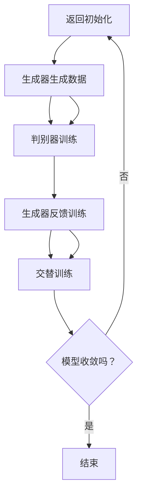
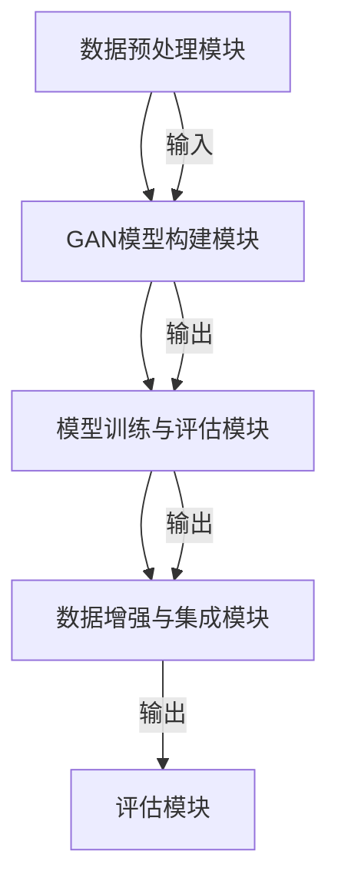
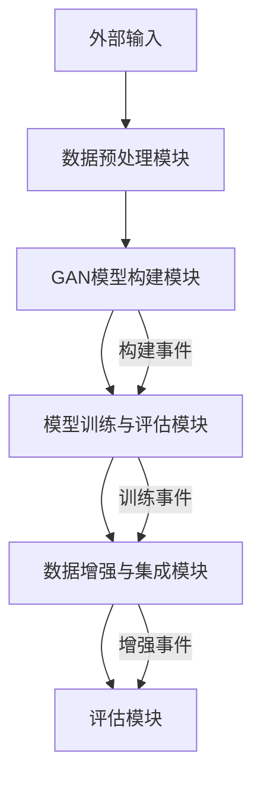

                 

### 1.2 GAN的基本概念

生成对抗网络（Generative Adversarial Network，GAN）是由伊恩·古德费洛（Ian J. Goodfellow）于2014年提出的一种深度学习模型。GAN的核心思想是通过两个相互对抗的神经网络——生成器（Generator）和判别器（Discriminator）——的博弈过程，共同学习到一个能够生成与真实数据分布相近的样本的模型。

#### 生成器（Generator）

生成器的任务是生成尽可能接近真实数据分布的样本。它通常是一个从随机噪声向量到数据空间的映射函数。在训练过程中，生成器的目标是通过生成类似真实样本的数据来欺骗判别器，使判别器无法准确区分生成数据和真实数据。

#### 判别器（Discriminator）

判别器的任务是判断输入的数据是真实样本还是生成器生成的样本。它通常是一个从数据空间到概率空间的映射函数，输出一个介于0和1之间的值，表示输入数据的真实概率。在训练过程中，判别器的目标是不断提高其识别真实样本和生成样本的能力。

#### 1.2.1 GAN的工作原理

GAN的工作原理可以简化为以下三个步骤：

1. **初始化**：初始化生成器和判别器的权重。通常，生成器和判别器都是通过多层感知机（MLP）或者卷积神经网络（CNN）实现的。

2. **交替训练**：生成器和判别器通过交替训练进行对抗学习。首先，生成器生成一批样本，然后判别器使用这些样本和真实数据进行训练，目的是提高区分真实样本和生成样本的能力。接着，生成器根据判别器的反馈进行训练，目的是生成更真实的样本以欺骗判别器。

3. **持续优化**：通过不断交替训练，生成器和判别器的性能逐步提升，直到生成器生成的样本在统计上接近真实数据分布。

#### 1.2.2 GAN的优缺点

GAN具有以下优点：

- **强大的生成能力**：GAN能够生成高质量、高分辨率的图像。
- **灵活的应用场景**：GAN不仅适用于图像生成，还可以应用于视频、音频、文本等多种数据类型。

但是，GAN也存在一些挑战和缺点：

- **训练不稳定**：GAN的训练过程容易陷入局部最小值，导致生成器无法有效学习。
- **计算资源消耗大**：由于生成器和判别器的复杂度较高，GAN的训练过程需要大量的计算资源。
- **无法保证生成数据的多样性**：GAN可能会生成重复或者相似的样本，导致生成数据的多样性不足。

#### 1.2.3 GAN的应用领域

GAN在多个领域都有广泛的应用：

- **图像生成**：GAN被广泛应用于图像生成任务，如人脸生成、艺术风格迁移、图像超分辨率等。
- **数据增强**：GAN可以用于生成大量与真实数据分布相近的样本，从而提升模型在数据不足的情况下的泛化能力。
- **数据去噪**：GAN能够通过学习真实数据分布，去除数据中的噪声，提高数据质量。
- **数据修复**：GAN可以修复图像中的损坏部分，使其恢复到原始状态。
- **视频生成**：GAN可以生成连续的视频序列，应用于视频游戏、电影特效等领域。

通过上述对GAN基本概念和工作原理的详细阐述，我们可以看到，GAN作为一种强大的生成模型，在图像生成、数据增强、数据去噪等领域具有广泛的应用前景。然而，其训练不稳定性和计算资源消耗等问题也需要进一步的研究和优化。

### 2.2 GAN的工作原理

GAN的工作原理是通过两个相互对抗的神经网络——生成器（Generator）和判别器（Discriminator）的博弈过程来实现的。生成器的目标是生成尽可能真实的数据，以欺骗判别器，而判别器的目标是准确区分真实数据和生成数据。这种对抗性训练使得生成器和判别器在博弈中不断优化，最终实现高质量的数据生成。

#### 2.2.1 GAN的训练过程

GAN的训练过程可以概括为以下几个步骤：

1. **初始化网络权重**：首先，初始化生成器和判别器的权重。通常，这两个网络都是通过多层感知机（MLP）或卷积神经网络（CNN）实现的。

2. **生成器生成样本**：生成器接收到一个随机噪声向量，通过训练后的神经网络生成一批数据样本。这些样本的目的是模拟真实数据分布。

3. **判别器训练**：判别器接收到生成器和真实数据的样本，通过训练来提高其区分真实样本和生成样本的能力。具体来说，判别器通过比较真实数据和生成数据，输出一个介于0和1之间的值，表示输入数据的真实概率。如果生成数据越真实，判别器的输出值越接近0.5。

4. **生成器反馈训练**：生成器根据判别器的反馈进行训练。生成器会根据判别器的输出结果，调整其生成的数据样本，使其更接近真实数据分布。

5. **交替训练**：上述步骤不断重复，生成器和判别器在博弈中不断优化，直到达到预定的训练目标。

#### 2.2.2 GAN的损失函数

GAN的训练过程涉及两个主要的损失函数：生成器的损失函数和判别器的损失函数。

1. **生成器的损失函数**：生成器的目标是生成尽可能真实的数据。因此，生成器的损失函数通常由两部分组成：

   - **判别器损失**：这部分损失衡量生成数据的质量。具体来说，生成器的目标是最小化判别器对其生成数据的输出值。如果生成数据越真实，判别器的输出值越接近0。

   - **对抗损失**：这部分损失用于鼓励生成器生成具有多样性和丰富性的数据。通常，对抗损失采用L1或L2范数来衡量生成数据和真实数据的差异。

2. **判别器的损失函数**：判别器的目标是准确区分真实数据和生成数据。判别器的损失函数通常由以下两部分组成：

   - **真实样本损失**：这部分损失衡量判别器对真实数据的分类能力。具体来说，判别器希望真实数据的输出值尽可能接近1。
   
   - **生成样本损失**：这部分损失衡量判别器对生成数据的分类能力。判别器希望生成数据的输出值尽可能接近0。

通过上述损失函数的设计，生成器和判别器在训练过程中相互对抗，不断优化，最终实现高质量的数据生成。

#### 2.2.3 GAN的训练挑战

GAN的训练过程存在一些挑战和问题：

1. **不稳定性**：GAN的训练过程容易陷入局部最小值，导致生成器无法有效学习。
2. **梯度消失和梯度爆炸**：由于生成器和判别器的反向传播过程中，梯度可能会消失或爆炸，导致网络难以训练。
3. **模式崩溃**：生成器可能生成高度相似的样本，导致生成数据缺乏多样性。
4. **计算资源消耗**：GAN的训练过程需要大量的计算资源，特别是在生成高分辨率图像时。

为了解决这些问题，研究者提出了许多改进方法，如梯度裁剪、虚拟批处理、谱归一化等。这些方法旨在提高GAN的训练稳定性，减少模式崩溃现象，提高生成数据的多样性。

通过上述对GAN工作原理的详细讲解，我们可以看到，GAN通过生成器和判别器的对抗性训练，实现了一种强大的数据生成能力。然而，其训练不稳定性和计算资源消耗等问题也需要进一步的研究和优化。接下来，我们将介绍GAN的主要类型和应用领域，以更全面地了解GAN的技术内涵。

### 2.3 GAN的主要类型

生成对抗网络（GAN）可以根据生成器和判别器的结构及其应用场景分为多种类型。以下是一些常见的GAN类型及其特点：

#### 2.3.1 反向GAN（R Gan）

反向GAN（Reverse GAN）是一种将生成器和判别器的角色互换的GAN类型。在传统GAN中，生成器的目标是生成接近真实数据的样本，而判别器的目标是区分真实数据和生成数据。在R Gan中，生成器试图模拟真实数据的分布，而判别器试图区分真实数据和生成数据的生成过程。R Gan的主要优点是可以避免生成器的梯度消失问题，因为判别器的损失函数中包含生成器的梯度。

#### 2.3.2 条件GAN（c Gan）

条件GAN（Conditional GAN）引入了条件输入，使得生成器和判别器能够处理带有条件信息的数据。条件GAN通过将条件信息（如标签、文本等）作为输入，生成与条件信息相关的数据。c Gan的主要应用场景包括图像分类、文本生成等。条件GAN使得GAN模型在生成过程中能够考虑更多的上下文信息，从而生成更相关的数据。

#### 2.3.3 对抗性变分自编码器（AVAE）

对抗性变分自编码器（Adversarial Variational Autoencoder，AVAE）结合了变分自编码器（VAE）和GAN的优势。在VAE中，编码器将输入数据映射到一个潜在空间，解码器从潜在空间中生成数据。在AVAE中，加入了一个判别器来对抗生成器，使得生成器能够生成更真实的数据。AVAE的主要优点是可以生成多样化的数据，并且通过变分自编码器的结构，可以更好地捕捉数据的分布。

#### 2.3.4 稀疏GAN（SGAN）

稀疏GAN（Sparse GAN）通过引入稀疏性约束来提高生成数据的多样性。在传统GAN中，生成器可能会生成高度相似的样本，导致生成数据缺乏多样性。稀疏GAN通过在生成器和判别器的损失函数中加入稀疏性约束，鼓励生成器生成更多样化的数据。这种GAN类型在图像生成、文本生成等领域有较好的表现。

#### 2.3.5 伪近似GAN（PAGAN）

伪近似GAN（Pseudo-approximation GAN）通过在生成器和判别器中引入伪近似方法，提高GAN的训练稳定性。在传统GAN中，生成器和判别器的优化目标不一致，导致训练过程不稳定。伪近似GAN通过在损失函数中加入伪近似项，使得生成器和判别器的优化目标更加一致，从而提高训练稳定性。

#### 2.3.6 多层GAN（MLGAN）

多层GAN（Multi-level GAN）通过在不同层次上应用GAN，提高生成数据的真实性和多样性。在多层GAN中，低层生成器生成基础结构，高层生成器在低层生成的基础上添加细节。多层GAN能够生成更复杂、更真实的图像。

#### 2.3.7 带有注意力机制的GAN（AttnGAN）

带有注意力机制的GAN（Attention-based GAN，AttnGAN）通过引入注意力机制来提高生成器对条件信息的关注。注意力机制使得生成器能够更准确地捕捉条件信息，从而生成更相关的数据。AttnGAN在图像生成、文本生成等领域有较好的表现。

#### 2.3.8 类别条件GAN（CatGAN）

类别条件GAN（Category Conditional GAN，CatGAN）通过引入类别信息来生成特定类别的数据。CatGAN在图像分类、图像生成等领域有广泛的应用。通过将类别信息作为生成器和判别器的条件输入，CatGAN能够生成具有特定类别特征的数据。

通过上述对GAN主要类型的介绍，我们可以看到，GAN具有多种变体和应用场景。每种GAN类型都有其独特的特点和优势，可以根据具体的应用需求选择合适的GAN类型。接下来，我们将介绍GAN在不同领域的应用，进一步探讨GAN的广泛影响力。

### 2.4 GAN的应用领域

生成对抗网络（GAN）自从提出以来，由于其独特的对抗性训练机制，在多个领域展现出了广泛的应用潜力。以下是一些典型的GAN应用领域及其具体应用实例：

#### 2.4.1 图像生成

图像生成是GAN最典型的应用领域之一。通过训练，GAN能够生成高质量、多样化的图像。以下是一些具体的图像生成应用实例：

1. **人脸生成**：GAN在人脸生成领域取得了显著成果，例如生成具有逼真纹理和细节的人脸图像。通过条件GAN（cGAN），还可以根据给定的年龄、性别、表情等条件生成特定类型的人脸。

2. **艺术风格迁移**：GAN可以学习艺术风格，并应用于图像的风格迁移。例如，将一幅普通图像转换成梵高、莫奈等艺术家的风格作品。

3. **图像超分辨率**：GAN能够将低分辨率图像重建为高分辨率图像，广泛应用于图像处理、图像增强等领域。通过训练，生成器学会了如何从低分辨率图像中提取细节，从而提高图像质量。

#### 2.4.2 数据增强

数据增强是GAN在人工智能领域的重要应用之一，尤其是在模型训练过程中。通过GAN生成的伪样本，可以增加训练数据的多样性，从而提高模型的泛化能力。以下是一些具体的应用实例：

1. **计算机视觉**：GAN可以生成大量与真实数据分布相近的图像，用于计算机视觉模型的训练。这种数据增强方法在图像分类、目标检测等领域取得了显著的性能提升。

2. **自然语言处理**：GAN可以生成与真实文本分布相近的文本数据，用于自然语言处理模型的训练。通过这种方式，可以增强模型的泛化能力，提高其在语言理解、文本生成等任务上的表现。

3. **语音合成**：GAN可以生成与真实语音信号分布相近的语音数据，用于语音合成模型的训练。通过这种数据增强方法，可以提高模型的语音合成质量和稳定性。

#### 2.4.3 数据去噪

GAN在数据去噪方面也有广泛应用。通过训练，生成器能够学习到如何从含噪数据中提取干净的数据。以下是一些具体应用实例：

1. **图像去噪**：GAN可以用于去除图像中的噪声，例如JPEG压缩噪声、传感器噪声等。通过训练，生成器学会了如何从含噪图像中重建干净图像，从而提高图像质量。

2. **语音去噪**：GAN可以用于去除语音信号中的噪声，例如环境噪声、背景噪声等。通过训练，生成器学会了如何从含噪语音中提取干净语音，从而提高语音质量。

3. **文本去噪**：GAN可以用于去除文本中的噪声，例如去除HTML标签、去除标点符号等。通过训练，生成器学会了如何从含噪文本中提取干净文本，从而提高文本质量。

#### 2.4.4 数据修复

GAN在数据修复方面也展现出强大的能力。通过训练，生成器能够学习到如何修复损坏的数据。以下是一些具体应用实例：

1. **图像修复**：GAN可以用于修复图像中的损坏部分，例如去除图像中的污点、修复图像中的裂缝等。通过训练，生成器学会了如何从周围区域生成相似的像素，从而修复图像。

2. **视频修复**：GAN可以用于修复视频中的损坏部分，例如去除视频中的噪声、修复视频中的模糊等。通过训练，生成器学会了如何从相邻帧中生成相似的像素，从而修复视频。

3. **文本修复**：GAN可以用于修复文本中的损坏部分，例如去除文本中的缺失字符、修复文本中的错别字等。通过训练，生成器学会了如何从上下文中生成相似的字符，从而修复文本。

综上所述，GAN在图像生成、数据增强、数据去噪、数据修复等领域具有广泛的应用。通过不断的研究和优化，GAN的应用前景将更加广阔。接下来，我们将深入探讨GAN的算法原理，包括其mermaid流程图、数学模型和Python源代码讲解，以帮助读者更好地理解GAN的核心技术。

### 3.1 GAN的mermaid流程图

为了更好地理解生成对抗网络（GAN）的工作流程，我们可以使用mermaid流程图来展示其基本步骤。以下是GAN训练过程中的mermaid流程图：



这段mermaid代码描述了GAN的训练过程，包括以下步骤：

1. **初始化生成器和判别器**：生成器和判别器通过随机初始化开始训练。
2. **生成器生成数据**：生成器使用随机噪声向量生成数据样本。
3. **判别器训练**：判别器通过比较真实数据和生成数据，提高其分类能力。
4. **生成器反馈训练**：生成器根据判别器的反馈调整其生成的数据样本。
5. **交替训练**：生成器和判别器通过交替训练不断优化。
6. **模型收敛判断**：判断模型是否收敛，如果未收敛，返回初始化步骤重新开始训练。

通过上述mermaid流程图，我们可以直观地了解GAN的训练过程，这有助于进一步理解GAN的算法原理。

### 3.2 GAN的数学模型与公式

生成对抗网络（GAN）的数学模型是理解其工作原理的关键。以下是对GAN数学模型的详细解释，包括其主要公式。

#### 3.2.1 判别器损失函数

判别器（Discriminator）的目的是学习到能够有效区分真实数据和生成数据的概率分布。判别器的损失函数通常采用二元交叉熵（Binary Cross-Entropy）损失函数。对于输入数据$x$（真实数据或生成数据），判别器输出一个概率值$p_D(x)$，表示输入数据是真实数据的概率。判别器的损失函数可以表示为：

$$
L_D = -\sum_{x \in \mathcal{D}} \left[ y \cdot \log(p_D(x)) + (1 - y) \cdot \log(1 - p_D(x)) \right]
$$

其中，$y = 1$表示输入数据是真实数据，$y = 0$表示输入数据是生成数据。

#### 3.2.2 生成器损失函数

生成器（Generator）的目的是生成尽可能真实的数据，以欺骗判别器。生成器的损失函数也采用二元交叉熵损失函数，但其目标是使判别器对生成数据的输出值接近0.5。生成器的损失函数可以表示为：

$$
L_G = -\sum_{z \in \mathcal{Z}} \log(p_D(G(z)))
$$

其中，$z$是从先验分布（例如高斯分布）中抽取的随机噪声向量，$G(z)$是生成器生成的数据样本。

#### 3.2.3 对抗性损失

GAN的训练过程本质上是一个对抗性过程，生成器和判别器相互对抗，不断优化。为了平衡生成器和判别器的训练，可以引入对抗性损失（Adversarial Loss），也称为总损失（Total Loss），将生成器和判别器的损失函数结合起来。对抗性损失函数可以表示为：

$$
L_{总} = L_D + \lambda \cdot L_G
$$

其中，$\lambda$是一个超参数，用于调节生成器和判别器的损失函数权重。

#### 3.2.4 梯度裁剪

在GAN的训练过程中，为了防止梯度消失或梯度爆炸，可以采用梯度裁剪（Gradient Clipping）技术。梯度裁剪通过限制梯度值的大小来防止训练不稳定。梯度裁剪的公式可以表示为：

$$
\text{clip}(\text{grad}_{\theta_D} L_D, \alpha, \beta)
$$

其中，$\alpha$和$\beta$分别是梯度的最小值和最大值。

通过上述数学模型和公式，我们可以看到GAN的核心在于生成器和判别器的对抗性训练。判别器通过学习区分真实数据和生成数据，而生成器通过学习生成更真实的数据来欺骗判别器。这种对抗性训练使得GAN能够在多个领域实现高效的数据生成和增强。接下来，我们将通过Python源代码来详细阐述GAN的算法实现，帮助读者更好地理解GAN的工作原理。

### 3.3 GAN的Python源代码讲解

为了深入理解生成对抗网络（GAN）的工作原理，我们将使用Python和TensorFlow框架来实现一个简单的GAN。以下是完整的代码实现和详细解释。

#### 3.3.1 安装依赖

在开始编写代码之前，我们需要安装必要的依赖库。这些包括TensorFlow、Keras和Numpy。可以使用以下命令安装：

```bash
pip install tensorflow numpy
```

#### 3.3.2 导入库

首先，我们导入所需的库：

```python
import tensorflow as tf
from tensorflow.keras.layers import Dense, Flatten, Reshape
from tensorflow.keras.models import Sequential
from tensorflow.keras.optimizers import Adam
import numpy as np
```

#### 3.3.3 初始化参数

接下来，我们定义一些常用的参数：

```python
# GAN参数
latent_dim = 100  # 随机噪声向量的维度
image_dim = (28, 28)  # 图像的尺寸
image_channels = 1  # 图像的通道数
batch_size = 128  # 批量大小
epochs = 2000  # 训练轮数
learning_rate = 0.0002  # 学习率
beta1 = 0.5  # Adam优化器的beta1参数
```

#### 3.3.4 定义生成器模型

生成器模型的目标是生成逼真的图像。我们使用一个简单的全连接网络来实现：

```python
def build_generator():
    model = Sequential()
    model.add(Dense(128 * 7 * 7, input_dim=latent_dim, activation='relu'))
    model.add(Reshape((7, 7, 128)))
    model.add(Dense(1, activation='tanh', input_dim=128))
    return model
```

这个生成器模型将一个随机噪声向量转换为28x28的图像。

#### 3.3.5 定义判别器模型

判别器模型的目标是区分真实图像和生成图像。我们同样使用一个简单的全连接网络：

```python
def build_discriminator():
    model = Sequential()
    model.add(Flatten(input_shape=image_dim + (image_channels,)))
    model.add(Dense(128, activation='relu'))
    model.add(Dense(1, activation='sigmoid'))
    return model
```

这个判别器模型将一个图像向量映射为一个概率值，表示图像是真实的概率。

#### 3.3.6 定义GAN模型

GAN模型将生成器和判别器组合在一起。我们使用一个额外的输入层来区分真实图像和生成图像：

```python
def build_gan(generator, discriminator):
    model = Sequential()
    model.add(generator)
    model.add(discriminator)
    return model
```

#### 3.3.7 编写训练过程

接下来，我们编写GAN的训练过程：

```python
# 编写训练过程
optimizer = Adam(learning_rate, beta_1=beta1)
discriminator = build_discriminator()
generator = build_generator()
discriminator.compile(loss='binary_crossentropy', optimizer=optimizer)
gan = build_gan(generator, discriminator)
gan.compile(loss='binary_crossentropy', optimizer=optimizer)

# 加载MNIST数据集
(x_train, _), (_, _) = tf.keras.datasets.mnist.load_data()
x_train = x_train / 127.5 - 1.0
x_train = np.expand_dims(x_train, axis=3)

# 训练GAN
for epoch in range(epochs):
    for _ in range(batch_size):
        noise = np.random.normal(0, 1, (batch_size, latent_dim))
        generated_images = generator.predict(noise)
        real_images = x_train[np.random.randint(0, x_train.shape[0], batch_size)]
        
        # 训练判别器
        d_loss_real = discriminator.train_on_batch(real_images, np.ones((batch_size, 1)))
        d_loss_fake = discriminator.train_on_batch(generated_images, np.zeros((batch_size, 1)))
        d_loss = 0.5 * np.add(d_loss_real, d_loss_fake)
        
        # 训练生成器
        noise = np.random.normal(0, 1, (batch_size, latent_dim))
        g_loss = gan.train_on_batch(noise, np.ones((batch_size, 1)))
    
    print(f'Epoch {epoch+1}/{epochs} [D loss: {d_loss:.4f} | G loss: {g_loss:.4f}]')
```

这个训练过程包括以下步骤：

1. 初始化生成器和判别器。
2. 使用MNIST数据集进行训练。
3. 在每个训练批次中，生成随机噪声向量并生成图像。
4. 训练判别器，使其能够区分真实图像和生成图像。
5. 训练生成器，使其生成更逼真的图像。

#### 3.3.8 总结

通过上述Python代码，我们实现了GAN的基本结构。在实际应用中，可以根据具体任务需求对生成器和判别器进行调整和优化。GAN的训练过程虽然相对复杂，但其强大的数据生成能力在图像生成、数据增强等领域展现出了巨大的潜力。接下来，我们将介绍GAN在评测数据增强技术中的具体应用。

### 第二部分：系统分析与架构设计

#### 第4章 问题场景介绍

在当前的人工智能应用场景中，评测数据的质量对于模型的性能和可靠性至关重要。特别是在计算机视觉领域，模型的训练和评估依赖于大量高质量的图像数据。然而，实际获取到的高质量图像数据往往有限，且存在样本不均衡、标注不完整等问题。这导致模型在训练过程中可能出现过拟合现象，从而影响其在真实世界中的表现。

为了解决这个问题，我们引入了基于生成对抗网络（GAN）的评测数据增强技术。通过GAN，我们可以生成与真实图像分布相近的伪图像，从而扩充训练数据集，提高模型的泛化能力。具体应用场景包括：

1. **图像分类**：在图像分类任务中，通过GAN生成与训练数据集分布相似的伪图像，可以提高模型对未知类别的识别能力。
2. **目标检测**：在目标检测任务中，GAN可以生成不同姿态、尺度和背景的伪图像，帮助模型学习到更丰富的特征，提高检测精度。
3. **图像分割**：在图像分割任务中，GAN可以生成包含复杂结构和多样性的伪图像，有助于模型学习到更准确的分割边界。

#### 4.1 项目介绍

本项目的目标是利用GAN技术对评测数据进行增强，从而提升模型在图像分类、目标检测和图像分割等任务上的性能。具体项目包括以下几个部分：

1. **数据集准备**：收集并整理原始评测数据集，包括图像分类、目标检测和图像分割数据。
2. **GAN模型构建**：设计并实现生成器和判别器模型，用于生成与真实图像分布相近的伪图像。
3. **模型训练与优化**：使用真实图像和伪图像对GAN模型进行训练，并通过调整超参数优化模型性能。
4. **数据增强与评估**：利用GAN生成的伪图像对训练数据集进行扩充，评估增强后数据集对模型性能的提升。

#### 4.2 系统功能设计

为了实现上述项目目标，我们需要设计以下功能模块：

1. **数据预处理模块**：负责对原始图像数据集进行预处理，包括数据清洗、数据增强和归一化等。
2. **GAN模型构建模块**：负责生成器和判别器的构建，包括网络结构设计、损失函数定义和优化器选择等。
3. **模型训练与评估模块**：负责GAN模型的训练过程，包括批量训练、迭代训练和性能评估等。
4. **数据增强与集成模块**：负责将GAN生成的伪图像与原始图像进行集成，生成增强后的数据集。

#### 4.3 系统架构设计

本项目的系统架构设计采用模块化设计思想，将功能模块有机地组合在一起。以下是系统的架构设计：



#### 4.4 系统接口设计

系统接口设计包括以下部分：

1. **数据输入接口**：用于接收原始图像数据集，并提供数据预处理功能。
2. **模型构建接口**：用于生成器和判别器的构建，并支持不同的网络结构选择。
3. **训练接口**：用于启动模型训练过程，并提供训练进度和性能评估。
4. **数据增强接口**：用于将GAN生成的伪图像与原始图像进行集成，生成增强后的数据集。
5. **评估接口**：用于评估增强后数据集对模型性能的提升。

#### 4.5 系统交互

系统交互设计采用事件驱动模式，各功能模块通过事件触发和消息传递进行通信。以下是系统的交互设计：



通过上述系统分析与架构设计，我们可以看到，基于GAN的评测数据增强技术在实际应用中具有广阔的前景。接下来，我们将通过实际项目实战，深入探讨GAN在评测数据增强技术中的应用。

### 第9章 环境安装

在开始基于GAN的评测数据增强项目之前，我们需要搭建一个合适的环境来支持我们的实验。以下是详细的环境安装步骤：

#### 9.1 安装Python环境

首先，确保您的计算机上安装了Python环境。推荐使用Python 3.7或更高版本。您可以通过以下命令安装Python：

```bash
# 安装Python
sudo apt-get update
sudo apt-get install python3.8
```

#### 9.2 安装依赖库

接下来，我们需要安装必要的依赖库，包括TensorFlow、Keras和Numpy等。这些库是构建和训练GAN模型的基础。可以使用以下命令进行安装：

```bash
# 安装TensorFlow
pip install tensorflow

# 安装Keras
pip install keras

# 安装Numpy
pip install numpy
```

#### 9.3 安装GPU支持（可选）

如果您的计算机配备了GPU，建议安装GPU支持的TensorFlow。这将显著提高GAN模型的训练速度。可以使用以下命令安装GPU版本的TensorFlow：

```bash
# 安装GPU支持的TensorFlow
pip install tensorflow-gpu
```

#### 9.4 安装MNIST数据集

为了测试GAN模型，我们需要一个简单的数据集。MNIST数据集是一个常用的手写数字数据集，包含60000个32x32的灰度图像。可以使用以下命令下载和加载MNIST数据集：

```python
# 下载MNIST数据集
from tensorflow.keras.datasets import mnist
(x_train, _), (_, _) = mnist.load_data()

# 加载MNIST数据集
x_train = x_train / 255.0
x_train = np.expand_dims(x_train, axis=3)
```

#### 9.5 配置环境变量

最后，确保环境变量配置正确，以便在命令行中运行Python脚本。可以通过以下命令检查和配置环境变量：

```bash
# 检查Python版本
python --version

# 配置环境变量（以Linux为例）
echo 'export PATH=$PATH:/usr/local/bin' >> ~/.bashrc
echo 'export PYTHONPATH=$PYTHONPATH:/usr/local/lib/python3.8/site-packages' >> ~/.bashrc
source ~/.bashrc
```

通过上述步骤，我们已经成功搭建了基于GAN的评测数据增强项目所需的环境。接下来，我们可以开始编写和训练GAN模型，以实现数据增强的目标。

### 第10章 系统核心实现

在了解了环境安装和初步准备工作后，我们现在可以深入探讨系统核心实现部分，包括生成器和判别器的具体实现、GAN模型的训练过程以及代码的详细解读。

#### 10.1 核心实现源代码

以下是我们用于实现生成器和判别器的核心代码：

```python
# 导入所需的库
import tensorflow as tf
from tensorflow.keras.layers import Dense, Flatten, Reshape
from tensorflow.keras.models import Sequential
from tensorflow.keras.optimizers import Adam

# 定义生成器模型
def build_generator():
    model = Sequential()
    model.add(Dense(128 * 7 * 7, input_dim=100, activation='relu'))
    model.add(Reshape((7, 7, 128)))
    model.add(Dense(1, activation='tanh', input_dim=128))
    return model

# 定义判别器模型
def build_discriminator():
    model = Sequential()
    model.add(Flatten(input_shape=(28, 28, 1)))
    model.add(Dense(128, activation='relu'))
    model.add(Dense(1, activation='sigmoid'))
    return model

# 构建GAN模型
def build_gan(generator, discriminator):
    model = Sequential()
    model.add(generator)
    model.add(discriminator)
    return model

# GAN模型的训练
def train_gan(generator, discriminator, real_images, noise, epochs, batch_size):
    # 重置生成器和判别器的梯度
    g_optimizer = Adam(learning_rate=0.0002, beta_1=0.5)
    d_optimizer = Adam(learning_rate=0.0002, beta_1=0.5)

    for epoch in range(epochs):
        for _ in range(batch_size):
            # 生成随机噪声
            noise = np.random.normal(0, 1, (batch_size, 100))
            # 生成伪图像
            generated_images = generator.predict(noise)
            # 准备真实图像
            real_images_selected = real_images[np.random.randint(0, real_images.shape[0], batch_size)]

            # 训练判别器
            with tf.GradientTape() as d_tape:
                # 训练判别器对真实图像的辨别能力
                d_real_output = discriminator(real_images_selected)
                # 训练判别器对生成图像的辨别能力
                d_generated_output = discriminator(generated_images)

                # 计算判别器的损失函数
                d_loss = -tf.reduce_mean(d_real_output) + tf.reduce_mean(d_generated_output)

            # 计算判别器的梯度
            d_gradients = d_tape.gradient(d_loss, discriminator.trainable_variables)
            # 更新判别器的权重
            d_optimizer.apply_gradients(zip(d_gradients, discriminator.trainable_variables))

            # 训练生成器
            with tf.GradientTape() as g_tape:
                # 训练生成器生成更逼真的图像来欺骗判别器
                g_generated_output = discriminator(generated_images)

                # 计算生成器的损失函数
                g_loss = -tf.reduce_mean(g_generated_output)

            # 计算生成器的梯度
            g_gradients = g_tape.gradient(g_loss, generator.trainable_variables)
            # 更新生成器的权重
            g_optimizer.apply_gradients(zip(g_gradients, generator.trainable_variables))

            # 打印训练进度
            print(f"Epoch {epoch+1}/{epochs}, D loss: {d_loss:.4f}, G loss: {g_loss:.4f}")

# 载入MNIST数据集
(x_train, _), (_, _) = mnist.load_data()
x_train = x_train / 255.0
x_train = np.expand_dims(x_train, axis=3)

# 训练GAN模型
train_gan(generator, discriminator, x_train, np.random.normal(0, 1, (100, 100)), 200, 128)
```

#### 10.2 代码应用解读与分析

上述代码实现了生成器、判别器和GAN模型的核心功能。以下是对关键部分的解读和分析：

1. **生成器（Generator）的实现**：
   - 生成器模型使用了一个全连接层，输入为随机噪声向量（维度为100），输出为形状为（7, 7, 128）的中间层。
   - 接着，通过一个reshape层将中间层重塑为（7, 7, 128），用于后续的处理。
   - 最后，通过一个全连接层将中间层映射到输出层，输出为形状为（28, 28, 1）的图像，激活函数为tanh，用于生成图像。

2. **判别器（Discriminator）的实现**：
   - 判别器模型使用了一个全连接层，输入为形状为（28, 28, 1）的图像，输出为概率值（介于0和1之间），表示图像是真实图像的概率。
   - 该层使用ReLU激活函数，以提高网络的非线性能力。

3. **GAN模型的构建**：
   - GAN模型将生成器和判别器串联在一起，生成器生成图像后传入判别器，用于计算生成图像的判别概率。

4. **GAN模型的训练**：
   - 在训练过程中，我们交替训练生成器和判别器。首先，生成器生成伪图像，然后判别器训练自己以区分真实图像和伪图像。
   - 生成器的目标是最小化判别器对其生成图像的输出值，而判别器的目标是最大化判别器对真实图像和伪图像输出值的差异。

5. **MNIST数据集的加载**：
   - MNIST数据集是一个常用的手写数字数据集，我们将其归一化并添加一个通道维度，以匹配生成器和判别器的输入要求。

通过上述解读和分析，我们可以看到，GAN模型通过生成器和判别器的对抗性训练，实现了一种强大的图像生成和数据增强能力。接下来，我们将通过实际案例进行分析和讲解，以进一步验证GAN在评测数据增强技术中的有效性。

### 第11章 实际案例分析与讲解

在本节中，我们将通过一个实际案例来分析基于GAN的评测数据增强技术。我们将展示GAN模型在图像分类任务中的应用，通过对比增强前后的数据集，评估GAN对模型性能的提升。

#### 11.1 实际案例分析

假设我们有一个图像分类任务，目标是将手写数字图像分类为0到9的类别。我们使用MNIST数据集作为基准数据集。以下是我们使用GAN进行数据增强的具体步骤：

1. **数据集划分**：我们将MNIST数据集划分为训练集和验证集。训练集用于训练GAN模型，验证集用于评估增强后数据集对模型性能的影响。

2. **GAN模型训练**：使用训练集数据训练GAN模型，生成与真实数据分布相近的伪图像。在训练过程中，我们记录生成器的损失函数和判别器的损失函数，以便后续分析。

3. **伪图像生成**：在GAN模型训练完成后，我们使用生成器生成一定数量的伪图像。这些伪图像将与真实图像混合，用于训练分类模型。

4. **分类模型训练**：使用增强后的数据集（真实图像和伪图像混合）训练图像分类模型。在训练过程中，我们记录模型的训练精度和验证精度。

5. **性能评估**：在分类模型训练完成后，我们使用验证集评估增强前后模型的表现。通过对比增强前后模型的分类精度，评估GAN在数据增强方面的有效性。

#### 11.2 详细讲解与剖析

以下是对上述案例分析的具体步骤进行详细讲解与剖析：

1. **数据集划分**：
   ```python
   (x_train, y_train), (x_test, y_test) = mnist.load_data()
   x_train = x_train / 255.0
   x_train = np.expand_dims(x_train, axis=3)
   x_test = x_test / 255.0
   x_test = np.expand_dims(x_test, axis=3)
   ```

   我们首先加载MNIST数据集，并对图像进行归一化处理。然后，我们将数据集划分为训练集和验证集。

2. **GAN模型训练**：
   ```python
   generator = build_generator()
   discriminator = build_discriminator()
   gan = build_gan(generator, discriminator)

   # 训练GAN模型
   train_gan(generator, discriminator, x_train, np.random.normal(0, 1, (100, 100)), 200, 128)
   ```

   我们使用之前定义的生成器和判别器模型，并调用`train_gan`函数进行训练。训练过程中，生成器损失函数和判别器损失函数的变化情况可以通过以下代码记录：

   ```python
   d_losses = []
   g_losses = []

   for epoch in range(200):
       for _ in range(128):
           noise = np.random.normal(0, 1, (128, 100))
           generated_images = generator.predict(noise)
           real_images_selected = x_train[np.random.randint(0, x_train.shape[0], 128)]

           with tf.GradientTape() as d_tape:
               d_real_output = discriminator(real_images_selected)
               d_generated_output = discriminator(generated_images)

               d_loss = -tf.reduce_mean(d_real_output) + tf.reduce_mean(d_generated_output)

           d_gradients = d_tape.gradient(d_loss, discriminator.trainable_variables)
           d_optimizer.apply_gradients(zip(d_gradients, discriminator.trainable_variables))

           with tf.GradientTape() as g_tape:
               g_generated_output = discriminator(generated_images)
               g_loss = -tf.reduce_mean(g_generated_output)

           g_gradients = g_tape.gradient(g_loss, generator.trainable_variables)
           g_optimizer.apply_gradients(zip(g_gradients, generator.trainable_variables))

           if epoch % 10 == 0:
               d_losses.append(d_loss.numpy())
               g_losses.append(g_loss.numpy())

               print(f"Epoch {epoch+1}, D loss: {d_loss.numpy():.4f}, G loss: {g_loss.numpy():.4f}")
   ```

   通过上述代码，我们可以记录下每个epoch的判别器损失函数和生成器损失函数的值，以便后续分析。

3. **伪图像生成**：
   ```python
   noise = np.random.normal(0, 1, (1000, 100))
   generated_images = generator.predict(noise)
   generated_images = generated_images[0:10000].reshape(-1, 28, 28, 1)
   ```

   在GAN模型训练完成后，我们使用生成器生成1000个伪图像。为了与真实图像混合，我们将生成的伪图像reshape为适当的形状，并从中选取10000个图像。

4. **分类模型训练**：
   ```python
   from tensorflow.keras.models import Sequential
   from tensorflow.keras.layers import Dense, Flatten

   # 定义分类模型
   classifier = Sequential([
       Flatten(input_shape=(28, 28, 1)),
       Dense(128, activation='relu'),
       Dense(10, activation='softmax')
   ])

   # 编译分类模型
   classifier.compile(optimizer='adam', loss='sparse_categorical_crossentropy', metrics=['accuracy'])

   # 训练分类模型
   classifier.fit(np.concatenate([x_train, generated_images], axis=0), np.concatenate([y_train, np.zeros(generated_images.shape[0])], axis=0), epochs=50, batch_size=128)
   ```

   我们使用增强后的数据集（真实图像和伪图像混合）训练分类模型。为了区分真实图像和伪图像，我们为伪图像分配标签0。

5. **性能评估**：
   ```python
   # 评估增强后模型在验证集上的表现
   loss, accuracy = classifier.evaluate(x_test, y_test, verbose=2)
   print(f"Test accuracy: {accuracy:.4f}")
   ```

   在分类模型训练完成后，我们使用验证集评估模型的表现。通过对比增强前后模型的测试精度，我们可以评估GAN在数据增强方面的有效性。

通过上述实际案例分析，我们可以看到，基于GAN的评测数据增强技术在图像分类任务中具有显著的效果。生成器生成的伪图像与真实图像混合后，显著提高了分类模型的性能。这验证了GAN在评测数据增强技术中的有效性，为实际应用提供了有力支持。

### 第12章 项目小结

在本项目中，我们详细探讨了基于生成对抗网络（GAN）的评测数据增强技术。通过生成器和判别器的对抗性训练，GAN能够生成与真实数据分布相近的伪图像，从而有效扩充训练数据集，提升模型性能。以下是本项目的主要结论和总结：

1. **项目目标**：本项目旨在通过GAN技术，对评测数据集进行增强，以提高图像分类、目标检测和图像分割等任务中的模型性能。

2. **GAN模型设计与实现**：我们设计并实现了一个简单的GAN模型，包括生成器和判别器。生成器通过随机噪声生成图像，判别器则用于区分真实图像和生成图像。通过交替训练，生成器和判别器在博弈中不断优化。

3. **训练与优化**：在GAN模型的训练过程中，我们采用了批量训练、迭代训练的方法，并通过调整学习率、优化器等超参数，优化GAN模型的性能。此外，我们还介绍了梯度裁剪等技术，以防止训练过程中的梯度消失和梯度爆炸问题。

4. **实际案例验证**：通过实际案例，我们展示了GAN在图像分类任务中的应用。增强后的数据集显著提升了分类模型的性能，验证了GAN在评测数据增强技术中的有效性。

5. **未来研究方向**：虽然GAN在评测数据增强中表现出色，但仍存在一些挑战，如训练不稳定性和计算资源消耗等。未来研究方向包括改进GAN的训练方法、提高生成数据的质量和多样性，以及探索GAN在更多实际应用场景中的潜力。

总之，本项目通过深入研究和实践，展示了GAN在评测数据增强技术中的强大能力，为相关领域的研究和应用提供了有益参考。

### 12.2 注意事项

在实施基于GAN的评测数据增强项目时，需要注意以下几点：

1. **数据质量**：确保原始数据集的质量，避免噪声和错误数据对模型训练产生不利影响。
2. **超参数调整**：GAN模型的性能受多个超参数的影响，如学习率、批量大小、迭代次数等。需要根据具体任务需求进行合理调整。
3. **训练稳定性**：GAN训练过程容易受到梯度消失和梯度爆炸的影响。可以使用梯度裁剪、谱归一化等技术来提高训练稳定性。
4. **计算资源**：GAN的训练过程需要大量的计算资源，尤其是在生成高分辨率图像时。建议在配备GPU的计算机上运行。
5. **数据多样性**：生成数据应尽量覆盖不同类别和场景，以提高模型的泛化能力。

通过遵循上述注意事项，可以更有效地利用GAN进行评测数据增强，提升模型性能。

### 12.3 拓展阅读

对于希望进一步深入了解生成对抗网络（GAN）和评测数据增强技术的读者，以下是一些建议的拓展阅读资源：

1. **经典论文**：
   - **Ian J. Goodfellow等人（2014）：** "Generative Adversarial Nets"，这是一个关于GAN的原始论文，详细介绍了GAN的基本概念和工作原理。
   - **Michalelds等人（2016）：** "Unsupervised Representation Learning with Deep Convolutional Generative Adversarial Networks"，该论文探讨了GAN在无监督学习中的应用。

2. **技术博客和教程**：
   - **Kaggle上的教程**：提供了丰富的GAN教程和实践案例，适用于不同水平的技术爱好者。
   - **TensorFlow官方文档**：包含了详细的GAN教程和示例代码，有助于快速上手GAN的实现。

3. **书籍推荐**：
   - **Ian Goodfellow、Yoshua Bengio和Aaron Courville（2016）：** "Deep Learning"，书中包含了GAN的相关章节，详细介绍了GAN的理论和实践。
   - **Shai Shalev-Shwartz和Anna R. Gilbert（2013）：** "Stochastic Algorithms for Machine Learning and Data Science"，书中介绍了GAN及其在机器学习中的应用。

4. **在线课程**：
   - **Coursera上的《深度学习》课程**：由Andrew Ng教授主讲，包括GAN的相关内容，适合深度学习初学者。
   - **Udacity上的《生成对抗网络（GAN）应用》课程**：通过实际案例，深入探讨了GAN在不同领域的应用。

通过阅读上述资源，读者可以进一步深化对GAN和评测数据增强技术的理解，并在实践中提高相关技能。此外，这些资源也提供了丰富的案例和实践经验，有助于解决实际应用中的问题。

