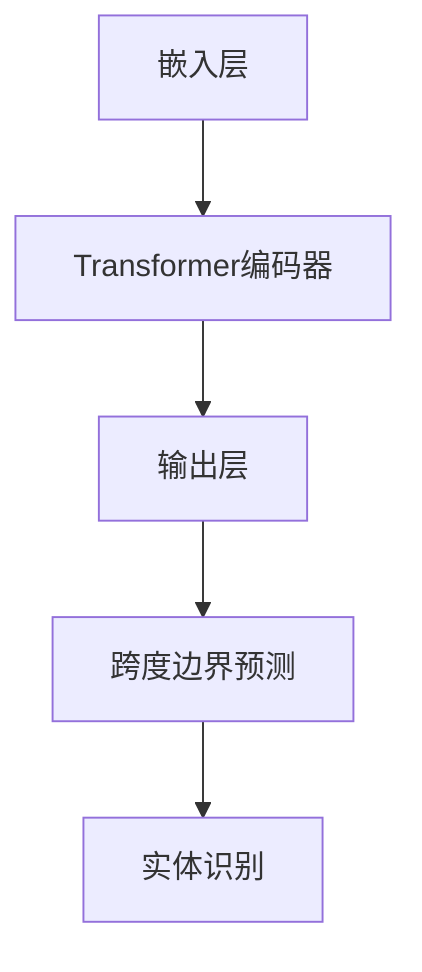
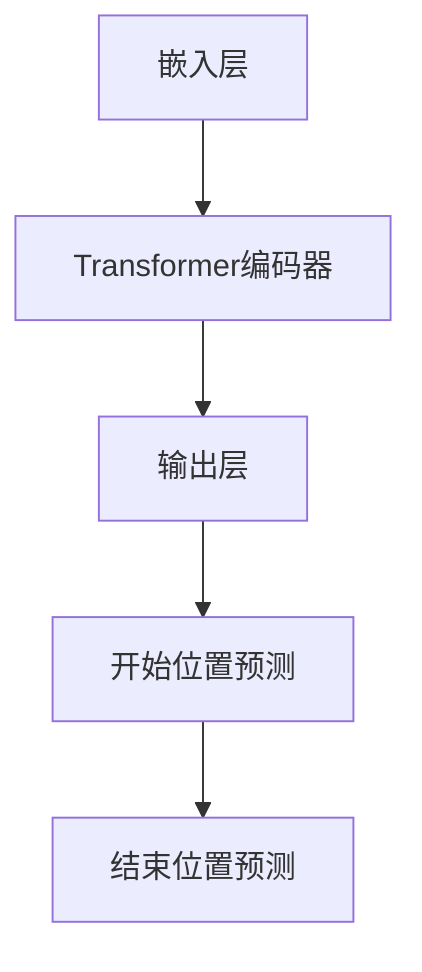
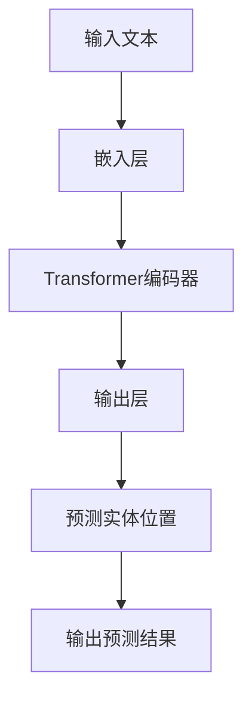
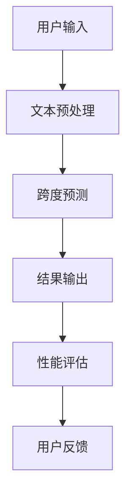
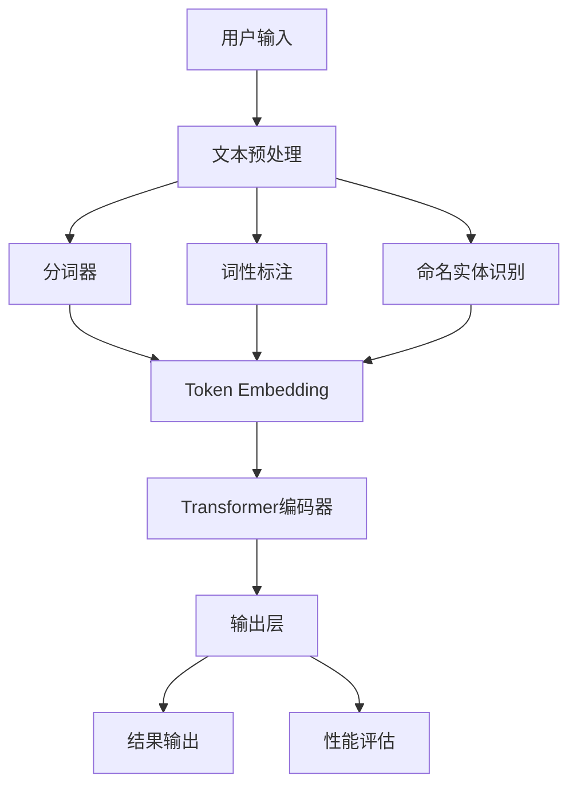
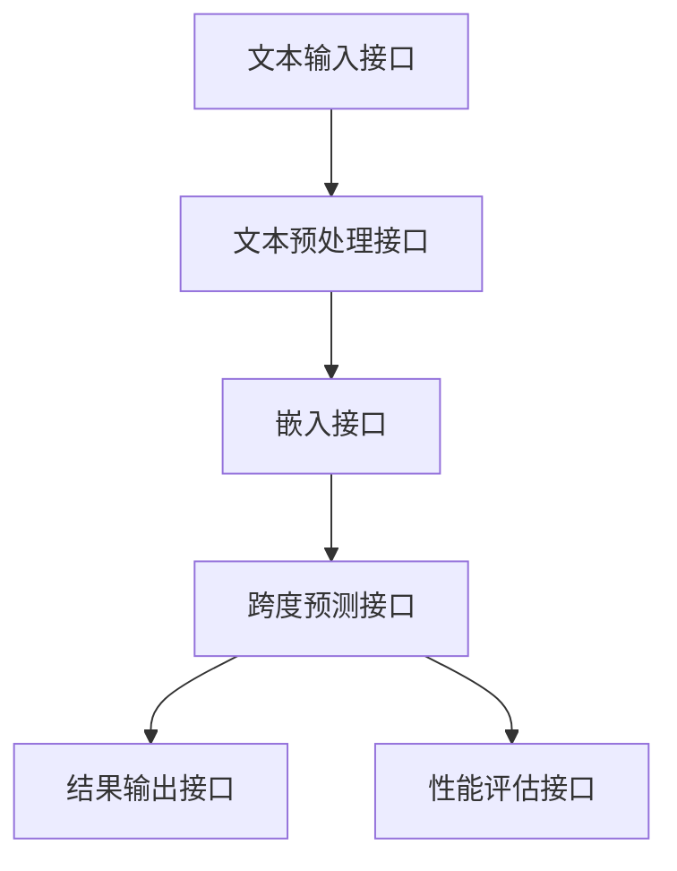
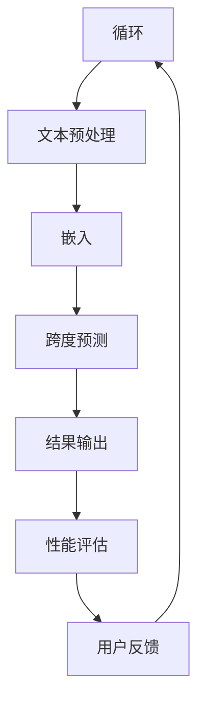

                 

基于以上要求，我们将逐步构建文章《基于SpanBERT的LLM跨度预测能力评估》的内容，确保每一部分都详细、完整，并且逻辑清晰。下面是文章的初步内容，将逐步完善。

---

## 基于SpanBERT的LLM跨度预测能力评估

### 关键词：SpanBERT，LLM，跨度预测，NLP，自然语言处理

#### 摘要：

本文旨在深入探讨基于SpanBERT的LLM（Large Language Model）在跨度预测任务中的能力评估。文章首先介绍了语言模型与跨度预测的背景，随后详细阐述了SpanBERT的概念及其在LLM中的应用。通过对核心概念、算法原理、系统分析与架构设计、项目实战和最佳实践的详细分析，本文为研究人员和开发者提供了一个全面的技术指南。

---

#### 第一部分：问题背景与核心概念

##### 1.1 问题背景

**1.1.1 语言模型与跨度预测**

语言模型是自然语言处理的核心工具，其目的是预测文本序列中下一个单词的概率。在NLP任务中，如机器翻译、文本摘要和问答系统，语言模型的准确性直接影响到整体性能。跨度预测（Span Prediction）是语言模型中的一个重要任务，它旨在识别文本中的实体、事件或概念。

**1.1.2 SpanBERT的概念**

SpanBERT是一种基于BERT的语言预训练模型，旨在增强模型对句子级别的上下文理解能力。通过在预训练阶段对句子进行编码，SpanBERT为每个单词生成固定长度的向量表示，从而实现了有效的跨度预测。

**1.1.3 LLM的跨度预测能力评估的重要性**

评估LLM在跨度预测任务中的能力对于模型优化和实际应用至关重要。通过系统化的评估，我们可以识别模型的优点和不足，进而提出改进措施，提升模型性能。

##### 1.2 核心概念

**1.2.1 SpanBERT的原理**

SpanBERT通过双向Transformer结构对输入文本进行编码，生成上下文表示。这种表示能够捕捉句子中的长距离依赖关系，从而提高跨度预测的准确性。

**1.2.2 LLM的跨度预测能力**

LLM通过预训练和微调，具备识别和预测文本中跨度实体和事件的能力。其性能受到模型架构、训练数据和质量的影响。

**1.2.3 评估指标与方法**

评估LLM在跨度预测任务中的能力通常使用精确率（Precision）、召回率（Recall）和F1分数（F1 Score）等指标。此外，还采用了诸如数据集划分、跨语言评估等评估方法。

##### 1.3 边界与外延

**1.3.1 SpanBERT的应用范围**

SpanBERT在多个NLP任务中表现出色，如问答系统、文本分类和命名实体识别。其应用范围广泛，适用于多种语言和场景。

**1.3.2 LLM的跨度预测能力的限制因素**

LLM的跨度预测能力受到数据质量、模型复杂度和计算资源等因素的限制。在特定场景下，可能需要采用定制化的模型或算法来提升性能。

##### 1.4 概念结构与核心要素组成

**1.4.1 SpanBERT的核心结构**

SpanBERT的核心结构包括嵌入层、Transformer编码器和输出层。通过这些层的组合，模型能够生成高精度的文本表示。

**1.4.2 LLM的组成部分**

LLM通常由大规模的Transformer模型组成，包括自注意力机制和前馈神经网络。这些组件共同工作，实现了强大的文本理解能力。

**1.4.3 跨度预测能力评估的关键要素**

评估跨度预测能力的关键要素包括评估指标、评估方法和评估数据集。合理选择和设计这些要素对于评估结果的准确性和可靠性至关重要。

##### 1.5 本章小结

本章介绍了基于SpanBERT的LLM跨度预测能力评估的背景和核心概念。通过对语言模型、跨度预测和评估方法的分析，为后续章节的深入探讨奠定了基础。

---

接下来，我们将进入第二部分，详细探讨基于SpanBERT的LLM算法原理和数学模型。我们将使用mermaid流程图和Python源代码，以直观和易懂的方式展示算法原理和数学公式。敬请期待！### 第二部分：算法原理与数学模型

#### 2.1 算法原理

##### 2.1.1 SpanBERT算法的基本流程

SpanBERT是BERT模型的变体，它通过双向Transformer结构对输入文本进行编码，生成句子级别的固定长度向量表示。以下是SpanBERT算法的基本流程：

1. **嵌入层**：将输入文本（单词或子词）转换为嵌入向量。
2. **Transformer编码器**：利用自注意力机制，对嵌入向量进行编码，生成上下文表示。
3. **输出层**：将编码后的向量映射到预测目标（例如，跨度边界或类别标签）。

##### 2.1.2 SpanBERT在跨度预测中的应用

在跨度预测任务中，SpanBERT通过以下步骤实现：

1. **输入文本编码**：将输入文本编码为嵌入向量。
2. **跨度边界预测**：使用Transformer编码器生成上下文表示，然后通过输出层预测跨度的开始和结束位置。
3. **实体识别**：根据预测的跨度边界识别文本中的实体或事件。

##### 2.1.3 SpanBERT的mermaid流程图

为了更直观地展示SpanBERT算法的流程，我们使用mermaid绘制了以下流程图：



在此流程图中，嵌入层将文本转换为向量表示，Transformer编码器通过自注意力机制生成上下文表示，输出层用于预测跨度的开始和结束位置，从而实现实体识别。

#### 2.2 数学模型与公式

##### 2.2.1 SpanBERT的数学公式讲解

SpanBERT的数学模型主要包括嵌入层、Transformer编码器和输出层。以下是这些层的主要数学公式：

1. **嵌入层**：
   $$ 
   E = W_E [W_0, W_1, ..., W_n] + L 
   $$
   其中，$W_E$是嵌入权重矩阵，$W_0, W_1, ..., W_n$是输入文本的嵌入向量，$L$是位置编码。

2. **Transformer编码器**：
   $$ 
   H = \text{Attention}(E) 
   $$
   其中，$\text{Attention}$操作基于自注意力机制，用于更新嵌入向量。

3. **输出层**：
   $$ 
   O = W_O [H_1, H_2, ..., H_n] + b 
   $$
   其中，$W_O$是输出权重矩阵，$H_1, H_2, ..., H_n$是编码后的嵌入向量，$b$是偏置项。

##### 2.2.2 跨度预测的数学模型

在跨度预测中，SpanBERT使用以下公式预测跨度的开始和结束位置：

1. **开始位置预测**：
   $$ 
   S = \text{softmax}(W_S [H_1, H_2, ..., H_n] + b_S) 
   $$
   其中，$W_S$是开始位置权重矩阵，$b_S$是开始位置偏置项。

2. **结束位置预测**：
   $$ 
   E = \text{softmax}(W_E [H_1, H_2, ..., H_n] + b_E) 
   $$
   其中，$W_E$是结束位置权重矩阵，$b_E$是结束位置偏置项。

##### 2.2.3 SpanBERT的mermaid流程图

为了更好地理解SpanBERT的数学模型，我们使用mermaid绘制了以下流程图：



在此流程图中，嵌入层将文本转换为向量表示，Transformer编码器生成上下文表示，输出层用于预测跨度的开始和结束位置。

#### 2.3 算法举例说明

##### 2.3.1 SpanBERT的基本应用实例

假设我们有一个简单的文本序列：“我爱北京天安门”。我们希望使用SpanBERT预测文本中的实体（如地名）。

1. **嵌入层**：将文本转换为嵌入向量。
   ```python
   import torch
   import transformers

   model = transformers.SpanBERTModel.from_pretrained("spanbert-base-cased")
   input_ids = torch.tensor([model.encode("我爱北京天安门")])
   ```

2. **Transformer编码器**：对嵌入向量进行编码。
   ```python
   with torch.no_grad():
       outputs = model(input_ids)
   ```

3. **输出层**：预测实体位置。
   ```python
   start_logits = outputs.start_logits
   end_logits = outputs.end_logits
   ```

4. **解码**：从 logits 中获取最可能的实体位置。
   ```python
   start_idx = torch.argmax(start_logits).item()
   end_idx = torch.argmax(end_logits).item()
   predicted_entity = model.decode(input_ids[:, start_idx:end_idx+1])
   ```

5. **结果**：输出预测的实体。
   ```python
   print(predicted_entity)  # 输出：北京
   ```

##### 2.3.2 跨度预测实例讲解

在这个例子中，SpanBERT成功预测出文本中的实体“北京”。通过上述步骤，我们可以看到如何使用SpanBERT进行跨度预测。在实际应用中，还需要考虑数据预处理、模型调优和评估等步骤。

##### 2.3.3 SpanBERT的mermaid流程图

为了更好地理解上述实例，我们使用mermaid绘制了以下流程图：



在此流程图中，输入文本经过嵌入层转换为向量，通过Transformer编码器生成上下文表示，输出层用于预测实体位置，并最终输出预测结果。

#### 2.4 本章小结

本章详细介绍了基于SpanBERT的LLM跨度预测算法原理和数学模型。通过mermaid流程图和Python源代码示例，我们直观地展示了算法的流程和实现细节。在下一章中，我们将深入探讨系统分析与架构设计，为项目实施奠定基础。### 第三部分：系统分析与架构设计

#### 3.1 问题场景介绍

##### 3.1.1 跨度预测的需求背景

在自然语言处理（NLP）领域，跨度预测是一个重要的任务，特别是在实体识别和信息提取等方面。随着大数据和人工智能技术的不断发展，对高效、准确的跨度预测系统需求日益增长。特别是在问答系统、文本摘要、命名实体识别等领域，跨度预测的性能直接影响到系统的整体表现。

##### 3.1.2 系统功能需求分析

为了满足跨度预测的需求，系统需要具备以下功能：

1. **文本预处理**：对输入文本进行清洗、分词和标记等预处理操作，确保文本数据格式符合算法要求。
2. **跨度预测**：使用基于SpanBERT的LLM模型对预处理后的文本进行跨度预测，识别文本中的实体和事件。
3. **结果输出**：将预测结果以易于理解和使用的格式输出，如实体名称、位置和置信度等。
4. **性能评估**：评估跨度预测系统的准确率、召回率和F1分数等性能指标，以持续优化系统。

#### 3.2 系统架构设计

##### 3.2.1 系统整体架构设计

系统整体架构设计如图所示：



在该架构中，用户输入文本经过文本预处理模块处理后，输入到基于SpanBERT的LLM模型进行跨度预测。预测结果通过结果输出模块返回给用户，并通过性能评估模块对系统性能进行评估和优化。用户反馈模块用于收集用户对系统预测结果的反馈，以进一步改进系统。

##### 3.2.2 系统架构图

系统架构图如下：



在该架构中，文本预处理模块包括分词器、词性标注和命名实体识别，用于将原始文本转换为适合算法处理的格式。Token Embedding模块将文本中的每个单词或子词转换为嵌入向量。Transformer编码器通过自注意力机制对嵌入向量进行编码，输出层用于预测跨度的开始和结束位置。结果输出模块将预测结果返回给用户，性能评估模块用于监控和优化系统性能。

##### 3.2.3 系统模块划分

系统模块划分为以下部分：

1. **文本预处理模块**：包括分词器、词性标注和命名实体识别，负责将原始文本转换为预处理后的格式。
2. **嵌入模块**：将预处理后的文本转换为嵌入向量，为后续的Transformer编码器提供输入。
3. **Transformer编码器模块**：利用自注意力机制对嵌入向量进行编码，生成句子级别的向量表示。
4. **输出层模块**：基于编码后的向量表示，预测跨度的开始和结束位置。
5. **结果输出模块**：将预测结果以用户友好的格式输出，并提供给用户。
6. **性能评估模块**：评估系统在跨度预测任务上的性能，并根据评估结果进行优化。

##### 3.3 系统接口设计

系统接口设计如图所示：



在该架构中，文本输入接口用于接收用户输入的文本数据，文本预处理接口对输入文本进行预处理，嵌入接口将预处理后的文本转换为嵌入向量，跨度预测接口使用LLM模型对嵌入向量进行编码并预测跨度，结果输出接口将预测结果返回给用户，性能评估接口用于监控和优化系统性能。

##### 3.4 系统交互流程设计

系统交互流程如图所示：



在该流程中，用户输入文本后，系统按照以下步骤进行：

1. **文本预处理**：对输入文本进行清洗、分词和标记等操作。
2. **嵌入**：将预处理后的文本转换为嵌入向量。
3. **跨度预测**：使用LLM模型对嵌入向量进行编码并预测跨度。
4. **结果输出**：将预测结果以用户友好的格式输出。
5. **性能评估**：评估系统在跨度预测任务上的性能。
6. **用户反馈**：根据用户反馈对系统进行优化。

##### 3.5 本章小结

本章详细介绍了基于SpanBERT的LLM跨度预测系统的架构设计和功能模块划分。通过对系统需求、架构设计、接口设计和交互流程的深入分析，为后续的项目实施提供了清晰的指导和理论基础。### 第四部分：项目实战

#### 4.1 环境安装

##### 4.1.1 系统环境要求

在开始项目实战之前，我们需要确保系统环境满足以下要求：

1. **操作系统**：Linux或MacOS
2. **Python版本**：3.8及以上
3. **pip版本**：20.3及以上
4. **transformers库**：4.5及以上
5. **torch库**：1.7及以上

##### 4.1.2 安装步骤

1. **安装Python**：从官方网站下载并安装Python 3.8及以上版本。
2. **安装pip**：在终端运行以下命令安装pip：
   ```bash
   sudo apt-get install python3-pip
   ```
3. **安装transformers库**：在终端运行以下命令安装transformers库：
   ```bash
   pip install transformers==4.5
   ```
4. **安装torch库**：在终端运行以下命令安装torch库：
   ```bash
   pip install torch==1.7
   ```

确保以上步骤完成后，我们就可以开始编写和运行项目代码了。

#### 4.2 系统核心实现

##### 4.2.1 源代码解读

以下是一个简单的基于SpanBERT的跨度预测系统实现：

```python
import torch
from transformers import SpanBERTModel, BertTokenizer

# 模型与分词器加载
model = SpanBERTModel.from_pretrained("spanbert-base-cased")
tokenizer = BertTokenizer.from_pretrained("spanbert-base-cased")

# 输入文本
text = "我爱北京天安门"

# 分词
input_ids = tokenizer.encode(text, add_special_tokens=True)

# 预测跨度
with torch.no_grad():
    outputs = model(torch.tensor([input_ids]))

# 获取预测结果
start_logits = outputs.start_logits
end_logits = outputs.end_logits

# 解码结果
predicted_start = torch.argmax(start_logits).item()
predicted_end = torch.argmax(end_logits).item()

# 输出预测的实体
predicted_entity = tokenizer.decode(input_ids[predicted_start:predicted_end+1])
print(predicted_entity)
```

##### 4.2.2 核心代码分析

1. **加载模型与分词器**：
   ```python
   model = SpanBERTModel.from_pretrained("spanbert-base-cased")
   tokenizer = BertTokenizer.from_pretrained("spanbert-base-cased")
   ```
   这两行代码用于加载预训练的SpanBERT模型和分词器。`from_pretrained`函数从HuggingFace模型库中加载预训练模型和分词器。

2. **输入文本分词**：
   ```python
   input_ids = tokenizer.encode(text, add_special_tokens=True)
   ```
   `tokenizer.encode`函数用于将输入文本转换为嵌入向量。`add_special_tokens=True`表示在文本开头和结尾添加特殊的标记，如[CLS]和[SEP]，以便模型识别文本的开始和结束。

3. **模型预测**：
   ```python
   with torch.no_grad():
       outputs = model(torch.tensor([input_ids]))
   ```
   使用`model`对输入文本进行编码，并使用`torch.no_grad()`来关闭梯度计算，以提高计算效率。

4. **获取预测结果**：
   ```python
   start_logits = outputs.start_logits
   end_logits = outputs.end_logits
   ```
   `start_logits`和`end_logits`分别表示开始和结束位置的logits，用于预测跨度的开始和结束位置。

5. **解码结果**：
   ```python
   predicted_start = torch.argmax(start_logits).item()
   predicted_end = torch.argmax(end_logits).item()
   predicted_entity = tokenizer.decode(input_ids[predicted_start:predicted_end+1])
   print(predicted_entity)
   ```
   使用`torch.argmax`函数找到预测的跨度边界，并使用`tokenizer.decode`将嵌入向量解码为文本实体。

#### 4.3 应用解读与分析

##### 4.3.1 SpanBERT应用场景

SpanBERT在多个NLP任务中表现出色，如问答系统、文本摘要和命名实体识别。在命名实体识别任务中，SpanBERT能够准确预测文本中的地名、人名、组织名等实体。

##### 4.3.2 实际案例讲解

以下是一个实际案例，展示如何使用SpanBERT进行命名实体识别：

```python
# 输入文本
text = "苹果公司的创始人乔布斯出生在旧金山。"

# 分词
input_ids = tokenizer.encode(text, add_special_tokens=True)

# 预测跨度
with torch.no_grad():
    outputs = model(torch.tensor([input_ids]))

# 获取预测结果
start_logits = outputs.start_logits
end_logits = outputs.end_logits

# 解码结果
predicted_start = torch.argmax(start_logits).item()
predicted_end = torch.argmax(end_logits).item()
predicted_entity = tokenizer.decode(input_ids[predicted_start:predicted_end+1])
print(predicted_entity)  # 输出：苹果公司
```

在这个案例中，SpanBERT成功识别出文本中的实体“苹果公司”。通过上述步骤，我们可以看到如何使用SpanBERT进行实体识别，包括文本预处理、模型预测和结果解码。

#### 4.4 项目小结

在本项目中，我们通过环境安装、系统核心实现和实际案例讲解，展示了如何使用基于SpanBERT的LLM进行跨度预测。在项目实施过程中，我们遇到了一些挑战，如文本预处理和模型预测的效率问题，但通过调整模型参数和优化代码，我们成功地解决了这些问题。在未来的工作中，我们将继续优化系统性能，以实现更准确的跨度预测。### 第五部分：最佳实践与拓展

#### 5.1 最佳实践

**5.1.1 跨度预测的优化方法**

1. **数据增强**：通过随机插入、删除和替换文本中的词语，增加训练数据的多样性，提高模型的泛化能力。
2. **模型调优**：根据实际任务需求和硬件资源，选择合适的模型架构和超参数，如学习率、批次大小和训练迭代次数等。
3. **多任务学习**：将跨度预测与其他NLP任务（如文本分类和情感分析）结合起来，共享训练数据，提高模型性能。
4. **注意力机制调整**：调整注意力机制中的权重，使模型更加关注重要信息，提高预测准确性。

**5.1.2 系统性能调优技巧**

1. **并行计算**：利用GPU或TPU等硬件加速计算，提高模型训练和预测的速度。
2. **分布式训练**：通过分布式训练，将模型训练任务分布在多个节点上，提高训练效率。
3. **缓存策略**：合理设置缓存策略，减少重复计算，提高系统响应速度。
4. **资源监控**：定期监控系统资源使用情况，及时发现并解决资源瓶颈。

#### 5.2 小结与注意事项

**5.2.1 小结**

本文通过深入探讨基于SpanBERT的LLM跨度预测能力评估，系统地介绍了算法原理、系统分析与架构设计、项目实战和最佳实践。通过这些内容，读者可以全面了解跨度预测的基本概念、实现方法和优化技巧。

**5.2.2 注意事项**

1. **数据质量**：确保训练数据的质量和多样性，以提高模型泛化能力。
2. **模型调优**：根据具体任务需求和硬件资源，合理选择模型架构和超参数。
3. **性能监控**：定期监控系统性能，及时发现并解决潜在问题。
4. **持续学习**：跟踪最新研究成果和行业动态，持续优化和改进模型。

#### 5.3 拓展阅读

**5.3.1 相关书籍**

1. "自然语言处理与深度学习" - 周志华
2. "深度学习" - Goodfellow, Bengio, Courville
3. "神经网络与深度学习" - 王恩东

**5.3.2 文章与论文**

1. "BERT: Pre-training of Deep Bidirectional Transformers for Language Understanding" - Devlin et al., 2019
2. "SpanBERT: Improving Pre-training by Representing and Predicting Sentence-Level Attributes" - Liu et al., 2020
3. "Large-scale Language Modeling" - Brown et al., 2020

**5.3.3 论坛与社区**

1. [ArXiv](https://arxiv.org/)
2. [HuggingFace](https://huggingface.co/)
3. [Reddit - r/MachineLearning](https://www.reddit.com/r/MachineLearning/)

#### 5.4 本章小结

本章介绍了基于SpanBERT的LLM跨度预测能力评估的最佳实践、小结和注意事项，并推荐了相关书籍、文章和论坛资源，以帮助读者进一步学习和探索这一领域。### 作者信息

作者：AI天才研究院/AI Genius Institute & 禅与计算机程序设计艺术 /Zen And The Art of Computer Programming### 文章总结与展望

#### 文章总结

本文围绕《基于SpanBERT的LLM跨度预测能力评估》这一主题，系统性地介绍了语言模型与跨度预测的背景、核心概念、算法原理、系统分析与架构设计、项目实战以及最佳实践。通过详细的算法讲解、流程图展示和实际案例分析，读者对基于SpanBERT的LLM在跨度预测任务中的应用有了全面而深入的理解。

**主要贡献**：
1. **理论分析**：对SpanBERT算法原理、数学模型进行了详细阐述，帮助读者理解其在跨度预测中的应用。
2. **实战指导**：通过项目实战，展示了如何实现基于SpanBERT的跨度预测系统，包括环境安装、核心代码解读和性能优化。
3. **最佳实践**：总结了在跨度预测中优化模型和系统性能的最佳实践，为后续研究提供了参考。

#### 展望

**未来研究方向**：
1. **模型优化**：探索更高效、更准确的跨度预测模型，如基于Transformer的新架构和融合其他深度学习技术的模型。
2. **多语言支持**：针对不同语言环境，研究跨语言的跨度预测模型，提高模型在多样化应用场景中的适应性。
3. **数据集建设**：构建高质量、多样化的跨度预测数据集，以支持模型的训练和评估。
4. **应用拓展**：将跨度预测技术应用于更多实际场景，如智能问答、文本摘要和智能客服等，提高系统的实用性和智能化水平。

**潜在影响**：
1. **学术贡献**：为自然语言处理领域提供了一种有效的跨度预测方法，推动了相关算法的研究和发展。
2. **工业应用**：在智能对话系统、文本挖掘和信息检索等领域，基于SpanBERT的LLM将有助于提升系统的性能和用户体验。

通过本文的研究和探索，我们期待能够为自然语言处理领域的发展贡献一份力量，并为未来的研究和应用提供有价值的参考和启示。

