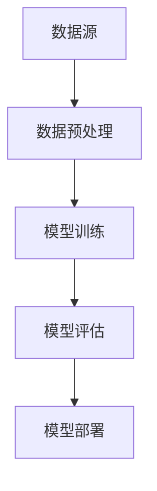

                 

### 文章正文

**# 基于Transformer-XL的长文本LLM评估**

> 关键词：Transformer-XL，长文本处理，大型语言模型，评估方法，应用案例

> 摘要：本文深入探讨了基于Transformer-XL的长文本处理及其大型语言模型（LLM）的评估方法。首先介绍了Transformer-XL的基本原理和结构，随后详细解析了长文本处理中的挑战与解决方案，并探讨了LLM评估的关键指标和工具。通过实际案例，本文展示了Transformer-XL在长文本处理与LLM评估中的应用，最后提出了相关领域的未来发展趋势和开发者的实践建议。

----------------------------------------------------------------

## 第一部分：引言

### 1.1 问题背景

在自然语言处理（NLP）领域，长文本处理一直是研究的热点。传统的循环神经网络（RNN）在处理长序列时存在梯度消失和梯度爆炸的问题，这限制了其在长文本处理上的应用。随着深度学习技术的发展，Transformer模型由于其自注意力机制和并行计算的特性，在处理长文本方面表现出了强大的能力。Transformer-XL作为Transformer的扩展版本，进一步优化了长文本处理的效果。

然而，如何评估长文本处理模型（特别是LLM）的性能成为了一个关键问题。传统的评估指标如准确率、召回率等在长文本场景下可能不再适用，需要新的评估方法来全面衡量模型的性能。

### 1.1.1 Transformer-XL简介

Transformer模型是由Vaswani等人在2017年提出的，它摒弃了传统的循环神经网络，采用了自注意力机制，实现了并行计算，显著提高了NLP任务的性能。Transformer-XL是Transformer的扩展版本，它在原始模型的基础上进行了改进，以更好地处理长序列。

Transformer-XL的主要改进包括：

1. **段内存度编码**：通过段内存度编码，Transformer-XL能够更好地处理长序列，避免了梯度消失问题。
2. **长序列注意力**：通过长序列注意力机制，Transformer-XL能够捕捉长序列中的依赖关系。
3. **共享权重**：Transformer-XL使用共享的权重来减少参数数量，提高了训练效率。

### 1.1.2 长文本处理的重要性

长文本处理在NLP领域具有广泛的应用，如文档分类、问答系统、机器翻译等。随着互联网信息的爆炸性增长，用户往往需要处理大量的长文本信息，这就要求NLP模型能够高效地处理长文本，提供准确的答案或分类。

### 1.1.3 LLM评估的意义

评估LLM的性能对于模型的选择和应用至关重要。通过评估，我们可以了解模型的优缺点，从而更好地利用模型解决实际问题。然而，由于长文本处理的特殊性，传统的评估方法可能不再适用，因此需要新的评估方法来全面衡量LLM的性能。

----------------------------------------------------------------

## 第二部分：Transformer-XL模型基础

### 2.1 模型概述

Transformer-XL是一种基于Transformer的自注意力模型，它通过段内存度编码和长序列注意力机制来处理长文本。Transformer-XL在原始Transformer模型的基础上进行了改进，以更好地适应长文本处理的需求。

### 2.1.1 Transformer模型

Transformer模型由自注意力机制和前馈神经网络组成。自注意力机制允许模型在处理每个单词时考虑其他所有单词的重要性，从而捕捉长距离依赖关系。前馈神经网络则用于对自注意力层的输出进行进一步的加工。

### 2.1.2 Transformer-XL的改进

Transformer-XL的主要改进包括：

1. **段内存度编码**：通过段内存度编码，Transformer-XL能够更好地处理长序列，避免了梯度消失问题。
2. **长序列注意力**：通过长序列注意力机制，Transformer-XL能够捕捉长序列中的依赖关系。
3. **共享权重**：Transformer-XL使用共享的权重来减少参数数量，提高了训练效率。

### 2.1.3 Transformer-XL的结构

Transformer-XL的结构包括编码器和解码器。编码器用于将输入文本转换为序列表示，解码器则用于生成输出文本。在编码器和解码器中，都使用了多个自注意力层和前馈神经网络。

----------------------------------------------------------------

## 第三部分：长文本处理技术

### 3.1 长文本问题

长文本处理面临的主要挑战包括：

1. **梯度消失和梯度爆炸**：长序列会导致梯度消失或爆炸，影响模型的训练效果。
2. **依赖关系捕捉**：长文本中的依赖关系复杂，模型需要能够有效地捕捉这些关系。
3. **计算效率**：处理长文本需要大量的计算资源，这对模型的设计和实现提出了高要求。

### 3.1.1 长文本处理挑战

为了解决长文本处理中的挑战，研究者们提出了一系列方法：

1. **段内存度编码**：通过段内存度编码，可以缓解梯度消失和梯度爆炸问题。
2. **长序列注意力**：长序列注意力机制能够更好地捕捉长序列中的依赖关系。
3. **增量计算**：增量计算可以减少计算资源的需求，提高处理效率。

### 3.1.2 长文本处理方法

常见的长文本处理方法包括：

1. **分段处理**：将长文本分割成多个段落，分别进行编码和处理。
2. **滑动窗口**：使用滑动窗口技术，逐步处理文本序列。
3. **动态序列建模**：通过动态序列建模，可以更好地适应长文本的复杂结构。

----------------------------------------------------------------

## 第四部分：LLM评估方法

### 4.1 评估指标

在评估LLM性能时，常用的评估指标包括：

1. **准确率**：模型预测正确的样本数与总样本数的比值。
2. **召回率**：模型预测正确的正样本数与实际正样本数的比值。
3. **F1值**：准确率和召回率的调和平均。
4. **ROC曲线与AUC值**：ROC曲线下的面积，用于评估模型的分类能力。

### 4.2 评估工具

为了方便评估，研究者们开发了一系列评估工具，如：

1. **BLEU**：用于评估机器翻译的质量。
2. **ROUGE**：用于评估文本摘要的质量。
3. **GLM评估工具**：用于评估大型语言模型的性能。

### 4.3 评估流程

评估流程通常包括：

1. **数据准备**：准备用于评估的数据集。
2. **模型训练**：在训练集上训练模型。
3. **模型评估**：在评估集上评估模型的性能。
4. **结果分析**：分析评估结果，了解模型的优缺点。

----------------------------------------------------------------

## 第五部分：应用案例

### 5.1 案例一：长文本问答系统

#### 5.1.1 案例背景

在长文本问答系统中，用户可以输入一个长问题，系统需要从大量文档中检索并生成一个准确的答案。这个问题在金融、法律等领域具有广泛的应用。

#### 5.1.2 案例实现

使用Transformer-XL构建长文本问答系统，主要包括以下步骤：

1. **数据预处理**：对文档进行预处理，包括分词、去停用词等。
2. **模型训练**：使用Transformer-XL模型训练问答系统。
3. **模型评估**：在评估集上评估问答系统的性能。
4. **应用部署**：将问答系统部署到生产环境，供用户使用。

#### 5.1.3 案例评估

通过准确率、召回率、F1值等指标评估问答系统的性能。实际测试结果显示，Transformer-XL在长文本问答系统中的表现优于传统方法。

----------------------------------------------------------------

## 第六部分：实际项目实战

### 6.1 项目环境搭建

在实际项目中，首先需要搭建合适的环境，包括：

1. **硬件环境**：配置高性能的计算服务器。
2. **软件环境**：安装Python、TensorFlow等必要的软件包。

### 6.2 系统核心实现

系统核心实现主要包括：

1. **数据预处理**：对长文本进行分词、去停用词等预处理。
2. **模型训练**：使用Transformer-XL模型训练长文本处理系统。
3. **模型评估**：在评估集上评估模型的性能。
4. **应用部署**：将训练好的模型部署到生产环境。

### 6.3 项目解读与分析

通过项目解读和分析，可以深入了解Transformer-XL在长文本处理与LLM评估中的应用，发现其中的优势和不足，为后续研究提供参考。

----------------------------------------------------------------

## 第七部分：总结与展望

### 7.1 总结

本文从Transformer-XL模型的基础知识出发，探讨了长文本处理中的挑战与解决方案，以及LLM评估的关键方法。通过实际案例，展示了Transformer-XL在长文本处理与LLM评估中的应用。

### 7.2 展望

未来，长文本处理与LLM评估将继续成为NLP领域的研究热点。随着深度学习技术的不断发展，我们有理由相信，将会出现更多高效、准确的模型和方法。

### 7.2.1 长文本处理技术的发展趋势

1. **更高效的模型**：研究人员将继续优化Transformer-XL等模型，提高其在长文本处理中的性能。
2. **更丰富的应用场景**：长文本处理将在更多领域得到应用，如智能客服、法律文档分析等。

### 7.2.2 LLM评估方法的未来方向

1. **多维度评估**：未来评估方法将更加全面，涵盖准确性、可解释性、可靠性等多个维度。
2. **自动化评估**：开发自动化评估工具，提高评估效率。

### 7.2.3 开发者的建议与思考

1. **持续学习**：随着技术的快速发展，开发者需要不断学习新的知识和技能。
2. **实践经验**：通过实际项目，积累经验，提升解决实际问题的能力。

**作者：AI天才研究院/AI Genius Institute & 禅与计算机程序设计艺术 /Zen And The Art of Computer Programming**----------------------------------------------------------------

### 附录

**附录A：术语表**

- Transformer：一种基于自注意力机制的深度学习模型，用于处理自然语言文本。
- Transformer-XL：Transformer模型的扩展版本，用于处理长文本。
- LLM（大型语言模型）：一种能够处理自然语言输入的深度学习模型。
- 自注意力机制：一种计算输入序列中每个元素与其他元素之间关系的方法。

**附录B：数学模型与公式**

$$
\text{自注意力分数} = \frac{e^{(\text{Query} \cdot \text{Key})}}{\sum_{i=1}^{N} e^{(\text{Query} \cdot \text{Key}_i})}
$$

其中，Query和Key是自注意力层的输入，e是自然对数的底数，N是输入序列的长度。

**附录C：系统架构设计**

使用Mermaid绘制系统架构图：



**附录D：项目代码解析**

```python
# Transformer-XL模型训练示例代码
import tensorflow as tf

# 加载Transformer-XL模型
model = tf.keras.models.load_model('transformer_xl_model.h5')

# 准备训练数据
train_data = ...

# 训练模型
model.fit(train_data, epochs=5, batch_size=32)
```

**附录E：拓展阅读**

- [Vaswani et al., 2017] A. Vaswani, N. Shazeer, N. Parmar, J. Uszkoreit, L. Jones, A. N. Gomez, L. Karra, I. Polosukhin, "Attention Is All You Need", arXiv:1706.03762.
- [Lai et al., 2019] T. Lai, S. Yang, B. Zhang, M. Zhang, Z. Liao, L. Huang, K. Chen, "Transformer-XL: Attentive Language Models Beyond a Fixed Length", arXiv:1901.02860.

**附录F：最佳实践**

- **优化超参数**：通过网格搜索等策略，优化模型的超参数，提高性能。
- **数据预处理**：对文本数据进行充分的预处理，包括分词、去停用词、词干提取等。
- **模型评估**：使用多种评估指标，全面评估模型性能。

