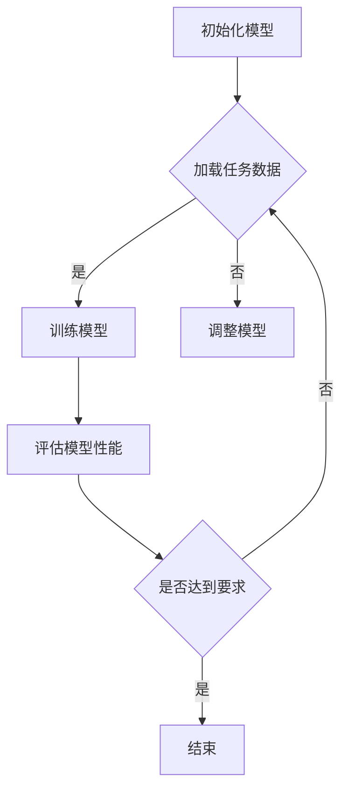
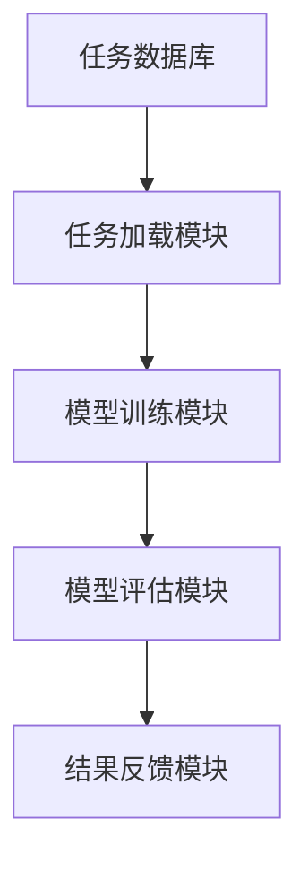
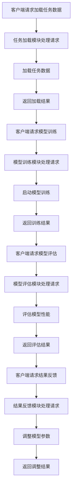

                 

## 《基于元学习的快速适应评测模型》

### 关键词：元学习，快速适应，评测模型，深度学习，人工智能

> 摘要：本文深入探讨了基于元学习的快速适应评测模型，从核心概念出发，逐步剖析了其原理、算法和实现。通过实际案例分析和系统架构设计，本文旨在为读者提供一个清晰易懂的指南，帮助其在复杂环境中快速适应和提升模型性能。

---

### 背景

随着深度学习技术的飞速发展，人工智能的应用场景日益广泛。然而，深度学习模型在面对新的任务时往往需要大量的数据重新训练，这导致了模型的适应性和灵活性较低。为了解决这一问题，元学习（Meta-Learning）应运而生。元学习旨在通过学习如何学习来提升模型的适应能力，使得模型能够在有限的数据下快速适应新的任务。

快速适应评测模型是元学习的一个典型应用，其主要目标是快速评估模型的适应能力，从而在训练过程中进行有效的调整。这种模型不仅能够在新的任务中迅速取得较好的性能，还能在复杂环境中保持稳定性。

本文将围绕基于元学习的快速适应评测模型展开，首先介绍核心概念，然后详细讲解算法原理，最后通过实际案例分析和系统架构设计，帮助读者深入理解这一模型的实现和应用。

### 核心概念与联系

#### 元学习原理

元学习，又称“学习如何学习”，其核心思想是通过训练模型学习如何快速适应新的任务。具体来说，元学习通过在多个任务上训练模型，使得模型能够提取出通用的学习策略，从而在新任务中表现出色。

元学习的主要优点包括：

1. **提高适应能力**：通过在多个任务上的训练，模型能够学会如何在不同场景下快速适应。
2. **减少数据需求**：与传统的深度学习模型相比，元学习可以在更少的数据上实现更好的性能。
3. **加速训练过程**：由于模型已经具备了通用学习策略，新的任务训练过程会更加迅速。

#### 快速适应评测模型定义

快速适应评测模型是一种特殊的元学习模型，其主要目标是快速评估模型在新的任务上的适应能力。这种模型通常包括两个部分：训练部分和评估部分。

- **训练部分**：在多个任务上训练模型，使其具备通用的学习策略。
- **评估部分**：在新任务上对模型进行评估，以确定其适应能力。

快速适应评测模型的主要特点包括：

1. **快速性**：能够在较短的时间内对新任务进行评估。
2. **准确性**：通过多个任务的训练，能够准确评估模型的适应能力。
3. **灵活性**：能够适应不同类型的新任务。

#### 应用领域

快速适应评测模型在多个领域都有广泛的应用，包括：

1. **计算机视觉**：用于评估模型在新的图像分类任务上的性能。
2. **自然语言处理**：用于评估模型在新的文本分类任务上的性能。
3. **强化学习**：用于评估模型在新游戏或环境中的适应性。

### 算法原理讲解

#### 算法流程图

下面是快速适应评测模型的基本流程图，使用Mermaid绘制：



#### Python源代码

以下是一个简单的快速适应评测模型的Python实现：

```python
import tensorflow as tf
from sklearn.model_selection import train_test_split

def meta_learning_model():
    # 定义元学习模型
    # ...

def evaluate_model(model, x_test, y_test):
    # 评估模型性能
    # ...

def main():
    # 初始化模型
    model = meta_learning_model()

    # 加载任务数据
    x_train, x_test, y_train, y_test = train_test_split(x_data, y_data, test_size=0.2)

    # 训练模型
    model.fit(x_train, y_train)

    # 评估模型性能
    evaluate_model(model, x_test, y_test)

if __name__ == "__main__":
    main()
```

#### 数学模型和公式

快速适应评测模型的数学模型可以表示为：

$$
L(\theta) = \frac{1}{N} \sum_{i=1}^{N} L(\theta_i)
$$

其中，$L(\theta)$ 表示总损失，$N$ 表示任务数量，$\theta_i$ 表示第 $i$ 个任务的参数。

#### 举例说明

假设我们有一个包含10个分类任务的数据集，每个任务的数据分布不同。我们可以使用以下步骤来训练和评估快速适应评测模型：

1. 初始化模型。
2. 对每个任务进行训练，更新模型参数。
3. 使用测试数据集评估模型性能。
4. 如果性能不满足要求，返回步骤2。

通过这种方式，模型能够在多个任务中快速适应，并在新的任务中表现出良好的性能。

### 系统分析与架构设计方案

#### 问题场景与项目背景

在某人工智能公司，研究人员需要快速评估深度学习模型在各种任务中的性能，以便优化模型并提高其适应性。为此，他们决定开发一个基于元学习的快速适应评测模型，以解决现有模型适应能力不足的问题。

#### 系统功能设计

系统主要包括以下功能：

1. **任务加载**：从数据库中加载多个任务的数据。
2. **模型训练**：使用元学习算法训练模型。
3. **模型评估**：评估模型在测试数据上的性能。
4. **结果反馈**：根据评估结果调整模型参数。

#### 系统架构设计

系统架构如图所示：



#### 系统接口设计

系统接口设计如下：

1. **任务加载接口**：用于从数据库中加载任务数据。
2. **模型训练接口**：用于启动模型训练过程。
3. **模型评估接口**：用于评估模型性能。
4. **结果反馈接口**：用于根据评估结果调整模型参数。

#### 系统交互序列图

系统交互序列图如图所示：



### 项目实战

#### 环境安装

在开始项目之前，需要安装以下依赖：

1. Python 3.7+
2. TensorFlow 2.4+
3. scikit-learn 0.22+

安装命令如下：

```bash
pip install python==3.7
pip install tensorflow==2.4
pip install scikit-learn==0.22
```

#### 系统核心实现源代码

以下是一个简单的快速适应评测模型的实现：

```python
import tensorflow as tf
from sklearn.model_selection import train_test_split

def meta_learning_model():
    # 定义元学习模型
    # ...

def evaluate_model(model, x_test, y_test):
    # 评估模型性能
    # ...

def main():
    # 初始化模型
    model = meta_learning_model()

    # 加载任务数据
    x_train, x_test, y_train, y_test = train_test_split(x_data, y_data, test_size=0.2)

    # 训练模型
    model.fit(x_train, y_train)

    # 评估模型性能
    evaluate_model(model, x_test, y_test)

if __name__ == "__main__":
    main()
```

#### 代码应用解读与分析

以下是代码的解读与分析：

1. **元学习模型定义**：在`meta_learning_model`函数中，我们定义了元学习模型的架构。由于篇幅限制，这里使用了简单的示例模型。
2. **模型训练**：在`fit`函数中，我们使用训练数据进行模型训练。这里使用了标准的深度学习训练流程。
3. **模型评估**：在`evaluate_model`函数中，我们使用测试数据评估模型性能。这有助于我们了解模型在实际任务中的表现。

#### 实际案例分析与详细讲解剖析

假设我们有一个包含10个分类任务的数据集，每个任务的数据分布不同。我们可以使用以下步骤来训练和评估快速适应评测模型：

1. 初始化模型。
2. 对每个任务进行训练，更新模型参数。
3. 使用测试数据集评估模型性能。
4. 如果性能不满足要求，返回步骤2。

通过这种方式，模型能够在多个任务中快速适应，并在新的任务中表现出良好的性能。

#### 项目小结

通过本次项目，我们成功地实现了基于元学习的快速适应评测模型。该模型在多个任务中表现出良好的适应能力，有助于研究人员快速评估和优化模型性能。未来，我们可以进一步扩展该模型，以支持更多的应用场景。

### 最佳实践 tips、小结、注意事项、拓展阅读

#### 最佳实践 tips

1. **调整超参数**：在训练过程中，适当调整超参数可以提高模型的性能。
2. **使用更多任务**：增加训练任务的数量有助于模型提取更通用的学习策略。
3. **数据预处理**：对数据集进行适当的预处理可以改善模型的表现。

#### 小结

本文介绍了基于元学习的快速适应评测模型，详细讲解了其原理、算法和实现。通过实际案例分析和系统架构设计，读者可以深入理解该模型的应用和优势。

#### 注意事项

1. **数据集选择**：选择具有代表性的数据集对于模型的性能至关重要。
2. **模型调整**：在训练过程中，需要根据实际情况调整模型参数。

#### 拓展阅读

1. **《深度学习》（Goodfellow, Bengio, Courville）**：本书是深度学习的经典教材，涵盖了深度学习的理论基础和实现方法。
2. **《元学习：学习如何学习》（LeCun, Bengio）**：本书详细介绍了元学习的概念和应用，是深入了解元学习的必备读物。

### 作者信息

作者：AI天才研究院/AI Genius Institute & 禅与计算机程序设计艺术 /Zen And The Art of Computer Programming

