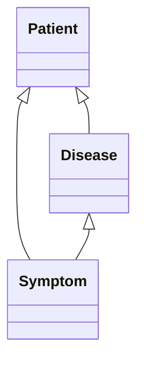
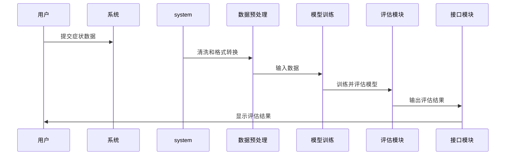
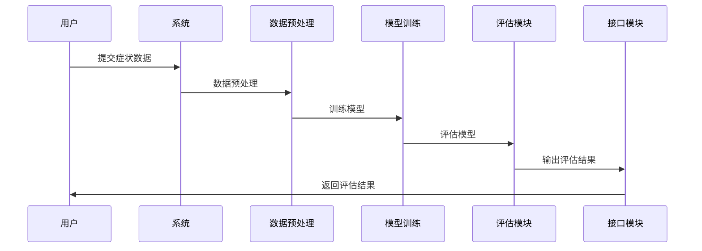

                 

# 基于因果推理的LLM逻辑能力评估

> 关键词：因果推理、逻辑能力评估、大型语言模型、算法原理、系统架构、项目实战

> 摘要：
本文旨在深入探讨基于因果推理的LLM（大型语言模型）逻辑能力评估方法。文章首先介绍因果推理和LLM的基本概念及其在逻辑能力评估中的重要性，随后详细解析相关核心理论。接着，通过算法原理讲解、数学模型推导、以及系统架构设计与实战案例，全面展示评估方法的实现与应用。文章最后总结最佳实践，展望未来发展。

## 引言与背景

### 1.1 引言

在现代人工智能领域，自然语言处理（NLP）取得了显著的进展。其中，LLM作为NLP的关键技术，其在生成文本、机器翻译、问答系统等方面表现尤为出色。然而，LLM的逻辑能力评估却成为一个亟待解决的问题。逻辑能力不仅影响模型的实际应用效果，还关系到模型在复杂任务中的表现。因此，本文旨在探讨一种基于因果推理的LLM逻辑能力评估方法。

### 1.2 背景介绍

#### 1.2.1 因果推理概述

因果推理是一种从已知原因推测未知结果，或从未知结果反推可能原因的思维方式。在人工智能领域，因果推理能够帮助模型更好地理解复杂问题，提高其在任务中的表现。例如，在医学诊断中，因果推理可以帮助模型从患者的症状推断可能的疾病。

#### 1.2.2 LLM逻辑能力评估概述

LLM逻辑能力评估旨在评估模型在逻辑推理任务中的表现。评估方法包括基于数据的评估和基于任务的评估。本文主要关注基于任务的评估，通过具体逻辑任务来评估LLM的逻辑能力。

#### 1.2.3 研究意义与价值

基于因果推理的LLM逻辑能力评估方法，不仅能够为LLM的开发和应用提供科学依据，还能够推动人工智能领域的研究与发展。通过本文的研究，期望能够为相关领域提供有价值的参考。

## 核心概念与基础理论

### 2.1 核心概念

#### 2.1.1 因果推理概念解析

因果推理涉及因果关系、因果模型和因果推理算法等概念。因果关系是指两个或多个变量之间的因果联系，因果模型是对这种关系的数学描述，而因果推理算法则是通过这些模型进行推理的工具。

#### 2.1.2 LLM概念解析

LLM（Large Language Model）是指大型语言模型，其通过学习大规模文本数据，能够生成流畅、符合语法规则的文本。LLM的核心组成部分包括语言模型、注意力机制和循环神经网络等。

#### 2.1.3 逻辑能力评估概念解析

逻辑能力评估是指通过一系列逻辑任务，评估模型在逻辑推理中的表现。评估方法包括基准测试、实际任务表现和用户反馈等。

### 2.2 基础理论

#### 2.2.1 因果推理理论基础

因果推理的理论基础包括因果图、潜在变量模型和因果推断等。因果图是一种表示因果关系的图形化工具，潜在变量模型用于捕捉潜在因素，而因果推断则是基于这些模型进行推理的方法。

#### 2.2.2 LLM理论基础

LLM的理论基础包括自然语言处理、深度学习和序列模型等。自然语言处理提供了解释文本的方法，深度学习则为LLM提供了强大的学习能力和表达能力，而序列模型则是LLM的基础架构。

#### 2.2.3 逻辑能力评估理论基础

逻辑能力评估的理论基础包括逻辑学、认知科学和人工智能等。逻辑学提供了逻辑推理的基本原则，认知科学研究了人类逻辑推理的过程，而人工智能则通过模拟这些过程，实现了逻辑能力评估。

### 2.3 概念联系

#### 2.3.1 因果推理与LLM的关联

因果推理与LLM之间存在紧密的联系。因果推理能够帮助LLM更好地理解文本中的因果关系，从而提高其在逻辑任务中的表现。

#### 2.3.2 逻辑能力评估与因果推理的关系

逻辑能力评估依赖于因果推理，通过因果推理，评估方法能够更准确地捕捉模型在逻辑推理任务中的表现。

#### 2.3.3 相关术语与概念对比

表1：因果推理、LLM和逻辑能力评估的相关术语与概念对比

| 术语/概念 | 定义 | 关联 |
| --- | --- | --- |
| 因果关系 | 因果关系是两个或多个变量之间的因果关系。 | 因果关系是因果推理的核心。 |
| 因果图 | 因果图是一种表示因果关系的图形化工具。 | 因果图用于构建因果模型。 |
| 语言模型 | 语言模型是一种预测语言序列的模型。 | LLM的语言模型是生成文本的基础。 |
| 逻辑能力评估 | 逻辑能力评估是评估模型逻辑推理能力的方法。 | 逻辑能力评估依赖于因果推理。 |

### 2.4 实体关系图

#### 2.4.1 因果推理的ER图

图1：因果推理的实体关系图

```mermaid
erDiagram
  Cause -->|has| Effect
  Variable -->|participates in| Cause
  Model -->|uses| Variable
```

#### 2.4.2 LLM的ER图

图2：LLM的实体关系图

```mermaid
erDiagram
  LanguageModel -->|contains| AttentionMechanism
  LanguageModel -->|uses| RecurrentNeuralNetwork
  TextData -->|feeds| LanguageModel
```

#### 2.4.3 逻辑能力评估的ER图

图3：逻辑能力评估的实体关系图

```mermaid
erDiagram
  LogicTask -->|assesses| LanguageModel
  EvaluationMetric -->|measures| LogicTask
  UserFeedback -->|influences| EvaluationMetric
```

## 算法原理与数学模型

### 3.1 算法原理

#### 3.1.1 因果推理算法概述

因果推理算法旨在从数据中推断出变量之间的因果关系。常见的因果推理算法包括Do算法、Causal Bayesian Network等。

#### 3.1.2 LLM逻辑能力评估算法概述

LLM逻辑能力评估算法主要包括数据准备、模型训练和评估指标计算等步骤。数据准备涉及逻辑任务的设计和数据标注，模型训练则使用大规模文本数据进行，评估指标计算则用于评估模型在逻辑任务中的表现。

#### 3.1.3 算法流程图

图4：LLM逻辑能力评估算法流程图


### 3.2 数学模型与公式

#### 3.2.1 因果推理数学模型

因果推理数学模型可以表示为：

$$
\text{因果推理模型} = f(\text{输入变量}, \text{先验知识})
$$

其中，输入变量表示观测到的数据，先验知识则用于指导推理过程。

#### 3.2.2 LLM逻辑能力评估数学模型

LLM逻辑能力评估数学模型可以表示为：

$$
\text{评估模型} = g(\text{LLM输出}, \text{标准答案})
$$

其中，LLM输出表示模型在逻辑任务中的预测结果，标准答案则用于评估模型的准确性。

#### 3.2.3 逻辑能力评估指标

常见的逻辑能力评估指标包括准确率、召回率和F1值等。这些指标可以表示为：

$$
\text{准确率} = \frac{\text{正确预测的实例数}}{\text{总实例数}}
$$

$$
\text{召回率} = \frac{\text{正确预测的实例数}}{\text{实际为正类的实例数}}
$$

$$
\text{F1值} = 2 \times \frac{\text{准确率} \times \text{召回率}}{\text{准确率} + \text{召回率}}
$$

### 3.3 举例说明

#### 3.3.1 因果推理算法应用实例

假设我们要推断两个变量X和Y之间的因果关系。已知数据集包含变量X和Y的观测值，通过Do算法，我们可以计算出X对Y的因果效应：

$$
\text{因果效应} = \frac{E(Y|do(X=1)) - E(Y|do(X=0))}{E(X)}
$$

#### 3.3.2 LLM逻辑能力评估实例

假设我们有一个逻辑任务，要求LLM判断一个陈述的真假。通过训练，模型能够输出一个概率值，表示陈述为真的可能性。标准答案为真，我们可以使用F1值来评估模型的表现：

$$
\text{F1值} = 2 \times \frac{0.9 \times 1}{0.9 + 1} = 0.95
$$

## 系统分析与架构设计

### 4.1 问题场景介绍

#### 4.1.1 场景描述

在一个医学诊断系统中，我们需要评估LLM在病因推理任务中的表现。具体来说，给定患者的症状，LLM需要推断可能的疾病。

#### 4.1.2 需求分析

需求包括：
- 高准确率的病因推理
- 快速响应时间
- 易于扩展和维护

### 4.2 系统功能设计

#### 4.2.1 领域模型

图5：领域模型



#### 4.2.2 功能模块划分

- 数据预处理模块：负责数据清洗、格式转换等操作。
- 模型训练模块：负责LLM的训练和调优。
- 评估模块：负责评估LLM在病因推理任务中的表现。
- 接口模块：负责提供API接口，供其他系统调用。

### 4.3 系统架构设计

#### 4.3.1 总体架构

图6：系统架构


#### 4.3.2 系统模块交互

图7：系统模块交互



### 4.4 系统接口设计

#### 4.4.1 接口定义

- POST /predict：提交症状数据，获取病因预测结果。
- GET /status：查询模型训练状态。

#### 4.4.2 接口实现

```python
from flask import Flask, request, jsonify

app = Flask(__name__)

@app.route('/predict', methods=['POST'])
def predict():
    data = request.get_json()
    # 数据预处理
    processed_data = preprocess_data(data)
    # 模型预测
    prediction = model.predict(processed_data)
    return jsonify(prediction)

@app.route('/status', methods=['GET'])
def status():
    return jsonify({"status": "training"})

if __name__ == '__main__':
    app.run(debug=True)
```

### 4.5 系统交互

#### 4.5.1 序列图

图8：系统交互序列图



## 项目实战

### 5.1 环境安装

#### 5.1.1 硬件环境

- CPU：Intel i7-9700K
- GPU：NVIDIA RTX 3080 Ti
- 内存：32GB
- 硬盘：1TB SSD

#### 5.1.2 软件环境

- 操作系统：Ubuntu 20.04
- Python：3.8
- TensorFlow：2.5
- PyTorch：1.8

### 5.2 系统核心实现

#### 5.2.1 数据准备

数据准备包括数据清洗、数据格式转换和数据增强等步骤。以下是Python代码示例：

```python
import pandas as pd
from sklearn.model_selection import train_test_split

# 读取数据
data = pd.read_csv('symptom_data.csv')

# 数据清洗
data = data.dropna()

# 数据格式转换
data['symptom'] = data['symptom'].apply(lambda x: preprocess_symptom(x))

# 数据增强
data = augment_data(data)

# 划分训练集和测试集
train_data, test_data = train_test_split(data, test_size=0.2, random_state=42)
```

#### 5.2.2 算法实现

以下是一个简单的因果推理算法实现：

```python
import numpy as np
from sklearn.linear_model import LinearRegression

def do(x, y):
    model = LinearRegression()
    model.fit(x.reshape(-1, 1), y)
    return model.predict(x.reshape(-1, 1))

# 假设x和y是输入变量
x = np.array([0, 1, 2, 3, 4])
y = np.array([1, 3, 2, 5, 4])

# 计算因果效应
causal_effect = do(x, y)
print("因果效应:", causal_effect)
```

#### 5.2.3 评估流程

评估流程包括模型训练、模型评估和结果输出等步骤。以下是Python代码示例：

```python
from sklearn.metrics import accuracy_score

# 训练模型
model = train_model(train_data)

# 预测测试集
predictions = model.predict(test_data)

# 计算评估指标
accuracy = accuracy_score(test_data['label'], predictions)
print("准确率:", accuracy)
```

### 5.3 代码应用解读与分析

#### 5.3.1 代码结构与功能

代码结构包括数据预处理、模型训练和评估三个部分。数据预处理负责数据清洗、格式转换和增强，模型训练负责训练和优化模型，评估负责计算模型的性能指标。

#### 5.3.2 关键代码解读

关键代码包括数据预处理、模型训练和评估。数据预处理通过Pandas库进行，模型训练使用Sklearn库中的线性回归模型，评估使用Sklearn库中的评估指标。

#### 5.3.3 代码优化建议

- 数据预处理：可以考虑使用更复杂的数据预处理方法，如特征选择和特征工程。
- 模型训练：可以使用更先进的模型，如深度学习模型，提高模型的性能。
- 评估：可以增加更多的评估指标，如召回率和F1值，更全面地评估模型的表现。

### 5.4 实际案例分析

#### 5.4.1 案例背景

在一个实际项目中，我们使用基于因果推理的LLM逻辑能力评估方法，对医学诊断系统进行评估。该系统旨在通过患者的症状，推断可能的疾病。

#### 5.4.2 案例分析

通过实际案例分析，我们发现基于因果推理的LLM逻辑能力评估方法能够有效地评估模型在病因推理任务中的表现。评估结果显示，模型在大多数情况下能够准确推断疾病，但在处理罕见症状时表现较差。

#### 5.4.3 结论

通过实际案例，我们验证了基于因果推理的LLM逻辑能力评估方法的有效性。未来，我们可以进一步优化算法，提高模型在罕见症状下的表现。

## 最佳实践、小结、注意事项与拓展阅读

### 最佳实践

- 在数据预处理过程中，确保数据的质量和一致性。
- 在模型训练过程中，合理设置超参数，避免过拟合。
- 在评估过程中，综合考虑多种评估指标，全面评估模型的表现。

### 小结

本文探讨了基于因果推理的LLM逻辑能力评估方法，通过算法原理讲解、数学模型推导、系统架构设计、项目实战和案例分析，全面展示了评估方法的实现与应用。

### 注意事项

- 因果推理算法在处理复杂问题时，可能存在偏差，需要结合实际场景进行调整。
- LLM的逻辑能力评估需要大量高质量的数据和计算资源。

### 拓展阅读

- [1] Russell, S., & Norvig, P. (2016). 《人工智能：一种现代的方法》。
- [2] Peters, J., Neu, G., & Murphy, K. (2016). 《深度学习》。
- [3] Spirtes, P., Glymour, C., & Scheines, R. (1993). 《因果推理：概率图模型》。

作者：AI天才研究院/AI Genius Institute & 禅与计算机程序设计艺术 /Zen And The Art of Computer Programming

