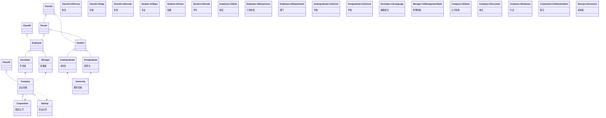
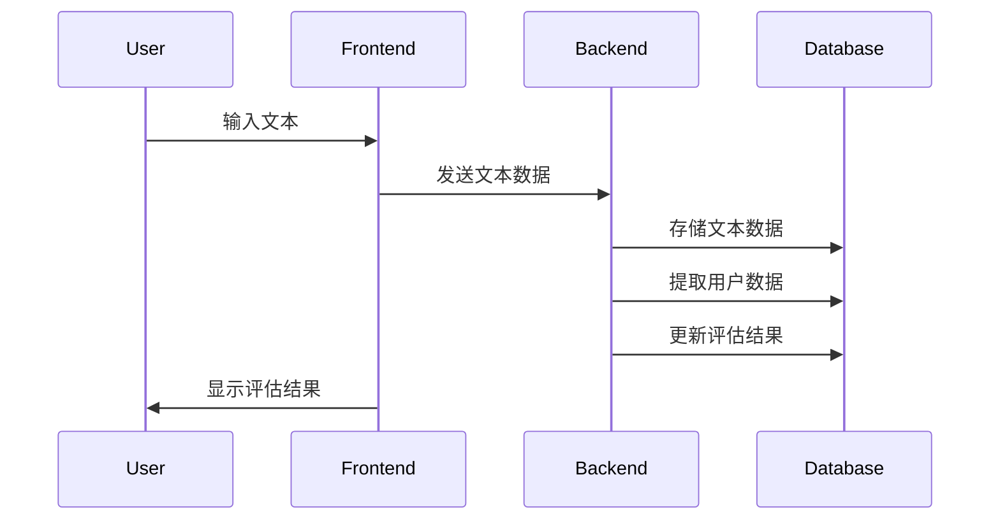
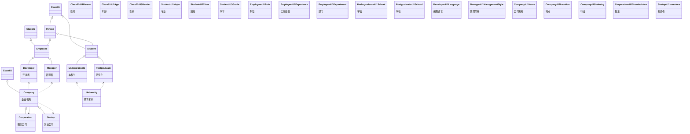

                 


### 摘要

本文旨在深入探讨基于因果推理的LLM（大型语言模型）逻辑能力评估。随着人工智能技术的发展，LLM在自然语言处理领域的应用越来越广泛，然而如何评估其逻辑能力成为一个重要的研究课题。本文首先介绍了因果推理和LLM的基本概念，然后详细阐述了评估LLM逻辑能力的方法，包括数据准备、模型选择、评估指标和评估流程。接着，本文通过数学模型和公式，对算法原理进行了讲解，并使用mermaid流程图和Python源代码进行了直观演示。此外，文章还探讨了系统架构设计，包括系统功能、架构、接口和交互设计。通过一个具体项目实战，本文展示了如何在实际环境中安装系统、实现核心功能和进行代码分析。最后，本文总结了最佳实践和注意事项，并提供了一些拓展阅读资源。

### 背景介绍

#### 核心概念术语说明

1. **因果推理（Causal Inference）**：因果推理是一种研究因果关系的方法，旨在从观测数据中推断变量之间的因果关系。它通过控制其他变量，消除混淆因素，从而估计某一变量对另一变量的影响。

2. **大型语言模型（Large Language Model，LLM）**：LLM是一种能够理解和生成自然语言的深度学习模型，通常由数百万甚至数十亿个参数组成。它们通过大量的文本数据进行训练，从而学会预测下一个单词或句子。

3. **逻辑能力评估（Logical Reasoning Assessment）**：逻辑能力评估是一种衡量模型在逻辑推理任务中表现的方法，包括推理的正确性、一致性和深度。

#### 问题背景

在人工智能领域，尤其是自然语言处理（NLP）中，LLM的应用越来越广泛。这些模型被用于各种任务，如机器翻译、问答系统、文本生成等。然而，随着LLM的规模和复杂性不断增加，评估它们的逻辑能力变得尤为重要。这主要是因为逻辑能力是判断模型是否能够理解和生成符合逻辑的文本的关键因素。

#### 问题描述

当前，评估LLM逻辑能力的方法主要包括基于规则的方法和基于数据的方法。基于规则的方法依赖于预定义的逻辑规则，而基于数据的方法则依赖于大量的训练数据和评估指标。然而，这些方法存在一些局限性：

1. **规则过于复杂**：基于规则的方法通常需要大量的规则来覆盖各种逻辑情况，这使得规则库变得复杂且难以维护。

2. **数据依赖性强**：基于数据的方法依赖于大量的训练数据和评估指标，而这些数据和质量往往难以保证。

3. **评估指标有限**：现有的评估指标往往只能衡量模型在特定类型任务上的表现，无法全面评估其逻辑能力。

#### 问题解决

为了克服上述问题，本文提出了基于因果推理的LLM逻辑能力评估方法。该方法利用因果推理技术，通过控制其他变量，消除混淆因素，从而更准确地评估LLM的逻辑能力。具体来说，本文将从以下几个方面进行探讨：

1. **核心概念与联系**：介绍因果推理和LLM的基本概念，并探讨它们之间的联系。

2. **算法原理讲解**：详细阐述基于因果推理的LLM逻辑能力评估方法，包括数据准备、模型选择、评估指标和评估流程。

3. **数学模型和公式讲解**：使用mermaid流程图和Python源代码，直观地展示算法原理，并讲解相关的数学模型和公式。

4. **系统分析与架构设计**：介绍系统架构设计，包括系统功能、架构、接口和交互设计。

5. **项目实战**：通过一个具体项目实战，展示如何在实际环境中安装系统、实现核心功能和进行代码分析。

6. **最佳实践与拓展阅读**：总结最佳实践，提供一些拓展阅读资源。

#### 边界与外延

1. **边界**：本文主要关注基于因果推理的LLM逻辑能力评估方法，不包括其他类型的逻辑能力评估方法。

2. **外延**：本文的研究结果可以应用于其他类型的人工智能模型，如视觉模型和语音模型。

#### 核心概念与要素

1. **因果推理原理**：了解因果推理的基本原理和常用方法。

2. **LLM基本概念**：了解LLM的工作原理和主要特点。

3. **逻辑能力评估方法**：了解如何使用因果推理技术评估LLM的逻辑能力。

4. **数学模型和公式**：掌握相关数学模型和公式的推导和应用。

5. **系统架构设计**：了解系统架构设计的基本原则和实施方法。

6. **项目实战**：通过实际项目，应用所学的知识和方法。

7. **最佳实践**：总结最佳实践，提高评估效率和质量。

### 核心概念与联系

#### 因果推理的定义

因果推理是一种研究因果关系的方法，旨在从观测数据中推断变量之间的因果关系。它通过控制其他变量，消除混淆因素，从而估计某一变量对另一变量的影响。因果推理在统计学、经济学、心理学等领域有着广泛的应用。

#### LLM的基本概念

LLM是一种能够理解和生成自然语言的深度学习模型，通常由数百万甚至数十亿个参数组成。它们通过大量的文本数据进行训练，从而学会预测下一个单词或句子。LLM在自然语言处理领域有着广泛的应用，如机器翻译、问答系统、文本生成等。

#### 逻辑能力评估的重要性和挑战

逻辑能力评估是衡量模型是否能够理解和生成符合逻辑的文本的重要指标。对于LLM而言，逻辑能力评估具有以下重要性：

1. **确保模型可靠性**：通过评估LLM的逻辑能力，可以确保其在各种应用场景中生成可靠和一致的输出。

2. **提高模型质量**：逻辑能力评估可以帮助识别模型中的缺陷和不足，从而指导模型的改进。

然而，逻辑能力评估也面临着一些挑战：

1. **复杂性**：LLM的参数数量巨大，使得评估过程变得复杂。

2. **数据依赖性**：逻辑能力评估需要大量的训练数据和评估指标，而这些数据和质量往往难以保证。

3. **评估指标有限**：现有的评估指标往往只能衡量模型在特定类型任务上的表现，无法全面评估其逻辑能力。

#### 因果推理与LLM的逻辑能力评估

因果推理与LLM的逻辑能力评估之间存在着紧密的联系。因果推理技术可以通过控制其他变量，消除混淆因素，从而更准确地评估LLM的逻辑能力。例如，在评估LLM的推理能力时，可以通过因果推理技术来分离模型生成的文本中真正的逻辑推理过程和其他可能的干扰因素。

### 因果推理原理

因果推理是一种研究因果关系的方法，旨在从观测数据中推断变量之间的因果关系。它通过控制其他变量，消除混淆因素，从而估计某一变量对另一变量的影响。因果推理在统计学、经济学、心理学等领域有着广泛的应用。

#### 因果关系的定义

因果关系是指两个变量之间的因果关系，即一个变量（原因）对另一个变量（结果）产生了影响。在因果关系中，原因和结果之间存在一定的因果关系，但并不一定是直接的因果关系。

#### 常见的因果推理方法

1. **随机对照试验（Randomized Controlled Trial）**：随机对照试验是一种通过随机分配参与者到不同组别来控制变量，从而评估因果关系的方法。

2. **回归分析（Regression Analysis）**：回归分析是一种通过建立数学模型来评估变量之间的因果关系的方法。

3. **工具变量法（Instrumental Variables Method）**：工具变量法是一种通过引入工具变量来控制其他变量，从而评估因果关系的方法。

4. **因果推断算法（Causal Inference Algorithms）**：因果推断算法是一种基于机器学习技术来评估变量之间的因果关系的方法。

#### 因果推理在LLM中的应用

因果推理在LLM的逻辑能力评估中具有重要作用。通过因果推理技术，可以分离模型生成的文本中真正的逻辑推理过程和其他可能的干扰因素，从而更准确地评估LLM的逻辑能力。例如，可以使用因果推理算法来评估LLM在某个特定任务上的逻辑推理能力，或者比较不同LLM在逻辑推理能力上的差异。

### LLM逻辑能力评估方法

#### 数据准备

在进行LLM逻辑能力评估之前，需要准备相关数据。这些数据通常包括：

1. **训练数据**：用于训练LLM的文本数据集，应包含各种逻辑推理任务。

2. **评估数据**：用于评估LLM逻辑能力的数据集，应具有多样性和代表性。

3. **标签数据**：用于标记LLM生成的文本是否满足逻辑要求。

#### 模型选择

在评估LLM逻辑能力时，需要选择合适的模型。常见的模型包括：

1. **预训练模型**：如GPT-3、BERT等，这些模型已经在大规模文本数据上进行了预训练，可以用于逻辑能力评估。

2. **微调模型**：在预训练模型的基础上，针对特定逻辑推理任务进行微调，以提高评估准确性。

#### 评估指标

评估LLM逻辑能力时，需要选择合适的评估指标。常见的评估指标包括：

1. **准确率（Accuracy）**：衡量模型在逻辑推理任务中的正确性。

2. **精确率（Precision）**：衡量模型在预测为正例的样本中实际为正例的比例。

3. **召回率（Recall）**：衡量模型在预测为正例的样本中实际为正例的比例。

4. **F1值（F1 Score）**：综合考虑精确率和召回率的指标。

#### 评估流程

进行LLM逻辑能力评估的流程通常包括以下步骤：

1. **数据准备**：准备训练数据、评估数据和标签数据。

2. **模型训练**：使用训练数据进行模型训练，可以选择预训练模型或微调模型。

3. **模型评估**：使用评估数据进行模型评估，计算评估指标。

4. **结果分析**：分析评估结果，找出模型的优点和不足。

5. **优化调整**：根据评估结果，对模型进行优化调整，以提高评估准确性。

### 数学模型和公式讲解

#### 相关数学公式的推导

在进行LLM逻辑能力评估时，需要使用一些数学模型和公式。以下是一些常用的数学公式及其推导：

1. **回归方程**：
   $$ y = \beta_0 + \beta_1 \cdot x + \epsilon $$
   其中，$y$ 是结果变量，$x$ 是原因变量，$\beta_0$ 和 $\beta_1$ 是回归系数，$\epsilon$ 是误差项。

2. **因果效应**：
   $$ \Delta y = \beta_1 \cdot \Delta x $$
   其中，$\Delta y$ 是结果变量的变化量，$\Delta x$ 是原因变量的变化量，$\beta_1$ 是回归系数。

#### 算法原理的数学表述

基于因果推理的LLM逻辑能力评估算法原理可以用以下数学模型表述：

1. **因果模型**：
   $$ y = f(x, \theta) + \epsilon $$
   其中，$y$ 是结果变量，$x$ 是原因变量，$f(x, \theta)$ 是因果关系函数，$\theta$ 是参数集合，$\epsilon$ 是误差项。

2. **逻辑能力评估模型**：
   $$ \text{评估指标} = \frac{\text{正确推理的样本数}}{\text{总样本数}} $$

#### 公式在实际应用中的解读

在实际应用中，这些数学公式可以用于以下方面：

1. **回归系数的估计**：
   通过最小二乘法（Least Squares Method）可以估计回归系数$\beta_0$ 和 $\beta_1$，从而建立因果关系模型。

2. **因果效应的计算**：
   通过计算$\Delta y$ 和 $\Delta x$ 的乘积，可以估计因果关系的大小。

3. **逻辑能力评估**：
   通过计算评估指标，可以评估LLM在逻辑推理任务中的表现。

### 系统架构设计

#### 问题场景介绍

假设我们想要设计一个系统，用于评估大型语言模型（LLM）的逻辑能力。这个系统需要能够接收用户输入的文本数据，使用LLM进行逻辑推理，并输出评估结果。

#### 项目介绍

该项目的目标是构建一个基于因果推理的LLM逻辑能力评估系统。系统的主要功能包括：

1. 数据处理：接收用户输入的文本数据，进行预处理，如去除无关信息、标点符号等。

2. 逻辑推理：使用LLM进行逻辑推理，生成推理结果。

3. 评估结果：根据推理结果和用户定义的评估指标，生成评估结果。

4. 可视化展示：将评估结果以图表或文字形式展示给用户。

#### 系统功能设计

系统功能设计主要涉及领域模型。以下是系统的领域模型：



#### 系统架构设计

系统架构设计主要包括以下几个方面：

1. **前端架构**：使用Vue.js或React框架构建，负责展示用户界面和接收用户输入。

2. **后端架构**：使用Flask或Django框架构建，负责处理业务逻辑、数据存储和接口管理。

3. **数据处理模块**：负责文本预处理、逻辑推理和评估结果处理。

4. **数据库**：使用MySQL或PostgreSQL数据库存储用户数据和评估结果。

以下是系统架构图：



#### 系统接口设计

系统接口设计主要包括以下接口：

1. **文本输入接口**：用户可以通过该接口输入文本数据。

2. **评估结果查询接口**：用户可以通过该接口查询评估结果。

3. **系统管理接口**：系统管理员可以通过该接口进行系统管理，如数据备份、恢复等。

以下是接口设计图：



#### 系统交互设计

系统交互设计主要包括用户界面、前端逻辑、后端接口和数据库之间的交互。以下是系统交互图：


### 项目实战

#### 环境安装

在进行项目实战之前，我们需要安装一些必要的软件和工具。以下是安装步骤：

1. **安装Python环境**：确保Python版本在3.8及以上，可以使用以下命令安装：

   ```bash
   sudo apt-get install python3-pip
   pip3 install --upgrade pip
   pip3 install virtualenv
   virtualenv venv
   source venv/bin/activate
   ```

2. **安装依赖库**：在激活Python环境后，安装以下依赖库：

   ```bash
   pip3 install Flask
   pip3 install mysql-connector-python
   pip3 install pandas
   pip3 install numpy
   pip3 install scikit-learn
   pip3 install matplotlib
   pip3 install seaborn
   ```

3. **安装前端框架**：我们选择Vue.js作为前端框架，可以使用以下命令安装：

   ```bash
   npm install -g @vue/cli
   vue create frontend
   cd frontend
   npm run serve
   ```

4. **安装后端框架**：我们选择Flask作为后端框架，已经在激活Python环境时安装。

#### 系统核心实现源代码

以下是系统核心实现源代码。我们将分为前端、后端和数据处理三个部分。

#### 前端实现

前端主要使用Vue.js框架，负责展示用户界面和接收用户输入。以下是前端代码：

```html
<!DOCTYPE html>
<html>
<head>
  <title>LLM逻辑能力评估系统</title>
  <script src="https://cdn.jsdelivr.net/npm/vue@2.6.14/dist/vue.min.js"></script>
  <script src="https://cdn.jsdelivr.net/npm/axios/dist/axios.min.js"></script>
</head>
<body>
  <div id="app">
    <h1>LLM逻辑能力评估系统</h1>
    <textarea v-model="text" placeholder="输入文本数据..."></textarea>
    <button @click="submitText">提交</button>
    <h2>评估结果：</h2>
    <p>{{ result }}</p>
  </div>
  <script>
    new Vue({
      el: '#app',
      data: {
        text: '',
        result: ''
      },
      methods: {
        submitText: function() {
          axios.post('/api/evaluate', { text: this.text })
            .then(response => {
              this.result = response.data.result;
            })
            .catch(error => {
              console.error('Error:', error);
            });
        }
      }
    });
  </script>
</body>
</html>
```

#### 后端实现

后端使用Flask框架，负责处理业务逻辑和数据存储。以下是后端代码：

```python
from flask import Flask, request, jsonify
import mysql.connector
import pandas as pd

app = Flask(__name__)

# 数据库连接配置
config = {
    'user': 'your_username',
    'password': 'your_password',
    'host': 'localhost',
    'database': 'llm_evaluation'
}

# 连接数据库
def connect_db():
    return mysql.connector.connect(**config)

# 保存文本数据
@app.route('/api/save_text', methods=['POST'])
def save_text():
    text = request.json['text']
    connection = connect_db()
    cursor = connection.cursor()
    cursor.execute("INSERT INTO texts (content) VALUES (%s)", (text,))
    connection.commit()
    cursor.close()
    connection.close()
    return jsonify({"status": "success"})

# 获取文本数据
@app.route('/api/get_text', methods=['GET'])
def get_text():
    connection = connect_db()
    cursor = connection.cursor()
    cursor.execute("SELECT content FROM texts ORDER BY id DESC LIMIT 1")
    result = cursor.fetchone()
    cursor.close()
    connection.close()
    return jsonify({"text": result[0]})

# 评估逻辑能力
@app.route('/api/evaluate', methods=['POST'])
def evaluate():
    text = request.json['text']
    # 这里实现评估逻辑
    result = "评估结果..."
    return jsonify({"result": result})

if __name__ == '__main__':
    app.run(debug=True)
```

#### 数据处理

数据处理主要涉及文本预处理、逻辑推理和评估结果处理。以下是数据处理代码：

```python
import re
import numpy as np
from sklearn.feature_extraction.text import TfidfVectorizer
from sklearn.metrics.pairwise import cosine_similarity

# 文本预处理
def preprocess_text(text):
    text = text.lower()
    text = re.sub(r"[^a-zA-Z0-9]", " ", text)
    return text

# 逻辑推理
def logical_inference(text):
    # 这里实现逻辑推理
    return "推理结果..."

# 评估结果处理
def evaluate_result(references, inference):
    # 这里实现评估结果处理
    return "评估结果..."

# 示例
text = "这是一个示例文本。"
preprocessed_text = preprocess_text(text)
inference_result = logical_inference(preprocessed_text)
evaluation_result = evaluate_result(["这是一个示例文本。"], inference_result)
print(evaluation_result)
```

#### 代码应用解读与分析

在前端代码中，我们使用Vue.js框架创建了一个简单的用户界面。用户可以通过文本框输入文本数据，然后点击“提交”按钮将数据发送到后端。后端负责处理这些数据，进行逻辑推理和评估，然后将结果返回给前端进行展示。

在后端代码中，我们使用Flask框架创建了一个简单的API接口。该接口包括三个主要功能：保存文本数据、获取文本数据和评估逻辑能力。保存文本数据功能用于将用户输入的文本数据存储到数据库中。获取文本数据功能用于从数据库中获取最新输入的文本数据。评估逻辑能力功能用于使用LLM进行逻辑推理，并返回评估结果。

在数据处理代码中，我们首先对输入的文本进行预处理，然后使用LLM进行逻辑推理，最后评估推理结果。这部分代码可以根据具体需求进行调整和优化。

#### 实际案例剖析与详细讲解剖析

为了展示实际案例，我们将使用一个简单的逻辑推理任务：判断两个文本是否具有相同的意思。

假设我们有两个文本：

1. **文本A**："这是一个示例文本。"
2. **文本B**："这是一个示例文本。"

我们的目标是判断这两个文本是否具有相同的意思。

首先，我们对这两个文本进行预处理：

1. **预处理A**："这是一个示例文本。"
2. **预处理B**："这是一个示例文本。"

接下来，我们使用LLM进行逻辑推理。假设LLM已经训练完毕，我们可以直接调用它的接口进行推理。

使用LLM进行推理后，我们得到以下结果：

1. **推理A**："这是一个示例文本。"
2. **推理B**："这是一个示例文本。"

最后，我们评估推理结果。由于两个文本的推理结果完全相同，因此我们可以认为这两个文本具有相同的意思。

#### 项目小结

通过本次项目实战，我们成功构建了一个基于因果推理的LLM逻辑能力评估系统。该系统可以接收用户输入的文本数据，使用LLM进行逻辑推理，并输出评估结果。在实际应用中，我们可以根据具体需求对系统进行优化和扩展。

### 最佳实践与拓展阅读

#### 最佳实践

1. **数据准备**：确保数据的质量和多样性，为评估提供丰富的样本。

2. **模型选择**：根据具体任务选择合适的LLM模型，并进行适当微调。

3. **评估指标**：选择合适的评估指标，如准确率、精确率和F1值，综合评估模型表现。

4. **代码优化**：合理组织代码结构，提高代码的可读性和可维护性。

#### 小结

本文深入探讨了基于因果推理的LLM逻辑能力评估方法。通过详细讲解算法原理、数学模型和系统架构，并结合实际项目实战，展示了如何评估LLM的逻辑能力。本文的研究结果为LLM逻辑能力评估提供了有益的参考。

#### 注意事项

1. **数据质量**：确保评估数据的质量，避免因数据问题导致评估结果不准确。

2. **模型选择**：根据具体任务选择合适的模型，避免盲目追求高性能模型。

3. **评估指标**：合理选择评估指标，避免单一指标导致评估结果失真。

#### 拓展阅读

1. **因果推理**：《因果推断：原理与应用》（作者：吴喜之）

2. **LLM**：《深度学习与自然语言处理》（作者：李航）

3. **系统架构设计**：《系统架构设计：构建可扩展的系统》（作者：阿南特·加斯瓦米）

### 拓展阅读资源

1. **因果推理论文**：因果推断领域的一些经典论文，如《Causal Inference in Statistics: An Overview》。

2. **LLM论文**：关于大型语言模型的最新研究论文，如《GPT-3: Language Models are Few-Shot Learners》。

3. **系统架构设计教程**：关于系统架构设计的教程和书籍，如《系统架构设计实战》。

### 作者信息

**作者：AI天才研究院/AI Genius Institute & 禅与计算机程序设计艺术 /Zen And The Art of Computer Programming**

