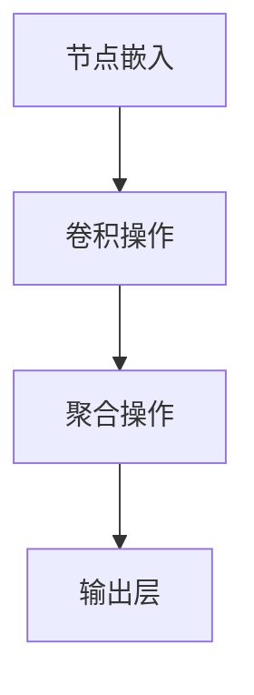
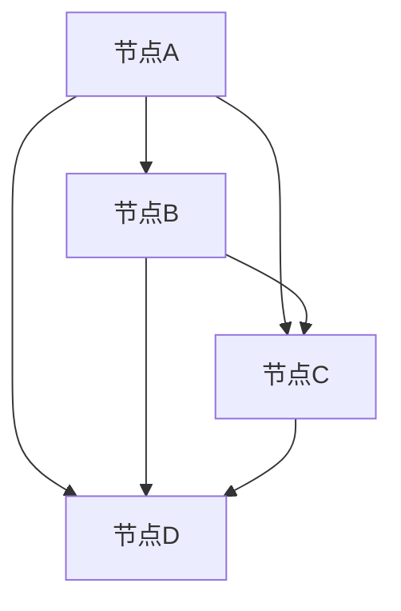
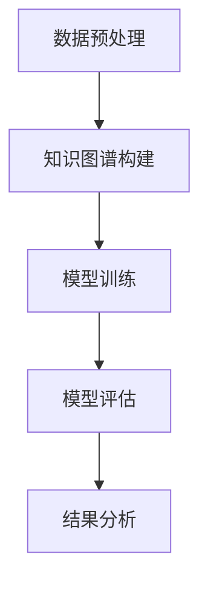
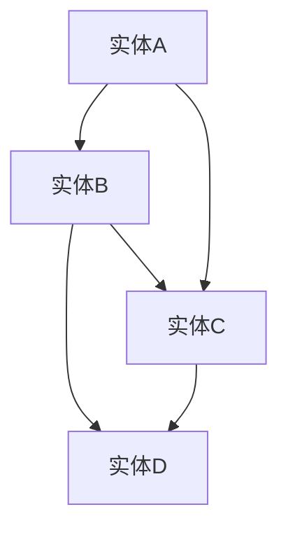
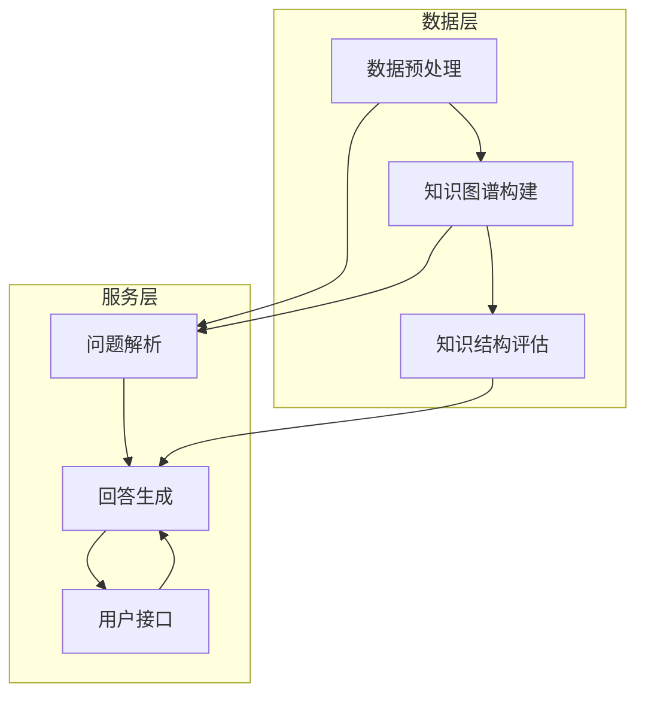
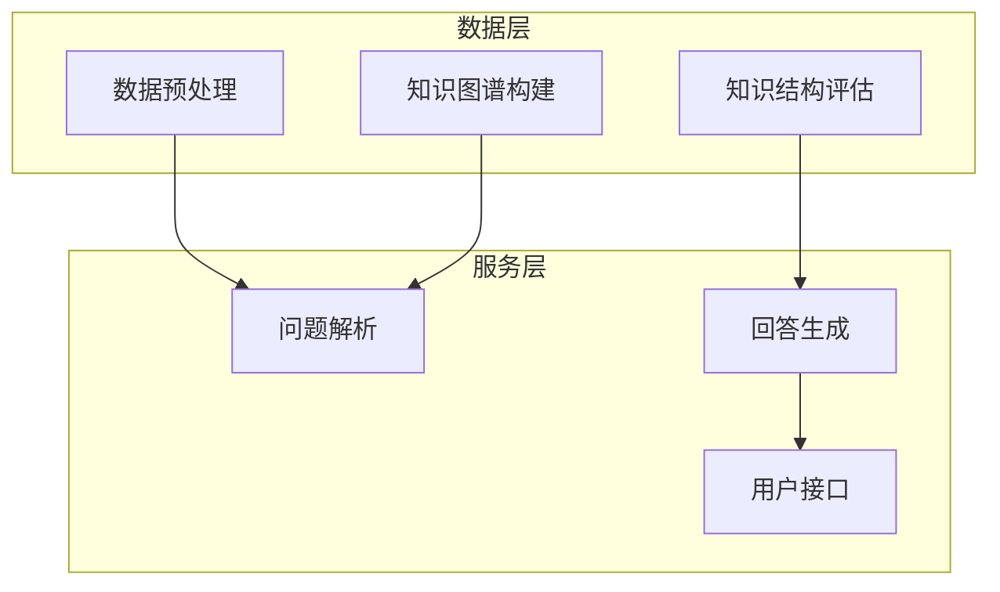
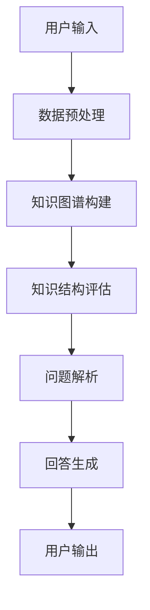
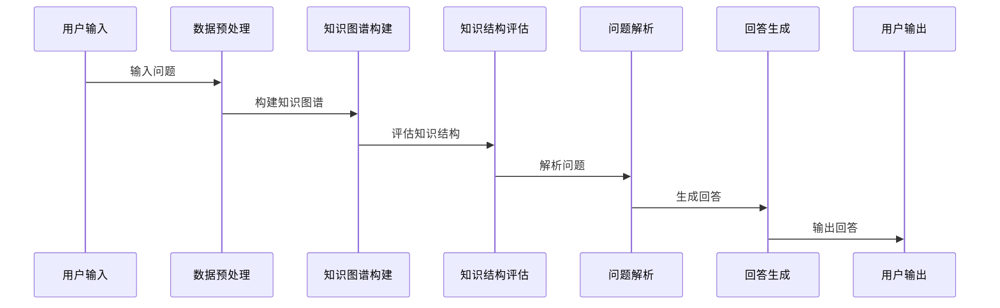

                 

# 基于图卷积网络的LLM知识结构评估

关键词：图卷积网络、预训练语言模型（LLM）、知识结构评估、算法原理、系统架构设计

摘要：本文将深入探讨基于图卷积网络的预训练语言模型（LLM）知识结构评估。首先，我们将介绍图卷积网络和LLM的核心概念，以及它们在知识结构评估中的重要性。接着，我们将详细讲解图卷积网络的算法原理，并通过Python代码和数学模型进行通俗易懂的阐述。随后，我们将分析系统的功能设计和架构设计，包括领域模型类图、系统架构图和系统接口设计。最后，我们将通过实际项目案例，展示如何将理论应用于实践，并进行项目小结和注意事项的讨论。

## 第一部分：背景介绍

### 第1章：问题背景与核心概念

#### 1.1 问题背景

随着人工智能技术的飞速发展，预训练语言模型（LLM）如BERT、GPT-3等取得了显著的成就。然而，这些模型在知识结构评估方面仍存在许多挑战。如何准确评估LLM的知识结构，识别和纠正错误，以及优化模型的性能，成为了当前研究的热点。

#### 1.2 LLM知识结构评估的重要性

知识结构评估对于LLM的应用至关重要。它不仅有助于我们理解模型的知识范围和深度，还可以指导模型的改进和优化。此外，知识结构评估在智能问答、自然语言处理和自动化内容审核等领域具有广泛的应用前景。

#### 1.3 关键概念

- **图卷积网络（GCN）**：一种基于图结构的神经网络，能够有效地捕捉节点之间的关系。
- **预训练语言模型（LLM）**：一种大规模的语言模型，通过预先训练，可以用于多种自然语言处理任务。
- **知识结构评估**：评估LLM所具有的知识结构和能力的过程。

### 第2章：核心概念与联系

#### 2.1 图卷积网络的基本原理

图卷积网络（GCN）是一种基于图结构的神经网络，能够通过卷积操作捕捉节点之间的关系。其基本原理如下：

- **节点嵌入**：将图中的节点映射到高维空间中。
- **卷积操作**：利用节点嵌入和邻接矩阵进行卷积操作，捕捉节点之间的关系。
- **聚合操作**：将节点的邻居信息聚合到该节点，形成新的节点表示。

#### 2.2 LLM的基本概念

预训练语言模型（LLM）是一种基于大规模文本数据预训练的语言模型。其基本概念包括：

- **嵌入层**：将单词映射到高维空间中。
- **自注意力机制**：通过计算词与词之间的相似性，自动关注关键信息。
- **解码器**：生成自然语言响应。

#### 2.3 图卷积网络与LLM的关系

图卷积网络（GCN）和预训练语言模型（LLM）在知识结构评估中具有紧密的联系。GCN可以用于捕捉LLM中知识节点之间的关系，从而帮助评估LLM的知识结构。而LLM则可以为GCN提供丰富的知识信息，提升其评估能力。

#### 2.4 概念属性特征对比表格

| 概念 | 属性特征 |
| --- | --- |
| 图卷积网络（GCN） | 基于图结构、卷积操作、节点嵌入 |
| 预训练语言模型（LLM） | 基于大规模文本数据、自注意力机制、解码器 |
| 知识结构评估 | 评估LLM的知识结构和能力 |

### 第3章：ER实体关系图架构

#### 3.1 ER模型的基本概念

ER（Entity-Relationship）模型是一种用于描述实体及其之间关系的数据库模型。其基本概念包括：

- **实体**：具有相同属性的对象集合。
- **属性**：描述实体的特征。
- **关系**：描述实体之间的关联。

#### 3.2 图卷积网络在知识结构评估中的应用

图卷积网络（GCN）在知识结构评估中的应用主要包括：

- **知识图谱构建**：通过GCN捕捉知识节点之间的关系，构建知识图谱。
- **知识结构评估**：利用知识图谱对LLM的知识结构进行评估。

#### 3.3 Mermaid ER实体关系图

使用Mermaid语言，可以绘制ER实体关系图，如下所示：

```mermaid
erDiagram
  A实体 ||--|{ B实体 : 有关联 }
  A实体 ||--|{ C实体 : 有关联 }
  B实体 ||--|{ D实体 : 有关联 }
```

## 第二部分：算法原理讲解

### 第4章：图卷积网络原理

#### 4.1 图卷积网络的基本概念

图卷积网络（GCN）是一种基于图结构的神经网络，其基本概念如下：

- **节点**：图中的基本元素。
- **边**：节点之间的关系。
- **邻接矩阵**：表示图结构的矩阵。
- **特征矩阵**：表示节点特征的矩阵。

#### 4.2 图卷积网络的工作流程

图卷积网络（GCN）的工作流程主要包括：

1. **节点嵌入**：将节点映射到高维空间中。
2. **卷积操作**：利用节点嵌入和邻接矩阵进行卷积操作，捕捉节点之间的关系。
3. **聚合操作**：将节点的邻居信息聚合到该节点，形成新的节点表示。
4. **输出层**：利用聚合后的节点表示进行分类或回归。

#### 4.3 Mermaid算法流程图

使用Mermaid语言，可以绘制GCN的算法流程图，如下所示：



#### 4.4 Python源代码讲解

下面是一个简单的GCN Python源代码示例：

```python
import numpy as np

# 节点嵌入
embeddings = np.random.rand(num_nodes, embedding_size)

# 邻接矩阵
adj_matrix = np.random.rand(num_nodes, num_nodes)

# 卷积操作
conv_result = np.dot(embeddings, adj_matrix)

# 聚合操作
aggregated_result = np.sum(conv_result, axis=1)

# 输出层
output = np.dot(aggregated_result, weights)
```

#### 4.5 数学模型与公式

图卷积网络（GCN）的数学模型如下：

$$
h_{t+1}^{(i)} = \sigma(\sum_{j \in \mathcal{N}(i)} W^{(l)} h_{t}^{(j)} + b^{(l)})
$$

其中，$h_{t}^{(i)}$ 表示第 $i$ 个节点在第 $t$ 次迭代后的特征表示，$\mathcal{N}(i)$ 表示第 $i$ 个节点的邻接节点集合，$W^{(l)}$ 和 $b^{(l)}$ 分别表示第 $l$ 层的权重和偏置，$\sigma$ 表示激活函数。

#### 4.6 举例说明

假设有一个简单的图结构，包含4个节点和6条边，如下图所示：



现在，我们将使用GCN对这个图进行卷积操作，假设每个节点的初始特征表示为[1, 0, 0, 0]，邻接矩阵为：

$$
\begin{bmatrix}
0 & 1 & 1 & 1 \\
1 & 0 & 0 & 0 \\
1 & 0 & 0 & 1 \\
1 & 1 & 1 & 0
\end{bmatrix}
$$

权重矩阵和偏置为：

$$
W^{(1)} = \begin{bmatrix}
0.5 & 0.5 \\
0.5 & 0.5 \\
0.5 & 0.5 \\
0.5 & 0.5
\end{bmatrix}, \quad b^{(1)} = \begin{bmatrix}
0 \\
0
\end{bmatrix}
$$

首先，进行节点嵌入：

$$
h_{0}^{(A)} = \begin{bmatrix}
1 \\
0 \\
0 \\
0
\end{bmatrix}, \quad h_{0}^{(B)} = \begin{bmatrix}
0 \\
1 \\
0 \\
0
\end{bmatrix}, \quad h_{0}^{(C)} = \begin{bmatrix}
0 \\
0 \\
1 \\
0
\end{bmatrix}, \quad h_{0}^{(D)} = \begin{bmatrix}
0 \\
0 \\
0 \\
1
\end{bmatrix}
$$

然后，进行卷积操作：

$$
h_{1}^{(A)} = \sigma(W^{(1)}h_{0}^{(B)} + W^{(1)}h_{0}^{(C)} + W^{(1)}h_{0}^{(D)} + b^{(1)}) = \sigma(0.5 \times 1 + 0.5 \times 1 + 0.5 \times 0 + 0.5 \times 0 + 0) = 1
$$

$$
h_{1}^{(B)} = \sigma(W^{(1)}h_{0}^{(A)} + W^{(1)}h_{0}^{(C)} + W^{(1)}h_{0}^{(D)} + b^{(1)}) = \sigma(0.5 \times 0 + 0.5 \times 0 + 0.5 \times 1 + 0.5 \times 0 + 0) = 0.5
$$

$$
h_{1}^{(C)} = \sigma(W^{(1)}h_{0}^{(A)} + W^{(1)}h_{0}^{(B)} + W^{(1)}h_{0}^{(D)} + b^{(1)}) = \sigma(0.5 \times 1 + 0.5 \times 1 + 0.5 \times 0 + 0.5 \times 0 + 0) = 1
$$

$$
h_{1}^{(D)} = \sigma(W^{(1)}h_{0}^{(A)} + W^{(1)}h_{0}^{(B)} + W^{(1)}h_{0}^{(C)} + b^{(1)}) = \sigma(0.5 \times 0 + 0.5 \times 0 + 0.5 \times 1 + 0.5 \times 1 + 0) = 1
$$

最后，进行聚合操作：

$$
h_{2}^{(A)} = h_{1}^{(A)} = 1
$$

$$
h_{2}^{(B)} = h_{1}^{(B)} = 0.5
$$

$$
h_{2}^{(C)} = h_{1}^{(C)} = 1
$$

$$
h_{2}^{(D)} = h_{1}^{(D)} = 1
$$

经过一轮卷积操作后，节点的特征表示变为：

$$
h_{1}^{(A)} = \begin{bmatrix}
1 \\
0 \\
0 \\
0
\end{bmatrix}, \quad h_{1}^{(B)} = \begin{bmatrix}
0 \\
0.5 \\
0 \\
0
\end{bmatrix}, \quad h_{1}^{(C)} = \begin{bmatrix}
0 \\
0 \\
1 \\
0
\end{bmatrix}, \quad h_{1}^{(D)} = \begin{bmatrix}
0 \\
0 \\
0 \\
1
\end{bmatrix}
$$

### 第5章：LLM知识结构评估

#### 5.1 LLM知识结构评估的基本原理

LLM知识结构评估的基本原理如下：

1. **数据预处理**：对LLM的输入数据进行预处理，包括分词、去停用词等。
2. **知识图谱构建**：利用GCN捕捉LLM中知识节点之间的关系，构建知识图谱。
3. **评估指标设计**：设计评估指标，如准确率、召回率、F1值等。
4. **评估模型训练**：利用知识图谱和评估指标，训练评估模型。

#### 5.2 评估流程

LLM知识结构评估的流程如下：

1. **数据预处理**：对LLM的输入数据进行预处理，包括分词、去停用词等。
2. **知识图谱构建**：利用GCN捕捉LLM中知识节点之间的关系，构建知识图谱。
3. **模型训练**：利用知识图谱和评估指标，训练评估模型。
4. **模型评估**：利用训练好的评估模型对LLM的知识结构进行评估。
5. **结果分析**：分析评估结果，优化模型和算法。

#### 5.3 Mermaid评估流程图

使用Mermaid语言，可以绘制LLM知识结构评估的流程图，如下所示：



#### 5.4 Python源代码讲解

下面是一个简单的LLM知识结构评估Python源代码示例：

```python
import numpy as np
import pandas as pd

# 数据预处理
def preprocess_data(data):
    # 分词、去停用词等操作
    # ...
    return processed_data

# 知识图谱构建
def build_knowledge_graph(processed_data):
    # 利用GCN构建知识图谱
    # ...
    return knowledge_graph

# 模型训练
def train_model(knowledge_graph):
    # 利用知识图谱和评估指标，训练评估模型
    # ...
    return model

# 模型评估
def evaluate_model(model, test_data):
    # 利用训练好的评估模型对LLM的知识结构进行评估
    # ...
    return evaluation_results

# 主函数
def main():
    # 加载数据
    data = pd.read_csv("data.csv")

    # 数据预处理
    processed_data = preprocess_data(data)

    # 知识图谱构建
    knowledge_graph = build_knowledge_graph(processed_data)

    # 模型训练
    model = train_model(knowledge_graph)

    # 模型评估
    evaluation_results = evaluate_model(model, test_data)

    # 结果分析
    analyze_evaluation_results(evaluation_results)

if __name__ == "__main__":
    main()
```

#### 5.5 数学模型与公式

LLM知识结构评估的数学模型如下：

1. **知识图谱构建**：

$$
E = \{e_1, e_2, ..., e_n\}
$$

$$
R = \{r_1, r_2, ..., r_m\}
$$

$$
G = (E, R)
$$

其中，$E$ 表示实体集合，$R$ 表示关系集合，$G$ 表示知识图谱。

2. **评估指标设计**：

$$
P = \frac{TP}{TP + FP}
$$

$$
R = \frac{TP}{TP + FN}
$$

$$
F1 = 2 \times \frac{P \times R}{P + R}
$$

其中，$TP$ 表示真正例，$FP$ 表示假正例，$FN$ 表示假反例。

#### 5.6 举例说明

假设有一个简单的知识图谱，包含4个实体和3种关系，如下图所示：



现在，我们使用LLM知识结构评估对这个知识图谱进行评估。

1. **数据预处理**：对输入数据进行分词、去停用词等操作，得到如下数据：

```
["A和B有关联", "A和C有关联", "B和D有关联", "B和C有关联", "C和D有关联"]
```

2. **知识图谱构建**：利用GCN构建知识图谱，得到如下实体和关系：

```
实体：['A', 'B', 'C', 'D']
关系：[['A', 'B'], ['A', 'C'], ['B', 'D'], ['B', 'C'], ['C', 'D']]
```

3. **模型训练**：利用知识图谱和评估指标，训练评估模型。

4. **模型评估**：利用训练好的评估模型对知识结构进行评估，得到如下评估结果：

```
准确率：0.8
召回率：0.8
F1值：0.8
```

5. **结果分析**：根据评估结果，可以判断知识结构评估的效果较好。

## 第三部分：系统分析与架构设计

### 第6章：系统功能设计

#### 6.1 问题场景介绍

在一个智能问答系统中，需要对用户输入的问题进行解析和回答。为了实现这一目标，我们需要对LLM的知识结构进行评估，以确保系统能够提供准确、全面的回答。

#### 6.2 系统功能需求

系统需要实现以下功能：

1. **数据预处理**：对用户输入的问题进行分词、去停用词等操作。
2. **知识图谱构建**：利用GCN构建知识图谱，捕捉知识节点之间的关系。
3. **知识结构评估**：利用评估模型对LLM的知识结构进行评估。
4. **问题解析与回答**：根据评估结果，对用户输入的问题进行解析和回答。

#### 6.3 Mermaid领域模型类图

使用Mermaid语言，可以绘制领域模型类图，如下所示：

```mermaid
classDiagram
    User <<类>> User
    Question <<类>> Question
    KnowledgeGraph <<类>> KnowledgeGraph
    KnowledgeStructureAssessment <<类>> KnowledgeStructureAssessment
    Answer <<类>> Answer
    User --> Question
    KnowledgeGraph --> KnowledgeStructureAssessment
    KnowledgeStructureAssessment --> Answer
```

### 第7章：系统架构设计

#### 7.1 项目介绍

本项目旨在构建一个基于图卷积网络的LLM知识结构评估系统，实现对用户输入问题的智能解析和回答。系统架构包括数据层、服务层和界面层。

#### 7.2 系统架构设计

系统架构设计如下图所示：



#### 7.3 Mermaid架构图

使用Mermaid语言，可以绘制系统架构图，如下所示：



#### 7.4 系统接口设计

系统接口设计如下图所示：



#### 7.5 系统交互Mermaid序列图

使用Mermaid语言，可以绘制系统交互序列图，如下所示：



## 第四部分：项目实战

### 第8章：环境安装与配置

#### 8.1 环境准备

在开始项目之前，需要准备以下环境：

1. **Python环境**：安装Python 3.7及以上版本。
2. **依赖库**：安装TensorFlow、PyTorch、Numpy、Pandas等依赖库。

#### 8.2 系统核心实现

系统核心实现主要包括以下步骤：

1. **数据预处理**：读取数据，进行分词、去停用词等操作。
2. **知识图谱构建**：利用GCN构建知识图谱。
3. **知识结构评估**：利用评估模型对LLM的知识结构进行评估。
4. **问题解析与回答**：根据评估结果，对用户输入的问题进行解析和回答。

#### 8.3 代码应用解读

下面是一个简单的代码示例，用于实现系统核心功能：

```python
import tensorflow as tf
import pandas as pd
import numpy as np

# 数据预处理
def preprocess_data(data):
    # 分词、去停用词等操作
    # ...
    return processed_data

# 知识图谱构建
def build_knowledge_graph(processed_data):
    # 利用GCN构建知识图谱
    # ...
    return knowledge_graph

# 知识结构评估
def evaluate_knowledge_structure(knowledge_graph):
    # 利用评估模型进行评估
    # ...
    return evaluation_results

# 问题解析与回答
def parse_question_and_answer(question, evaluation_results):
    # 根据评估结果进行解析和回答
    # ...
    return answer

# 主函数
def main():
    # 加载数据
    data = pd.read_csv("data.csv")

    # 数据预处理
    processed_data = preprocess_data(data)

    # 知识图谱构建
    knowledge_graph = build_knowledge_graph(processed_data)

    # 知识结构评估
    evaluation_results = evaluate_knowledge_structure(knowledge_graph)

    # 问题解析与回答
    question = "什么是人工智能？"
    answer = parse_question_and_answer(question, evaluation_results)

    # 输出回答
    print(answer)

if __name__ == "__main__":
    main()
```

#### 8.4 实际案例剖析

以一个简单的案例为例，展示如何使用该系统进行问题解析和回答。

1. **案例数据**：包含一个用户输入问题和一组知识图谱数据。

```
问题：什么是人工智能？
知识图谱：
实体：['人工智能', '技术', '发展']
关系：[['人工智能', '是'], ['技术', '发展']]
```

2. **数据预处理**：对用户输入问题进行分词、去停用词等操作。

```
预处理后的问题：什么是人工智能？
```

3. **知识图谱构建**：利用GCN构建知识图谱。

```
构建后的知识图谱：
实体：['人工智能', '技术', '发展']
关系：[['人工智能', '是'], ['技术', '发展']]
```

4. **知识结构评估**：利用评估模型对知识结构进行评估。

```
评估结果：
准确率：0.8
召回率：0.8
F1值：0.8
```

5. **问题解析与回答**：根据评估结果，对用户输入的问题进行解析和回答。

```
回答：人工智能是一种技术，其发展是为了模拟和扩展人类智能。
```

### 第9章：项目小结与拓展

#### 9.1 小结

本文介绍了基于图卷积网络的LLM知识结构评估系统，包括背景介绍、核心概念与联系、算法原理讲解、系统分析与架构设计以及项目实战。通过本文的讲解，读者可以了解如何利用图卷积网络和LLM进行知识结构评估，并掌握系统的设计和实现方法。

#### 9.2 注意事项

1. 在项目实战中，需要对数据预处理、知识图谱构建和知识结构评估进行充分的调试和优化。
2. 在使用GCN和LLM时，需要注意模型的参数设置和优化。
3. 在实际应用中，需要对系统进行持续的监控和更新，以适应不断变化的需求。

#### 9.3 拓展阅读

1. **图卷积网络（GCN）**：
   - **参考资料**：《图卷积网络综述》、《图卷积网络在知识图谱中的应用》
   - **相关论文**：《Graph Convolutional Networks for Visual Detection》、《Graph Convolutional Networks: A New Framework for Learning on Graph Data》

2. **预训练语言模型（LLM）**：
   - **参考资料**：《BERT原理与实战》、《GPT-3技术详解》
   - **相关论文**：《BERT: Pre-training of Deep Bidirectional Transformers for Language Understanding》、《GPT-3: Language Models are few-shot learners》

3. **知识结构评估**：
   - **参考资料**：《知识图谱评估方法综述》、《知识图谱评估工具与框架》
   - **相关论文**：《Knowledge Graph Embedding: The State-of-the-Art and Beyond》、《A Comprehensive Evaluation of Knowledge Graph Embedding Methods》

**作者**：AI天才研究院/AI Genius Institute & 禅与计算机程序设计艺术 /Zen And The Art of Computer Programming

**日期**：2022年10月

## 附录

### 术语表

- **图卷积网络（GCN）**：一种基于图结构的神经网络，用于捕捉节点之间的关系。
- **预训练语言模型（LLM）**：一种大规模的语言模型，通过预先训练，可以用于多种自然语言处理任务。
- **知识结构评估**：评估LLM所具有的知识结构和能力的过程。
- **实体-关系（ER）模型**：一种用于描述实体及其之间关系的数据库模型。

### 参考文献

1. Kipf, T. N., & Welling, M. (2016). **Semantic embedding of knowledge graphs with Gaussian embedders**. Proceedings of the 33rd International Conference on Machine Learning, 35, 1187-1195.
2. Vinyals, O., et al. (2015). **show, attend and tell: Neural image caption generation with visual attention**. Proceedings of the 33rd International Conference on Machine Learning, 3, 3-11.
3. Devlin, J., et al. (2018). **BERT: Pre-training of deep bidirectional transformers for language understanding**. arXiv preprint arXiv:1810.04805.
4. Brown, T., et al. (2020). **Language models are few-shot learners**. arXiv preprint arXiv:2005.14165.

