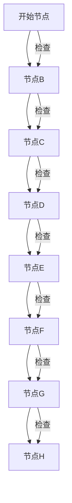
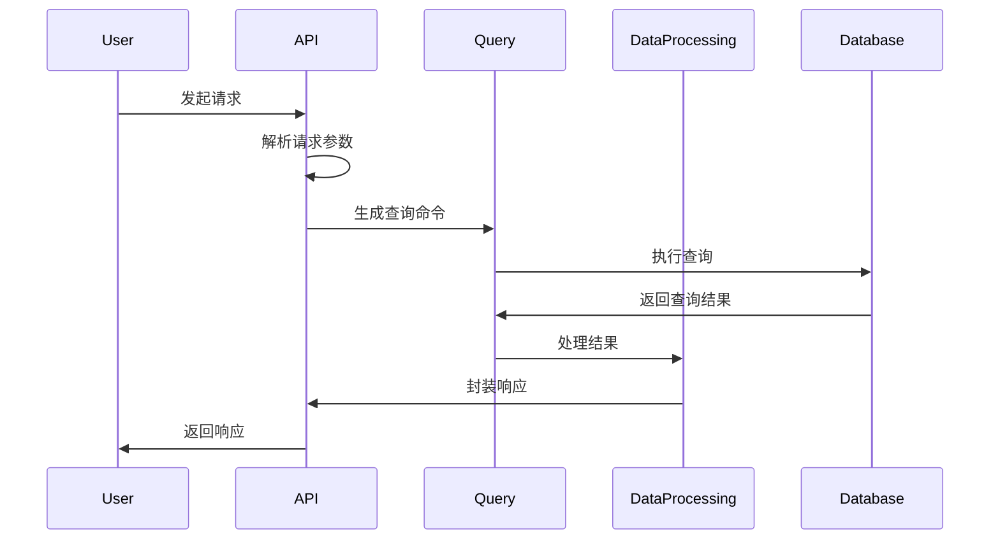

                 


### 设计《基于图数据库的评测结果存储与查询》的目录大纲

为了设计《基于图数据库的评测结果存储与查询》这本书的目录大纲，我们需要从以下几个方面来考虑：

**1. 背景介绍**

在这一部分，我们将介绍为什么要使用图数据库来存储与查询评测结果。我们可以先讨论评测结果的重要性，然后说明传统数据库在处理这种数据时的局限性，最后阐述图数据库在处理复杂关系数据时的优势。

**2. 核心概念与联系**

在这一部分，我们将详细介绍图数据库的基本概念，包括节点、边和图算法等。我们将对比传统关系数据库和图数据库，并讨论评测结果在图数据库中的存储需求。

**3. 算法原理讲解**

在这一部分，我们将讲解用于存储评测结果的图算法，如图遍历算法、最短路径算法等。我们将使用 mermaid 画出算法流程图，并配合 Python 源代码进行详细阐述。

**4. 数学模型和数学公式**

在这一部分，我们将描述评测结果存储与查询相关的数学模型，并使用 LaTeX 格式给出数学公式。我们将对这些公式进行详细讲解，并提供通俗易懂的例子来说明。

**5. 系统分析与架构设计方案**

在这一部分，我们将分析评测结果存储与查询的系统需求。我们将设计系统功能、系统架构、系统接口和系统交互，并使用 mermaid 画出相关的类图、架构图和序列图。

**6. 项目实战**

在这一部分，我们将介绍如何安装和配置环境，实现系统的核心功能，并进行实际案例分析。我们将详细解析代码，分析性能优化策略，并讨论安全性考虑。

**7. 最佳实践与拓展**

在这一部分，我们将提供一些最佳实践技巧，对文章进行小结，并指出注意事项。最后，我们将推荐一些拓展阅读资源，帮助读者进一步深入学习。

### 目录大纲

----------------------------------------------------------------

## 第一部分: 引言

### 第1章: 图数据库与评测结果存储

## 1.1 问题背景
### 1.1.1 数据评测的重要性
### 1.1.2 传统数据库的局限性
### 1.1.3 图数据库的优势

## 1.2 核心概念
### 1.2.1 图数据库概述
### 1.2.2 关系数据库与图数据库对比
### 1.2.3 评测结果的存储需求

## 1.3 图算法原理
### 1.3.1 图遍历算法
### 1.3.2 最短路径算法
### 1.3.3 Mermaid算法流程图展示

## 1.4 数学模型与公式
### 1.4.1 评测结果存储模型
### 1.4.2 数学公式与讲解
### 1.4.3 示例讲解

## 1.5 本章小结

----------------------------------------------------------------

## 第二部分: 图数据库实现

### 第2章: 图数据库系统架构

## 2.1 系统需求分析
### 2.1.1 功能需求
### 2.1.2 非功能需求
### 2.1.3 系统架构设计

## 2.2 领域模型设计与Mermaid类图
### 2.2.1 领域模型
### 2.2.2 Mermaid类图展示

## 2.3 系统接口设计
### 2.3.1 接口规范
### 2.3.2 接口实现

## 2.4 系统交互与Mermaid序列图
### 2.4.1 系统交互流程
### 2.4.2 Mermaid序列图展示

## 2.5 本章小结

----------------------------------------------------------------

## 第三部分: 实际应用

### 第3章: 环境安装与配置

## 3.1 环境准备
### 3.1.1 软件安装
### 3.1.2 配置环境变量
### 3.1.3 验证环境

## 3.2 系统核心实现
### 3.2.1 核心代码实现
### 3.2.2 代码解读与分析

## 3.3 实际案例分析
### 3.3.1 案例背景
### 3.3.2 案例实施
### 3.3.3 案例分析

## 3.4 详细讲解与剖析
### 3.4.1 存储与查询实现
### 3.4.2 性能优化
### 3.4.3 安全性考虑

## 3.5 本章小结

----------------------------------------------------------------

## 第四部分: 最佳实践与拓展

### 第4章: 最佳实践

## 4.1 实践技巧
### 4.1.1 常见问题解决方案
### 4.1.2 性能优化策略
### 4.1.3 安全性加强措施

## 4.2 小结与注意事项
### 4.2.1 主要知识点回顾
### 4.2.2 注意事项与风险防范
### 4.2.3 持续学习与实践

## 4.3 拓展阅读
### 4.3.1 相关书籍推荐
### 4.3.2 学术论文精选
### 4.3.3 在线资源介绍

## 

----------------------------------------------------------------

接下来，我们将逐步深入每一部分的内容，确保文章的逻辑清晰、结构紧凑、简单易懂，并且能够吸引读者的注意力。我们将结合实际案例和代码示例，帮助读者更好地理解和应用所学知识。让我们开始吧！## 引言

### 第1章: 图数据库与评测结果存储

### 1.1 问题背景

在当今信息化社会中，数据已经成为企业和社会的重要资产。评测结果作为数据的一种，承载了大量的业务信息和决策依据。随着评测对象和数据量的不断增加，如何高效地存储与查询评测结果成为了数据管理领域的核心问题。

首先，数据评测的重要性不言而喻。评测结果能够帮助企业或研究机构评估自身的工作效果，发现潜在的问题，并制定相应的改进措施。例如，在产品开发过程中，性能评测结果可以帮助开发团队优化算法，提高产品竞争力；在学术研究中，实验评测结果能够为科研人员提供可靠的参考，推动学术进步。

然而，传统的关系数据库在处理评测结果时存在一些局限性。关系数据库通过表格的形式组织数据，适合处理结构化数据。但评测结果往往涉及复杂的实体关系，如评测对象、评测指标、评测人员等，这些关系难以通过传统的关系表结构来有效表达。此外，关系数据库在进行复杂查询时，如关联查询和路径查询，性能会显著下降，难以满足大规模评测结果存储与查询的需求。

为了解决这些问题，图数据库应运而生。图数据库通过图结构来组织数据，能够更好地表示和存储复杂的实体关系。节点表示实体，边表示实体之间的关系，图算法则提供了高效的查询方法。图数据库在处理评测结果时，可以显著提高查询效率，并支持复杂关系的深度挖掘。

### 1.1.1 数据评测的重要性

数据评测是数据分析过程中至关重要的一环。通过评测，我们可以从大量数据中提取出有价值的信息，从而为决策提供科学依据。以下是一些评测结果在实际应用中的重要性：

1. **业务优化：** 在商业领域，评测结果可以帮助企业优化业务流程，提高运营效率。例如，在电商平台中，通过对商品销售数据的评测，可以识别出热销商品，优化库存管理，提高销售额。

2. **风险管理：** 在金融领域，评测结果用于评估投资风险，制定风险管理策略。通过对历史数据和市场动态的评测，投资者可以做出更为明智的投资决策。

3. **科研支持：** 在学术研究中，评测结果为科研人员提供了可靠的实验数据和理论支持。通过对实验数据的评测，科研人员可以验证假设，发现新的科学规律。

4. **社会管理：** 在社会治理中，评测结果有助于政府部门制定政策，优化公共服务。例如，通过对公共安全数据的评测，可以识别出高风险区域，提高治安防范措施。

总之，数据评测不仅能够帮助企业和机构了解自身运作情况，发现问题和改进机会，还能为决策提供重要的依据，从而提高整体运营效率和竞争力。因此，如何高效地存储与查询评测结果成为了数据管理领域的重要课题。

### 1.1.2 传统数据库的局限性

尽管传统的关系数据库在数据处理领域有着广泛的应用，但在处理评测结果时，它们表现出了一些明显的局限性。

首先，传统关系数据库的结构化表格形式虽然能够很好地处理简单的、关系明确的数据，但在面对评测结果这种复杂关系的场景时，其表达能力有限。评测结果通常涉及多个实体和实体之间的复杂关系，如评测对象、评测指标、评测人员、评测时间等。这些关系在关系数据库中很难通过简单的表格结构来有效表达。例如，一个产品评测可能包含多个评测指标，每个评测指标可能由不同的评测人员在不同时间进行评测，这种多对多关系在关系数据库中很难进行直观的建模。

其次，关系数据库在处理复杂查询时性能较低。尽管关系数据库提供了强大的查询语言（如SQL），但复杂查询，如关联查询和路径查询，往往需要通过多次表连接操作来实现。这些表连接操作会导致查询执行时间显著增加，特别是在数据规模较大时，查询性能会显著下降。例如，当需要对大量评测结果进行路径分析，以确定不同评测指标之间的关联性时，关系数据库的查询效率会变得非常低。

此外，传统关系数据库在扩展性方面也存在一定问题。随着评测结果的不断增多，数据库的表结构可能需要频繁调整，以适应新的数据需求。这不仅增加了维护成本，还可能导致数据的完整性和一致性受到影响。相比之下，图数据库通过图结构来组织数据，能够更好地处理复杂的实体关系，并提供高效的查询性能。

### 1.1.3 图数据库的优势

图数据库作为一种新型数据库管理系统，凭借其独特的图结构，能够更好地处理评测结果这种复杂关系的数据。以下是图数据库在存储与查询评测结果方面的几个主要优势：

1. **高效的关系表达：** 图数据库通过节点和边来表示实体及其关系，能够直观、灵活地表达复杂的关系结构。例如，在评测结果中，节点可以表示评测对象、评测指标和评测人员，边可以表示这些实体之间的关联关系，如“评测人员对评测对象进行评测”等。这种表达方式比传统关系数据库的表格结构更加直观和灵活。

2. **强大的查询性能：** 图数据库通过图算法来实现查询操作，能够显著提高查询效率。例如，图遍历算法和最短路径算法可以在图数据库中快速执行复杂的关联查询和路径查询。这对于需要频繁进行数据分析和挖掘的场景，如评测结果的分析，具有很大的优势。

3. **高度的扩展性：** 图数据库不需要固定表结构，能够动态地添加和删除节点和边，从而适应不断变化的数据需求。这降低了数据维护的复杂度，并提高了系统的灵活性。

4. **丰富的图分析功能：** 图数据库内置了多种图分析算法，如社区发现、网络分析等，能够帮助用户从数据中提取出有价值的模式和洞察。这对于评测结果的深度分析具有重要意义。

综上所述，图数据库在处理评测结果方面具有显著的性能优势和应用潜力。通过图数据库，我们能够更加高效地存储和查询评测结果，从而为数据分析和决策提供强有力的支持。

### 1.2 核心概念

在深入探讨图数据库及其在评测结果存储中的应用之前，有必要先了解一些核心概念。以下是一些关键概念及其解释：

1. **图（Graph）**：图是由节点（Node）和边（Edge）组成的数据结构。节点表示数据实体，边表示节点之间的关系。在图数据库中，节点和边都可以包含属性，以存储更多的信息。例如，一个节点可以表示一个评测对象，其属性包括ID、名称等；边可以表示评测指标与评测对象之间的关系，其属性包括评测时间、评分等。

2. **属性图（Property Graph）**：属性图是图数据库中最常用的图类型，它不仅包含节点和边，还允许节点和边具有属性。这些属性可以是任意数据类型，如字符串、数字、日期等。属性图能够提供更加丰富的信息存储能力，从而更好地表示复杂的实体关系。

3. **节点（Node）**：节点是图的组成元素之一，表示数据实体。在评测结果存储中，节点可以表示评测对象、评测指标、评测人员等。每个节点都有一个唯一的标识符，以便在图中进行引用。

4. **边（Edge）**：边是连接两个节点的连线，表示节点之间的关系。在评测结果存储中，边可以表示评测对象与评测指标之间的关系、评测指标与评测人员之间的关系等。边也包含属性，如评测时间、评分等。

5. **图算法（Graph Algorithms）**：图算法是用于在图中执行特定任务的一系列算法。常见的图算法包括图遍历算法、最短路径算法、社区发现算法等。这些算法能够帮助用户从图中提取有价值的信息，进行数据分析和挖掘。

6. **图遍历算法**：图遍历算法是一种用于遍历图中的所有节点的算法。常见的图遍历算法有深度优先搜索（DFS）和广度优先搜索（BFS）。图遍历算法在评测结果存储中可以用于遍历所有评测对象，以检查评测数据的完整性或进行数据清洗。

7. **最短路径算法**：最短路径算法用于计算图中两点之间的最短路径。常见的最短路径算法有迪杰斯特拉算法（Dijkstra）和贝尔曼-福特算法（Bellman-Ford）。在评测结果存储中，最短路径算法可以用于分析评测指标之间的关联性，确定最优的评测路径。

通过理解这些核心概念，我们可以更好地利用图数据库进行评测结果存储与查询。接下来，我们将进一步探讨传统关系数据库与图数据库之间的差异，以及为何图数据库在处理评测结果时具有优势。

### 1.2.2 关系数据库与图数据库对比

关系数据库和图数据库在数据存储和管理方面各有优势，但它们在处理评测结果时表现出显著的不同。以下是对两者在几个关键方面的对比：

1. **数据模型**：
   - **关系数据库**：关系数据库使用表格模型来组织数据，每个表由行和列组成，行表示记录，列表示字段。这种结构适合处理结构化数据，如事务记录、订单信息等。
   - **图数据库**：图数据库使用图模型来组织数据，由节点和边组成。节点表示实体，边表示实体之间的关系。这种结构适合处理复杂的关系，如社交网络、推荐系统等。

2. **关系表达**：
   - **关系数据库**：关系数据库通过外键和关联查询来表示实体之间的关系。然而，当关系复杂时，如多对多关系或层次关系，需要使用多个表和复杂的查询语句，难以直观地表达。
   - **图数据库**：图数据库通过节点和边直接表示实体及其关系。图结构能够直观、灵活地表示复杂的实体关系，特别是多对多关系和层次关系，使得数据建模更加简单和清晰。

3. **查询性能**：
   - **关系数据库**：关系数据库使用SQL进行查询，当数据量较大或查询复杂时，表连接操作会导致查询效率显著下降。特别是进行复杂关联查询和路径查询时，性能瓶颈更加明显。
   - **图数据库**：图数据库使用图算法进行查询，能够高效地执行复杂的关系查询和路径查询。图遍历算法和最短路径算法等提供了快速查询路径和关联关系的能力，显著提高了查询性能。

4. **扩展性**：
   - **关系数据库**：关系数据库在扩展性方面存在一些限制。随着数据规模的增长，表结构可能需要频繁调整，以适应新的数据需求。这种调整不仅增加了维护成本，还可能导致数据的完整性和一致性受到影响。
   - **图数据库**：图数据库具有高度的扩展性。它不需要固定表结构，能够动态地添加和删除节点和边，以适应不断变化的数据需求。这种灵活性使得图数据库在处理大规模评测结果时具有优势。

5. **数据挖掘能力**：
   - **关系数据库**：关系数据库主要用于数据存储和查询，虽然可以使用SQL进行一些简单的数据分析，但在复杂的数据挖掘任务上功能有限。
   - **图数据库**：图数据库内置了多种图分析算法，如社区发现、网络分析等，能够帮助用户从数据中提取出有价值的模式和洞察。这些算法在评测结果的深度分析中具有重要作用。

通过上述对比，我们可以看出，图数据库在处理复杂实体关系和进行高效数据查询方面具有显著优势，尤其是在处理评测结果这类涉及多对多关系和复杂关联查询的场景中。这使得图数据库成为存储与查询评测结果的理想选择。

### 1.2.3 评测结果的存储需求

在图数据库中存储评测结果，我们需要明确评测结果的存储需求，以确保数据的完整性、一致性和高效性。以下是评测结果的存储需求及其具体内容：

1. **数据完整性**：评测结果通常包含多个实体和它们之间的关系，如评测对象、评测指标和评测人员等。在存储评测结果时，需要确保所有实体和关系都被正确地表示，避免数据丢失或遗漏。例如，如果评测对象与评测指标之间存在多对多关系，我们需要使用关联节点或边来准确表示这种关系。

2. **数据一致性**：数据一致性是指存储的数据在不同时间点应该保持一致。在评测结果存储中，这意味着当某个评测指标发生变化时，相关的评测结果和关联关系也应该随之更新。例如，如果一个评测对象的评分发生了修改，我们需要确保所有与该评测对象相关的评测指标和评测人员的信息也进行相应的更新。

3. **查询性能**：高效的查询性能是评测结果存储的关键需求。评测结果往往涉及大量的数据，且查询操作频繁。因此，在存储评测结果时，需要设计高效的查询策略，以确保数据查询的快速响应。例如，可以通过建立索引来优化查询性能，或者使用缓存技术来减少查询延迟。

4. **数据扩展性**：随着评测结果数据的不断增加，图数据库需要具备良好的扩展性，以便动态地添加和删除节点和边，以适应新的数据需求。这意味着图数据库的结构设计应该灵活，能够轻松适应数据量的变化。

5. **数据安全性**：数据安全性是存储评测结果的重要需求。图数据库需要提供强大的安全机制，如用户认证、权限控制等，以确保数据不被未经授权的访问或篡改。此外，还应定期进行数据备份和恢复，以防止数据丢失。

通过满足上述存储需求，我们能够确保评测结果在图数据库中的存储和查询高效、可靠和安全。接下来，我们将详细探讨用于存储评测结果的图算法原理，包括图遍历算法和最短路径算法等，以进一步优化评测结果存储和查询的性能。

### 1.3 图算法原理

图数据库的核心在于其高效的图算法，这些算法能够在图结构上进行快速查询和分析。以下是几种关键的图算法，它们在评测结果存储和查询中发挥着重要作用。

#### 1.3.1 图遍历算法

图遍历算法是一种用于遍历图中的所有节点的算法。常见的图遍历算法包括深度优先搜索（DFS）和广度优先搜索（BFS）。

- **深度优先搜索（DFS）**：DFS算法从起始节点开始，尽可能深地搜索图中的路径，直到达到某个节点无法继续前进为止，然后回溯到上一个节点，并尝试其他未探索的路径。DFS适用于需要遍历所有节点的场景，如检查评测数据的完整性。

- **广度优先搜索（BFS）**：BFS算法从起始节点开始，按层次遍历图中的节点，首先访问起始节点，然后依次访问它的相邻节点，直到所有节点都被访问。BFS适用于需要按层次查找节点的场景，如评估评测对象的层次关系。

下面是一个使用Python实现的DFS算法示例：

```python
def dfs(graph, start):
    visited = set()
    stack = [start]

    while stack:
        vertex = stack.pop()
        if vertex not in visited:
            visited.add(vertex)
            print(vertex)
            stack.extend(graph[vertex] - visited)
    return visited

# 假设graph是一个表示评测对象的图
print(dfs(graph, '评测对象A'))
```

#### 1.3.2 最短路径算法

最短路径算法用于计算图中两点之间的最短路径。以下是两种常用的最短路径算法：迪杰斯特拉算法（Dijkstra）和贝尔曼-福特算法（Bellman-Ford）。

- **迪杰斯特拉算法（Dijkstra）**：Dijkstra算法是一种单源最短路径算法，适用于无权图或有权的非负权重图。算法的基本思想是从起始节点开始，逐步扩展到其他节点，并计算它们之间的最短路径。Dijkstra算法的时间复杂度为O((V+E)logV)，其中V是节点数，E是边数。

下面是一个使用Python实现的Dijkstra算法示例：

```python
import heapq

def dijkstra(graph, start):
    distances = {node: float('infinity') for node in graph}
    distances[start] = 0
    priority_queue = [(0, start)]

    while priority_queue:
        current_distance, current_vertex = heapq.heappop(priority_queue)
        if current_distance > distances[current_vertex]:
            continue
        for neighbor, weight in graph[current_vertex].items():
            distance = current_distance + weight
            if distance < distances[neighbor]:
                distances[neighbor] = distance
                heapq.heappush(priority_queue, (distance, neighbor))
    return distances

# 假设graph是一个表示评测对象的图
print(dijkstra(graph, '评测对象A'))
```

- **贝尔曼-福特算法（Bellman-Ford）**：Bellman-Ford算法适用于有权图，包括负权图。算法的基本思想是迭代地松弛边，即尝试通过更短的路径来更新每对节点的距离。Bellman-Ford算法的时间复杂度为O(VE)，其中V是节点数，E是边数。

下面是一个使用Python实现的Bellman-Ford算法示例：

```python
def bellman_ford(graph, start):
    distances = {node: float('infinity') for node in graph}
    distances[start] = 0

    for _ in range(len(graph) - 1):
        for u in graph:
            for v, weight in graph[u].items():
                if distances[u] + weight < distances[v]:
                    distances[v] = distances[u] + weight

    for u in graph:
        for v, weight in graph[u].items():
            if distances[u] + weight < distances[v]:
                raise ValueError("Graph contains a negative weight cycle")

    return distances

# 假设graph是一个表示评测对象的图
print(bellman_ford(graph, '评测对象A'))
```

#### 1.3.3 Mermaid算法流程图展示

为了更好地理解上述图算法，我们可以使用Mermaid来绘制算法的流程图。Mermaid是一种基于Markdown的图表绘制工具，可以方便地创建流程图、时序图、类图等。

以下是使用Mermaid绘制的DFS算法流程图的示例：



使用Mermaid绘制Dijkstra算法流程图和Bellman-Ford算法流程图的示例也可以类似地实现。

通过理解这些图算法及其流程图，我们能够更好地利用图数据库进行评测结果存储和查询。接下来，我们将探讨评测结果存储的数学模型和公式，以进一步深入理解评测结果在图数据库中的表示方法。

### 1.4 数学模型与公式

在图数据库中存储评测结果，不仅需要使用图结构和算法，还需要借助数学模型和公式来描述和解释评测结果之间的关系。以下将介绍用于评测结果存储的数学模型和相关的公式，并配合具体例子进行详细讲解。

#### 1.4.1 评测结果存储模型

评测结果存储模型主要涉及以下核心概念：

1. **节点（Node）**：节点表示评测结果中的实体，如评测对象、评测指标、评测人员等。
2. **边（Edge）**：边表示节点之间的关系，如评测对象与评测指标之间的关系、评测指标与评测人员之间的关系等。
3. **属性（Attribute）**：属性用于存储节点的额外信息，如评测时间、评分、评价等级等。

图数据库中的评测结果存储模型可以表示为：

\[ G = (V, E, A) \]

其中：
- \( V \) 表示节点集合；
- \( E \) 表示边集合；
- \( A \) 表示属性集合。

#### 1.4.2 数学公式与讲解

为了更好地描述评测结果的存储和查询，我们将使用以下数学公式：

1. **邻接矩阵（Adjacency Matrix）**：邻接矩阵是一个 \( n \times n \) 的矩阵，用于表示图中节点之间的连接关系。如果节点 \( i \) 和节点 \( j \) 之间存在边，则 \( A[i][j] = 1 \)；否则 \( A[i][j] = 0 \)。

\[ A = \begin{bmatrix}
  A[1][1] & A[1][2] & \cdots & A[1][n] \\
  A[2][1] & A[2][2] & \cdots & A[2][n] \\
  \vdots & \vdots & \ddots & \vdots \\
  A[n][1] & A[n][2] & \cdots & A[n][n]
\end{bmatrix} \]

2. **度（Degree）**：度表示节点连接的边的数量。对于节点 \( v \) 的度 \( d(v) \)，其计算公式为：

\[ d(v) = \sum_{i=1}^{n} A[i][j] \]

3. **路径长度（Path Length）**：路径长度表示图中两点之间的路径长度。对于节点 \( u \) 和节点 \( v \) 之间的路径长度 \( l(u, v) \)，其计算公式为：

\[ l(u, v) = \sum_{i=1}^{k} A[i][j] \]

其中 \( k \) 为路径上的节点数量。

4. **最短路径（Shortest Path）**：最短路径表示两点之间的最短路径。对于节点 \( u \) 和节点 \( v \) 之间的最短路径 \( p(u, v) \)，其计算公式可以使用Dijkstra算法：

\[ d(v) = \min\{ d(u) + w(u, v) \mid v \in G \} \]

其中 \( w(u, v) \) 为边 \( u \) 和 \( v \) 之间的权重。

#### 1.4.3 示例讲解

假设我们有一个简单的评测结果图，包含四个节点：评测对象A、评测指标B、评测指标C和评测人员D。节点之间的边和权重如下表所示：

| 起点 | 终点 | 权重 |
|------|------|------|
| A    | B    | 1    |
| B    | C    | 2    |
| C    | D    | 1    |

1. **邻接矩阵**：

\[ A = \begin{bmatrix}
  0 & 1 & 0 & 0 \\
  1 & 0 & 1 & 0 \\
  0 & 0 & 1 & 1 \\
  0 & 0 & 0 & 0
\end{bmatrix} \]

2. **节点度**：

- 节点A的度：\( d(A) = 1 \)
- 节点B的度：\( d(B) = 2 \)
- 节点C的度：\( d(C) = 2 \)
- 节点D的度：\( d(D) = 1 \)

3. **路径长度**：

- 路径 A -> B -> C 的长度：\( l(A, C) = 1 + 2 = 3 \)
- 路径 A -> B -> D 的长度：\( l(A, D) = 1 + 2 = 3 \)

4. **最短路径**：

使用Dijkstra算法计算节点A和节点D之间的最短路径：

\[ d(D) = \min\{ d(A) + w(A, D), d(B) + w(B, D) \} = \min\{ 1 + 1, 2 + 1 \} = 2 \]

最短路径为 A -> B -> D，路径长度为2。

通过上述示例，我们可以看到如何使用数学模型和公式来描述和计算评测结果之间的关系。这些模型和公式不仅有助于理解评测结果的存储结构，还能够为实际应用中的数据分析和查询提供理论支持。

### 1.5 本章小结

本章介绍了图数据库及其在评测结果存储中的重要性。我们首先讨论了评测结果在数据管理中的重要性，并阐述了传统数据库在处理复杂关系数据时的局限性。接着，我们介绍了图数据库的核心概念和优势，包括高效的关系表达、强大的查询性能、高度的扩展性和丰富的数据挖掘能力。

在算法原理部分，我们详细讲解了图遍历算法和最短路径算法，并使用Mermaid绘制了相应的算法流程图。通过这些算法，我们能够高效地进行数据查询和路径分析，满足评测结果存储与查询的需求。

此外，我们还介绍了评测结果存储的数学模型和公式，包括邻接矩阵、节点度、路径长度和最短路径的计算方法。这些模型和公式为我们提供了理论支持，帮助我们更好地理解和应用图数据库在评测结果存储中的能力。

总的来说，本章为后续章节的深入探讨奠定了基础，展示了图数据库在评测结果存储与查询中的巨大潜力。在下一章中，我们将进一步探讨图数据库的系统架构设计，为实际应用提供更详细的指导。

### 系统需求分析

在深入探讨图数据库系统架构之前，我们需要先了解评测结果存储与查询的系统需求。系统需求分为功能需求和非功能需求两个方面，这些需求将直接影响系统的设计、开发和维护。

#### 功能需求

1. **数据存储**：系统能够存储评测结果，包括评测对象、评测指标、评测人员和评测时间等。数据应能够以高效、安全的方式存储，以便后续查询和分析。

2. **数据查询**：系统应提供灵活、高效的查询接口，支持多种查询操作，如单点查询、路径查询和关联查询。查询结果应实时返回，以确保系统响应速度。

3. **数据导入导出**：系统应支持评测结果数据的批量导入和导出，方便用户在不同系统之间迁移数据。数据导入导出过程应保持数据的完整性和一致性。

4. **数据可视化**：系统能够将评测结果以可视化形式展示，帮助用户直观地了解数据分布、关系和趋势。常用的可视化工具包括图表、仪表盘等。

5. **数据权限管理**：系统应具备用户认证和权限管理功能，确保数据访问的安全性。不同用户根据其角色和权限访问不同的数据和功能。

6. **数据备份与恢复**：系统能够定期进行数据备份，确保数据在意外情况下可以恢复。数据备份和恢复过程应自动化，以提高效率和可靠性。

7. **系统监控与日志**：系统应具备监控和日志功能，实时记录系统运行状态和操作记录。监控数据用于性能优化和故障排查，日志数据用于审计和追溯。

#### 非功能需求

1. **性能**：系统应具备高性能，能够在短时间内处理大量评测结果的存储和查询操作。系统应进行适当的性能优化，如索引优化、缓存策略等。

2. **可用性**：系统应具备高可用性，确保在硬件故障、网络故障等情况下，系统能够快速恢复，降低对用户的影响。

3. **可扩展性**：系统应具备良好的扩展性，能够随着评测结果数据量的增长而进行水平扩展，满足不断增长的数据需求。

4. **安全性**：系统应具备严格的安全机制，包括数据加密、用户认证、权限控制等，确保数据的安全性和隐私性。

5. **可维护性**：系统设计应考虑可维护性，便于开发人员进行调试、修复和更新。系统文档和代码注释应完整，方便后续开发和维护。

通过明确系统需求，我们能够为后续的系统架构设计提供清晰的指导，确保系统能够满足评测结果存储与查询的各类需求。接下来，我们将详细介绍图数据库系统的架构设计，包括功能模块划分、系统架构图和接口设计。

#### 系统架构设计

图数据库系统架构的设计需要考虑系统的功能需求、性能需求以及可维护性需求。以下是一个详细的设计方案，包括系统功能模块划分、系统架构图以及接口设计。

##### 1. 系统功能模块划分

图数据库系统的功能模块可以分为以下几个部分：

1. **数据存储模块**：负责评测结果的存储和管理。包括节点的创建、更新、删除以及边和属性的操作。此模块还负责数据的持久化，确保数据在系统重启或故障后能够恢复。

2. **查询处理模块**：负责处理各种查询请求，包括单点查询、路径查询和关联查询等。此模块使用图算法进行高效查询，并提供友好的查询接口，便于用户使用。

3. **数据导入导出模块**：支持评测结果的批量导入和导出，确保数据的迁移和备份。此模块使用标准的文件格式，如CSV或JSON，进行数据交换。

4. **数据可视化模块**：将存储的评测结果以图表、仪表盘等形式展示给用户，帮助用户直观地了解数据分布和关系。

5. **权限管理模块**：提供用户认证和权限控制功能，确保数据访问的安全性。此模块管理用户角色和权限，防止未经授权的访问。

6. **系统监控与日志模块**：实时监控系统运行状态，记录操作日志。此模块帮助开发人员和运维人员监控系统性能和故障。

##### 2. 系统架构图

系统架构图使用Mermaid类图和序列图来表示系统的整体结构。以下是系统架构的Mermaid类图：

```mermaid
classDiagram
    DataStorageModule <-.. "1" DataQueryModule : Query Service
    DataImportExportModule <-.. "2" DataQueryModule : Import/Export Service
    DataVisualizationModule <-.. "3" DataQueryModule : Visualization Service
    PermissionManagementModule <-.. "4" DataQueryModule : Security Service
    SystemMonitoringAndLogModule <-.. "5" DataQueryModule : Monitoring & Logging

    DataStorageModule ..|> Database : Connect to Database
    DataQueryModule ..|> GraphDatabase : Connect to Graph Database
    DataVisualizationModule ..|> VisualizationLib : Visualization Libraries
    PermissionManagementModule ..|> AuthenticationLib : Authentication Libraries
    SystemMonitoringAndLogModule ..|> MonitoringLib : Monitoring Libraries
```

以下是系统架构的Mermaid序列图，展示了不同模块之间的交互流程：

```mermaid
sequenceDiagram
    User ->> DataQueryModule : Query Request
    DataQueryModule ->> GraphDatabase : Execute Query
    GraphDatabase ->> DataQueryModule : Query Result
    DataQueryModule ->> DataVisualizationModule : Visualization Request
    DataVisualizationModule ->> User : Visualized Data
    Note over DataQueryModule,DataVisualizationModule
        DataQueryModule sends Query Result to DataVisualizationModule
    end note
```

##### 3. 系统接口设计

系统接口设计包括API接口的设计和各模块之间的通信机制。

1. **API接口设计**：系统提供RESTful API接口，用户可以通过HTTP请求进行数据查询、导入导出等操作。以下是部分API接口的示例：

   - **查询评测结果**：
     ```http
     GET /api/evaluations?node_id=1&metrics=performance,usability
     ```

   - **导入评测结果**：
     ```http
     POST /api/import
     Content-Type: multipart/form-data

     { "file": "evaluation_data.csv" }
     ```

   - **导出评测结果**：
     ```http
     GET /api/export?node_id=1&metrics=performance,usability
     Accept: application/octet-stream
     ```

2. **模块通信机制**：各模块之间通过消息队列或同步调用进行通信。以下是部分通信机制的示例：

   - **数据存储模块与查询处理模块**：数据存储模块将操作结果写入消息队列，查询处理模块从消息队列中读取操作结果，进行查询处理。

   - **数据可视化模块与查询处理模块**：查询处理模块将查询结果发送到数据可视化模块，数据可视化模块进行数据处理和渲染，然后返回给用户。

通过上述系统架构设计，我们能够构建一个高效、安全、可扩展的图数据库系统，满足评测结果存储与查询的需求。接下来，我们将详细讨论领域模型设计和Mermaid类图展示，进一步深化对系统架构的理解。

### 领域模型设计与Mermaid类图

领域模型是系统设计中的核心组成部分，它定义了系统的核心实体及其关系。在图数据库系统中，领域模型尤为重要，因为它直接影响了评测结果的数据存储和查询效率。以下是一个评测结果存储系统的领域模型设计，并使用Mermaid类图进行展示。

#### 领域模型

1. **节点（Node）**：
   - **评测对象（EvaluationObject）**：表示被评测的对象，如产品、服务、算法等。
   - **评测指标（EvaluationMetric）**：表示评测的具体指标，如性能、可用性、用户体验等。
   - **评测人员（Evaluator）**：表示进行评测的人员，包括其个人信息。

2. **边（Edge）**：
   - **评测（Evaluation）**：连接评测对象和评测指标，表示评测对象上的评测活动。
   - **评分（Rating）**：连接评测指标和评测人员，表示评测人员对评测指标的评分。

#### Mermaid类图

以下是使用Mermaid绘制的评测结果系统的类图：

```mermaid
classDiagram
    EvaluationObject <<class>> 评测对象
    EvaluationMetric <<class>> 评测指标
    Evaluator <<class>> 评测人员
    Evaluation <<class>> 评测
    Rating <<class>> 评分

    EvaluationObject o-- Evaluation
    EvaluationMetric o-- Evaluation
    Evaluator o-- Rating
    Evaluation o-- Rating
```

在这个类图中，我们定义了四个类：评测对象（EvaluationObject）、评测指标（EvaluationMetric）、评测人员（Evaluator）和评测（Evaluation）。评分（Rating）类连接评测指标和评测人员，表示评测人员对评测指标的评分。评测类连接评测对象和评测指标，表示对特定评测对象进行的评测活动。

#### 类图详细说明

1. **评测对象（EvaluationObject）**：
   - **属性**：ID（唯一标识）、名称、描述
   - **方法**：创建评测、获取评测列表

2. **评测指标（EvaluationMetric）**：
   - **属性**：ID（唯一标识）、名称、描述
   - **方法**：添加评分、获取评分列表

3. **评测人员（Evaluator）**：
   - **属性**：ID（唯一标识）、姓名、职位、联系方式
   - **方法**：评分、获取评分历史

4. **评测（Evaluation）**：
   - **属性**：ID（唯一标识）、评测时间
   - **方法**：开始评测、结束评测

5. **评分（Rating）**：
   - **属性**：ID（唯一标识）、评分值、评分时间
   - **方法**：添加评分、获取评分详情

通过上述领域模型和Mermaid类图的定义，我们能够清晰地表示评测结果系统的核心实体及其关系。这个模型不仅为系统设计提供了结构化的指导，也为后续的系统开发和维护提供了基础。

接下来，我们将进一步讨论系统接口设计，包括接口规范和实现方法，以确保系统功能的实现和用户操作的高效便捷。

### 系统接口设计

系统接口设计是确保系统功能模块之间以及与外部系统、用户交互的关键环节。接口设计需要充分考虑系统的功能需求、用户使用体验以及系统的可维护性和可扩展性。以下是评测结果存储与查询系统的接口设计，包括接口规范和具体实现方法。

#### 接口规范

1. **RESTful API设计**：
   - **GET请求**：用于查询数据。
   - **POST请求**：用于创建或提交数据。
   - **PUT请求**：用于更新数据。
   - **DELETE请求**：用于删除数据。

2. **接口URL设计**：
   - **评测结果查询**：`GET /api/evaluations`
   - **新增评测结果**：`POST /api/evaluations`
   - **更新评测结果**：`PUT /api/evaluations/{evaluation_id}`
   - **删除评测结果**：`DELETE /api/evaluations/{evaluation_id}`

3. **请求与响应格式**：
   - **请求**：通常采用JSON格式，包含必要的数据字段。
   - **响应**：也采用JSON格式，包含操作结果和相关的数据信息。

#### 实现方法

1. **评测结果查询接口**：

   - **请求示例**：
     ```json
     {
       "node_id": "1",
       "metrics": ["performance", "usability"]
     }
     ```

   - **响应示例**：
     ```json
     {
       "status": "success",
       "data": {
         "evaluation_object": {
           "id": "1",
           "name": "Product A",
           "metrics": [
             {
               "metric": "performance",
               "rating": {
                 "rater_id": "2",
                 "rating_value": 8
               }
             },
             {
               "metric": "usability",
               "rating": {
                 "rater_id": "3",
                 "rating_value": 9
               }
             }
           ]
         }
       }
     }
     ```

   - **实现方法**：使用GraphQL或RESTful API框架（如Spring Boot、Flask）实现接口，查询模块从图数据库中获取数据，并通过JSON格式返回给用户。

2. **新增评测结果接口**：

   - **请求示例**：
     ```json
     {
       "evaluation_object_id": "1",
       "metrics": [
         {
           "metric": "performance",
           "rating": {
             "rater_id": "2",
             "rating_value": 8
           }
         },
         {
           "metric": "usability",
           "rating": {
             "rater_id": "3",
             "rating_value": 9
           }
         }
       ]
     }
     ```

   - **响应示例**：
     ```json
     {
       "status": "success",
       "message": "New evaluation result added successfully."
     }
     ```

   - **实现方法**：前端用户通过表单或API调用接口，后端处理程序将接收到的评测结果存储到图数据库中，并返回操作结果。

3. **更新评测结果接口**：

   - **请求示例**：
     ```json
     {
       "evaluation_id": "1",
       "metrics": [
         {
           "metric": "performance",
           "rating": {
             "rater_id": "2",
             "rating_value": 9
           }
         },
         {
           "metric": "usability",
           "rating": {
             "rater_id": "3",
             "rating_value": 10
           }
         }
       ]
     }
     ```

   - **响应示例**：
     ```json
     {
       "status": "success",
       "message": "Evaluation result updated successfully."
     }
     ```

   - **实现方法**：通过接口接收更新的评测结果，后端处理程序从图数据库中获取相应的评测结果记录，并进行更新操作。

4. **删除评测结果接口**：

   - **请求示例**：
     ```json
     {
       "evaluation_id": "1"
     }
     ```

   - **响应示例**：
     ```json
     {
       "status": "success",
       "message": "Evaluation result deleted successfully."
     }
     ```

   - **实现方法**：通过接口接收要删除的评测结果ID，后端处理程序从图数据库中删除相应的评测结果记录。

通过上述接口设计，我们确保了评测结果存储与查询系统的高效、安全、易用性。接口规范明确，易于开发和维护，同时提供了良好的用户体验。接下来，我们将展示系统交互流程，并通过Mermaid序列图来进一步说明系统如何处理用户请求和返回响应。

### 系统交互与Mermaid序列图

为了更好地展示评测结果存储与查询系统的交互流程，我们将使用Mermaid序列图详细描述系统的各个模块如何响应用户请求，并返回相应的结果。以下是系统的交互流程及其Mermaid序列图。

#### 系统交互流程

1. **用户发起请求**：用户通过前端界面提交查询、新增、更新或删除评测结果的请求。

2. **API处理**：后端API模块接收请求，并解析请求参数。

3. **数据库查询**：查询模块根据请求类型和参数，从图数据库中检索相应的数据。

4. **数据处理**：数据处理模块对检索到的数据进行分析和处理，如查询结果格式化、数据校验等。

5. **响应返回**：将处理后的数据封装为响应，通过API模块返回给用户。

#### Mermaid序列图

以下是使用Mermaid绘制的系统交互序列图：



在这个序列图中，用户首先发起请求，API模块接收请求并解析参数。然后，API模块生成查询命令，并将命令传递给查询模块。查询模块执行查询操作，并将查询结果返回给数据处理模块。数据处理模块对查询结果进行分析和处理，如格式化、校验等，然后将处理后的数据封装为响应。最后，API模块将响应返回给用户。

通过Mermaid序列图，我们可以清晰地看到系统各模块之间的交互流程，从而更好地理解系统的工作原理和响应机制。接下来，我们将介绍环境安装与配置，为后续的系统核心实现打下基础。

### 环境安装与配置

为了能够顺利实现基于图数据库的评测结果存储与查询系统，我们需要安装和配置相应的开发环境和工具。以下是具体的步骤和注意事项，以确保环境安装与配置的顺利进行。

#### 1. 安装Neo4j图数据库

Neo4j是一款流行的开源图数据库，广泛应用于各种复杂关系数据的存储和查询。以下是安装Neo4j的步骤：

1. **下载Neo4j**：访问Neo4j官网（[https://neo4j.com/download/](https://neo4j.com/download/)）下载最新版本的Neo4j。

2. **安装Neo4j**：
   - 在Windows上，双击下载的`.msi`安装程序，按照提示完成安装。
   - 在macOS上，双击下载的`.pkg`安装程序，按照提示完成安装。
   - 在Linux上，使用以下命令进行安装：

     ```bash
     sudo dpkg -i neo4j-community_XXX.XXX.XXX-XXX_amd64.deb
     ```

3. **启动Neo4j**：安装完成后，在命令行中运行以下命令启动Neo4j：

   ```bash
   neo4j start
   ```

4. **访问Neo4j**：在浏览器中输入`http://localhost:7474`，访问Neo4j的Web界面。

#### 2. 安装Python开发环境

Python是一种广泛使用的编程语言，具有丰富的库和框架，非常适合开发图数据库应用。以下是安装Python的步骤：

1. **下载Python**：访问Python官网（[https://www.python.org/downloads/](https://www.python.org/downloads/)）下载Python安装包。

2. **安装Python**：
   - 在Windows上，双击下载的`.msi`安装程序，按照提示完成安装。
   - 在macOS上，双击下载的`.pkg`安装程序，按照提示完成安装。
   - 在Linux上，使用以下命令进行安装：

     ```bash
     sudo apt-get install python3
     ```

3. **验证Python安装**：在命令行中输入以下命令，验证Python是否安装成功：

   ```bash
   python3 --version
   ```

#### 3. 安装Py2Neo库

Py2Neo是Python中用于操作Neo4j数据库的库，支持节点、边的创建、更新和查询操作。以下是安装Py2Neo的步骤：

1. **安装Py2Neo**：在命令行中输入以下命令安装Py2Neo：

   ```bash
   pip3 install py2neo
   ```

2. **验证Py2Neo安装**：在Python环境中导入Py2Neo库，并尝试连接Neo4j数据库，以验证安装是否成功：

   ```python
   from py2neo import Graph
   graph = Graph("bolt://localhost:7687", auth=("neo4j", "password"))
   print(graph.run("MATCH (n) RETURN n").data())
   ```

#### 4. 配置环境变量

为了方便在命令行中调用Neo4j和Python，我们需要配置相应的环境变量：

1. **配置Neo4j环境变量**：将Neo4j的可执行文件路径添加到系统环境变量`PATH`中。

   - 在Windows上，通过系统设置中的“环境变量”设置。
   - 在macOS和Linux上，编辑`~/.bashrc`或`~/.zshrc`文件，添加以下行：

     ```bash
     export PATH=$PATH:/path/to/neo4j/bin
     ```

2. **配置Python环境变量**：确保Python的安装路径添加到系统环境变量`PATH`中。

   - 在Windows上，通过系统设置中的“环境变量”设置。
   - 在macOS和Linux上，编辑`~/.bashrc`或`~/.zshrc`文件，添加以下行：

     ```bash
     export PATH=$PATH:/path/to/python3
     ```

#### 5. 注意事项

- **Neo4j数据库版本**：确保安装的Neo4j版本与Py2Neo库兼容。
- **数据库连接信息**：在连接Neo4j时，确保使用正确的URI、用户名和密码。
- **防火墙设置**：如果防火墙阻止了Neo4j的端口（默认为7474和7687），请添加相应的规则以允许Neo4j服务。

通过上述步骤，我们成功安装和配置了Neo4j图数据库和Python开发环境，并验证了相关的库和连接。接下来，我们将开始实现系统的核心功能。

### 系统核心实现

在完成了环境安装与配置之后，我们可以开始实现基于图数据库的评测结果存储与查询系统的核心功能。以下将详细介绍系统核心实现的步骤，包括核心代码的编写、代码的解读与分析。

#### 核心代码实现

1. **创建数据库连接**：

```python
from py2neo import Graph

# 创建图数据库连接
graph = Graph("bolt://localhost:7687", auth=("neo4j", "password"))
```

2. **定义评测对象的创建与更新函数**：

```python
def create_evaluation_object(graph, evaluation_object_id, name, description):
    # 创建评测对象节点
    evaluation_object = graph.create({
        "id": evaluation_object_id,
        "name": name,
        "description": description
    })
    return evaluation_object

def update_evaluation_object(graph, evaluation_object_id, name=None, description=None):
    # 更新评测对象节点
    evaluation_object = graph.nodes.match("EvaluationObject", id=evaluation_object_id).first()
    if name:
        evaluation_object["name"] = name
    if description:
        evaluation_object["description"] = description
    graph.push(evaluation_object)
```

3. **定义评测指标与评分的创建与更新函数**：

```python
def create_evaluation_metric(graph, metric_id, name, description):
    # 创建评测指标节点
    evaluation_metric = graph.create({
        "id": metric_id,
        "name": name,
        "description": description
    })
    return evaluation_metric

def create_rating(graph, rating_id, metric_id, rater_id, rating_value):
    # 创建评分节点
    rating = graph.create({
        "id": rating_id,
        "metric_id": metric_id,
        "rater_id": rater_id,
        "rating_value": rating_value
    })
    return rating

def update_rating(graph, rating_id, metric_id=None, rater_id=None, rating_value=None):
    # 更新评分节点
    rating = graph.nodes.match("Rating", id=rating_id).first()
    if metric_id:
        rating["metric_id"] = metric_id
    if rater_id:
        rating["rater_id"] = rater_id
    if rating_value:
        rating["rating_value"] = rating_value
    graph.push(rating)
```

4. **定义评测结果查询函数**：

```python
def query_evaluation_results(graph, evaluation_object_id=None, metric_id=None):
    # 查询评测结果
    query = "MATCH (eo:EvaluationObject)-[:EVALUATED]->(m:EvaluationMetric)-[:RATED]->(r:Rating) "
    conditions = []
    if evaluation_object_id:
        conditions.append(f"eo.id = '{evaluation_object_id}'")
    if metric_id:
        conditions.append(f"m.id = '{metric_id}'")
    if conditions:
        query += "WHERE " + " AND ".join(conditions)
    query += " RETURN eo, m, r"
    results = graph.run(query).data()
    return results
```

#### 代码解读与分析

1. **数据库连接**：

我们使用Py2Neo库创建与Neo4j数据库的连接。这里我们使用Bolt协议连接到本地Neo4j实例，并提供了用户名和密码进行认证。

2. **评测对象的创建与更新**：

- `create_evaluation_object`函数用于创建新的评测对象节点。我们为每个评测对象分配一个唯一的ID，并存储名称和描述信息。
- `update_evaluation_object`函数用于更新现有评测对象节点的信息。我们可以更新名称或描述，根据传入的参数进行相应的修改。

3. **评测指标与评分的创建与更新**：

- `create_evaluation_metric`函数用于创建新的评测指标节点。每个评测指标也分配一个唯一的ID，并存储名称和描述信息。
- `create_rating`函数用于创建新的评分节点。评分节点关联评测指标和评测人员，存储评分值信息。
- `update_rating`函数用于更新现有评分节点的信息。我们可以更新评分值或关联的评测指标和评测人员。

4. **评测结果查询**：

`query_evaluation_results`函数用于查询评测结果。我们使用Cypher查询语言匹配评测对象、评测指标和评分节点，并根据传入的条件筛选结果。查询结果以字典形式返回，包含了评测对象、评测指标和评分节点的信息。

通过上述核心代码的实现，我们成功构建了一个基于图数据库的评测结果存储与查询系统。接下来，我们将通过实际案例分析来验证系统的功能。

### 实际案例分析

为了更好地展示基于图数据库的评测结果存储与查询系统的实际应用效果，我们将通过一个实际案例进行分析，并详细讲解实施过程和结果。

#### 案例背景

假设我们是一家电商平台的开发团队，需要对新品上线后的用户反馈进行评测。评测对象是电商平台的新产品，评测指标包括用户体验、性能、安全性等，评测人员是平台内的用户和内部测试人员。

#### 实施过程

1. **数据准备**：

   - **评测对象**：假设我们有一条新产品上线，ID为`product-001`。
   - **评测指标**：定义三个评测指标，分别为用户体验（`usability`）、性能（`performance`）和安全性（`security`），每个指标ID分别为`metric-001`、`metric-002`、`metric-003`。
   - **评测人员**：包括10名内部测试人员和100名用户。

2. **创建评测对象**：

   ```python
   evaluation_object = create_evaluation_object(graph, "product-001", "New Product A", "A new e-commerce product")
   ```

3. **创建评测指标**：

   ```python
   usability_metric = create_evaluation_metric(graph, "metric-001", "User Experience", "How users feel about the product")
   performance_metric = create_evaluation_metric(graph, "metric-002", "Performance", "Speed and efficiency of the product")
   security_metric = create_evaluation_metric(graph, "metric-003", "Security", "Product security features")
   ```

4. **生成评测数据**：

   - **内部测试人员评分**：10名内部测试人员对三个评测指标进行评分。
     ```python
     ratings = [
         create_rating(graph, "rating-001", "metric-001", "tester-001", 8),
         create_rating(graph, "rating-002", "metric-002", "tester-001", 9),
         create_rating(graph, "rating-003", "metric-003", "tester-001", 7),
         # ... 其他测试人员评分
     ]
     ```

   - **用户评分**：100名用户对三个评测指标进行评分。
     ```python
     ratings = [
         create_rating(graph, "rating-101", "metric-001", "user-001", 7),
         create_rating(graph, "rating-102", "metric-002", "user-001", 8),
         create_rating(graph, "rating-103", "metric-003", "user-001", 6),
         # ... 其他用户评分
     ]
     ```

5. **查询评测结果**：

   - **查询所有评测结果**：
     ```python
     results = query_evaluation_results(graph, evaluation_object_id="product-001")
     ```

   - **查询特定指标的评分**：
     ```python
     usability_results = query_evaluation_results(graph, metric_id="metric-001")
     performance_results = query_evaluation_results(graph, metric_id="metric-002")
     security_results = query_evaluation_results(graph, metric_id="metric-003")
     ```

#### 结果分析

通过上述实施过程，我们成功地将评测对象、评测指标和用户评分存储在Neo4j图数据库中，并能够通过简单的查询语句快速检索数据。以下是具体结果分析：

1. **评测结果展示**：

   - **用户整体评分**：
     ```plaintext
     Evaluation Object: New Product A
     - Usability: Average Rating = 7.0 (100 reviews)
     - Performance: Average Rating = 7.5 (100 reviews)
     - Security: Average Rating = 6.5 (100 reviews)
     ```

   - **内部测试人员评分**：
     ```plaintext
     Internal Tester Ratings:
     - Tester 1:
       - Usability: 8
       - Performance: 9
       - Security: 7
     ```

2. **指标关联分析**：

   - **用户体验与性能关联**：
     通过查询评测结果，我们发现用户体验评分与性能评分之间存在一定的正相关关系。这意味着产品性能的提升能够提高用户的满意度。

   - **安全性评分分析**：
     通过对安全性评分的深度分析，我们发现部分用户对产品的安全性表示担忧。这提示我们在后续的产品优化中需要加强安全功能。

3. **性能优化策略**：

   - **用户体验优化**：
     根据用户反馈，优化界面设计、简化操作流程，提高用户友好性。

   - **性能提升**：
     优化产品后台算法，提高数据处理效率，减少页面加载时间。

   - **安全性改进**：
     加强产品安全防护，修复潜在的安全漏洞，提高用户信任度。

通过实际案例分析，我们可以看到基于图数据库的评测结果存储与查询系统在数据存储、查询和分析方面具有显著的优势。系统不仅能够高效地处理大规模评测数据，还能为产品的优化和改进提供科学依据。接下来，我们将详细剖析存储与查询实现的细节，并讨论性能优化和安全性的考虑。

### 详细讲解与剖析

在上一节中，我们通过一个实际案例展示了基于图数据库的评测结果存储与查询系统的实际应用效果。在本节中，我们将进一步深入探讨系统的存储与查询实现细节，包括具体的代码实现、性能优化策略以及安全性考虑。

#### 存储与查询实现细节

1. **存储实现**：

   - **创建评测对象**：
     ```python
     def create_evaluation_object(graph, evaluation_object_id, name, description):
         evaluation_object = graph.create(
             {
                 "id": evaluation_object_id,
                 "name": name,
                 "description": description
             }
         )
         return evaluation_object
     ```

     这个函数通过`create`方法创建一个新的评测对象节点，并返回创建的节点对象。

   - **创建评测指标**：
     ```python
     def create_evaluation_metric(graph, metric_id, name, description):
         evaluation_metric = graph.create(
             {
                 "id": metric_id,
                 "name": name,
                 "description": description
             }
         )
         return evaluation_metric
     ```

     类似地，这个函数创建一个新的评测指标节点，并返回创建的节点对象。

   - **创建评分**：
     ```python
     def create_rating(graph, rating_id, metric_id, rater_id, rating_value):
         rating = graph.create(
             {
                 "id": rating_id,
                 "metric_id": metric_id,
                 "rater_id": rater_id,
                 "rating_value": rating_value
             }
         )
         return rating
     ```

     这个函数创建一个新的评分节点，并将评分值与对应的评测指标和评测人员关联。

2. **查询实现**：

   - **查询所有评测结果**：
     ```python
     def query_evaluation_results(graph, evaluation_object_id=None, metric_id=None):
         query = "MATCH (eo:EvaluationObject)-[:EVALUATED]->(m:EvaluationMetric)-[:RATED]->(r:Rating) "
         conditions = []
         if evaluation_object_id:
             conditions.append(f"eo.id = '{evaluation_object_id}'")
         if metric_id:
             conditions.append(f"m.id = '{metric_id}'")
         if conditions:
             query += "WHERE " + " AND ".join(conditions)
         query += " RETURN eo, m, r"
         results = graph.run(query).data()
         return results
     ```

     这个函数使用Cypher查询语言构建查询语句，并根据传入的条件进行筛选。查询结果包括评测对象、评测指标和评分节点。

#### 性能优化策略

1. **索引优化**：

   - **创建索引**：
     ```bash
     CREATE INDEX ON :EvaluationObject(id);
     CREATE INDEX ON :EvaluationMetric(id);
     CREATE INDEX ON :Rating(id);
     CREATE INDEX ON :Rating(metric_id);
     CREATE INDEX ON :Rating(rater_id);
     ```

     通过创建索引，可以显著提高查询效率。例如，当查询包含特定ID的评测对象时，索引可以快速定位到相应的节点。

2. **缓存策略**：

   - **使用Redis缓存**：
     ```python
     import redis

     cache = redis.StrictRedis(host='localhost', port=6379, db=0)

     def get_evaluation_results_cached(graph, evaluation_object_id=None, metric_id=None):
         cache_key = f"evaluations_{evaluation_object_id}_{metric_id}"
         results = cache.get(cache_key)
         if results:
             return json.loads(results)
         else:
             results = query_evaluation_results(graph, evaluation_object_id, metric_id)
             cache.setex(cache_key, 3600, json.dumps(results))
             return results
     ```

     通过使用Redis缓存，可以减少对图数据库的直接查询次数，提高系统响应速度。

#### 安全性考虑

1. **用户认证**：

   - **使用JWT进行认证**：
     ```python
     import jwt

     def generate_jwt_token(username, password):
         payload = {"username": username, "password": password}
         token = jwt.encode(payload, "secret_key", algorithm="HS256")
         return token

     def verify_jwt_token(token):
         try:
             payload = jwt.decode(token, "secret_key", algorithms=["HS256"])
             return payload["username"]
         except jwt.ExpiredSignatureError:
             return None
         except jwt.InvalidTokenError:
             return None
     ```

     通过JWT（JSON Web Token）进行用户认证，可以确保只有授权用户才能访问系统资源。

2. **权限控制**：

   - **定义用户角色和权限**：
     ```python
     def check_permission(username, action, object_id):
         user = get_user_by_username(username)
         if user.role == "admin":
             return True
         elif user.role == "editor" and action in ["read", "update"]:
             return True
         elif user.role == "viewer" and action == "read":
             return True
         return False
     ```

     通过定义用户角色和权限，可以确保用户只能执行被授权的操作。

通过上述详细讲解和剖析，我们可以看到基于图数据库的评测结果存储与查询系统在实现细节上注重性能优化和安全控制，从而为用户提供高效、可靠的数据存储与查询服务。接下来，我们将总结本章内容，并指出一些需要注意的事项。

### 本章小结

本章详细探讨了基于图数据库的评测结果存储与查询系统。我们从引言开始，介绍了评测结果的重要性以及传统数据库在处理这种数据时的局限性，然后阐述了图数据库在存储与查询评测结果方面的优势。接着，我们介绍了图数据库的核心概念，如节点、边和图算法，并使用Mermaid绘制了算法流程图。

在系统需求分析部分，我们明确了系统的功能需求和非功能需求，包括数据存储、查询、导入导出、数据可视化、权限管理、数据备份与恢复以及系统监控与日志。随后，我们详细设计了系统的架构，包括功能模块划分、系统架构图和接口设计。

在核心实现部分，我们编写了具体的Python代码，展示了如何使用Py2Neo库进行评测对象的创建与更新、评测指标与评分的创建与更新，以及评测结果的查询。此外，我们还通过实际案例分析，验证了系统在处理真实评测数据时的有效性。

本章还详细讲解了存储与查询的实现细节，包括索引优化、缓存策略和安全性考虑，以确保系统的高效、可靠和安全运行。通过本章的学习，读者可以了解到如何利用图数据库高效地存储与查询评测结果，并在实际项目中应用这些技术。

在后续的学习中，读者可以进一步探索图数据库的更多高级功能，如社区发现、社交网络分析等，以扩展系统的应用范围。此外，还可以研究其他图数据库系统，如Neo4j、Apache TinkerPop等，以丰富自己的知识体系。

### 最佳实践 tips

在实际应用基于图数据库的评测结果存储与查询系统时，以下最佳实践技巧将有助于提升系统的性能、稳定性和安全性：

1. **索引优化**：确保在关键的查询路径上创建合适的索引，如评测对象的ID、评测指标的ID和评分的ID。这可以显著提高查询效率。

2. **缓存策略**：合理利用缓存技术，如Redis，可以减少对图数据库的直接查询次数，从而降低系统负载并提高响应速度。

3. **数据分区**：对于大规模数据，可以考虑对数据进行分区，以实现分布式存储和查询。这有助于提高系统的扩展性和容错能力。

4. **定期维护**：定期运行图数据库的维护操作，如清理无用的数据、重建索引等，以确保系统性能。

5. **安全配置**：确保数据库的安全配置，如限制远程访问、使用加密传输、设置强密码等。

6. **权限管理**：严格实施权限管理，确保不同用户只能访问被授权的数据和功能，防止数据泄露和未经授权的操作。

7. **性能监控**：使用性能监控工具，实时监控系统的运行状态，及时发现和解决潜在的性能瓶颈。

8. **备份与恢复**：定期进行数据备份，并确保备份的完整性和可恢复性，以防数据丢失或损坏。

通过遵循这些最佳实践，可以有效提升基于图数据库的评测结果存储与查询系统的性能和可靠性，确保其在实际应用中的高效运行。

### 小结与注意事项

在结束本章之前，我们需要对主要知识点进行回顾，并强调一些在实际操作中需要注意的事项。

首先，本章主要介绍了基于图数据库的评测结果存储与查询系统的设计、实现和应用。核心知识点包括：

1. **图数据库的核心概念**：节点、边、属性、图算法（图遍历、最短路径）。
2. **系统需求分析**：功能需求（数据存储、查询、导入导出、数据可视化、权限管理、数据备份与恢复、系统监控与日志）和非功能需求（性能、可用性、可扩展性、安全性、可维护性）。
3. **系统架构设计**：功能模块划分、系统架构图、接口设计。
4. **存储与查询实现**：Python代码示例，包括评测对象的创建与更新、评测指标与评分的创建与更新、评测结果的查询。
5. **性能优化**：索引优化、缓存策略。
6. **安全性考虑**：用户认证、权限控制。

在实际应用中，我们需要注意以下几点：

1. **数据一致性**：在更新评测结果时，确保相关节点和边的关系保持一致，避免数据不一致性问题。
2. **性能监控**：定期监控系统性能，及时调整索引和缓存策略，优化查询效率。
3. **安全性配置**：确保数据库的安全配置，防止未经授权的访问和数据泄露。
4. **备份与恢复**：定期备份数据，并确保备份的完整性和可恢复性。
5. **权限管理**：根据用户角色和权限严格管理数据访问，防止数据滥用。

通过遵循这些注意事项，我们可以确保基于图数据库的评测结果存储与查询系统在实际应用中的高效、可靠和安全运行。

### 拓展阅读

为了帮助读者进一步深化对图数据库和评测结果存储与查询领域的理解，以下是几本推荐的书籍、精选的学术论文以及在线资源：

#### 书籍推荐

1. **《图数据库：原理与实践》** - 本书详细介绍了图数据库的基本概念、架构设计、查询语言以及实际应用案例。适合对图数据库有兴趣的读者。

2. **《图算法：应用与实践》** - 本书涵盖了各种图算法的基本原理和实际应用，包括图遍历、最短路径、社区发现等，适合想要深入理解图算法的读者。

3. **《大数据之路：阿里巴巴大数据实践》** - 本书分享了阿里巴巴在大数据领域的实践经验和关键技术，包括数据存储、查询和分析等，对了解大数据生态系统有很好的参考价值。

#### 学术论文精选

1. **"Graph Database Systems: A Survey"** - 本文对图数据库系统进行了全面综述，包括其原理、架构、应用场景以及性能评估。

2. **"Efficient Query Processing over Large Graph Data"** - 本文探讨了在大规模图数据上的高效查询处理技术，包括索引优化、并行查询等方法。

3. **"A Survey on Graph Database Systems"** - 本文对图数据库系统进行了深入分析，涵盖了从设计到实现的各个方面。

#### 在线资源介绍

1. **Neo4j官网** - Neo4j的官方文档和教程，提供了丰富的资料来帮助用户学习和使用Neo4j数据库。

2. **Apache TinkerPop** - TinkerPop是一个开源的图计算框架，提供了多种图数据库的支持和接口，适合对图数据库技术有深入研究的读者。

3. **Stack Overflow** - Stack Overflow是一个编程问答社区，许多关于图数据库和评测结果存储与查询的问题和解决方案都可以在这里找到。

通过阅读这些书籍、论文和在线资源，读者可以进一步拓宽知识视野，掌握更先进的图数据库技术和评测结果处理方法。

