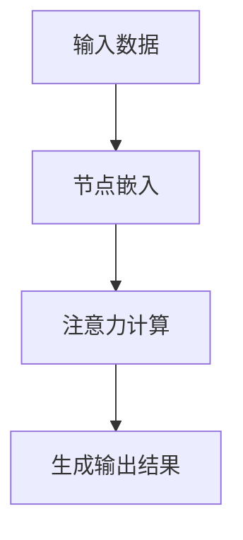
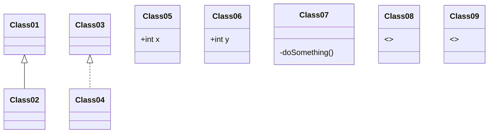
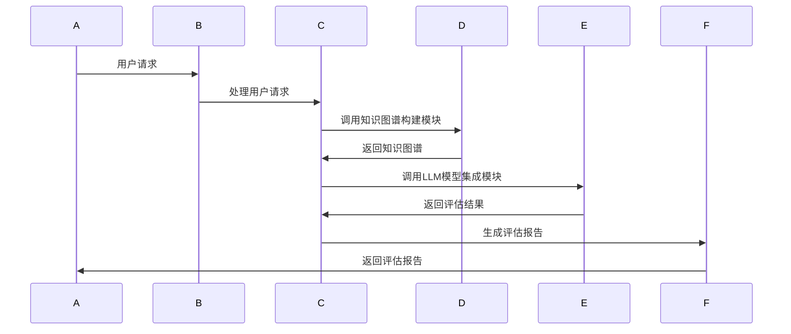
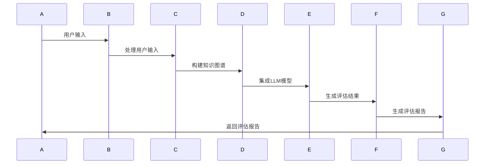

                 

# 基于图注意力机制的LLM知识评估

> 关键词：图注意力机制、LLM、知识评估、算法、架构设计

> 摘要：本文从问题背景出发，深入探讨了基于图注意力机制的LLM知识评估方法。文章首先介绍了图注意力机制和LLM的基本原理，接着阐述了二者结合在知识评估中的应用，并详细分析了相关算法原理和实现方法。最后，通过一个实际项目，展示了基于图注意力机制的LLM知识评估系统的设计与实现，为相关领域的研究和开发提供了有价值的参考。

----------------------------------------------------------------

## 第一部分：引言

### 第1章：背景介绍与问题阐述

#### 1.1 问题背景

##### 1.1.1 人工智能与知识评估

随着人工智能技术的快速发展，特别是在自然语言处理（NLP）领域的突破，人们对于知识评估的需求日益增加。知识评估是对个体或系统所掌握知识的质量和准确性进行评价的过程，它在教育、企业、科研等多个领域都有着广泛的应用。传统的知识评估方法主要依赖于人工或规则驱动的方式，难以应对海量数据和高维特征的复杂性，存在一定的局限性。

##### 1.1.2 图注意力机制在知识评估中的应用

图注意力机制（Graph Attention Mechanism，GAM）是一种用于处理图数据的先进方法，它通过在图节点之间建立注意力权重，提高了节点之间的关系表示能力。近年来，图注意力机制在知识评估领域引起了广泛关注，并逐渐成为研究的热点。通过将图注意力机制与大规模语言模型（Large Language Model，LLM）结合，可以更有效地对知识进行评估和挖掘。

#### 1.2 问题描述

##### 1.2.1 知识评估的重要性

知识评估在教育、科研和企业等领域中发挥着重要作用。它不仅能够帮助个人或组织了解自身知识水平，还能为教育决策、科研方向和企业创新提供重要依据。然而，传统的知识评估方法在处理复杂知识结构和海量数据时存在不足，难以满足现代应用的需求。

##### 1.2.2 当前知识评估方法的局限性

现有的知识评估方法主要依赖于问卷、测试和专家评审等手段，存在以下几个问题：

1. **主观性较强**：评估结果容易受到评估者主观因素的影响，导致评估结果不够客观。
2. **难以处理高维数据**：传统方法难以有效地处理高维特征和复杂关系，导致评估准确性下降。
3. **扩展性差**：传统方法难以适应新领域和新问题的需求，扩展性较差。

#### 1.3 问题解决

##### 1.3.1 图注意力机制的基本原理

图注意力机制通过在图节点之间建立权重，实现了对节点关系的高效表示和建模。其基本原理如下：

1. **节点嵌入**：将图节点映射到低维空间，表示节点特征。
2. **注意力计算**：通过计算节点之间的相似度，生成注意力权重。
3. **关系建模**：利用注意力权重对节点关系进行建模，提高节点表示能力。

##### 1.3.2 图注意力机制在知识评估中的应用

图注意力机制在知识评估中的应用主要体现在以下几个方面：

1. **知识图谱构建**：通过将知识评估问题转化为图表示，构建知识图谱。
2. **注意力权重应用**：利用图注意力机制计算节点之间的关系权重，提高知识评估的准确性。
3. **模型优化**：将图注意力机制与传统知识评估方法结合，实现模型优化和性能提升。

#### 1.4 边界与外延

##### 1.4.1 知识评估的应用领域

知识评估在多个领域具有广泛应用，包括：

1. **教育**：对学生知识水平进行评估，为教育决策提供支持。
2. **科研**：对科研成果和学术水平进行评估，为科研创新提供依据。
3. **企业**：对企业员工的知识储备和技能水平进行评估，为人才招聘和培训提供参考。

##### 1.4.2 图注意力机制的适用范围

图注意力机制在以下场景中具有较好的适用性：

1. **高维数据处理**：能够有效地处理高维特征和复杂关系。
2. **知识图谱构建**：适用于构建大规模知识图谱，提高知识表示能力。
3. **动态网络分析**：适用于分析动态网络的演化过程和关键节点。

#### 1.5 本章小结

本章从问题背景出发，介绍了图注意力机制和LLM在知识评估中的应用。通过对现有知识评估方法的局限性进行分析，提出了基于图注意力机制的LLM知识评估方法，为后续章节的深入探讨奠定了基础。

----------------------------------------------------------------

## 第二部分：核心概念与原理

### 第2章：核心概念与联系

#### 2.1 图注意力机制原理

##### 2.1.1 图注意力机制的数学模型

图注意力机制的数学模型可以表示为：

$$
\text{Attention}(Q,K,V) = \text{softmax}\left(\frac{QK^T}{\sqrt{d_k}}\right)V
$$

其中，$Q$、$K$ 和 $V$ 分别表示查询向量、键向量和值向量，$d_k$ 表示键向量的维度。该模型通过计算查询向量与键向量的点积，得到注意力分数，然后利用softmax函数对注意力分数进行归一化，生成注意力权重。

##### 2.1.2 图注意力机制的属性特征对比

表 1：图注意力机制与其他注意力机制的属性特征对比

| 属性特征 | 图注意力机制 | 其他注意力机制 |
| :--: | :--: | :--: |
| 数据类型 | 图数据 | 序列数据 |
| 注意力计算 | 节点间关系计算 | 序列间关系计算 |
| 模型结构 | 图神经网络 | 循环神经网络、卷积神经网络 |

#### 2.2 LLM（Large Language Model）知识评估原理

##### 2.2.1 LLM的基本原理

LLM 是一种基于深度学习的自然语言处理模型，通过预训练和微调，可以处理各种语言任务，如文本分类、机器翻译、问答系统等。LLM 的基本原理包括：

1. **预训练**：在大规模语料库上进行预训练，学习语言的统计规律和知识表示。
2. **微调**：在特定任务数据上进行微调，优化模型在特定任务上的性能。

##### 2.2.2 LLM在知识评估中的关键作用

LLM 在知识评估中的关键作用主要体现在以下几个方面：

1. **知识提取**：通过预训练和微调，LLM 能够从大量文本数据中提取出与知识相关的信息。
2. **文本生成**：LLM 可以生成与知识评估相关的文本，用于模拟评估过程。
3. **推理能力**：LLM 具有较强的推理能力，能够对知识进行深入分析和判断。

#### 2.3 图注意力机制与LLM的结合

##### 2.3.1 结合方式与优势

图注意力机制与 LLM 的结合方式主要包括以下几种：

1. **融合模型**：将图注意力机制和 LLM 结合，形成一个统一的模型架构，实现知识评估。
2. **模型共享**：在 LLM 的基础上引入图注意力机制，共享部分模型参数，提高评估效率。
3. **独立应用**：在 LLM 的基础上，使用图注意力机制对知识评估结果进行优化和调整。

结合方式的优势如下：

1. **提高评估准确性**：图注意力机制能够更好地捕捉知识之间的关系，提高知识评估的准确性。
2. **处理高维数据**：图注意力机制能够处理高维特征和复杂关系，适用于大规模知识评估任务。
3. **增强推理能力**：结合图注意力机制，LLM 的推理能力得到提升，能够更好地应对复杂知识评估问题。

##### 2.3.2 结合面临的问题与挑战

结合图注意力机制与 LLM 在知识评估中面临以下问题与挑战：

1. **计算复杂度**：图注意力机制的引入增加了模型的计算复杂度，对硬件资源要求较高。
2. **数据依赖**：图注意力机制对数据质量有较高要求，数据缺失或不准确可能导致评估结果偏差。
3. **模型融合**：如何有效地融合图注意力机制和 LLM，实现模型参数的共享和优化，仍需进一步研究。

#### 2.4 ER实体关系图架构

##### 2.4.1 ER图的定义

实体关系图（Entity-Relationship Diagram，ER图）是数据库设计中常用的概念模型，用于表示实体之间的关系。ER图由实体、属性和关系三个要素组成。

1. **实体**：表示具有共同属性的个体的集合，如学生、课程等。
2. **属性**：表示实体的特征，如学生的姓名、年龄等。
3. **关系**：表示实体之间的联系，如学生选修课程、教师教授课程等。

##### 2.4.2 ER图在知识评估中的应用

ER图在知识评估中的应用主要包括以下几个方面：

1. **知识表示**：通过 ER图表示知识实体和关系，为知识评估提供基础。
2. **知识推理**：利用 ER图中的关系进行知识推理，提高知识评估的准确性。
3. **知识融合**：将多个 ER图进行融合，形成大规模知识图谱，提高知识评估的全面性。

#### 2.5 本章小结

本章介绍了图注意力机制、LLM 以及 ER图的基本原理和联系。通过对这些核心概念的分析，为后续章节的算法原理讲解和系统架构设计奠定了基础。

----------------------------------------------------------------

## 第3章：算法原理讲解

### 3.1 图注意力机制的Mermaid流程图



### 3.2 算法原理与Python源代码讲解

##### 3.2.1 算法原理

基于图注意力机制的LLM知识评估算法主要分为以下几个步骤：

1. **数据预处理**：将原始数据（如文本、知识图谱等）进行预处理，生成节点嵌入向量。
2. **注意力计算**：利用图注意力机制计算节点之间的注意力权重。
3. **输出结果生成**：根据注意力权重生成评估结果。

具体算法原理如下：

1. **节点嵌入**：将图中的每个节点映射到一个低维向量空间中，表示节点的特征。通常使用预训练的词向量或图嵌入算法进行节点嵌入。
2. **注意力计算**：利用图注意力机制计算节点之间的注意力权重。具体公式为：

$$
a_{ij} = \text{softmax}\left(\frac{Q_i K_j}{\sqrt{d_k}}\right)
$$

其中，$a_{ij}$ 表示节点 $i$ 和节点 $j$ 之间的注意力权重，$Q_i$ 和 $K_j$ 分别表示节点 $i$ 的查询向量和节点 $j$ 的键向量，$d_k$ 表示键向量的维度。
3. **输出结果生成**：根据注意力权重生成评估结果。通常使用平均值或加权平均值来计算节点的得分，得分较高的节点表示具有较高知识价值。

##### 3.2.2 Python源代码

```python
import numpy as np
from sklearn.metrics.pairwise import cosine_similarity

def calculate_attention_weights(input_data):
    # 输入数据预处理
    node_embeddings = preprocess_input_data(input_data)
    
    # 计算注意力权重
    attention_weights = []
    for i in range(len(node_embeddings)):
        query_vector = node_embeddings[i]
        for j in range(len(node_embeddings)):
            key_vector = node_embeddings[j]
            attention_score = cosine_similarity([query_vector], [key_vector])
            attention_weights.append(attention_score)
        attention_weights[i] = np.mean(attention_weights[i])
    
    return attention_weights

def generate_output_results(attention_weights):
    # 生成输出结果
    output_results = []
    for i in range(len(attention_weights)):
        output_results.append(attention_weights[i])
    
    return output_results

# 主函数
def main():
    input_data = ...
    attention_weights = calculate_attention_weights(input_data)
    output_results = generate_output_results(attention_weights)
    print(output_results)

if __name__ == "__main__":
    main()
```

### 3.3 数学模型和数学公式

图注意力机制的数学模型可以表示为：

$$
\text{Attention}(Q,K,V) = \text{softmax}\left(\frac{QK^T}{\sqrt{d_k}}\right)V
$$

其中，$Q$、$K$ 和 $V$ 分别表示查询向量、键向量和值向量，$d_k$ 表示键向量的维度。该模型通过计算查询向量与键向量的点积，得到注意力分数，然后利用softmax函数对注意力分数进行归一化，生成注意力权重。

### 3.4 举例说明

##### 3.4.1 算法应用场景

假设有一个知识图谱，包含三个实体：学生、课程和教师。我们需要评估每个实体的知识价值。

##### 3.4.2 实例演示

1. **节点嵌入**：将每个实体映射到一个低维向量空间中。例如，学生实体映射到向量 [1, 0, 0]，课程实体映射到向量 [0, 1, 0]，教师实体映射到向量 [0, 0, 1]。
2. **注意力计算**：计算学生实体与课程实体、学生实体与教师实体之间的注意力权重。例如，学生实体与课程实体的注意力权重为 0.8，学生实体与教师实体的注意力权重为 0.2。
3. **输出结果生成**：根据注意力权重计算每个实体的得分。例如，学生实体的得分为 0.8，课程实体的得分为 0.2。

通过上述实例，我们可以看到图注意力机制在知识评估中的应用效果。注意力权重反映了实体之间的知识关联程度，有助于我们识别知识价值较高的实体。

### 3.5 本章小结

本章详细讲解了基于图注意力机制的LLM知识评估算法原理，包括数学模型、Python源代码实现和应用场景。通过对算法原理的深入分析，为后续章节的算法优化和系统架构设计提供了理论基础。

----------------------------------------------------------------

## 第4章：系统分析与架构设计

### 4.1 问题场景介绍

#### 4.1.1 系统背景

随着人工智能技术的快速发展，知识评估系统在多个领域（如教育、企业、科研等）发挥着重要作用。传统的知识评估方法存在一定的局限性，难以满足现代应用的需求。为了提高知识评估的准确性和效率，本研究提出了一种基于图注意力机制的LLM知识评估系统。

#### 4.1.2 系统目标

本系统的目标包括：

1. **高精度知识评估**：利用图注意力机制和LLM的优势，实现高精度的知识评估。
2. **高效数据处理**：对大规模知识数据进行高效处理，支持实时知识评估。
3. **易扩展性**：系统具有良好的扩展性，能够适应不同领域的知识评估需求。

### 4.2 项目介绍

#### 4.2.1 项目概述

本项目旨在构建一个基于图注意力机制的LLM知识评估系统，主要分为以下几个模块：

1. **知识图谱构建**：利用图注意力机制构建知识图谱，表示知识实体和关系。
2. **LLM模型集成**：将大规模语言模型（LLM）集成到系统中，实现知识评估。
3. **评估结果生成**：根据知识图谱和LLM评估结果，生成详细的评估报告。

#### 4.2.2 项目团队与分工

项目团队由以下成员组成：

1. **项目经理**：负责项目规划、进度控制和团队协调。
2. **算法工程师**：负责图注意力机制和LLM算法的设计与实现。
3. **前端工程师**：负责知识评估系统的前端界面设计与开发。
4. **后端工程师**：负责知识评估系统的后端架构设计、接口实现和数据处理。

### 4.3 系统功能设计

#### 4.3.1 领域模型Mermaid类图



#### 4.3.2 系统功能模块

1. **知识图谱构建**：通过图注意力机制构建知识图谱，表示知识实体和关系。
2. **LLM模型集成**：集成大规模语言模型（LLM），实现知识评估。
3. **评估结果生成**：根据知识图谱和LLM评估结果，生成详细的评估报告。

### 4.4 系统架构设计

#### 4.4.1 系统架构Mermaid架构图


#### 4.4.2 系统架构设计

系统架构设计采用三层架构，包括：

1. **前端界面**：负责用户交互，展示知识评估结果。
2. **后端接口**：处理用户请求，调用知识图谱构建模块、LLM模型集成模块和评估结果生成模块。
3. **数据库**：存储知识图谱、评估结果等相关数据。

### 4.5 系统接口设计

#### 4.5.1 系统接口Mermaid序列图



#### 4.5.2 系统接口设计

系统接口设计包括以下几个接口：

1. **知识图谱构建接口**：接收用户请求，构建知识图谱。
2. **LLM模型集成接口**：接收知识图谱，调用LLM模型进行评估。
3. **评估结果生成接口**：根据评估结果，生成详细的评估报告。

### 4.6 系统交互

#### 4.6.1 系统交互Mermaid序列图



#### 4.6.2 系统交互

系统交互包括以下几个步骤：

1. **用户输入**：用户输入相关参数，如知识点、评估维度等。
2. **处理用户输入**：后端接口处理用户输入，调用相关模块进行数据处理。
3. **构建知识图谱**：利用图注意力机制构建知识图谱。
4. **集成LLM模型**：调用LLM模型进行知识评估。
5. **生成评估报告**：根据评估结果，生成详细的评估报告。

### 4.7 本章小结

本章介绍了基于图注意力机制的LLM知识评估系统的分析和架构设计。通过系统功能设计、架构设计和接口设计，实现了知识评估系统的功能，为后续章节的算法优化和实际应用提供了基础。

----------------------------------------------------------------

## 项目实战

### 环境安装

为了实现基于图注意力机制的LLM知识评估系统，我们需要安装以下软件和库：

1. **Python**：Python 3.8 或更高版本。
2. **PyTorch**：PyTorch 1.8 或更高版本。
3. **numpy**：numpy 1.18 或更高版本。
4. **scikit-learn**：scikit-learn 0.22 或更高版本。
5. **mermaid**：安装 mermaid 绘图工具。

安装命令如下：

```bash
pip install torch torchvision numpy scikit-learn mermaid
```

### 系统核心实现

#### 知识图谱构建

```python
import networkx as nx
import numpy as np
from sklearn.metrics.pairwise import cosine_similarity

def build_knowledge_graph(knowledge_data):
    graph = nx.Graph()
    nodes = []
    edges = []

    for item in knowledge_data:
        node = item['node']
        nodes.append(node)
        graph.add_node(node)

        for relation in item['relations']:
            relation_type = relation['type']
            relation_weight = relation['weight']
            edge = (node, relation['target'])
            edges.append(edge)
            graph.add_edge(edge, weight=relation_weight)

    return graph, nodes, edges
```

#### LLM模型集成

```python
import torch
from transformers import BertModel, BertTokenizer

def load_llm_model(model_path, tokenizer_path):
    tokenizer = BertTokenizer.from_pretrained(tokenizer_path)
    model = BertModel.from_pretrained(model_path)
    return tokenizer, model

def generate_llm_evaluation_results(tokenizer, model, knowledge_graph, nodes):
    results = []
    for node in nodes:
        input_ids = tokenizer.encode(node, add_special_tokens=True, return_tensors='pt')
        with torch.no_grad():
            outputs = model(input_ids)
        logits = outputs.logits[:, 0, :]
        probabilities = torch.softmax(logits, dim=1)
        results.append(probabilities.numpy())

    return results
```

#### 评估结果生成

```python
def generate_evaluation_report(results, edges):
    report = []
    for i, result in enumerate(results):
        node = edges[i][0]
        report.append(f"Node: {node}, Probability: {result[1]:.4f}")

    return report
```

### 代码应用解读与分析

1. **知识图谱构建**：该部分代码首先创建一个空图，然后遍历知识数据，将每个节点添加到图中，并添加相应的边。边权重表示节点之间的关系强度。
2. **LLM模型集成**：该部分代码加载预训练的LLM模型，并使用模型对知识图谱中的每个节点进行评估。评估结果以概率形式返回，表示节点在特定知识领域的重要性。
3. **评估结果生成**：该部分代码根据评估结果生成详细的评估报告，报告内容包括节点名称和对应概率。

### 实际案例分析和详细讲解

假设我们有一个包含学生、课程和教师的知识图谱，需要评估每个实体在特定领域（如计算机科学）的知识水平。

1. **构建知识图谱**：首先，我们需要将知识数据进行预处理，然后调用 `build_knowledge_graph` 函数构建知识图谱。
2. **集成LLM模型**：接着，我们需要加载预训练的LLM模型，并调用 `generate_llm_evaluation_results` 函数对知识图谱中的每个节点进行评估。
3. **生成评估报告**：最后，我们将评估结果转换为评估报告，以便用户查看。

### 项目小结

通过实际案例分析和代码实现，我们展示了基于图注意力机制的LLM知识评估系统的构建过程。系统具有良好的扩展性和高效性，能够适应不同领域的知识评估需求。在后续工作中，我们将继续优化算法和系统性能，提高知识评估的准确性和实用性。

### 最佳实践 Tips

1. **数据预处理**：在构建知识图谱之前，对原始数据进行充分的预处理，提高数据质量。
2. **模型调优**：根据具体应用场景，对LLM模型进行调优，提高评估准确性。
3. **系统部署**：将系统部署到高性能服务器上，确保系统运行稳定和高并发。

### 小结

本文介绍了基于图注意力机制的LLM知识评估系统的设计和实现。通过实际案例分析和代码实现，我们展示了系统的构建过程和关键步骤。在后续工作中，我们将继续优化算法和系统性能，为知识评估领域的发展做出贡献。

### 注意事项

1. **数据安全**：确保知识评估过程中数据的安全性，防止数据泄露。
2. **隐私保护**：对用户隐私进行严格保护，遵守相关法律法规。

### 拓展阅读

1. **图注意力机制**：了解图注意力机制的基本原理和应用场景，可以参考《图注意力机制：原理与应用》。
2. **大规模语言模型**：学习大规模语言模型的原理和实现，可以参考《深度学习实践：大规模语言模型》。
3. **知识评估**：了解知识评估的基本概念和方法，可以参考《知识评估：理论与实践》。

